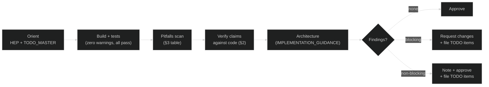

# Code Review Guidance

**Purpose:** Principles, pitfalls, and a lightweight review checklist.
Technical details (build commands, file locations, concurrency patterns, API contracts)
live in **`CLAUDE.md`**, **`docs/IMPLEMENTATION_GUIDANCE.md`**, and the **`docs/HEP/`**
documents. This document cites those — it does not repeat them.

**Before starting a review:** check `docs/TODO_MASTER.md` (sprint status) and read the
HEP for the changed component.

---

## 1. Principles

### 1.1 Code Is the Authority

Documentation describes intent; code is the truth. Every claim in a HEP or design doc
must be traceable to actual source. See §2 (Design Verification Rule) for the format.

### 1.2 Piecemeal Trust

Do not approve because "it looks similar to existing code." Review boundary conditions
and error paths, not just the happy path. In security-sensitive areas (crypto, IPC
identity, admin auth, SHM access) apply extra scrutiny regardless of change size.

### 1.3 Completeness Over Speed

- Config field parsed but not wired → silent no-op. Require completion or removal.
- Public method that throws `std::runtime_error("not implemented")` → must be documented
  and tracked in `docs/todo/`. Do not ship unmarked.
- Struct field declared but never written or read → dead code. Remove or explain.

### 1.4 Duplication Is Debt

Identical logic in two places means two places to break. Flag duplicate conversions,
control-flow patterns, and validation logic. File a TODO if refactor is deferred.

---

## 2. Design Verification Rule (Mandatory)

**Rule:** All API and design claims in documentation MUST be verified against actual code.

- [ ] Claims traced to source (file, function, relevant branches) — not "the doc says so"
- [ ] Implemented behavior marked `- [x]` with a code reference (file:line or function)
- [ ] Unverified claims marked `- [ ] Not yet verified` until traced
- [ ] Doc/code disagreement resolved: update the doc (or fix the code and update the doc)

**Checkpoint format** (for design docs):

```markdown
- [x] **Verified** – Producer stores schema hash in header.
  - Code: data_block.cpp create_datablock_producer_impl() lines 3069–3095.
```

---

## 3. Known Pitfalls (Project-Specific)

Real patterns that have surfaced in this codebase. Full detail (with code examples) is
in **`docs/IMPLEMENTATION_GUIDANCE.md`** § "Common Pitfalls and Solutions".

| Pitfall | Short summary | Full detail |
|---|---|---|
| **Config field not wired** | Field parsed from JSON, never consumed by runtime (silent no-op) | IMPL_GUIDANCE Pitfall 12; MESSAGEHUB_TODO.md |
| **API throws at runtime** | Public method callable but throws "not implemented" | IMPL_GUIDANCE Pitfall 13; MEMORY_LAYOUT_TODO.md |
| **Auth after parse** | Large input exhausts memory before auth check fires | IMPL_GUIDANCE Pitfall 14; MESSAGEHUB_TODO.md |
| **Dead struct field** | Declared, never written or read | MESSAGEHUB_TODO.md (`PyExecResult::result_repr`) |
| **Dead module variable** | Written in startup, never read by any code | MESSAGEHUB_TODO.md (`g_py_initialized`) |
| **Incomplete dispatcher** | Callback registry omits some lifecycle hooks | MESSAGEHUB_TODO.md (`_registered_roles`) |
| **Duplicate conversion** | Same enum↔string in two files — risk of drift | API_TODO.md (ChannelPattern); IMPL_GUIDANCE §Deferred refactoring |
| **HEP/code signature mismatch** | Doc says `void`, impl returns `bool` | HEP-CORE-0006 `send_ctrl` (fixed 2026-02-21) |
| **`std::atomic<T>` in POD struct** | GCC passes, MSVC fails — not portable | HEP-CORE-0007 §9 (full analysis) |
| **pImpl destructor not in `.cpp`** | `unique_ptr<Impl>` requires complete type | IMPL_GUIDANCE §pImpl |
| **Shallow schema validation** | Arbitrary strings pass typed-field validation | MESSAGEHUB_TODO.md (actor schema) |

---

## 4. Review Checklist

**Meta checks** (code and tests must pass — use CLAUDE.md for exact commands):

- [ ] Build completes with zero warnings
- [ ] Full test suite passes (no regressions from the 426-test baseline)
- [ ] Relevant HEP read; change aligns with spec or HEP is updated

**Project-specific pitfall checks** (see §3 for detail; IMPL_GUIDANCE for code examples):

- [ ] New config field: parsed AND consumed by runtime (no silent no-op)
- [ ] New public API: no unguarded runtime throw; tracked in TODO if deferred
- [ ] New struct field: confirmed write site and read site
- [ ] New callback registry: all lifecycle hooks listed (on_init, on_stop, etc.)
- [ ] New conversion function: not already duplicated elsewhere in codebase
- [ ] HEP/header signature matches actual implementation
- [ ] `DataBlockT` / `FlexZoneT` struct: plain POD types only (no `std::atomic<T>`)
- [ ] pImpl class: destructor defined in `.cpp`
- [ ] External input entry point: size bounded before parse; auth before body
- [ ] C API tests preserved: never delete `test_slot_rw_coordinator` or `test_recovery_api`

**Architecture checks** — see **`docs/IMPLEMENTATION_GUIDANCE.md`** § "Before Submitting PR"
for the full checklist covering pImpl, layers, ABI, concurrency, `[[nodiscard]]`, and
`noexcept` correctness.

---

## 5. Workflow



---

**Revision History**

- **2026-02-21:** Restructured — technical details removed (now cited not repeated);
  principles in §1; design verification rule inlined (§2, from archived DESIGN_VERIFICATION_RULE.md);
  pitfalls condensed to reference table (§3); checklist trimmed to non-IMPL_GUIDANCE items.
- **Draft (2026-02-13):** Initial draft framework.
