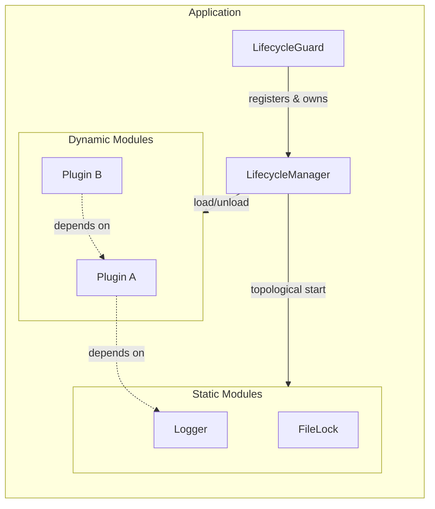
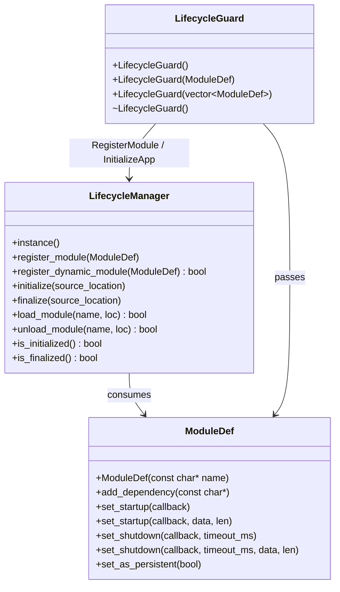
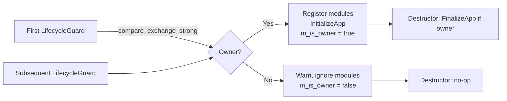
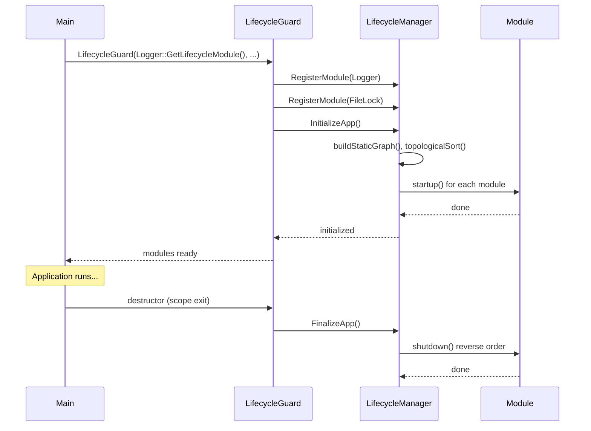
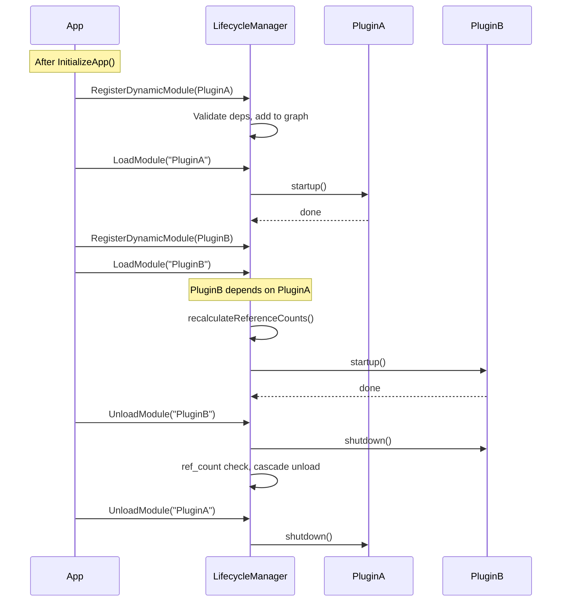

# HEP-CORE-0001: A Hybrid (Static & Dynamic) Module Lifecycle

| Property         | Value                                          |
| ---------------- | ---------------------------------------------- |
| **HEP**          | `HEP-CORE-0001`                                |
| **Title**        | A Hybrid (Static & Dynamic) Module Lifecycle   |
| **Author**       | Quan Qing, AI assistant                        |
| **Status**       | Implementation Ready                           |
| **Category**     | Core                                           |
| **Created**      | 2026-01-05                                     |
| **Updated**      | 2026-02-12                                     |
| **C++-Standard** | C++20                                           |

---

## Implementation status

All described APIs are implemented in `src/include/utils/lifecycle.hpp`, `src/include/utils/module_def.hpp`, and `src/utils/lifecycle.cpp`. Static and dynamic modules, `LifecycleGuard` (single/multiple/vector constructors), `MakeModDefList`, and all convenience functions are in use. For current plan and priorities elsewhere, see `docs/DATAHUB_TODO.md`.

---

## Abstract

This HEP specifies the **LifecycleManager**: a dependency-aware startup/shutdown system that supports **static** modules (registered before init, started once) and **dynamic** modules (registered after init, load/unload at runtime). It provides a single dependency graph, topological ordering, and optional reference counting for dynamic modules.

---

## Motivation

| Use Case | Description |
|----------|-------------|
| **Core services** | Logger, FileLock, etc. — started once with the application |
| **Optional / heavy features** | Load on demand; unload when ref_count drops to zero |
| **Plugin systems** | Third-party extensions registered and loaded after static core is up |
| **Mode-specific code** | Different tool sets for "Editing" vs "Playback" without restart |

---

## Design philosophy

### Goals

| Goal | Description |
|------|-------------|
| **Unified dependency graph** | Static and dynamic modules in one graph; topological sort determines start order |
| **Graceful failure** | Dynamic load failures return `false`; invalid names throw or return false |
| **Strict ordering** | Dynamic modules registered only *after* static init; static cannot depend on dynamic |
| **Reference counting** | Dynamic modules unload only when ref_count drops to zero (unless persistent) |
| **ABI stability** | Pimpl for `LifecycleManager` and `ModuleDef`; public API remains stable |

### Constraints

- **Module registration is NOT thread-safe** — must occur before `initialize()`.
- **Dynamic load/unload IS thread-safe** — protected by internal mutex.
- **RecursionGuard** prevents re-entrant calls from startup/shutdown callbacks (deadlock prevention).
- **Static modules cannot depend on dynamic modules**; dynamic may depend on static.

---

## Architecture overview

### Component diagram



### Class and API relationships



### LifecycleGuard owner semantics



Only the **first** `LifecycleGuard` to be constructed becomes the owner (registers modules and calls `InitializeApp`). Its destructor calls `FinalizeApp`. Any later guard is a no-op for registration and finalization.

---

## Public API reference

### LifecycleManager

| Method | Signature | Description |
|--------|-----------|-------------|
| `instance` | `static LifecycleManager& instance()` | Singleton accessor |
| `register_module` | `void register_module(ModuleDef&&)` | Register static module; must be called *before* `initialize()` |
| `register_dynamic_module` | `bool register_dynamic_module(ModuleDef&&)` | Register dynamic module; valid *after* `initialize()`, *before* `finalize()`. Returns false on failure (e.g. duplicate name, missing dependency). |
| `initialize` | `void initialize(std::source_location loc)` | Start all static modules in dependency order. Idempotent. |
| `finalize` | `void finalize(std::source_location loc)` | Shut down all modules in reverse order. Idempotent. |
| `load_module` | `bool load_module(const char* name, std::source_location loc)` | Load dynamic module and dependencies. Thread-safe, idempotent. Returns false if invalid name or load failed. Must not be called from startup/shutdown callback. |
| `unload_module` | `bool unload_module(const char* name, std::source_location loc)` | Unload dynamic module if ref_count is zero; runs shutdown, may cascade. Returns false if still in use. Must not be called from startup/shutdown callback. |
| `is_initialized` | `bool is_initialized()` | True if `initialize()` has been called |
| `is_finalized` | `bool is_finalized()` | True if `finalize()` has been called |

### ModuleDef

| Method | Signature | Description |
|--------|-----------|-------------|
| Constructor | `explicit ModuleDef(const char* name)` | Unique module name. C-string null-terminated, length ≤ `MAX_MODULE_NAME_LEN` (256). Throws `std::invalid_argument` / `std::length_error` if invalid. |
| `add_dependency` | `void add_dependency(const char* dependency_name)` | Add dependency by name. Null or oversized throws. |
| `set_startup` | `void set_startup(LifecycleCallback startup_func)` | Startup callback (no argument; `nullptr` passed). |
| `set_startup` | `void set_startup(LifecycleCallback startup_func, const char* data, size_t len)` | Startup callback with string argument. `len` must not exceed `MAX_CALLBACK_PARAM_STRLEN` (1024). |
| `set_shutdown` | `void set_shutdown(LifecycleCallback shutdown_func, unsigned int timeout_ms)` | Shutdown callback and timeout in milliseconds. |
| `set_shutdown` | `void set_shutdown(..., const char* data, size_t len)` | Shutdown callback with string argument. |
| `set_as_persistent` | `void set_as_persistent(bool persistent = true)` | Dynamic module: if persistent, not unloaded when ref_count reaches zero; only on finalize. |

**Constants**

| Constant | Value | Description |
|----------|-------|-------------|
| `ModuleDef::MAX_MODULE_NAME_LEN` | 256 | Max length (excluding null) for module and dependency names |
| `ModuleDef::MAX_CALLBACK_PARAM_STRLEN` | 1024 | Max length for callback string arguments |

**Callback type:** `typedef void (*LifecycleCallback)(const char* arg);` — C-style for ABI stability; `arg` may be `nullptr` when no data provided.

### LifecycleGuard

| Constructor | Description |
|-------------|-------------|
| `LifecycleGuard(std::source_location loc = ...)` | No modules; if first guard, calls `InitializeApp()` only |
| `explicit LifecycleGuard(ModuleDef&& module, std::source_location loc = ...)` | Single module; if owner, registers it and calls `InitializeApp()` |
| `explicit LifecycleGuard(std::vector<ModuleDef>&& modules, std::source_location loc = ...)` | Multiple modules; if owner, registers all and calls `InitializeApp()` |

Destructor: if this guard is the owner (`m_is_owner`), calls `FinalizeApp(loc)`. Non-copyable, non-movable.

### Convenience functions

| Function | Wrapper for | Notes |
|----------|-------------|--------|
| `RegisterModule(ModuleDef&&)` | `LifecycleManager::instance().register_module()` | Preferred for static registration |
| `InitializeApp(loc)` | `LifecycleManager::instance().initialize(loc)` | Default `loc = std::source_location::current()` |
| `FinalizeApp(loc)` | `LifecycleManager::instance().finalize(loc)` | |
| `IsAppInitialized()` | `LifecycleManager::instance().is_initialized()` | |
| `IsAppFinalized()` | `LifecycleManager::instance().is_finalized()` | |
| `RegisterDynamicModule(ModuleDef&&)` | `LifecycleManager::instance().register_dynamic_module()` | Returns bool |
| `LoadModule(name, loc)` | `LifecycleManager::instance().load_module()` | Returns bool |
| `UnloadModule(name, loc)` | `LifecycleManager::instance().unload_module()` | Returns bool |

### MakeModDefList

| Function | Description |
|----------|-------------|
| `MakeModDefList(Mods&&... mods)` | Builds `std::vector<ModuleDef>` from one or more `ModuleDef` rvalues. Use with `LifecycleGuard(std::move(vec))` or `LifecycleGuard(MakeModDefList(Logger::GetLifecycleModule(), FileLock::GetLifecycleModule()))`. |

---

## Internal implementation details

(Not part of the stable API; may change.)

### Graph node (conceptual)

```cpp
struct InternalGraphNode {
    std::string name;
    std::function<void()> startup;
    InternalModuleShutdownDef shutdown;
    std::vector<std::string> dependencies;
    std::vector<InternalGraphNode*> dependents;
    std::atomic<ModuleStatus> status;
    bool is_dynamic = false;
    bool is_persistent = false;
    std::atomic<DynamicModuleStatus> dynamic_status;
    std::atomic<int> ref_count;
};

enum class DynamicModuleStatus { UNLOADED, LOADING, LOADED, FAILED };
```

Cycle detection during `load_module` uses `LOADING` to detect recursive load.

---

## Sequence of operations

### Static module lifecycle



### Dynamic module load / unload



---

## Examples

### Static modules (LifecycleGuard + MakeModDefList)

```cpp
#include "plh_service.hpp"

int main() {
    pylabhub::utils::LifecycleGuard app_lifecycle(
        pylabhub::utils::MakeModDefList(
            pylabhub::utils::Logger::GetLifecycleModule(),
            pylabhub::utils::FileLock::GetLifecycleModule()
        )
    );

    LOGGER_INFO("Application started.");
    // ... application logic ...
    return 0;  // FinalizeApp() called automatically
}
```

### Dynamic module

```cpp
namespace MyPlugin {
    void startup(const char*) { LOGGER_INFO("MyPlugin started"); }
    void shutdown(const char*) { LOGGER_INFO("MyPlugin shut down"); }

    pylabhub::utils::ModuleDef GetLifecycleModule() {
        pylabhub::utils::ModuleDef def("MyPlugin");
        def.add_dependency("Logger");
        def.set_startup(startup);
        def.set_shutdown(shutdown, 1000);
        return def;
    }
}

int main() {
    pylabhub::utils::LifecycleGuard app_lifecycle(
        pylabhub::utils::Logger::GetLifecycleModule()
    );

    if (pylabhub::utils::RegisterDynamicModule(MyPlugin::GetLifecycleModule())) {
        if (pylabhub::utils::LoadModule("MyPlugin")) {
            // Use plugin...
            pylabhub::utils::UnloadModule("MyPlugin");
        }
    }
    return 0;
}
```

---

## Risk analysis and mitigations

| Risk | Mitigation |
|------|------------|
| Client forgets `unload_module()` | Resource leak for session; `finalize()` provides last-resort cleanup |
| Dependency loop between dynamic modules | `load_module` checks `LOADING` status to detect cycles |
| Callback calls `load_module`/`unload_module` | RecursionGuard detects and blocks (prevents deadlock) |
| Concurrent graph mutations | Internal mutex serializes all dynamic operations |
| Static object destructors after FinalizeApp | Documented: avoid destructors of static objects depending on lifecycle services |

---

## Copyright

This document is placed in the public domain or under the CC0-1.0-Universal license, whichever is more permissive.
