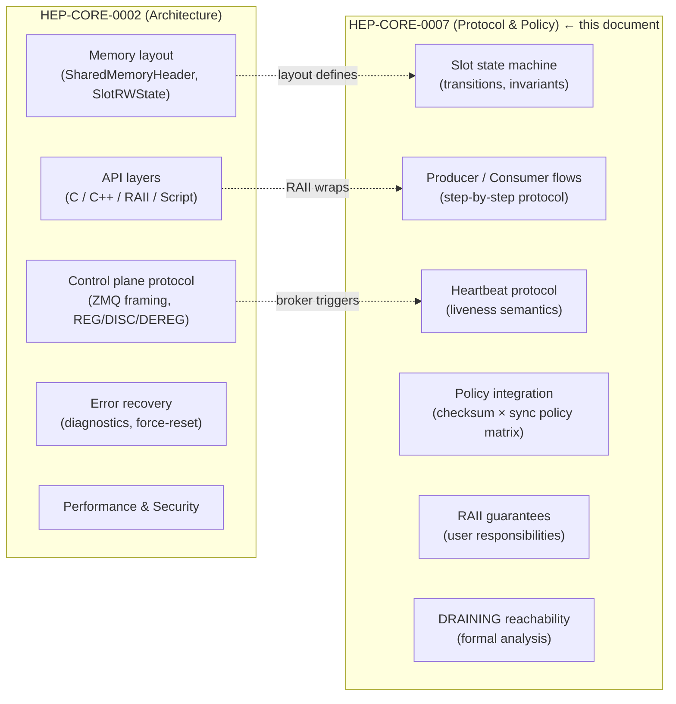
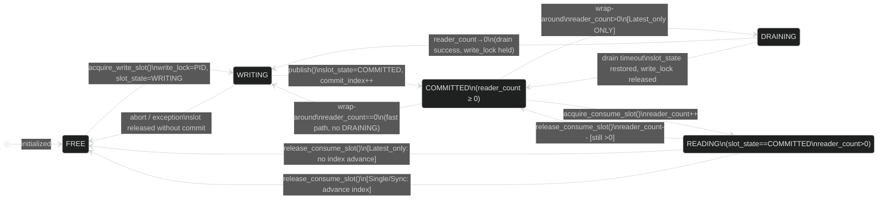
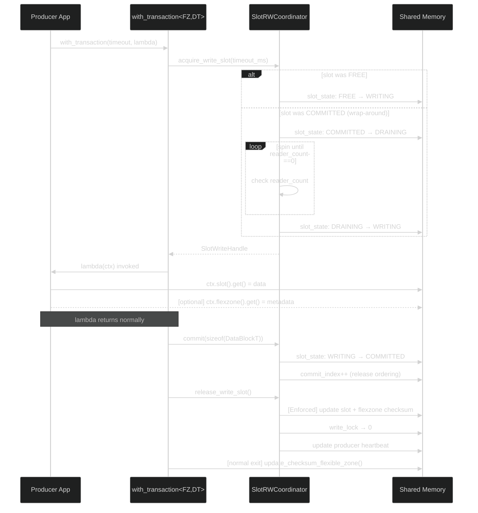
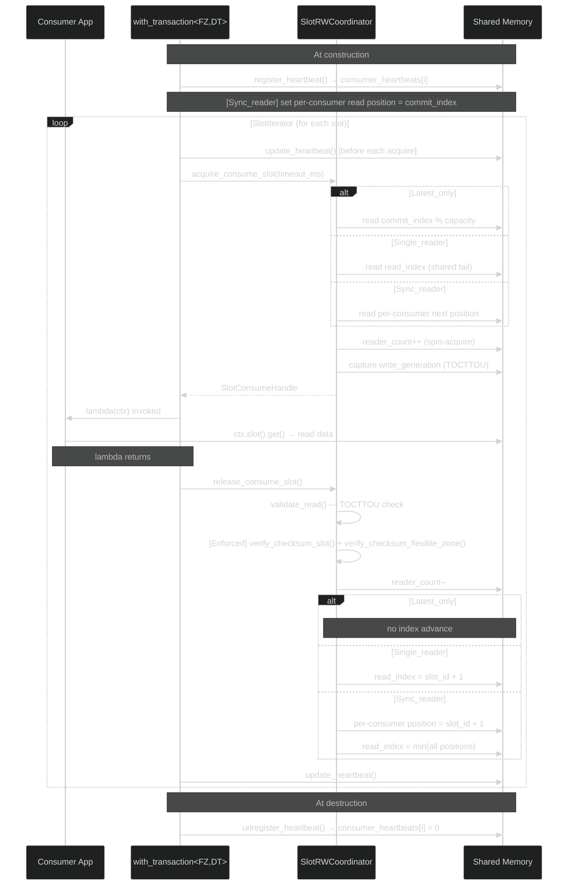
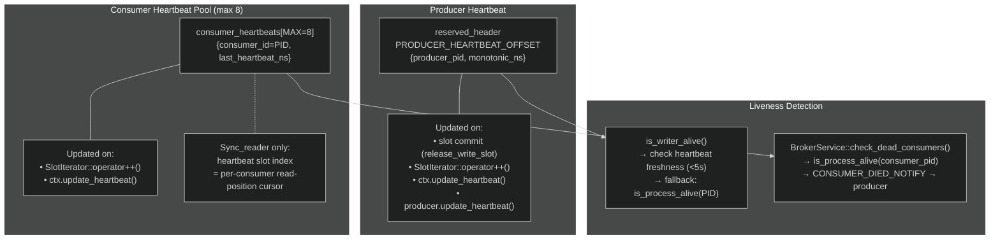
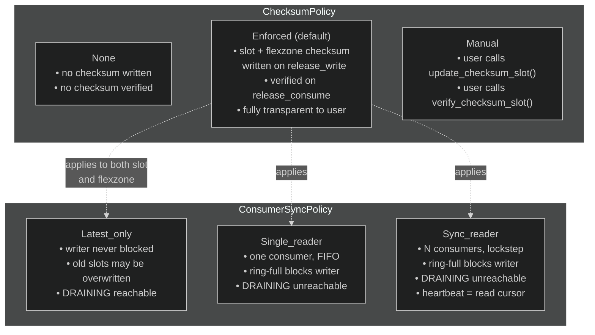
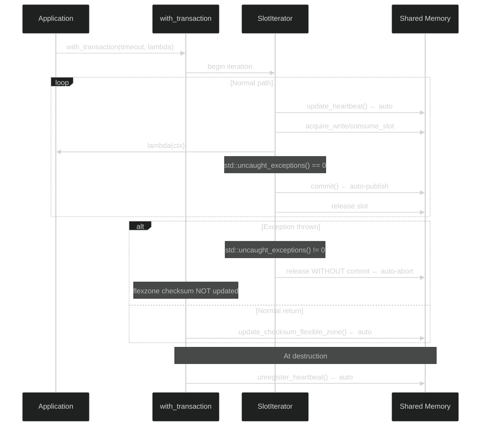
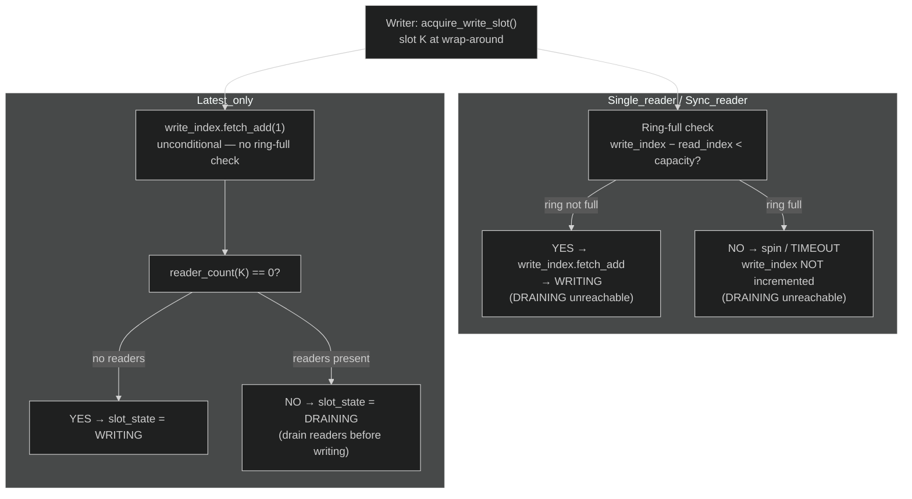

# HEP-CORE-0007: DataHub Protocol and Policy Reference

| Property         | Value                                                      |
| ---------------- | ---------------------------------------------------------- |
| **HEP**          | `HEP-CORE-0007`                                            |
| **Title**        | DataHub Protocol and Policy Reference                      |
| **Author**       | Quan Qing, AI assistant                                    |
| **Status**       | ✅ Active — canonical reference (promoted 2026-02-21)      |
| **Category**     | Core                                                       |
| **Created**      | 2026-02-15                                                 |
| **Promoted**     | 2026-02-21 (was `docs/DATAHUB_PROTOCOL_AND_POLICY.md`)     |
| **Depends-on**   | HEP-CORE-0002 (DataHub), HEP-CORE-0006 (Slot-Processor)   |

This document is the **authoritative reference for slot-level protocol correctness**, policy
semantics, RAII layer guarantees, and user responsibilities. It covers the **slot-level
state machine**, producer/consumer protocol flows, FlexZone access semantics, DRAINING
policy, and user-facing RAII contracts.

**Scope split with HEP-CORE-0002:**



Update this document whenever protocol or policy behavior changes.

---

## Table of Contents

1. [Slot State Machine](#1-slot-state-machine)
2. [Protocol Flow — Producer](#2-protocol-flow--producer)
3. [Protocol Flow — Consumer](#3-protocol-flow--consumer)
4. [Heartbeat Protocol](#4-heartbeat-protocol)
5. [Policy Integration Table](#5-policy-integration-table)
6. [RAII Layer Guarantees](#6-raii-layer-guarantees)
7. [Explicit Control Points](#7-explicit-control-points-user-callable)
8. [User Responsibilities](#8-what-users-are-responsible-for)
9. [FlexZone and DataBlock Type Requirements](#9-flexzone-and-datablock-type-requirements)
10. [Invariants the System Maintains](#10-invariants-the-system-maintains)
11. [DRAINING Reachability by ConsumerSyncPolicy](#11-draining-reachability-by-consumersyncpolicy)

---

## 1. Slot State Machine

Each ring-buffer slot transitions through the following states. The state machine is enforced
by atomic operations in `SlotRWState`. `READING` is not a distinct `slot_state` value — it
is the logical overlay where `slot_state == COMMITTED` and `reader_count > 0`.



**State definitions:**
- `FREE` — available for writing; `write_lock == 0`
- `WRITING` — producer holds write_lock (PID-based); `slot_state == WRITING`
- `COMMITTED / READY` — data visible to consumers; `slot_state == COMMITTED`; `commit_index` advanced
- `READING` — consumer holds read lock (`reader_count > 0`); `slot_state` stays `COMMITTED`
- `DRAINING` — write_lock held; producer draining in-progress readers before writing. Entered
  when `acquire_write` wraps around a previously `COMMITTED` slot. New readers are rejected
  (`slot_state != COMMITTED → NOT_READY`). On drain success: → `WRITING`. On drain timeout:
  `slot_state` restored to `COMMITTED` (last data still valid); `write_lock` released.

> **Scope note:** For the `SlotRWState` memory layout and the C-API function signatures, see
> **HEP-CORE-0002 §3.3** and **§4.2**.

---

## 2. Protocol Flow — Producer



**Exception path:**
- If an exception propagates through `SlotIterator`, `std::uncaught_exceptions() != 0`,
  so auto-publish is skipped — slot is released without commit (`slot_state → FREE`).
- If an exception propagates through `with_transaction`, the flexzone checksum is NOT
  updated — leaving the stored checksum inconsistent with any partial flexzone writes.
  This is intentional: the checksum mismatch signals to consumers that the flexzone state
  is unreliable until the producer recovers and exits `with_transaction` normally.

**Step-by-step detail:**

```
1. acquire_write_slot(timeout_ms)
     → spin-acquire write_lock (PID-based CAS)
     → if previous slot_state == COMMITTED (wrap-around):
         → slot_state: COMMITTED → DRAINING  (new readers see non-COMMITTED → reject fast)
         → spin until reader_count == 0  (existing readers drain naturally)
         → on drain timeout: slot_state restored to COMMITTED; write_lock released → return nullptr
         → on drain success: slot_state: DRAINING → WRITING
     → if previous slot_state == FREE: slot_state: FREE → WRITING  (no readers possible)
     → returns SlotWriteHandle (or nullptr on timeout)
     → note: writer_waiting flag kept for diagnostic compat; set/cleared alongside DRAINING

2. Write data to slot buffer
     → via SlotWriteHandle::buffer_span() or WriteSlotRef::get()

3. [Optional] Write flexzone via ctx.flexzone().get()
     → flexzone is a shared memory region separate from the ring buffer
     → always visible to consumers regardless of slot commit state

4. publish() — or auto-publish at SlotIterator loop exit
     = SlotWriteHandle::commit(sizeof(DataBlockT))
         → sets slot_state: WRITING → COMMITTED
         → increments commit_index (release ordering — visible to consumers)
     + release_write_slot()
         → [ChecksumPolicy::Enforced] update slot checksum + update flexzone checksum
         → release write_lock
         → update producer heartbeat

5. [auto at with_transaction exit — conservative: only on normal return]
     → [ChecksumPolicy != None && FlexZoneT != void && !ctx.suppress_flexzone_checksum()]
     → update_checksum_flexible_zone()
     → This covers the case where the producer updated the flexzone but did not publish a slot
```

---

## 3. Protocol Flow — Consumer



**Step-by-step detail:**

```
1. [All policies] Heartbeat auto-registered on consumer construction.
     → register_heartbeat() called in find_datablock_consumer_impl
     → consumes one slot from consumer_heartbeats[MAX_CONSUMER_HEARTBEATS]
     → auto-updated by SlotIterator::operator++() on every iteration
     → auto-unregistered in DataBlockConsumerImpl destructor

2. [Sync_reader only] Read position initialized at join time (join-at-latest).
     → consumer_next_read_slot_ptr(header, heartbeat_slot) set to current commit_index
     → done once at construction, not repeated per acquire

3. acquire_consume_slot(timeout_ms)
     → determine next slot via get_next_slot_to_read()
     → Latest_only:    latest committed slot (commit_index % capacity)
     → Single_reader:  read_index (shared tail)
     → Sync_reader:    consumer_next_read_slot_ptr(header, heartbeat_slot) (per-consumer)
     → spin-acquire read_lock (increment reader_count)
     → capture write_generation for TOCTTOU validation
     → returns SlotConsumeHandle (or nullptr on timeout/no-slot)

4. Read data from slot buffer
     → via SlotConsumeHandle::buffer_span() or ReadSlotRef::get()
     → validate_read() checks generation has not changed (TOCTTOU protection)

5. release_consume_slot() / SlotConsumeHandle destructor
     → validate_read_impl() — TOCTTOU check (always on, regardless of checksum policy)
     → [ChecksumPolicy::Enforced] verify_checksum_slot() + verify_checksum_flexible_zone()
     → decrement reader_count (release read_lock)
     → Latest_only:    no index advance
     → Single_reader:  read_index = slot_id + 1 (shared advance)
     → Sync_reader:    consumer_next_read_slot_ptr = slot_id + 1 (per-consumer advance)
                       read_index = min(all registered per-consumer positions)
```

---

## 4. Heartbeat Protocol

Heartbeats provide liveness signals for broker-level visibility and producer health checks.



### Producer Heartbeat

- Stored at `reserved_header[PRODUCER_HEARTBEAT_OFFSET]` as `{producer_pid, monotonic_ns}`.
- One dedicated slot (not from the consumer pool).
- Updated on: every slot commit, every `SlotIterator::operator++()` call, explicit
  `ctx.update_heartbeat()` / `producer.update_heartbeat()`.
- Read by `is_writer_alive()` — checks freshness; falls back to `is_process_alive()` if stale.
- Staleness threshold: `PRODUCER_HEARTBEAT_STALE_THRESHOLD_NS` (5 seconds).

### Consumer Heartbeat

- Stored in `consumer_heartbeats[MAX_CONSUMER_HEARTBEATS]` as `{consumer_id (PID), last_heartbeat_ns}`.
- Pool of `MAX_CONSUMER_HEARTBEATS = 8` slots (V1.0 ABI limit).
- **Enforced for all consumer sync policies** (Latest_only, Single_reader, Sync_reader).
  All consumers are registered for liveness; Sync_reader additionally uses the slot index
  as the read-position cursor index in `reserved_header`.
- Updated on: every `SlotIterator::operator++()` call, explicit `ctx.update_heartbeat()`.
- Auto-registered at consumer construction (`find_datablock_consumer_impl`).
- Auto-unregistered at consumer destruction (`DataBlockConsumerImpl::~DataBlockConsumerImpl()`).

### User Responsibility for Long Per-Slot Operations

`SlotIterator::operator++()` fires a heartbeat before each slot acquisition attempt.
This covers the "waiting for a slot" gap. It does NOT cover long work inside the loop body.

If the work inside the loop body may block for seconds (camera exposure, heavy computation,
blocking I/O), call `ctx.update_heartbeat()` periodically:

```cpp
for (auto& result : ctx.slots(50ms)) {
    if (!result.is_ok()) { continue; }

    auto& slot = result.content();
    for (int frame = 0; frame < 1000; ++frame) {
        acquire_camera_frame(slot.get().buffer[frame]);
        if (frame % 100 == 0) { ctx.update_heartbeat(); }  // keep liveness signal fresh
    }
    break;
}
```

---

## 5. Policy Integration Table



| Policy | Producer Effect | Consumer Effect | RAII Auto-handling |
|---|---|---|---|
| `ChecksumPolicy::None` | No checksum computed | No checksum verified | N/A |
| `ChecksumPolicy::Enforced` | Slot + flexzone checksum updated on `release_write_slot()` | Slot + flexzone checksum verified on `release_consume_slot()` | Yes — fully transparent |
| `ChecksumPolicy::Manual` | User calls `slot.update_checksum_slot()` and `producer.update_checksum_flexible_zone()` | User calls `slot.verify_checksum_slot()` and `consumer.verify_checksum_flexible_zone()` | No — user responsible |
| `ConsumerSyncPolicy::Latest_only` | Never blocked on readers; old slots may be overwritten | Always reads latest committed slot | No heartbeat needed for read-position tracking; heartbeat still registered for liveness |
| `ConsumerSyncPolicy::Single_reader` | Blocked when ring full and consumer has not advanced | Reads sequentially; shared `read_index` tracked | Same as above |
| `ConsumerSyncPolicy::Sync_reader` | Blocked when slowest consumer is behind | Per-consumer read position tracked via heartbeat slot index | Heartbeat slot doubles as read-position cursor; always auto-registered at construction |
| `DataBlockPolicy::RingBuffer` | N-slot circular; wraps | Reads in policy-defined order | Managed by C API |

**Note — DRAINING reachability by policy.** `SlotState::DRAINING` is only ever entered by `Latest_only` producers. For `Single_reader` and `Sync_reader`, the ring-full check (`write_index - read_index < capacity`, evaluated *before* `write_index.fetch_add`) creates a structural barrier that makes DRAINING unreachable. See § 11 for the formal analysis.

---

## 6. RAII Layer Guarantees

These guarantees are provided by the C++ RAII layer and require no user action.



| Guarantee | Mechanism |
|---|---|
| **Auto-publish on normal SlotIterator exit** | `SlotIterator` destructor checks `std::uncaught_exceptions() == 0`; calls `commit()` if true |
| **Auto-abort on exception through SlotIterator** | `std::uncaught_exceptions() != 0` → slot released without commit → `slot_state → FREE` |
| **Auto-heartbeat every iterator iteration** | `SlotIterator::operator++()` calls `m_handle->update_heartbeat()` before each slot acquisition |
| **Auto-update flexzone checksum at with_transaction exit** | Producer `with_transaction` updates flexzone checksum after lambda returns normally (not on exception) |
| **No flexzone checksum update on exception** | Conservative path: partial flexzone writes leave stale checksum → consumer detects mismatch |
| **Slot generation validation on every consumer release** | `validate_read_impl()` called unconditionally in `release_consume_slot()` regardless of checksum policy |
| **Consumer heartbeat auto-registered at construction** | `find_datablock_consumer_impl` calls `register_heartbeat()` |
| **Consumer heartbeat auto-unregistered at destruction** | `DataBlockConsumerImpl::~DataBlockConsumerImpl()` releases heartbeat slot |
| **Producer heartbeat auto-updated on every commit** | `release_write_slot()` calls `update_producer_heartbeat_impl()` |

---

## 7. Explicit Control Points (User-Callable)

These are user-callable methods for cases where the automatic behavior is insufficient.

| Method | Who | When to Use |
|---|---|---|
| `ctx.publish()` | Producer | Force-publish current slot immediately (advanced control; auto-publish is sufficient for most uses) |
| `ctx.publish_flexzone()` | Producer | Immediately update flexzone checksum (e.g., before breaking from loop to ensure checksum is fresh) |
| `ctx.suppress_flexzone_checksum()` | Producer | Prevent auto-update of flexzone checksum at `with_transaction` exit (e.g., when flexzone was not modified in this transaction) |
| `ctx.update_heartbeat()` | Producer + Consumer | Keep heartbeat fresh during long per-slot operations inside the loop body |
| `producer.update_heartbeat()` | Producer | Keep heartbeat fresh when not inside a `with_transaction` loop |
| `producer.update_checksum_flexible_zone()` | Producer | Update flexzone checksum outside a `with_transaction` call |

---

## 8. What Users Are Responsible For

1. **`ChecksumPolicy::Manual`**: Call `slot.update_checksum_slot()` before `release_write_slot()`,
   and `slot.verify_checksum_slot()` before consuming. Same for flexzone checksums.

2. **Long per-slot operations**: Call `ctx.update_heartbeat()` periodically inside the loop body
   if per-slot processing may block for more than a few seconds.

3. **Flexzone-only writes (no slot publish)**: `with_transaction` auto-updates the flexzone
   checksum on normal exit. If you write the flexzone and then return normally from the lambda,
   the checksum is automatically updated. If you want to update it earlier (before the lambda
   returns), call `ctx.publish_flexzone()`.

4. **Flexzone write suppression**: If your `with_transaction` lambda does not write the flexzone,
   call `ctx.suppress_flexzone_checksum()` to avoid an unnecessary checksum recomputation.
   (The recomputation is not wrong, just wasteful.)

5. **Heartbeat pool capacity**: The consumer heartbeat pool holds `MAX_CONSUMER_HEARTBEATS = 8`
   entries (V1.0 ABI). If all slots are occupied, `register_heartbeat()` returns -1 and a
   warning is logged. Design your application so the total number of concurrent consumers on
   a single DataBlock does not exceed 8.

---

## 9. FlexZone and DataBlock Type Requirements

### Trivially-Copyable Constraint

Both `FlexZoneT` and `DataBlockT` must satisfy `std::is_trivially_copyable_v<T>`. This is
enforced at compile time by `static_assert` in `ZoneRef`, `SlotRef`, and `TransactionContext`.

**Why it matters:** Slot and flexzone data live in a POSIX/Win32 shared memory segment. The
checksum mechanism copies the raw bytes of the struct. Types that are not trivially copyable
may contain internal pointers, OS handles, or virtual dispatch tables that are meaningless
across process boundaries.

**Common pitfall — `std::atomic<T>` members:**

```cpp
// WRONG — fails static_assert on MSVC (std::atomic<T> has deleted copy ctor/assign)
struct BadFlexZone {
    std::atomic<uint32_t> counter{0};  // NOT trivially copyable on MSVC
    std::atomic<bool> flag{false};     // same issue
};

// CORRECT — plain POD layout; apply atomic_ref<T> at call sites when needed
struct GoodFlexZone {
    uint32_t counter{0};
    uint32_t flag{0};  // 0 = false, 1 = true
};
```

On GCC/Linux `std::atomic<T>` for lock-free integer types happens to pass the
`is_trivially_copyable` check, but this is non-portable. MSVC explicitly marks
`std::atomic<T>` as non-trivially copyable because its copy constructor is deleted.
Always use plain POD types.

### Atomic Access Pattern for FlexZone Fields

**Inside `with_transaction`** — no per-field atomics needed.
The `with_transaction` call holds a `SharedSpinLock` whose acquire uses
`memory_order_acquire` and release uses `memory_order_release`. This provides a full
memory fence; plain reads and writes inside the lambda are sequentially consistent.

```cpp
producer->with_transaction<GoodFlexZone, Payload>(timeout, [](auto& ctx) {
    // Spinlock held — plain assignment is safe and sequentially ordered.
    ctx.flexzone().get().counter = 42;
    ctx.flexzone().get().flag = 1;
});
```

**Outside `with_transaction`** — use `std::atomic_ref<T>` (C++20).
If a consumer needs to poll a FlexZone field _without_ acquiring the lock (e.g. a
UI thread reading a status flag the producer sets), use `std::atomic_ref<T>` to impose
atomic semantics on the plain storage:

```cpp
// Producer side (inside with_transaction — plain write is fine):
ctx.flexzone().get().flag = 1;

// Consumer side (outside with_transaction — atomic read via atomic_ref):
auto& fz = *reinterpret_cast<GoodFlexZone*>(
    consumer.flexible_zone_span().data()); // low-level raw access
uint32_t v = std::atomic_ref<uint32_t>(fz.flag).load(std::memory_order_acquire);
```

`std::atomic_ref<T>` requires the underlying storage to be suitably aligned and of a
lock-free-compatible size (same requirements as placing a `std::atomic<T>` there).
Use `alignas` on the struct member if necessary.

**Summary table:**

| Access location | Pattern | Why |
|---|---|---|
| Inside `with_transaction` | Plain read/write | Spinlock provides acquire/release fence |
| Outside lock — lock-free poll | `std::atomic_ref<T>(field).load/store` | Imposes atomic semantics on POD storage |
| Outside lock — full mutual exclusion | Acquire the spinlock via C API | Strongest guarantee; heavier weight |

---

## 10. Invariants the System Maintains

These are invariants that hold at all times during correct operation. Violation indicates
a bug in the protocol implementation, not user code.

- `commit_index >= read_index` always (ring buffer does not advance past readers).
- `write_lock` is always cleared (→ 0) on `release_write_slot()`, regardless of commit state.
- `reader_count` for a slot is always decremented by `release_consume_slot()` or `SlotConsumeHandle` destructor.
- `consumer_heartbeats[i].consumer_id` is 0 (unregistered) or a valid PID.
- `active_consumer_count` equals the number of entries in `consumer_heartbeats[]` with `consumer_id != 0`.
- The stored flexzone checksum reflects the last `update_checksum_flexible_zone()` call, not necessarily the current flexzone content (checksum is a snapshot).
- For `Single_reader` and `Sync_reader`: `write_index - read_index < capacity` at the moment of the ring-full check (before `fetch_add`) guarantees the writer never reaches a slot held by the slowest active reader. DRAINING is therefore structurally unreachable for those policies.

---

## 11. DRAINING Reachability by ConsumerSyncPolicy

### Claim

`SlotState::DRAINING` is only reachable for `ConsumerSyncPolicy::Latest_only`.
For `Single_reader` and `Sync_reader` it is structurally unreachable; the ring-full
check creates a hard arithmetic barrier before any drain attempt can occur.



### Proof (ring-full barrier)

**Preconditions:**

1. Reader **R** holds slot **K** (i.e., `reader_count(K) ≥ 1`).
   - `read_index` has NOT yet advanced past K — it advances only inside
     `release_consume_slot()`, not at acquire time.
   - Therefore: `read_index ≤ K`.
   - For `Sync_reader`, `read_index = min(all registered per-consumer positions)`; still `≤ K`.

2. Writer **W** tries to overwrite the same physical slot (ring wrap).
   - Physical slot `K % capacity` is reused when `write_index = K + capacity`.
   - DRAINING is entered by `acquire_write()` **after** `write_index.fetch_add(1)` (irrevocable).

**Ring-full check (before `fetch_add`):**

```
(write_index.load() - read_index.load()) < capacity   →  proceed
(write_index.load() - read_index.load()) ≥ capacity   →  spin / return TIMEOUT
```

**For W to reach slot K (same physical slot), W needs `write_index = K + capacity`.**

Ring-full condition at that moment:

```
(K + capacity) - read_index < capacity
⟺  K < read_index
```

But from precondition 1: `read_index ≤ K`.
**Contradiction.** The ring-full check always fires before `fetch_add` reaches `K + capacity`.

**Therefore:**
- `write_index.fetch_add(1)` to value `K + capacity` is impossible while reader R holds slot K.
- `acquire_write()` for slot K is never called.
- DRAINING is never entered.

### Why `Latest_only` is different

`Latest_only` has **no ring-full check**. The writer advances `write_index.fetch_add(1)`
unconditionally on every call. Multiple slot-IDs can be issued and "overwritten" without
reader coordination. DRAINING is the mechanism that prevents corruption when a reader is
actively reading the slot being overwritten — the writer pauses until `reader_count → 0`.

### Discriminating metric

`writer_reader_timeout_count` is incremented **only** by the drain-spin timeout path inside
`acquire_write()`. The ring-full timeout path increments `writer_timeout_count` only.

| Policy | Expected on reader stall |
|---|---|
| `Latest_only` | `writer_reader_timeout_count > 0` — drain spin timed out |
| `Single_reader` | `writer_reader_timeout_count == 0` — ring-full blocked; no drain ever attempted |
| `Sync_reader` | `writer_reader_timeout_count == 0` — same ring-full barrier |

This is verified by tests `DatahubSlotDrainingTest.SingleReaderRingFullBlocksNotDraining`
and `DatahubSlotDrainingTest.SyncReaderRingFullBlocksNotDraining`.
