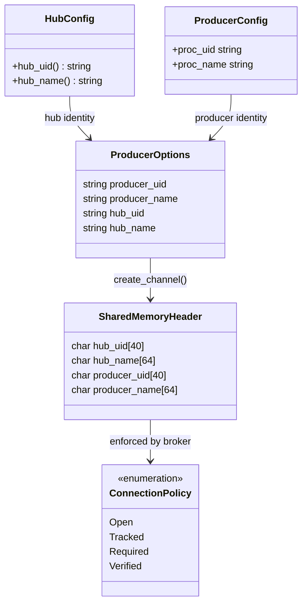
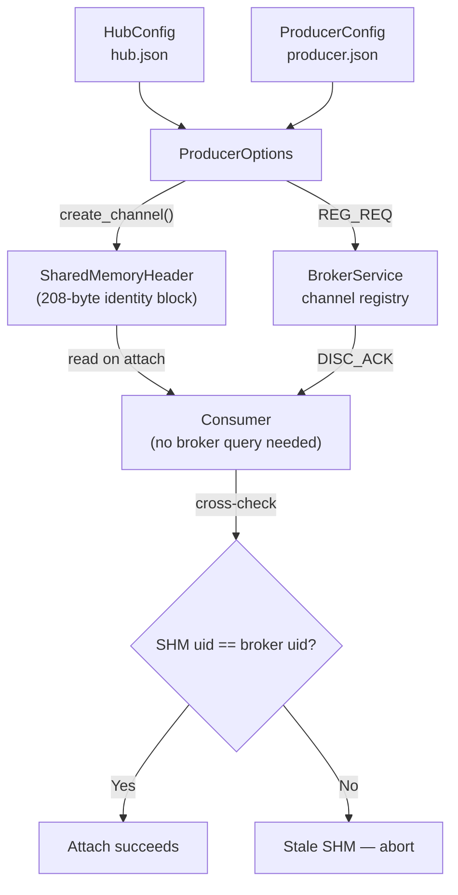

# HEP-CORE-0013: Channel Identity and Provenance

| Property      | Value                                                           |
|---------------|-----------------------------------------------------------------|
| **HEP**       | `HEP-CORE-0013`                                                 |
| **Title**     | Channel Identity and Provenance                                 |
| **Status**    | Implemented (2026-02-28)                                        |
| **Created**   | 2026-02-28                                                      |
| **Area**      | DataHub Security / Identity                                     |
| **Depends on**| HEP-CORE-0002 (DataHub), HEP-CORE-0009 (Policy Reference)      |
| **Related**   | HEP-CORE-0011 (ScriptHost Framework)                            |

### Source file reference

| File | Layer | Description |
|------|-------|-------------|
| `src/include/utils/uid_utils.hpp` | L3 (public) | `generate_hub_uid()`, `generate_producer_uid()`, `generate_consumer_uid()`, `generate_processor_uid()` |
| `src/include/plh_datahub.hpp` | L3 (public) | `SharedMemoryHeader` with identity block (char arrays) |
| `src/include/utils/hub_producer.hpp` | L3 (public) | `ProducerOptions::producer_uid`, `producer_name` |
| `src/include/utils/hub_consumer.hpp` | L3 (public) | `ConsumerOptions` |
| `src/include/utils/channel_access_policy.hpp` | L3 (public) | `ConnectionPolicy` enum |
| `src/include/utils/actor_vault.hpp` | L3 (public) | Encrypted keypair vault (generic, legacy name) |
| `src/utils/ipc/broker_service.cpp` | impl | `check_connection_policy()`, identity enforcement |
| `tests/test_layer2_service/test_uid_utils.cpp` | test | UID format validation, uniqueness, generation |
| `tests/test_layer2_service/test_actor_vault.cpp` | test | Vault create/open, keypair storage |

---

## Abstract

This HEP defines the **Channel Identity block** embedded in every `SharedMemoryHeader` and
the **provenance chain** that carries hub and producer identity from configuration files
through broker registration to shared memory, enabling connection-policy enforcement and
diagnostic tracing without additional broker round-trips.

The Channel Identity block is logically independent of the DataHub memory layout (HEP-CORE-0002)
and the connection-policy rules (HEP-CORE-0009); this HEP isolates the identity flow so that
both can cross-reference it with a brief note rather than duplicating the full specification.

---

## 1. Channel Identity Block (208 bytes)

The `SharedMemoryHeader` reserves a 208-byte **Channel Identity** block (see HEP-CORE-0002 §3.2):

```cpp
// Within SharedMemoryHeader (written once at create_channel(); read-only thereafter)
char hub_uid[40];       // Hub unique ID: HUB-<name>-<8hex>, null-terminated
char hub_name[64];      // Hub display name, null-terminated
char producer_uid[40];  // Producer unique ID: PROD-<name>-<8hex>, null-terminated
char producer_name[64]; // Producer display name, null-terminated
```

| Field | Source | Written by | Consumers use |
|---|---|---|---|
| `hub_uid` | `HubConfig::hub_uid()` | `DataBlockProducer` at `create_channel()` | Verify identity; logging |
| `hub_name` | `HubConfig::hub_name()` | `DataBlockProducer` at `create_channel()` | Logging and diagnostics |
| `producer_uid` | `ProducerOptions::producer_uid` | `DataBlockProducer` at `create_channel()` | `ConnectionPolicy` enforcement |
| `producer_name` | `ProducerOptions::producer_name` | `DataBlockProducer` at `create_channel()` | Logging and diagnostics |

**Write contract**: all four fields are written atomically relative to producer startup —
before any HELLO frames are sent and before consumers can attach. No synchronization is
needed for reads: consumers attach after the channel is registered (`REG_ACK`), so the
identity fields are fully written before any consumer can read them.

**Empty fields**: in `--dev` mode or when the producer runs outside a hub context, `hub_uid`
and `hub_name` are empty strings. Policy enforcement is disabled for channels with empty
`hub_uid` (treated as unmanaged channels).

---

## 2. UID Format

| Entity | Format | Example |
|---|---|---|
| Hub | `HUB-{NAME}-{8HEX}` | `HUB-TestLab-3F2A1B0E` |
| Producer | `PROD-{NAME}-{8HEX}` | `PROD-Sensor-A1B2C3D4` |
| Consumer | `CONS-{NAME}-{8HEX}` | `CONS-Logger-7E8F9A0B` |
| Processor | `PROC-{NAME}-{8HEX}` | `PROC-TempNorm-A3F7C219` |

Generated by `uid_utils::generate_hub_uid(name)`, `generate_producer_uid(name)`,
`generate_consumer_uid(name)`, `generate_processor_uid(name)`.
The 8-hex suffix is derived from 4 cryptographically random bytes (32-bit entropy).

---

## 3. Provenance Chain

### Identity Model



### Provenance Flow



```
HubConfig (hub.json)             ProducerConfig (producer.json)
  hub_uid = "HUB-Lab-3F2A1B0E"    producer_uid  = "PROD-Sensor-A1B2C3D4"
  hub_name = "TestLab"             producer_name = "Sensor"
       │                                │
       └──────────────┬─────────────────┘
                      ▼
           ProducerOptions (passed to create_channel())
             producer_uid  = producer_uid   ← producer identity
             producer_name = producer_name
             (hub fields populated from HubConfig if hub is running)
                      │
                      ▼
           DataBlockProducer::create_channel()
             SharedMemoryHeader.hub_uid       = HubConfig::hub_uid()
             SharedMemoryHeader.hub_name      = HubConfig::hub_name()
             SharedMemoryHeader.producer_uid  = opts.producer_uid
             SharedMemoryHeader.producer_name = opts.producer_name
                      │
           ┌──────────┴──────────────┐
           │                         │
           ▼                         ▼
BrokerService Registry         Consumer on attach
  channel.producer_uid            reads channel identity
  channel.producer_name           from SharedMemoryHeader
  channel.hub_uid                 (no broker query needed)
           │
           ▼
ConnectionPolicy enforcement
  (see HEP-CORE-0009 §3)
```

### 3.1 Hub context injection

When a `hub::Producer` is created inside a hub process (i.e., the hub lifecycle is running),
the hub's `HubConfig::hub_uid()` and `HubConfig::hub_name()` are injected into the
`DataBlockConfig` before `create_channel()` is called. This is done automatically by the
standalone binaries when `hub_dir` is specified in the config.

When running outside a hub (standalone dev mode), `hub_uid` and `hub_name` remain
empty; `ConnectionPolicy` treats these as unmanaged channels and skips identity checks.

### 3.2 Consumer provenance read

When a consumer calls `connect_channel()`, it reads the channel identity fields from the
`SharedMemoryHeader` immediately after attaching shared memory. The identity is available
without a broker query:

```cpp
// In DataBlockConsumer::connect_channel_from_parts():
std::string producer_uid  = header->producer_uid;   // from SHM identity block
std::string producer_name = header->producer_name;
std::string hub_uid       = header->hub_uid;
LOGGER_INFO("[consumer] Channel '{}' — producer: {} ({}), hub: {} ({})",
            channel_name, producer_name, producer_uid, hub_name, hub_uid);
```

---

## 4. Connection Policy Integration

The `ConnectionPolicy` system (HEP-CORE-0009) uses `producer_uid` from the broker registry
(populated during `REG_REQ` handling) and from the `SharedMemoryHeader` identity block to
enforce access rules.

### 4.1 Policy enforcement flow

```
Consumer → DISC_REQ → BrokerService
  BrokerService looks up channel.producer_uid in KnownProducers table
  Applies ConnectionPolicy:
    Open:     any producer allowed
    Tracked:  log producer_uid; allow all
    Required: producer_uid must be in KnownProducers; else DISC_NACK
    Verified: producer_uid in KnownProducers AND CurveZMQ key matches; else DISC_NACK
```

See **HEP-CORE-0009** for the full `ConnectionPolicy` enum and enforcement logic.

### 4.2 Identity mismatch detection

If a consumer attaches to a channel and finds that the `SharedMemoryHeader.producer_uid`
does not match the `producer_uid` in the `DISC_ACK` from the broker, the consumer logs a
`LOGGER_ERROR` and aborts the connection. This detects stale SHM segments reused by a
different producer.

---

## 5. Vault and Key Association

Each standalone binary has a vault (e.g. `vault/producer.vault`, created by
`pylabhub-producer --keygen`). The binary's CurveZMQ keypair is stored encrypted
in the vault. The `producer_uid` and CurveZMQ public key are permanently
associated — both are stored together and derived from the same password.

This means the `producer_uid` in the `SharedMemoryHeader` corresponds to a specific keypair.
When `ConnectionPolicy = Verified`, the broker validates both:
1. That `producer_uid` appears in the hub's `KnownProducers` table.
2. That the producer's CurveZMQ public key matches the registered public key entry.

See **HEP-CORE-0009 §3** (ConnectionPolicy and Verified policy) for full details.

---

## 6. Implementation Notes

### 6.1 Fields are char arrays, not std::string

All four identity fields are fixed-size `char[]` arrays to keep the `SharedMemoryHeader`
a plain POD-compatible struct that can be safely placed in shared memory without vtables,
allocators, or atomics. Strings longer than the field size are truncated silently.

### 6.2 Null termination contract

All four fields are null-terminated C strings. Producers must call `std::strncpy()` or
equivalent with `size - 1` to guarantee the null terminator:

```cpp
std::strncpy(hdr->hub_uid,      opts.hub_uid.c_str(),      39); hdr->hub_uid[39]      = '\0';
std::strncpy(hdr->hub_name,     opts.hub_name.c_str(),     63); hdr->hub_name[63]     = '\0';
std::strncpy(hdr->producer_uid, opts.producer_uid.c_str(),  39); hdr->producer_uid[39] = '\0';
std::strncpy(hdr->producer_name,opts.producer_name.c_str(),63); hdr->producer_name[63]= '\0';
```

### 6.3 Diagnostics access

The identity fields are accessible from the CLI diagnostic tool:

```bash
# Show channel identity for a running channel
pylabhub-admin diagnose <shm_name>
# Output includes:
#   Hub:      TestLab (HUB-TestLab-3F2A1B0E)
#   Producer: Sensor  (PROD-Sensor-A1B2C3D4)
```

---

## Copyright

This document is placed in the public domain or under CC0-1.0-Universal.
