# HEP-CORE-0015: Processor Binary

| Property      | Value                                                                      |
|---------------|----------------------------------------------------------------------------|
| **HEP**       | `HEP-CORE-0015`                                                            |
| **Title**     | Processor Binary — Standalone `pylabhub-processor` Executable              |
| **Status**    | ✅ Active — Phase 1+2+3 fully implemented; ZMQ transport + startup done     |
| **Created**   | 2026-03-01                                                                 |
| **Revised**   | 2026-03-11 (startup coordination implemented; dual-hub bridge demo added)  |
| **Area**      | Standalone Binaries / Processor (`src/processor/`)                         |
| **Depends on**| HEP-CORE-0002, HEP-CORE-0007, HEP-CORE-0011, HEP-CORE-0016, HEP-CORE-0023 |

---

## 1. Motivation

`pylabhub-processor` is the standalone transform binary: it reads from one data channel,
applies a Python transform, and writes to another channel. It can bridge two independent
hubs, acting as the only connective tissue between separate data planes.

Like `pylabhub-producer` and `pylabhub-consumer` (HEP-CORE-0018), the processor is
self-contained — no parent container, no shared runtime. It owns its own directory,
identity vault, and (up to two) broker connections.

The processor is a **first-class role** with the same capabilities as producer and
consumer: configurable loop timing policy, inbox receive, dual-hub messaging API,
startup coordination, and full flexzone access.

---

## 2. Identity

```
PROC-{NAME}-{8HEX}
```

- `{NAME}` — `processor.name` from `processor.json`, upper-cased, non-alphanum stripped
- `{8HEX}` — first 8 hex chars of BLAKE2b-256 of `(name + creation_timestamp_ms)`
- Generation function: `uid_utils::generate_processor_uid()`

Example: `PROC-TEMPNORM-A3F7C219`

---

## 3. Three-Layer Architecture

```
┌──────────────────────────────────────────────────────┐
│  Layer 4: ProcessorScriptHost (PythonRoleHostBase)   │
│  • Config loading + validation                        │
│  • Script lifecycle (on_init / on_process / on_stop) │
│  • Thread management: loop_thread_ + ctrl_thread_    │
│  •                    + inbox_thread_                 │
│  • GIL management, slot view construction            │
│  • ProcessorAPI Python bindings                       │
└──────────────────┬───────────────────────────────────┘
                   │ owns
┌──────────────────▼───────────────────────────────────┐
│  Layer 3: hub::Processor (hub_processor.hpp/cpp)     │
│  • Type-erased process loop                          │
│  • Demand-driven processing (or timed)               │
│  • hub::QueueReader in_q_ / hub::QueueWriter out_q_  │
│  • OverflowPolicy enforcement on output              │
└──────────────────┬───────────────────────────────────┘
                   │ owns
┌──────────────────▼───────────────────────────────────┐
│  Layer 3: hub::QueueReader / hub::QueueWriter        │
│  • ShmQueue: DataBlock ring-buffer (default)         │
│  • ZmqQueue: direct PUSH/PULL socket                 │
└──────────────────────────────────────────────────────┘
```

The script host connects to up to two brokers via `hub::Consumer` (input) and
`hub::Producer` (output) for the **control plane** (registration, heartbeat, shutdown
notifications). The **data plane** runs through the Queue abstraction and may be SHM or ZMQ
regardless of whether the broker connection exists.

---

## 4. Directory Layout

Created by `pylabhub-processor --init <proc_dir>`:

```
<proc_dir>/
  processor.json       ← flat config (no roles array)
  vault/               ← encrypted CurveZMQ keypair (ProcessorVault)
  script/
    python/
      __init__.py      ← on_init / on_process / on_stop
  logs/                ← rotating log (processor.log, 10 MB × 3)
  run/
    processor.pid      ← PID while running
```

---

## 5. Config Schema (`processor.json`)

```json
{
  "processor": {
    "name":      "TempNorm",
    "uid":       "",
    "log_level": "info",
    "auth":      {"keyfile": "./vault/processor.vault"}
  },

  "in_hub_dir":  "/opt/pylabhub/hubs/sensor",
  "out_hub_dir": "/opt/pylabhub/hubs/analysis",

  "in_channel":  "lab.raw.temperature",
  "out_channel": "lab.norm.temperature",

  "in_transport":          "shm",
  "out_transport":         "shm",
  "zmq_in_endpoint":       "",
  "zmq_in_bind":           false,
  "zmq_out_endpoint":      "",
  "zmq_out_bind":          true,
  "in_zmq_buffer_depth":   64,
  "out_zmq_buffer_depth":  64,
  "in_zmq_packing":        "aligned",
  "out_zmq_packing":       "aligned",

  "target_period_ms":  0,
  "loop_timing":       "max_rate",
  "overflow_policy":   "block",
  "verify_checksum":   false,

  "in_slot_schema": {
    "fields": [
      {"name": "ts",    "type": "float64"},
      {"name": "value", "type": "float32"}
    ]
  },
  "out_slot_schema": {
    "fields": [
      {"name": "ts",         "type": "float64"},
      {"name": "value_norm", "type": "float64"}
    ]
  },
  "flexzone_schema": {"fields": []},

  "shm": {
    "in":  {"enabled": true,  "secret": 0},
    "out": {"enabled": true,  "slot_count": 8, "secret": 0}
  },

  "inbox_schema":          {"fields": [{"name": "cmd", "type": "int32"}]},
  "inbox_endpoint":        "tcp://127.0.0.1:5600",
  "inbox_buffer_depth":    64,
  "inbox_overflow_policy": "drop",
  "inbox_zmq_packing":     "aligned",

  "script": {"type": "python", "path": "."}
}
```

### 5.1 Field Reference

#### Identity

| Field | Required | Default | Description |
|-------|----------|---------|-------------|
| `processor.name` | yes | — | Human name; used in UID and log prefix |
| `processor.uid` | no | generated | Override auto-generated PROC-* UID |
| `processor.log_level` | no | `"info"` | debug / info / warn / error |
| `processor.auth.keyfile` | no | `""` | Path to vault file; empty = ephemeral CURVE identity |

#### Hub / Broker

| Field | Required | Default | Description |
|-------|----------|---------|-------------|
| `hub_dir` | no† | — | Hub directory (reads `hub.json` + `hub.pubkey`) |
| `in_hub_dir` | no† | — | Override `hub_dir` for input broker direction |
| `out_hub_dir` | no† | — | Override `hub_dir` for output broker direction |
| `broker` | no† | `"tcp://127.0.0.1:5570"` | Broker endpoint (overridden by `hub_dir`) |
| `broker_pubkey` | no | `""` | CurveZMQ broker public key (Z85, 40 chars) |
| `in_broker` | no† | — | Per-direction broker endpoint override |
| `out_broker` | no† | — | Per-direction broker endpoint override |
| `in_broker_pubkey` | no | `""` | Per-direction broker pubkey override |
| `out_broker_pubkey` | no | `""` | Per-direction broker pubkey override |

† At least one of `hub_dir`, `in_hub_dir`/`out_hub_dir`, or `broker` must resolve a valid endpoint for each direction.

Resolution order (per direction): `in_broker` > `in_hub_dir` > `broker` > `hub_dir`

**Auth note**: A single keypair may be used for connections to two different hubs. Each hub
independently validates the processor's public key against its own known-keys list. There is
no cross-hub interference.

#### Channels and Data Path

| Field | Required | Default | Description |
|-------|----------|---------|-------------|
| `in_channel` | yes | — | Input channel name (consumed by this processor) |
| `out_channel` | yes | — | Output channel name (produced by this processor) |
| `in_transport` | no | `"shm"` | Input data path: `"shm"` or `"zmq"` |
| `out_transport` | no | `"shm"` | Output data path: `"shm"` or `"zmq"` |
| `zmq_in_endpoint` | if zmq | `""` | ZMQ PULL endpoint (required when `in_transport="zmq"`) |
| `zmq_in_bind` | no | `false` | PULL default = connect; set true to bind |
| `zmq_out_endpoint` | if zmq | `""` | ZMQ PUSH endpoint (required when `out_transport="zmq"`) |
| `zmq_out_bind` | no | `true` | PUSH default = bind; set false to connect |
| `in_zmq_buffer_depth` | no | `64` | ZMQ PULL high-water mark |
| `out_zmq_buffer_depth` | no | `64` | ZMQ PUSH high-water mark |
| `in_zmq_packing` | no | `"aligned"` | Wire packing: `"aligned"` or `"packed"` |
| `out_zmq_packing` | no | `"aligned"` | Wire packing: `"aligned"` or `"packed"` |

When `in_transport="shm"`, the broker's DISC_ACK provides the SHM segment name and
producer's ZMQ ctrl endpoint. When `in_transport="zmq"`, the processor connects directly
to `zmq_in_endpoint` (no broker mediation for the data path, but control plane via broker
remains active).

#### Loop Policy

| Field | Required | Default | Description |
|-------|----------|---------|-------------|
| `target_period_ms` | no | `0` | Target loop period in ms; 0 = free-run (max rate) |
| `loop_timing` | no | implicit (0→`"max_rate"`, >0→`"fixed_rate"`) | `"max_rate"`, `"fixed_rate"`, or `"fixed_rate_with_compensation"` |
| `overflow_policy` | no | `"block"` | Output overflow handling: `"block"` or `"drop"` |
| `verify_checksum` | no | `false` | Verify input slot BLAKE2b checksum before processing |

`loop_timing` semantics (same as producer and consumer; shared `pylabhub::LoopTimingPolicy`):
- **MaxRate** (`"max_rate"`): No sleep between iterations; requires `target_period_ms == 0`.
- **FixedRate** (`"fixed_rate"`): `next = now() + target_period_ms`; no catch-up on overrun.
- **FixedRateWithCompensation** (`"fixed_rate_with_compensation"`): `next += target_period_ms`; compensates for overrun.
- Absent `loop_timing` → implicit default: `target_period_ms == 0` → `MaxRate`, `> 0` → `FixedRate`.

#### Schemas

| Field | Required | Default | Description |
|-------|----------|---------|-------------|
| `in_slot_schema` | yes‡ | — | Input slot layout |
| `out_slot_schema` | yes‡ | — | Output slot layout |
| `flexzone_schema` | no | absent | Output flexzone layout; absent = no flexzone. **Note:** per-direction flexzone (`in_flexzone_schema`/`out_flexzone_schema`) is not currently implemented — only the output side supports flexzone. |
| `in_schema_id` | no‡ | — | Named schema (HEP-CORE-0016); overrides inline schema |
| `out_schema_id` | no‡ | — | Named schema (HEP-CORE-0016); overrides inline schema |

‡ Exactly one of the inline `_schema` block or `_schema_id` string is required per side.

#### SHM Parameters

```json
"shm": {
  "in":  {"enabled": true, "secret": 0},
  "out": {"enabled": true, "slot_count": 8, "secret": 0}
}
```

When `in_transport="zmq"`, `shm.in.enabled` may be set false (no SHM attachment).
The broker connection for control plane remains active regardless.

#### Inbox Receive

Inbox fields are **flat top-level keys** (not nested under an `"inbox"` object):

```json
"inbox_schema":          {"fields": [{"name": "cmd", "type": "int32"}]},
"inbox_endpoint":        "tcp://127.0.0.1:5600",
"inbox_buffer_depth":    64,
"inbox_overflow_policy": "drop",
"inbox_zmq_packing":     "aligned"
```

| Field | Required | Default | Description |
|-------|----------|---------|-------------|
| `inbox_schema` | yes (if inbox) | — | Slot layout for inbox messages |
| `inbox_endpoint` | yes (if inbox) | — | ZMQ ROUTER bind endpoint |
| `inbox_buffer_depth` | no | `64` | ZMQ ROUTER high-water mark (must be > 0) |
| `inbox_overflow_policy` | no | `"drop"` | `"drop"` (finite HWM) or `"block"` (unlimited HWM) |
| `inbox_zmq_packing` | no | `"aligned"` | Wire packing for inbox messages |

When `inbox_schema` is non-empty, a ROUTER socket is bound at `inbox_endpoint` and a
dedicated `inbox_thread_` processes messages. The endpoint is registered in REG_REQ so
other roles can discover and connect via `api.open_inbox()`.

#### Startup Coordination

Implemented in HEP-CORE-0023 Phase 1 (2026-03-11). The processor blocks in `start_role()`
before calling `on_init` until each listed role is present in the broker registry.

```json
"startup": {
  "wait_for_roles": [
    { "uid": "PROD-SENSOR-3A7F2B1C", "timeout_ms": 10000 },
    { "uid": "CONS-LOGGER-9E1D4C2A", "timeout_ms": 5000 }
  ]
}
```

| Field | Required | Default | Description |
|-------|----------|---------|-------------|
| `startup.wait_for_roles` | no | `[]` | List of role UIDs to wait for before calling `on_init` |
| `startup.wait_for_roles[].uid` | yes | — | Exact role UID to wait for (e.g. `"PROD-SENSOR-3A7F2B1C"`) |
| `startup.wait_for_roles[].timeout_ms` | no | `10000` | Per-role timeout in ms; max `3600000`; error if exceeded |

> **Note:** For dual-hub processors, role presence is queried via `out_messenger_` (Hub B).
> Roles registered only on Hub A (the input hub) will not be found. UID prefix patterns
> and per-role broker selection are deferred to HEP-CORE-0023 Phase 2.

---

## 6. Python Script Interface

The script at `<proc_dir>/script/python/__init__.py` implements three callbacks:

```python
def on_init(api) -> None:
    """Called once before the loop starts. Use for state initialization."""

def on_process(input_queue, output_queue, messages, api) -> bool | None:
    """
    Called for each processing iteration.

    input_queue:   InputQueue object (see §6.1).
    output_queue:  OutputQueue object (see §6.2).
    messages:      list of (sender: str, data: bytes) and/or event dicts.
    api:           ProcessorAPI — see §6.3.

    Return True or None  → commit output_queue.slot to the output channel.
    Return False         → discard; nothing written to output channel.
    """
    if input_queue.is_timeout:
        return False   # no new input; skip this iteration

    input_queue.slot.ts    # read input fields
    output_queue.slot.ts   = input_queue.slot.ts
    output_queue.slot.value_norm = float(input_queue.slot.value) / 100.0
    return True

def on_stop(api) -> None:
    """Called once after the loop exits cleanly."""
```

### 6.1 InputQueue Object

```python
input_queue.slot        # ctypes/numpy view of the input slot
                        # read-guarded (__setattr__ raises AttributeError)
                        # None when is_timeout is True

input_queue.flexzone    # ctypes view of input flexzone (fully mutable, user-coordinated)
                        # None if in_flexzone_schema not configured

input_queue.is_timeout  # bool: True when loop fires with no new input data
                        # (only relevant when target_period_ms > 0)

input_queue.metrics     # dict: queue-level metrics snapshot
                        # {"last_seq": int, "capacity": int,
                        #  "policy": str, "overrun_count": int}
```

**Flexzone access**: Both `input_queue.flexzone` and `output_queue.flexzone` are fully
mutable ctypes/numpy views. There is no framework-level read/write restriction. Access
coordination between producer, processor, and consumer is entirely user-managed.

### 6.2 OutputQueue Object

```python
output_queue.slot       # ctypes/numpy view of the output slot (always writable)
output_queue.flexzone   # ctypes view of output flexzone (fully mutable, user-coordinated)
                        # None if out_flexzone_schema not configured
```

### 6.3 ProcessorAPI

```python
# Identity / environment
api.name()               # → str: "TempNorm"
api.uid()                # → str: "PROC-TEMPNORM-A3F7C219"
api.in_channel()         # → str: input channel name
api.out_channel()        # → str: output channel name
api.log_level()          # → str: configured log level
api.script_dir()         # → str: absolute path to the script directory
api.role_dir()           # → str: absolute path to the role directory (empty if --config launch)
api.logs_dir()           # → str: role_dir + "/logs"
api.run_dir()            # → str: role_dir + "/run"

# Logging
api.log(level, msg)

# Hub messaging — dual-hub access
api.in_hub.send(target, data)                   # → send to input-side hub
api.in_hub.broadcast(data)
api.in_hub.notify_channel(target, event, data="")
api.in_hub.channel()                            # → str: in_channel name

api.out_hub.send(target, data)                  # → send to output-side hub
api.out_hub.broadcast(data)
api.out_hub.notify_channel(target, event, data="")
api.out_hub.channel()                           # → str: out_channel name

# Convenience aliases (delegate to out_hub)
api.send(target, data)
api.broadcast(data)
api.notify_channel(target, event, data="")

# Inbox — open outbound DEALER to another role's ROUTER
api.open_inbox(uid)      # → InboxHandle or None if target not online
api.wait_for_role(uid, timeout_ms=5000)  # → bool; polls presence; GIL released

# Queue metrics
api.in_capacity()        # → int: input queue ring-buffer depth
api.in_policy()          # → str: input queue overflow policy ("block"/"drop")
api.last_seq()           # → int: SHM=ring-buffer slot index (wraps at capacity); ZMQ=monotone wire seq
api.loop_overrun_count() # → int: always 0 (processor is queue-driven, no deadline)
api.set_verify_checksum(enable)  # toggle BLAKE2b slot verification at runtime (SHM only; no-op for ZMQ)

api.out_capacity()       # → int: output queue ring-buffer depth
api.out_policy()         # → str: output queue overflow policy

# Counters
api.in_slots_received()  # → int
api.out_slots_written()  # → int
api.out_drop_count()     # → int
api.script_error_count() # → int

# Custom Metrics (HEP-CORE-0019)
api.report_metric(key, value)
api.report_metrics(dict)
api.clear_custom_metrics()

# Spinlock — output flexzone (index idx in shared spinlock array)
api.spinlock(idx)        # → context manager; only valid if out_flexzone configured

# Shutdown
api.stop()
api.set_critical_error(msg)
```

### 6.4 InboxHandle

```python
handle = api.open_inbox("PROD-SENSOR-A1B2C3D4")
if handle:
    handle.acquire()     # → ctypes slot view populated from next inbox message
    handle.send(timeout_ms=1000)  # → int return code
    handle.discard()     # → discard without sending
    handle.is_ready()    # → bool
    handle.close()
```

### 6.5 Messages List

Messages from both hubs are delivered in a single `messages` list per iteration.
Each message includes `source_hub_uid` to identify which hub it originated from.

```python
for m in messages:
    if isinstance(m, dict):
        # Event message
        src = m.get("source_hub_uid", "")   # which hub sent this
        if m["event"] == "consumer_joined":
            api.log(f"Consumer joined {m['identity']} on {src}")
        elif m["event"] == "channel_closing":
            api.stop()
        elif m["event"] == "role_registered":
            api.log(f"Role {m['role_uid']} registered on {src}")
    else:
        # P2P data message: (sender_uid: str, data: bytes)
        sender, data = m
```

#### Event types received by processor

| Event | Source | Dict fields |
|-------|--------|-------------|
| `consumer_joined` | P2P HELLO on out-side | `event`, `identity`, `source_hub_uid` |
| `consumer_left` | P2P BYE on out-side | `event`, `identity`, `source_hub_uid` |
| `consumer_died` | Broker CONSUMER_DIED_NOTIFY | `event`, `pid`, `reason`, `source_hub_uid` |
| `channel_closing` | Broker CHANNEL_CLOSING_NOTIFY | `event`, `channel_name`, `reason`, `source_hub_uid` |
| `role_registered` | Broker ROLE_REGISTERED_NOTIFY | `event`, `role_uid`, `role_type`, `channel`, `source_hub_uid` |
| `role_deregistered` | Broker ROLE_DEREGISTERED_NOTIFY | `event`, `role_uid`, `role_type`, `channel`, `source_hub_uid` |
| `broadcast` | Broker CHANNEL_BROADCAST_NOTIFY | `event`, `channel_name`, `sender_uid`, `message`, `data`, `source_hub_uid` |
| _(app event)_ | Broker CHANNEL_EVENT_NOTIFY relay | `event`=_app string_, `sender_uid`, `source_hub_uid` |
| `producer_message` | P2P ctrl from consumer | `event`, `type`, `data`, `source_hub_uid` |

---

## 7. CLI

```
pylabhub-processor --init <proc_dir> [--name <name>]  # Create processor.json + vault + script
pylabhub-processor <proc_dir>                          # Run
pylabhub-processor --config <path> --validate          # Validate config + script; exit 0 on success
pylabhub-processor --config <path> --keygen            # Generate vault keypair
pylabhub-processor --dev [proc_dir]                    # Ephemeral keypair; proc_dir optional
pylabhub-processor --version                           # Print version string
```

---

## 8. C++ Implementation

### 8.1 ProcessorConfig (updated fields)

```cpp
struct ProcessorConfig {
    // identity, hub/broker, channels — unchanged from Phase 1+2

    // Transport
    Transport   in_transport{Transport::Shm};
    Transport   out_transport{Transport::Shm};
    std::string zmq_in_endpoint;
    std::string zmq_out_endpoint;
    bool        zmq_in_bind{false};          // PULL default = connect
    bool        zmq_out_bind{true};          // PUSH default = bind
    size_t      in_zmq_buffer_depth{64};
    size_t      out_zmq_buffer_depth{64};
    std::string in_zmq_packing{"aligned"};
    std::string out_zmq_packing{"aligned"};

    // Loop policy
    int         target_period_ms{0};          // 0 = free-run
    pylabhub::LoopTimingPolicy loop_timing{pylabhub::LoopTimingPolicy::MaxRate};
    OverflowPolicy overflow_policy{OverflowPolicy::Block};  // output side
    bool        verify_checksum{false};

    // Schemas
    nlohmann::json in_slot_schema_json;
    nlohmann::json out_slot_schema_json;
    nlohmann::json flexzone_schema_json;   // output flexzone only; input flexzone not implemented

    // SHM (unchanged)
    bool in_shm_enabled{true};   uint64_t in_shm_secret{0};
    bool out_shm_enabled{true};  uint64_t out_shm_secret{0};
    uint32_t out_shm_slot_count{4};

    // Inbox receive
    nlohmann::json inbox_schema_json;
    std::string    inbox_endpoint;
    size_t         inbox_buffer_depth{64};
    std::string    inbox_overflow_policy{"drop"};
    std::string    inbox_zmq_packing{"aligned"};
    bool has_inbox() const { return !inbox_schema_json.empty() && !inbox_endpoint.empty(); }

    // Startup coordination (HEP-0023 Phase 1)
    std::vector<WaitForRole> wait_for_roles; // uid + timeout_ms per entry

    // Heartbeat
    int heartbeat_interval_ms{0};

    // Script, auth — unchanged
};
```

**Removed fields** (clean break — no backward compat):
- `timeout_ms` — removed; internal poll timeout derived from `target_period_ms`

### 8.2 ProcessorScriptHost Thread Model

```
ProcessorScriptHost
├── loop_thread_    ← hub::Processor::process_thread_ (data loop)
├── ctrl_thread_    ← run_ctrl_thread_(): polls in_messenger_ + out_messenger_ ZMQ sockets
└── inbox_thread_   ← run_inbox_thread_(): InboxQueue::recv_one() + on_inbox() dispatch
```

`ctrl_thread_` polls both `in_messenger_` (input-side hub) and `out_messenger_` (output-side
hub) in a single zmq_poll loop. Events from both hubs feed into a shared
`RoleHostCore::enqueue_message()` queue, tagged with `source_hub_uid`.

### 8.3 start_role() Queue Creation

```cpp
// Input queue
if (config_.in_transport == Transport::Shm) {
    // attach to in_consumer_->shm()
    in_queue_ = ShmQueue::from_consumer_ref(*in_shm, in_schema_slot_size_, fz_sz, config_.in_channel);
} else {
    in_queue_ = ZmqQueue::pull_from(config_.zmq_in_endpoint, in_schema_slot_size_,
                                     config_.zmq_in_bind, config_.in_zmq_buffer_depth);
}

// Output queue
if (config_.out_transport == Transport::Shm) {
    auto shm_q = ShmQueue::from_producer_ref(*out_shm, out_schema_slot_size_, fz_sz, config_.out_channel);
    if (config_.update_checksum) shm_q->set_checksum_options(true, core_.has_fz);
    out_queue_ = std::move(shm_q);
} else {
    out_queue_ = ZmqQueue::push_to(config_.zmq_out_endpoint, out_schema_slot_size_,
                                    config_.zmq_out_bind);
}
in_queue_->start();
out_queue_->start();
```

### 8.4 Control Plane (always active)

`hub::Consumer` (in_consumer_) and `hub::Producer` (out_producer_) are always created
for control plane: HELLO/BYE, HEARTBEAT, CHANNEL_CLOSING_NOTIFY, ROLE_REGISTERED_NOTIFY.
When `in_transport="zmq"`, `shm.in.enabled=false` (no SHM attachment). The broker
connection remains active.

### 8.5 REG_REQ / CONSUMER_REG_REQ — role_type field

All registration messages include `role_type`:
- Input-side CONSUMER_REG_REQ: `"role_type": "processor"`
- Output-side REG_REQ: `"role_type": "processor"`

This allows the broker to record the role type in its registry for ROLE_REGISTERED_NOTIFY
and ROLE_LIST queries. See HEP-CORE-0007 §12.3.

### 8.6 Hub Failure Handling

If either broker connection is lost or returns an unrecoverable error, the processor
logs the error and terminates. There is no automatic reconnect or failover.

---

## 9. Dual-Hub Bridge Architecture

```mermaid
%%{init: {'theme': 'dark'}}%%
graph LR
    subgraph "Hub A (5570)"
        PA["Producer\nlab.raw.temp"]
        BA["BrokerService A"]
    end

    subgraph "pylabhub-processor"
        IN_MSG["in_messenger_\n(Consumer-role, Hub A)"]
        IN_Q["QueueReader\n(ShmQueue or ZmqQueue)"]
        PROC["hub::Processor\nprocess_thread_"]
        OUT_Q["QueueWriter\n(ShmQueue or ZmqQueue)"]
        OUT_MSG["out_messenger_\n(Producer-role, Hub B)"]
        CTRL["ctrl_thread_\n(polls both hubs)"]
        INBOX["inbox_thread_\n(InboxQueue ROUTER)"]
    end

    subgraph "Hub B (5571)"
        BB["BrokerService B"]
        CA["Consumer\nlab.norm.temp"]
    end

    PA --> BA
    BA -->|DISC_ACK| IN_MSG
    IN_MSG --> IN_Q
    IN_Q -->|read| PROC
    PROC -->|write| OUT_Q
    OUT_Q --> OUT_MSG
    OUT_MSG -->|REG_REQ| BB
    BB --> CA

    CTRL -.->|heartbeat / events| BA
    CTRL -.->|heartbeat / events| BB

    style PROC fill:#4a2a4a
    style IN_Q fill:#2a4a2a
    style OUT_Q fill:#2a4a2a
```



---

## 10. Source File Reference

| File | Description |
|------|-------------|
| `src/scripting/role_main_helpers.hpp` | Shared `pylabhub::scripting` helpers for all three role `main()` entry points (password, lifecycle, signal handler, main loop) — see HEP-CORE-0018 §13.1 |
| `src/processor/processor_config.hpp` | `ProcessorConfig` struct + all fields |
| `src/processor/processor_config.cpp` | JSON parsing, hub_dir resolvers |
| `src/processor/processor_api.hpp` | `ProcessorAPI`, `HubInterface` Python bindings |
| `src/processor/processor_api.cpp` | Implementation + `PYBIND11_EMBEDDED_MODULE` |
| `src/processor/processor_script_host.hpp` | `ProcessorScriptHost : PythonRoleHostBase` |
| `src/processor/processor_script_host.cpp` | Data loop, ctrl_thread_, inbox_thread_ |
| `src/processor/processor_main.cpp` | CLI entry point |
| `src/include/utils/hub_processor.hpp` | `hub::Processor` (Layer 3) |
| `src/utils/hub/hub_processor.cpp` | Process thread, OverflowPolicy, hot-swap |
| `tests/test_layer4_processor/` | Config + CLI tests |
| `tests/test_layer3_datahub/` | Layer 3 Processor + QueueReader/QueueWriter tests |

---

## Document History

| Date | Change |
|------|--------|
| 2026-03-01 | Initial — Phase 1: single-hub SHM only |
| 2026-03-03 | Phase 2: dual-broker, per-direction hub_dir, 5 config tests |
| 2026-03-03 | hub::Processor delegation: timeout handler, pre-hook, zero-fill |
| 2026-03-05 | Metrics API (HEP-0019), `--name` CLI argument, 828 tests |
| 2026-03-10 | Phase 3 design: timing policy, inbox, dual-hub API (in_hub/out_hub), startup coordination, role_type in REG_REQ, source_hub_uid in messages, flexzone both sides mutable, hub failure = quit, `timeout_ms` removed |
| 2026-03-11 | HEP-0023 Phase 1 implemented: `startup.wait_for_roles` parsed + enforced; `zmq_to_zmq` L3 test added; `share/demo-dual-hub/` dual-hub bridge demo complete; startup coordination section rewritten |
