# HEP-CORE-0015: Processor Binary

| Property      | Value                                                                      |
|---------------|----------------------------------------------------------------------------|
| **HEP**       | `HEP-CORE-0015`                                                            |
| **Title**     | Processor Binary — Standalone `pylabhub-processor` Executable              |
| **Status**    | Implemented — Phase 1+2 (2026-03-03)                                       |
| **Created**   | 2026-03-01                                                                 |
| **Area**      | Standalone Binaries / Processor (`src/processor/`)                         |
| **Depends on**| HEP-CORE-0002 (DataHub), HEP-CORE-0007 (Protocol), HEP-CORE-0011 (ScriptHost), HEP-CORE-0016 (Named Schema Registry) |

---

## 1. Motivation

`pylabhub-processor` is the standalone transform binary: it reads from one channel,
applies a Python (or Lua) transform, and writes to another. It owns its own
directory, identity, vault, and broker connections.

The C++ engine is `hub::Processor` (Layer 3, implemented 2026-03-01).
`processor_main.cpp` constructs the Queues, connects to the broker(s), and drives
`hub::Processor::process_thread_`.

Like `pylabhub-producer` and `pylabhub-consumer` (HEP-CORE-0018), the processor
binary is self-contained — no parent container, no shared runtime.

---

## 2. Identity

```
PROC-{NAME}-{8HEX}
```

- `{NAME}` — `processor.name` from `processor.json`, upper-cased, non-alphanum stripped
- `{8HEX}` — first 8 hex chars of BLAKE2b-256 of `(name + creation_timestamp_ms)`
- Generation function: `uid_utils::generate_processor_uid()`

Example: `PROC-TEMPNORM-A3F7C219`

---

## 3. Directory Layout

Created by `pylabhub-processor --init <proc_dir>`:

```
<proc_dir>/
  processor.json       ← flat config (no roles array)
  vault/               ← encrypted CurveZMQ keypair (ProcessorVault)
  script/
    python/
      __init__.py      ← on_init / on_process / on_stop
    lua/               ← only when script.type = "lua"
      main.lua
  logs/                ← rotating log (processor.log, 10 MB × 3)
  run/
    processor.pid      ← PID while running
```

---

## 4. Config Schema (`processor.json`)

```json
{
  "processor": {
    "name":      "TempNorm",
    "uid":       "",
    "log_level": "info",
    "auth": {
      "keyfile": "./vault/processor.vault"
    }
  },

  "hub_dir": "/opt/pylabhub/hubs/lab",

  "in_channel":  "lab.raw.temperature",
  "out_channel": "lab.norm.temperature",

  "overflow_policy": "block",
  "timeout_ms":      -1,

  "in_slot_schema": {
    "fields": [
      {"name": "ts",    "type": "float64"},
      {"name": "value", "type": "float32"}
    ]
  },
  "out_slot_schema": {
    "fields": [
      {"name": "ts",       "type": "float64"},
      {"name": "value_norm","type": "float64"}
    ]
  },

  "in_shm":  {"enabled": true,  "secret": 0},
  "out_shm": {"enabled": true,  "slot_count": 8, "secret": 0},

  "in_flexzone_schema":  {"fields": []},
  "out_flexzone_schema": {"fields": []},

  "script": {
    "type": "python",
    "path": "."
  }
}
```

### 4.1 Field Reference

| Field | Required | Default | Description |
|-------|----------|---------|-------------|
| `processor.name` | yes | — | Human name; used in UID and log prefix |
| `processor.uid` | no | generated | Override auto-generated PROC-* UID |
| `processor.log_level` | no | `"info"` | debug/info/warn/error |
| `processor.auth.keyfile` | no | `""` | Path to vault file; empty = ephemeral CURVE identity |
| `hub_dir` | no† | — | Hub directory; reads `hub.json` + `hub.pubkey` to set broker/pubkey |
| `broker` | no† | `"tcp://127.0.0.1:5570"` | Broker endpoint (overridden by `hub_dir`) |
| `broker_pubkey` | no | `""` | CurveZMQ broker public key Z85 |
| `in_channel` | yes | — | Input channel name |
| `out_channel` | yes | — | Output channel name |
| `overflow_policy` | no | `"block"` | `"block"` or `"drop"` when output ring full |
| `timeout_ms` | no | `-1` | -1 = wait indefinitely; >0 = fire `on_process(None,…)` after silence |
| `in_slot_schema` | yes‡ | — | Input slot layout (or use `in_schema_id` from HEP-CORE-0016) |
| `out_slot_schema` | yes‡ | — | Output slot layout (or use `out_schema_id`) |
| `in_shm` | no | `{enabled:true}` | Input SHM attach parameters |
| `out_shm` | yes | — | Output SHM create parameters (must include `slot_count`) |
| `in_flexzone_schema` | no | absent | Read-only flexzone layout for input channel |
| `out_flexzone_schema` | no | absent | Writable flexzone layout for output channel |
| `script.type` | no | `"python"` | Script type; currently only `"python"` |
| `script.path` | yes | `"."` | Base script directory; C++ resolves `<path>/script/<type>/__init__.py`; `"."` is the standard default |

† At least one of `hub_dir` or `broker` must be present.
‡ Exactly one of the inline `_schema` block or the `_schema_id` string is required per side (Phase 2 after HEP-CORE-0016 Phase 3).

### 4.2 Phase 2 Additions (dual-broker, transport)

When `in_broker` and `out_broker` differ, or when ZMQ transport is needed:

```json
{
  "in_broker":        "tcp://sensor-hub:5570",
  "in_broker_pubkey": "...",
  "out_broker":       "tcp://analysis-hub:5570",
  "out_broker_pubkey": "...",
  "in_transport":  "shm",
  "out_transport": "zmq"
}
```

Additionally, `in_hub_dir` and `out_hub_dir` can override `hub_dir` per-direction,
loading broker endpoint and pubkey from the respective hub directory.

**Resolution order** (per direction):
1. `in_broker` / `out_broker` (explicit, highest priority)
2. `in_hub_dir` / `out_hub_dir` → load from `hub.json` + `hub.pubkey`
3. `broker` (global fallback)
4. `hub_dir` → load from `hub.json` + `hub.pubkey` (lowest priority)

**Implemented** (2026-03-03): `ProcessorConfig` resolvers, `ProcessorScriptHost`
wires resolved endpoints, 5 tests in `test_processor_config.cpp`.

### 4.3 Schema ID (Phase 2, after HEP-CORE-0016 Phase 3)

```json
{
  "in_schema_id":  "lab.sensors.temperature.raw@1",
  "out_schema_id": "lab.sensors.temperature.norm@1"
}
```

When a `_schema_id` is present, the processor looks up the BLDS from the schema
library and uses the resolved hash for broker validation. The inline `_slot_schema`
block is not required in this case but may be provided for local validation.

---

## 5. Python Script Interface

The script at `<proc_dir>/script/python/__init__.py` implements:

(C++ resolves `script.path + "/script/" + script.type + "/__init__.py"`. With `"path": "."` and `"type": "python"` → `./script/python/__init__.py`. **Do not use `"./script"` — that double-nests.**)

```python
def on_init(api) -> None:
    """Called once before the loop starts. Use for state initialization."""

def on_process(in_slot, out_slot, flexzone, messages, api) -> bool:
    """
    Called for each input slot received (or on timeout if timeout_ms > 0).

    in_slot:   zero-copy ctypes struct (input schema), write-guarded via __setattr__.
               None on timeout. See §5.2 for field access and numpy conversion.
    out_slot:  writable ctypes struct (output schema). Always non-None.
    flexzone:  writable ctypes struct for output flexzone (user-coordinated R/W).
               None if not configured.
    messages:  list of (sender: str, data: bytes) from Messenger.
    api:       ProcessorAPI — see §5.1.

    Return True or None  → commit out_slot to output channel.
    Return False         → discard; nothing written to output channel.
    """
    if in_slot is None:
        return False                        # timeout — emit nothing
    out_slot.ts         = in_slot.ts
    out_slot.value_norm = float(in_slot.value) / 100.0
    return True

def on_stop(api) -> None:
    """Called once after the loop exits cleanly."""
```

### 5.1 ProcessorAPI

`ProcessorAPI` is the Python-facing API object passed to all script callbacks. It exposes:

```python
# Identity
api.name()               # → str: processor name ("TempNorm")
api.uid()                # → str: "PROC-TEMPNORM-A3F7C219"
api.in_channel()         # → str: input channel name
api.out_channel()        # → str: output channel name

# Logging
api.log(msg, level="info")

# Messaging (Messenger)
api.send(target, data)
api.broadcast(data)
api.notify_channel(target, event, data="")  # signal relay to target channel's producer

# Counters (direct access)
api.in_slots_received()  # → int
api.out_slots_written()  # → int
api.out_drop_count()     # → int
api.script_error_count() # → int

# Custom Metrics (HEP-CORE-0019)
api.report_metric(key, value)     # report single custom metric (key: str, value: number)
api.report_metrics(dict)          # batch report {key: number} pairs
api.clear_custom_metrics()        # clear all custom metrics (base counters unaffected)

# Shared-memory spinlock on output flexzone
api.spinlock(idx)        # → context manager; only valid if out_flexzone configured

# Shutdown
api.stop()               # Request clean shutdown from inside on_process
api.set_critical_error(msg)  # Mark as failed and trigger shutdown
```

---

### 5.2 Slot Types and Field Access

The slot objects passed to `on_process` are **zero-copy views** into shared memory.

#### ctypes slots (default, `expose_as: ctypes`)

Fields map directly to the schema definition. Assignment is always in-place (no copy):

```python
# in_slot_schema: {"name": "ts", "type": "float64"}, {"name": "value", "type": "int32"}
# out_slot_schema: {"name": "ts", "type": "float64"}, {"name": "value_norm", "type": "float32"}
out_slot.ts         = in_slot.ts              # copy timestamp field
out_slot.value_norm = float(in_slot.value) / 100.0
```

`in_slot` has `__setattr__` overridden to raise `AttributeError` on writes:

```python
in_slot.value        # OK — read
in_slot.value = 42   # raises AttributeError: read-only slot: field 'value' cannot be written
out_slot.value = 42  # OK
```

*Known limitation:* Array sub-elements (`in_slot.arr[0] = x`) bypass the struct-level guard —
this is a ctypes limitation (`__setitem__` on the subarray object, not `__setattr__` on the struct).

#### Array fields (`"count": N > 1`)

Fields with `"count": N` (e.g., `{"name": "samples", "type": "float32", "count": 100}`) become
ctypes arrays (`c_float * 100`). Use `np.ctypeslib.as_array()` for a zero-copy numpy view:

```python
import numpy as np

# Input (read) — zero-copy numpy view; do not write back:
arr_in = np.ctypeslib.as_array(in_slot.samples)   # shape=(100,), dtype=float32

# Output (write) — zero-copy writable numpy view:
arr_out = np.ctypeslib.as_array(out_slot.samples)
arr_out[:] = arr_in * 2.0                          # writes directly into SHM output slot
```

Note: `expose_as` is slot-level, not per-field. All fields in a ctypes slot come as ctypes types;
manual `np.ctypeslib.as_array()` is the correct approach for per-field numpy access.

#### Raw buffer access

The raw bytes of any slot are accessible via the Python buffer protocol:

```python
data = bytes(in_slot)                # immutable copy of all bytes
view = memoryview(in_slot).cast('B') # zero-copy byte view
```

This is equivalent to the C++ `buffer_span()` accessor.

#### numpy slots (`expose_as: numpy`)

When `expose_as: numpy` is configured, the slot is a `numpy.ndarray`. `in_slot` has
`writeable=False` enforced via the buffer readonly flag, so writes raise `ValueError`.

---

## 6. CLI

```
pylabhub-processor --init <proc_dir> [--name <name>]  # Create processor.json + vault + script/__init__.py
pylabhub-processor <proc_dir>                          # Run (open vault, connect, start loop)
pylabhub-processor --config <path> --validate          # Validate config + script; exit 0 on success
pylabhub-processor --config <path> --keygen            # Generate vault keypair; print public key to stdout
pylabhub-processor --dev [proc_dir]                    # Ephemeral keypair; proc_dir optional (uses cwd)
pylabhub-processor --version                           # Print version string
```

`--init` generates:
- `processor.json` with template values
- `vault/processor.vault` via `ProcessorVault::create()` (prompts for password)
- `script/python/__init__.py` with template `on_init` / `on_process` / `on_stop`

`--name` is optional for `--init`. If provided, sets the processor name in the generated config.
If omitted and stdin is a terminal, prompts interactively. If omitted and stdin is not a terminal
(e.g., spawned by tests or CI), uses the directory name as default.

---

## 7. C++ Implementation Plan

### 7.1 New Files

| File | Description |
|------|-------------|
| `src/processor/processor_config.hpp` | `ProcessorConfig` struct + `from_json_file()` / `from_directory()` |
| `src/processor/processor_config.cpp` | JSON parsing |
| `src/processor/processor_api.hpp` | `ProcessorAPI` class (C++ side of Python `api` object) |
| `src/processor/processor_api.cpp` | Implementation + pybind11 bindings |
| `src/processor/processor_script_host.hpp` | `ProcessorScriptHost : PythonScriptHost` |
| `src/processor/processor_script_host.cpp` | Drives load/start/wait/stop |
| `src/processor/processor_main.cpp` | CLI entry point |
| `src/processor/CMakeLists.txt` | Builds `pylabhub-processor` binary |

### 7.2 Reused Components (no changes needed)

| Component | Reuse |
|-----------|-------|
| `hub::Processor` (`hub_processor.hpp/cpp`) | C++ engine — owned by `ProcessorScriptHost` |
| `ShmQueue` / `ZmqQueue` | Built by `ProcessorScriptHost` after broker handshake |
| `ActorVault` | Reused as `ProcessorVault` typedef (shared vault implementation) |
| `uid_utils` | Add `generate_processor_uid()` alongside existing functions |
| `scripting::PythonScriptHost` | Base class for `ProcessorScriptHost` |
| `pylabhub::hub::Messenger` | One Messenger per Processor (same as one per role worker) |
| `LifecycleGuard` | Manages Logger + Crypto modules |

### 7.3 ProcessorConfig

```cpp
struct ProcessorConfig {
    std::string  proc_uid;
    std::string  proc_name;
    std::string  log_level{"info"};
    std::string  keyfile;           // vault path; empty = ephemeral
    std::string  hub_dir;

    std::string  broker{"tcp://127.0.0.1:5570"};
    std::string  broker_pubkey;

    std::string  in_channel;
    std::string  out_channel;

    hub::OverflowPolicy overflow_policy{hub::OverflowPolicy::Block};
    int          timeout_ms{-1};

    nlohmann::json in_slot_schema_json;
    nlohmann::json out_slot_schema_json;
    nlohmann::json in_flexzone_schema_json;
    nlohmann::json out_flexzone_schema_json;

    bool     in_shm_enabled{true};
    uint64_t in_shm_secret{0};
    bool     out_shm_enabled{true};
    uint64_t out_shm_secret{0};
    uint32_t out_shm_slot_count{0};

    std::string script_type{"python"};
    std::string script_path{"./script"};

    // Phase 2 fields (dual-broker, transport):
    // std::string in_broker, out_broker, in_broker_pubkey, out_broker_pubkey;
    // std::string in_transport{"shm"}, out_transport{"shm"};

    static ProcessorConfig from_json_file(const std::string &path);
    static ProcessorConfig from_directory(const std::string &proc_dir);
};
```

### 7.4 ProcessorScriptHost

```
ProcessorScriptHost::do_python_work():
  1. Build SchemaSpec (in_slot, out_slot, in_fz, out_fz) from ProcessorConfig
  2. Connect to broker: CONSUMER_REG_REQ (in_channel) + REG_REQ (out_channel)
  3. Wait for both ACKs (single-broker Phase 1: same connection)
  4. Build ShmQueue::from_consumer(in_dbc, item_sz, fz_sz)
  5. Build ShmQueue::from_producer(out_dbp, item_sz, fz_sz)
  6. proc_ = Processor::create(*in_q_, *out_q_, opts)
  7. proc_.set_process_handler<…>([this](auto& ctx) { return call_on_process(ctx); })
  8. Load script package → call on_init(api)
  9. proc_.start()
  10. signal_ready_()
  11. Wait: stop_ or api.stop() requested
  12. proc_.stop()
  13. call on_stop(api)
  14. Deregister from broker
```

GIL management follows the standard `PythonRoleHostBase` pattern:
- `main_thread_release_.emplace()` after step 9 (releases GIL before signal_ready_)
- `main_thread_release_.reset()` before step 13 (re-acquires GIL for on_stop)

### 7.5 processor_main.cpp

```
parse args → --init / --keygen / --validate / --dev / <proc_dir>
LifecycleGuard{Logger, Crypto}
load ProcessorConfig::from_directory(proc_dir)
resolve vault + keypair
ProcessorScriptHost host(config)
host.start()
wait for SIGINT/SIGTERM or host.is_done()
host.stop()
```

---

## 8. Open Questions

1. **Vault naming**: `using ProcessorVault = ActorVault;` is the current approach (ActorVault
   is a misnomer — it is a generic encrypted vault). Renaming to `PylabhubVault` is
   deferred to a future cleanup pass.

2. **Dual-broker Messenger**: Phase 2 (dual-broker) requires two Messenger instances.
   `ProcessorScriptHost` should own both; `processor_main` passes both to the host.

3. **`--init` template**: Current template is static. Phase 2 could generate typed
   field references for `in_slot_schema` fields since the schema is known at init time.

4. **Lua support**: `"script.type": "lua"` via `LuaScriptHost` — defer to Phase 2.

5. **Shared script API base**: `ProcessorAPI`, `ProducerAPI`, `ConsumerAPI` are ~90%
   identical. A shared `PylabhubScriptAPI` base avoids duplication (Phase 2).

6. **Script path resolution helper**: Extract the `<path>/<type>/__init__.py` resolution
   into a shared utility function reused by all four `ScriptHost` subclasses.

---

## 9. Dual-Broker Architecture

When `in_broker` and `out_broker` differ, the processor bridges two separate hubs:

```mermaid
%%{init: {'theme': 'dark'}}%%
graph LR
    subgraph "Hub A (sensor-hub)"
        PA["hub::Producer<br/>lab.raw.temperature"]
        BA["BrokerService A<br/>tcp://sensor-hub:5570"]
    end

    subgraph "pylabhub-processor"
        IN_MSG["in_messenger_<br/>(DISC + consumer)"]
        SQ_IN["ShmQueue(read)<br/>from DataBlockConsumer"]
        PROC["hub::Processor<br/>process_thread_"]
        SQ_OUT["ShmQueue(write)<br/>from DataBlockProducer"]
        OUT_MSG["out_messenger_<br/>(REG + producer)"]
    end

    subgraph "Hub B (analysis-hub)"
        BB["BrokerService B<br/>tcp://analysis-hub:5570"]
        CA["hub::Consumer<br/>lab.norm.temperature"]
    end

    PA --> BA
    BA -->|DISC_ACK| IN_MSG
    IN_MSG --> SQ_IN
    SQ_IN -->|read| PROC
    PROC -->|write| SQ_OUT
    SQ_OUT --> OUT_MSG
    OUT_MSG -->|REG_REQ| BB
    BB --> CA

    style PROC fill:#4a2a4a
    style SQ_IN fill:#2a4a2a
    style SQ_OUT fill:#2a4a2a
```



**Resolution order** (per direction): `in_broker` → `in_hub_dir` → `broker` → `hub_dir`

---

## 10. Source File Reference

| File | Description |
|------|-------------|
| `src/processor/processor_config.hpp` | `ProcessorConfig` struct, `from_json_file()`, `from_directory()` |
| `src/processor/processor_config.cpp` | JSON parsing, dual-broker resolvers |
| `src/processor/processor_api.hpp` | `ProcessorAPI` — C++ side of Python `api` object |
| `src/processor/processor_api.cpp` | Implementation + `PYBIND11_EMBEDDED_MODULE(pylabhub_processor)` |
| `src/processor/processor_script_host.hpp` | `ProcessorScriptHost : PythonRoleHostBase` |
| `src/processor/processor_script_host.cpp` | Drives hub::Processor delegation, ShmQueue wiring |
| `src/processor/processor_main.cpp` | CLI entry point (--init/--keygen/--validate/--dev) |
| `src/processor/CMakeLists.txt` | Builds `pylabhub-processor` binary |
| `src/include/utils/hub_processor.hpp` | `hub::Processor` — type-erased handler loop (Layer 3) |
| `src/utils/hub/hub_processor.cpp` | Process thread, hot-swap, timeout handler |
| `tests/test_layer4_processor/` | Config + CLI tests (16 tests) |
| `tests/test_layer3_datahub/test_datahub_hub_processor.cpp` | Layer 3 Processor tests (27 tests) |

---

## Document Status

**Phase 1 implemented (2026-03-01).** All files in `src/processor/` are complete.
**Phase 2 dual-broker implemented (2026-03-03).** Resolver methods, per-direction hub_dir,
ProcessorScriptHost wiring, 5 config tests.
**Hub::Processor delegation (2026-03-03).** ProcessorScriptHost delegates its data loop
to hub::Processor instead of a manual `run_loop_shm_()`. Timeout handler, pre-hook, and
zero-fill are all enabled via the enhanced hub::Processor API.
**Metrics API (HEP-0019, 2026-03-05).** `report_metric()`, `report_metrics()`,
`clear_custom_metrics()`, `snapshot_metrics_json()` added to ProcessorAPI.
**`--name` CLI argument (2026-03-05).** Deterministic name for `--init` (no stdin blocking).
828/828 tests passing as of 2026-03-05.
Remaining Phase 2: Lua support, transport field (`"in_transport": "zmq"`).
See `docs/todo/API_TODO.md` for the Phase 2 task list.
