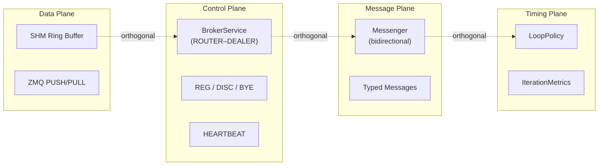
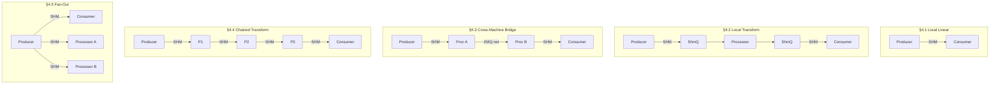
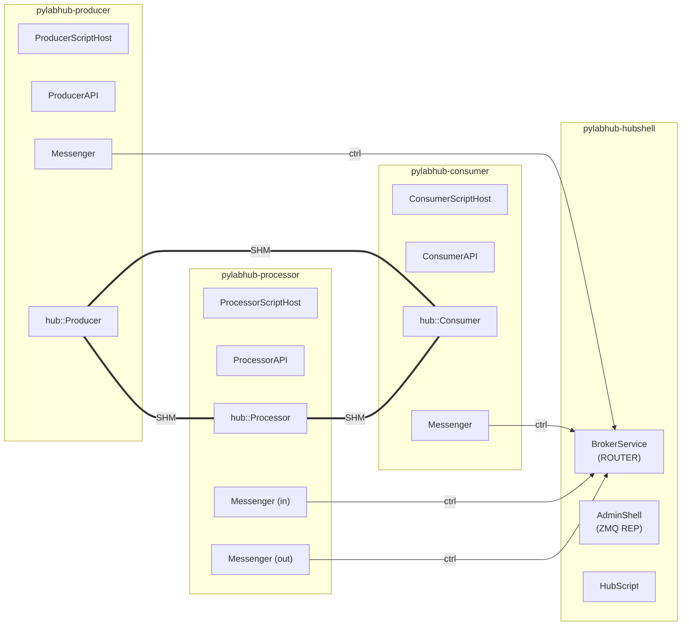

# HEP-CORE-0017: Pipeline Architecture

| Property      | Value                                                                           |
|---------------|---------------------------------------------------------------------------------|
| **HEP**       | `HEP-CORE-0017`                                                                 |
| **Title**     | Pipeline Architecture — Components, Planes, Topologies, and Boundaries         |
| **Status**    | Implemented — 2026-03-03                                                        |
| **Created**   | 2026-03-01                                                                      |
| **Updated**   | 2026-03-01 (actor eliminated; producer/consumer binaries added)                 |
| **Area**      | Framework Architecture (`pylabhub-utils`, `pylabhub-producer`, `pylabhub-consumer`, `pylabhub-processor`) |
| **Depends on**| HEP-CORE-0002 (DataHub), HEP-CORE-0007 (Protocol), HEP-CORE-0011 (ScriptHost), HEP-CORE-0016 (Schema Registry), HEP-CORE-0018 (Producer/Consumer) |

---

## 1. Motivation

As the DataHub system grows to include Producers, Consumers, Processors, and schema
management, it becomes useful to have a single document that captures:

1. The **four planes** of communication and their strict separation
2. The **component roles** and the boundary decisions behind each
3. The **topology patterns** that compose these components into pipelines
4. How **schema** integrates with pipeline construction
5. The **deployment model** that governs binary identity and config

This document does not re-specify any protocol or implementation detail — those
live in the per-component HEPs (0002, 0007, 0015, 0016, 0018). This document
provides the cross-cutting architectural view.

---

## 2. The Four Planes

Every channel in the DataHub system carries traffic on four independent planes.
These planes are strictly orthogonal: changes to one have no effect on the others.

| Plane | What flows | Mechanism | Where defined |
|-------|-----------|-----------|---------------|
| **Data plane** | Slot payloads (raw bytes) | SHM ring buffer (`DataBlockProducer`/`Consumer`) or ZMQ frames (`hub::Queue`) | HEP-CORE-0002 §3 |
| **Control plane** | HELLO / BYE / REG / DISC / HEARTBEAT | ZMQ ROUTER–DEALER ctrl sockets + Broker | HEP-CORE-0007 |
| **Message plane** | Arbitrary typed messages (bidirectional) | ZMQ via `Messenger` | HEP-CORE-0007 §6 |
| **Timing plane** | Loop pacing — fixed rate, max rate, compensating | `LoopPolicy` on `DataBlockProducer`/`Consumer` | HEP-CORE-0008 |



**Why this separation matters:**

- Replacing SHM with ZMQ on the data plane does not touch the control plane
  (HELLO/BYE/heartbeat still flow on the same ZMQ ctrl sockets).
- Changing `LoopPolicy` from `FixedPace` to `MaxRate` has no effect on what
  messages flow on the message plane.
- A Processor that bridges two brokers must maintain control-plane connections
  to **both** brokers independently of whether its data transport is SHM or ZMQ.

The invariant: **the broker is always a control-plane coordinator, never a data relay.**
Data bytes never pass through the broker.

---

## 3. Component Roles and Boundaries

### 3.1 Producer (`hub::Producer`)

| Property | Value |
|----------|-------|
| Direction | Write-only |
| Data transport | SHM exclusively |
| Channel ownership | Creates the SHM segment; registers as writer with broker |
| SHM-specific facilities | Spinlocks (`api.spinlock(i)`), `WriteProcessorContext`, `LoopPolicy`, acquire-timing metrics |
| Broker protocol | `REG_REQ` → `REG_ACK`; sends `HEARTBEAT_REQ`; handles `BYE` from consumers |
| Lives on | Same host as the SHM segment |

The Producer is **intentionally SHM-specific**. Its SHM facilities (spinlocks, slot
transaction API, timing metrics, LoopPolicy) are core features, not implementation
details. `hub::Queue` must not be inserted between Producer and its underlying
`DataBlockProducer` — there is no benefit and significant cost (API dilution,
spurious ZMQ code paths, lost spinlock access).

### 3.2 Consumer (`hub::Consumer`)

| Property | Value |
|----------|-------|
| Direction | Read-only |
| Data transport | SHM exclusively |
| Channel ownership | Attaches to existing SHM; registers as reader with broker |
| SHM-specific facilities | Spinlocks, `ReadProcessorContext`, `LoopPolicy`, acquire-timing metrics |
| Broker protocol | `CONSUMER_REG_REQ` → `DISC_ACK`; sends HELLO to producer; `CONSUMER_DEREG_REQ` on exit |
| Lives on | Same host as the SHM segment |

Same boundary principle as Producer. Consumer is the rich SHM-local reading
interface; cross-machine reading is achieved by composing with a bridge Processor
(§4.3), not by making Consumer transport-agnostic.

### 3.3 hub::Queue

| Property | Value |
|----------|-------|
| Abstraction | Virtual base: `read_acquire` / `read_release` / `write_acquire` / `write_commit` / `write_abort` |
| Concrete types | `ShmQueue` (wraps `DataBlockConsumer`/`Producer`) · `ZmqQueue` (wraps raw ZMQ PULL/PUSH) |
| Used by | `hub::Processor` exclusively |
| Does NOT carry | Control plane, message plane, timing plane |
| Runtime cost | ~2 ns virtual dispatch vs 100–500 ns SHM acquire — < 1% overhead |

`hub::Queue` is the **data plane abstraction for the Processor layer only**. It
provides a transport-agnostic interface so that `hub::Processor`'s transform loop
does not need to know whether the underlying transport is SHM or ZMQ. Everything
above the data plane (control, message, timing) is handled by the components that
own the endpoints, not by the Queue.

See HEP-CORE-0002 §17.3 for detailed rationale.

### 3.4 hub::Processor

| Property | Value |
|----------|-------|
| Direction | Read-from-one-Queue, write-to-another-Queue |
| Data transport | Any Queue type (SHM, ZMQ, or mixed) |
| Channel ownership | None — takes `Queue&` references; channels are owned by caller |
| Control plane | Optional: when embedded inside `ProcessorRoleWorker`, connects to broker(s) |
| Timing | Demand-driven: blocks on `in_q->read_acquire(timeout)`; no fixed rate |
| Lives on | Any host — transport constraints are per-Queue, not per-Processor |

The Processor's transform loop is purely data-plane: acquire input slot →
optionally acquire output slot → call handler → commit or discard → release input.
It has no knowledge of schema, broker protocol, or Python GIL. Those concerns are
handled by `processor_main` (standalone binary) and `ProcessorScriptHost`,
which construct the appropriate Queues and own the control plane.

---

## 4. Topology Patterns

### 4.0 Topology Overview



### 4.1 Local Linear Pipeline

All components on the same host, single broker:

```
  hub::Producer ──[SHM]──► hub::Consumer
```

- Producer creates the SHM segment and registers with broker.
- Consumer attaches and registers as reader.
- Both use `LoopPolicy` for timing; both have full spinlock access.
- Broker coordinates registration and monitors health via heartbeat.

This is the baseline topology. No Queue, no Processor involved.

### 4.2 Local Transform Pipeline

All components on the same host; Processor transforms in-line:

```
  hub::Producer ──[SHM]──► ShmQueue(read) ──► Processor ──► ShmQueue(write) ──[SHM]──► hub::Consumer
```

- Producer and Consumer own their SHM segments and broker registrations.
- Processor is a pure transform unit: no broker registration of its own when
  used as a standalone `hub::Processor` (no control plane); the caller is responsible
  for building the ShmQueues after obtaining DataBlock handles.
- When run as `pylabhub-processor`, the `ProcessorScriptHost` holds
  the control-plane connections and constructs the Queues after broker handshake.

### 4.3 Cross-Machine Bridge

Processor bridges SHM on Machine A to SHM on Machine B via ZMQ:

```
Machine A:
  hub::Producer ──[SHM]──► ShmQueue(read) ──► Processor(bridge A) ──► ZmqQueue(write) ──[net]──►

Machine B:
  ──[net]──► ZmqQueue(read) ──► Processor(bridge B) ──► ShmQueue(write) ──[SHM]──► hub::Consumer
```

Each bridge Processor:
- On Machine A: `in_transport=shm`, `out_transport=zmq`
- On Machine B: `in_transport=zmq`, `out_transport=shm`
- Has a pass-through handler (copy in_slot → out_slot) or a lightweight transform
- Maintains separate control-plane connections to its respective broker(s)

`hub::Producer` and `hub::Consumer` at both ends are unchanged — they remain
SHM-local and expose the full set of SHM-specific facilities to their callers.

### 4.4 Chained Transform Pipeline

Multiple Processors in series for staged processing:

```
  Producer ──[SHM]──► P1(normalize) ──[SHM]──► P2(filter) ──[SHM]──► P3(compress) ──[SHM]──► Consumer
```

Each Processor reads from one SHM channel and writes to the next. Each has its
own `hub::Processor` instance, its own broker registration, and its own transform
callback. The intermediate SHM segments have no direct Producer/Consumer — they
are created by P1/P2/P3 as their output channels.

Note: In this topology each intermediate channel has only one writer (Processor Pn)
and one reader (Processor Pn+1). The Producer/Consumer heartbeat model handles
liveness for each hop.

### 4.5 Fan-Out Pipeline

One `pylabhub-producer`, multiple consumers (including processors):

```
                         ──► pylabhub-consumer  (local monitor)
  pylabhub-producer ──[SHM]──► pylabhub-processor (archive)
                         ──► pylabhub-processor (analysis, cross-machine)
```

The SHM ring buffer supports multiple consumers natively (`ConsumerSyncPolicy`).
Each consumer/processor registers independently. The producer's `zmq_thread_`
tracks all registered consumers and handles BYE/disconnect for each.

---

## 5. Schema Integration

### 5.1 Schema at Pipeline Construction Time

When constructing a pipeline, each channel endpoint declares its expected slot layout.
This layout drives:

1. **C++ struct size** passed as `item_size` to `ShmQueue::from_consumer/producer()`
2. **BLDS string** registered with the broker in `REG_REQ` (unnamed schema)
3. **Schema ID** optionally referenced in `ProducerOptions::schema_id` (named schema, HEP-CORE-0016)

Schema validation occurs at the control-plane level (broker checks producer/consumer
BLDS hash match) before the data plane is even established. By the time
`read_acquire()` returns the first slot, the schema contract has already been verified.

### 5.2 Named vs Unnamed Schemas

| Schema type | Identity | Config syntax | Broker behavior |
|-------------|----------|---------------|-----------------|
| **Unnamed** | BLAKE2b-256 hash of BLDS string | Inline field list in `slot_schema` | Stores hash; attempts reverse lookup against schema library |
| **Named** | Human-readable ID (`lab.sensors.temperature.raw@1`) | `schema_id: "lab.sensors.temperature.raw@1"` | Resolves ID → hash; stores both |

The **checksum is always the wire primitive** — the broker always verifies the BLDS
hash match. The name is an alias that makes mismatches human-readable and enables
discoverability via `SCHEMA_REQ`.

See HEP-CORE-0016 for the full Named Schema Registry specification.

### 5.3 C++ Type ↔ Schema Linkage

In C++ code, struct registration via `PYLABHUB_SCHEMA_BEGIN/MEMBER/END` macros
produces a `SchemaInfo` that contains both the BLDS string and its hash. This
hash is passed directly in `ProducerOptions::schema_blds_hash` — the struct IS
the schema at compile time. No runtime JSON parsing is involved.

For scripted roles (Python), the schema library provides runtime ctypes generation
from the named schema JSON. The ctypes layout must match the BLDS string exactly
(alignment, field order, types). See HEP-CORE-0016 §6 for the ctypes generation
rules.

---

## 6. Deployment Model

### 6.1 Binary Interconnection



### 6.2 Binary Types

The framework ships four user-facing binaries:

| Binary | Identity format | Config file | Description |
|--------|----------------|-------------|-------------|
| `pylabhub-hubshell` | `HUB-{NAME}-{8HEX}` | `hub.json` | Data hub: broker service + Python admin shell |
| `pylabhub-producer` | `PROD-{NAME}-{8HEX}` | `producer.json` | Standalone producer: writes to one channel |
| `pylabhub-consumer` | `CONS-{NAME}-{8HEX}` | `consumer.json` | Standalone consumer: reads from one channel |
| `pylabhub-processor` | `PROC-{NAME}-{8HEX}` | `processor.json` | Standalone processor: reads from A, transforms, writes to B |

Each binary:
- Owns its directory: one config file, one vault, one script package, one PID lock
- Has exactly one UID — immutable after generation
- Hosts exactly one data-plane role (one channel in and/or one channel out)

### 6.3 Configuration Hierarchy

```
<hub_dir>/
  hub.json           ← HubShell config (broker, script, vault)
  vault/             ← Encrypted keypair store (HubVault)
  script/
    python/
      __init__.py    ← on_start(api) / on_tick(api, tick) / on_stop(api)
  logs/
  run/

<producer_dir>/
  producer.json      ← producer name, channel, broker, schema, script
  vault/             ← Encrypted keypair store (ProducerVault)
  script/
    python/
      __init__.py    ← on_init(api) / on_produce(out_slot, fz, msgs, api) / on_stop(api)
  logs/
  run/
    producer.pid

<consumer_dir>/
  consumer.json      ← consumer name, channel, broker, schema, script
  vault/             ← Encrypted keypair store (ConsumerVault)
  script/
    python/
      __init__.py    ← on_init(api) / on_consume(in_slot, fz, msgs, api) / on_stop(api)
  logs/
  run/
    consumer.pid

<processor_dir>/
  processor.json     ← processor name, in_channel, out_channel, broker(s), schema, script
  vault/             ← Encrypted keypair store (ProcessorVault)
  script/
    python/
      __init__.py    ← on_init(api) / on_process(in_slot, out_slot, fz, msgs, api) / on_stop(api)
  logs/
  run/
    processor.pid
```

**Script path rule (all four components):**
`script.type` is required; C++ resolves `<script.path>/<script.type>/__init__.py`.
Standard config: `"script": {"type": "python", "path": "./script"}`.

### 6.4 Deployment Topology Examples

**Single-machine pipeline:**
```
<hub_dir>/hub.json          ← one broker
<producer_dir>/producer.json  ← PROD-SENSOR-A3F7C219, connects to hub
<consumer_dir>/consumer.json  ← CONS-LOGGER-B7E3A142, connects to hub
```

**Multi-channel transform pipeline (same machine):**
```
<hub_dir>/hub.json
<sensor_producer>/producer.json    ← writes lab.raw.temperature
<norm_processor>/processor.json    ← reads lab.raw.temperature, writes lab.norm.temperature
<archive_consumer>/consumer.json   ← reads lab.norm.temperature
<monitor_consumer>/consumer.json   ← reads lab.norm.temperature (second consumer, same channel)
```

**Cross-machine bridge:**
```
Machine A: <hub_a>/hub.json + <sensor_producer>/producer.json
           <bridge_proc_a>/processor.json  (in=shm:lab.raw, out=zmq:bridge_endpoint)

Machine B: <hub_b>/hub.json
           <bridge_proc_b>/processor.json  (in=zmq:bridge_endpoint, out=shm:lab.norm)
           <archive_consumer>/consumer.json
```

Each process has its own directory and UID regardless of which machine it runs on.
Multi-machine coordination is via broker registrations, not shared config directories.

---

## 7. Design Invariants

The following invariants must hold across all topology patterns and all future
component additions:

1. **The broker never relays data.** All data bytes flow directly between endpoints
   via SHM or ZMQ point-to-point. The broker only coordinates registration and
   monitors liveness.

2. **Producer and Consumer are permanently SHM-local.** No transport-agnostic
   abstraction (Queue or otherwise) is inserted between `hub::Producer`/`Consumer`
   and their underlying `DataBlockProducer`/`Consumer`. Cross-machine flow is
   achieved via bridge Processors.

3. **hub::Queue carries the data plane only.** Queue implementations do not
   manage control-plane sockets, Messenger instances, or LoopPolicy. Those
   are the responsibility of the component that owns the Queue.

4. **The checksum is the schema truth.** The broker always validates the BLAKE2b-256
   hash of the BLDS string. Schema names are human-readable aliases; they never
   override the structural hash check.

5. **Explicit transport selection, fail-fast.** Transport is declared in config, not
   inferred. A mismatch between declared transport and broker-advertised availability
   is a hard startup failure with a diagnostic message. Silent fallback is not allowed.

6. **Control-plane connections are per-broker.** A Processor using two brokers
   maintains two independent control-plane connections. There is no multiplexing or
   proxying at the control-plane level.

---

## 8. Cross-Reference Index

| Topic | Authoritative document |
|-------|----------------------|
| SHM memory layout, ring buffer, slot state machine | HEP-CORE-0002 |
| Four planes (data/control/message/timing) rationale | HEP-CORE-0002 §17 |
| Producer/Consumer SHM-specific design principle | HEP-CORE-0002 §17.2 |
| hub::Queue data plane abstraction detail | HEP-CORE-0002 §17.3 |
| HELLO/BYE/REG/DISC/HEARTBEAT protocol | HEP-CORE-0007 |
| LoopPolicy and iteration metrics | HEP-CORE-0008 |
| Connection policy (ConsumerSyncPolicy, etc.) | HEP-CORE-0009 |
| ScriptHost abstraction, PythonScriptHost, Lua | HEP-CORE-0011 |
| Channel identity and UID provenance | HEP-CORE-0013 |
| Producer and Consumer standalone binaries | HEP-CORE-0018 |
| Processor standalone binary | HEP-CORE-0015 |
| Named schema ID format, library, registry | HEP-CORE-0016 |

---

## 9. Source File Reference

This is an architecture overview document. The source files that implement each component:

| Component | Key Source Files |
|-----------|-----------------|
| **hub::Producer** | `src/include/utils/hub_producer.hpp`, `src/utils/hub/` |
| **hub::Consumer** | `src/include/utils/hub_consumer.hpp`, `src/utils/hub/` |
| **hub::Queue** | `src/include/utils/hub_queue.hpp` (abstract base) |
| **hub::ShmQueue** | `src/include/utils/hub_shm_queue.hpp`, `src/utils/hub/hub_shm_queue.cpp` |
| **hub::ZmqQueue** | `src/include/utils/hub_zmq_queue.hpp`, `src/utils/hub/hub_zmq_queue.cpp` |
| **hub::Processor** | `src/include/utils/hub_processor.hpp`, `src/utils/hub/hub_processor.cpp` |
| **BrokerService** | `src/include/utils/broker_service.hpp`, `src/utils/ipc/broker_service.cpp` |
| **Messenger** | `src/include/utils/messenger.hpp`, `src/utils/ipc/messenger.cpp` |
| **pylabhub-hubshell** | `src/hubshell.cpp` |
| **pylabhub-producer** | `src/producer/producer_main.cpp`, `src/producer/producer_script_host.cpp` |
| **pylabhub-consumer** | `src/consumer/consumer_main.cpp`, `src/consumer/consumer_script_host.cpp` |
| **pylabhub-processor** | `src/processor/processor_main.cpp`, `src/processor/processor_script_host.cpp` |
| **SchemaLibrary** | `src/include/utils/schema_library.hpp`, `src/utils/schema/schema_library.cpp` |
| **SchemaStore** | `src/include/utils/schema_registry.hpp`, `src/utils/schema/schema_registry.cpp` |
| **LoopPolicy** | `src/include/plh_datahub.hpp` (DataBlock timing) |

---

## Document Status

**Implemented** — 2026-03-03

This document captures architectural decisions made during the Queue Abstraction and
Processor design phase (2026-03-01). All components described here are implemented:
four standalone binaries, hub::Queue abstraction, hub::Processor transform layer,
Named Schema Registry, and the four-plane architecture. 750/750 tests passing.

**Resolved topics:**
- HEP-CORE-0018: `pylabhub-producer` and `pylabhub-consumer` — Phase 1 + Layer 4 tests
- HEP-CORE-0015: Phase 1+2 — dual-broker config, hub::Processor delegation
- HEP-CORE-0016: Named Schema Registry — all 5 phases complete

**Pending extension:**
- HEP-CORE-0019: Metrics Plane — fifth plane (design, not yet implemented)
