# HEP-CORE-0018: Producer and Consumer Binaries

| Property      | Value                                                                    |
|---------------|--------------------------------------------------------------------------|
| **HEP**       | `HEP-CORE-0018`                                                          |
| **Title**     | Producer and Consumer Binaries — Standalone `pylabhub-producer` and `pylabhub-consumer` |
| **Status**    | Implemented — Phase 1 + Layer 4 tests (2026-03-02)                       |
| **Created**   | 2026-03-01                                                               |
| **Area**      | Data Components (`src/producer/`, `src/consumer/`)                       |
| **Depends on**| HEP-CORE-0002 (DataHub), HEP-CORE-0007 (Protocol), HEP-CORE-0008 (LoopPolicy), HEP-CORE-0011 (ScriptHost), HEP-CORE-0013 (Channel Identity), HEP-CORE-0016 (Named Schema Registry) |
| **Supersedes**| HEP-CORE-0010 (Actor Thread Model), HEP-CORE-0014 (Actor Framework Design) |

---

## 0. Implementation Status

**Phase 1 implemented (2026-03-01–02).** All files in `src/producer/` and `src/consumer/`
are complete. Layer 4 tests: 14 producer + 12 consumer. Metrics API added (HEP-CORE-0019,
2026-03-05). `--name` CLI argument added (2026-03-05). 828/828 tests passing.

For remaining work, see `docs/TODO_MASTER.md` and `docs/todo/API_TODO.md`.

---

## 1. Motivation

The former `pylabhub-actor` combined multiple roles (producer, consumer, processor) into a
single process under a shared identity. This caused:

1. **Multi-broker identity ambiguity** — a producer role connecting to Hub A and a consumer
   role connecting to Hub B shared one actor UID, one vault, and one PID file. Logically,
   they were two different deployments.

2. **Multi-machine confusion** — the same actor directory could not serve processes deployed
   on different hosts without introducing conflicting PID locks and UID collisions.

3. **Inconsistency with the processor model** — `pylabhub-processor` was already standalone
   (its own directory, its own UID, its own process). Actor was the exception.

4. **Over-coupling** — the full actor lifecycle stack (Python interpreter, vault, role
   orchestration) ran even for a single-role deployment that would have been better served
   by a purpose-built binary.

**Resolution:** Producer and Consumer are standalone binaries, each owning its directory
exactly as `pylabhub-processor` owns its directory. The actor binary is eliminated.

---

## 2. Component Overview

| Binary | Config file | UID format | Role |
|--------|------------|------------|------|
| `pylabhub-producer` | `producer.json` | `PROD-{NAME}-{8HEX}` | Writes to one channel on one broker |
| `pylabhub-consumer` | `consumer.json` | `CONS-{NAME}-{8HEX}` | Reads from one channel on one broker |
| `pylabhub-processor` | `processor.json` | `PROC-{NAME}-{8HEX}` | Reads from A, transforms, writes to B |
| `pylabhub-hubshell` | `hub.json` | `HUB-{NAME}-{8HEX}` | Broker service + admin shell |

All four binaries:
- Own their directory (config, vault, script, logs, run)
- Have exactly one UID — immutable after generation
- Have one PID lock file (`run/<binary>.pid`) — exclusive: one process per directory at a time
- Host a Python (or Lua) script via `PythonScriptHost` / `LuaScriptHost` (HEP-CORE-0011)

---

## 3. Identity

### Producer

```
PROD-{NAME}-{8HEX}
```

- `{NAME}` — `producer.name` from `producer.json`, upper-cased, non-alphanum stripped
- `{8HEX}` — first 8 hex chars of BLAKE2b-256 of `(name + creation_timestamp_ms)`

Example: `PROD-TEMPSENSOR-A3F7C219`

### Consumer

```
CONS-{NAME}-{8HEX}
```

Example: `CONS-TEMPLOGGER-B7E3A142`

UID generation uses `uid_utils::generate_uid(prefix, name, timestamp)` — add
`generate_producer_uid()` and `generate_consumer_uid()` alongside `generate_processor_uid()`.

---

## 4. Directory Layout

### Producer

Created by `pylabhub-producer --init <dir>`:

```
<producer_dir>/
  producer.json         ← identity + channel + schema + script config
  vault/
    producer.vault      ← encrypted CurveZMQ keypair (optional)
  script/
    python/
      __init__.py       ← on_init / on_produce / on_stop
    lua/                ← only when script.type = "lua"
      main.lua
  logs/                 ← rotating log (producer.log, 10 MB × 3)
  run/
    producer.pid        ← PID while running
```

### Consumer

Created by `pylabhub-consumer --init <dir>`:

```
<consumer_dir>/
  consumer.json         ← identity + channel + schema + script config
  vault/
    consumer.vault      ← encrypted CurveZMQ keypair (optional)
  script/
    python/
      __init__.py       ← on_init / on_consume / on_stop
    lua/                ← only when script.type = "lua"
      main.lua
  logs/                 ← rotating log (consumer.log, 10 MB × 3)
  run/
    consumer.pid        ← PID while running
```

---

## 5. Config Schema

### 5.1 `producer.json`

```json
{
  "producer": {
    "name":      "TempSensor",
    "uid":       "PROD-TEMPSENSOR-A3F7C219",
    "log_level": "info",
    "auth": {
      "keyfile": "./vault/producer.vault"
    }
  },

  "broker":      "tcp://127.0.0.1:5570",
  "channel":     "lab.sensors.temperature",

  "interval_ms": 100,
  "loop_trigger": "shm",

  "slot_schema": {
    "packing": "natural",
    "fields": [
      {"name": "ts",    "type": "float64"},
      {"name": "value", "type": "float32"}
    ]
  },
  "flexzone_schema": {"fields": []},

  "shm": {
    "enabled":    true,
    "slot_count": 8,
    "secret":     0
  },

  "script": {
    "type": "python",
    "path": "."
  }
}
```

### 5.2 `consumer.json`

```json
{
  "consumer": {
    "name":      "TempLogger",
    "uid":       "CONS-TEMPLOGGER-B7E3A142",
    "log_level": "info",
    "auth": {
      "keyfile": "./vault/consumer.vault"
    }
  },

  "broker":     "tcp://127.0.0.1:5570",
  "channel":    "lab.sensors.temperature",

  "timeout_ms": 5000,
  "loop_trigger": "shm",

  "slot_schema": {
    "packing": "natural",
    "fields": [
      {"name": "ts",    "type": "float64"},
      {"name": "value", "type": "float32"}
    ]
  },
  "flexzone_schema": {"fields": []},

  "shm": {
    "enabled":    true,
    "slot_count": 4,
    "secret":     0
  },

  "script": {
    "type": "python",
    "path": "."
  }
}
```

### 5.3 Field Reference — Producer

| Field | Required | Default | Description |
|-------|----------|---------|-------------|
| `producer.name` | yes | — | Human name; used in UID and log prefix |
| `producer.uid` | no | generated | Override auto-generated `PROD-*` UID |
| `producer.log_level` | no | `"info"` | `debug`/`info`/`warn`/`error` |
| `producer.auth.keyfile` | no | `""` | Vault file path; empty = ephemeral CURVE identity |
| `broker` | yes | — | Broker endpoint (`tcp://host:port`) |
| `broker_pubkey` | no | `""` | CurveZMQ broker public key Z85 |
| `hub_dir` | no | — | Hub directory; reads `hub.json` to derive `broker`/`broker_pubkey` |
| `channel` | yes | — | Channel name to publish on |
| `interval_ms` | no | `0` | Write loop interval; 0 = max rate (`SHM`-slot paced) |
| `loop_trigger` | no | `"shm"` | `"shm"` (slot-paced) or `"messenger"` (message-event-driven) |
| `slot_schema` | yes‡ | — | Output slot layout (or use `schema_id` from HEP-CORE-0016) |
| `flexzone_schema` | no | absent | Writable flexzone layout |
| `shm.enabled` | no | `true` | Use SHM transport |
| `shm.slot_count` | yes | — | Ring buffer depth (number of slots) |
| `shm.secret` | no | `0` | Shared secret for SHM name derivation |
| `script.type` | yes | `"python"` | Script type: `"python"` or `"lua"` |
| `script.path` | yes | `"."` | Base script directory; C++ resolves `<path>/script/<type>/__init__.py` |

### 5.4 Field Reference — Consumer

| Field | Required | Default | Description |
|-------|----------|---------|-------------|
| `consumer.name` | yes | — | Human name; used in UID and log prefix |
| `consumer.uid` | no | generated | Override auto-generated `CONS-*` UID |
| `consumer.log_level` | no | `"info"` | `debug`/`info`/`warn`/`error` |
| `consumer.auth.keyfile` | no | `""` | Vault file path; empty = ephemeral CURVE identity |
| `broker` | yes | — | Broker endpoint |
| `broker_pubkey` | no | `""` | CurveZMQ broker public key Z85 |
| `hub_dir` | no | — | Hub directory; derives `broker`/`broker_pubkey` from `hub.json` |
| `channel` | yes | — | Channel name to subscribe to |
| `timeout_ms` | no | `5000` | `on_consume(in_slot=None,…)` fires after this many ms of silence |
| `loop_trigger` | no | `"shm"` | `"shm"` (slot-paced) or `"messenger"` (message-event-driven) |
| `slot_schema` | yes‡ | — | Expected input slot layout (must match producer's schema) |
| `flexzone_schema` | no | absent | Flexzone layout (zero-copy writable view, user-coordinated R/W) |
| `shm.enabled` | no | `true` | Use SHM transport |
| `shm.slot_count` | no | — | Local consumer buffer depth (optional hint; broker-advertised value used) |
| `shm.secret` | no | `0` | Shared secret matching the producer's `shm.secret` |
| `script.type` | yes | `"python"` | Script type: `"python"` or `"lua"` |
| `script.path` | yes | `"."` | Base script directory; C++ resolves `<path>/script/<type>/__init__.py` |

‡ Exactly one of the inline `slot_schema` block or `schema_id` string is required
(Phase 2 after HEP-CORE-0016 Phase 3).

---

## 6. Python Script Interface

### 6.1 Producer Script (`<producer_dir>/script/python/__init__.py`)

```python
def on_init(api) -> None:
    """Called once before the write loop starts. Use for state initialization."""
    api.log(f"Producer {api.name()} starting on channel {api.channel()}")

def on_produce(out_slot, flexzone, messages, api) -> bool:
    """
    Called once per write-loop iteration.

    out_slot:  writable ctypes struct (slot_schema layout). Always non-None.
    flexzone:  writable ctypes struct (flexzone_schema layout). None if not configured.
    messages:  list of (sender: str, data: bytes) received via Messenger since last call.
    api:       ProducerAPI — see §6.3.

    Return True or None  → commit out_slot to the SHM ring (slot is published).
    Return False         → skip this iteration; nothing is written to the ring.
    """
    import time
    out_slot.ts    = time.monotonic()
    out_slot.value = read_sensor()
    return True

def on_stop(api) -> None:
    """Called once after the write loop exits cleanly."""
    api.log("Producer stopping")
```

### 6.2 Consumer Script (`<consumer_dir>/script/python/__init__.py`)

```python
def on_init(api) -> None:
    """Called once before the read loop starts."""
    api.log(f"Consumer {api.name()} subscribing to channel {api.channel()}")

def on_consume(in_slot, flexzone, messages, api) -> None:
    """
    Called for each slot received, or on timeout.

    in_slot:   zero-copy ctypes struct (slot_schema layout), write-guarded via __setattr__.
               None on timeout. See §6.4 for field access and numpy conversion.
    flexzone:  zero-copy writable ctypes struct (flexzone_schema layout). User-coordinated R/W.
               None if not configured.
    messages:  list of (sender: str, data: bytes) received via Messenger since last call.
    api:       ConsumerAPI — see §6.3.

    No return value — consumer has no output slot to commit or discard.
    """
    if in_slot is None:
        api.log("timeout — no slot received", level="warn")
        return
    api.log(f"ts={in_slot.ts:.3f}  value={in_slot.value:.4f}")

def on_stop(api) -> None:
    """Called once after the read loop exits cleanly."""
```

### 6.3 ProducerAPI / ConsumerAPI

Both expose a common API surface, plus role-specific methods:

```python
# Identity
api.name()          # → str: binary name ("TempSensor")
api.uid()           # → str: "PROD-TEMPSENSOR-A3F7C219"
api.channel()       # → str: channel name

# Logging
api.log(msg, level="info")   # level: "debug"/"info"/"warn"/"error"

# Messaging (Messenger — same semantics as ProcessorAPI)
api.send(target, data)       # send to specific UID
api.broadcast(data)          # send to all connected peers
api.notify_channel(target, event, data="")  # signal relay to target channel's producer

# Counters
api.out_slots_written()      # → int (producer only)
api.in_slots_received()      # → int (consumer only)
api.script_error_count()     # → int

# Custom Metrics (HEP-CORE-0019)
api.report_metric(key, value)     # report single custom metric (key: str, value: number)
api.report_metrics(dict)          # batch report {key: number} pairs
api.clear_custom_metrics()        # clear all custom metrics (base counters unaffected)

# Producer-only: spinlock on flexzone (same as ProcessorAPI.spinlock())
api.spinlock(idx)            # → context manager; valid only if flexzone configured

# Shutdown
api.stop()                   # Request clean shutdown from inside callback
api.set_critical_error(msg)  # Mark as failed and trigger shutdown
```

---

### 6.4 Slot Types and Field Access

The slot objects passed to `on_produce` and `on_consume` are **zero-copy views** into shared memory.

#### ctypes slots (default, `expose_as: ctypes`)

Fields map directly to the schema definition. Assignment is always in-place (no copy):

```python
# Schema: {"name": "ts", "type": "float64"}, {"name": "value", "type": "int32"}
out_slot.ts    = time.monotonic()   # float64 field — writes into SHM
out_slot.value = sensor_reading     # int32 field
```

Consumer `in_slot` has `__setattr__` overridden to raise `AttributeError` on writes:

```python
in_slot.ts              # OK — read
in_slot.value = 42      # raises AttributeError: read-only slot: field 'value' cannot be written
```

*Known limitation:* Array sub-elements (`in_slot.arr[0] = x`) bypass the struct-level guard —
this is a ctypes limitation (`__setitem__` on the subarray object, not `__setattr__` on the struct).

#### Array fields (`"count": N > 1`)

Fields with `"count": N` (e.g., `{"name": "samples", "type": "float32", "count": 100}`) become
ctypes arrays (`c_float * 100`). Use `np.ctypeslib.as_array()` for a zero-copy numpy view:

```python
import numpy as np

# Consumer — read-only numpy view (do not write back):
arr = np.ctypeslib.as_array(in_slot.samples)    # shape=(100,), dtype=float32

# Producer — writable numpy view:
arr = np.ctypeslib.as_array(out_slot.samples)
arr[:] = new_data                                # writes directly into SHM slot
```

Note: `expose_as` is slot-level, not per-field. All fields in a ctypes slot come as ctypes types;
manual `np.ctypeslib.as_array()` is the correct approach for per-field numpy access.

#### Raw buffer access

The raw bytes of any slot are accessible via the Python buffer protocol:

```python
data = bytes(in_slot)                # immutable copy of all bytes
view = memoryview(in_slot).cast('B') # zero-copy byte view
```

This is equivalent to the C++ `buffer_span()` accessor.

#### numpy slots (`expose_as: numpy`)

When `expose_as: numpy` is configured, the slot is a `numpy.ndarray`. Consumer (`in_slot`)
arrays have `writeable=False` set on the numpy array, so writes raise `ValueError`.

---

## 7. Thread Model

Each binary runs two threads per its data-path role, mirroring the
`hub::Producer` / `hub::Consumer` pattern from Layer 3:

### Producer

```
main thread:
  parse config → open vault → LifecycleGuard → ProducerScriptHost.start()
  → wait for SIGINT/SIGTERM

interpreter thread (PythonScriptHost.thread_fn_):
  Py_Initialize → load script package → on_init(api)
  GIL released (main_thread_release_.emplace())

zmq_thread_:
  HELLO → REG_REQ → await REG_ACK (SHM name + broker config)
  heartbeat loop (sends HEARTBEAT_REQ when iteration_count_ advances)
  handles BYE from consumers

loop_thread_:
  while !stop_:
    drain incoming_queue_ (ZMQ callbacks → no GIL race)
    acquire GIL
    out_slot = acquire_write_slot(timeout)
    on_produce(out_slot, fz, messages, api)
    if True: commit slot; if False: abort slot
    release GIL
    update LoopPolicy

on_stop(api) → GIL re-acquired → Py_Finalize
```

### Consumer

```
main thread:
  parse config → open vault → LifecycleGuard → ConsumerScriptHost.start()
  → wait for SIGINT/SIGTERM

interpreter thread (PythonScriptHost.thread_fn_):
  Py_Initialize → load script package → on_init(api)
  GIL released (main_thread_release_.emplace())

zmq_thread_:
  HELLO → CONSUMER_REG_REQ → await DISC_ACK (SHM name from producer)
  attach SHM (find_datablock_consumer)
  heartbeat loop; handles producer BYE

loop_thread_:
  while !stop_:
    drain incoming_queue_
    in_slot = acquire_consume_slot(timeout_ms)   ← None on timeout
    acquire GIL
    on_consume(in_slot, fz, messages, api)
    release GIL
    release_consume_slot(in_slot) if non-None
    update LoopPolicy

on_stop(api) → GIL re-acquired → Py_Finalize
```

**Key invariants:**
- `incoming_queue_` (mutex + condvar) serialises ZMQ callbacks to the loop thread — no GIL race
- `PyConfig.install_signal_handlers = 0` in both binaries (same as hub and processor)
- `main_thread_release_` is emplaced after `on_init` completes, reset before `on_stop`
- All `py::object` locals live on the interpreter thread only — no shared Python objects

---

## 8. CLI

### Producer

```
pylabhub-producer --init <dir> [--name <name>]  # Create producer.json + vault + script/python/__init__.py
pylabhub-producer <dir>                          # Run (open vault, register, start loop)
pylabhub-producer --config <path> --validate     # Validate config + script; exit 0 on success
pylabhub-producer --config <path> --keygen       # Generate vault keypair; print public key to stdout
pylabhub-producer --dev [dir]                    # Ephemeral keypair; dir optional (uses cwd)
pylabhub-producer --version                      # Print version string
```

### Consumer

```
pylabhub-consumer --init <dir> [--name <name>]  # Create consumer.json + vault + script/python/__init__.py
pylabhub-consumer <dir>                          # Run (open vault, discover channel, start loop)
pylabhub-consumer --config <path> --validate     # Validate config + script; exit 0 on success
pylabhub-consumer --config <path> --keygen       # Generate vault keypair; print public key to stdout
pylabhub-consumer --dev [dir]                    # Ephemeral keypair
pylabhub-consumer --version                      # Print version string
```

`--init` generates:
- `producer.json` / `consumer.json` with template values and a generated UID
- `vault/producer.vault` / `vault/consumer.vault` via vault `create()` (prompts for password)
- `script/python/__init__.py` with template callbacks

`--name` is optional for `--init`. If provided, sets the component name in the generated config.
If omitted and stdin is a terminal, prompts interactively. If omitted and stdin is not a terminal
(e.g., spawned by tests or CI), uses the directory name as default.

---

## 9. C++ Implementation Plan

### 9.1 New Files — Producer

| File | Description |
|------|-------------|
| `src/producer/producer_config.hpp` | `ProducerConfig` struct + `from_json_file()` / `from_directory()` |
| `src/producer/producer_config.cpp` | JSON parsing (mirrors `processor_config.cpp`) |
| `src/producer/producer_api.hpp` | `ProducerAPI` class — C++ side of Python `api` object |
| `src/producer/producer_api.cpp` | Implementation + `PYBIND11_EMBEDDED_MODULE(pylabhub_producer, m)` |
| `src/producer/producer_script_host.hpp` | `ProducerScriptHost : PythonScriptHost` |
| `src/producer/producer_script_host.cpp` | Drives load/start/loop/stop |
| `src/producer/producer_main.cpp` | CLI entry point (mirrors `processor_main.cpp`) |
| `src/producer/CMakeLists.txt` | Builds `pylabhub-producer` binary |

### 9.2 New Files — Consumer

| File | Description |
|------|-------------|
| `src/consumer/consumer_config.hpp` | `ConsumerConfig` struct + `from_json_file()` / `from_directory()` |
| `src/consumer/consumer_config.cpp` | JSON parsing |
| `src/consumer/consumer_api.hpp` | `ConsumerAPI` class |
| `src/consumer/consumer_api.cpp` | Implementation + `PYBIND11_EMBEDDED_MODULE(pylabhub_consumer, m)` |
| `src/consumer/consumer_script_host.hpp` | `ConsumerScriptHost : PythonScriptHost` |
| `src/consumer/consumer_script_host.cpp` | Drives load/start/loop/stop |
| `src/consumer/consumer_main.cpp` | CLI entry point |
| `src/consumer/CMakeLists.txt` | Builds `pylabhub-consumer` binary |

### 9.3 Reused Components (no changes needed)

| Component | Reuse |
|-----------|-------|
| `hub::Producer` (`hub_producer.hpp/cpp`) | Embedded inside `ProducerScriptHost` — owns SHM segment |
| `hub::Consumer` (`hub_consumer.hpp/cpp`) | Embedded inside `ConsumerScriptHost` — attaches SHM |
| `Messenger` (`messenger.hpp/cpp`) | One per binary for ZMQ control plane |
| `ActorVault` | Reused: `using ProducerVault = ActorVault; using ConsumerVault = ActorVault;` (ActorVault is a generic vault — name is legacy) |
| `uid_utils` | Add `generate_producer_uid()`, `generate_consumer_uid()` |
| `scripting::PythonScriptHost` | Base class for both `ProducerScriptHost` and `ConsumerScriptHost` |
| `LifecycleGuard` | Manages Logger + Crypto modules |

### 9.4 ProducerConfig

```cpp
struct ProducerConfig {
    std::string  uid;
    std::string  name;
    std::string  log_level{"info"};
    std::string  keyfile;           // vault path; empty = ephemeral

    std::string  broker{"tcp://127.0.0.1:5570"};
    std::string  broker_pubkey;
    std::string  hub_dir;           // alternative to broker; reads hub.json

    std::string  channel;

    int          interval_ms{0};    // 0 = max rate (SHM-slot paced)
    std::string  loop_trigger{"shm"};

    nlohmann::json slot_schema_json;
    nlohmann::json flexzone_schema_json;

    bool         shm_enabled{true};
    uint32_t     shm_slot_count{8};
    uint64_t     shm_secret{0};

    std::string  script_type{"python"};
    std::string  script_path{"./script"};

    static ProducerConfig from_json_file(const std::string &path);
    static ProducerConfig from_directory(const std::string &dir);
};
```

### 9.5 ConsumerConfig

```cpp
struct ConsumerConfig {
    std::string  uid;
    std::string  name;
    std::string  log_level{"info"};
    std::string  keyfile;

    std::string  broker{"tcp://127.0.0.1:5570"};
    std::string  broker_pubkey;
    std::string  hub_dir;

    std::string  channel;

    int          timeout_ms{5000};
    std::string  loop_trigger{"shm"};

    nlohmann::json slot_schema_json;
    nlohmann::json flexzone_schema_json;

    bool         shm_enabled{true};
    uint32_t     shm_slot_count{0};  // hint; broker-advertised value used
    uint64_t     shm_secret{0};

    std::string  script_type{"python"};
    std::string  script_path{"./script"};

    static ConsumerConfig from_json_file(const std::string &path);
    static ConsumerConfig from_directory(const std::string &dir);
};
```

### 9.6 Script Path Resolution

C++ resolves the script path identically for all four components:

```
config.script_path + "/script/" + config.script_type + "/" + "__init__.py"
```

For `"script": {"type": "python", "path": "."}`:
→ `./script/python/__init__.py`

**Important:** The correct default is `"path": "."`, NOT `"path": "./script"`.
Using `"./script"` would resolve to `./script/script/python/__init__.py` (double-nesting bug).

This is implemented in `ProducerScriptHost::do_initialize()` and
`ConsumerScriptHost::do_initialize()` using the same helper function as
`ProcessorScriptHost`. No `module` parameter — each binary has exactly one script package.

---

## 10. PID Lock and Instance Guard

Each binary writes its PID to `<dir>/run/<binary>.pid` on startup and removes it on
clean exit. Before writing:

1. Read existing PID file if present
2. Check if that process is still alive (`kill(pid, 0)`)
3. If alive: log error and exit (duplicate instance)
4. If stale (process gone): overwrite PID file and continue

This ensures exactly one instance per directory at any time. Multiple deployments of the
same binary require separate directories.

---

## 11. Schema Configuration

Both producer and consumer support inline (unnamed) schemas and named schemas
(HEP-CORE-0016 Phase 3):

```json
// Inline (unnamed):
"slot_schema": {"packing": "natural", "fields": [...]}

// Named (Phase 2, after HEP-CORE-0016 Phase 3):
"schema_id": "lab.sensors.temperature.raw@1"
```

The BLAKE2b-256 hash of the BLDS string is the wire primitive. Schema names are human
aliases that the broker resolves to hashes. Mismatches produce hard startup failures.

See HEP-CORE-0016 for the full Named Schema Registry specification.

---

## 12. Cross-Reference Index

| Topic | Authoritative document |
|-------|----------------------|
| SHM memory layout, ring buffer, slot state machine | HEP-CORE-0002 |
| HELLO/BYE/REG/DISC/HEARTBEAT protocol | HEP-CORE-0007 |
| LoopPolicy and iteration metrics | HEP-CORE-0008 |
| Connection policy (ConsumerSyncPolicy, etc.) | HEP-CORE-0009 |
| ScriptHost abstract base, PythonScriptHost | HEP-CORE-0011 |
| Channel identity and UID provenance | HEP-CORE-0013 |
| Named schema ID format, library, registry | HEP-CORE-0016 |
| Processor standalone binary | HEP-CORE-0015 |
| Pipeline topologies and five planes | HEP-CORE-0017 |

---

## 13. Binary Architecture

Both binaries follow the same three-thread architecture:

```mermaid
%%{init: {'theme': 'dark'}}%%
graph TB
    subgraph "pylabhub-producer"
        PM["main thread<br/>parse config → LifecycleGuard<br/>→ wait for g_shutdown"]
        PI["interpreter thread<br/>Py_Initialize → on_init(api)<br/>GIL released"]
        PZ["zmq_thread_<br/>REG_REQ → heartbeat loop<br/>→ enqueue messages"]
        PL["loop_thread_<br/>acquire slot → GIL → on_produce<br/>→ commit/abort → GIL release"]
        PM --> PI
        PI --> PZ
        PI --> PL
    end

    subgraph "pylabhub-consumer"
        CM["main thread<br/>parse config → LifecycleGuard<br/>→ wait for g_shutdown"]
        CI["interpreter thread<br/>Py_Initialize → on_init(api)<br/>GIL released"]
        CZ["zmq_thread_<br/>DISC_REQ → attach SHM<br/>→ heartbeat + messages"]
        CL["loop_thread_<br/>acquire slot → GIL → on_consume<br/>→ release slot → GIL release"]
        CM --> CI
        CI --> CZ
        CI --> CL
    end

    style PM fill:#1e3a5f
    style PI fill:#2a4a2a
    style PZ fill:#5a3a3a
    style PL fill:#4a2a4a
    style CM fill:#1e3a5f
    style CI fill:#2a4a2a
    style CZ fill:#5a3a3a
    style CL fill:#4a2a4a
```



---

## 14. Source File Reference

### Producer
| File | Description |
|------|-------------|
| `src/producer/producer_config.hpp` | `ProducerConfig` struct, `from_json_file()`, `from_directory()` |
| `src/producer/producer_config.cpp` | JSON parsing, hub_dir resolver |
| `src/producer/producer_api.hpp` | `ProducerAPI` — C++ side of Python `api` object |
| `src/producer/producer_api.cpp` | Implementation + `PYBIND11_EMBEDDED_MODULE(pylabhub_producer)` |
| `src/producer/producer_script_host.hpp` | `ProducerScriptHost : PythonRoleHostBase` |
| `src/producer/producer_script_host.cpp` | Timer-driven production loop |
| `src/producer/producer_main.cpp` | CLI entry point |
| `src/producer/CMakeLists.txt` | Builds `pylabhub-producer` binary |
| `tests/test_layer4_producer/` | Config (8) + CLI (6) tests |

### Consumer
| File | Description |
|------|-------------|
| `src/consumer/consumer_config.hpp` | `ConsumerConfig` struct, `from_json_file()`, `from_directory()` |
| `src/consumer/consumer_config.cpp` | JSON parsing, hub_dir resolver |
| `src/consumer/consumer_api.hpp` | `ConsumerAPI` — C++ side of Python `api` object |
| `src/consumer/consumer_api.cpp` | Implementation + `PYBIND11_EMBEDDED_MODULE(pylabhub_consumer)` |
| `src/consumer/consumer_script_host.hpp` | `ConsumerScriptHost : PythonRoleHostBase` |
| `src/consumer/consumer_script_host.cpp` | Demand-driven consumption loop |
| `src/consumer/consumer_main.cpp` | CLI entry point |
| `src/consumer/CMakeLists.txt` | Builds `pylabhub-consumer` binary |
| `tests/test_layer4_consumer/` | Config (6) + CLI (6) tests |

---

## Document Status

**Phase 1 implemented (2026-03-01–02).** All files in `src/producer/` and `src/consumer/`
complete. Layer 4 tests: 14 producer + 12 consumer. Metrics API (HEP-0019) + `--name` CLI
added (2026-03-05). 828/828 tests passing as of 2026-03-05.
