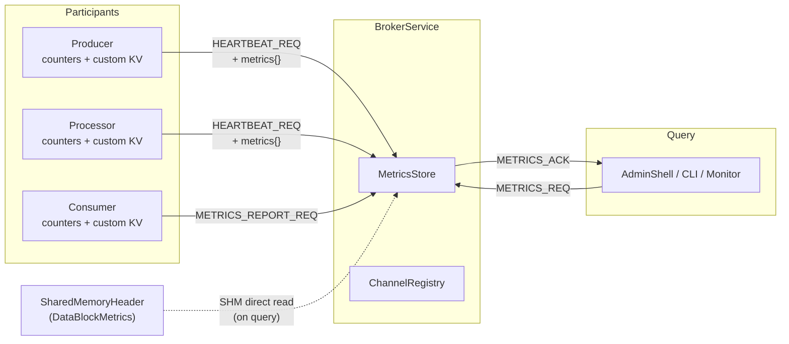
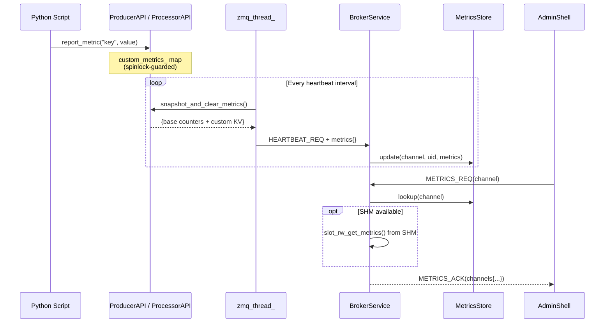

# HEP-CORE-0019: Metrics Plane

| Property       | Value                                                                            |
|----------------|----------------------------------------------------------------------------------|
| **HEP**        | `HEP-CORE-0019`                                                                  |
| **Title**      | Metrics Plane — Passive SHM Metrics, Voluntary ZMQ Reporting, Broker Aggregation |
| **Status**     | Implemented — 2026-03-05 (19 tests; 828/828 passing)                              |
| **Created**    | 2026-03-02                                                                        |
| **Area**       | Framework Architecture (`pylabhub-utils`, all binaries, `BrokerService`)          |
| **Depends on** | HEP-CORE-0002 (DataHub), HEP-CORE-0007 (Protocol), HEP-CORE-0017 (Pipeline)     |

---

## 1. Motivation

The current system has metrics scattered across three independent mechanisms:

1. **SHM-level** (`DataBlockMetrics` in `SharedMemoryHeader`): contention counters,
   race detection, reader peaks — baked into the memory layout, always updated,
   but only readable by processes that have the SHM segment mapped.

2. **Per-binary counters** (`in_slots_received`, `out_slots_written`, `drops`,
   `script_error_count`): maintained by each API object, accessible from Python
   scripts, but never transmitted anywhere.

3. **Heartbeat** (`HEARTBEAT_REQ`): carries `{channel_name, producer_pid}` — a
   bare liveness signal with no metrics payload.

**What's missing:**

- No centralized view of pipeline health — an operator cannot ask the broker
  "what's the throughput on channel X?" or "how many drops has the processor seen?"
- No way for scripts to report custom domain metrics (e.g., "events above threshold",
  "calibration drift") to a central collector.
- SHM metrics are siloed per-segment; cross-segment comparisons require mapping
  every SHM block manually.

**This HEP introduces the Metrics Plane** — a fifth communication plane (extending
HEP-CORE-0017 §2) that unifies passive SHM monitoring and voluntary ZMQ reporting
through the broker as the single aggregation point.

---

## 2. Design Principles

1. **Passive SHM, active ZMQ**: SHM metrics are always being collected (they're
   embedded in `SharedMemoryHeader`). ZMQ metric reports are voluntary — a binary
   sends them when it chooses to, on its own schedule.

2. **Broker aggregates, never proxies data**: The broker stores the latest metrics
   snapshot per (channel, participant). It never relays metrics between participants.
   Monitoring tools query the broker.

3. **Heartbeat carries base metrics automatically**: The existing `HEARTBEAT_REQ`
   message is extended with an optional `metrics` object. This piggybacks on the
   existing heartbeat interval — no new timer, no new socket, no extra traffic.

4. **Scripts extend via `api.report_metric()`**: Custom key-value metrics are
   accumulated on the API object and included in the next heartbeat automatically.
   Zero configuration — just call the API.

5. **Pull model for queries**: External tools (AdminShell, CLI, future dashboards)
   query the broker via a new `METRICS_REQ`/`METRICS_ACK` command pair. The broker
   never pushes metrics unsolicited.

6. **SHM metrics read locally**: Processes that have SHM mapped can read
   `DataBlockMetrics` directly (zero-copy, no ZMQ). The broker also reads SHM
   metrics for channels it knows about, merging them into the aggregated view.

---

## 3. Architecture



**ASCII reference** (original diagram):

```
┌─────────────┐   HEARTBEAT_REQ          ┌──────────────┐
│  Producer    │  + { metrics: {...} }    │              │
│  - counters  │──────────────────────────│              │
│  - custom KV │                          │   Broker     │
└─────────────┘                           │              │
                                          │  ┌────────┐  │   METRICS_REQ / METRICS_ACK
┌─────────────┐   HEARTBEAT_REQ          │  │Metrics │  │◄──────────────────────────────┐
│  Processor   │  + { metrics: {...} }    │  │Store   │  │                               │
│  - counters  │──────────────────────────│  └────────┘  │                   ┌───────────┤
│  - custom KV │                          │              │                   │  Admin    │
└─────────────┘                           │  ┌────────┐  │                   │  Shell /  │
                                          │  │Channel │  │                   │  CLI /    │
┌─────────────┐   (no heartbeat;          │  │Registry│  │                   │  Monitor  │
│  Consumer    │   PID liveness only)     │  └────────┘  │                   └───────────┘
│  - counters  │                          │              │
│  - custom KV │  METRICS_REPORT_REQ ────►│              │
└─────────────┘                           └──────────────┘
                                                 ▲
                                                 │ SHM direct read
                                          ┌──────────────┐
                                          │ SharedMemory  │
                                          │ Header        │
                                          │ (DataBlock    │
                                          │  Metrics)     │
                                          └──────────────┘
```

### 3.1 Reporting paths

| Source | Transport | Frequency | Payload |
|--------|-----------|-----------|---------|
| Producer base counters | Piggyback on `HEARTBEAT_REQ` | Every heartbeat interval (~1-2s) | `out_written`, `drops`, `script_errors`, `iteration_count` |
| Producer custom metrics | Piggyback on `HEARTBEAT_REQ` | Same as above | Arbitrary `{key: number}` dict |
| Processor base counters | Piggyback on `HEARTBEAT_REQ` | Every heartbeat interval | `in_received`, `out_written`, `drops`, `script_errors`, `iteration_count` |
| Processor custom metrics | Piggyback on `HEARTBEAT_REQ` | Same as above | Arbitrary `{key: number}` dict |
| Consumer base counters | Dedicated `METRICS_REPORT_REQ` | Voluntary (timer or script-driven) | `in_received`, `script_errors`, `iteration_count` |
| Consumer custom metrics | Same `METRICS_REPORT_REQ` | Same as above | Arbitrary `{key: number}` dict |
| SHM `DataBlockMetrics` | Broker reads SHM directly | On `METRICS_REQ` query (lazy) | `write_lock_contention`, `writer_timeout_count`, `reader_race_detected`, etc. |

**Why consumer is different:** Consumers don't send `HEARTBEAT_REQ` — the broker
tracks their liveness via PID checks. So consumers use a separate
`METRICS_REPORT_REQ` message (fire-and-forget, same as heartbeat).

---

## 4. Protocol Extensions

### 4.1 Extended `HEARTBEAT_REQ` (backward-compatible)

Current:
```json
{ "channel_name": "ch", "producer_pid": 1234 }
```

Extended:
```json
{
  "channel_name": "ch",
  "producer_pid": 1234,
  "metrics": {
    "out_written": 50042,
    "drops": 3,
    "script_errors": 0,
    "iteration_count": 50045,
    "custom": {
      "events_above_threshold": 127,
      "avg_processing_ms": 2.3
    }
  }
}
```

The `metrics` field is **optional**. Brokers that predate this HEP ignore it
(unknown JSON fields are silently dropped). No version negotiation needed.

### 4.2 New `METRICS_REPORT_REQ` (consumer → broker)

```json
{
  "msg_type": "METRICS_REPORT_REQ",
  "channel_name": "ch",
  "consumer_pid": 5678,
  "consumer_uid": "CONS-LOGGER-A1B2C3D4",
  "metrics": {
    "in_received": 49980,
    "script_errors": 0,
    "iteration_count": 49981,
    "custom": {
      "bytes_logged": 2048576
    }
  }
}
```

**Fire-and-forget** — no response. The broker updates its metrics store and
discards the message. If the consumer UID is unknown, the report is dropped
(same as an unknown heartbeat).

### 4.3 New `METRICS_REQ` / `METRICS_ACK` (query → broker)

Request:
```json
{
  "msg_type": "METRICS_REQ",
  "channel_name": "ch"
}
```

If `channel_name` is omitted, returns metrics for **all channels**.

Response:
```json
{
  "msg_type": "METRICS_ACK",
  "status": "success",
  "channels": {
    "ch": {
      "producer": {
        "uid": "PROD-SENSOR-A1B2C3D4",
        "pid": 1234,
        "last_report": "2026-03-02T14:30:01.234Z",
        "base": {
          "out_written": 50042,
          "drops": 3,
          "script_errors": 0,
          "iteration_count": 50045
        },
        "custom": {
          "events_above_threshold": 127,
          "avg_processing_ms": 2.3
        }
      },
      "consumers": [
        {
          "uid": "CONS-LOGGER-A1B2C3D4",
          "pid": 5678,
          "last_report": "2026-03-02T14:30:00.891Z",
          "base": {
            "in_received": 49980,
            "script_errors": 0,
            "iteration_count": 49981
          },
          "custom": {
            "bytes_logged": 2048576
          }
        }
      ],
      "shm": {
        "write_lock_contention": 12,
        "writer_timeout_count": 0,
        "reader_race_detected": 3,
        "reader_peak_count": 2
      }
    }
  }
}
```

The `shm` section is populated on-demand when the broker can access the SHM
segment. If the SHM is unavailable (e.g., ZMQ-only channel), `shm` is omitted.

---

## 5. Script API

### 5.1 `api.report_metric(key, value)`

Available on all three API objects (`ProducerAPI`, `ConsumerAPI`, `ProcessorAPI`).

```python
def on_produce(out_slot, fz, msgs, api):
    # ... write data ...
    api.report_metric("events_above_threshold", count)
    api.report_metric("avg_processing_ms", elapsed)
    return True
```

- `key`: string, max 64 chars, alphanumeric + `._-`
- `value`: numeric (`int` or `float`), stored as `double`
- Metrics accumulate in a `std::unordered_map<std::string, double>` on the API
  object, guarded by a lightweight spinlock (updated from the script thread,
  read from the zmq thread that builds heartbeat payloads).
- The map is **snapshot-and-clear** on each heartbeat: the zmq thread takes a
  copy, clears the map, and serializes the copy into the heartbeat JSON.

### 5.2 `api.report_metrics(dict)`

Batch variant for efficiency:

```python
api.report_metrics({
    "events_above_threshold": count,
    "avg_processing_ms": elapsed,
    "calibration_drift_ppm": drift,
})
```

### 5.3 `api.clear_metrics()`

Clears all custom metrics. Base counters are never cleared.

---

## 6. Broker-side Storage

### 6.1 `MetricsStore`

A simple in-memory store keyed by `(channel_name, participant_uid)`:

```cpp
struct ParticipantMetrics
{
    std::string uid;
    uint64_t    pid          = 0;
    TimePoint   last_report;

    // Base counters (atomic snapshot from last report)
    uint64_t in_received     = 0;
    uint64_t out_written     = 0;
    uint64_t drops           = 0;
    uint64_t script_errors   = 0;
    uint64_t iteration_count = 0;

    // Custom KV (last reported values)
    std::unordered_map<std::string, double> custom;
};

struct ChannelMetrics
{
    ParticipantMetrics           producer;
    std::vector<ParticipantMetrics> consumers;
};

// Keyed by channel name
std::unordered_map<std::string, ChannelMetrics> store_;
```

- Updated on every `HEARTBEAT_REQ` (producer/processor) and every
  `METRICS_REPORT_REQ` (consumer).
- Entries removed when a channel is deregistered or a consumer deregisters.
- **No history** — only the latest snapshot is retained. Time-series collection
  is the responsibility of external monitoring tools that poll `METRICS_REQ`.

### 6.2 SHM metrics read

On `METRICS_REQ`, the broker attempts to open the channel's SHM segment
read-only and call `slot_rw_get_metrics()` to populate the `shm` section.
If the SHM segment is unavailable or the channel uses ZMQ-only transport,
the `shm` field is omitted.

---

## 7. Integration with HEP-CORE-0017 (Pipeline Architecture)

HEP-CORE-0017 §2 now defines five planes: Data, Control, Message, Timing, and Metrics.

This HEP adds a **fifth plane: Metrics**:

| Plane | What flows | Mechanism | Where defined |
|-------|-----------|-----------|---------------|
| **Metrics plane** | Counter snapshots, custom KV pairs | Piggyback on HEARTBEAT (producer/processor), `METRICS_REPORT_REQ` (consumer), `METRICS_REQ/ACK` (query) | HEP-CORE-0019 |

The metrics plane is **read-only from the broker's perspective** — participants
report in, the broker aggregates and serves queries, but never pushes metrics
to participants or alters behavior based on metric values.

---

## 8. Data Flow Summary



---

## 9. Implementation Phases


### Phase 1: C++ infrastructure ✅

1. Added `custom_metrics_` map + `InProcessSpinState` to `ProducerAPI`, `ConsumerAPI`,
   `ProcessorAPI`
2. Added `report_metric()`, `report_metrics()`, `clear_custom_metrics()` methods
3. Added `snapshot_metrics_json()` for zmq thread consumption (snapshot-and-clear)
4. Added `MetricsStore` to `BrokerService` (Pimpl-internal, guarded by `m_query_mu`)

### Phase 2: Heartbeat extension (producer + processor) ✅

1. Extended `Messenger::enqueue_heartbeat(channel, json metrics)` overload
2. In `run_zmq_thread_()`: `api_.snapshot_metrics_json()` → pass to `enqueue_heartbeat()`
   via `HeartbeatTracker` periodic task (`ZmqPollLoop`)
3. Broker: `handle_heartbeat_req()` extracts `metrics` field, updates `MetricsStore`

### Phase 3: Consumer metrics reporting ✅

1. Added `METRICS_REPORT_REQ` message type (`MetricsReportCmd` in messenger_internal.hpp)
2. Consumer `run_zmq_thread_()`: periodic `HeartbeatTracker` sends `METRICS_REPORT_REQ`
   with base counters + custom metrics
3. Broker: `handle_metrics_report_req()` updates `MetricsStore`

### Phase 4: Query API ✅

1. Added `METRICS_REQ`/`METRICS_ACK` handler to `BrokerService`
2. SHM `DataBlockMetrics` read deferred (not included in Phase 4 — query returns ZMQ-reported metrics only)
3. Exposed via AdminShell: `pylabhub.metrics("channel_name")` → JSON

### Phase 5: Python bindings ✅

1. Bound `api.report_metric(key, value)`, `api.report_metrics(dict)`,
   `api.clear_custom_metrics()` in all three `PYBIND11_EMBEDDED_MODULE` blocks
2. Defaults applied at pybind11 level only (per pybind11 Default Parameter Rule —
   `docs/IMPLEMENTATION_GUIDANCE.md` § "pybind11 Default Parameter Rule")

### Test coverage

- 10 `MetricsPlaneTest` (protocol round-trip: heartbeat with metrics, METRICS_REPORT_REQ,
  METRICS_REQ/ACK, consumer metrics, all-channels query, unknown channel, update overwrites,
  multi-consumer, empty custom, backward compat)
- 9 `MetricsApiTest` (API unit: report_metric, report_metrics, snapshot_metrics_json,
  snapshot clears, clear_custom_metrics, base counters, thread safety, pybind11-linked)
- **Total: 19 new tests; 828/828 passing (2026-03-05)**

---

## 10. Non-Goals

- **Time-series storage**: The broker holds only the latest snapshot. Historical
  data is the responsibility of external tools.
- **Alerting / thresholds**: The broker does not evaluate metric values. A future
  HEP could add threshold-based `CHANNEL_WARNING_NOTIFY` messages.
- **Metric push to participants**: The broker never sends metrics to producers
  or consumers. Information flows upward (participant → broker → query tool).
- **Prometheus / OpenTelemetry integration**: Out of scope for this HEP. A thin
  adapter that polls `METRICS_REQ` and exposes a scrape endpoint would be
  straightforward but is a separate concern.

---

## 11. Relationship to Existing Metrics

| Existing mechanism | Status after this HEP |
|---|---|
| `DataBlockMetrics` in SHM header | **Unchanged** — still updated passively. Broker reads on query. |
| Per-API counters (`in_received`, etc.) | **Extended** — now reported to broker via heartbeat/metrics report. |
| `iteration_count_` (internal) | **Included** in base metrics — proves liveness quantitatively. |
| SHM heartbeat pool (consumer PIDs in header) | **Unchanged** — data-plane liveness, orthogonal to metrics plane. |

---

## 12. Source File Reference

Files modified during implementation:

| Component | Source File | Impact |
|-----------|------------|--------|
| **ProducerAPI** | `src/producer/producer_api.hpp/cpp` | `report_metric()`, `custom_metrics_` map, `snapshot_metrics_json()`, pybind11 bindings |
| **ConsumerAPI** | `src/consumer/consumer_api.hpp/cpp` | Same as ProducerAPI |
| **ProcessorAPI** | `src/processor/processor_api.hpp/cpp` | Same as ProducerAPI |
| **BrokerService** | `src/utils/ipc/broker_service.cpp` | `MetricsStore` (Pimpl-internal), `handle_metrics_report_req()`, `handle_metrics_req()` |
| **Messenger protocol** | `src/utils/ipc/messenger_protocol.cpp` | `METRICS_REPORT_REQ` handler, `METRICS_REQ/ACK` dispatch |
| **Messenger internal** | `src/utils/ipc/messenger_internal.hpp` | `MetricsReportCmd` struct added to `MessengerCommand` variant |
| **Messenger** | `src/include/utils/messenger.hpp` | `enqueue_heartbeat(channel, json)` overload, `enqueue_metrics_report()` |
| **AdminShell module** | `src/hub_python/pylabhub_module.hpp/cpp` | `pylabhub.metrics(channel="")` binding |
| **ProducerScriptHost** | `src/producer/producer_script_host.cpp` | zmq_thread_ heartbeat now includes `api_.snapshot_metrics_json()` |
| **ConsumerScriptHost** | `src/consumer/consumer_script_host.cpp` | zmq_thread_ periodic `METRICS_REPORT_REQ` via `HeartbeatTracker` |
| **ProcessorScriptHost** | `src/processor/processor_script_host.cpp` | zmq_thread_ heartbeat now includes `api_.snapshot_metrics_json()` |
| **Tests (protocol)** | `tests/test_layer3_datahub/test_datahub_metrics_plane.cpp` | 10 `MetricsPlaneTest` tests |
| **Tests (API)** | `tests/test_layer4_producer/test_metrics_api.cpp` | 9 `MetricsApiTest` tests (pybind11-linked) |
