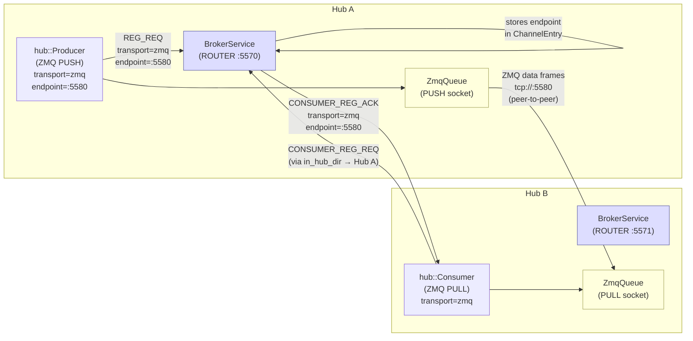
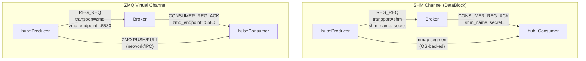
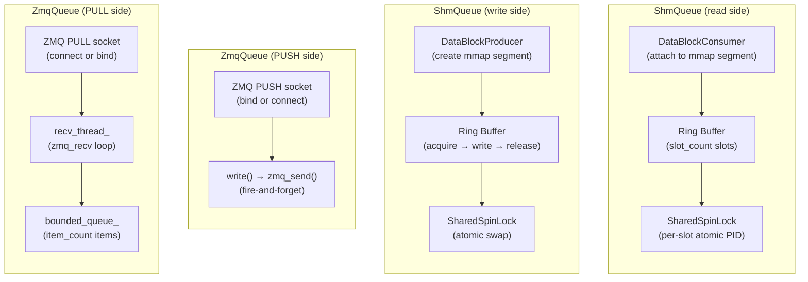
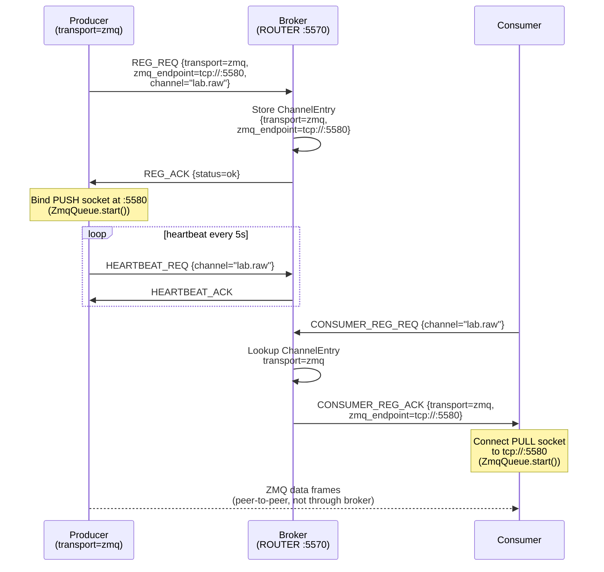
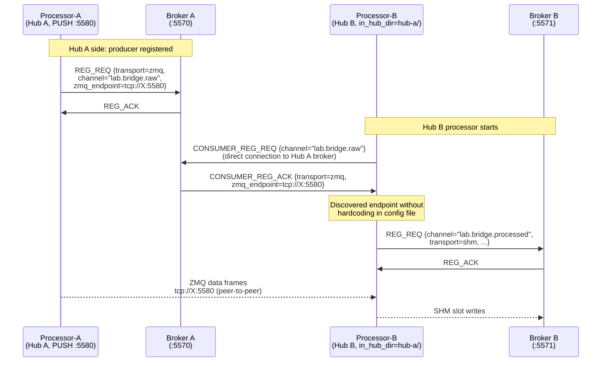
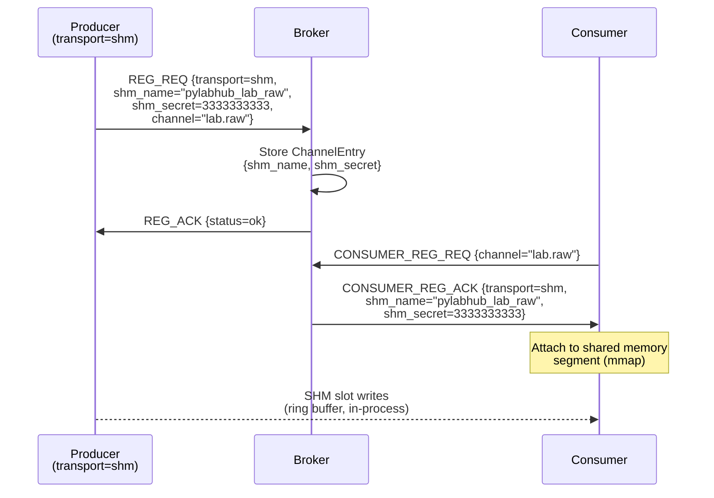

# HEP-CORE-0021: ZMQ Virtual Channel Node

| Property       | Value                                                                      |
|----------------|----------------------------------------------------------------------------|
| **HEP**        | `HEP-CORE-0021`                                                            |
| **Title**      | ZMQ Virtual Channel Node — Broker-Aware Peer-to-Peer ZMQ Endpoints        |
| **Status**     | Implemented — 2026-03-06                                                   |
| **Created**    | 2026-03-05                                                                 |
| **Area**       | Framework Architecture (`BrokerService`, `hub::Producer`, `hub::Consumer`) |
| **Depends on** | HEP-CORE-0002 (DataHub), HEP-CORE-0007 (Protocol), HEP-CORE-0017 (Pipeline) |

---

## 1. Motivation

The current framework has two tiers of data transport:

1. **SHM (DataBlock)**: Structured, schema-validated, ring-buffered shared memory.
   The broker is the service directory — producers register channels, consumers
   discover them via `CONSUMER_REG_REQ`. Fully broker-aware.

2. **ZMQ PUSH/PULL (direct)**: Peer-to-peer, bypasses the broker entirely.
   Endpoints are hardcoded in configuration files. The broker has no knowledge
   of these channels. Not discoverable.

The second tier creates problems:

- **No service directory**: A consumer cannot ask the broker "where is channel X?".
  It must know the endpoint in advance via out-of-band configuration.
- **Brittle configuration**: Both sides of the ZMQ pair must hardcode matching
  endpoints. A change in one requires manual updates to the other.
- **Asymmetric topology**: In a cross-hub bridge scenario, the processor on Hub B
  must have the ZMQ endpoint of the processor on Hub A hardcoded — even though
  the broker on Hub A already knows about that processor.
- **Silent failure**: If the ZMQ endpoint changes (port reuse, redeployment), no
  error is surfaced at the broker level. The consumer simply hangs.

**This HEP introduces the ZMQ Virtual Channel Node** — a lightweight channel
registration type that makes ZMQ peer-to-peer endpoints broker-aware and
discoverable, using the same REG_REQ / CONSUMER_REG_ACK protocol as SHM channels.

---

## 2. Design Principles

1. **Virtual, not structural**: A ZMQ node is a connection point, not a data
   container. Unlike a DataBlock (which has slots, schema, ring buffer, mutex,
   and a shared memory segment), a ZMQ node has only an endpoint string. There
   is no data structure to define, no memory to allocate, no schema required.

2. **Broker as directory, not relay**: The broker stores the ZMQ endpoint in the
   channel entry and echoes it back on consumer registration. It does not relay
   or touch the data stream. The actual data still flows peer-to-peer.

3. **Symmetric with SHM registration**: The producer side registers first
   (`REG_REQ` with `transport=zmq`). The consumer side discovers via
   `CONSUMER_REG_REQ` and gets back the endpoint. Same handshake, different
   payload. Existing channel lifecycle (heartbeat, CHANNEL_CLOSING_NOTIFY,
   FORCE_SHUTDOWN, metrics) applies unchanged.

4. **Transport is producer's declaration**: The producer declares `transport=zmq`
   at registration time. Consumers do not need to know or configure the transport
   type — the broker tells them. This is the same as SHM: the producer creates
   the DataBlock, consumers discover its name and secret.

5. **Schema is optional**: Since a ZMQ node carries raw bytes, schema validation
   is not enforced at the framework level. Schema fields in REG_REQ are optional
   for ZMQ nodes. Applications may document their wire format separately.

6. **Cross-hub discovery via `in_hub_dir`**: A processor on Hub B can discover
   a ZMQ channel registered on Hub A by pointing `in_hub_dir` at Hub A's
   directory (which contains `hub.pubkey`). Hub B's broker is not involved —
   Hub B's processor connects directly to Hub A's broker for discovery, then
   establishes the ZMQ connection directly to the endpoint.

---

## 3. Architecture — ZMQ Virtual Node in the Framework

### 3.1 Overall System View



### 3.2 Channel Types Side-by-Side



---

## 4. ShmQueue vs ZmqQueue — Comparison

Both `hub::ShmQueue` and `hub::ZmqQueue` implement the abstract `hub::Queue`
interface. The processor and consumer script hosts call the same API regardless
of transport. This section explains when to choose each.

### 4.1 Interface

```cpp
// hub::Queue (abstract base, hub_queue.hpp)
class Queue {
public:
    virtual void        start()          = 0;  // ShmQueue: no-op; ZmqQueue: bind/connect + recv thread
    virtual void        stop()           = 0;  // ShmQueue: no-op; ZmqQueue: join recv thread
    virtual ReadResult  read(duration)   = 0;  // blocking read with timeout
    virtual bool        write(const void* data, size_t size) = 0;
    virtual OverflowPolicy overflow_policy() const = 0;
};
```

### 4.2 Feature Comparison

| Dimension | `ShmQueue` | `ZmqQueue` |
|-----------|-----------|-----------|
| **Transport layer** | OS shared memory (`mmap`) | ZMQ PUSH/PULL sockets |
| **Network reach** | Same machine only | Same machine, LAN, WAN |
| **Latency** | Sub-microsecond (cache-warm) | ~1–10 µs (loopback), variable on LAN |
| **Throughput** | Very high (memcpy rate) | High, limited by TCP/socket overhead |
| **Item size** | Fixed (slot size from schema) | Variable or fixed (raw bytes) |
| **Overflow policy** | `Block` or `Drop` (ring buffer) | `Block` (bounded recv queue) or `Drop` |
| **Schema validation** | Enforced at framework level | Not enforced (raw bytes) |
| **Broker awareness** | Full (name + secret in DISC_ACK) | Full (endpoint in DISC_ACK) — this HEP |
| **Flexzone support** | Yes (variable-length tail) | No (future: second ZMQ frame) |
| **Checksum support** | Yes (`BLAKE2b-256` of slot) | Deferred (HEP-CORE-0023) |
| **start() cost** | None (no-op) | Socket creation + thread spawn |
| **Reader model** | Single-consumer ring (latest or sequential) | Any-consumer (fire-and-forget) |
| **Multiple consumers** | Yes, each consumer has own read pointer | Yes (multiple PULL endpoints per PUSH) |
| **Process restart** | Consumer re-attaches after producer restart | PULL reconnects automatically |
| **Typical use case** | High-frequency sensor data, same machine, structured | Cross-machine bridge, raw byte streaming |
| **Cross-hub** | No (SHM segment is local) | Yes (ZMQ socket is network-capable) |

### 4.3 When to Use Each

**Use ShmQueue when:**
- Producer and consumer are on the same machine
- Data has a schema (`FieldDef` → `DataBlock` slots)
- You need flexzone (variable-length data appended to fixed schema)
- You need checksum verification of individual slots
- You need ring-buffer semantics (overwrite old data on overflow)
- Latency is critical and you want to avoid socket overhead

**Use ZmqQueue when:**
- Producer and consumer are on different machines (cross-network)
- You are bridging two hubs (processor-a on Hub A → processor-b on Hub B)
- Data format is opaque bytes (no schema enforcement needed)
- You need dynamic endpoint discovery (via ZMQ Virtual Channel Node)
- Multiple consumers on different machines need the same stream

### 4.4 Internal Structure



---

## 5. Protocol Changes

### 5.1 REG_REQ Extension

A new optional `transport` field is added to `REG_REQ`. Existing registrations
without this field are treated as `transport=shm` (backward-compatible).

```
REG_REQ (producer → broker)
  channel_name          string   Channel identifier
  transport             string   "shm" (default) | "zmq"
  --- SHM fields (transport=shm) ---
  shm_name              string   Shared memory segment name
  shm_secret            uint64   Shared secret for DataBlock attachment
  slot_count            uint32   Ring buffer capacity
  schema_id             string   (optional) Named schema identifier
  schema_hash           string   (optional) BLAKE2b-256 of BLDS
  --- ZMQ fields (transport=zmq) ---
  zmq_endpoint          string   Bind address, e.g. "tcp://127.0.0.1:5580"
  zmq_bind              bool     true = producer binds; false = producer connects
  --- Common fields ---
  producer_uid          string
  producer_name         string
```

### 5.2 CONSUMER_REG_ACK Extension

The broker echoes back the transport descriptor from the channel entry.

```
CONSUMER_REG_ACK (broker → consumer)
  channel_name          string
  transport             string   "shm" | "zmq"
  --- SHM fields (transport=shm) ---
  shm_name              string
  shm_secret            uint64
  producer_zmq_pubkey   string   (for ZMQ ctrl socket auth, unchanged)
  --- ZMQ fields (transport=zmq) ---
  zmq_endpoint          string   Connect address for the consumer
  --- Common fields ---
  producer_uid          string
  producer_name         string
  schema_id             string   (optional)
  schema_hash           string   (optional)
```

### 5.3 Broker Internal State

The broker's `ChannelEntry` struct gains a `transport` discriminator and a
`zmq_endpoint` field (populated only for `transport=zmq`). No other broker
state changes. Channel lifecycle management (timeout, heartbeat tracking,
CHANNEL_CLOSING_NOTIFY, FORCE_SHUTDOWN, metrics) is identical for both transport types.

---

## 6. Protocol Sequence Diagrams

### 6.1 ZMQ Channel Registration and Discovery (same hub)



### 6.2 Cross-Hub Discovery via in_hub_dir



### 6.3 SHM Channel Registration and Discovery (for comparison)



---

## 7. Hub Layer Changes

### 7.1 ProducerOptions

```cpp
enum class ChannelTransport { Shm, Zmq };

struct ProducerOptions
{
    // existing fields ...
    ChannelTransport transport{ChannelTransport::Shm};
    std::string      zmq_endpoint;   // bind address (transport=Zmq only)
    bool             zmq_bind{true}; // producer binds by default
};
```

When `transport=Zmq`, `hub::Producer::create()`:
1. Sends `REG_REQ{transport=zmq, zmq_endpoint}` to the broker
2. Creates and binds (or connects) a ZMQ PUSH socket at `zmq_endpoint`
3. Manages the PUSH socket lifetime (start/stop with the producer)
4. `producer.queue()` returns a `hub::ZmqQueue*` wrapping the PUSH socket

When `transport=Shm` (default), behavior is unchanged.

### 7.2 Consumer::connect()

`Consumer::connect()` reads `transport` from `CONSUMER_REG_ACK` and acts accordingly:

```cpp
// Inside Consumer::connect() after receiving CONSUMER_REG_ACK:
if (ack.transport == "shm")
{
    shm_consumer = find_datablock_consumer_impl(ack.shm_name, ack.shm_secret, ...);
    // queue_ = ShmQueue wrapping shm_consumer
}
else if (ack.transport == "zmq")
{
    // queue_ = ZmqQueue::pull_from(ack.zmq_endpoint, slot_size, bind=false, ...)
}
```

`consumer.queue()` returns the appropriate `hub::Queue*`. The caller (ProcessorScriptHost,
ConsumerScriptHost) uses the queue uniformly — no transport branching at the script host level.

### 7.3 ProcessorScriptHost Simplification

Once hub::Producer and hub::Consumer handle transport internally, ProcessorScriptHost
no longer needs `in_transport` / `out_transport` branching. The queue is obtained via:

```cpp
in_queue_  = in_consumer_->queue();   // ShmQueue or ZmqQueue, resolved by broker
out_queue_ = out_producer_->queue();  // ShmQueue or ZmqQueue, declared by producer
```

`ProcessorConfig` fields `in_transport`, `out_transport`, `zmq_in_endpoint`,
`zmq_out_endpoint`, `zmq_in_bind`, `zmq_out_bind`, `zmq_buffer_depth` are
**replaced** by:

```json
{
  "out_transport":    "zmq",
  "zmq_out_endpoint": "tcp://127.0.0.1:5580"
}
```

Only the **producer side** (`out_transport`, `zmq_out_endpoint`) needs explicit
configuration — the consumer side discovers dynamically from the broker.

---

## 8. Relation to DataBlock (SHM)

```
                  ┌─────────────────────────────────────────────────┐
                  │                 Channel Types                    │
                  ├─────────────────────┬───────────────────────────┤
                  │    SHM (DataBlock)  │    ZMQ Virtual Node       │
                  ├─────────────────────┼───────────────────────────┤
                  │ Data structure      │ Connection point only      │
                  │ Slots + ring buffer │ No slots, no buffer        │
                  │ Schema required     │ Schema optional            │
                  │ Shared memory seg   │ No memory allocation       │
                  │ OS IPC (mmap)       │ Network/IPC (ZMQ socket)   │
                  │ Same-machine only   │ Cross-machine capable      │
                  │ Broker-registered   │ Broker-registered ✓        │
                  │ Broker-discovered   │ Broker-discovered ✓        │
                  │ Heartbeat/metrics   │ Heartbeat/metrics ✓        │
                  │ Lifecycle events    │ Lifecycle events ✓         │
                  └─────────────────────┴───────────────────────────┘
```

Both types participate fully in the channel lifecycle. The difference is purely
in what the broker stores (SHM name + secret vs. ZMQ endpoint) and what the
framework creates on the consumer side (DataBlockConsumer vs. ZMQ PULL socket).

---

## 9. Cross-Hub Discovery

For the dual-hub bridge scenario:

```
Hub A:  Processor-A registers "lab.bridge.raw.bridge" {transport=zmq, endpoint=tcp://X:5580}
Hub B:  Processor-B has in_hub_dir → Hub A

Processor-B startup:
  1. Connects to Hub A broker (via in_hub_dir + hub.pubkey)
  2. Sends CONSUMER_REG_REQ for "lab.bridge.raw.bridge"
  3. Hub A broker returns CONSUMER_REG_ACK{transport=zmq, zmq_endpoint=tcp://X:5580}
  4. Processor-B creates ZmqQueue PULL at tcp://X:5580
  5. Connects to Hub B broker (via out_hub_dir + hub.pubkey) → registers out_channel
```

Processor-B config becomes:
```json
{
  "in_hub_dir":  "../hub-a",
  "in_channel":  "lab.bridge.raw.bridge",
  "out_hub_dir": "../hub-b",
  "out_channel": "lab.bridge.processed",
  "out_transport": "shm"
}
```

No `zmq_in_endpoint` in Processor-B — it is discovered from Hub A at runtime.

---

## 10. Robustness Analysis

| Scenario | Behavior |
|----------|----------|
| ZMQ endpoint not yet bound (producer not started) | `CONSUMER_REG_REQ` succeeds (broker has the entry); ZMQ PULL socket connects and queues internally until PUSH becomes available. Same as SHM race condition — producer must be running before consumer reads. |
| Producer restarts with new ephemeral port | Producer sends new `REG_REQ` with updated `zmq_endpoint`. Broker updates channel entry. Existing consumers receive `CHANNEL_CLOSING_NOTIFY` (broker sees producer re-register), then can re-discover via `CONSUMER_REG_REQ`. |
| Consumer discovers endpoint but PUSH never binds | ZMQ PULL socket's reconnect loop retries silently. After `channel_timeout`, broker drops the channel entry (no heartbeat from producer). |
| Cross-machine deployment | ZMQ endpoints are network addresses — works natively. SHM channels remain same-machine only (no change). |
| Schema validation | Schema fields in REG_REQ are optional for `transport=zmq`. If provided, broker stores them and echoes back — consumer may validate format independently. |

---

## 11. What This Is Not

- **Not a message broker relay**: The broker stores the endpoint, not the data.
  ZMQ data flows directly between producer and consumer.
- **Not a replacement for SHM**: SHM (DataBlock) provides structured, schema-validated,
  ring-buffered IPC with hardware-level synchronization. ZMQ nodes trade structure
  for flexibility and network reach.
- **Not cross-hub channel federation**: A ZMQ channel registered on Hub A is not
  automatically visible on Hub B. Hub B must explicitly point `in_hub_dir` at Hub A
  to discover it. Hub federation (broadcast relay) is a separate feature (HEP-CORE-0022).

---

## 12. Implementation Status

| Phase | Scope | Status | Key files |
|-------|-------|--------|-----------|
| 1 | Protocol: `transport` + `zmq_endpoint` in REG_REQ / CONSUMER_REG_ACK / ChannelEntry | Done | `broker_service.cpp`, `messenger.cpp` |
| 2 | `hub::Producer` ZMQ mode: `ProducerOptions::transport`, PUSH socket management, `producer.queue()` | Done | `hub_producer.hpp/cpp` |
| 3 | `hub::Consumer` ZMQ discovery: read transport from ACK, create ZmqQueue PULL, `consumer.queue()` | Done | `hub_consumer.hpp/cpp` |
| 4 | `ProcessorScriptHost` simplification: remove manual ZmqQueue creation; use `producer/consumer.queue()` | Done | `processor_script_host.hpp/cpp` |
| 5 | `ProcessorConfig` cleanup: remove `in_transport`/`zmq_in_endpoint`; keep `out_transport`/`zmq_out_endpoint` | Done | `processor_config.hpp/cpp` |
| 6 | Demo update: Processor-B uses `in_hub_dir` only, no hardcoded ZMQ endpoint | Done | `share/demo-dual-hub/` |
| Tests | 12 L3 protocol tests (ZmqVirtualChannelTest) | Done | `test_datahub_zmq_virtual_channel.cpp` |

---

## 13. Source File Reference

| Component | File |
|-----------|------|
| Channel entry + transport field | `src/utils/ipc/broker_service.cpp` |
| REG_REQ / CONSUMER_REG_ACK protocol | `src/utils/ipc/messenger.cpp` |
| ChannelHandle data_transport() / zmq_node_endpoint() | `src/utils/ipc/channel_handle.cpp/.hpp` |
| Producer ZMQ transport | `src/utils/hub/hub_producer.hpp/cpp` |
| Consumer ZMQ discovery | `src/utils/hub/hub_consumer.hpp/cpp` |
| ProcessorScriptHost (simplified) | `src/processor/processor_script_host.cpp` |
| ProcessorConfig (transport fields) | `src/processor/processor_config.hpp/cpp` |
| L3 protocol tests | `tests/test_layer3_datahub/test_datahub_zmq_virtual_channel.cpp` |
| Demo bridge config | `share/demo-dual-hub/processor-{a,b}/processor.json` |
