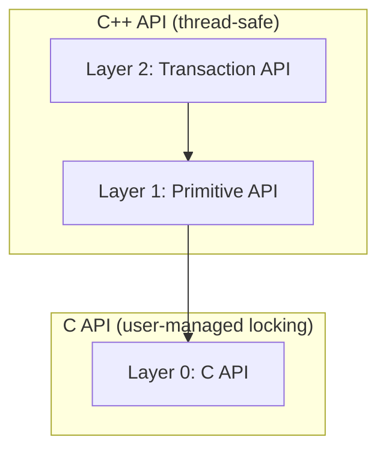
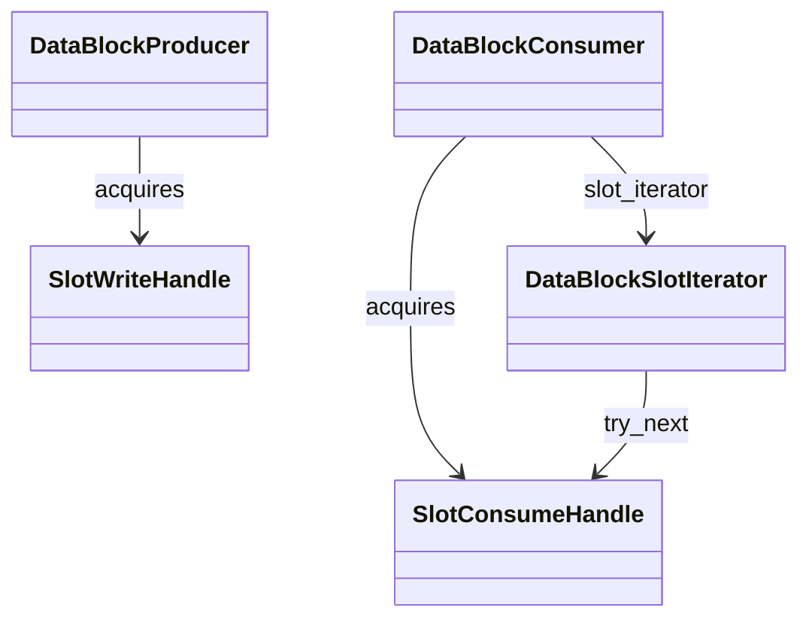
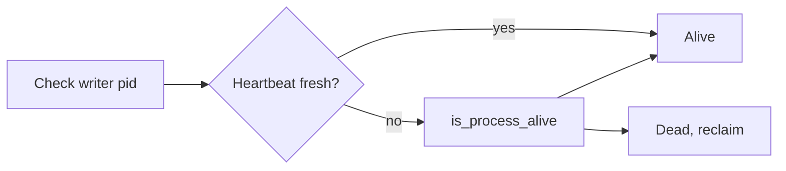

# Data Exchange Hub - Implementation Guidance

**Purpose:** This document provides **implementation patterns, architectural principles, and best practices** for DataHub and related modules. Use this as your reference during design and implementation to ensure consistency, avoid common pitfalls, and follow established patterns.

**Scope:** This document focuses on **how to implement correctly** — language-level details, architecture patterns, concurrency rules, memory safety, and API design principles. It does NOT track execution order (see `DATAHUB_TODO.md`), historical changes (see `DOC_ARCHIVE_LOG.md`), or test plans (see `README/README_testing.md`).

**Cross-references:** 
- Design specifications → `docs/HEP/` (authoritative design specs)
- Execution plan → `docs/DATAHUB_TODO.md` (what to do next, priorities)
- Documentation structure → `docs/DOC_STRUCTURE.md` (where information belongs)
- **Design verification rule** → `docs/DESIGN_VERIFICATION_RULE.md` (all API/design claims must be verified against code; use checkboxes in docs)

---

## Table of Contents

1. [Overview](#overview)
2. [Coding Standards](#coding-standards)
   - [Variable naming](#variable-naming)
   - [Braces requirement](#braces-requirement)
3. [Architecture Principles](#architecture-principles)
   - [Error reporting: C vs C++](#error-reporting-c-vs-c)
   - [Explicit noexcept where the public API does not throw](#explicit-noexcept-where-the-public-api-does-not-throw)
   - [Config validation and memory block setup](#config-validation-and-memory-block-setup-single-point-of-access)
   - [Design and API verification against code](#design-and-api-verification-against-code)
4. [DataBlock API, Concurrency, and Protocol](#datablock-api-concurrency-and-protocol)
   - [Structured buffer alignment](#structured-buffer-alignment)
   - [Unified metrics and state API](#unified-metrics-and-state-api)
   - [Facility access (checksum, magic, schema, config)](#facility-access-checksum-magic-schema-config)
5. [Codebase Structure](#codebase-structure)
6. [Integration with Existing Services](#integration-with-existing-services)
7. [ABI Stability Guidelines](#abi-stability-guidelines)
8. [Memory Management Patterns](#memory-management-patterns)
9. [Error Handling Strategy](#error-handling-strategy)
10. [Testing Strategy](#testing-strategy)
11. [Common Pitfalls and Solutions](#common-pitfalls-and-solutions)
12. [Emergency Recovery Procedures](#emergency-recovery-procedures)
13. [Naming Conventions](#naming-conventions)
14. [[[nodiscard]] Exception Sites](#nodiscard-exception-sites)
15. [Code Review Checklist](#code-review-checklist)

---

## Overview

This document provides implementation guidance for the **Data Exchange Hub** (DataBlock) module within the `pylabhub::utils` library. The design specification is in `docs/HEP/HEP-CORE-0002-DataHub-FINAL.md`.

### Design Philosophy

1. **Zero-copy IPC**: Shared memory for high-performance data transfer
2. **ABI Stability**: All public classes use pImpl idiom for shared library compatibility
3. **Layered API**: Three layers (C API, C++ wrappers, Transaction API) for different use cases. The **primitive C API** is the stable base; **C++ RAII/abstraction** (guards, with_typed_*) is the default for all higher-level design. Use the C API directly only when performance or flexibility critically require it (e.g. custom bindings, hot paths that cannot use exceptions).
4. **Service Integration**: Leverage existing lifecycle, logger, and platform services
5. **Memory Safety**: Atomic operations with correct memory ordering for ARM/x86

---

## Coding Standards

This section defines coding standards and style guidelines that must be followed throughout the codebase. These rules help avoid lint warnings, prevent common bugs, and maintain consistency.

### Variable Naming

**Rule**: All variables, including transient/temporary variables, must have **meaningful names** that are **consistent with their purpose and function** in context.

**Minimum length**: Variables must use **at least 3 characters** to avoid lint warnings and improve code readability.

**Examples**:

```cpp
// BAD: Cryptic, too short, or meaningless
int x;              // What does x represent?
int i;              // Generic loop counter might be acceptable in very short loops only
auto rc;            // Unclear: return code? reader count? 
auto tmp;           // What kind of temporary?
int a, b, c;        // No semantic meaning

// GOOD: Meaningful, clear purpose
int slot_index;
int retry_count;
auto result_code;
auto temp_buffer;
int slot_count, capacity, offset;
```

**Guidelines**:
- **Loop variables**: Even loop counters should be meaningful when possible:
  ```cpp
  // BAD (in complex loops)
  for (int i = 0; i < n; ++i) {
      for (int j = 0; j < m; ++j) {
          // What are i and j here?
      }
  }
  
  // GOOD
  for (size_t slot_idx = 0; slot_idx < slot_count; ++slot_idx) {
      for (size_t retry_idx = 0; retry_idx < max_retries; ++retry_idx) {
          // Clear what each index represents
      }
  }
  ```

- **Temporary variables**: Name based on role, not just "temp":
  ```cpp
  // BAD
  auto tmp = calculate_offset();
  auto res = validate();
  
  // GOOD
  auto aligned_offset = calculate_offset();
  auto is_valid = validate();
  ```

- **Result variables**: Be explicit about what result:
  ```cpp
  // BAD
  auto r = operation();
  
  // GOOD
  auto acquire_result = acquire_write_slot(timeout);
  auto recovery_status = validate_integrity();
  ```

**Exception**: Very short, well-established idioms in limited scope (e.g., `i` in a simple 3-line for loop) may be acceptable, but prefer meaningful names.

### Braces Requirement

**Rule**: All C/C++ control flow statements **must use braces** `{}`, even for single-statement bodies.

**Rationale**:
- Avoids lint warnings
- Prevents scope-related bugs when code is modified later
- Improves readability and consistency
- Prevents dangerous patterns (e.g., Apple's "goto fail" bug)

**Examples**:

```cpp
// BAD: No braces
if (condition)
    do_something();

if (error)
    return false;

for (int slot_idx = 0; slot_idx < count; ++slot_idx)
    process_slot(slot_idx);

while (retry_count < max_retries)
    retry_count++;

// GOOD: Always use braces
if (condition) {
    do_something();
}

if (error) {
    return false;
}

for (int slot_idx = 0; slot_idx < count; ++slot_idx) {
    process_slot(slot_idx);
}

while (retry_count < max_retries) {
    retry_count++;
}
```

**Critical cases** where braces prevent bugs:

```cpp
// BAD: Extremely dangerous
if (condition)
    LOGGER_DEBUG("Debug: condition true");
    do_critical_operation();  // ALWAYS EXECUTES! Indentation misleads reader

// BAD: Modification later breaks
if (condition)
    operation1();
// Someone adds:
    operation2();  // NOT under if! Bug introduced

// GOOD: Safe and clear
if (condition) {
    LOGGER_DEBUG("Debug: condition true");
    do_critical_operation();  // Clearly within if block
}

// GOOD: Modifications stay safe
if (condition) {
    operation1();
    operation2();  // Adding new statement is safe
}
```

**Applies to**: All control flow statements
- `if`, `else if`, `else`
- `for`, `while`, `do-while`
- `switch` cases (braces optional but recommended for multi-statement cases)

**Style**: Follow LLVM/Allman brace style (opening brace on same line for control structures, per `.clang-format`).

---

## Architecture Principles

### Dual-Chain Architecture

The Data Exchange Hub uses a **dual-chain** memory layout:

- **TABLE 1 (Flexible Zones)**: User-defined atomics with SharedSpinLock coordination
- **TABLE 2 (Fixed Buffers)**: Ring buffer slots with SlotRWState coordination

```
┌────────────────────────────────────────────────────────────┐
│ SharedMemoryHeader (4KB)                                   │
│  - Magic, version, security                                │
│  - Ring buffer config and state                            │
│  - Metrics (256 bytes)                                     │
│  - Consumer heartbeats (512 bytes)                         │
│  - SharedSpinLock states (256 bytes)                       │
└────────────────────────────────────────────────────────────┘
┌────────────────────────────────────────────────────────────┐
│ TABLE 1: Flexible Zones (user-defined size)                │
│  - Application-specific data structures                    │
│  - Protected by SharedSpinLock                             │
└────────────────────────────────────────────────────────────┘
┌────────────────────────────────────────────────────────────┐
│ SlotRWState Array (48 bytes × N slots)                     │
│  - Cache-aligned coordination metadata                     │
└────────────────────────────────────────────────────────────┘
┌────────────────────────────────────────────────────────────┐
│ TABLE 2: Data Slots (slot_stride_bytes × N slots)         │
│  - Fixed-size ring buffer slots                            │
│  - Protected by SlotRWState                                │
└────────────────────────────────────────────────────────────┘
```

### Two-Tier Synchronization

1. **OS Mutex (DataBlockMutex)**: For control zone (creation, header modifications)
2. **Atomic Coordination**: For hot path (slot access, flexible zone access)
   - SharedSpinLock: PID-based spinlock for flexible zones
   - SlotRWState: Writer-reader coordination for data slots

### C++ Abstraction Layers (DataBlock)

The primitive **C API** (Slot RW, Recovery) is the stable base; the **C++ abstraction** is the default for application code.

| Layer   | Use for |
|---------|--------|
| **0 – C API** | C bindings, minimal deps, or when C++ layer cannot be used. |
| **1 – C++ primitive** | `DataBlockProducer`/`Consumer`, `SlotWriteHandle`/`SlotConsumeHandle`, explicit acquire/release. Use when you need explicit lifetime control or non-throwing paths. |
| **2 – Transaction API** | **Recommended:** `with_write_transaction`, `with_read_transaction`, `with_typed_write<T>`, `with_typed_read<T>`, `with_next_slot`, `WriteTransactionGuard` / `ReadTransactionGuard`. RAII, exception-safe, **thread-safe** (Producer/Consumer use internal mutex). |

**Recommended usage:** Prefer Layer 2 (guards and with_*_transaction) for write/read; release or destroy all slot handles before destroying Producer/Consumer. Use C API directly only when performance or flexibility (e.g. custom bindings) require it.

**Transaction API usage (default entry-point):**

- **Prefer guards and with_***: Use `with_write_transaction`, `with_read_transaction`, `with_typed_write<T>`, `with_typed_read<T>`, or `WriteTransactionGuard` / `ReadTransactionGuard` over manual `acquire_write_slot` / `acquire_consume_slot` and `release_*` in application code. The transaction API ensures slots are released on return or when exceptions propagate.
- **Thread safety:** `DataBlockProducer` and `DataBlockConsumer` are **thread-safe**: an internal mutex protects slot acquire/release, heartbeat, and related APIs. Multiple threads may share one producer or one consumer; only one slot/context is active at a time per handle. The **C API** (slot_rw_coordinator.h, recovery_api) does not provide locking; multithread safety is the caller's responsibility.
- **Exception safety:** When a lambda passed to `with_write_transaction` or `with_read_transaction` throws, the guard destructor runs during stack unwinding and releases the slot. No explicit cleanup is needed. See `test_transaction_api.cpp` for exception-safety tests.
- **Guards for explicit control:** Use `WriteTransactionGuard` / `ReadTransactionGuard` when you need to check `guard.slot()` before proceeding, call `commit()` or `abort()` explicitly, or handle acquisition failure without exceptions. Guards are move-only and have `noexcept` destructors.

### Error reporting: C vs C++

- **C API:** Report errors via **return codes** (or out-parameters). No exceptions. C has no exceptions; callers from C or other languages expect 0/success or non-zero/error. Example: `slot_rw_acquire_write` returns `SlotAcquireResult`; recovery APIs return `int` (e.g. 0 = success, negative = error).
- **C++ wrapper:** May **throw** where that is the appropriate, idiomatic way to signal failure (e.g. config validation at creation, schema mismatch on attach). Use exceptions for exceptional or contract-violation cases; do not overuse (e.g. hot path can use return/optional). The C++ layer may translate C error codes into exceptions when it improves usability.
- **Summary:** C → error codes; C++ → throw where appropriate. Each layer follows its language conventions.

### Explicit noexcept where the public API does not throw

Mark as **`noexcept`** any public API that is **not supposed to throw** and whose implementation does not throw. This makes the contract explicit and allows optimizations (e.g. move on exception paths). Do **not** mark functions that can throw (e.g. config validation, acquisition failure that throws, or calls into code that may throw).

**Recommendation:**

| Category | Mark `noexcept` | Do not mark |
|----------|-----------------|-------------|
| **Destructors** | All DataBlock-related destructors (~SlotWriteHandle, ~SlotConsumeHandle, ~DataBlockProducer, ~DataBlockConsumer, ~DataBlockSlotIterator, ~DataBlockDiagnosticHandle, transaction guards). Destructors must not throw; explicit `noexcept` enforces that. | — |
| **Simple accessors** | slot_index(), slot_id(), buffer_span(), flexible_zone_span() on handles; last_slot_id(), is_valid() on iterator; spinlock_count() on producer/consumer. They only read state or return empty span. | flexible_zone\<T\>(index) (throws if zone too small). |
| **Bool-returning / result-returning (no throw)** | write(), read(), commit(), update_checksum_*, verify_checksum_*, validate_read() on handles; release_write_slot(), release_consume_slot(); seek_latest(), seek_to(); try_next() (returns NextResult); check_consumer_health(). Implementation returns false/empty/result and does not throw. | — |
| **Acquisition / registration** | acquire_write_slot(), acquire_consume_slot() (return nullptr on failure; implementation does not throw). | acquire_spinlock() (throws out_of_range), get_spinlock() (throws if invalid or index out of range), next() (throws on timeout), commit() on WriteTransactionGuard (throws on invalid state). |
| **Constructors / factories** | Move constructors and move assignment (already noexcept). | Creator/attach constructors, create_* / find_* (throw or return nullptr). |

If in doubt, do **not** add `noexcept`; adding it incorrectly causes `std::terminate` if the function ever throws.

### Config validation and memory block setup (single point of access)

**Rule:** Config must be checked **before** any creation or operation on memory blocks. All memory-block parameters must be explicitly set from agreed specs. There is a **single point** where config is validated and the memory block is set up, so when things go wrong we know where to look.

**Single point of access:** The **DataBlock creator constructor** `DataBlock(const std::string &name, const DataBlockConfig &config)` in `data_block.cpp` is the only code path that creates a new shared-memory block. It:

1. **Validates config first** (before any allocation): on the C++ path, throws `std::invalid_argument` if any of the following are unset or invalid (a C-level creation API, if added, would return an error code instead):
   - `config.policy` (must not be `DataBlockPolicy::Unset`)
   - `config.consumer_sync_policy` (must not be `ConsumerSyncPolicy::Unset`)
   - `config.physical_page_size` (must not be `DataBlockPageSize::Unset`)
   - `config.ring_buffer_capacity` (must be ≥ 1; 0 means unset and fails)
   - `config.logical_unit_size` (if set: must be ≥ physical and a multiple of physical)
2. **Then** builds `DataBlockLayout::from_config(config)` and computes size.
3. **Then** calls `shm_create` and only after that writes the header and layout checksum.

**Public entry points:** All producer creation goes through `create_datablock_producer` → `create_datablock_producer_impl` → `DataBlock(name, config)`. Consumer attach does not create memory; it opens existing with `DataBlock(name)` and validates layout (and optionally `expected_config`) in `find_datablock_consumer_impl` via `validate_attach_layout_and_config`. So the **single point** for “config checked before any memory creation” is the DataBlock creator constructor.

**Required explicit parameters (no silent defaults):** To avoid memory corruption and sync bugs, the following must be set explicitly on `DataBlockConfig` before creating a producer; otherwise creation fails at the single point above.

| Parameter | Sentinel / invalid | Stored in header |
|-----------|--------------------|------------------|
| `policy` | `DataBlockPolicy::Unset` | 0/1/2 (Single/DoubleBuffer/RingBuffer) |
| `consumer_sync_policy` | `ConsumerSyncPolicy::Unset` | 0/1/2 (Latest_only/Single_reader/Sync_reader) |
| `physical_page_size` | `DataBlockPageSize::Unset` | 4096 / 4M / 16M |
| `ring_buffer_capacity` | `0` (unset) | ≥ 1 |
| `checksum_type` | `ChecksumType::Unset` | BLAKE2b (0); mandatory |

**Rationale and full parameter table:** Full analysis was in **`docs/DATAHUB_POLICY_AND_SCHEMA_ANALYSIS.md`**; merged here and archived in **`docs/archive/transient-2026-02-13/`** (§1 and “Other parameters: fail if not set”).

### Design and API verification against code

**Rule:** All API and design claims in documentation MUST be verified against actual code. Documentation does not imply implementation.

- **When writing or updating design/API docs:** Trace every described behavior to source (file, function, and relevant branches). In the doc, use a **verification checkbox**: `- [x]` with a **code reference** (file:line or function name) for confirmed behavior; `- [ ]` or "Not yet verified" for anything not yet checked. See **`docs/DESIGN_VERIFICATION_RULE.md`**.
- **When implementing:** Do not document behavior as done until the code path exists and has been verified. If the doc and code disagree, fix one and update the other; code is the single source of truth.
- **Checklist:** Use **`docs/DESIGN_VERIFICATION_CHECKLIST.md`** for the current dual-schema design; update it when code or design changes.

### Policy and Schema Separation of Concerns

**Rule:** Each policy and schema parameter controls **one single aspect** of the protocol. Changing one parameter must not affect unrelated behavior. Index/buffer management, checksum, consumer sync, and layout are independent.

| Parameter | Single aspect it controls | Must NOT affect |
|-----------|---------------------------|-----------------|
| **DataBlockPolicy** (Single/DoubleBuffer/RingBuffer) | Buffer structure (layout, slot count derived from `ring_buffer_capacity`). Validation only in creation. | Checksum, consumer sync, index advancement |
| **ConsumerSyncPolicy** (Latest_only/Single_reader/Sync_reader) | How readers advance: `get_next_slot_to_read`, writer backpressure, `read_index` advancement on release | Checksum, buffer layout, commit_index advancement |
| **ChecksumPolicy** (None/Manual/Enforced) | Who runs update/verify and when. Manual = caller calls explicitly; Enforced = system does in release | Index advancement (`commit_index`, slot visibility), buffer layout, consumer sync |
| **checksum_type** (ChecksumType) | Algorithm (BLAKE2b). Always present; no opt-out. | Index/buffer logic, ChecksumPolicy |
| **FlexibleZoneConfig** | Flexible zone layout (size, spinlock index) | Slot buffer, checksum, sync |
| **Schema** (version, hash) | Validation on attach | Protocol logic |

**Code locations (policy usage):**

- **Buffer/index management:** `commit_write()`, `acquire_write()`, `acquire_read()`, `release_write_handle()`, `release_consume_handle()` steps 3–4 — no `ChecksumPolicy` branching. `commit_index` is advanced only in `commit_write()` during release.
- **ConsumerSyncPolicy:** `get_next_slot_to_read()`, producer backpressure (Single/Sync), read_index advancement in `release_consume_handle()` step 4, Sync_reader heartbeat registration.
- **ChecksumPolicy:** Only in `release_write_handle()` (update_checksum_*) and `release_consume_handle()` (verify_checksum_*). Condition: `checksum_policy != None` (checksum storage is always present).
- **DataBlockPolicy:** Config validation; layout uses `ring_buffer_capacity` for slot_count. No hot-path branching on policy value.

**Anti-pattern (the bug we fixed):** Do not branch index or visibility logic on `ChecksumPolicy`. Previously, Manual had `commit_index.store(slot_id)` in `SlotWriteHandle::commit()`, which conflicted with `commit_write()`’s `fetch_add(1)` and broke slot visibility. Fix: remove the Manual-specific store; index advancement is buffer-managed only.

### Structured buffer alignment

**Why alignment was wrong in the first place:** The segment layout is a **packed** sequence: Header | SlotRWStates | SlotChecksums | FlexibleZone | **StructuredData**. The start of the structured data region was set to "right after" the flexible zone with **no padding**. So `structured_buffer_offset = flexible_zone_offset + flexible_zone_size` (e.g. 4258). That offset is not 8-byte aligned, so the first byte of slot 0 was misaligned for types with `alignof(T) == 8` (e.g. `uint64_t`).

**Physical page size vs. alignment:** `physical_page_size` and `logical_unit_size` (slot stride) control **slot size** and allocation granularity, not the **offset** of the structured region inside the segment. The segment base is page-aligned from the OS; the **start of the structured region** is an offset into that segment. That offset was never rounded up for alignment, so it inherited the misalignment of the preceding regions.

**User-provided structure:** `with_typed_write<T>` / `with_typed_read<T>` give the user a `T&` over the slot buffer. For that to be valid, the slot pointer must be aligned to `alignof(T)`. So we align the **start** of the structured buffer so that every slot (at `base + structured_buffer_offset + i * slot_stride_bytes`) satisfies the type's alignment. We enforce a single constant: **structured buffer start is aligned to 8** in both `from_config` and `from_header`: `structured_buffer_offset = align_up(after_flexible, 8)`. No branches; creator and attacher use the same formula. Usable space is unchanged: `structured_buffer_size = slot_count * slot_stride_bytes`; we only add 0--7 bytes of padding **before** the structured region so that both raw access and typed mapping see an aligned base. Blocks created with the old packed layout (no padding) are layout-incompatible.

### Unified metrics and state API

**Rule:** All reads of metrics and key state (commit count, which slots to validate) go through the **C API** so that every layer (C++, recovery, scripts, bindings) sees the same behavior and the same surface.

| Surface | Use |
|--------|-----|
| **Read** | `slot_rw_get_metrics(SharedMemoryHeader*, DataBlockMetrics*)` (when you have a header), or `datablock_get_metrics(const char* shm_name, DataBlockMetrics*)` (by name; opens, reads, closes). |
| **Lightweight (single values)** | When you only need one or a few values (e.g. "has any commit?"), use **`slot_rw_get_total_slots_written(header)`**, **`slot_rw_get_commit_index(header)`**, **`slot_rw_get_slot_count(header)`** — one load each instead of a full snapshot (~30+ loads). Use these inside datablock/recovery paths to avoid the cost of a full get_metrics. |
| **Reset** | `slot_rw_reset_metrics(SharedMemoryHeader*)` or `datablock_reset_metrics(const char* shm_name)`. Only metric counters are reset; **state** (`commit_index`, `slot_count` in the snapshot) is **not** reset. |
| **DataBlockMetrics** | Defined in `slot_rw_coordinator.h`. Includes **state snapshot** fields: `commit_index`, `slot_count` (read-only; not reset). And **metrics**: e.g. `total_slots_written` (commit count, 0 = no commits yet), timeouts, errors, bytes. |

**Semantics:**

- **`total_slots_written`** is incremented on every successful commit in `commit_write()`. Use **`total_slots_written == 0`** to mean "no commits yet" (e.g. integrity validator skips slot checksum verification when there are no committed slots). Do not rely on `commit_index == sentinel` for "no commits" (wrap-after-2^64 commits would collide).
- **Integrity validator** and any code that needs "has any commit" or "which slots to check" must call `slot_rw_get_metrics` (or `datablock_get_metrics`) and use `m.total_slots_written`, `m.commit_index`, `m.slot_count` instead of reading the header directly.
- **C++:** `DataBlockProducer::get_metrics(DataBlockMetrics&)`, `reset_metrics()`, and `DataBlockConsumer::get_metrics(DataBlockMetrics&)`, `reset_metrics()` delegate to the C API; no direct header access for metrics from application code.

**Do not:** Read or write metric/state fields directly from `SharedMemoryHeader` in recovery, admin, or application code. Use the C API (or C++ wrappers) so the contract is single and all layers benefit.

### Facility access (checksum, magic, schema, config)

Access to checksum, magic, schema, and config should go through the **C API or C++ API** where available; avoid exposing raw `SharedMemoryHeader` layout to callers.

| Facility | Current status | Public API / note |
|----------|----------------|-------------------|
| **Metrics / state** | Unified | `slot_rw_get_metrics`, `datablock_get_metrics`, `datablock_reset_metrics`; C++ `get_metrics()`, `reset_metrics()`. Do not read header metric/state fields directly. |
| **Layout checksum** | Internal | `validate_layout_checksum(header)` is used inside attach and validation paths. Not exposed as a standalone C call by name; callers use attach or `datablock_validate_integrity`. |
| **Slot / flexible zone checksums** | Via Producer/Consumer or recovery | C++: `Producer::update_checksum_slot`, `Consumer::verify_checksum_slot`, etc. Integrity validator opens a consumer and uses these. No direct header checksum layout access from public code. |
| **Magic number** | Hidden | Used inside `open_datablock_for_diagnostic` and `datablock_validate_integrity`. Not part of public API; do not expose magic value or header field. |
| **Schema (hash, version)** | C++ only | `get_shared_memory_header_schema_info()` (C++) when a handle exists. No name-based C API yet; optional future: `datablock_get_schema_info(shm_name, ...)`. |
| **Config (policy, capacity, etc.)** | Internal / attach | Built from header in `validate_attach_layout_and_config` and in recovery (expected_config). No standalone C "get config by name" yet; optional future if needed. |

**Principle:** Prefer C API (or C++ wrappers) for any facility that callers need; keep `SharedMemoryHeader` layout and raw field access out of the public contract so that all layers above (C++, Python, admin) benefit from a single, stable surface.

---

## DataBlock API, Concurrency, and Protocol

This section documents the current API layers, class relationships, thread-safety model, and protocol behavior (including heartbeat and liveness). It reflects the removal of Layer 1.75 (SlotRWAccess) and the addition of internal mutex protection on Producer/Consumer.

### API Layers and Thread-Safety



**Design points:** C++ Producer/Consumer are **thread-safe** (internal mutex). C API does **not** provide locking; multithread safety is the caller's responsibility.

### Class and Handle Relationships



**Lifetime:** Release or destroy all slot handles (and finish iterator use) **before** destroying Producer/Consumer.

### Write Path and Producer Heartbeat

On **release_write_slot**, the implementation: (1) commits the write (`commit_write`), (2) updates **producer heartbeat** in `reserved_header` (PID + monotonic timestamp), (3) releases the slot write lock. Call `producer->update_heartbeat()` when idle. **Liveness:** `is_writer_alive(header, pid)` returns true if heartbeat is fresh for that PID; otherwise falls back to `is_process_alive(pid)` (used in acquire_write zombie reclaim and recovery).

### Read Path and Consumer Heartbeat

Consumer acquire/release and iterator advance are protected by the same (recursive) mutex. For Sync_reader, slot release updates `consumer_heartbeats[i].last_heartbeat_ns`. Call `consumer->update_heartbeat(slot)` when idle.

### Liveness: Heartbeat-First vs PID Check



### Layer 1.75 Removed

**SlotRWAccess** (`slot_rw_access.hpp`) has been **removed**. Use `with_typed_write<T>` and `with_typed_read<T>` on Producer/Consumer in `data_block.hpp`. C API remains; locking is user-managed.

### Example: Transaction API

```cpp
with_write_transaction(*producer, 5000, [](WriteTransactionContext& ctx) {
    ctx.slot().get().write(&payload, sizeof(payload));
    ctx.slot().get().commit(sizeof(payload));
});
auto result = consumer->slot_iterator().try_next(1000);
if (result.ok && result.next)
    consumer->release_consume_slot(*result.next);
```

---

## Codebase Structure

### Layered Headers (Umbrella Pattern)

**DO NOT** include individual headers directly. Use layered umbrellas:

```cpp
// Layer 0: Platform detection
#include "plh_platform.hpp"

// Layer 1: Basic utilities (format, debug, guards)
#include "plh_base.hpp"

// Layer 2: Services (lifecycle, filelock, logger)
#include "plh_service.hpp"

// Layer 3: Data hub (jsonconfig, messagehub, datablock)
#include "plh_datahub.hpp"
```

### Source File Organization

```
src/
├── include/
│   ├── plh_platform.hpp           # Layer 0 umbrella
│   ├── plh_base.hpp               # Layer 1 umbrella
│   ├── plh_service.hpp            # Layer 2 umbrella
│   ├── plh_datahub.hpp            # Layer 3 umbrella
│   ├── utils/recovery_api.hpp       # P8 Recovery C API
│   ├── utils/slot_diagnostics.hpp   # P8 Diagnostics API
│   └── utils/
│       ├── data_block.hpp         # Main DataBlock API
│       ├── message_hub.hpp        # Broker communication
│       ├── shared_memory_spinlock.hpp # SharedSpinLock
│       └── slot_rw_coordinator.h  # C API for SlotRWState (lock/multithread safety is user-managed)
└── utils/
    ├── data_block.cpp             # DataBlock implementation
    ├── message_hub.cpp            # MessageHub implementation
    ├── shared_memory_spinlock.cpp     # SharedSpinLock implementation
    ├── datablock_recovery.cpp     # P8 Recovery implementation
    ├── slot_diagnostics.cpp       # P8 Diagnostics implementation
    ├── slot_recovery.cpp          # P8 Recovery operations
    ├── heartbeat_manager.cpp      # Consumer heartbeat tracking
    └── integrity_validator.cpp    # P8 Integrity validation
```

### Build System Integration

**CMakeLists.txt** (`src/utils/CMakeLists.txt`):

```cmake
set(UTILS_SOURCES
  # ... existing sources ...
  data_block.cpp
  shared_memory_spinlock.cpp
  datablock_recovery.cpp
  slot_diagnostics.cpp
  slot_recovery.cpp
  heartbeat_manager.cpp
  integrity_validator.cpp
)

# Generated export header
generate_export_header(pylabhub-utils
  BASE_NAME         "pylabhub_utils"
  EXPORT_MACRO_NAME "PYLABHUB_UTILS_EXPORT"
  EXPORT_FILE_NAME  "${CMAKE_CURRENT_BINARY_DIR}/pylabhub_utils_export.h"
)
```

---

## Integration with Existing Services

### 1. Lifecycle Management

**Pattern**: Register DataHub module for automatic initialization/shutdown.

```cpp
// In message_hub.cpp
namespace pylabhub::hub
{

// Module initialization
static void datahub_startup() {
    // Initialize ZeroMQ context, broker connection, etc.
    LOGGER_INFO("[DataHub] Module initialized");
}

static void datahub_shutdown() {
    // Cleanup ZeroMQ resources
    LOGGER_INFO("[DataHub] Module shutdown");
}

// Factory for lifecycle module
pylabhub::utils::ModuleDef GetLifecycleModule() {
    return pylabhub::utils::ModuleDef("DataHub")
        .with_startup(datahub_startup)
        .with_shutdown(datahub_shutdown)
        .with_dependencies({"Logger"}); // Depend on logger
}

} // namespace pylabhub::hub
```

**Usage in application**: Create a `LifecycleGuard` in main() with every module your application uses. The guard initializes them in dependency order and shuts them down in reverse order.

```cpp
#include "plh_datahub.hpp"

int main() {
    pylabhub::utils::LifecycleGuard app_lifecycle(pylabhub::utils::MakeModDefList(
        pylabhub::utils::Logger::GetLifecycleModule(),
        pylabhub::utils::FileLock::GetLifecycleModule(),
        pylabhub::crypto::GetLifecycleModule(),
        pylabhub::hub::GetLifecycleModule(),
        pylabhub::utils::JsonConfig::GetLifecycleModule()
    ));
    // create_datablock_producer / find_datablock_consumer may now be used
}
```

**DataBlock / MessageHub**: `create_datablock_producer()` and `find_datablock_consumer()` throw if the Data Exchange Hub module is not initialized. Include `pylabhub::hub::GetLifecycleModule()` (and typically `CryptoUtils`, `Logger`) in your guard. See **`src/hubshell.cpp`** for a full template.

### 2. Logger Integration

**DO**: Use logger for all non-critical diagnostics and debugging.

```cpp
// Good: Use existing logger
LOGGER_INFO("[DataBlock:{}] Producer registered", name);
LOGGER_DEBUG("[DataBlock:{}] Slot {} acquired by PID {}", name, slot_idx, pid);
LOGGER_ERROR("[DataBlock:{}] Failed to acquire slot: timeout", name);
```

**DON'T**: Use `std::cout`, `printf`, or custom logging.

### 3. Platform Utilities

**DO**: Use `pylabhub::platform` functions for portability.

```cpp
// Good: Use platform utilities
uint64_t pid = pylabhub::platform::get_pid();
uint64_t tid = pylabhub::platform::get_native_thread_id();
std::string exe_name = pylabhub::platform::get_executable_name();
```

**DON'T**: Use platform-specific APIs directly in cross-platform code.

### 4. Format Tools

**DO**: Use `format_tools` for consistent formatting.

```cpp
#include "plh_base.hpp" // Includes format_tools

// Good: Use format_tools
std::string formatted = pylabhub::format_tools::format_bytes(total_bytes);
std::string timestamp = pylabhub::format_tools::format_timestamp(now_ns);
```

### 5. Debug Info

**DO**: Use `debug::print_stack_trace()` for crash diagnostics.

```cpp
#include "plh_base.hpp" // Includes debug_info

// In error paths
catch (const std::exception& ex) {
    LOGGER_ERROR("Critical error: {}", ex.what());
    pylabhub::debug::print_stack_trace();
    std::abort();
}
```

---

## ABI Stability Guidelines

### pImpl Idiom (MANDATORY for Public Classes)

All public classes in `data_block.hpp` MUST use pImpl:

```cpp
// data_block.hpp
class PYLABHUB_UTILS_EXPORT DataBlockProducer {
public:
    DataBlockProducer();
    ~DataBlockProducer(); // MUST be defined in .cpp

    // Public API...

private:
    std::unique_ptr<DataBlockProducerImpl> pImpl; // Opaque pointer
};

// data_block.cpp
struct DataBlockProducerImpl {
    // All STL containers, member variables here
    std::vector<FlexibleZoneInfo> flexible_zones;
    std::unique_ptr<DataBlockMutex> control_mutex;
    std::shared_ptr<void> shm_ptr;
    // ...
};

DataBlockProducer::DataBlockProducer()
    : pImpl(std::make_unique<DataBlockProducerImpl>()) {}

DataBlockProducer::~DataBlockProducer() = default; // Must be in .cpp
```

### Export Macros

Use `PYLABHUB_UTILS_EXPORT` for all public symbols:

```cpp
// Public class
class PYLABHUB_UTILS_EXPORT DataBlockProducer { /* ... */ };

// Public function
PYLABHUB_UTILS_EXPORT std::unique_ptr<DataBlockProducer>
create_datablock_producer(/* ... */);

// Public struct (if needed in API)
struct PYLABHUB_UTILS_EXPORT DataBlockConfig { /* ... */ };
```

### What NOT to Expose

**DO NOT** put these in public headers:

- STL containers (`std::vector`, `std::map`, `std::string` members)
- Third-party types (`zmq::socket_t`, `nlohmann::json` members)
- Platform-specific types (`HANDLE`, `pthread_mutex_t`)
- Template implementations (keep in `.hpp`, but not in public API)

---

## Memory Management Patterns

### Shared Memory Lifecycle

```cpp
// 1. Producer creates shared memory
auto producer = create_datablock_producer(hub, "sensor_data", config);

// 2. Consumer attaches to existing shared memory
auto consumer = find_datablock_consumer(hub, "sensor_data", secret);

// 3. Automatic cleanup on destruction
// Producer destructor: unmap, close fd, unlink shm_name (if owner)
// Consumer destructor: unmap, close fd, decrement consumer count
```

### RAII for Slot Access

**Lifetime contract:** Slot handles hold pointers into shared memory. Release or destroy all
SlotWriteHandle and SlotConsumeHandle instances *before* destroying the DataBlockProducer or
DataBlockConsumer. Otherwise the handle destructor accesses freed memory (use-after-free).

```cpp
// Primitive API (manual)
auto slot = producer->acquire_write_slot(timeout_ms);
if (slot) {
    slot->write(data, size);
    slot->commit(size);
    producer->release_write_slot(*slot); // Manual release
}

// Transaction API (RAII, recommended)
with_write_transaction(*producer, timeout_ms, [&](WriteTransactionContext& ctx) {
    ctx.slot().write(data, size);
    ctx.slot().commit(size);
}); // Automatic release
```

### Memory Ordering (CRITICAL)

**ARM/RISC-V platforms require explicit memory barriers!**

```cpp
// CORRECT: Use acquire/release semantics
uint64_t write_idx = header->write_index.load(std::memory_order_acquire);
header->commit_index.store(write_idx, std::memory_order_release);

// WRONG: Will break on ARM
uint64_t write_idx = header->write_index.load(); // defaults to seq_cst (too strong)
header->commit_index = write_idx; // no memory barrier (too weak)
```

**Reference**: Section 4.3 of HEP-CORE-0002-DataHub-FINAL.md

---

## Error Handling Strategy

**See also:** [Error reporting: C vs C++](#error-reporting-c-vs-c) and [Explicit noexcept where the public API does not throw](#explicit-noexcept-where-the-public-api-does-not-throw) in Architecture Principles for the C/C++ error convention and when to mark APIs `noexcept`.

### Exception Policy

1. **Public API**: Use exceptions for programming errors (invalid arguments, precondition violations)
2. **Hot Path**: Return error codes (avoid exceptions in slot acquisition loops)
3. **Recovery API**: Return `RecoveryResult` enum

```cpp
// Public API: Throw on invalid config
std::unique_ptr<DataBlockProducer> create_datablock_producer(const DataBlockConfig& config) {
    if (config.ring_buffer_capacity == 0) {
        throw std::invalid_argument("ring_buffer_capacity must be > 0");
    }
    // ...
}

// Hot path: Return nullptr on timeout
std::unique_ptr<SlotWriteHandle> DataBlockProducer::acquire_write_slot(int timeout_ms) {
    // No exceptions, return nullptr on timeout
    if (/* timeout */) {
        return nullptr;
    }
    return std::make_unique<SlotWriteHandle>(/* ... */);
}

// Recovery API: Return enum
RecoveryResult datablock_force_reset_slot(const char* shm_name, uint32_t slot_index, bool force) {
    if (/* invalid slot */) {
        return RECOVERY_INVALID_SLOT;
    }
    if (/* unsafe */) {
        return RECOVERY_UNSAFE;
    }
    // ...
    return RECOVERY_SUCCESS;
}
```

### Logging Errors

**Pattern**: Log at error site, propagate to caller.

```cpp
// Good: Log and return error code
if (!SharedSpinLock::try_lock_for(timeout_ms)) {
    LOGGER_ERROR("[DataBlock:{}] Failed to acquire spinlock {} after {}ms",
                 name, index, timeout_ms);
    return nullptr; // Propagate to caller
}

// Bad: Silent failure
if (!lock.try_lock()) {
    return nullptr; // Caller has no idea what went wrong
}
```

---

## Testing Strategy

For detailed test plans, phase rationale, and execution priorities, see **`docs/README/README_testing.md`** and **`docs/DATAHUB_TODO.md`**.

### Test Organization

```
tests/test_pylabhub_utils/
├── test_datablock.cpp           # Unit tests for DataBlock
├── test_transaction_api.cpp     # P7 Transaction API tests
├── test_recovery_api.cpp        # P8 Recovery API tests
├── test_schema_validation.cpp   # P9 Schema validation tests
├── test_benchmarks.cpp          # Performance benchmarks
└── CMakeLists.txt
```

### Multi-Process Tests

Use worker processes for IPC tests:

```cpp
// test_datablock.cpp
TEST(DataBlockTest, ProducerConsumerBasic) {
    // Parent process: producer
    auto producer = create_datablock_producer(hub, "test_channel", config);

    // Spawn child process: consumer
    pid_t child_pid = fork();
    if (child_pid == 0) {
        // Child: consumer
        auto consumer = find_datablock_consumer(hub, "test_channel", secret);
        // Read data, verify...
        exit(0);
    }

    // Parent: write data
    with_write_transaction(*producer, 1000, [&](WriteTransactionContext& ctx) {
        ctx.slot().write(test_data, sizeof(test_data));
        ctx.slot().commit(sizeof(test_data));
    });

    // Wait for child
    int status;
    waitpid(child_pid, &status, 0);
    ASSERT_EQ(WEXITSTATUS(status), 0);
}
```

### ThreadSanitizer (ARM MANDATORY)

```bash
# Build with TSan
cmake -S . -B build -DPYLABHUB_USE_SANITIZER=Thread

# Run tests
ctest --test-dir build --output-on-failure
```

### Testing Async Callbacks

When a component invokes a callback asynchronously (e.g. Logger’s `set_write_error_callback` via `CallbackDispatcher::post()`), do not assume it has run when `flush()` or similar returns. Use a `std::promise` set in the callback and `future.wait_for()` before asserting. See **Pitfall 9** in Common Pitfalls.

### Test pattern choice and CTest vs direct execution

Use one of three patterns: **(1) PureApiTest** — pure functions, no lifecycle; **(2) LifecycleManagedTest** — needs Logger/FileLock/etc. in one process, shared lifecycle; **(3) WorkerProcess** — multi-process (IPC, file locks across processes, or when a test finalizes lifecycle so later tests would break). When tests modify global/singleton state in a non-reversible way (e.g. finalize lifecycle), run them via **WorkerProcess** so each run is in a separate process. **CTest** runs each test in a separate process; **direct execution** of the test binary runs all tests in one process. If you rely on process isolation (e.g. lifecycle re-init), use CTest or design the test to use WorkerProcess. See **`docs/README/README_testing.md`** for multi-process flow and staging.

### Responding to test failures

When a test fails, **scrutinize before coding**:

1. **Classify the failure:** Is this a **logic or design flaw in the test** (wrong assertion, incorrect protocol usage, wrong expectations), or does it **reveal a bug in the implementation**?
2. **Prefer discovering bugs:** If the test follows the agreed protocol and design (HEP, DATAHUB_TODO, IMPLEMENTATION_GUIDANCE), favor the hypothesis that it has revealed a bug. Do **not** tweak the test merely to produce SUCCESS — use the failure as an opportunity to review and challenge the code.
3. **Verify test correctness:** On the other hand, test conditions must be correct. Do **not** change the codebase just to satisfy a test; if the test’s expectations or protocol usage are wrong, fix the test, not the implementation.
4. **Reason first:** Any problem shown by tests needs careful reasoning — trace the protocol, verify invariants, and check edge cases — before applying code changes. Avoid quick “make it pass” edits.

---

## Common Pitfalls and Solutions

### Pitfall 1: Memory Ordering on ARM

**Problem**: Code works on x86 but fails on ARM due to weak memory model.

**Solution**: Always use `memory_order_acquire` for loads, `memory_order_release` for stores.

```cpp
// WRONG: Will break on ARM
auto state = slot->slot_state.load(); // defaults to seq_cst

// CORRECT: Explicit acquire
auto state = slot->slot_state.load(std::memory_order_acquire);
```

### Pitfall 2: TOCTTOU Races in Reader Acquisition

**Problem**: Reader checks state, but writer changes it before reader acquires.

**Solution**: Use double-check pattern + generation counter (Section 4.2.3).

```cpp
// CORRECT: Double-check with generation
uint64_t gen_before = rw->write_generation.load(std::memory_order_acquire);
auto state = rw->slot_state.load(std::memory_order_acquire);
if (state != SlotState::COMMITTED) {
    return SLOT_NOT_READY;
}
rw->reader_count.fetch_add(1, std::memory_order_acq_rel);
std::atomic_thread_fence(std::memory_order_seq_cst); // Fence
uint64_t gen_after = rw->write_generation.load(std::memory_order_acquire);
if (gen_before != gen_after) {
    rw->reader_count.fetch_sub(1, std::memory_order_release);
    return SLOT_RACE_DETECTED;
}
```

### Pitfall 3: PID Reuse

**Problem**: Process crashes, OS reuses PID, new process sees stale lock.

**Solution**: Use generation counter in SharedSpinLock (Section 4.1.2).

```cpp
// SharedSpinLock uses PID + generation
struct SharedSpinLockState {
    std::atomic<uint64_t> owner_pid;
    std::atomic<uint64_t> generation; // Incremented on each acquire
};
```

### Pitfall 4: Forgetting to Update Metrics

**Problem**: Errors occur but metrics not updated, monitoring is blind.

**Solution**: Wrap error paths with metric updates.

```cpp
// Good: Update metrics on error
if (timeout) {
    header->writer_timeout_count.fetch_add(1, std::memory_order_relaxed);
    return nullptr;
}
```

### Pitfall 5: Breaking ABI with STL in Headers

**Problem**: Adding `std::vector<T>` member to public class breaks ABI.

**Solution**: Keep all STL members in pImpl.

```cpp
// BAD: STL member in public class
class DataBlockProducer {
    std::vector<FlexibleZoneInfo> zones; // ABI break!
};

// GOOD: STL member in pImpl
struct DataBlockProducerImpl {
    std::vector<FlexibleZoneInfo> zones; // Hidden from ABI
};
```

### Pitfall 6: Non-Deterministic Struct Initialization (Hashing/Checksum)

**Problem**: Structs used in BLAKE2b or layout checksum have uninitialized padding; different runs produce different hashes, causing layout checksum validation to fail randomly.

**Solution**: Value-initialize all structs that feed into hashing or comparison: use `T var{}` or `T var = {}`.

```cpp
// WRONG: Padding may contain garbage
LayoutChecksumInput in;
in.ring_buffer_capacity = header->ring_buffer_capacity;
// ... BLAKE2b(in) - hash includes padding!

// CORRECT: Zero-initialize (including padding)
LayoutChecksumInput in{};
in.ring_buffer_capacity = header->ring_buffer_capacity;
```

Apply to: LayoutChecksumInput, DataBlockLayout, FlexibleZoneInfo, SchemaInfo, any struct passed to crypto or memcmp.

### Pitfall 7: Config parameters that can cause corruption must be set explicitly

**Problem**: Layout- and mode-critical parameters (`policy`, `consumer_sync_policy`, `physical_page_size`, `ring_buffer_capacity`) must not be left unset or mismatched; otherwise producer/consumer can get wrong layout or sync behavior → memory corruption or sync bugs.

**Solution**: These four parameters have **no valid default**; they use sentinels (`Unset` or `0`) and **producer creation fails** (throws `std::invalid_argument`) if any are unset. Always set them explicitly on `DataBlockConfig` before calling `create_datablock_producer`. Consumer attach validates layout (and optional `expected_config`) in one place: `validate_attach_layout_and_config`. See § "Config validation and memory block setup" above.

### Pitfall 8: Test Atomic Variables Without Proper Ordering

**Problem**: Cross-thread assertion on atomic: worker thread stores, main thread loads; without release/acquire, main may not see the store.

**Solution**: Use `memory_order_release` on the storing thread, `memory_order_acquire` on the loading thread. If using `join()` before the load, synchronization is provided by join; otherwise explicit ordering is required.

```cpp
// Callback (worker thread) stores
callback_count.fetch_add(1, std::memory_order_release);

// Main thread loads (must wait for callback first - see Pitfall 9)
ASSERT_GE(callback_count.load(std::memory_order_acquire), 1);
```

### Pitfall 9: Asserting on Async Callback Before It Runs

**Problem**: Logger error callback is invoked via `callback_dispatcher_.post()` (async). Test asserts callback ran, but `flush()` does not wait for the dispatcher; assertion runs before callback.

**Solution**: Have the callback signal completion (e.g. `promise.set_value()`); test waits on `future.wait_for()` before asserting.

```cpp
std::promise<void> callback_done;
auto fut = callback_done.get_future();
Logger::instance().set_write_error_callback([&](const std::string&) {
    callback_count++;
    callback_done.set_value();  // Signal completion
});
ASSERT_FALSE(Logger::instance().set_logfile("/"));  // Triggers callback
ASSERT_EQ(fut.wait_for(2s), std::future_status::ready);  // Wait for async callback
ASSERT_GE(callback_count.load(std::memory_order_acquire), 1);
```

### Pitfall 10: Destroying Consumer/Producer While Handles Are Still in Scope

**Problem**: `SlotConsumeHandle` and `SlotWriteHandle` reference the consumer/producer that created them. Destroying the consumer or producer while a handle is still in scope causes use-after-free (SIGSEGV) when the handle destructor runs.

**Solution**: Destroy all handles (let them go out of scope or call `handle.reset()`) **before** destroying the consumer or producer.

```cpp
// WRONG: consumer destroyed before h
auto h = consumer->acquire_consume_slot(slot_id, 1000);
consumer.reset();  // consumer destroyed
// h destructor runs at lambda end → access impl.owner → SIGSEGV

// CORRECT: scope h so it is destroyed first
{
    auto h = consumer->acquire_consume_slot(slot_id, 1000);
    ASSERT_NE(h.get(), nullptr);
    // h destructor runs here
}
producer.reset();
consumer.reset();
```

See `SlotConsumeHandle` and `SlotWriteHandle` in `data_block.hpp` for the full lifetime contract.

---

## Emergency Recovery Procedures

When DataBlocks encounter failures in production, use the recovery tools to diagnose and recover. This section provides guidance for common failure scenarios.

### Recovery Tools

Two primary tools are available:

1. **`datablock-admin` CLI Tool**: Command-line utility for quick diagnostics and recovery
2. **Python Recovery API**: `pylabhub.recovery` module for programmatic access

### Common Failure Scenarios

#### Scenario 1: Stuck Writer

**Symptom**: Producer process crashes while holding write lock, preventing new writes.

**Diagnosis**:
```bash
./build/bin/datablock-admin diagnose my_datablock --slot 0
```
Look for `is_stuck: Yes` and `write_lock` with non-zero PID of dead process.

**Recovery**:
```bash
./build/bin/datablock-admin recover my_datablock --slot 0 --action release_writer
```

#### Scenario 2: Stuck Readers

**Symptom**: Consumer crashes while holding read lock, preventing slot reuse.

**Diagnosis**: Non-zero `reader_count` on slot without recent updates, `writer_waiting: 1`.

**Recovery**:
```bash
./build/bin/datablock-admin recover my_datablock --slot 0 --action release_readers --force
```

#### Scenario 3: Dead Consumers

**Symptom**: Consumer heartbeat stopped, incorrect `active_consumer_count`.

**Recovery**: Scan heartbeat table and remove dead consumers:
```bash
./build/bin/datablock-admin cleanup my_datablock
```

#### Scenario 4: Data Corruption

**Diagnosis**: Check integrity of metadata and checksums:
```bash
./build/bin/datablock-admin validate my_datablock
```

**Recovery** (dangerous operation):
```bash
./build/bin/datablock-admin validate my_datablock --repair
```

**Warning**: Repair recalculates checksums and may cause data loss. Use only as last resort.

---

## Naming Conventions

### Display Name Format

`DataBlockProducer::name()` and `DataBlockConsumer::name()` return a **display name** with runtime suffix:

| Case | Format | Example |
|------|--------|---------|
| No pImpl (null/moved-from) | `"(null)"` | `(null)` |
| User provided name | `<user_name> \| pid:<pid>-<idx>` | `sensor_channel \| pid:12345-0` |
| No name provided | `producer-<pid>-<idx>` or `consumer-<pid>-<idx>` | `producer-12345-1` |

**Suffix marker**: ` | pid:` (space, pipe, space, `pid:`) starts the runtime suffix.
**Performance**: Display name computed once via `std::call_once` and cached.

### Rule: User Names Must Not Contain Suffix Marker

User-assigned names (channel, DataBlock) **must not contain** ` | pid:`.

- ✅ Allowed: `sensor_channel`, `my-block`, `channel_1`
- ❌ Disallowed: `foo | pid:123` (would confuse parser)

### Comparing and Looking Up Names

For channel lookup, broker registration/discovery, or equality checks, compare only the **logical name** (part before suffix):

```cpp
std::string_view logical_name(std::string_view full_name) noexcept;
```

**Example**:
```cpp
auto a = producer->name();
auto b = other_producer->name();
if (pylabhub::hub::logical_name(a) == pylabhub::hub::logical_name(b)) {
    // Same channel / logical name
}
```

### Usage Summary

| Use Case | Action |
|----------|--------|
| Logging / diagnostics | Use full `name()` (includes suffix for context) |
| Channel or broker comparison | Use `logical_name(name())` |
| User-assigned names | Do NOT use ` \| pid:` substring |
| Performance | Not hot path; computed once and cached |

See `data_block.hpp` for `logical_name()` and `name()` API.

---

## [[nodiscard]] Exception Sites

This section documents call sites that intentionally do NOT check `[[nodiscard]]` return values, with rationale.

**Policy**: Default is to check and handle (log, propagate, throw). Exceptions documented here for consistency review.

### Test / Example Code

#### Zombie Writer Test
**File**: `tests/test_layer3_datahub/workers/slot_protocol_workers.cpp`  
**Call**: `wh->write()`, `wh->commit()` in `zombie_writer_acquire_then_exit`  
**Rationale**: Process calls `_exit(0)` immediately; never returns to assert. Test goal is "writer holds lock and exits without release."  
**Marker**: `(void)` with comment

#### JsonConfig Transaction Proxy
**File**: `tests/test_layer2_service/workers/jsonconfig_workers.cpp`  
**Call**: `cfg.transaction()`  
**Rationale**: Test intentionally doesn't call `.read()` or `.write()` to trigger debug-build warning about unconsumed proxy.  
**Marker**: `(void)` with comment

### Production / Library Code

Best-effort operations or irrelevant return values:

| File | Call | Rationale |
|------|------|-----------|
| `src/utils/data_block.cpp` | `release_write_handle()` in dtor | Release logs on failure; dtor does best-effort, no need to log again |
| `src/utils/data_block.cpp` | `release_consume_handle()` in dtor | Same as above |
| `src/utils/logger.cpp` | `future.get()` (multiple sites) | Sync-only or error path; return intentionally unused |
| `src/utils/data_block_mutex.cpp` | `pthread_mutexattr_setprotocol()` | Best-effort PI; ENOTSUP tolerated if platform lacks it |
| `src/utils/debug_info.cpp` | `SymInitialize()` | Best-effort Windows symbol init; failures tolerated |
| `src/include/utils/json_config.hpp` | `wlock.json().dump()` | Validate JSON via side effect; return unused |

### Summary

- **Checked and handled**: Guard release in dtor/assignment (log), broker registration (log), `with_typed_write` commit (throw), `SlotDiagnostics` ctor (log), test assertions
- **Intentionally unchecked**: Test edge cases (zombie, proxy), production best-effort operations (dtor release, logger sync, platform features, validation)

**Rule**: When adding new intentional ignore, document here with rationale and mark with `(void)` cast and comment.

---

## Code Review Checklist

For the **full review process** (first pass, higher-level requirements, test integration), use **`docs/CODE_REVIEW_GUIDANCE.md`**. The checklist below is the implementation-side list used when submitting a PR; CODE_REVIEW_GUIDANCE defines the complete workflow and what reviewers should check.

### Before Submitting PR

- [ ] All public classes use pImpl idiom
- [ ] All public symbols use `PYLABHUB_UTILS_EXPORT`
- [ ] Variable names are meaningful (≥ 3 characters, describe purpose)
- [ ] All control flow statements use braces (no brace-less if/for/while)
- [ ] Memory ordering is correct (acquire/release on ARM)
- [ ] Structs used in hashing/checksum are value-initialized (`T var{}`)
- [ ] Test atomics: use release/acquire for cross-thread visibility; use promise to wait for async callbacks before asserting
- [ ] Errors are logged with LOGGER_ERROR/WARN
- [ ] Metrics are updated on error paths
- [ ] Tests cover multi-process scenarios
- [ ] ThreadSanitizer passes on ARM (if available)
- [ ] Documentation updated (HEP document if design changed)
- [ ] No hardcoded paths or magic numbers
- [ ] Code follows CLAUDE.md conventions (Allman braces, 100-char lines, 4-space indent)

### Design Review

- [ ] Does this require lifecycle registration?
- [ ] Is memory ordering correct for ARM?
- [ ] Are there potential TOCTTOU races?
- [ ] Is PID reuse handled correctly?
- [ ] Are checksums validated (if enabled)?
- [ ] Are heartbeats updated (for consumers)?
- [ ] Is schema validation performed (P9)?

### Performance Review

- [ ] Hot path avoids exceptions
- [ ] Atomic operations use relaxed ordering where safe
- [ ] Backoff strategy for spin loops
- [ ] No unnecessary memory barriers

---

## References

- **Design Specification**: `docs/HEP/HEP-CORE-0002-DataHub-FINAL.md`
- **Execution Plan**: `docs/DATAHUB_TODO.md`
- **Code Review Process**: `docs/CODE_REVIEW_GUIDANCE.md`
- **Documentation Structure**: `docs/DOC_STRUCTURE.md`
- **Build System**: `CLAUDE.md`
- **Test Strategy**: `docs/README/README_testing.md`
- **Lifecycle Pattern**: `src/include/utils/lifecycle.hpp`
- **Logger Usage**: `src/include/utils/logger.hpp`
- **Platform Utilities**: `src/include/plh_platform.hpp`
