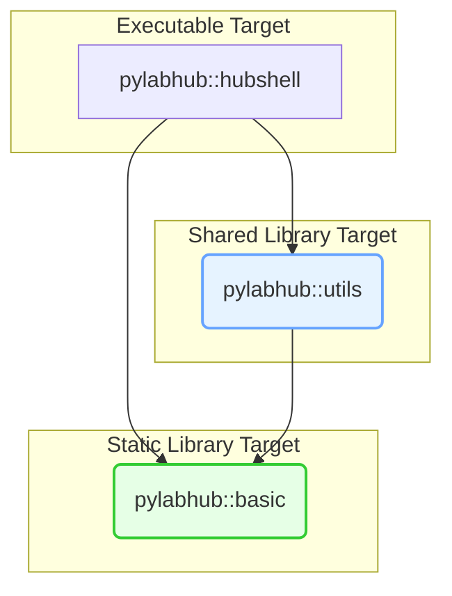
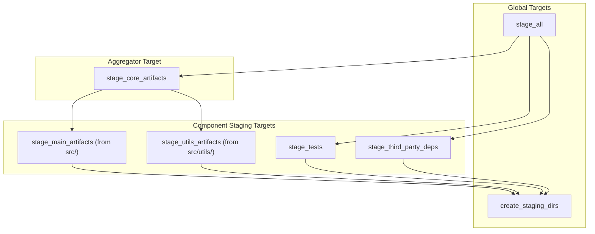

# pyLabHub C++ Build System: Architecture and Developer's Guide

This document provides a definitive overview of the CMake build system for the pyLabHub C++ project. It outlines the core design principles and includes a practical guide for developers to perform common tasks.

## 1. Core Design Principles

Our architecture is built on modern CMake practices, emphasizing **clarity, robustness, and maintainability**.

*   **Dual Library Architecture**: The project is split into two primary libraries, each defined as a CMake target:
    *   `pylabhub-basic`: A **static library** containing foundational, low-level code.
    *   `pylabhub-utils`: A **shared library** containing higher-level, application-aware utilities.
    This separation improves modularity and clarifies dependency direction.

*   **CMake Alias Targets**: We extensively use `ALIAS` targets (e.g., `pylabhub::basic`, `pylabhub::utils`) as a stable interface for consumers. Code should always link against these alias targets, never the concrete target names. This provides an abstraction layer that allows the underlying targets to change without breaking dependent builds.

*   **Unified Staging**: The cornerstone of the design is the unified staging directory, which now always includes the build configuration in its name (e.g., `${CMAKE_BINARY_DIR}/stage-debug`). All build artifacts are copied here, creating a self-contained, runnable package that mirrors the final installation. This makes local development and testing simple and reliable, and allows for side-by-side comparison of artifacts from different configurations.

*   **Separation of Build and Stage**: The system clearly distinguishes between *building* artifacts (compiling) and *staging* them (copying). `cmake --build .` compiles everything, while `cmake --build . --target stage_all` populates the staging area.

*   **Top-Down Control & Modularity**: The build system is broken into logical modules (`cmake/`, `src/`, `tests/`). Each project component (e.g., `src/utils`) defines its own modular staging target (e.g., `stage_utils_artifacts`).

---

## 1.1. How the Staging Directory is Named

The exact name of the staging directory now consistently includes the active build configuration, regardless of the CMake generator used. This ensures that you can always find configuration-specific artifacts in a predictable location (e.g., `build/stage-debug`, `build/stage-release`).

The root of this directory is defined by the `PYLABHUB_STAGING_DIR` variable in CMake.

### Naming Convention: `stage-<config>`

*   **For all generators (Single-Config like Ninja/Makefiles, or Multi-Config like Visual Studio/Xcode):**
    The staging directory name will always be `stage-<config>`, where `<config>` is the lowercase build type (e.g., `debug`, `release`, `minsizerel`, `relwithdebinfo`).

*   **When no configuration is explicitly set:**
    If `CMAKE_BUILD_TYPE` is not explicitly set (e.g., when running `cmake -S . -B build` without `-DCMAKE_BUILD_TYPE`), the build system will default to `debug`. In this case, the staging root will be `build/stage-debug/`.

This ensures consistent behavior across all development environments and build pipelines, allowing artifacts from different build configurations to coexist without overwriting each other.

### Summary Table: Staging Directory Naming

| Generator Type             | `CMAKE_BUILD_TYPE` set to... | Staging Directory (`PYLABHUB_STAGING_DIR`)                                          |
| :------------------------- | :--------------------------- | :---------------------------------------------------------------------------------- |
| All Generators             | `Release`                    | `build/stage-release/`                                                              |
| All Generators             | `Debug`                      | `build/stage-debug/`                                                                |
| All Generators             | `MinSizeRel`                 | `build/stage-minsizerel/`                                                           |
| All Generators             | `RelWithDebInfo`             | `build/stage-relwithdebinfo/`                                                       |
| All Generators             | (not set)                    | `build/stage-debug/` (defaults to Debug, as used by the build system during configure) |

---

## 3. Developer's Cookbook: Common Tasks

### Internal Project Dependencies

This diagram illustrates how the main application and internal libraries depend on each other. The nodes represent **CMake alias targets**.



### Staging Target Dependencies

The `stage_all` target orchestrates several smaller, modular staging targets from different parts of the project. The nodes below are all **custom CMake targets**.



---

## 3. Developer's Cookbook: Common Tasks

This section provides practical recipes for common development tasks.

### Recipe 1: How to Add a New Executable

Let's add a new standalone executable named `my-tool`.

1.  **Create the source file and a `CMakeLists.txt`:**
    ```bash
    mkdir -p src/my_tool && touch src/my_tool/main.cpp src/my_tool/CMakeLists.txt
    ```

2.  **Edit `src/my_tool/CMakeLists.txt`:**
    This defines the executable target and links it against the project's library targets.

    ```cmake
    # src/my_tool/CMakeLists.txt
    add_executable(my-tool main.cpp)
    add_executable(pylabhub::my-tool ALIAS my-tool)

    # Link against the stable CMake alias targets for our libraries
    target_link_libraries(my-tool PRIVATE
      pylabhub::basic  # The core static library
      pylabhub::utils  # The core shared library
    )

    # Create a local staging target for this executable
    add_custom_target(stage_my_tool COMMENT "Staging my-tool executable")

    pylabhub_stage_executable(
      TARGET my-tool
      DESTINATION bin
      ATTACH_TO stage_my_tool
    )

    # Register our local staging target with the global build
    add_dependencies(stage_my_tool my-tool create_staging_dirs)
    set_property(GLOBAL APPEND PROPERTY CORE_STAGE_TARGETS stage_my_tool)
    ```

3.  **Include the new subdirectory in `src/CMakeLists.txt`:**
    ```cmake
    # In src/CMakeLists.txt
    add_subdirectory(utils)
    add_subdirectory(my_tool) # <-- Add this line
    ```

### Recipe 2: How to Add a New Internal Shared Library

Let's add a new shared library with the alias target `pylabhub::power-utils`.

1.  **Create directory and files:**
    ```bash
    mkdir -p src/power_utils && touch src/power_utils/CMakeLists.txt src/power_utils/power.hpp src/power_utils/power.cpp
    ```

2.  **Edit `src/power_utils/CMakeLists.txt`:**
    ```cmake
    add_library(pylabhub-power-utils SHARED power.cpp)
    add_library(pylabhub::power-utils ALIAS pylabhub-power-utils)

    # Use CMake's feature for handling DLL exports/imports for ABI stability
    include(GenerateExportHeader)
    generate_export_header(pylabhub-power-utils
      BASE_NAME POWER_UTILS
      EXPORT_MACRO_NAME PYLABHUB_POWER_UTILS_EXPORT
    )

    target_include_directories(pylabhub-power-utils PUBLIC
      $<BUILD_INTERFACE:${CMAKE_CURRENT_SOURCE_DIR}>
      $<BUILD_INTERFACE:${CMAKE_CURRENT_BINARY_DIR}> # For the export header
      $<INSTALL_INTERFACE:include/power_utils>
    )

    # Link against the foundational static library CMake alias target
    target_link_libraries(pylabhub-power-utils PUBLIC pylabhub::basic)
    
    # Staging Logic
    add_custom_target(stage_power_utils COMMENT "Staging power-utils library")
    pylabhub_stage_library(TARGET pylabhub-power-utils DESTINATION lib ATTACH_TO stage_power_utils)
    pylabhub_stage_headers(
        FILES "${CMAKE_CURRENT_SOURCE_DIR}/power.hpp"
              "${CMAKE_CURRENT_BINARY_DIR}/pylabhub_power_utils_export.h"
        DESTINATION include/power_utils
        ATTACH_TO stage_power_utils
    )

    add_dependencies(stage_power_utils pylabhub-power-utils create_staging_dirs)
    set_property(GLOBAL APPEND PROPERTY CORE_STAGE_TARGETS stage_power_utils)
    ```

3.  **Update `power.hpp` to use the export macro:**
    ```cpp
    #include "pylabhub_power_utils_export.h" // Generated header
    #include "recursion_guard.hpp" // Header from a pylabhub::basic component

    class PYLABHUB_POWER_UTILS_EXPORT PowerManager { /* ... */ };
    ```

### Recipe 3: How to Add a New Internal Static Library

Let's add a new static library with the alias target `pylabhub::math-helpers`.

1.  **Create directory and files:**
    ```bash
    mkdir -p src/math_helpers && touch src/math_helpers/CMakeLists.txt src/math_helpers/math.hpp src/math_helpers/math.cpp
    ```

2.  **Edit `src/math_helpers/CMakeLists.txt`:**
    ```cmake
    add_library(pylabhub-math-helpers STATIC math.cpp)
    add_library(pylabhub::math-helpers ALIAS pylabhub-math-helpers)

    target_include_directories(pylabhub-math-helpers PUBLIC
      $<BUILD_INTERFACE:${CMAKE_CURRENT_SOURCE_DIR}>
      $<INSTALL_INTERFACE:include/math_helpers>
    )
    target_link_libraries(pylabhub-math-helpers PUBLIC pylabhub::basic)

    # Staging Logic
    add_custom_target(stage_math_helpers COMMENT "Staging math-helpers library")
    pylabhub_stage_library(TARGET pylabhub-math-helpers DESTINATION lib ATTACH_TO stage_math_helpers)
    pylabhub_stage_headers(FILES "${CMAKE_CURRENT_SOURCE_DIR}/math.hpp" DESTINATION include/math_helpers ATTACH_TO stage_math_helpers)

    add_dependencies(stage_math_helpers pylabhub-math-helpers create_staging_dirs)
    set_property(GLOBAL APPEND PROPERTY CORE_STAGE_TARGETS stage_math_helpers)
    ```

### Recipe 4: How to Add a New Test

1.  **Find the right test directory**:
    *   For code in the `pylabhub-basic` library: `tests/test_pylabhub_corelib/`
    *   For code in the `pylabhub-utils` library: `tests/test_pylabhub_utils/`
2.  **Create your test file**: `test_my_new_feature.cpp`.
3.  **Add the file to the correct executable target** in `tests/CMakeLists.txt`.
    ```cmake
    # In tests/CMakeLists.txt, find the correct add_executable() call
    add_executable(corelib_tests
        # ... other files
        test_pylabhub_corelib/test_my_new_feature.cpp # <-- Add here
    )
    ```
4.  **Write your test using GoogleTest.** CTest will discover it automatically.

