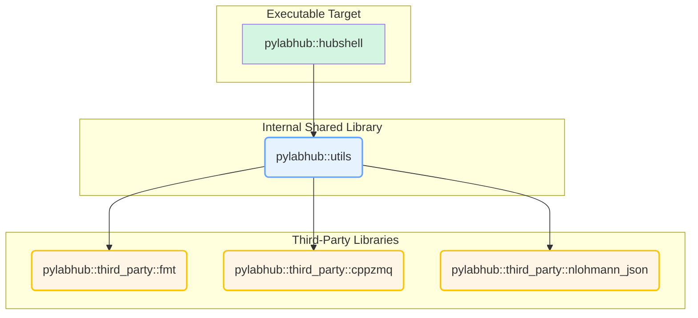
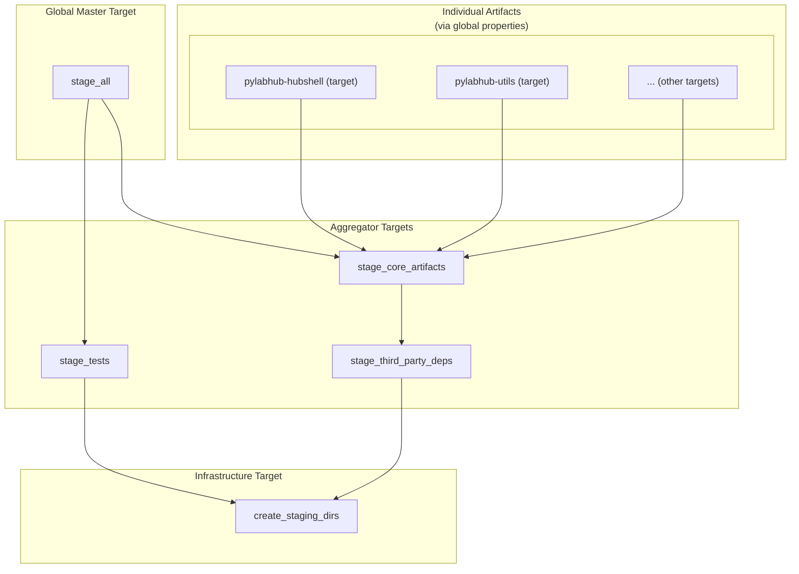

# pyLabHub C++ Build System: Architecture and Developer's Guide

This document provides a definitive overview of the CMake build system for the pyLabHub C++ project. It outlines the core design principles and includes a practical guide for developers to perform common tasks.

## 1. Core Design Principles

Our architecture is built on modern CMake practices, emphasizing **clarity, robustness, and maintainability**. The key pillars of the design are detailed below.

### 1.1. Unified Staging Architecture

The cornerstone of the design is the **unified staging directory**. All build artifacts—executables, libraries, headers, bundles, etc.—are copied into this single location within the build directory. This creates a self-contained, runnable version of the project that mirrors the final installation layout, making local development and testing simple and reliable.

*   **Staging Directory Naming**: The staging directory name consistently includes the build configuration (e.g., `build/stage-debug`, `build/stage-release`). This allows artifacts from different build types to coexist without conflicts. The root is defined by the `PYLABHUB_STAGING_DIR` variable.

*   **Installation via Staging**: The final `install` step is a direct copy of the fully-populated staging directory. This provides a clean separation between development builds and distributable packages. To ensure correctness, the installation process is protected by a pre-install check that verifies the staging process has completed successfully.

*   **Orchestrated Staging Targets**: The staging process is controlled by a hierarchy of custom targets. The master `stage_all` target depends on aggregator targets like `stage_core_artifacts` and `stage_third_party_deps`. A foundational target, `create_staging_dirs`, ensures the directory structure is created before any files are copied, preventing race conditions in parallel builds.

*   **Modular Component Staging**: Each project component (e.g., a library or executable) is responsible for ensuring its artifacts are staged. This is achieved by registering the component's primary build target with a global property (`CORE_STAGE_TARGETS`). The top-level `stage_core_artifacts` target depends on all targets registered this way.

### 1.2. Modular & Stable Target Interfaces

*   **Internal Libraries**: The project's main internal library is `pylabhub::utils`, a shared library for high-level utilities.
*   **Alias Targets**: Consumers **must** link against namespaced `ALIAS` targets (e.g., `pylabhub::utils`, `pylabhub::third_party::fmt`) rather than raw target names. This provides a stable public API for all dependencies and allows the underlying implementation targets to be modified without breaking consumer code.
*   **Third-Party Isolation**: Third-party dependencies are configured in isolated scopes using wrapper scripts in `third_party/cmake/`. This prevents their build options from "leaking" and affecting other parts of the project.

### 1.3. Prerequisite Build System

Some third-party libraries, like `libsodium`, have complex build requirements. To handle this, we use a prerequisite build mechanism:
1.  **ExternalProject_Add**: `libsodium` is built using `ExternalProject_Add`.
2.  **Prerequisite Install Directory**: The library is installed into a sandboxed directory within the build tree (`build/prereqs`).
3.  **Master Prerequisite Target**: A master custom target, `build_prerequisites`, depends on all such external projects.
4.  **Imported Target**: A stable `IMPORTED` target (`pylabhub::third_party::sodium`) is created that points to the artifacts in the prerequisite install directory.
5.  **Dependency Chaining**: Any other library (like `libzmq`) that depends on `libsodium` links against the `pylabhub::third_party::sodium` target and adds a dependency on the `build_prerequisites` target to ensure the correct build order.

## 2. System Diagrams

### Internal Project Dependencies

This diagram illustrates how the main application and internal libraries depend on each other and on third-party libraries. The nodes represent **CMake alias targets**.



### Staging Target Dependencies

The `stage_all` target orchestrates several smaller, modular staging targets from different parts of the project. The dependency flow ensures that directories are created first, third-party libraries are staged next, and finally the project's own core artifacts are staged.



## 3. Developer's Cookbook: Common Tasks

This section provides practical recipes for common development tasks.

### Recipe 1: How to Add a New Add-On Executable

This recipe is for community-contributed or non-core executables.

1.  **Create the source file and a `CMakeLists.txt` in the `add-ons` directory:**
    ```bash
    mkdir -p add-ons/my-tool && touch add-ons/my-tool/main.cpp add-ons/my-tool/CMakeLists.txt
    ```

2.  **Edit `add-ons/my-tool/CMakeLists.txt`:**
    Define the target, link it, and stage it using the provided helper function.

    ```cmake
    # add-ons/my-tool/CMakeLists.txt
    add_executable(my-tool main.cpp)
    add_executable(pylabhub::my-tool ALIAS my-tool)

    # Link against the stable CMake alias target for the utils library.
    target_link_libraries(my-tool PRIVATE pylabhub::utils)

    # --- Staging Logic ---
    # 1. Stage the executable to the 'bin' directory.
    #    This function sets the RUNTIME_OUTPUT_DIRECTORY so the executable is built
    #    directly into the staging area.
    pylabhub_stage_executable(
      TARGET my-tool
      DESTINATION bin
    )

    # 2. Register the executable target with the global 'stage_core_artifacts' target.
    #    This ensures it's built as part of the staging process.
    set_property(GLOBAL APPEND PROPERTY CORE_STAGE_TARGETS my-tool)
    ```

3.  **Include the new subdirectory in `add-ons/CMakeLists.txt`:**
    ```cmake
    # In add-ons/CMakeLists.txt
    add_subdirectory(my-tool) # <-- Add this line
    ```

### Recipe 2: How to Add a New Internal Shared Library

Let's add a new shared library with the alias target `pylabhub::power-utils`. This pattern uses `pylabhub_get_library_staging_commands` to manually create a staging target.

1.  **Create directory and files in `src/`:**
    ```bash
    mkdir -p src/power_utils && touch src/power_utils/CMakeLists.txt src/power_utils/power.hpp src/power_utils/power.cpp
    ```

2.  **Edit `src/power_utils/CMakeLists.txt`:**
    ```cmake
    add_library(pylabhub-power-utils SHARED power.cpp)
    add_library(pylabhub::power-utils ALIAS pylabhub-power-utils)

    # Use CMake's feature for handling DLL exports/imports for ABI stability
    include(GenerateExportHeader)
    generate_export_header(pylabhub-power-utils
      BASE_NAME "pylabhub_power_utils"
      EXPORT_MACRO_NAME "PYLABHUB_POWER_UTILS_EXPORT"
    )

    target_include_directories(pylabhub-power-utils PUBLIC
      $<BUILD_INTERFACE:${CMAKE_CURRENT_SOURCE_DIR}>
      $<BUILD_INTERFACE:${CMAKE_CURRENT_BINARY_DIR}> # For the export header
      $<INSTALL_INTERFACE:include/power_utils>
    )

    # --- Staging Logic ---
    # 1. Get the platform-specific commands to stage the library artifacts.
    pylabhub_get_library_staging_commands(
      TARGET pylabhub-power-utils
      DESTINATION bin # Stage runtime component (.dll, .so) to 'bin/'
      OUT_COMMANDS stage_lib_commands
    )

    # 2. Create a local custom target that executes those commands.
    add_custom_target(stage_power_utils 
        COMMAND ${CMAKE_COMMAND} -E make_directory "${PYLABHUB_STAGING_DIR}/include/power_utils"
        COMMAND ${CMAKE_COMMAND} -E copy
                "${CMAKE_CURRENT_SOURCE_DIR}/power.hpp"
                "${PYLABHUB_STAGING_DIR}/include/power_utils/"
        COMMAND ${CMAKE_COMMAND} -E copy
                "${CMAKE_CURRENT_BINARY_DIR}/pylabhub_power_utils_export.h"
                "${PYLABHUB_STAGING_DIR}/include/power_utils/"
        ${stage_lib_commands}
      COMMENT "Staging power-utils library and headers"
      VERBATIM
    )

    # 3. Set dependencies and register with the global staging system.
    add_dependencies(stage_power_utils pylabhub-power-utils create_staging_dirs)
    set_property(GLOBAL APPEND PROPERTY CORE_STAGE_TARGETS stage_power_utils)
    ```

3.  **Update `power.hpp` to use the export macro:**
    ```cpp
    #include "pylabhub_power_utils_export.h" // Generated header
    
    class PYLABHUB_POWER_UTILS_EXPORT PowerManager { /* ... */ };
    ```

### Recipe 3: How to Add a New Internal Static Library

Let's add a new static library with the alias target `pylabhub::math-helpers`.

1.  **Create directory and files in `src/`:**
    ```bash
    mkdir -p src/math_helpers && touch src/math_helpers/CMakeLists.txt src/math_helpers/math.hpp src/math_helpers/math.cpp
    ```

2.  **Edit `src/math_helpers/CMakeLists.txt`:**
    ```cmake
    add_library(pylabhub-math-helpers STATIC math.cpp)
    add_library(pylabhub::math-helpers ALIAS pylabhub-math-helpers)

    target_include_directories(pylabhub-math-helpers PUBLIC
      $<BUILD_INTERFACE:${CMAKE_CURRENT_SOURCE_DIR}>
      $<INSTALL_INTERFACE:include/math_helpers>
    )

    # --- Staging Logic ---
    # 1. Get the command to stage the static library (.a or .lib).
    pylabhub_get_library_staging_commands(
      TARGET pylabhub-math-helpers
      DESTINATION lib # Static libs are always staged to 'lib/'
      OUT_COMMANDS stage_lib_commands
    )

    # 2. Create the local staging target.
    add_custom_target(stage_math_helpers 
        COMMAND ${CMAKE_COMMAND} -E make_directory "${PYLABHUB_STAGING_DIR}/include/math_helpers"
        COMMAND ${CMAKE_COMMAND} -E copy
                "${CMAKE_CURRENT_SOURCE_DIR}/math.hpp"
                "${PYLABHUB_STAGING_DIR}/include/math_helpers/"
        ${stage_lib_commands}
      COMMENT "Staging math-helpers library and headers"
      VERBATIM
    )
    
    # 3. Set dependencies and register with the global staging system.
    add_dependencies(stage_math_helpers pylabhub-math-helpers create_staging_dirs)
    set_property(GLOBAL APPEND PROPERTY CORE_STAGE_TARGETS stage_math_helpers)
    ```

### Recipe 4: How to Add a New Test Suite

This project uses GoogleTest as the primary testing framework. The `pylabhub::test_framework` target provides a common `main()` entry point and helper utilities, simplifying test creation.

Tests are categorized into two main types: tests for internal core libraries and tests for add-ons.

#### Part A: Adding a Test for a Core Library

Core library tests reside in the `tests/` directory. Each test suite, corresponding to a library like `pylabhub-utils`, has its own subdirectory (e.g., `tests/test_pylabhub_utils`).

**Scenario**: You've added `new_feature.cpp` to `pylabhub-utils` and need to add `test_new_feature.cpp`.

1.  **Create the Test File**: Place your new test file, `test_new_feature.cpp`, inside the appropriate directory, `tests/test_pylabhub_utils/`.

2.  **Update `CMakeLists.txt`**: Add your new test file to the test executable in `tests/test_pylabhub_utils/CMakeLists.txt`.

    ```cmake
    # In tests/test_pylabhub_utils/CMakeLists.txt
    add_executable(test_pylabhub_utils
        # ... other files
        test_new_feature.cpp # <-- Add your test file here
    )
    ```

3.  **Write Your Test**: Implement your test cases using the GoogleTest macros (e.g., `TEST`, `EXPECT_EQ`). The test framework handles the rest.

    ```cpp
    // In tests/test_pylabhub_utils/test_new_feature.cpp
    #include "gtest/gtest.h"
    #include "path/to/new_feature.h" // Include what you are testing

    TEST(NewFeatureTest, HandlesBasicCase) {
        // ... your test logic
        EXPECT_EQ(some_function(), 42);
    }
    ```

    The `pylabhub_register_test_for_staging` and `gtest_discover_tests` functions in the directory's `CMakeLists.txt` will automatically handle staging the test executable and making it visible to CTest.

#### Part B: Adding a Test for an Add-On

Tests for add-ons should be self-contained within the add-on's directory. This keeps the core `tests/` directory clean and reserved for internal libraries.

**Scenario**: You have an add-on named `my-tool` in `add-ons/my-tool/` and want to add tests for it.

1.  **Recommended Structure**: For testability, it's best to separate your add-on's core logic into a library.

    ```text
    add-ons/my-tool/
    ├── CMakeLists.txt
    ├── src/
    │   ├── CMakeLists.txt
    │   ├── my_tool_lib.cpp   # <-- Core logic here
    │   ├── my_tool_lib.h
    │   └── main.cpp          # <-- Executable entry point
    └── tests/
        ├── CMakeLists.txt      # <-- Test-specific build script
        └── test_my_tool.cpp  # <-- Test source file
    ```

2.  **Configure the Main Add-On CMake**: Update `add-ons/my-tool/CMakeLists.txt` to include the `src` and `tests` subdirectories. The `tests` directory should only be included when `BUILD_TESTS` is enabled.

    ```cmake
    # In add-ons/my-tool/CMakeLists.txt
    add_subdirectory(src)

    if(BUILD_TESTS)
      # These variables are needed by the test infrastructure but are not
      # inherited from the main /tests directory. We define them here.
      set(STAGED_TEST_DIR "${PYLABHUB_STAGING_DIR}/tests")
      set(STAGED_BIN_DIR "${PYLABHUB_STAGING_DIR}/bin")
      add_subdirectory(tests)
    endif()
    ```

3.  **Configure the Test `CMakeLists.txt`**: Create `add-ons/my-tool/tests/CMakeLists.txt` to define the test executable.

    ```cmake
    # In add-ons/my-tool/tests/CMakeLists.txt
    add_executable(my-tool-tests test_my_tool.cpp)

    # Link against the test framework and the add-on library under test.
    # The framework provides main() and GoogleTest.
    target_link_libraries(my-tool-tests PRIVATE
      pylabhub::test_framework
      my-tool-lib # The library defined in src/CMakeLists.txt
    )

    # Use the helper to stage the test executable and add it to the
    # global PYLABHUB_TEST_EXECUTABLES_TO_STAGE property.
    pylabhub_register_test_for_staging(TARGET my-tool-tests)

    # Some tests, especially those for add-ons, may need DLLs/shared libraries
    # that are in the staging directory. Use TEST_LAUNCHER to modify the PATH.
    set_property(TARGET my-tool-tests PROPERTY
      TEST_LAUNCHER "${CMAKE_COMMAND}" -E env --modify "PATH=path_list_append:${STAGED_BIN_DIR}"
    )

    # Discover the tests in the executable.
    gtest_discover_tests(my-tool-tests
      WORKING_DIRECTORY "${STAGED_TEST_DIR}"
    )
    ```

4.  **Write the Test**: Write your test file in `add-ons/my-tool/tests/test_my_tool.cpp` using GoogleTest.

By following this pattern, your add-on's tests are built and run as part of the standard `build` and `test` process (e.g., via CTest), just like core library tests, but remain neatly organized with the add-on's source code.