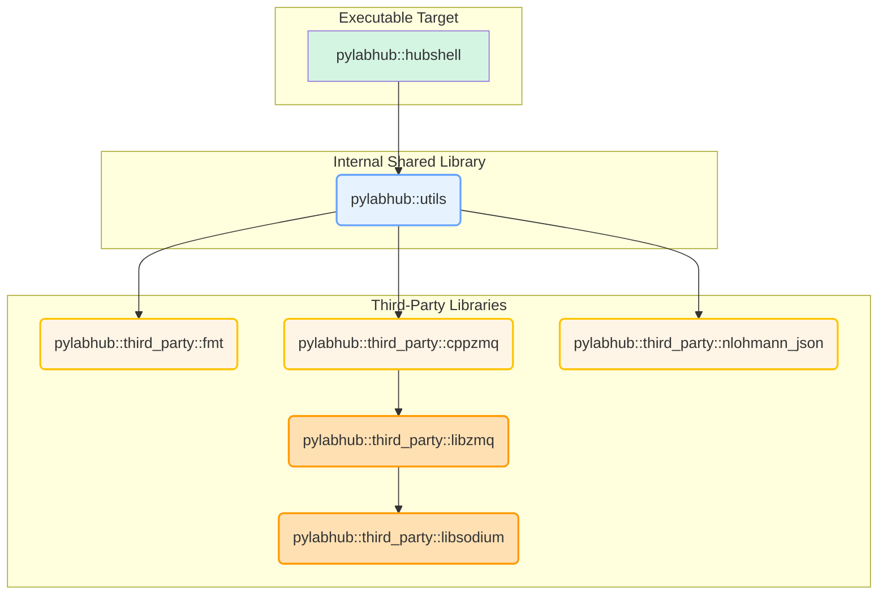
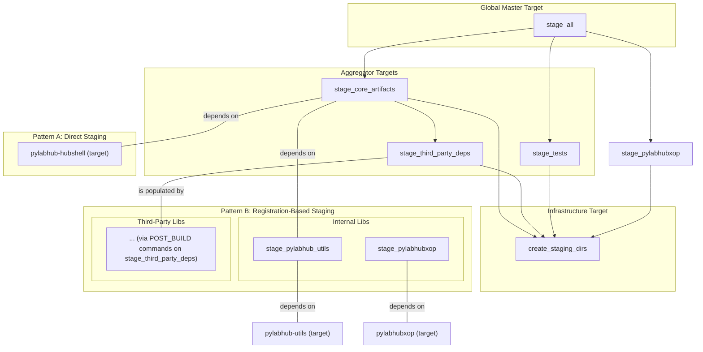

# pyLabHub C++ Build System: Architecture and Developer's Guide

This document provides a definitive overview of the CMake build system for the pyLabHub C++ project. It outlines the core design principles and includes a practical guide for developers to perform common tasks.

## 1. Core Design Principles

Our architecture is built on modern CMake practices, emphasizing **clarity, robustness, and maintainability**. The key pillars of the design are detailed below.

### 1.1. Unified Staging Architecture

The cornerstone of the design is the **unified staging directory**. All build artifacts—executables, libraries, headers, bundles, etc.—are copied into this single location within the build directory. This creates a self-contained, runnable version of the project that mirrors the final installation layout, making local development and testing simple and reliable.

*   **Staging Directory Naming**: The staging directory name consistently includes the build configuration (e.g., `build/stage-debug`, `build/stage-release`). This allows artifacts from different build types to coexist without conflicts. The root is defined by the `PYLABHUB_STAGING_DIR` variable.

*   **Installation via Staging**: The final `install` step is a direct copy of the fully-populated staging directory. This provides a clean separation between development builds and distributable packages. To ensure correctness, the installation process is protected by a pre-install check that verifies the staging process has completed successfully.

*   **Orchestrated Staging Targets**: The staging process is controlled by a hierarchy of custom targets. The master `stage_all` target depends on aggregator targets like `stage_core_artifacts` and `stage_third_party_deps`. A foundational target, `create_staging_dirs`, ensures the directory structure is created before any files are copied, preventing race conditions in parallel builds.

### 1.2. Two Staging Patterns

To handle the different complexities of internal and third-party dependencies, the build system employs two distinct but complementary staging patterns.

#### Pattern A: Direct Staging (for Internal Executables)

This modern, property-based approach is used for the project's native executables.

1.  **How it Works**: The helper function `pylabhub_stage_executable` is called for the target. This function directly sets the `RUNTIME_OUTPUT_DIRECTORY` property on the target.
2.  **Result**: CMake builds the artifact directly into the desired subdirectory within the staging area (e.g., `stage-debug/bin`). No separate copy step is needed.
3.  **Dependency**: To ensure correct build ordering, the target itself (e.g., `pylabhub-hubshell`) is registered to the `CORE_STAGE_TARGETS` global property, making it a dependency of the `stage_core_artifacts` aggregator target.

#### Pattern B: Registration-Based Staging (for All Libraries)

This pattern provides a unified, robust API for staging library and header artifacts from both internal subprojects and externally-built prerequisites.

1.  **Registration**: A component's build script calls `pylabhub_register_library_for_staging(TARGET ...)` or `pylabhub_register_headers_for_staging(DIRECTORIES ...)` at **configure-time**. This records the staging request in a global property. The `TARGET` passed to the library function can be a native target from `add_library` or an `IMPORTED` target representing a prerequisite.
2.  **Processing**: At the end of the `third_party/CMakeLists.txt` configuration, a loop iterates through all registrations.
3.  **Execution**: For each registration, a helper function (e.g., `pylabhub_attach_library_staging_commands`) attaches a `POST_BUILD` custom command to the `stage_third_party_deps` target. This command performs the actual file copying at **build-time**, using generator expressions (`$<TARGET_FILE:...>`) to get the location of the target's artifacts.
4.  **Result**: This decouples the declaration of "what to stage" from the execution of "how to stage," and correctly handles dependencies on all types of libraries. This is the required pattern for all libraries, internal or third-party.

### 1.3. Modular & Stable Target Interfaces

*   **Internal Libraries**: The project's main internal library is `pylabhub::utils`, a shared library for high-level utilities.
*   **Alias Targets**: Consumers **must** link against namespaced `ALIAS` or `IMPORTED` targets (e.g., `pylabhub::utils`, `pylabhub::third_party::fmt`, `pylabhub::third_party::libsodium`) rather than raw target names. This provides a stable public API for all dependencies.
*   **Third-Party Isolation**: Third-party dependencies built via `add_subdirectory` are configured in isolated scopes using wrapper scripts in `third_party/cmake/`. This prevents their build options from "leaking" and affecting other parts of the project, thanks to the `snapshot_cache_var`/`restore_cache_var` helpers.

### 1.4. Prerequisite Build System (Unified Framework)

For third-party libraries that do not use CMake or require a highly controlled build environment (e.g., `libsodium`, `libzmq`, `luajit`), the project uses a robust, unified framework that avoids brittle, hard-coded filenames and works reliably across platforms. This framework is encapsulated in a single generic helper function: `pylabhub_add_external_prerequisite`.

The core principle is to **separate platform-specific build knowledge from the underlying `ExternalProject_Add` boilerplate**.

1.  **Wrapper Script (`third_party/cmake/<pkg>.cmake`)**: For each prerequisite, a wrapper script is responsible for defining *how* to build the library on different platforms. It constructs the appropriate command lists (e.g., for `msbuild` on Windows or `make` on Linux) but does not call `ExternalProject_Add` directly.

2.  **Generic Helper Function (`pylabhub_add_external_prerequisite`)**: The wrapper script passes its constructed command lists to this central function, whose responsibilities are to:
    *   Create the `ExternalProject_Add` target (e.g., `libsodium_external`), passing the custom commands to it.
    *   Append a post-build step that runs a detection script (`detect_external_project.cmake.in`).
    *   Create a stable, namespaced `UNKNOWN IMPORTED` target (e.g., `pylabhub::third_party::libsodium`) for consumers to link against.
    *   Add dependencies to ensure correct build ordering (see below).

3.  **Post-Build Detection & Normalization**: The key to this pattern is the post-build detection script that runs *after* the external build is complete.
    *   **Discover**: It scans the temporary output directories for the actual library file using patterns provided by the wrapper script.
    *   **Stabilize**: It copies this discovered file to a **stable, predictable, and platform-agnostic path** (e.g., `build/prereqs/lib/libsodium-stable`). The rest of our build system can now rely on this stable path.
    *   The `IMPORTED_LOCATION` of the `UNKNOWN IMPORTED` target points to this path *without a file extension*, allowing CMake to automatically find the correct `.lib`, `.a`, or `.so` file at link time.

4.  **Dependency Chaining**: The helper function creates a robust dependency chain:
    *   It makes the `IMPORTED` target (`pylabhub::third_party::libsodium`) depend on the `ExternalProject_Add` target (`libsodium_external`). This ensures that any of our code linking against the imported target will automatically trigger the external build.
    *   It also makes the master `build_prerequisites` target depend on the `ExternalProject_Add` target. This provides a convenient way for developers to build all prerequisites at once by running `cmake --build . --target build_prerequisites`.

This framework makes adding and managing complex prerequisites declarative and consistent, removing redundant boilerplate from the individual package scripts.

### 1.5. Notes on Specific Libraries & Workarounds

*   **`libzmq` Build Workaround**: The `libzmq` library contains a bug in its build script where an internal tool (`curve_keygen`) is hardcoded to link against the shared `libzmq` library. This causes the build to fail if only a static library is requested. To work around this without modifying `libzmq`, our `ExternalProject_Add` configuration for it builds *both* the shared and static libraries. However, the rest of our build system is configured to only use, link against, and stage the **static** library, preserving the project's static-only integration policy. The shared library is a transient artifact that is discarded.

## 2. System Diagrams

### Internal Project Dependencies

This diagram illustrates how the main application and internal libraries depend on each other and on third-party libraries. The nodes represent **CMake alias or imported targets**.



### Staging Target Dependencies

The `stage_all` target orchestrates several smaller, modular staging targets. This diagram clarifies how the two different staging patterns feed into the aggregator targets.



## 3. Developer's Cookbook: Common Tasks

This section provides practical recipes for common development tasks.

### Recipe 1: How to Add a New Add-On Executable

This recipe uses the **Direct Staging** pattern, suitable for simple, native executables.

1.  **Create the source file and `CMakeLists.txt` in the `add-ons` directory.**
2.  **Edit `add-ons/my-tool/CMakeLists.txt`:**
    ```cmake
    # add-ons/my-tool/CMakeLists.txt
    add_executable(my-tool main.cpp)
    add_executable(pylabhub::my-tool ALIAS my-tool)
    target_link_libraries(my-tool PRIVATE pylabhub::utils)

    # --- Staging (Pattern A: Direct) ---
    pylabhub_stage_executable(TARGET my-tool DESTINATION bin)
    set_property(GLOBAL APPEND PROPERTY CORE_STAGE_TARGETS my-tool)
    ```
3.  **Include the new subdirectory in `add-ons/CMakeLists.txt`:**
    ```cmake
    add_subdirectory(my-tool)
    ```

### Recipe 2: How to Add a New Internal Library

This recipe shows the general structure for an internal library, which must use the **Registration-Based Staging** pattern. This example is for a shared library.

1.  **Create directory and files in `src/`.** Ensure source headers (e.g., `my-lib.h`) are placed in `src/include/my-lib/` if they are intended for global staging by the `stage_project_source_headers` target.
2.  **Edit `src/my-lib/CMakeLists.txt`:**
    ```cmake
    add_library(my-lib SHARED my-lib.cpp)
    add_library(pylabhub::my-lib ALIAS my-lib)
    
    # Use CMake's feature for handling DLL exports/imports (important for shared libs)
    include(GenerateExportHeader)
    generate_export_header(my-lib BASE_NAME "my_lib" EXPORT_MACRO_NAME "MY_LIB_EXPORT")
    
    # Make the generated export header discoverable for build
    target_include_directories(my-lib PUBLIC $<BUILD_INTERFACE:${CMAKE_CURRENT_BINARY_DIR}>)

    # --- Staging (Pattern B: Registration) ---
    # 1. Create a local custom target that aggregates all staging commands for this library.
    add_custom_target(stage_my-lib COMMENT "Staging my-lib artifacts")
    add_dependencies(stage_my-lib my-lib) # Ensure the library itself is built first

    # 2. Add commands to stage the generated export header.
    # Note: Primary source headers in src/include are staged globally by the root CMakeLists.txt.
    # This section is for generated headers or other files not covered by global staging.
    add_custom_command(TARGET stage_my-lib POST_BUILD
        COMMAND ${CMAKE_COMMAND} -E copy_if_different # Use copy_if_different for robustness
                "${CMAKE_CURRENT_BINARY_DIR}/my_lib_export.h"
                "${PYLABHUB_STAGING_DIR}/include/"
    )
    
    # 3. Add commands to stage the library artifacts (.dll, .lib, .so, .a).
    pylabhub_get_library_staging_commands(
      TARGET my-lib
      # Use 'bin' for Windows runtime DLLs; 'lib' for POSIX shared libraries
      DESTINATION bin 
      OUT_COMMANDS stage_lib_commands
    )
    add_custom_command(TARGET stage_my-lib POST_BUILD COMMAND ${stage_lib_commands})

    # 4. Register the local staging target with the global core artifacts aggregator.
    set_property(GLOBAL APPEND PROPERTY CORE_STAGE_TARGETS stage_my-lib)
    ```
3.  **Include the subdirectory in `src/CMakeLists.txt`:** `add_subdirectory(my-lib)`

### Recipe 3: How to Add a New Third-Party Library (CMake Subproject)

This recipe is for libraries that have a CMake build system and can be integrated via `add_subdirectory`. It uses the **Registration-Based Staging** pattern.

**Scenario**: Add a new library `new-lib` built with CMake.

1.  **Add the Submodule**: Add `new-lib` as a git submodule in `third_party/`.

2.  **Create the Wrapper Script**: Create `third_party/cmake/new-lib.cmake`.

3.  **Edit the Wrapper Script `new-lib.cmake`**:
    ```cmake
    # third_party/cmake/new-lib.cmake
    include(ThirdPartyPolicyAndHelper)
    include(StageHelpers)
    message(STATUS "[pylabhub-third-party] Configuring new-lib...")

    # 1. Snapshot any cache variables the subproject might modify.
    snapshot_cache_var(BUILD_SHARED_LIBS)
    snapshot_cache_var(BUILD_TESTS) # A common upstream option

    # 2. Set options for the isolated build scope, respecting global policies.
    set(BUILD_SHARED_LIBS OFF CACHE BOOL "Build new-lib as a static lib" FORCE)
    if(THIRD_PARTY_DISABLE_TESTS)
      set(BUILD_TESTS OFF CACHE BOOL "Disable new-lib tests via global policy" FORCE)
    endif()

    # 3. Add the subdirectory.
    add_subdirectory(${CMAKE_CURRENT_SOURCE_DIR}/new-lib EXCLUDE_FROM_ALL)

    # 4. Find the canonical target created by the library.
    _resolve_alias_to_concrete("new-lib::new-lib" _canonical_target)

    # 5. Create our stable, namespaced wrapper target.
    _expose_wrapper(pylabhub_new-lib pylabhub::third_party::new-lib)
    target_link_libraries(pylabhub_new-lib INTERFACE ${_canonical_target})

    # 6. Register its artifacts for staging.
    if(THIRD_PARTY_INSTALL)
      pylabhub_register_headers_for_staging(
        DIRECTORIES "${CMAKE_CURRENT_SOURCE_DIR}/new-lib/include"
        SUBDIR "new-lib" # Stage into include/new-lib/
      )
      pylabhub_register_library_for_staging(TARGET ${_canonical_target})
    endif()
    
    # 7. Add to the install export set for packaging.
    install(TARGETS pylabhub_new-lib ${_canonical_target} EXPORT pylabhubTargets
      ARCHIVE DESTINATION lib
    )

    # 8. Restore the cache variables to prevent leakage.
    restore_cache_var(BUILD_SHARED_LIBS BOOL)
    restore_cache_var(BUILD_TESTS BOOL)
    ```
4.  **Include the Wrapper**: Add `include(new-lib)` to `third_party/CMakeLists.txt`.

### Recipe 4: How to Add a New Third-Party Library (External Build)

This is the pattern for libraries like `libzmq` or `libsodium` that require `ExternalProject_Add`. It uses the unified `pylabhub_add_external_prerequisite` function.

**Scenario**: Add `libexternal`, a non-CMake library, to the project.

1.  **Add Submodule**: Add `libexternal` source to `third_party/`.

2.  **Create Prerequisite Build Script**: Create `third_party/cmake/libexternal.cmake`.

3.  **Edit the Build Script `libexternal.cmake`**: The script's only job is to define the platform-specific build commands and call the generic helper.
    ```cmake
    # third_party/cmake/libexternal.cmake
    # This helper is now in the top-level `cmake/` directory.
    include(ThirdPartyPolicyAndHelper)

    # 1. Define paths
    set(_source_dir "${CMAKE_CURRENT_SOURCE_DIR}/libexternal")
    set(_build_dir "${CMAKE_BINARY_DIR}/third_party/libexternal-build")
    set(_install_dir "${PREREQ_INSTALL_DIR}")

    # 2. Define platform-specific build commands
    if(MSVC)
        # MSVC uses msbuild
        find_program(_MSBUILD_EXE msbuild REQUIRED)
        set(_build_command ${_MSBUILD_EXE} libexternal.sln /p:Configuration=Release)
        set(_install_command "") # Let post-build detection handle copying
        set(_byproducts "${_install_dir}/lib/libexternal.lib")
    else()
        # POSIX systems use Makefiles
        find_program(_MAKE_PROG make REQUIRED)
        set(_configure_command ${_source_dir}/configure --prefix=${_install_dir})
        set(_build_command ${_MAKE_PROG})
        set(_install_command ${_MAKE_PROG} install)
        set(_byproducts "${_install_dir}/lib/libexternal.a")
    endif()

    # 3. Call the generic helper function
    pylabhub_add_external_prerequisite(
      NAME              libexternal
      SOURCE_DIR        "${_source_dir}"
      BINARY_DIR        "${_build_dir}"
      INSTALL_DIR       "${_install_dir}"

      # Pass the platform-specific commands
      CONFIGURE_COMMAND ${_configure_command}
      BUILD_COMMAND     ${_build_command}
      INSTALL_COMMAND   ${_install_command}
      BUILD_BYPRODUCTS  ${_byproducts}

      # Pass patterns for post-build detection script
      LIB_PATTERNS      "libexternal.lib;libexternal.a"
      HEADER_SOURCE_PATTERNS "include"
    )
    
    # 4. (Optional) Provide a convenience alias
    add_library(libexternal::pylabhub ALIAS pylabhub::third_party::libexternal)
    ```
4.  **Include the Wrapper**: Add `include(libexternal)` to `third_party/CMakeLists.txt`. The helper function automatically wires the new external project into the `build_prerequisites` master target, and the stable `pylabhub::third_party::libexternal` target is immediately available for other targets to link against.

### Recipe 5: How to Add a New Test Suite

*(This section from the original document is accurate and detailed. A key point for developers is how to handle runtime dependencies for tests on Windows.)*

#### Developer Note: Handling Test Dependencies on Windows

On Windows, an executable needs to be able to find its dependent DLLs at runtime. There are two primary strategies used in this project:

1.  **Copying DLLs (Used by `pylabhub-utils`)**: The `pylabhub-utils.dll` is explicitly copied into the `tests/` staging directory alongside the test executables. This is a simple and effective approach that ensures tests run "out of the box" without any environment configuration. The downside is minor artifact duplication. This is the project's preferred method for core libraries.

2.  **Modifying the PATH (Used by Add-On example)**: For add-on tests, an alternative is to use the `TEST_LAUNCHER` property in CMake. This allows you to prepend the `bin` directory (where release DLLs are staged) to the `PATH` environment variable just for the duration of the test run.

    ```cmake
    # Prepend the main 'bin' directory to the PATH for this test
    set_property(TARGET my-tool-tests PROPERTY
      TEST_LAUNCHER "${CMAKE_COMMAND}" -E env --modify "PATH=path_list_append:${STAGED_BIN_DIR}"
    )
    ```
This method avoids copying DLLs but requires more configuration per-test. Both approaches are valid depending on the situation.
