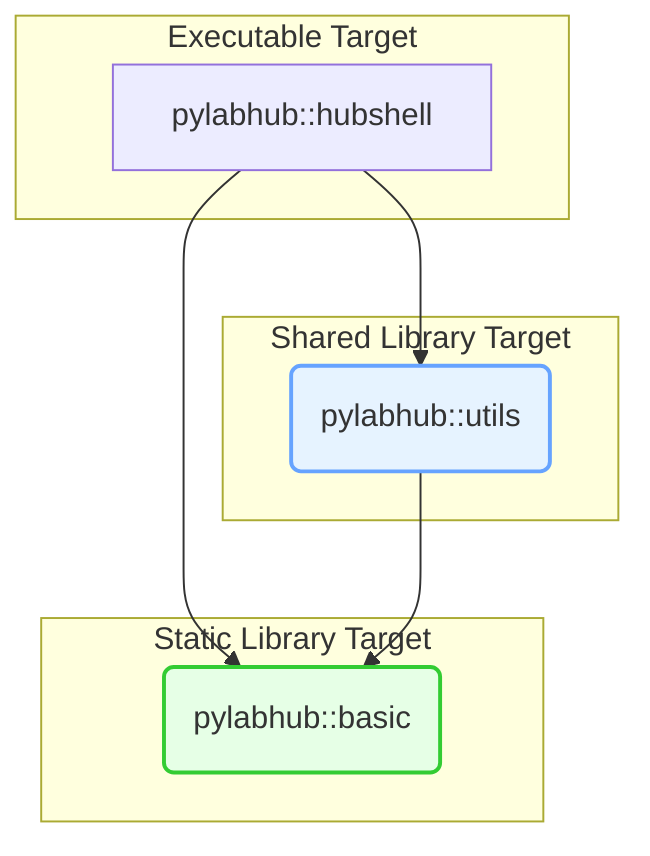
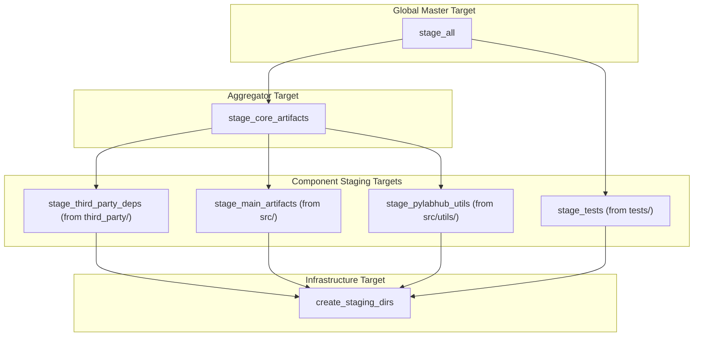

# pyLabHub C++ Build System: Architecture and Developer's Guide

This document provides a definitive overview of the CMake build system for the pyLabHub C++ project. It outlines the core design principles and includes a practical guide for developers to perform common tasks.

## 1. Core Design Principles

Our architecture is built on modern CMake practices, emphasizing **clarity, robustness, and maintainability**. The key pillars of the design are detailed below.

*   **1.1. Unified Staging Architecture**
    The cornerstone of the design is the **unified staging directory** (`build/stage/`). All build artifacts—executables, libraries, headers, and bundles—are copied into this single location. This creates a self-contained, runnable version of the project that mirrors the final installation layout, making local development and testing simple and reliable.
    *   **Installation via Staging:** The final `install` target is merely a direct copy of the fully-populated staging directory. This provides a clean separation between development builds and distributable packages.
    *   **Orchestrated Staging Targets:** The process is controlled by a hierarchy of custom targets. The master `stage_all` target depends on aggregator targets like `stage_core_artifacts` and `stage_third_party_deps`. These, in turn, depend on an infrastructure target, `create_staging_dirs`, to ensure the directory structure is created before any files are copied, preventing race conditions in parallel builds.
    *   **Modular Staging:** Each component (e.g., `src/utils`) is responsible for defining its own local staging target (`stage_pylabhub_utils`), which is then hooked into the global `CORE_STAGE_TARGETS` property to be aggregated.

*   **1.2. Modular & Stable Target Interfaces**
    *   **Core Libraries:** The project is split into two primary internal libraries: `pylabhub-basic` (a static library for foundational code) and `pylabhub-utils` (a shared library for higher-level utilities).
    *   **Alias Targets:** Consumers **must** link against namespaced `ALIAS` targets (e.g., `pylabhub::basic`, `pylabhub::utils`, `pylabhub::third_party::fmt`) rather than the raw target names. This provides a stable public API for all dependencies and allows the underlying implementation targets to be modified without breaking consumer code.

*   **1.3. Isolated Third-Party Dependency Management**
    External dependencies are managed in a "sandbox" to prevent build settings from "leaking" and interfering with the main project or each other.
    *   **Wrapper Scripts:** Each third-party library is configured via a dedicated wrapper script in `third_party/cmake/`.
    *   **Scope Isolation:** These wrappers use `snapshot_cache_var` and `restore_cache_var` macros to save the state of CMake variables, configure the dependency in an isolated scope, and then restore the original state.
    *   **Abstracted Interface:** The `pylabhub::third_party::*` alias targets hide the underlying upstream targets, providing a consistent and stable interface for all external dependencies.

*   **1.4. Phased and Platform-Aware Configuration**
    The build is structured to handle platform differences and toolchain selection robustly.
    *   **Three-Phase Configuration:** The top-level `CMakeLists.txt` executes in three distinct phases:
        1.  **Pre-Project:** Logic to influence CMake's compiler selection (e.g., forcing Clang on macOS).
        2.  **Project Definition:** The `project()` call, which triggers toolchain detection.
        3.  **Post-Project:** All other configuration, which can now react to the chosen compiler and platform (e.g., setting compiler-specific flags).
    *   **Platform Abstraction:** The `cmake/PlatformAndCompiler.cmake` module detects the host OS and compiler, setting global compile definitions (`PLATFORM_WIN64`, `PLATFORM_APPLE`, etc.) and applying consistent, platform-appropriate compiler flags.

*   **1.5. Top-Down Build Policy Control**
    High-level build behavior is controlled by a central set of user-facing options, not by hardcoded values in the core logic. These `CACHE` variables (e.g., `BUILD_TESTS`, `PYLABHUB_USE_SANITIZER`, `THIRD_PARTY_INSTALL`) are defined in `cmake/ToplevelOptions.cmake`, providing a clear and discoverable interface for controlling the build from the CMake command line or GUI.

---

## 2. Visualizing the Build System

### Internal Project Dependencies

This diagram illustrates how the main application and internal libraries depend on each other. The nodes represent **CMake alias targets**.



### Staging Target Dependencies

The `stage_all` target orchestrates several smaller, modular staging targets from different parts of the project. The nodes below are all **custom CMake targets**. Note the serial dependency on `stage_third_party_deps` to prevent build race conditions.



---

## 3. Developer's Cookbook: Common Tasks

This section provides practical recipes for common development tasks.

### Recipe 1: How to Add a New Executable

Let's add a new standalone executable named `my-tool`.

1.  **Create the source file and a `CMakeLists.txt`:**
    ```bash
    mkdir -p src/my_tool && touch src/my_tool/main.cpp src/my_tool/CMakeLists.txt
    ```

2.  **Edit `src/my_tool/CMakeLists.txt`:**
    This defines the executable target, links it against project libraries, and sets up staging.

    ```cmake
    # src/my_tool/CMakeLists.txt
    add_executable(my-tool main.cpp)
    add_executable(pylabhub::my-tool ALIAS my-tool)

    # Link against the stable CMake alias targets for our libraries
    target_link_libraries(my-tool PRIVATE
      pylabhub::basic  # The core static library
      pylabhub::utils  # The core shared library
    )

    # --- Staging Logic ---
    # 1. Create a local staging target for this executable.
    add_custom_target(stage_my_tool COMMENT "Staging my-tool executable")

    # 2. Attach a command to copy the built executable to the staging 'bin' directory.
    pylabhub_stage_executable(
      TARGET my-tool
      DESTINATION bin
      ATTACH_TO stage_my_tool
    )

    # 3. Ensure the local staging target depends on the executable and directory creation.
    add_dependencies(stage_my_tool my-tool create_staging_dirs)

    # 4. Register our local staging target with the global 'stage_core_artifacts' target.
    set_property(GLOBAL APPEND PROPERTY CORE_STAGE_TARGETS stage_my_tool)
    ```

3.  **Include the new subdirectory in `src/CMakeLists.txt`:**
    ```cmake
    # In src/CMakeLists.txt
    add_subdirectory(utils)
    add_subdirectory(my_tool) # <-- Add this line
    ```

### Recipe 2: How to Add a New Internal Shared Library

Let's add a new shared library with the alias target `pylabhub::power-utils`.

1.  **Create directory and files:**
    ```bash
    mkdir -p src/power_utils && touch src/power_utils/CMakeLists.txt src/power_utils/power.hpp src/power_utils/power.cpp
    ```

2.  **Edit `src/power_utils/CMakeLists.txt`:**
    ```cmake
    add_library(pylabhub-power-utils SHARED power.cpp)
    add_library(pylabhub::power-utils ALIAS pylabhub-power-utils)

    # Use CMake's feature for handling DLL exports/imports for ABI stability
    include(GenerateExportHeader)
    generate_export_header(pylabhub-power-utils
      BASE_NAME "pylabhub_power_utils"
      EXPORT_MACRO_NAME "PYLABHUB_POWER_UTILS_EXPORT"
    )
    # This definition is crucial for consumers of the generated header
    target_compile_definitions(pylabhub-power-utils PRIVATE PYLABHUB_POWER_UTILS_EXPORT_DLL=1)

    target_include_directories(pylabhub-power-utils PUBLIC
      $<BUILD_INTERFACE:${CMAKE_CURRENT_SOURCE_DIR}>
      $<BUILD_INTERFACE:${CMAKE_CURRENT_BINARY_DIR}> # For the export header
      $<INSTALL_INTERFACE:include/power_utils>
    )

    # Link against the foundational static library CMake alias target
    target_link_libraries(pylabhub-power-utils PUBLIC pylabhub::basic)
    
    # --- Staging Logic ---
    # 1. Get the platform-specific commands to stage the library artifacts.
    pylabhub_get_library_staging_commands(
      TARGET pylabhub-power-utils
      DESTINATION lib # Stage to 'lib/' (or 'bin/' on Windows). RPATH is handled.
      OUT_COMMANDS stage_lib_commands
    )

    # 2. Create a local staging target that executes those commands.
    add_custom_target(stage_power_utils ${stage_lib_commands} COMMENT "Staging power-utils library")

    # 3. Add commands to stage the public headers.
    add_custom_command(TARGET stage_power_utils POST_BUILD
      COMMAND ${CMAKE_COMMAND} -E copy
              "${CMAKE_CURRENT_SOURCE_DIR}/power.hpp"
              "${PYLABHUB_STAGING_DIR}/include/power_utils/"
      COMMAND ${CMAKE_COMMAND} -E copy
              "${CMAKE_CURRENT_BINARY_DIR}/pylabhub_power_utils_export.h"
              "${PYLABHUB_STAGING_DIR}/include/power_utils/"
      COMMENT "Staging power-utils headers"
    )

    # 4. Set dependencies and register with the global staging system.
    add_dependencies(stage_power_utils pylabhub-power-utils create_staging_dirs)
    set_property(GLOBAL APPEND PROPERTY CORE_STAGE_TARGETS stage_power_utils)
    ```

3.  **Update `power.hpp` to use the export macro:**
    ```cpp
    #include "pylabhub_power_utils_export.h" // Generated header
    #include "recursion_guard.hpp" // Header from pylabhub::basic

    class PYLABHUB_POWER_UTILS_EXPORT PowerManager { /* ... */ };
    ```

### Recipe 3: How to Add a New Internal Static Library

Let's add a new static library with the alias target `pylabhub::math-helpers`.

1.  **Create directory and files:**
    ```bash
    mkdir -p src/math_helpers && touch src/math_helpers/CMakeLists.txt src/math_helpers/math.hpp src/math_helpers/math.cpp
    ```

2.  **Edit `src/math_helpers/CMakeLists.txt`:**
    ```cmake
    add_library(pylabhub-math-helpers STATIC math.cpp)
    add_library(pylabhub::math-helpers ALIAS pylabhub-math-helpers)

    target_include_directories(pylabhub-math-helpers PUBLIC
      $<BUILD_INTERFACE:${CMAKE_CURRENT_SOURCE_DIR}>
      $<INSTALL_INTERFACE:include/math_helpers>
    )
    target_link_libraries(pylabhub-math-helpers PUBLIC pylabhub::basic)

    # --- Staging Logic ---
    # 1. Get the command to stage the static library (.a or .lib).
    pylabhub_get_library_staging_commands(
      TARGET pylabhub-math-helpers
      DESTINATION lib # Static libs are always staged to 'lib/'
      OUT_COMMANDS stage_lib_commands
    )

    # 2. Create the local staging target.
    add_custom_target(stage_math_helpers ${stage_lib_commands} COMMENT "Staging math-helpers library")

    # 3. Add a command to stage the public header.
    add_custom_command(TARGET stage_math_helpers POST_BUILD
        COMMAND ${CMAKE_COMMAND} -E copy
                "${CMAKE_CURRENT_SOURCE_DIR}/math.hpp"
                "${PYLABHUB_STAGING_DIR}/include/math_helpers/"
        COMMENT "Staging math-helpers header"
    )
    
    # 4. Set dependencies and register with the global staging system.
    add_dependencies(stage_math_helpers pylabhub-math-helpers create_staging_dirs)
    set_property(GLOBAL APPEND PROPERTY CORE_STAGE_TARGETS stage_math_helpers)
    ```

### Recipe 4: How to Add a New Test

1.  **Find the right test directory**:
    *   For code in the `pylabhub-basic` library: `tests/test_pylabhub_corelib/`
    *   For code in the `pylabhub-utils` library: `tests/test_pylabhub_utils/`
2.  **Create your test file**: `test_my_new_feature.cpp`.
3.  **Add the file to the correct executable target** in its `CMakeLists.txt`. For example, in `tests/test_pylabhub_corelib/CMakeLists.txt`:
    ```cmake
    # In tests/test_pylabhub_corelib/CMakeLists.txt
    add_executable(corelib_tests
        # ... other files
        test_my_new_feature.cpp # <-- Add here
    )
    ```
4.  **Write your test using GoogleTest.** CTest will discover it automatically.

