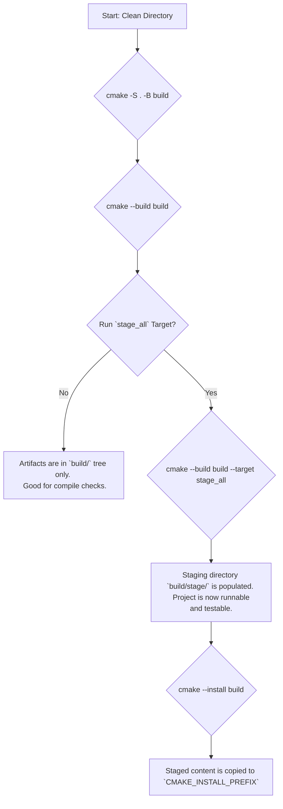
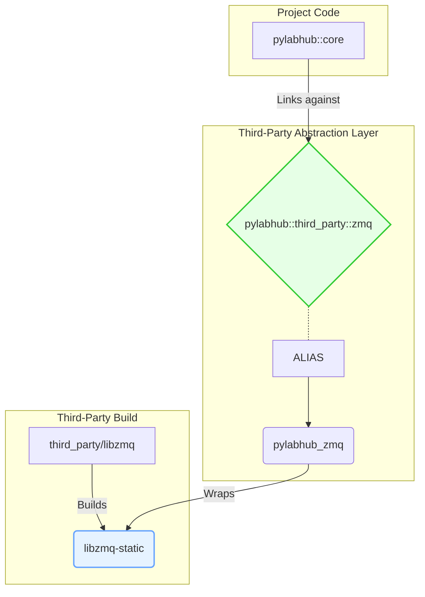
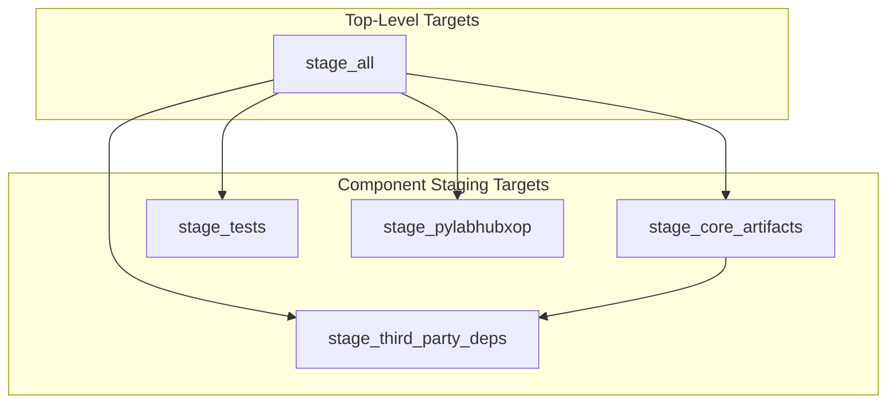

# pyLabHub C++ Build System: Architecture and Developer's Guide

This document provides a definitive overview of the CMake build system for the pyLabHub C++ project. It outlines the core design principles and includes a practical guide for developers to perform common tasks.

## 1. Core Design Principles

Our architecture is built on modern CMake practices, emphasizing **clarity, robustness, and maintainability**.

*   **Unified Staging**: The cornerstone of the design is the unified staging directory (`build/stage/`). All build artifacts—executables, libraries, headers, and resources—are copied into this single location. This creates a self-contained, runnable package that mirrors the final installation, simplifying development and testing.

*   **Separation of Build and Stage**: The system clearly distinguishes between *building* artifacts (compiling) and *staging* them (copying to the stage directory). A standard `cmake --build .` compiles everything, but a separate `cmake --build . --target stage_all` is required to populate the staging area.

*   **Isolation & Abstraction**: Third-party dependencies are configured in isolated "sandboxes" using a `snapshot_cache_var`/`restore_cache_var` mechanism to prevent their build settings from "leaking." Consumers link against stable, namespaced `ALIAS` targets (e.g., `pylabhub::third_party::fmt`), abstracting away the underlying build details.

*   **Top-Down Control & Modularity**: The build system is broken into logical, single-responsibility modules (`cmake/`, `third_party/`, `src/`, `tests/`). High-level build policies are defined as user-facing `CACHE` options (e.g., `BUILD_TESTS`), providing a clear, centralized API.

*   **Robust Symbol Visibility and Export**: The system uses CMake's `generate_export_header` and `-fvisibility=hidden` (on GCC/Clang) to ensure a stable Application Binary Interface (ABI) for all shared libraries, preventing accidental symbol exposure.

---

## 2. Visualizing the Build System

### Build and Stage Workflow

This diagram shows the high-level workflow from configuration to final installation.



### Dependency Abstraction

This shows how a consumer (`pylabhub::core`) is decoupled from the actual third-party library (`libzmq`) via stable, intermediate targets.



### Staging Target Dependencies

The `stage_all` target orchestrates several smaller, modular staging targets.



---

## 3. Developer's Cookbook: Common Tasks

This section provides practical recipes for common development tasks.

### Recipe 1: How to Add a New Executable

Let's add a new standalone executable named `my-tool`.

1.  **Create the source file and a `CMakeLists.txt`:**
    ```bash
    # In /cpp directory
    mkdir -p src/my_tool
    touch src/my_tool/main.cpp
    touch src/my_tool/CMakeLists.txt
    ```

2.  **Edit `src/my_tool/main.cpp`:**
    ```cpp
    #include <iostream>
    int main() {
        std::cout << "Hello from my-tool!\n";
        return 0;
    }
    ```

3.  **Edit `src/my_tool/CMakeLists.txt`:**
    This file defines the executable, links it to project libraries, and tells the build system how to stage it.

    ```cmake
    # src/my_tool/CMakeLists.txt
    add_executable(my-tool main.cpp)
    add_executable(pylabhub::my-tool ALIAS my-tool)

    # Link against project libraries (e.g., pylabhub::utils)
    target_link_libraries(my-tool PRIVATE pylabhub::utils)

    # Create a local staging target
    add_custom_target(stage_my_tool COMMENT "Staging my-tool executable")

    # Attach the staging command to our local target
    pylabhub_stage_executable(
      TARGET my-tool
      DESTINATION bin       # Stage to build/stage/bin/
      ATTACH_TO stage_my_tool
    )

    # Register our local staging target with the global 'stage_core_artifacts'
    add_dependencies(stage_my_tool my-tool)
    set_property(GLOBAL APPEND PROPERTY CORE_STAGE_TARGETS stage_my_tool)
    ```

4.  **Include the new subdirectory in `src/CMakeLists.txt`:**
    ```cmake
    # In src/CMakeLists.txt
    # ...
    add_subdirectory(utils)
    add_subdirectory(my_tool) # <-- Add this line
    # ...
    ```

5.  **Build:**
    Re-run CMake, then build. The executable will be staged to `build/stage/bin/my-tool`.

### Recipe 2: How to Add a New Internal Shared Library

Let's add `pylabhub::power-utils` as a new shared library.

1.  **Create the directory structure:**
    ```bash
    mkdir -p src/power_utils
    touch src/power_utils/CMakeLists.txt
    touch src/power_utils/power.hpp
    touch src/power_utils/power.cpp
    ```

2.  **Edit `src/power_utils/CMakeLists.txt`:**
    ```cmake
    # src/power_utils/CMakeLists.txt
    add_library(pylabhub-power-utils SHARED power.cpp)
    add_library(pylabhub::power-utils ALIAS pylabhub-power-utils)

    # Use CMake's feature for handling DLL exports/imports
    include(GenerateExportHeader)
    generate_export_header(pylabhub-power-utils
      BASE_NAME POWER_UTILS
      EXPORT_MACRO_NAME PYLABHUB_POWER_UTILS_EXPORT
      EXPORT_FILE_NAME "${CMAKE_CURRENT_BINARY_DIR}/pylabhub_power_utils_export.h"
    )

    target_include_directories(pylabhub-power-utils
      PUBLIC
        $<BUILD_INTERFACE:${CMAKE_CURRENT_SOURCE_DIR}>
        $<BUILD_INTERFACE:${CMAKE_CURRENT_BINARY_DIR}> # For the export header
        $<INSTALL_INTERFACE:include/power_utils>
    )

    target_link_libraries(pylabhub-power-utils PUBLIC pylabhub::utils)
    
    # Staging Logic
    pylabhub_get_library_staging_commands(
      TARGET pylabhub-power-utils
      DESTINATION bin # Stage .dll/.so to bin/
      OUT_COMMANDS stage_commands
    )
    add_custom_target(stage_power_utils ${stage_commands}
      COMMENT "Staging power-utils library"
    )
    add_custom_command(TARGET stage_power_utils POST_BUILD
      COMMAND ${CMAKE_COMMAND} -E copy
        "${CMAKE_CURRENT_SOURCE_DIR}/power.hpp"
        "${CMAKE_CURRENT_BINARY_DIR}/pylabhub_power_utils_export.h"
        DESTINATION "${PYLABHUB_STAGING_DIR}/include/power_utils/"
      COMMENT "Staging power-utils public headers"
    )

    add_dependencies(stage_power_utils pylabhub-power-utils)
    set_property(GLOBAL APPEND PROPERTY CORE_STAGE_TARGETS stage_power_utils)
    ```

3.  **Update `power.hpp` to use the export macro:**
    ```cpp
    #include "pylabhub_power_utils_export.h" // Generated header

    class PYLABHUB_POWER_UTILS_EXPORT PowerManager {
    public:
        void boost();
    };
    ```

4.  **Include the new subdirectory in `src/CMakeLists.txt`:**
    ```cmake
    # In src/CMakeLists.txt
    add_subdirectory(utils)
    add_subdirectory(power_utils) # <-- Add this line
    ```

### Recipe 3: How to Add a New Third-Party Library (Compiled)

Let's add a fictional pre-compiled library `super-lib`.

1.  **Place the files in `third_party/`:**
    *   Headers: `third_party/super-lib/include/super-lib/super.h`
    *   Libraries: `third_party/super-lib/lib/super.lib` (and `.dll`, etc.)

2.  **Create a CMake wrapper script at `third_party/cmake/super-lib.cmake`:**
    ```cmake
    # third_party/cmake/super-lib.cmake
    _expose_wrapper(pylabhub_super-lib pylabhub::third_party::super-lib)
    
    # Find the library and header files
    find_path(SUPERLIB_INCLUDE_DIR NAMES super.h PATHS "${CMAKE_CURRENT_SOURCE_DIR}/super-lib/include")
    find_library(SUPERLIB_LIBRARY NAMES super PATHS "${CMAKE_CURRENT_SOURCE_DIR}/super-lib/lib")

    # Link the found files to the wrapper target
    target_include_directories(pylabhub_super-lib INTERFACE ${SUPERLIB_INCLUDE_DIR})
    target_link_libraries(pylabhub_super-lib INTERFACE ${SUPERLIB_LIBRARY})
    
    # Stage the artifacts if THIRD_PARTY_INSTALL is ON
    if(THIRD_PARTY_INSTALL)
      pylabhub_stage_headers(
        DIRECTORIES ${SUPERLIB_INCLUDE_DIR}
        SUBDIR super-lib # Stage to build/stage/include/super-lib
      )
      # Manually stage the pre-compiled library files
      add_custom_command(TARGET stage_third_party_deps POST_BUILD
        COMMAND ${CMAKE_COMMAND} -E copy_if_different
          "${SUPERLIB_LIBRARY}"
          "${PYLABHUB_STAGING_DIR}/lib/"
        COMMAND ${CMAKE_COMMAND} -E copy_if_different
          "${CMAKE_CURRENT_SOURCE_DIR}/super-lib/bin/super.dll" # Example for DLL
          "${PYLABHUB_STAGING_DIR}/bin/"
        COMMENT "Staging pre-compiled super-lib artifacts"
      )
    endif()
    ```

3.  **Include the wrapper in `third_party/CMakeLists.txt`:**
    ```cmake
    # In third_party/CMakeLists.txt
    # ...
    include(cmake/fmt.cmake)
    include(cmake/libzmq.cmake)
    include(cmake/super-lib.cmake) # <-- Add this line
    ```

### Recipe 4: How to Add a New Test

The test suite is designed for simplicity.

1.  **Create a new test file in the `tests/` directory:**
    Name it something like `test_power_utils.cpp`.

2.  **Write your test using GoogleTest:**
    ```cpp
    // tests/test_power_utils.cpp
    #include "test_main.h"
    #include "power_utils/power.hpp" // Your new library's header
    
    TEST(PowerUtilsTest, CanBoost) {
        PowerManager pm;
        // Your test logic here...
        ASSERT_NO_THROW(pm.boost());
    }
    ```

3.  **Done.** The `file(GLOB ...)` command in `tests/CMakeLists.txt` automatically finds all `*.cpp` files. `gtest_discover_tests` then finds all `TEST` macros within them. Just re-run the build.
