# pyLabHub C++ Build System: Architecture and Developer's Guide

This document provides a definitive overview of the CMake build system for the pyLabHub C++ project. It outlines the core design principles and includes a practical guide for developers to perform common tasks.

## Table of Contents
1. [Quick Start](#quick-start)
2. [Core Design Principles](#core-design-principles)
3. [System Diagrams](#system-diagrams)
4. [Build and Staging Flow](#build-and-staging-execution-flow)
5. [Developer's Cookbook](#developers-cookbook-common-tasks)
6. [Troubleshooting](#troubleshooting-common-issues)
7. [Function Reference](#cmake-function-quick-reference)

## Quick Start

### Building the Project

```bash
# Configure (from project root)
cmake -S cpp -B cpp/build -DCMAKE_BUILD_TYPE=Debug

# Build everything
cmake --build cpp/build

# Stage all artifacts (creates runnable layout)
cmake --build cpp/build --target stage_all

# Run tests
cd cpp/build
ctest

# Install (optional)
cmake --install cpp/build --prefix /path/to/install
```

### Key Build Options

Configure with `-D<OPTION>=<VALUE>`:

| Option | Default | Description |
|--------|---------|-------------|
| `BUILD_TESTS` | `ON` | Build the test suite |
| `BUILD_XOP` | `ON` | Build Igor Pro XOP module |
| `THIRD_PARTY_INSTALL` | `ON` | Stage third-party dependencies |
| `PYLABHUB_STAGE_ON_BUILD` | `ON` | Run staging automatically on build |
| `PYLABHUB_USE_SANITIZER` | `"None"` | Enable sanitizers (Address, Thread, etc.) |
| `CMAKE_BUILD_TYPE` | `Debug` | Build configuration (Debug, Release, etc.) |

Example:
```bash
cmake -S cpp -B cpp/build -DCMAKE_BUILD_TYPE=Release -DBUILD_TESTS=OFF
```

## 1. Core Design Principles

Our architecture is built on modern CMake practices, emphasizing **clarity, robustness, and maintainability**. The key pillars of the design are detailed below.

### 1.1. Unified Staging Architecture

The cornerstone of the design is the **unified staging directory**. All build artifacts—executables, libraries, headers, bundles, etc.—are copied into this single location within the build directory. This creates a self-contained, runnable version of the project that mirrors the final installation layout, making local development and testing simple and reliable.

*   **Staging Directory Naming**: The staging directory name consistently includes the build configuration (e.g., `build/stage-debug`, `build/stage-release`). The root is defined by the `PYLABHUB_STAGING_DIR` variable.

*   **Installation via Staging**: The final `install` step is a direct copy of the fully-populated staging directory. This provides a clean separation between development builds and distributable packages. To ensure correctness, the installation process is protected by a pre-install check that verifies the staging process has completed successfully.

*   **Orchestrated Staging Targets**: The staging process is controlled by a hierarchy of custom targets. The master `stage_all` target depends on aggregator targets like `stage_core_artifacts` and `stage_third_party_deps`. A foundational target, `create_staging_dirs`, ensures the directory structure is created before any files are copied, preventing race conditions in parallel builds.

### 1.1.1. Header Staging Mechanics

The `pylabhub_register_headers_for_staging` function provides a flexible way to stage header files into the unified staging directory. Understanding how the `DIRECTORIES` and `SUBDIR` arguments interact is crucial:

*   **`DIRECTORIES <path_to_source_headers>`**: This argument specifies one or more source directories containing headers. When copied, the *contents* of each specified source directory are copied into the destination, preserving their internal subdirectory structure.
*   **`SUBDIR <relative_path>`**: This argument specifies a subdirectory *within* `${PYLABHUB_STAGING_DIR}/include/` where the headers will be placed.

**How it works:**
The staging process creates a destination path: `${PYLABHUB_STAGING_DIR}/include/<SUBDIR_value>`.
Then, for each `DIRECTORIES` argument, it recursively copies the *contents* of that directory into the calculated destination path.

**Examples:**

1.  **Staging `src/include` to `include/` (no extra subdirectory):**
    ```cmake
    pylabhub_register_headers_for_staging(
      DIRECTORIES "${CMAKE_SOURCE_DIR}/src/include"
      SUBDIR "" # Headers go directly into ${PYLABHUB_STAGING_DIR}/include/
    )
    # If src/include/my_lib/header.h, it becomes ${PYLABHUB_STAGING_DIR}/include/my_lib/header.h
    ```

2.  **Staging a third-party library's namespaced headers:**
    ```cmake
    # Assume the library's headers are located at `${CMAKE_CURRENT_SOURCE_DIR}/fmt/include/fmt/format.h`.
    # To make them available as `${PYLABHUB_STAGING_DIR}/include/fmt/format.h` for consumers,
    # you would point DIRECTORIES to the root that *contains* the 'fmt' subdirectory.
    pylabhub_register_headers_for_staging(
      DIRECTORIES "${CMAKE_CURRENT_SOURCE_DIR}/fmt/include"
      SUBDIR "" # Headers go directly into ${PYLABHUB_STAGING_DIR}/include/
    )
    # This results in: ${PYLABHUB_STAGING_DIR}/include/fmt/format.h
    ```
    **Clarification:** If the source directory already contains the desired top-level namespace, then `SUBDIR ""` is usually appropriate. If the source directory *itself* needs to become a new namespace, then `SUBDIR "my_namespace"` is suitable.

3.  **Staging individual files:**
    ```cmake
    pylabhub_register_headers_for_staging(
      FILES "${CMAKE_CURRENT_BINARY_DIR}/my_lib_export.h"
      SUBDIR "" # Stages directly into ${PYLABHUB_STAGING_DIR}/include/
    )
    # This results in ${PYLABHUB_STAGING_DIR}/include/my_lib_export.h
    ```

### 1.2. Staging Architecture: A Dual-Strategy Approach

To robustly handle both our internal code and the varied build systems of external dependencies, the project uses a dual-strategy staging architecture. The strategy used depends on the type of dependency.

#### Dependency Types

There are two classes of third-party dependencies:

1.  **Type A: Native CMake Projects**: These are libraries that have a well-behaved CMake build system (e.g., `fmt`, `libzmq`). They are integrated directly into our build graph via `add_subdirectory`.
2.  **Type B: External Prerequisites**: These are libraries that use non-CMake build systems (`make`, `msbuild`, etc.) or require a more complex, isolated build process (e.g., `luajit`, `libsodium`). They are built using `ExternalProject_Add` and installed into an intermediate `prereqs` directory within the build tree.

#### Staging Strategies

Corresponding to these dependency types are two staging strategies:

**Strategy 1: Per-Target Staging (for Internal Code & Type A Dependencies)**

This pattern provides fine-grained control and is used for all internal libraries and native CMake third-party projects.

1.  **Registration**: A component's `CMakeLists.txt` calls `pylabhub_register_library_for_staging(TARGET ...)` or `pylabhub_register_headers_for_staging(DIRECTORIES ...)` at **configure-time**. This records the staging request in a global property.
2.  **Processing & Execution**: At the end of the configuration, loops iterate through all registrations and attach `POST_BUILD` custom commands to the `stage_third_party_deps` or `stage_core_artifacts` targets. These commands perform the actual file copying at **build-time**.
3.  **Result**: This decouples the declaration of "what to stage" from the execution of "how to stage," and correctly handles dependencies for targets that CMake has full introspection into.

**Strategy 2: Bulk Staging (for Type B Dependencies)**

This pattern is designed to reliably capture all artifacts from External Prerequisites, which CMake cannot introspect directly.

1.  **Build & Install to Prereqs**: The `pylabhub_add_external_prerequisite` function builds the library and installs its *entire output*—including libraries, headers, and any other runtime assets (e.g., Lua scripts)—into the `${PREREQ_INSTALL_DIR}` directory (`build/prereqs`).
2.  **Bulk Copy**: The `pylabhub_register_directory_for_staging` function is called from the top-level `third_party/CMakeLists.txt`. This registers a request to stage the entire `prereqs` directory.
3.  **Execution**: At build time, for each build configuration, a custom command is generated and executed via `cmake -P` (using `cmake/BulkStageSingleDirectory.cmake.in` as a template). This custom command performs a complete, directory-level copy of specified subdirectories (e.g., `bin/`, `lib/`, `include/`, `share/`) from the `prereqs` directory to the final staging directory. It then intelligently handles platform-specific needs, such as moving Windows `.dll` files from `lib/` to `bin/` and `tests/`.
4.  **Result**: This ensures that all required files from complex external builds are staged reliably, even if they are not standard library or header files.

### 1.3. Modular & Stable Target Interfaces

*   **Internal Libraries**: The project's main internal library is `pylabhub::utils`, a shared library for high-level utilities.
*   **Alias Targets**: Consumers **must** link against namespaced `ALIAS` or `IMPORTED` targets (e.g., `pylabhub::utils`, `pylabhub::third_party::fmt`, `pylabhub::third_party::libsodium`) rather than raw target names. This provides a stable public API for all dependencies.
*   **Third-Party Isolation**: Third-party dependencies built via `add_subdirectory` are configured in isolated scopes using wrapper scripts in `third_party/cmake/`. This prevents their build options from "leaking" and affecting other parts of the project, thanks to the `snapshot_cache_var`/`restore_cache_var` helpers.

### 1.4. Prerequisite Build System (Unified Framework)

For third-party libraries that do not use CMake (Type B dependencies), the project uses a robust, unified framework encapsulated in the `pylabhub_add_external_prerequisite` helper function.

The core principle is to **separate platform-specific build knowledge from the underlying `ExternalProject_Add` boilerplate**.

1.  **Wrapper Script (`third_party/cmake/<pkg>.cmake`)**: For each prerequisite, a wrapper script defines *how* to build the library on different platforms by constructing the appropriate command lists (e.g., for `msbuild` on Windows or `make` on Linux).

2.  **Generic Helper Function (`pylabhub_add_external_prerequisite`)**: The wrapper script passes its command lists to this central function, which creates the `ExternalProject_Add` target and appends a post-build detection and normalization step.

3.  **Post-Build Detection & Normalization**: The key to this pattern is the script that runs *after* the external build installs files into the `prereqs` directory.
    *   **Discover**: It scans for the library file using patterns provided by the wrapper script.
    *   **Stabilize**: It copies this file to a **stable, predictable path** (e.g., `build/prereqs/lib/libsodium-stable.a`). The rest of our build system can now rely on this stable artifact.
    *   The `IMPORTED_LOCATION` of the `UNKNOWN IMPORTED` target points to this stable path, including the platform-specific suffix (`${CMAKE_STATIC_LIBRARY_SUFFIX}`), which provides a concrete link for the compiler.

4.  **Dependency Chaining**: The system creates a robust dependency chain:
    *   `pylabhub::third_party::libsodium` (the alias target) -> `_pylabhub_prereq_impl_libsodium` (the `IMPORTED` target) -> `libsodium_external` (the `ExternalProject` target).
    *   This ensures that any of our code linking against the alias will automatically trigger the external build.
    *   The master `build_prerequisites` target also depends on the `ExternalProject` target, providing a convenient way to build all prerequisites at once.

This framework makes adding complex prerequisites declarative and consistent. Their artifacts are then staged using the **Bulk Staging** strategy described above.

### 1.5. Notes on Specific Libraries & Workarounds

*   **`libzmq` Build Workaround**: Although `libzmq` is a CMake project, its dependency on `libsodium` (an External Prerequisite) requires careful ordering. It is built via `add_subdirectory`, and a manual `add_dependencies` call ensures that the `libsodium_external` build completes before `libzmq` is configured.

## 2. System Diagrams

### Internal Project Dependencies

This diagram illustrates how the main application and internal libraries depend on each other and on third-party libraries. The nodes represent **CMake alias or imported targets**.


### Staging Target Dependencies

This diagram clarifies how the two different staging strategies are orchestrated by the aggregator targets, detailing their inputs and mechanisms.


## 3. Build and Staging Execution Flow

Understanding when things happen during the build is crucial for debugging CMake issues.

```mermaid
sequenceDiagram
    participant Dev as Developer
    participant CMake as CMake Configure
    participant Build as Build System
    participant Stage as Staging System
    
    Dev->>CMake: cmake -S . -B build
    Note over CMake: CONFIGURE TIME
    CMake->>CMake: Load ToplevelOptions.cmake
    CMake->>CMake: Run project() command
    CMake->>CMake: Include third_party/CMakeLists.txt
    CMake->>CMake: Execute include(fmt), include(libsodium), etc.
    Note over CMake: Registration happens here!
    CMake->>CMake: fmt.cmake calls pylabhub_register_*()
    CMake->>CMake: Append to global properties
    CMake->>CMake: Process registrations (attach POST_BUILD commands)
    CMake->>CMake: Configure src/, tests/, etc.
    
    Dev->>Build: cmake --build . --target stage_all
    Note over Build: BUILD TIME
    Build->>Build: Build build_prerequisites
    Build->>Build: Build libsodium_external, luajit_external
    Build->>Build: Detect and normalize artifacts to prereqs/
    Build->>Build: Build fmt, libzmq (Type A deps)
    Build->>Build: Build pylabhub-utils
    Build->>Build: Build pylabhub-hubshell
    Build->>Build: Build test executables
    Build->>Stage: Execute stage_third_party_deps
    Stage->>Stage: POST_BUILD: Copy fmt headers/libs
    Stage->>Stage: POST_BUILD: Run BulkStageSingleDirectory.cmake
    Stage->>Stage: Copy prereqs/{bin,lib,include,share}
    Stage->>Stage: Windows: Move DLLs to bin/ and tests/
    Build->>Stage: Execute stage_core_artifacts
    Stage->>Stage: Run stage_pylabhub_utils commands
    Stage->>Stage: Copy library and export header
    Build->>Stage: Execute stage_all
    Stage->>Dev: ✅ .stage_complete marker created
```



**Key Insight**: Registration functions (like `pylabhub_register_library_for_staging`) are called at **configure time** but attach commands that execute at **build time**.

## 4. Developer's Cookbook: Common Tasks

This section provides practical recipes for common development tasks.

### Recipe 1: How to Add a New Add-On Executable

This recipe uses the **Direct Staging** pattern, suitable for simple, native executables.

1.  **Create the source file and `CMakeLists.txt` in the `add-ons` directory.**
2.  **Edit `add-ons/my-tool/CMakeLists.txt`:**
    ```cmake
    # add-ons/my-tool/CMakeLists.txt
    add_executable(my-tool main.cpp)
    add_executable(pylabhub::my-tool ALIAS my-tool)
    target_link_libraries(my-tool PRIVATE pylabhub::utils)

    # --- Staging (Pattern A: Direct) ---
    pylabhub_stage_executable(TARGET my-tool DESTINATION bin)
    set_property(GLOBAL APPEND PROPERTY CORE_STAGE_TARGETS my-tool)
    ```
3.  **Include the new subdirectory in `add-ons/CMakeLists.txt`:**
    ```cmake
    add_subdirectory(my-tool)
    ```

### Recipe 2: How to Add a New Internal Shared Library

This recipe shows the actual pattern used in the project (based on `src/utils/CMakeLists.txt`). This creates a proper shared library with export headers and platform-aware staging.

1.  **Create directory structure:**
    ```
    src/networking/
    ├── CMakeLists.txt
    ├── NetworkManager.cpp
    └── HttpClient.cpp
    src/include/networking/
    ├── NetworkManager.hpp
    └── HttpClient.hpp
    ```

2.  **Edit `src/networking/CMakeLists.txt`:**
    ```cmake
    # Define source files explicitly (avoid GLOB for maintainability)
    set(NETWORKING_SOURCES
      NetworkManager.cpp
      HttpClient.cpp
    )

    # Create the shared library
    add_library(pylabhub-networking SHARED ${NETWORKING_SOURCES})
    add_library(pylabhub::networking ALIAS pylabhub-networking)
    
    # Modern C++ standard
    target_compile_features(pylabhub-networking PUBLIC cxx_std_20)
    
    # Platform-specific visibility
    if(NOT MSVC)
      target_compile_options(pylabhub-networking PRIVATE -fvisibility=hidden)
    endif()

    # Generate export header for DLL/shared library symbols
    include(GenerateExportHeader)
    generate_export_header(pylabhub-networking
      BASE_NAME "pylabhub_networking"
      EXPORT_MACRO_NAME "PYLABHUB_NETWORKING_EXPORT"
      EXPORT_FILE_NAME "${CMAKE_CURRENT_BINARY_DIR}/pylabhub_networking_export.h"
    )

    # Set up include directories
    target_include_directories(pylabhub-networking
      PUBLIC
        $<BUILD_INTERFACE:${CMAKE_SOURCE_DIR}/src/include>
        $<BUILD_INTERFACE:${CMAKE_CURRENT_BINARY_DIR}>
        $<INSTALL_INTERFACE:include>
    )

    # Link dependencies
    target_link_libraries(pylabhub-networking
      PUBLIC
        pylabhub::third_party::fmt
        Threads::Threads
    )

    # Define export symbol when building this library
    target_compile_definitions(pylabhub-networking PRIVATE pylabhub_networking_EXPORTS)

    # MSVC-specific options
    if(MSVC)
      target_compile_options(pylabhub-networking PRIVATE /EHsc /wd5105 /Zc:preprocessor)
    endif()

    # --- Staging (Platform-Aware Pattern) ---
    include(StageHelpers)
    
    if(PYLABHUB_IS_WINDOWS)
      # Windows: DLLs go to bin/ and tests/ directories
      pylabhub_get_library_staging_commands(
        TARGET pylabhub-networking 
        DESTINATION bin 
        OUT_COMMANDS stage_commands
      )
      pylabhub_get_library_staging_commands(
        TARGET pylabhub-networking 
        DESTINATION tests 
        OUT_COMMANDS stage_commands_tests
      )
      list(APPEND stage_commands ${stage_commands_tests})
    else()
      # POSIX: shared libraries go to lib/ directory
      pylabhub_get_library_staging_commands(
        TARGET pylabhub-networking 
        DESTINATION lib 
        OUT_COMMANDS stage_commands
      )
    endif()

    # Create local staging target
    add_custom_target(stage_pylabhub_networking ${stage_commands}
      COMMENT "Staging pylabhub-networking library"
    )
    add_dependencies(stage_pylabhub_networking pylabhub-networking create_staging_dirs)

    # Stage the generated export header
    add_custom_command(TARGET stage_pylabhub_networking POST_BUILD
      COMMAND ${CMAKE_COMMAND} -E copy_if_different
              "${CMAKE_CURRENT_BINARY_DIR}/pylabhub_networking_export.h"
              "${PYLABHUB_STAGING_DIR}/include/"
      COMMENT "Staging export header for pylabhub-networking"
    )

    # Register with global staging system
    set_property(GLOBAL APPEND PROPERTY CORE_STAGE_TARGETS stage_pylabhub_networking)

    # --- Installation ---
    install(TARGETS pylabhub-networking
      EXPORT pylabhubTargets
      RUNTIME DESTINATION ${CMAKE_INSTALL_BINDIR}
      LIBRARY DESTINATION ${CMAKE_INSTALL_LIBDIR}
      ARCHIVE DESTINATION ${CMAKE_INSTALL_LIBDIR}
    )

    install(FILES
      "${CMAKE_CURRENT_BINARY_DIR}/pylabhub_networking_export.h"
      DESTINATION ${CMAKE_INSTALL_INCLUDEDIR}
    )
    
    install(DIRECTORY ${CMAKE_SOURCE_DIR}/src/include/networking/
      DESTINATION ${CMAKE_INSTALL_INCLUDEDIR}/networking
    )
    ```

3.  **Add to `src/CMakeLists.txt`:**
    ```cmake
    add_subdirectory(networking)
    ```

4.  **Use in other targets:**
    ```cmake
    target_link_libraries(my-target PRIVATE pylabhub::networking)
    ```

5.  **Use in your code:**
    ```cpp
    #include "networking/NetworkManager.hpp"
    #include "pylabhub_networking_export.h"  // For PYLABHUB_NETWORKING_EXPORT macro
    
    class PYLABHUB_NETWORKING_EXPORT MyClass {
        // ...
    };
    ```

### Recipe 3: How to Add a New Third-Party Library (CMake Subproject)

This recipe is for libraries that have a CMake build system and can be integrated via `add_subdirectory`. It uses the **Registration-Based Staging** pattern.

**Scenario**: Add a new library `new-lib` built with CMake.

1.  **Add the Submodule**: Add `new-lib` as a git submodule in `third_party/`.

2.  **Create the Wrapper Script**: Create `third_party/cmake/new-lib.cmake`.

3.  **Edit the Wrapper Script `new-lib.cmake`**:
    ```cmake
    # third_party/cmake/new-lib.cmake
    include(ThirdPartyPolicyAndHelper)
    include(StageHelpers)
    message(STATUS "[pylabhub-third-party] Configuring new-lib...")

    # 1. Snapshot any cache variables the subproject might modify.
    snapshot_cache_var(BUILD_SHARED_LIBS)
    snapshot_cache_var(BUILD_TESTS) # A common upstream option

    # 2. Set options for the isolated build scope, respecting global policies.
    set(BUILD_SHARED_LIBS OFF CACHE BOOL "Build new-lib as a static lib" FORCE)
    if(THIRD_PARTY_DISABLE_TESTS)
      set(BUILD_TESTS OFF CACHE BOOL "Disable new-lib tests via global policy" FORCE)
    endif()

    # 3. Add the subdirectory.
    add_subdirectory(${CMAKE_CURRENT_SOURCE_DIR}/new-lib EXCLUDE_FROM_ALL)

    # 4. Find the canonical target created by the library.
    _resolve_alias_to_concrete("new-lib::new-lib" _canonical_target)

    # 5. Create our stable, namespaced wrapper target.
    add_library(pylabhub_new-lib INTERFACE)
    add_library(pylabhub::third_party::new-lib ALIAS pylabhub_new-lib)
    target_link_libraries(pylabhub_new-lib INTERFACE ${_canonical_target})

    # 6. Register its artifacts for staging.
    if(THIRD_PARTY_INSTALL)
      pylabhub_register_headers_for_staging(
        DIRECTORIES "${CMAKE_CURRENT_SOURCE_DIR}/new-lib/include"
        SUBDIR "new-lib" # Stage into include/new-lib/
      )
      pylabhub_register_library_for_staging(TARGET ${_canonical_target})
    endif()
    
    # 7. Add these targets to the install export set for packaging in `third_party/CMakeLists.txt`.
    #    (e.g., in `third_party/CMakeLists.txt`: `install(TARGETS pylabhub_new-lib EXPORT pylabhubTargets)`)

    # 8. Restore the cache variables to prevent leakage.
    restore_cache_var(BUILD_SHARED_LIBS BOOL)
    restore_cache_var(BUILD_TESTS BOOL)
    ```
4.  **Include the Wrapper**: Add `include(new-lib)` to `third_party/CMakeLists.txt`.

### Recipe 4: How to Add a New Third-Party Library (External Build)

This is the pattern for "Type B" libraries (e.g., `luajit`, `libsodium`) that require `ExternalProject_Add`. It uses the unified `pylabhub_add_external_prerequisite` function.

**Scenario**: Add `libexternal`, a non-CMake library, to the project.

1.  **Add Submodule**: Add `libexternal` source to `third_party/`.

2.  **Create Prerequisite Build Script**: Create `third_party/cmake/libexternal.cmake`.

3.  **Edit the Build Script `libexternal.cmake`**: The script's only job is to define the platform-specific build commands and call the generic helper.
    ```cmake
    # third_party/cmake/libexternal.cmake
    include(ThirdPartyPolicyAndHelper)

    # 1. Define paths
    set(_source_dir "${CMAKE_CURRENT_SOURCE_DIR}/libexternal")
    set(_build_dir "${CMAKE_BINARY_DIR}/third_party/libexternal-build")
    set(_install_dir "${PREREQ_INSTALL_DIR}")

    # 2. Define platform-specific build commands
    if(MSVC)
        # MSVC uses msbuild
        find_program(_MSBUILD_EXE msbuild REQUIRED)
        set(_build_command ${_MSBUILD_EXE} libexternal.sln /p:Configuration=Release)
        set(_install_command "") # Let post-build detection handle copying
        set(_byproducts "${_install_dir}/lib/libexternal.lib")
    else()
        # POSIX systems use Makefiles
        find_program(_MAKE_PROG make REQUIRED)
        
        # CONFIGURE_COMMAND: Copy source to build directory then run configure from there.
        set(_configure_command
          COMMAND ${CMAKE_COMMAND} -E copy_directory "${_source_dir}" "${_build_dir}"
          COMMAND ${CMAKE_COMMAND} -E chdir "${_build_dir}" "./configure" --prefix="${_install_dir}" --disable-shared --enable-static --disable-tests
        )
        set(_build_command ${CMAKE_COMMAND} -E chdir "${_build_dir}" ${_MAKE_PROG})
        set(_install_command ${CMAKE_COMMAND} -E chdir "${_build_dir}" ${_MAKE_PROG} install)
        set(_byproducts "${_install_dir}/lib/libexternal.a")
    endif()

    # 3. Call the generic helper function
    pylabhub_add_external_prerequisite(
      NAME              libexternal
      SOURCE_DIR        "${_source_dir}"
      BINARY_DIR        "${_build_dir}"
      INSTALL_DIR       "${_install_dir}"
      # ... pass commands and patterns ...
    )
    ```
4.  **Include the Wrapper**: Add `include(libexternal)` to `third_party/CMakeLists.txt`.

5.  **Create the Imported Target**: In `third_party/CMakeLists.txt`, create the `IMPORTED` target and the final `pylabhub::third_party::libexternal` alias that points to the stabilized artifact in the `prereqs` directory.

The helper function automatically wires the new external project into the `build_prerequisites` master target. **Crucially, do not call any `pylabhub_register_*` functions for this library.** Its artifacts will be staged automatically by the global bulk-staging process that copies the entire `prereqs` directory.

### Recipe 5: How to Add a New Test Suite

This recipe explains how to add a new test executable and ensure its dependencies are correctly staged.

1.  **Create `tests/my_new_test/CMakeLists.txt`:**
    ```cmake
    # tests/my_new_test/CMakeLists.txt
    
    # 1. Define the test executable
    add_executable(my_new_test test_main.cpp)
    
    # 2. Link against gtest and the library being tested
    target_link_libraries(my_new_test PRIVATE
      pylabhub::third_party::gtest_main
      pylabhub::utils
      # Add other dependencies as needed, e.g., pylabhub::third_party::luajit
    )
    
    # 3. Register the test with CTest
    add_test(NAME MyNewTest COMMAND my_new_test)
    
    # 4. Register the executable for staging
    pylabhub_register_test_for_staging(TARGET my_new_test)
    ```
2.  **Add to `tests/CMakeLists.txt`:**
    ```cmake
    add_subdirectory(my_new_test)
    ```

**Scenario**: Add `libexternal`, a non-CMake library, to the project.

On Windows, an executable needs to be able to find its dependent DLLs at runtime. The project uses a robust, automated approach:

1.  **Staging Internal DLLs**: For internal libraries like `pylabhub-utils`, the per-target staging logic (`pylabhub_get_library_staging_commands`) copies the `.dll` file to the `tests/` directory.

2.  **Staging External DLLs**: With the new bulk-staging system, this is now even simpler for external prerequisites. **Any `.dll` files from libraries like `libsodium` or `luajit` are now automatically found in the staged `lib/` directory and copied to `tests/`**, requiring no extra configuration for the test target.

3.  **Result**: Test executables will find all their required DLLs—both internal and external—in the same directory, allowing them to run "out of the box" without needing to modify the system `PATH`.

## 5. Troubleshooting Common Issues

### Issue: "error while loading shared libraries" (Linux/macOS)

**Symptom:** `error while loading shared libraries: libpylabhub-utils.so: cannot open shared object file`

**Cause:** RPATH not set correctly or library not staged properly.

**Solution:**
1. Verify RPATH is set:
   ```bash
   readelf -d build/stage-debug/bin/pylabhub-hubshell | grep RPATH
   # Should show: (RUNPATH)  Library runpath: [$ORIGIN/../lib]
   ```

2. Verify library exists:
   ```bash
   ls -la build/stage-debug/lib/libpylabhub-utils.so
   ```

3. Check that `CMAKE_BUILD_WITH_INSTALL_RPATH` is `ON` in top-level `CMakeLists.txt` (line 55).

### Issue: Missing DLL on Windows

**Symptom:** Application fails to start with "The code execution cannot proceed because X.dll was not found"

**Cause:** DLL not copied to executable directory.

**For internal shared libraries:** Verify `pylabhub_get_library_staging_commands()` is called with `DESTINATION bin` for Windows.

**For external prerequisites:** Check that bulk staging copied DLLs:
```powershell
ls build\stage-debug\bin\*.dll
ls build\stage-debug\tests\*.dll
```

The `BulkStageSingleDirectory.cmake` script should automatically move DLLs from `lib/` to `bin/` and `tests/` on Windows.

### Issue: Headers not found during compilation

**Symptom:** `fatal error: 'fmt/format.h' file not found`

**Cause:** Headers not staged or include directories not set correctly.

**Solution:**
1. Check if headers were staged:
   ```bash
   ls build/stage-debug/include/fmt/
   ```

2. For source headers: Verify `stage_project_source_headers` ran (check `build/stage-debug/include/utils/`)

3. For third-party headers: Check the wrapper's `pylabhub_register_headers_for_staging()` call

4. Verify target includes staging directory:
   ```cmake
   target_include_directories(my-target PRIVATE
     $<BUILD_INTERFACE:${PYLABHUB_STAGING_DIR}/include>
   )
   ```

### Issue: "Cannot specify link libraries for target X which is not built by this project"

**Symptom:** CMake error when trying to `install(TARGETS ...)` an ALIAS target.

**Cause:** Attempting to export an ALIAS target directly.

**Solution:** In `third_party/CMakeLists.txt` or wherever you're exporting, include BOTH the wrapper and canonical targets:
```cmake
install(TARGETS
  pylabhub_mylib      # The INTERFACE wrapper
  mylib               # The concrete target (if applicable)
  EXPORT pylabhubTargets
)
```

### Issue: Staging commands not executing

**Symptom:** Build succeeds but `build/stage-debug/` is empty or missing files.

**Possible causes:**

1. **Forgot to run staging target:**
   ```bash
   # Don't just build:
   cmake --build build
   
   # Run staging explicitly:
   cmake --build build --target stage_all
   ```
   Or enable automatic staging with `-DPYLABHUB_STAGE_ON_BUILD=ON`.

2. **Registration after finalization:** Ensure `pylabhub_register_*()` functions are called BEFORE the global property processing in `third_party/CMakeLists.txt` (lines 142-186).

3. **Target doesn't exist:** If you registered a target name that doesn't exist, staging will be skipped with a warning.

### Issue: "Circular dependency" during build

**Symptom:** CMake configuration fails with "Circular dependency detected involving: X, Y, Z"

**Cause:** Module dependencies form a cycle in the dependency graph.

**Solution:** Review your `target_link_libraries()` calls and `add_dependencies()` statements. Draw out the dependency graph to identify the cycle. You may need to:
- Use forward declarations instead of including headers
- Split a large module into smaller, more focused ones
- Use dependency inversion (interfaces/abstract classes)

### Issue: Tests pass individually but fail when run together

**Symptom:** `ctest -R MyTest.Specific` passes, but `ctest` fails.

**Cause:** Test order dependency or shared state pollution.

**Solution:**
1. Use GoogleTest fixtures with proper setup/teardown:
   ```cpp
   class MyTestFixture : public ::testing::Test {
   protected:
       void SetUp() override { /* clean state */ }
       void TearDown() override { /* cleanup */ }
   };
   ```

2. Avoid static/global state in tests

3. For multi-process tests, ensure child processes clean up resources (locks, temp files)

## 6. CMake Function Quick Reference

### Staging Functions

| Function | Purpose | Where to Call | Example |
|----------|---------|---------------|---------|
| `pylabhub_register_headers_for_staging()` | Register headers to stage | Third-party wrapper or library CMakeLists | `pylabhub_register_headers_for_staging(DIRECTORIES "${CMAKE_CURRENT_SOURCE_DIR}/fmt/include" SUBDIR "")` |
| `pylabhub_register_library_for_staging()` | Register library to stage | Third-party wrapper | `pylabhub_register_library_for_staging(TARGET fmt)` |
| `pylabhub_stage_executable()` | Stage executable directly to output dir | Executable's CMakeLists.txt | `pylabhub_stage_executable(TARGET my-tool DESTINATION bin)` |
| `pylabhub_register_test_for_staging()` | Register test executable | Test's CMakeLists.txt | `pylabhub_register_test_for_staging(TARGET my_test)` |
| `pylabhub_get_library_staging_commands()` | Generate staging commands for library | Internal library CMakeLists.txt | `pylabhub_get_library_staging_commands(TARGET mylib DESTINATION lib OUT_COMMANDS cmds)` |
| `pylabhub_register_directory_for_staging()` | Bulk-stage directory tree | third_party/CMakeLists.txt | `pylabhub_register_directory_for_staging(SOURCE_DIR "${PREREQ_INSTALL_DIR}" ATTACH_TO stage_third_party_deps SUBDIRS "bin;lib;include")` |

### Platform Detection Variables

Set by `cmake/PlatformAndCompiler.cmake`:

| Variable | When Set | Usage |
|----------|----------|-------|
| `PYLABHUB_IS_WINDOWS` | Windows platform | `if(PYLABHUB_IS_WINDOWS) ... endif()` |
| `PYLABHUB_IS_POSIX` | Linux, macOS, FreeBSD | `if(PYLABHUB_IS_POSIX) ... endif()` |
| `PLATFORM_WIN64` | 64-bit Windows | Compile-time macro |
| `PLATFORM_LINUX` | Linux | Compile-time macro |
| `PLATFORM_APPLE` | macOS | Compile-time macro |
| `PLATFORM_FREEBSD` | FreeBSD | Compile-time macro |

### Global Properties

| Property | Purpose | Set By | Read By |
|----------|---------|--------|---------|
| `PYLABHUB_LIBRARIES_TO_STAGE` | List of library targets to stage | `pylabhub_register_library_for_staging()` | `third_party/CMakeLists.txt` (line 152) |
| `PYLABHUB_HEADERS_TO_STAGE` | Serialized header staging requests | `pylabhub_register_headers_for_staging()` | `third_party/CMakeLists.txt` (line 168) |
| `CORE_STAGE_TARGETS` | Local staging targets from src/ | Individual CMakeLists.txt | Top-level CMakeLists.txt (line 235) |
| `PYLABHUB_TEST_EXECUTABLES_TO_STAGE` | Test executables | `pylabhub_register_test_for_staging()` | `tests/CMakeLists.txt` (line 37) |

### Common CMake Variables

| Variable | Set By | Purpose |
|----------|--------|---------|
| `PYLABHUB_STAGING_DIR` | Top-level CMakeLists.txt | Path to unified staging directory |
| `PREREQ_INSTALL_DIR` | third_party/CMakeLists.txt | Path to external prerequisites install dir |
| `CMAKE_SOURCE_DIR` | CMake | Project root directory |
| `CMAKE_BINARY_DIR` | CMake | Build directory |
| `CMAKE_CURRENT_SOURCE_DIR` | CMake | Current CMakeLists.txt directory |
| `CMAKE_BUILD_TYPE` | User/CMake | Debug, Release, RelWithDebInfo, MinSizeRel |

### Version Variables

Set by `cmake/Version.cmake` (see [README_Versioning.md](README_Versioning.md)):

| Variable | Description |
|----------|-------------|
| `PYLABHUB_VERSION_MAJOR` | Major version from `project()` |
| `PYLABHUB_VERSION_MINOR` | Minor version from `project()` |
| `PYLABHUB_VERSION_ROLLING` | Rolling version from git or override |
| `PYLABHUB_VERSION_STRING` | Full string `major.minor.rolling` |

---

## Related Documents

- [README_Versioning.md](README_Versioning.md) — Version scheme, C++ API, and library naming
- [README_ThirdParty_CMake.md](README_ThirdParty_CMake.md) — Third-party dependency management
- [README_testing.md](README_testing.md) — Test suite architecture