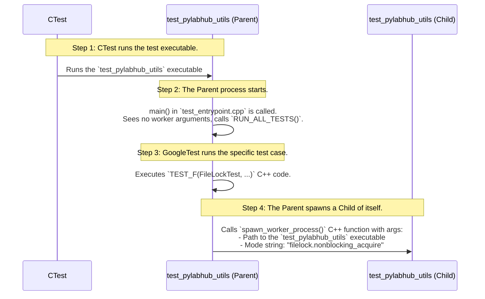

# C++ Test Suite Architecture

This document outlines the architecture of the pyLabHub C++ test suite. Its goal is to ensure that tests are organized, scalable, and easy for developers to write and run.

## 1. High-Level Philosophy

Our test suite is built on three core principles:

1.  **Clarity**: Test code should be as readable and well-organized as the production code it validates.
2.  **Dependency Isolation**: Tests for the `pylabhub-basic` static library should not depend on the `pylabhub-utils` shared library.
3.  **Speed**: A fast "inner loop" is critical. Developers must be able to run only the tests relevant to their changes without waiting for a full suite build.

To achieve this, we use a **multiple-executable model**, where each major library in the project has its own dedicated test executable, defined as a CMake target.

## 2. Test Suite Structure

The test suite is composed of several distinct **CMake targets** located in the `tests/` directory:

*   `pylabhub-test-harness`: A **static library target** that contains shared C++ code for all test executables.
*   `test_pylabhub_corelib`: An **executable target** containing all unit tests for the `pylabhub-basic` static library.
*   `test_pylabhub_utils`: An **executable target** containing all tests for the `pylabhub-utils` shared library.

This structure allows a developer working on the `pylabhub-basic` library to compile and run only the `test_pylabhub_corelib` target, resulting in a much faster development cycle.

## 3. A Deep Dive: How Multi-Process Testing Works

The multi-process testing logic is a powerful pattern used for testing components like `pylabhub::utils::FileLock`. The key idea is that a single test executable (e.g., the `test_pylabhub_utils` target) can act as a **"Parent"** (the test runner) or as a **"Worker"** (a child process).

### Step-by-Step Execution Flow

This sequence diagram illustrates the flow for a multi-process `FileLock` test using the `test_pylabhub_utils` executable.



## 4. How to Add a New Test

1.  **Identify the Correct Directory**:
    *   For a C++ component in `pylabhub-basic`: `tests/test_pylabhub_corelib/`.
    *   For a C++ component in `pylabhub-utils`: `tests/test_pylabhub_utils/`.
2.  **Create Your Test File**: `test_my_class.cpp`.
3.  **Update `CMakeLists.txt`**: Add your `.cpp` file to the correct `add_executable()` command in `tests/test_pylabhub_corelib/CMakeLists.txt` or `tests/test_pylabhub_utils/CMakeLists.txt`.
    ```cmake
    # In tests/test_pylabhub_corelib/CMakeLists.txt:
    add_executable(test_pylabhub_corelib
      # ... other files
      test_my_class.cpp  # <-- Add here
    )
    ```
4.  **Write the C++ Test Code**: Use `TEST(MyTestSuite, MyTestName)` in your file.
5.  **Reconfigure and Build**.

## 5. How to Run Tests

All tests are managed by CTest. The `gtest_discover_tests` function registers each test with CTest using the format `TestSuiteName.TestName`.

From your build directory:
*   **Run all tests**:
    ```bash
    ctest
    ```
*   **Run a specific test executable's tests**:
    Because test names are unique across the project, you typically filter by the test suite name. To run all tests from only the `test_pylabhub_utils` executable, you can list its tests and filter:
    ```bash
    ctest -N -R "^test_pylabhub_utils"  # Note: This just lists the tests, doesn't run them.
    # CTest does not have a direct way to run an executable by name, so filtering by test suite is preferred.
    ```
*   **Run all tests in the `AtomicGuardTest` suite**:
    ```bash
    ctest -R "^AtomicGuardTest"
    ```
*   **Run a single, specific test case**:
    ```bash
    ctest -R "^AtomicGuardTest.BasicAcquireRelease$"
    ```

You can also run the executables directly with Google Test's `--gtest_filter`:
```bash
# In ./build/stage/tests/
./test_pylabhub_corelib --gtest_filter=AtomicGuardTest.*
```

## 6. Platform-Specific Behavior and Gotchas

### Deadlock on Windows When Capturing `stderr`

When writing tests, a common pattern is to capture standard output or standard error to verify what a function writes to the console. The `StringCapture` helper in `pylabhub-test-harness` is designed for this purpose.

However, there is a significant gotcha on **Windows** when testing functions that use the `DbgHelp` library, such as `pylabhub::debug::print_stack_trace`.

**The Problem:**

- The `StringCapture` helper works by redirecting `stderr` to a **pipe** (a fixed-size in-memory buffer).
- The `print_stack_trace` function, on its first use, initializes the `DbgHelp` library (`DbgHelp.dll`).
- This initialization process (`SymInitialize`) is complex and may write its own status messages or errors to `stderr`.
- If the `DbgHelp` output is large enough to fill the pipe's buffer, the call to `print_stack_trace` will **block** (freeze), waiting for the pipe to be read.
- However, the test framework is also blocked, waiting for `print_stack_trace` to finish before it can read the pipe. This creates a **deadlock**.

**Solution:**

For any test that validates the output of `pylabhub::debug::print_stack_trace`, do **not** use `StringCapture`. Instead, redirect `stderr` to a temporary file for the duration of the test. This avoids the blocking behavior of pipes and makes the test robust.

See `PlatformTest.PrintStackTrace` in `tests/test_pylabhub_corelib/test_platform.cpp` for a canonical example of this file-based redirection.
