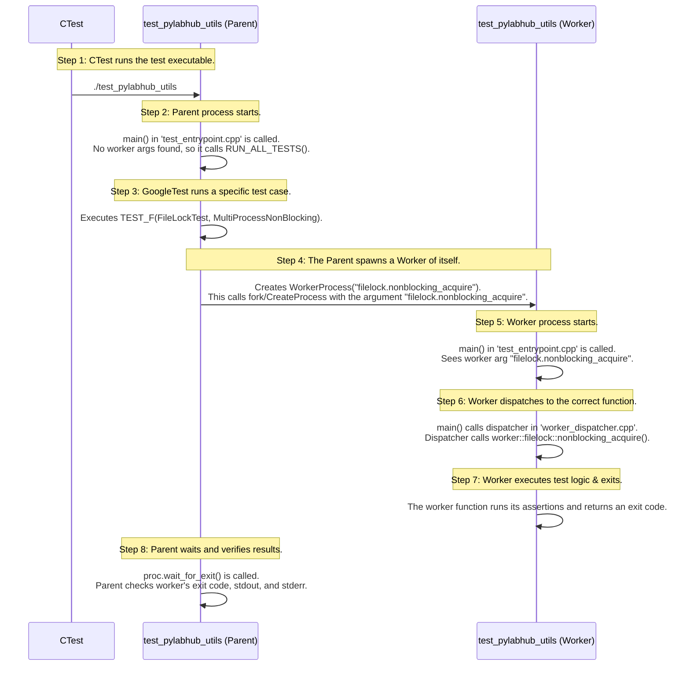

# C++ Test Suite Architecture

This document outlines the architecture of the pyLabHub C++ test suite. Its goal is to ensure that tests are organized, scalable, and easy for developers to write and run.

## Table of Contents
1. [High-Level Philosophy](#high-level-philosophy)
2. [Test Suite Structure](#test-suite-structure)
3. [Quick Start: Running Tests](#quick-start-running-tests)
4. [How to Add a New Test](#how-to-add-a-new-test)
5. [Multi-Process Testing Deep Dive](#a-deep-dive-how-multi-process-testing-works)
6. [Test Staging and Dependencies](#test-staging-and-dependencies)
7. [Platform-Specific Behavior](#platform-specific-behavior-and-gotchas)

## 1. High-Level Philosophy

Our test suite is built on three core principles:

1.  **Clarity**: Test code should be as readable and well-organized as the production code it validates.
2.  **Dependency Isolation**: Tests for `pylabhub-corelib` should not depend on `pylabhub-utils` when testing basic utilities (like `atomic_guard`, `recursion_guard`).
3.  **Speed**: A fast "inner loop" is critical. Developers must be able to run only the tests relevant to their changes without waiting for a full suite build.

To achieve this, we use a **multiple-executable model**, where different test categories have their own dedicated test executables.

## 2. Test Suite Structure

The test suite is composed of several distinct **CMake targets** located in the `tests/` directory:

| Target | Type | Contents | Purpose |
|--------|------|----------|---------|
| `pylabhub-test-framework` | Static Library | Shared test infrastructure (`test_entrypoint.cpp`, `test_process_utils.cpp`, `shared_test_helpers.cpp`) | Provides common functionality for all test executables |
| `test_pylabhub_corelib` | Executable | Tests for basic utilities (`test_atomicguard.cpp`, `test_recursionguard.cpp`, `test_scopeguard.cpp`, `test_platform.cpp`) | Tests that don't require `pylabhub-utils` |
| `test_pylabhub_utils` | Executable | Tests for main utilities (`test_lifecycle.cpp`, `test_filelock.cpp`, `test_logger.cpp`, `test_messagehub.cpp`, `test_datablock.cpp`) | Tests for the full utility library; also acts as worker process for multi-process tests |
| `test_misc` | Executable(s) | Miscellaneous test programs (`test_debug_output.cpp`) | Small standalone programs for debugging or isolated testing |

This structure allows a developer working on `atomic_guard` to compile and run only `test_pylabhub_corelib`, resulting in a much faster development cycle (~2-3 seconds vs. ~30 seconds for full suite).

## 3. Quick Start: Running Tests

### Build and Stage Tests

```bash
# From project root
cd cpp/build

# Build and stage all tests (requires staged dependencies)
cmake --build . --target stage_tests

# Or if PYLABHUB_STAGE_ON_BUILD=ON (default), just build:
cmake --build .
```

Tests are staged to `build/stage-debug/tests/` along with all required DLLs and shared libraries.

### Run All Tests

```bash
# From build directory
ctest

# With output
ctest --output-on-failure

# Verbose
ctest -V
```

### Run Specific Test Suites

```bash
# Run all tests in AtomicGuardTest suite
ctest -R "^AtomicGuardTest"

# Run a single test case
ctest -R "^AtomicGuardTest.BasicAcquireRelease$"

# Run all Lifecycle tests
ctest -R "^LifecycleTest"

# Run all multi-process tests
ctest -R "MultiProcess"
```

### Run Tests from Staged Directory

```bash
# Navigate to staged test directory
cd build/stage-debug/tests

# Run specific test executable directly
./test_pylabhub_corelib

# Use GoogleTest filters
./test_pylabhub_utils --gtest_filter=FileLockTest.*

# List available tests
./test_pylabhub_utils --gtest_list_tests

# Run with repeat for stress testing
./test_pylabhub_corelib --gtest_repeat=100 --gtest_filter=AtomicGuardTest.*
```

### Practical Testing Workflows

**Workflow 1: Test-Driven Development**
```bash
# Edit code in src/utils/file_lock.cpp
# Edit test in tests/test_pylabhub_utils/test_filelock.cpp

# Quick rebuild and test
cmake --build build --target test_pylabhub_utils
cd build/stage-debug/tests
./test_pylabhub_utils --gtest_filter=FileLockTest.BasicLocking
```

**Workflow 2: Debugging Test Failures**
```bash
# Run single test with debugger
cd build/stage-debug/tests
gdb ./test_pylabhub_utils
(gdb) run --gtest_filter=FileLockTest.FailingTest
```

**Workflow 3: Continuous Integration**
```bash
# Build everything
cmake --build build

# Run all tests with XML output
cd build
ctest --output-junit results.xml --output-on-failure
```

## 9. A Deep Dive: How Multi-Process Testing Works

The multi-process testing logic is a powerful pattern used for testing components like `pylabhub::utils::FileLock` and `JsonConfig`. The key idea is that a single test executable (e.g., `test_pylabhub_utils`) can act as both a **"Parent"** (the test runner) and a **"Worker"** (a child process spawned to perform a specific task).

**FileLock tests and `.lock` files:** Tests use `clear_lock_file()` to remove lock files *before* each test run, ensuring isolation. In production, `.lock` files are harmless if left on disk; the library does not remove them on shutdown. If cleanup is desired (e.g., after a crash), use an external script when nothing is running.

This is managed by three key components in the `pylabhub-test-framework`:
1.  **`test_entrypoint.cpp`**: Provides the `main()` function for test executables. It checks command-line arguments. If a "worker mode" argument is present, it calls a registered dispatcher. Otherwise, it runs GoogleTest (`RUN_ALL_TESTS()`).
2.  **`test_process_utils.h`**: Provides the `WorkerProcess` RAII class, which is the primary tool for spawning and managing child processes. It handles argument passing, redirects the worker's stdout/stderr to files for inspection, and ensures the worker is terminated.
3.  **`worker_dispatcher.cpp`** (inside `test_pylabhub_utils`): This file maps worker mode strings (e.g., `"filelock.nonblocking_acquire"`) to specific C++ worker functions. This is the router that tells the child process what code to execute.

### Step-by-Step Execution Flow

This sequence diagram illustrates the flow for a multi-process `FileLock` test.



## 4. How to Add a New Test

### Example 1: Simple Unit Test

Let's add tests for a new `StringUtils` class in `pylabhub-utils`.

1.  **Create the test file:** `tests/test_pylabhub_utils/test_stringutils.cpp`
    ```cpp
    #include <gtest/gtest.h>
    #include "utils/StringUtils.hpp"  // Your new header
    
    using namespace pylabhub::utils;
    
    // Test suite name should match the class/component being tested
    TEST(StringUtilsTest, TrimWhitespace) {
        EXPECT_EQ(StringUtils::trim("  hello  "), "hello");
        EXPECT_EQ(StringUtils::trim(""), "");
        EXPECT_EQ(StringUtils::trim("   "), "");
    }
    
    TEST(StringUtilsTest, SplitString) {
        auto result = StringUtils::split("a,b,c", ',');
        ASSERT_EQ(result.size(), 3);
        EXPECT_EQ(result[0], "a");
        EXPECT_EQ(result[1], "b");
        EXPECT_EQ(result[2], "c");
    }
    
    TEST(StringUtilsTest, EdgeCases) {
        EXPECT_THROW(StringUtils::parse_int("not-a-number"), std::invalid_argument);
        EXPECT_NO_THROW(StringUtils::parse_int("42"));
    }
    ```

2.  **Update `tests/test_pylabhub_utils/CMakeLists.txt`:**
    ```cmake
    add_executable(test_pylabhub_utils
      # ... existing test files
      test_stringutils.cpp  # <-- Add your new test file here
    )
    ```

3.  **Build and run:**
    ```bash
    cmake --build build --target test_pylabhub_utils
    ctest -R "^StringUtilsTest"
    ```

### Example 2: Test with Fixtures (Setup/Teardown)

For tests that need common setup:

```cpp
// tests/test_pylabhub_utils/test_database.cpp
#include <gtest/gtest.h>
#include "utils/Database.hpp"

using namespace pylabhub::utils;

// Fixture provides setup/teardown for each test
class DatabaseTest : public ::testing::Test {
protected:
    void SetUp() override {
        // Runs before each TEST_F
        temp_db_path = "/tmp/test_db.sqlite";
        db = std::make_unique<Database>(temp_db_path);
        db->init();
    }
    
    void TearDown() override {
        // Runs after each TEST_F
        db.reset();  // Close database
        std::remove(temp_db_path.c_str());  // Clean up
    }
    
    std::string temp_db_path;
    std::unique_ptr<Database> db;
};

// Use TEST_F (not TEST) to access fixture members
TEST_F(DatabaseTest, InitialState) {
    EXPECT_TRUE(db->is_open());
    EXPECT_EQ(db->count_rows("users"), 0);
}

TEST_F(DatabaseTest, InsertAndQuery) {
    db->insert_user("Alice", 30);
    EXPECT_EQ(db->count_rows("users"), 1);
    
    auto user = db->get_user("Alice");
    EXPECT_EQ(user.age, 30);
}
```

### Example 3: Multi-Process Test

For testing components that require multiple processes (like file locks):

```cpp
// tests/test_pylabhub_utils/test_mylock.cpp
#include <gtest/gtest.h>
#include "test_framework/test_process_utils.h"
#include "utils/MyLock.hpp"

using namespace pylabhub::utils;
using namespace pylabhub::test;

TEST(MyLockTest, MultiProcessExclusion) {
    const std::string lock_path = "/tmp/test.lock";
    
    // Parent acquires lock
    MyLock parent_lock(lock_path);
    ASSERT_TRUE(parent_lock.try_acquire());
    
    // Spawn worker process that tries to acquire same lock
    WorkerProcess proc("mylock.try_acquire", {lock_path});
    proc.spawn();
    
    // Wait for worker to finish
    int exit_code = proc.wait_for_exit(std::chrono::seconds(5));
    
    // Worker should fail to acquire (returns exit code 1)
    EXPECT_EQ(exit_code, 1);
    
    // Release parent lock
    parent_lock.release();
}
```

Then create the worker function in `tests/test_pylabhub_utils/mylock_workers.cpp`:
```cpp
#include "mylock_workers.h"
#include "utils/MyLock.hpp"

namespace pylabhub::test::worker::mylock {

int try_acquire(const std::vector<std::string>& args) {
    if (args.empty()) return 2;  // Error: no lock path
    
    MyLock lock(args[0]);
    if (lock.try_acquire()) {
        lock.release();
        return 0;  // Success
    }
    return 1;  // Failed to acquire
}

}  // namespace
```

And register it in `worker_dispatcher.cpp`:
```cpp
#include "mylock_workers.h"

// In dispatch_worker function:
if (worker_name == "mylock.try_acquire") {
    return worker::mylock::try_acquire(args);
}
```

### Key Testing Patterns

1. **Use descriptive test names:** `TEST(ComponentTest, WhatIsBeingTested)`
2. **One assertion per test (when practical):** Makes failures clear
3. **Use ASSERT_* for prerequisites:** Test stops if assertion fails
4. **Use EXPECT_* for checks:** Test continues even if expectation fails
5. **Test edge cases:** Empty inputs, null pointers, boundary values
6. **Clean up resources:** Use fixtures for proper setup/teardown

## 5. Test Staging and Dependencies

Understanding how test executables are staged and how they find their dependencies is crucial for debugging build issues.

### The Staging Process

When you build tests, the CMake system performs these steps:

1. **Build third-party dependencies** (`stage_third_party_deps`)
   - Builds `libsodium`, `luajit`, `fmt`, `libzmq`, etc.
   - Stages libraries to `build/stage-debug/lib/`
   - Stages headers to `build/stage-debug/include/`

2. **Build internal libraries** (`stage_core_artifacts`)
   - Builds `pylabhub-utils` shared library
   - Stages to `build/stage-debug/lib/` (POSIX) or `build/stage-debug/bin/` (Windows)

3. **Build test framework** (`pylabhub-test-framework`)
   - Static library linked by all test executables

4. **Build test executables** (`stage_tests`)
   - Executables output directly to `build/stage-debug/tests/`
   - On Windows: DLLs are automatically copied to `tests/` directory

### Dependency Resolution

**On Linux/macOS:**
- Test executables use `RPATH` set to `$ORIGIN/../lib`
- When `./test_pylabhub_utils` runs, it looks for `.so` files in `../lib/`
- Example: `tests/test_pylabhub_utils` finds `lib/libpylabhub-utils.so`

**On Windows:**
- Test executables look for `.dll` files in the same directory
- The `stage_tests` target ensures DLLs are copied to `tests/`
- Example: `tests/test_pylabhub_utils.exe` finds `tests/pylabhub-utils.dll`

### Viewing Dependencies

**Linux:**
```bash
cd build/stage-debug/tests
ldd ./test_pylabhub_utils
# Shows:
#   libpylabhub-utils.so => ../lib/libpylabhub-utils.so
#   libfmt.so.10 => ../lib/libfmt.so.10
```

**macOS:**
```bash
cd build/stage-debug/tests
otool -L ./test_pylabhub_utils
# Shows:
#   @rpath/libpylabhub-utils.dylib
#   @rpath/libfmt.10.dylib
```

**Windows:**
```powershell
cd build\stage-debug\tests
dumpbin /DEPENDENTS test_pylabhub_utils.exe
# Shows:
#   pylabhub-utils.dll
#   fmt.dll
```

### Troubleshooting Staging Issues

**Issue: Test fails with "shared library not found"**

Check staging:
```bash
# Are libraries staged?
ls -la build/stage-debug/lib/*.so
ls -la build/stage-debug/lib/*.dylib
ls -la build/stage-debug/tests/*.dll  # Windows

# Does test have correct RPATH? (Linux)
readelf -d build/stage-debug/tests/test_pylabhub_utils | grep RPATH

# Check what libraries test is looking for
ldd build/stage-debug/tests/test_pylabhub_utils  # Linux
otool -L build/stage-debug/tests/test_pylabhub_utils  # macOS
```

**Issue: Test executable not staged**

Check registration:
```bash
# Did CMake find the test?
cd build
cmake .. | grep "test_pylabhub_utils"

# Is it in the staging target dependencies?
cmake --build . --target help | grep stage
```

## 7. Advanced CTest Usage

All tests are managed by CTest. The `gtest_discover_tests` function registers each test with CTest using the format `TestSuiteName.TestName`.

### Useful CTest Commands

```bash
# List all discovered tests (doesn't run them)
ctest -N

# List tests matching pattern
ctest -N -R "^LifecycleTest"

# Run tests with verbose output
ctest -V

# Run tests showing only failures
ctest --output-on-failure

# Run tests in parallel (4 jobs)
ctest -j4

# Run specific test by exact name
ctest -R "^LifecycleTest.InitializeAndFinalize$"

# Exclude tests by pattern
ctest -E "MultiProcess"

# Run tests and generate XML report
ctest --output-junit results.xml

# Run tests with timeout
ctest --timeout 60

# Rerun only failed tests
ctest --rerun-failed

# Run tests in random order (good for finding order dependencies)
ctest --schedule-random
```

### GoogleTest Direct Execution

For more control, run test executables directly:

```bash
cd build/stage-debug/tests

# Run all tests in executable
./test_pylabhub_utils

# Filter by test suite
./test_pylabhub_utils --gtest_filter=FileLockTest.*

# Filter by specific test
./test_pylabhub_utils --gtest_filter=FileLockTest.BasicLocking

# Exclude tests
./test_pylabhub_utils --gtest_filter=-*MultiProcess*

# List available tests
./test_pylabhub_utils --gtest_list_tests

# Run with repeat (stress testing)
./test_pylabhub_utils --gtest_repeat=100

# Break on first failure
./test_pylabhub_utils --gtest_break_on_failure

# Shuffle test order
./test_pylabhub_utils --gtest_shuffle

# Run with specific random seed (for reproducibility)
./test_pylabhub_utils --gtest_shuffle --gtest_random_seed=12345
```

### Integration with IDEs

**Visual Studio Code:**
Configure in `.vscode/settings.json`:
```json
{
    "cmake.ctestArgs": [
        "--output-on-failure"
    ],
    "testMate.cpp.test.executables": "build/stage-*/tests/*{test,Test,TEST}*"
}
```

**CLion:**
1. Go to Run → Edit Configurations
2. Add "Google Test" configuration
3. Set Target: `test_pylabhub_utils`
4. Set Test filter: `FileLockTest.*`

## 8. Platform-Specific Behavior and Gotchas

### Deadlock on Windows When Capturing `stderr`

When writing tests, a common pattern is to capture standard output or standard error to verify what a function writes to the console. The `StringCapture` helper in `pylabhub-test-framework` is designed for this purpose.

However, there is a significant gotcha on **Windows** when testing functions that use the `DbgHelp` library, such as `pylabhub::debug::print_stack_trace`.

**The Problem:**

- The `StringCapture` helper works by redirecting `stderr` to a **pipe** (a fixed-size in-memory buffer).
- The `print_stack_trace` function, on its first use, initializes the `DbgHelp` library (`DbgHelp.dll`).
- This initialization process (`SymInitialize`) is complex and may write its own status messages or errors to `stderr`.
- If the `DbgHelp` output is large enough to fill the pipe's buffer, the call to `print_stack_trace` will **block** (freeze), waiting for the pipe to be read.
- However, the test framework is also blocked, waiting for `print_stack_trace` to finish before it can read the pipe. This creates a **deadlock**.

**Solution:**

For any test that validates the output of `pylabhub::debug::print_stack_trace`, do **not** use `StringCapture`. Instead, redirect `stderr` to a temporary file for the duration of the test. This avoids the blocking behavior of pipes and makes the test robust.

See `PlatformTest.PrintStackTrace` in `tests/test_pylabhub_corelib/test_platform.cpp` for a canonical example of this file-based redirection.

---

## Quick Reference

### Common Commands

| Task | Command |
|------|---------|
| Build tests | `cmake --build build --target stage_tests` |
| Run all tests | `ctest` (from `build/` directory) |
| Run tests with output | `ctest --output-on-failure` |
| Run specific suite | `ctest -R "^MyTestSuite"` |
| Run single test | `ctest -R "^MyTestSuite.SpecificTest$"` |
| Run test executable directly | `./build/stage-debug/tests/test_pylabhub_utils` |
| Filter tests in executable | `./test_pylabhub_utils --gtest_filter=MyTest.*` |
| List available tests | `./test_pylabhub_utils --gtest_list_tests` |
| Debug a test | `gdb ./test_pylabhub_utils` |

### Test File Locations

| Component | Test File Location | Test Executable |
|-----------|-------------------|-----------------|
| `atomic_guard`, `recursion_guard`, `scope_guard` | `tests/test_pylabhub_corelib/` | `test_pylabhub_corelib` |
| Platform utilities (debug, platform detection) | `tests/test_pylabhub_corelib/` | `test_pylabhub_corelib` |
| `Lifecycle`, `FileLock`, `Logger`, `MessageHub` | `tests/test_pylabhub_utils/` | `test_pylabhub_utils` |
| `JsonConfig`, `DataBlock` | `tests/test_pylabhub_utils/` | `test_pylabhub_utils` |
| Debugging utilities | `tests/test_misc/` | Individual executables |

### GoogleTest Assertions

| Assertion | Behavior | Use When |
|-----------|----------|----------|
| `ASSERT_*` | Stops test on failure | Checking prerequisites |
| `EXPECT_*` | Continues test on failure | Testing outcomes |
| `ASSERT_TRUE(cond)` | Fatal if false | Must be true to continue |
| `EXPECT_EQ(a, b)` | Non-fatal equality | Comparing values |
| `EXPECT_THROW(stmt, exception)` | Expects exception | Testing error handling |
| `EXPECT_NO_THROW(stmt)` | Expects no exception | Testing success path |

### Multi-Process Testing Pattern

```cpp
// Spawn worker process
WorkerProcess proc("worker.function_name", {"arg1", "arg2"});
proc.spawn();

// Wait and check result
int exit_code = proc.wait_for_exit(std::chrono::seconds(5));
EXPECT_EQ(exit_code, 0);

// Check worker output
std::string stdout_content = proc.read_stdout();
EXPECT_THAT(stdout_content, ::testing::HasSubstr("expected output"));
```

### Staging Directory Structure

```
build/stage-debug/
├── bin/                    # Executables and DLLs (Windows)
├── lib/                    # Shared libraries (POSIX)
├── include/                # Headers
├── tests/                  # Test executables + DLLs (Windows)
│   ├── test_pylabhub_corelib
│   ├── test_pylabhub_utils
│   └── *.dll (Windows only)
└── .stage_complete         # Marker file
```
