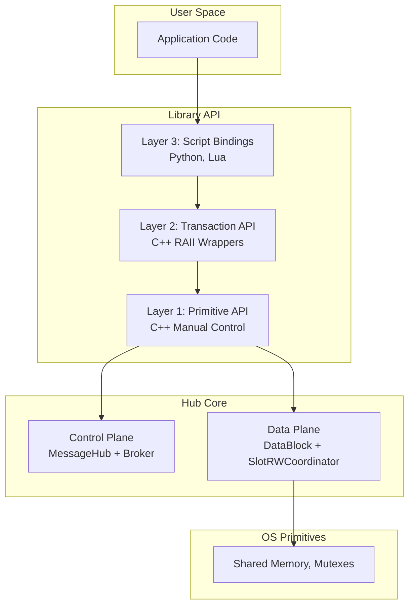
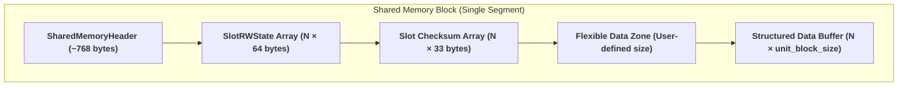
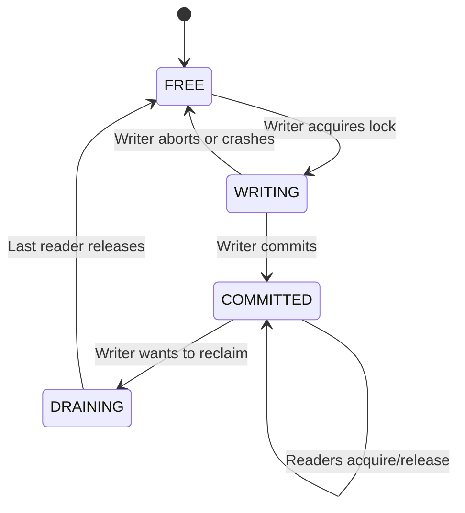

# HEP-core-0002: Data Exchange Hub — Final & Complete Design Specification

| Property       | Value                                      |
| -------------- | ------------------------------------------ |
| **HEP**        | `core-0002`                                |
| **Title**      | A Framework for Inter-Process Data Exchange|
| **Author**     | Quan Qing, AI assistant                    |
| **Status**     | **Final**                                  |
| **Category**   | Core                                       |
| **Created**    | 2026-01-07                                 |
| **Updated**    | 2026-02-08                                 |
| **C++-Standard** | C++20                                    |

---
## Table of Contents
1. [Executive Summary](#1-executive-summary)
2. [Design Philosophy & Principles](#2-design-philosophy--principles)
3. [Architecture Deep Dive](#3-architecture-deep-dive)
4. [Memory Model and Layout](#4-memory-model-and-layout)
5. [Synchronization Model: The SlotRWCoordinator](#5-synchronization-model-the-slotrwcoordinator)
6. [Control Plane: Broker and Heartbeat](#6-control-plane-broker-and-heartbeat)
7. [API Design (Three Tiers)](#7-api-design-three-tiers)
8. [Data Integrity and Recovery](#8-data-integrity-and-recovery)
9. [Observability and Monitoring](#9-observability-and-monitoring)
10. [Common Usage Scenarios](#10-common-usage-scenarios)
11. [Appendices](#11-appendices)

---
## 1. Executive Summary

The **Data Exchange Hub** is a high-performance, zero-copy, cross-process communication framework. It enables a single producer process to share bulk data with multiple consumer processes efficiently and safely on a single machine. This document is the final, authoritative design specification, superseding all previous drafts and reviews.

The design is founded on five key pillars, finalized during the critical design review session:
1.  **Dual-Chain Architecture**: The shared memory layout is split into a **Flexible Zone Chain** for user-managed metadata (using atomics) and a **Fixed Buffer Chain** as a ring buffer for system-managed bulk data.
2.  **SlotRWCoordinator**: A TOCTTOU-safe, multi-reader/single-writer synchronization primitive for each slot, exposed through a three-layer API (C, C++ Templates, Observability).
3.  **Minimal Broker**: The control plane is a pure discovery service for registration and discovery only, keeping it out of the critical data path.
4.  **Peer-to-Peer Heartbeat**: A liveness-tracking mechanism in shared memory that eliminates network overhead and broker dependency.
5.  **Integrated Observability**: An embedded 256-byte metrics block for zero-overhead, real-time monitoring.

## 2. Design Philosophy & Principles

| Principle | Description |
|-----------|-------------|
| **Zero-Copy** | Data resides in shared memory; `std::span` provides views without copying. |
| **Defensive** | Crashes are expected; the design includes robust recovery, validation, and diagnostic tools. |
| **ABI-Stable** | A C-style core API and Pimpl idiom in C++ classes hide implementation details, ensuring binary compatibility. |
| **Predictable** | Core operations are O(1); lock-free fast paths are used where possible. |
| **Layered API** | Provides three tiers for explicit control (Primitives), safety (Transactions), and productivity (Scripting). |
| **Broker out of Critical Path** | The broker facilitates discovery but is not involved in data transfer, notifications, or heartbeats, maximizing performance and resilience. |

## 3. Architecture Deep Dive

### 3.1 System Layers
The framework is organized into logical layers, from the high-level user-facing API down to the OS primitives.


### 3.2 Dual-Chain Memory Architecture
The memory layout separates user-controlled metadata from system-managed bulk data.
- **TABLE 1: Flexible Zone Chain**: For fine-grained, user-managed state (e.g., telemetry, status flags). Access is coordinated by user-space atomics or spinlocks.
- **TABLE 2: Fixed Buffer Chain**: A ring buffer for coarse-grained bulk data (e.g., video frames, sensor readings). Access is managed by the system via the `SlotRWCoordinator`.

### 3.3 Component Responsibilities
- **DataBlockProducer**: Creates and owns the shared memory segment. Manages writing to both Flexible and Fixed chains.
- **DataBlockConsumer**: Attaches to an existing shared memory segment. Manages reading from both chains.
- **SlotRWCoordinator**: Manages the lifecycle (FREE, WRITING, COMMITTED, DRAINING) and synchronization of each slot in the Fixed Buffer.
- **MessageHub/Broker**: Facilitates the initial discovery of the `shm_name` and schema details.

## 4. Memory Model and Layout

### 4.1 Memory Map Diagram


### 4.2 C++ Struct Definitions

#### `SharedMemoryHeader`
```cpp
struct alignas(64) SharedMemoryHeader {
    // --- Identity and Configuration (64 bytes) ---
    uint64_t magic_number;
    uint64_t shared_secret;
    uint32_t version;
    uint32_t header_size;
    std::atomic<uint32_t> init_state; // 0=uninit, 1=mutex ready, 2=fully ready
    uint32_t ring_buffer_capacity;
    uint32_t unit_block_size;
    uint32_t flexible_zone_size;
    bool enable_checksum;
    uint8_t _padding1[15];

    // --- Indices (32 bytes) ---
    std::atomic<uint64_t> write_index;
    std::atomic<uint64_t> commit_index;
    std::atomic<uint64_t> read_index; // Policy-dependent
    std::atomic<uint64_t> _reserved_index;

    // --- Schema Information (40 bytes) ---
    std::array<uint8_t, 32> schema_hash;
    uint32_t schema_version;
    uint32_t _padding2;

    // --- Observability & Metrics (256 bytes) ---
    SlotRWCoordinatorMetrics coordinator_metrics;
    DataBlockErrorMetrics error_metrics;
    DataBlockPerformanceMetrics perf_metrics;

    // --- Consumer Heartbeats (512 bytes) ---
    static constexpr size_t MAX_CONSUMERS = 8;
    std::array<ConsumerHeartbeat, MAX_CONSUMERS> consumer_heartbeats;
};
```
(See Appendix for `...Metrics` and `ConsumerHeartbeat` struct definitions).

## 5. Synchronization Model: The SlotRWCoordinator

The `SlotRWCoordinator` is a TOCTTOU-safe, multi-reader, single-writer lock for each slot.

### 5.1 `SlotRWState` Internal Structure
Each slot's synchronization is managed by this 64-byte, cache-aligned structure.
```cpp
// Internal implementation detail
struct SlotRWStateInternal {
    std::atomic<uint64_t> write_lock;       // PID-based lock for the writer
    std::atomic<uint32_t> reader_count;     // Number of active readers
    std::atomic<uint8_t>  slot_state;       // FREE, WRITING, COMMITTED, DRAINING
    std::atomic<uint8_t>  writer_waiting;   // Flag: writer wants to reclaim this slot
    std::atomic<uint64_t> write_generation; // Increments on each write, for optimistic read validation
    uint8_t               padding[46];      // Ensure 64-byte alignment
};
```

### 5.2 Slot State Machine


### 5.3 Three-Layer Abstraction
1.  **Layer 1: C Interface**: An ABI-stable C API (`slot_rw_acquire_write`, etc.) for portability.
2.  **Layer 2: C++ Templates**: Zero-cost C++ wrappers (`with_typed_write<T>`) for RAII-based safety.
3.  **Layer 3: Observability**: Integrated metrics provide runtime insight.

### 5.4 TOCTTOU Race Prevention Mechanism
A critical race condition (Time-Of-Check-To-Time-Of-Use) is prevented with an atomic-increment-and-double-check protocol.

**Reader Acquisition Flow:**
1.  Check `slot_state`. If not `COMMITTED`, abort.
2.  Atomically increment `reader_count`.
3.  Execute a `seq_cst` memory fence to make the increment visible to other cores.
4.  **Re-check** `slot_state`. If it has changed, a race occurred.
5.  **Safe Abort**: Decrement `reader_count`, increment `reader_race_detected` metric, and fail.
6.  If state is still `COMMITTED`, the read is safe.

## 6. Control Plane: Broker and Heartbeat

### 6.1 Minimal Broker Protocol
The broker is a pure discovery service.
- **`REG_REQ`**: Producer registers a channel with `shm_name` and `schema_hash`.
- **`DISC_REQ`**: Consumer requests metadata for a channel.
- **`DEREG_REQ`**: Producer deregisters.

**Example `DISC_ACK` response:**
```json
{
  "status": "OK",
  "shm_name": "datablock_sensor_12345",
  "schema_hash": "a1b2c3d4...",
  "zmq_endpoint": "ipc:///tmp/sensor.ipc"
}
```

### 6.2 Peer-to-Peer Heartbeat
Liveness is tracked in `SharedMemoryHeader.consumer_heartbeats`. Each consumer periodically writes its PID and timestamp to an assigned slot, allowing the producer to detect stale consumers without network communication.

## 7. API Design (Three Tiers)

### 7.1 Layer 1: Primitive API
Provides maximum control with manual resource management (`acquire_write_slot`, `commit`, `release_write_slot`). Best for experts and performance-critical paths.

### 7.2 Layer 2: Transaction API
Provides a safe, RAII-based C++ interface that guarantees resource cleanup.

#### `with_write_transaction` Implementation
```cpp
template<typename Func>
auto with_write_transaction(
    DataBlockProducer& producer, int timeout_ms, Func&& lambda)
{
    SlotWriteHandle slot = producer.acquire_write_slot(timeout_ms);
    if (!slot) { /* handle error */ }
    try {
        // Invoke user logic
        std::invoke(std::forward<Func>(lambda), slot);
        // Commit and release on success
        producer.commit_slot(slot);
        producer.release_write_slot(slot);
    } catch (...) {
        // On exception, slot is NOT committed but IS released
        producer.release_write_slot(slot);
        throw;
    }
}
```

### 7.3 Layer 3: Scripting API
High-level bindings for Python (zero-copy via buffer protocol) and Lua (via FFI).

## 8. Data Integrity and Recovery

### 8.1 Schema Validation
- **BLDS**: A canonical "Basic Layout Description String" is generated for C++ structs.
- **Hashing**: A BLAKE2b hash of the BLDS is stored in the `SharedMemoryHeader`.
- **Validation**: Consumers validate their schema hash against the header on attachment.

### 8.2 Checksum Policy
- **Manual**: User explicitly calls `update_checksum()` / `verify_checksum()`.
- **Enforced**: Checksums are automatically handled on slot release.

### 8.3 Error Recovery API & CLI Tool
A comprehensive API and `datablock-admin` CLI tool are provided for production diagnostics and recovery.

#### C API (ABI-Stable)
```c
typedef struct { /* ... */ } SlotDiagnostic;
typedef enum { RECOVERY_SUCCESS, RECOVERY_UNSAFE, ... } RecoveryResult;
int datablock_diagnose_all_slots(const char* shm_name, SlotDiagnostic* out, ...);
RecoveryResult datablock_force_reset_slot(const char* shm_name, uint32_t idx, bool force);
```

#### CLI Tool: `datablock-admin`
```bash
# Diagnose a stuck datablock and its slots
$ datablock-admin diagnose --shm-name my_data_block

# Safely reset a slot held by a dead process
$ datablock-admin force-reset-slot --shm-name my_data_block --slot 5
```

## 9. Observability and Monitoring

### 9.1 Integrated Metrics Block
The 256-byte block in the header provides zero-overhead, real-time atomic counters for slot coordination, errors, and performance.

### 9.2 Accessing Metrics
Metrics are accessible via:
- **C++**: A `SlotRWMetricsView` helper class.
- **Python**: A `get_metrics()` function.
- **CLI**: The `datablock-inspect` tool.

## 10. Common Usage Scenarios
- **Latest-Value Streaming** (`Single` policy): For sensor monitoring.
- **Frame Pipeline** (`DoubleBuffer` policy): For video processing.
- **Lossless Queue** (`RingBuffer` policy): For data logging with backpressure.

## 11. Appendices

### 11.1 Glossary
- **BLDS**: Basic Layout Description String. A canonical representation of a struct's memory layout for hashing.
- **Dual-Chain**: The memory architecture separating flexible (user-managed) and fixed (system-managed) data areas.
- **SlotRWCoordinator**: The multi-reader/single-writer synchronization primitive for each data slot.
- **TOCTTOU**: Time-Of-Check-To-Time-Of-Use. A class of race condition mitigated by the coordinator.

### 11.2 Design Decisions Log
| Decision ID | Decision | Rationale |
| :--- | :--- | :--- |
| D-01 | Adopt Dual-Chain Architecture | Separates concerns between user-managed metadata and system-managed bulk data. |
| D-02 | Implement Minimal Broker | Keeps the control plane out of the critical data path, improving performance and resilience. |
| D-03 | Use Peer-to-Peer Heartbeat | Avoids network latency and broker dependency for critical liveness checks. |
| D-04 | Create `SlotRWCoordinator` | Provides a correct and efficient multi-reader/single-writer lock, solving TOCTTOU races. |
| D-05 | Add Layer 2 Transaction API | Guarantees resource safety and simplifies C++ application code via RAII. |
| D-06 | Embed Observability Metrics | Provides zero-overhead monitoring capabilities essential for production environments. |
---
*Note: Full struct definitions for metrics are in the implementation files and have been omitted here for brevity but are part of the final design.*