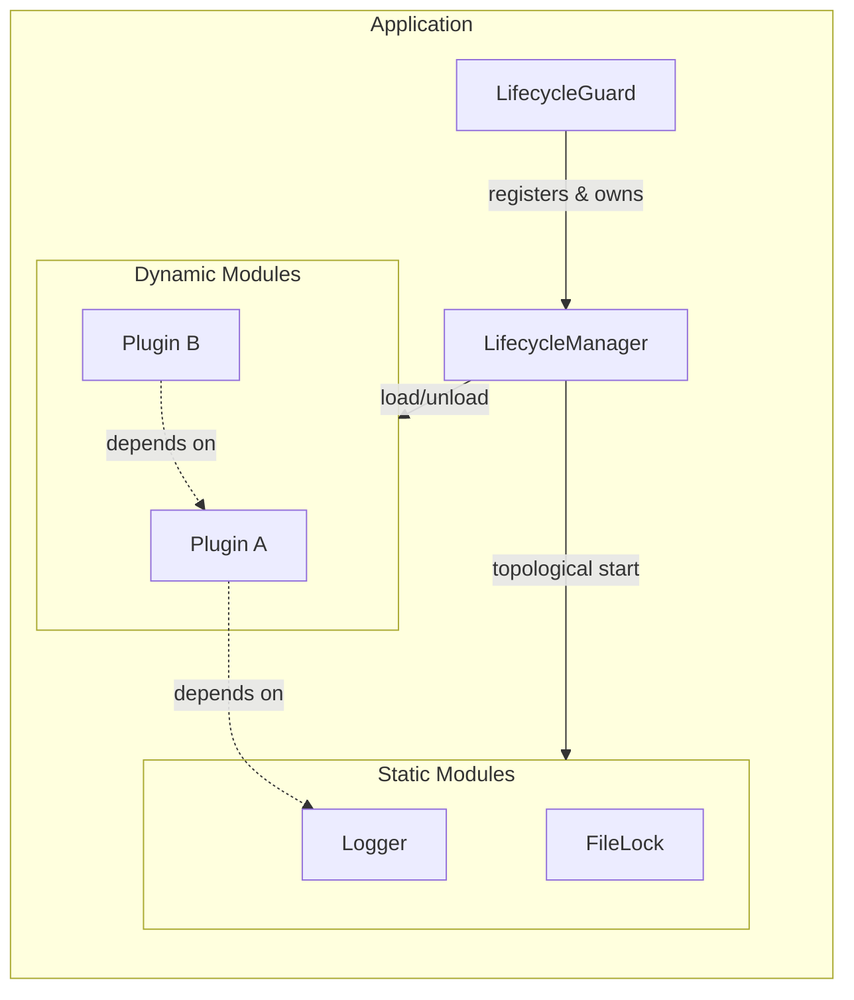
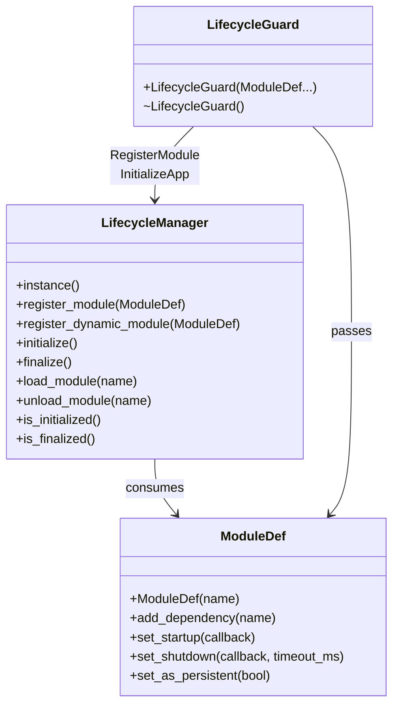
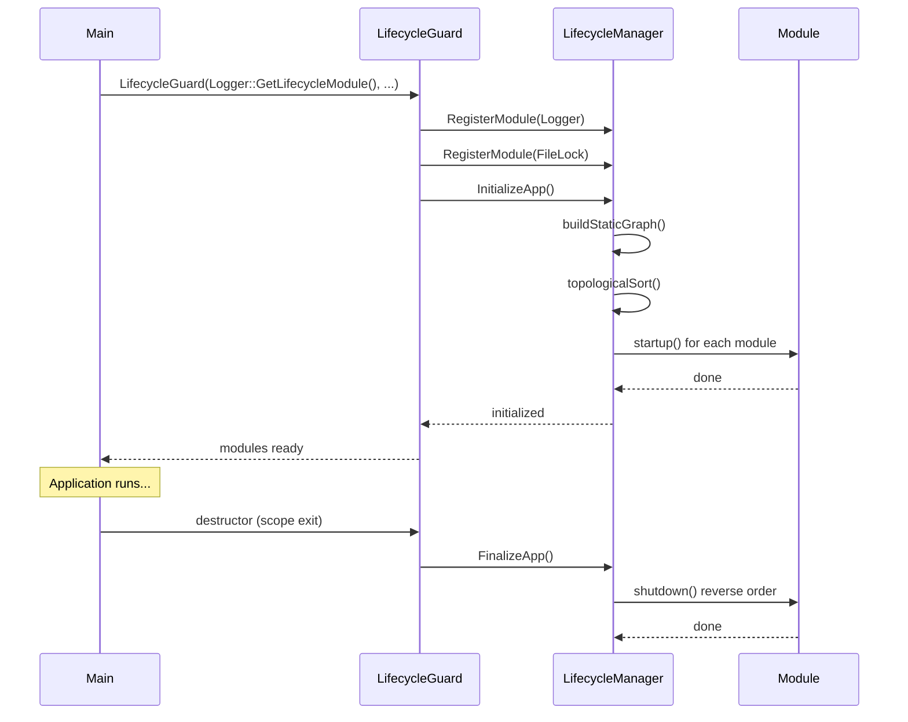
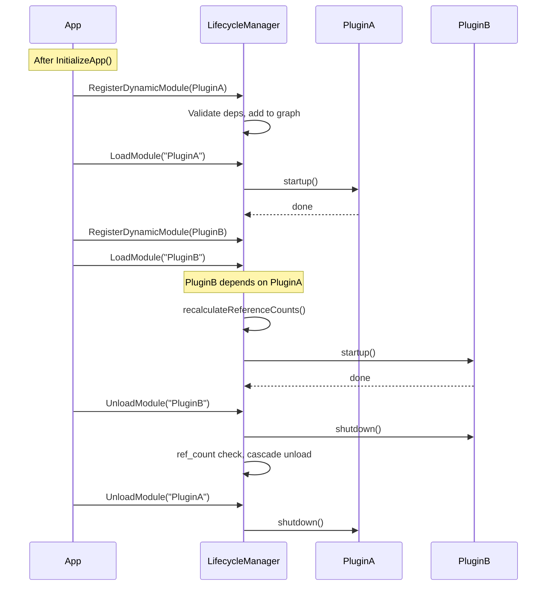

| Property       | Value                                        |
| -------------- | -------------------------------------------- |
| **HEP**        | `core-0001`                                  |
| **Title**      | A Hybrid (Static & Dynamic) Module Lifecycle |
| **Author**     | Quan Qing, AI assistant                      |
| **Status**     | Draft                                        |
| **Category**   | Core                                         |
| **Created**    | 2026-01-05                                   |
| **Updated**    | 2026-02-06                                   |
| **C++-Standard** | C++20                                        |

## Abstract

This Hub Enhancement Proposal (HEP) details the technical design for the `LifecycleManager` that supports two distinct module types: **Static** and **Dynamic**. It provides a robust framework for managing both critical, application-wide services (static modules) and optional, on-demand features or plugins (dynamic modules) within a single, unified dependency management system.

## Motivation

The existing `LifecycleManager` provides an "all-or-none" system for static modules, ideal for the application's core. However, several use cases require runtime flexibility:

| Use Case | Description |
|----------|-------------|
| **Optional, resource-heavy features** | Data analysis toolkit that consumes memory only when activated |
| **Plugin systems** | Third-party extensions or user-enabled features without restart |
| **Mode-specific functionality** | Different tool sets for "Editing" vs "Playback" modes |

A dynamic lifecycle allows modules to be loaded and unloaded at runtime gracefully.

---

## Design Philosophy

### Design Goals

| Goal | Description |
|------|-------------|
| **Unified dependency graph** | Static and dynamic modules in one graph; topological sort determines order |
| **Graceful failure** | Dynamic load failures return `false`, not fatal |
| **Strict ordering** | Dynamic modules registered only *after* static core is initialized |
| **Reference counting** | Dynamic modules unload only when ref_count drops to zero |
| **ABI stability** | Pimpl idiom; public headers remain stable |

### Design Considerations

- **Static modules cannot depend on dynamic modules** — enforced at initialization
- **Dynamic modules can depend on static modules** — static core provides foundation
- **RecursionGuard** prevents re-entrant calls from startup/shutdown callbacks (deadlock prevention)
- **Module registration is NOT thread-safe** — must occur before `initialize()`
- **Dynamic load/unload IS thread-safe** — protected by `m_graph_mutation_mutex`

### Why Pimpl?

The `LifecycleManager` and `ModuleDef` use the Pimpl idiom to hide STL containers (`std::vector`, `std::map`, `std::function`) from the public header. This ensures ABI stability when the shared library evolves or is used with different compiler versions.

---

## Architecture Overview

### Component Diagram



### Class and API Relationships



### Internal Graph Node (Implementation Detail)

```cpp
struct InternalGraphNode {
    std::string name;
    std::function<void()> startup;
    InternalModuleShutdownDef shutdown;
    std::vector<std::string> dependencies;
    std::vector<InternalGraphNode*> dependents;
    std::atomic<ModuleStatus> status;
    bool is_dynamic = false;
    bool is_persistent = false;
    std::atomic<DynamicModuleStatus> dynamic_status;
    std::atomic<int> ref_count;
};

enum class DynamicModuleStatus { UNLOADED, LOADING, LOADED, FAILED };
```

---

## Public API Reference

### LifecycleManager

| Method | Description |
|--------|-------------|
| `instance()` | Singleton accessor |
| `register_module(ModuleDef&&)` | Register static module; must be called *before* `initialize()` |
| `register_dynamic_module(ModuleDef&&)` | Register dynamic module; *after* `initialize()`, *before* `finalize()` |
| `initialize(source_location)` | Start all static modules in dependency order |
| `finalize(source_location)` | Shut down all modules in reverse order |
| `load_module(name, loc)` | Load dynamic module and dependencies |
| `unload_module(name, loc)` | Unload dynamic module if ref_count is zero |
| `is_initialized()` | Check if initialization completed |
| `is_finalized()` | Check if finalization completed |

### ModuleDef

| Method | Description |
|--------|-------------|
| `ModuleDef(name)` | Construct with unique name |
| `add_dependency(name)` | Add dependency by name |
| `set_startup(callback)` | Set startup callback (no arg or with data) |
| `set_shutdown(callback, timeout_ms)` | Set shutdown callback with timeout |
| `set_as_persistent(bool)` | Mark dynamic module as persistent (cannot unload) |

### Convenience Functions

| Function | Wrapper For |
|----------|-------------|
| `RegisterModule(ModuleDef&&)` | `LifecycleManager::instance().register_module()` |
| `RegisterDynamicModule(ModuleDef&&)` | `LifecycleManager::instance().register_dynamic_module()` |
| `InitializeApp(loc)` | `LifecycleManager::instance().initialize()` |
| `FinalizeApp(loc)` | `LifecycleManager::instance().finalize()` |
| `LoadModule(name, loc)` | `LifecycleManager::instance().load_module()` |
| `UnloadModule(name, loc)` | `LifecycleManager::instance().unload_module()` |

---

## Sequence of Operations

### Static Module Lifecycle



### Dynamic Module Load/Unload



---

## Example: Static Modules

```cpp
#include "utils/lifecycle.hpp"
#include "utils/logger.hpp"
#include "utils/file_lock.hpp"

int main() {
    pylabhub::utils::LifecycleGuard app_lifecycle(
        pylabhub::utils::Logger::GetLifecycleModule(),
        pylabhub::utils::FileLock::GetLifecycleModule()
    );

    LOGGER_INFO("Application started.");
    // ... application logic ...
    return 0;  // FinalizeApp() called automatically
}
```

## Example: Dynamic Module

```cpp
namespace MyPlugin {
    void startup(const char*) { LOGGER_INFO("MyPlugin started"); }
    void shutdown(const char*) { LOGGER_INFO("MyPlugin shut down"); }

    pylabhub::utils::ModuleDef GetLifecycleModule() {
        pylabhub::utils::ModuleDef def("MyPlugin");
        def.add_dependency("Logger");
        def.set_startup(startup);
        def.set_shutdown(shutdown, 1000);
        return def;
    }
}

int main() {
    pylabhub::utils::LifecycleGuard app_lifecycle(
        pylabhub::utils::Logger::GetLifecycleModule()
    );

    if (pylabhub::utils::RegisterDynamicModule(MyPlugin::GetLifecycleModule())) {
        if (pylabhub::utils::LoadModule("MyPlugin")) {
            // Use plugin...
            pylabhub::utils::UnloadModule("MyPlugin");
        }
    }
    return 0;
}
```

---

## Risk Analysis and Mitigations

| Risk | Mitigation |
|------|------------|
| Client forgets `unload_module()` | Resource leak for session; `finalize()` provides last-resort cleanup |
| Dependency loop between dynamic modules | `load_module` checks `LOADING` status to detect cycles |
| Callback calls `load_module`/`unload_module` | `RecursionGuard` detects and blocks (prevents deadlock) |
| Concurrent graph mutations | `m_graph_mutation_mutex` serializes all dynamic operations |

---

## Copyright

This document is placed in the public domain or under the CC0-1.0-Universal license, whichever is more permissive.
