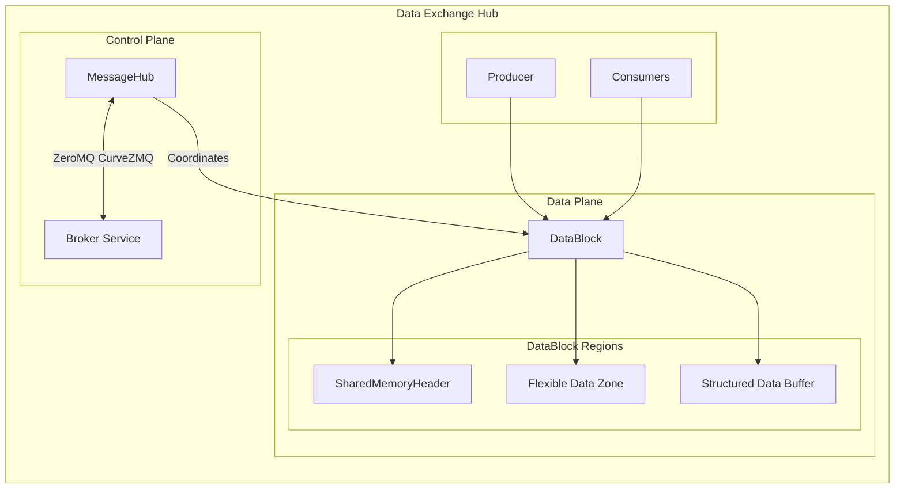
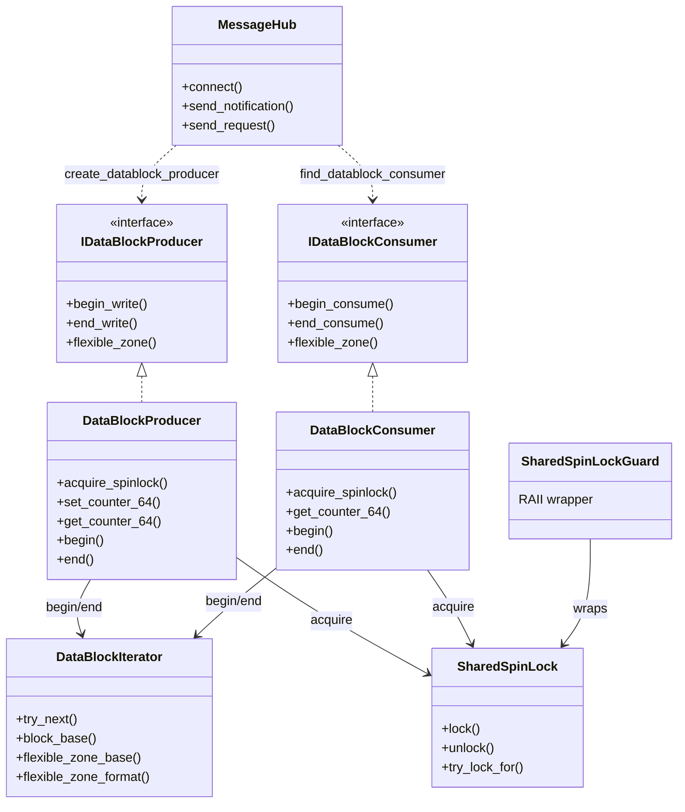
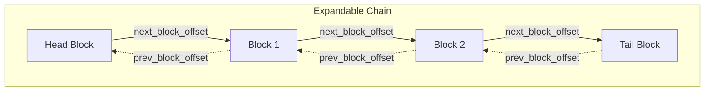
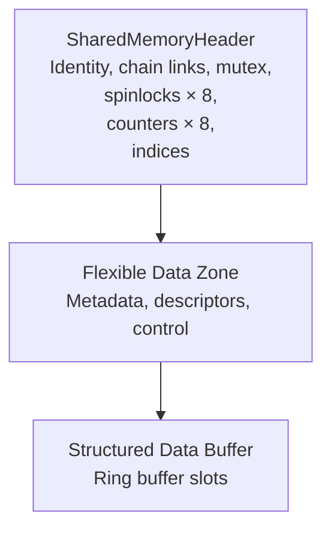
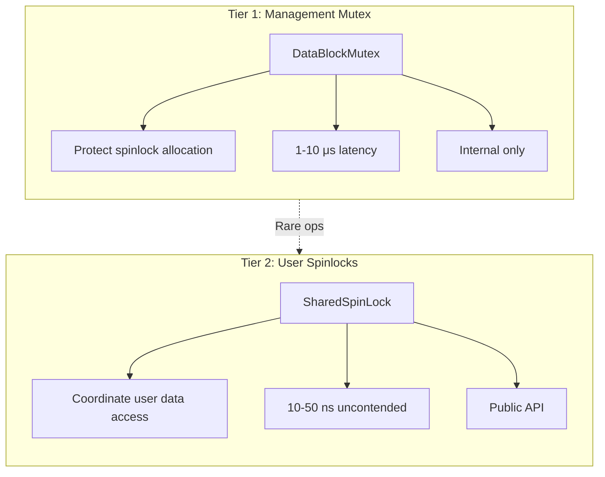
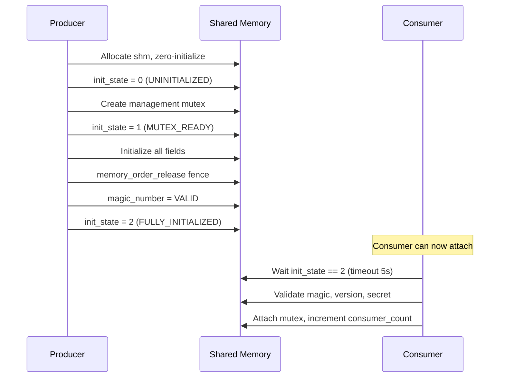
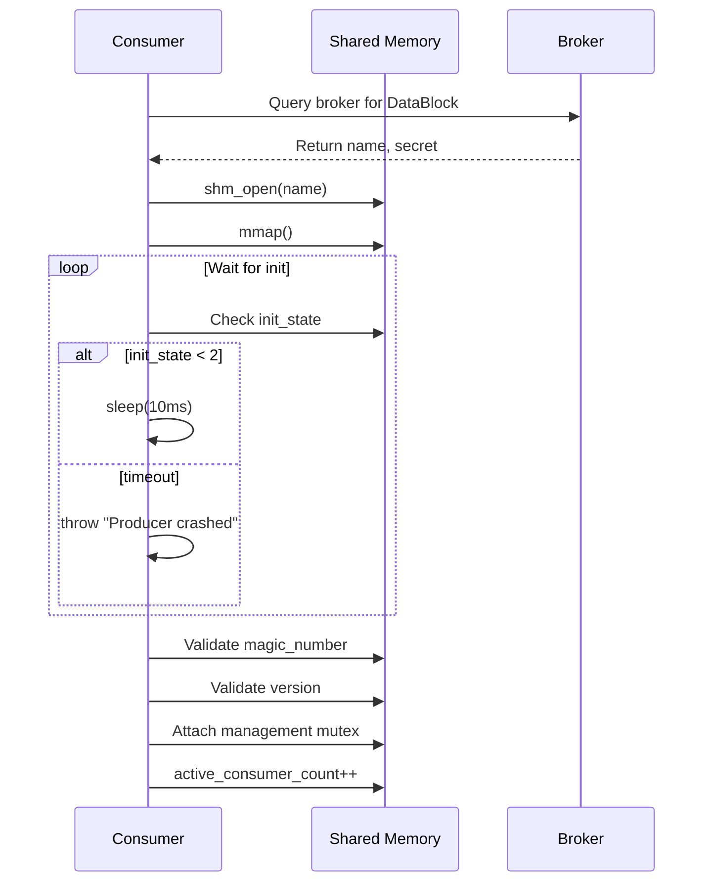
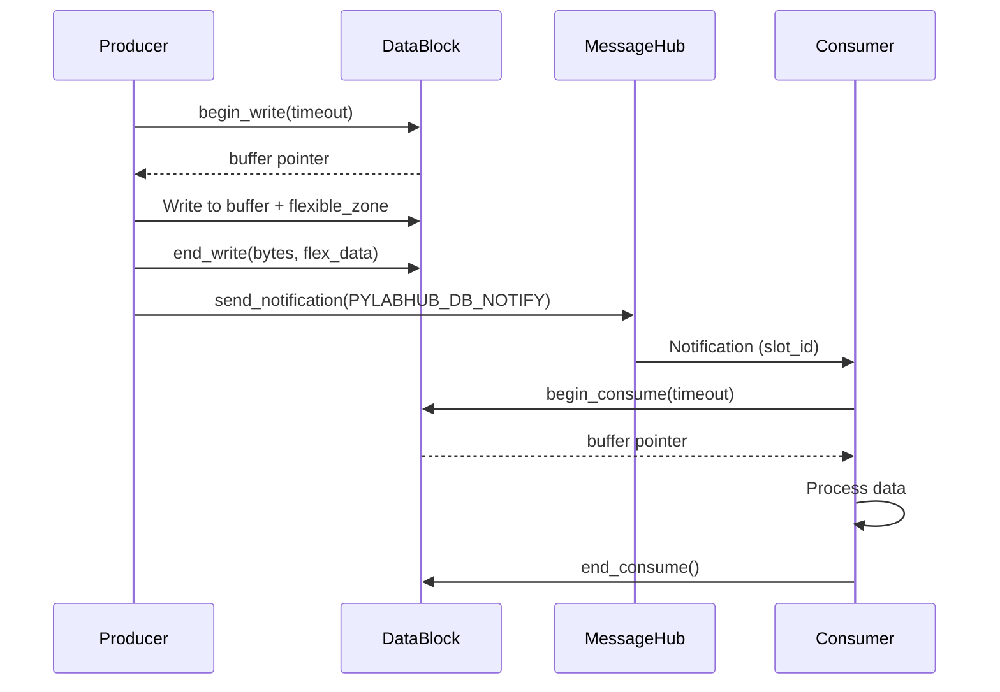

| Property       | Value                                      |
| -------------- | ------------------------------------------ |
| **HEP**        | `core-0002`                                |
| **Title**      | A Framework for Inter-Process Data Exchange|
| **Author**     | Quan Qing, AI assistant                    |
| **Status**     | Draft                                      |
| **Category**   | Core                                       |
| **Created**    | 2026-01-07                                 |
| **Updated**    | 2026-02-06                                 |
| **C++-Standard** | C++20                                    |

## Abstract

This Hub Enhancement Proposal (HEP) defines the **Data Exchange Hub**—a high-performance, cross-process communication framework centered around a **Message Hub** (control plane) and **DataBlock** channels (data plane). DataBlocks use shared memory with policy-based buffers, an expandable bidirectional chain, a stateful **Flexible Data Zone**, and robust synchronization (OS mutex + atomic spinlocks). All coordination is managed by a strict, header-based messaging protocol and a central broker. This design provides a comprehensive, secure, and resilient framework for complex data-flow applications.

## Motivation

Modern scientific and laboratory environments require integrating multiple independent software tools and hardware instruments. A centralized, standardized data exchange mechanism is needed to:

- Decouple data producers from consumers in complex data-flow pipelines
- Provide a unified interface for system control and state monitoring with robust error detection
- Enable both low-latency "latest value" streaming and reliable, lossless data queuing
- Ensure data integrity, security, and comprehensive logging of experimental parameters

**Primary Use Cases:**

| Use Case | Description |
|----------|-------------|
| Inter-process data pipelines | GiB/s throughput between producer and multiple consumers |
| Real-time sensor data distribution | Low-latency streaming from instruments to analysis processes |
| High-frequency data feeds | Finance, telemetry, scientific computing |
| Video/audio stream processing | Zero-copy frame transfer |

**Not Suitable For:** Small infrequent messages (use MessageHub directly), transactional ACID workloads, collaborative editing with conflict resolution.

---

## 0. Design Philosophy

### 0.1 Core Principles

1. **Zero-Copy Data Transfer**
   - Data resides in shared memory; processes access it directly
   - No serialization/deserialization overhead for local processes
   - Eliminates kernel context switches for data transfer

2. **Separation of Control and Data Planes**
   - **Control Plane**: MessageHub handles discovery, registration, signaling
   - **Data Plane**: DataBlock handles bulk data transfer via shared memory
   - This separation enables independent optimization of each path

3. **Defensive Design for Production Use**
   - Assumes processes can crash at any time
   - Detects and recovers from dead lock owners
   - Validates all external inputs (magic numbers, versions, secrets)
   - Graceful degradation instead of cascading failures

4. **Predictable Performance**
   - Fixed-size control structures for O(1) operations
   - Lock-free fast paths where possible
   - Bounded wait times with timeouts

### 0.2 Design Goals (Expandable Chain)

| Goal | Description |
|------|-------------|
| **Expandable chain** | Bidirectional links; chain grows only (no shrink) |
| **64-bit Counters/Flags** | Atomic slots for timestamps, counts, bit flags |
| **Index-based API** | Spinlocks and counters accessible by global index across chain |
| **Iterator interface** | Traverse blocks with next/deny semantics |
| **Per-block Flexible Zone** | Format flag (Raw, MessagePack, Json); iterator traverses zones |
| **ABI stability** | pImpl pattern for stable dynamic module interface |

---

## 1. Architecture Overview

### 1.1 Component Diagram



### 1.2 Framework Components

| Component | Purpose | Technology |
|-----------|---------|------------|
| **MessageHub** | Control plane: discovery, registration, notifications | ZeroMQ + CurveZMQ encryption |
| **DataBlock** | Data plane: bulk data transfer via shared memory | POSIX shm / Windows File Mapping |
| **DataBlockMutex** | Internal metadata protection | pthread_mutex_t (POSIX) / Named Mutex (Windows) |
| **SharedSpinLock** | User-facing data coordination | Pure C++ atomics (lock-free) |

### 1.3 Class and Interface Relationships



---

## 2. Memory Model

### 2.1 Expandable Chain Design

The DataBlock uses an **expandable bidirectional chain** of shared memory segments. Each segment has its own `SharedMemoryHeader`. The chain grows only (no shrink); expansion and shutdown are handled at a higher level.



**Chain invariants:**

| Position | chain_flags | prev_block_offset | next_block_offset |
|----------|-------------|-------------------|-------------------|
| Head | CHAIN_HEAD | 0 | non-zero |
| Middle | 0 | non-zero | non-zero |
| Tail | CHAIN_TAIL | non-zero | 0 |

### 2.2 Per-Block Memory Layout



### 2.3 SharedMemoryHeader Structure

```cpp
// Flexible zone format (per block; can differ along chain)
enum class FlexibleZoneFormat : uint8_t { Raw = 0, MessagePack = 1, Json = 2 };

struct SharedMemoryHeader {
    // Section 1: Identity & Validation (32 bytes)
    uint64_t magic_number;        // 0xBADF00DFEEDFACE (set LAST during init)
    uint64_t shared_secret;       // Access control token
    uint32_t version;             // Protocol version
    uint32_t header_size;         // sizeof(SharedMemoryHeader)
    std::atomic<uint32_t> init_state;  // 0=uninit, 1=mutex ready, 2=fully init

    // Section 2: Chain Navigation (24 bytes)
    uint64_t prev_block_offset;   // 0 = head
    uint64_t next_block_offset;   // 0 = tail
    uint32_t chain_flags;         // CHAIN_HEAD | CHAIN_TAIL
    uint32_t chain_index;         // 0-based position
    std::atomic<uint32_t> total_spinlock_count;   // Chain-wide (head only)
    std::atomic<uint32_t> total_counter_count;    // Chain-wide (head only)

    // Section 3: Consumer Management & Data Indices (40 bytes)
    std::atomic<uint32_t> active_consumer_count;
    std::atomic<uint64_t> write_index;
    std::atomic<uint64_t> commit_index;
    std::atomic<uint64_t> read_index;
    std::atomic<uint64_t> current_slot_id;

    // Section 4: Management Mutex (64 bytes)
    char management_mutex_storage[64];

    // Section 5: User Spinlocks (128 bytes)
    SharedSpinLockState shared_spinlocks[MAX_SHARED_SPINLOCKS];
    std::atomic_flag spinlock_allocated[MAX_SHARED_SPINLOCKS];

    // Section 6: 64-bit Counters (64 bytes)
    std::atomic<uint64_t> counters_64[NUM_COUNTERS_64];

    // Section 7: Flexible Zone Metadata (8 bytes)
    FlexibleZoneFormat flexible_zone_format;
};
```

### 2.4 Flexible Data Zone Formats

| Format | Value | Description |
|--------|-------|-------------|
| Raw | 0 | Unstructured bytes; user-defined layout |
| MessagePack | 1 | MessagePack-serialized data |
| Json | 2 | JSON-serialized data |

Per-block format allows different blocks in the chain to use different formats (e.g., block 0 = MessagePack metadata, block 1 = Raw binary descriptors).

### 2.5 Linked Table for Expandable Indices

To support indices beyond a single block:

- **Spinlocks**: Each block has `MAX_SHARED_SPINLOCKS` (8). Global index = `block_index * MAX_SHARED_SPINLOCKS + local_index`.
- **Counters**: Each block has `NUM_COUNTERS_64`. Global index = `block_index * NUM_COUNTERS_64 + local_index`.

Linear layout: block 0 has indices 0..N-1, block 1 has N..2N-1, etc.

### 2.6 Key Design Decisions

| Decision | Rationale |
|----------|------------|
| **Expandable Chain** | Growth without reallocation; each block is independent; higher-level code manages expansion/shutdown |
| **64-bit Counters Only** | Simpler API; sufficient for timestamps, counts, bit flags; avoids 32/64-bit confusion |
| **Per-Block Flexible Zone Format** | Different blocks serve different roles (config vs. binary descriptors); mixed-format chains |
| **Iterator for Flexible Zones** | Aligns with block iterator; one zone per block; index = block position |

### 2.7 Expansion Protocol

Expansion is **not** implemented inside this module. The design provides:

- Header layout with `prev_block_offset`, `next_block_offset`, `chain_flags`
- API to traverse the chain and inquire totals
- Higher-level code creates new segments, links them, updates `total_spinlock_count` / `total_counter_count` in the head

Shutdown is also higher-level: unlink segments, unmap, unlink shm names.

---

## 3. Synchronization Strategy

### 3.1 Two-Tiered Locking



### 3.2 Synchronization Comparison

| Aspect | Management Mutex | User Spinlocks |
|--------|------------------|----------------|
| **Frequency** | Rare (init/cleanup) | Very frequent (every access) |
| **Latency** | 1-10 μs | 10-50 ns uncontended |
| **Robustness** | OS-guaranteed (EOWNERDEAD) | Best-effort (PID checks) |
| **Users** | Internal only | Public API |

**Analogy:** Management mutex = "construction crane" (slow, heavy-duty); spinlocks = "hand tools" (fast, lightweight).

### 3.3 Lock-Free Operations

Some operations are **completely lock-free** for maximum performance:

```cpp
// Reading indices (consumer hot path)
uint64_t current_write = header->write_index.load(std::memory_order_acquire);

// Checking consumer count
uint32_t count = header->active_consumer_count.load(std::memory_order_relaxed);

// Single-producer write index increment (no CAS needed)
header->write_index.store(new_index, std::memory_order_release);
```

---

## 4. Public API Reference

### 4.1 Configuration and Types

| Type | Description |
|------|--------------|
| `DataBlockPolicy` | `Single`, `DoubleBuffer`, `RingBuffer` |
| `DataBlockConfig` | `shared_secret`, `structured_buffer_size`, `flexible_zone_size`, `ring_buffer_capacity`, `flexible_zone_format` |
| `FlexibleZoneFormat` | `Raw`, `MessagePack`, `Json` |

### 4.2 Producer Interface

| Method | Description |
|--------|-------------|
| `char* begin_write(int timeout_ms = 0)` | Acquire slot for writing; returns nullptr on timeout |
| `bool end_write(size_t bytes_written, const nlohmann::json* flexible_data)` | Commit written data, make available to consumers |
| `char* flexible_zone()` | Access mutable flexible data zone |
| `acquire_spinlock(size_t index)` | Acquire user spinlock by global index |
| `set_counter_64(size_t index, uint64_t value)` | Set 64-bit counter |
| `DataBlockIterator begin() / end()` | Traverse blocks in chain |

### 4.3 Consumer Interface

| Method | Description |
|--------|-------------|
| `const char* begin_consume(int timeout_ms = 0)` | Acquire slot for reading; returns nullptr on timeout |
| `bool end_consume()` | Release consumed slot |
| `const char* flexible_zone() const` | Access read-only flexible zone |
| `acquire_spinlock(size_t index)` | Acquire user spinlock |
| `get_counter_64(size_t index)` | Read 64-bit counter |
| `DataBlockIterator begin() / end()` | Traverse blocks |

### 4.4 Factory Functions

```cpp
std::unique_ptr<IDataBlockProducer> create_datablock_producer(
    MessageHub& hub, const std::string& name,
    DataBlockPolicy policy, const DataBlockConfig& config);

std::unique_ptr<IDataBlockConsumer> find_datablock_consumer(
    MessageHub& hub, const std::string& name, uint64_t shared_secret);
```

### 4.5 DataBlockIterator

| Method | Description |
|--------|-------------|
| `NextResult try_next()` | Advance to next block; `ok=false` if not ready |
| `void* block_base()` | Base address of current block |
| `void* flexible_zone_base()` | Pointer to flexible zone |
| `size_t flexible_zone_size()` | Size in bytes |
| `FlexibleZoneFormat flexible_zone_format()` | Raw, MessagePack, or Json |
| `bool is_head() / is_tail() / is_valid()` | Chain position |

---

## 5. Message Protocol

### 5.1 Strict Two-Part Structure

All MessageHub messages use:

1. **Frame 1 (16 bytes):** Magic string identifying message type
2. **Frame 2:** MessagePack-serialized payload

| Magic String | Purpose |
|--------------|---------|
| `PYLABHUB_DB_NOTIFY` | DataBlock data-ready notification |
| `PYLABHUB_HB_REQ` | Client heartbeat request |
| `PYLABHUB_REG_REQ` | Channel registration request |
| `PYLABHUB_CONS_DROP` | Consumer drop-off broadcast |

### 5.2 Consumer Management Protocol

1. Consumer registers with broker and sends periodic heartbeats
2. Broker tracks consumers; broadcasts `PYLABHUB_CONS_DROP` on timeout
3. Producer/consumers subscribe to drop messages for resource release

---

## 6. Initialization and Lifecycle

### 6.1 Producer Initialization Sequence



### 6.2 Consumer Attachment Sequence



### 6.3 Producer-Consumer Data Flow



### 6.4 Shutdown Protocol

**Producer Shutdown:**
```cpp
if (header->active_consumer_count.load() > 0) { /* warn */ }
management_mutex.reset();  // Only creator destroys
munmap(mapped_addr, size); close(shm_fd); shm_unlink(name);
```

**Consumer Shutdown:**
```cpp
header->active_consumer_count.fetch_sub(1, std::memory_order_acq_rel);
management_mutex.reset();  // Don't destroy
munmap(mapped_addr, size); close(shm_fd);  // Don't unlink
```

**POSIX:** After `shm_unlink()`, shared memory persists until all processes `munmap()` it.

---

## 7. Usage Protocols

### 7.1 MessageHub Integration Patterns

| Pattern | Flow | Latency | Use When |
|---------|------|---------|----------|
| **Notification-Driven** | Producer writes → notify → consumers wake → read | ~10-50 μs | Real-time, idle consumers |
| **Polling** | Consumers poll indices → detect new data → read | ~100-500 μs | Sustained high rate, active consumers |
| **Hybrid** | Low-freq poll → notification triggers fast poll | Balanced | Latency + CPU trade-off |

### 7.2 Data Integrity Validation

```cpp
struct DataSlot {
    uint64_t sequence_number;
    uint32_t checksum;  // CRC32 or xxHash
    uint32_t size;
    char data[SLOT_SIZE - 16];
};
// Producer: slot.checksum = compute_checksum(data, size);
// Consumer: validate checksum before use
```

---

## 8. Error Handling and Recovery

### 7.1 Crash Recovery Scenarios

| Scenario | Detection | Recovery |
|----------|-----------|----------|
| Producer crash during init | Consumer timeout on `init_state` | Throw; next producer `shm_unlink()` removes orphan |
| Process crash holding mutex | `EOWNERDEAD` (POSIX) / `WAIT_ABANDONED` (Windows) | `pthread_mutex_consistent()`; validate protected data |
| Process crash holding spinlock | PID liveness check fails | Auto-reclaim + generation bump; data may be corrupt |

### 8.2 Consumer Crash Scenarios

| Scenario | Symptom | Mitigation |
|----------|---------|------------|
| Consumer crashes, doesn't decrement count | `active_consumer_count` stale | Future: heartbeat mechanism, auto-decrement on timeout |
| Consumer holds spinlock, then crashes | Lock stuck | Same as producer: PID check → auto-reclaim |

### 8.3 Version Mismatch and Versioning Strategy

```cpp
if (header->version > DATABLOCK_VERSION_SUPPORTED)
    throw "DataBlock version too new, upgrade client";
if (header->version < DATABLOCK_VERSION_MIN_SUPPORTED)
    throw "DataBlock version too old, upgrade producer";
```

- **Minor version bump:** Backward-compatible additions (new optional fields)
- **Major version bump:** Incompatible changes (restructure header)

---

## 9. Performance Characteristics

### 8.1 Latency and Throughput

| Operation | Latency | Throughput |
|-----------|---------|------------|
| Spinlock acquire (uncontended) | 10-50 ns | N/A |
| Spinlock acquire (contended) | 100-500 ns | N/A |
| Management mutex acquire | 1-10 μs | N/A |
| Write to flexible zone (1KB) | 50-200 ns | 5-20 GB/s |
| Write to buffer slot (4KB) | 200-800 ns | 5-20 GB/s |
| MessageHub notify | 10-50 μs | N/A |

### 8.2 Scalability Limits

| Aspect | Limit | Reasoning |
|--------|-------|------------|
| Max consumers | ~100 | Cache line contention on shared indices |
| Max spinlock contention | ~10 processes | Beyond this, OS mutex may be faster |
| Max data rate | 10-20 GB/s | Memory bandwidth |
| Max DataBlock size | 2 GB | POSIX shm limit |

### 8.3 Optimization Guidelines

**Maximum Throughput:** Large buffer slots, batch writes, minimize spinlock usage (batch updates under single lock).

**Minimum Latency:** Small cache-line-aligned structures, pin threads to cores, real-time priority (`SCHED_FIFO`).

---

## 10. Design Trade-offs

| Aspect | Choice | Trade-off |
|--------|--------|-----------|
| Memory model | Shared memory | Requires OS support; not network-transparent |
| Locking | Two-tiered (OS mutex + spinlocks) | Complexity vs. robustness |
| Producer model | Single writer, multiple readers | Simplicity vs. collaborative writes |
| Discovery | Broker-mediated | Centralization vs. peer discovery |
| Consistency | Eventual (relaxed atomics) | Performance vs. strong guarantees |

---

## 11. Common Pitfalls and Best Practices

### 11.1 Memory Barriers

**❌ Bad:** `header->data_ready = true;` (plain write) — consumer may see stale data.

**✅ Good:** Use atomics + `memory_order_release`/`memory_order_acquire`; set `data_size` before `data_ready`.

### 11.2 Holding Locks Too Long

**❌ Bad:** Perform expensive computation while holding spinlock.

**✅ Good:** Compute outside critical section; acquire lock only for write.

### 11.3 Ignoring Process Death

**❌ Bad:** `while (true) { read_from_buffer(); }` — blocks forever if producer crashes.

**✅ Good:** Use timeout + heartbeat check; break on prolonged absence.

### 11.4 Shared Secret Mismanagement

**❌ Bad:** Hardcoded secret in source control.

**✅ Good:** Generate random secret; share via broker over encrypted channel (CurveZMQ).

---

## 12. ABI Stability Checklist

- [x] Public classes use `std::unique_ptr<Impl>` (pImpl)
- [x] No STL containers in public class definitions
- [x] SharedMemoryHeader uses fixed-size arrays and POD types
- [x] SharedSpinLockState remains POD struct
- [x] Factory functions return `unique_ptr` to interface

---

## 13. Implementation Status

| Phase | Status | Items |
|-------|--------|-------|
| Phase 1 | Complete | SharedSpinLock, DataBlockMutex, init_state, consumer validation |
| Phase 2 | In Progress | Data transfer APIs, ring buffer slot management |
| Phase 3 | Planned | Broker integration, multi-producer, integrity checks |

### 13.1 Implementation Order

1. Update `SharedMemoryHeader` with chain fields and counters section
2. Refactor `IDataBlockProducer`/`IDataBlockConsumer` to concrete classes with pImpl
3. Add spinlock/counter API with global index resolution
4. Add `DataBlockIterator` with `try_next()` semantics
5. Implement chain traversal (single-block first, multi-block later)

---

## 14. Future Work

- **Broker Implementation:** Consumer heartbeats, failure broadcasts
- **Full Policy-Based Buffer Management:** `begin_write`/`end_write`/`begin_consume`/`end_consume` for all policies
- **Flexible Data Zone Serialization:** MessagePack integration
- **Consumer Heartbeat:** Auto-decrement `active_consumer_count` on timeout
- **Integrity Checking:** Checksums, sequence numbers
- **Multi-Producer Support:** Per-producer write indices + merge logic
- **Zero-Copy Cross-Language API:** C API for FFI (Python, Rust, Go)
- **Advanced Buffer Policies:** Priority queues, time-based expiry
- **Telemetry & Monitoring:** Prometheus/Grafana integration

**Research Directions:** RDMA integration, persistent memory (PMEM), formal verification of locking protocols.

---

## Appendix A: Quick Reference

### A.1 Initialization Checklist

- [ ] Choose buffer sizes based on data rate
- [ ] Generate cryptographically random `shared_secret`
- [ ] Register DataBlock with broker for discovery
- [ ] Validate `magic_number`, `version`, `shared_secret` on attach
- [ ] Handle initialization timeout (producer crash during setup)

### A.2 Shutdown Checklist

- [ ] Producer: Check `active_consumer_count` before shutdown
- [ ] Producer: Send shutdown notification via MessageHub
- [ ] Consumer: Decrement `active_consumer_count` on exit
- [ ] Consumer: Release all spinlocks before detaching
- [ ] Both: Clean up OS resources (`close()`, `munmap()`)

### A.3 Debugging Tips

| Problem | Check |
|---------|-------|
| Consumer hangs on attach | Producer crashed during init? Check `init_state` |
| Data corruption | Validate checksums, check for race conditions |
| High latency | Profile spinlock contention, check CPU pinning |
| Memory leak | Ensure spinlocks released, check `active_consumer_count` |
| Segfault | Validate offsets, check for munmap while in use |

---

## Copyright

This document is placed in the public domain or under the CC0-1.0-Universal license, whichever is more permissive.
