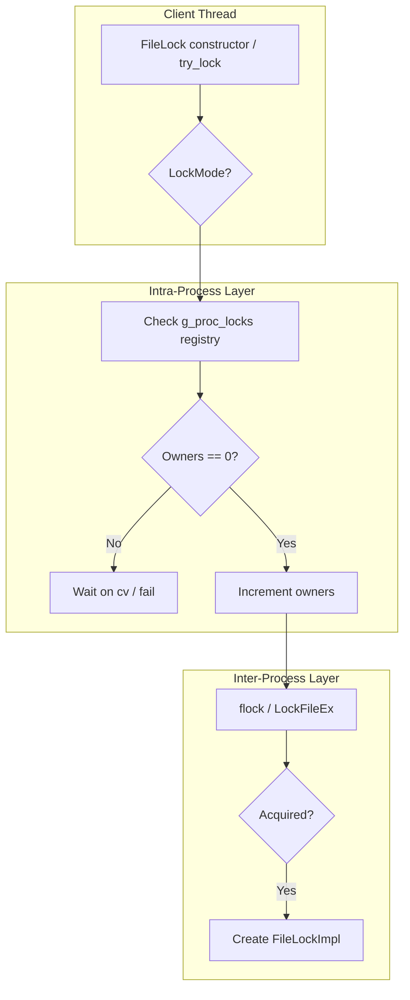
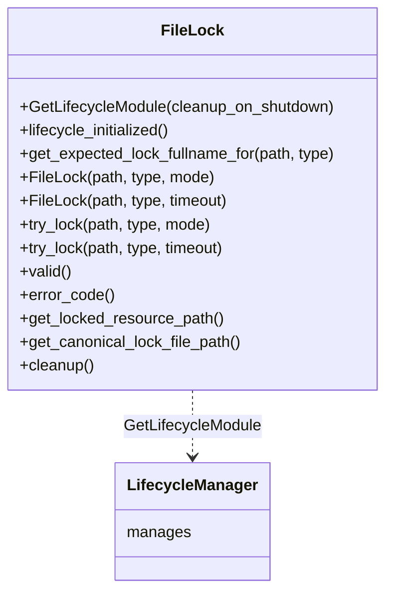
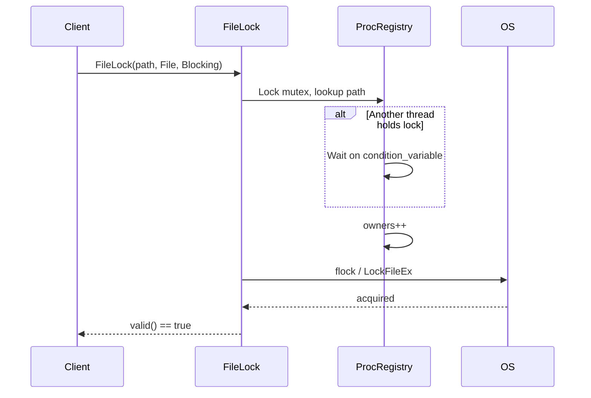
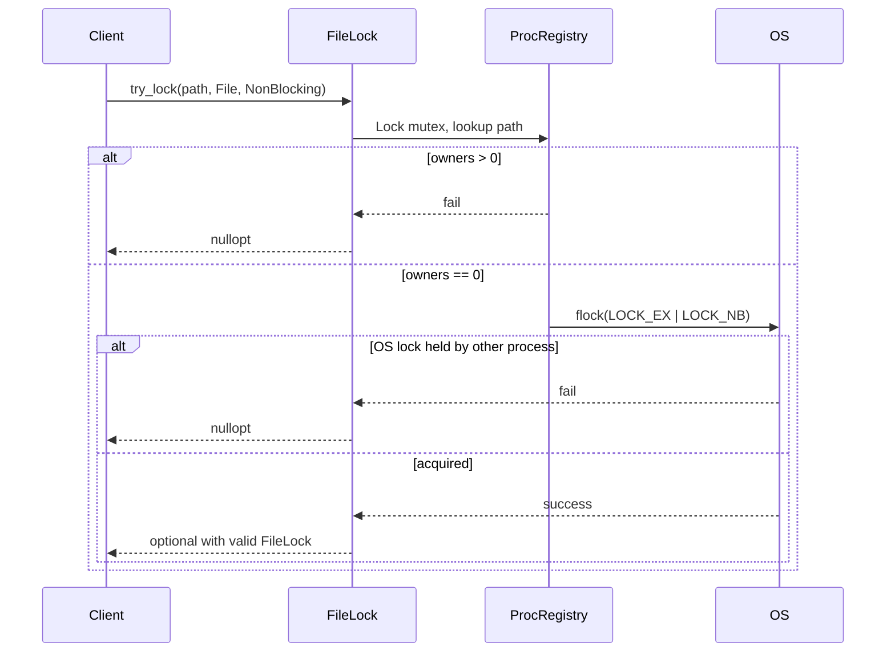

| Property       | Value                                        |
| -------------- | -------------------------------------------- |
| **HEP**        | `core-0003`                                  |
| **Title**      | Cross-Platform RAII File Locking (FileLock)  |
| **Author**     | Quan Qing, AI assistant                      |
| **Status**     | Draft                                        |
| **Category**   | Core                                         |
| **Created**    | 2026-01-30                                   |
| **Updated**    | 2026-02-06                                   |
| **C++-Standard** | C++20                                        |

## Abstract

This Hub Enhancement Proposal (HEP) outlines the design and implementation of the `FileLock` module, a cross-platform, RAII-style advisory file locking mechanism. `FileLock` provides robust synchronization for both multi-process and multi-threaded applications interacting with shared filesystem resources, ensuring data integrity and preventing race conditions.

## Motivation

Multiple processes or threads often need to access and modify shared files (e.g., configuration files, data caches). Without proper synchronization, concurrent access can lead to data corruption. Platform-specific locking primitives are cumbersome to use correctly and portably.

| Need | FileLock Solution |
|------|-------------------|
| Simple, safe API | RAII: lock acquired in constructor, released in destructor |
| Cross-platform | `flock` (POSIX) / `LockFileEx` (Windows) |
| Inter- and intra-process | Two-layer model: OS lock + process-local registry |
| Blocking, non-blocking, timed | `LockMode::Blocking`, `NonBlocking`, timeout constructor |

---

## Design Philosophy

### Design Goals

| Goal | Description |
|------|-------------|
| **RAII** | Lock acquired in constructor, released in destructor; exception-safe |
| **Two-layer locking** | OS-level for inter-process; process registry for intra-process consistency |
| **Advisory lock** | Cooperating processes must use FileLock; non-cooperating processes can ignore |
| **Separate lock file** | Target `data.json` → lock file `data.json.lock`; avoids content interference |
| **Path canonicalization** | `/a/./b` and `/a/b` contend for same lock |
| **ABI stability** | Pimpl idiom; `FileLockImpl` hides platform details |

### Design Considerations

- **Why separate lock file?** Avoids conflicts with read/write on the data file; simplifies cleanup of stale locks.
- **Why process-local registry?** OS file locks can behave inconsistently for threads in the same process (e.g., POSIX `flock`); the registry ensures Blocking/NonBlocking semantics work identically.
- **Why advisory?** Mandatory locking is OS-specific and less portable; FileLock assumes cooperative use.
- **NFS warning:** `flock` may be unreliable over NFS; use local filesystem for critical locks.

### Highlights

- **Custom deleter on `unique_ptr<FileLockImpl>`** — Ensures lock release logic runs when the Pimpl is destroyed, even on move.
- **`try_lock` returns `std::optional<FileLock>`** — Modern C++ idiom for optional acquisition.
- **`LOCK_POLLING_INTERVAL` (20ms)** — Balance between responsiveness and CPU usage for timed/NonBlocking on POSIX.

---

## Architecture Overview

### Lock Acquisition Flow



### Class and API Relationships



### Lock File Naming

| Resource Type | Example Path | Lock File |
|---------------|--------------|-----------|
| File | `/data/config.json` | `/data/config.json.lock` |
| Directory | `/data/cache/` | `/data/cache.dir.lock` |

---

## Public API Reference

### Enums

| Enum | Values | Description |
|------|--------|-------------|
| `LockMode` | `Blocking`, `NonBlocking` | Wait indefinitely vs return immediately |
| `ResourceType` | `File`, `Directory` | Determines lock file suffix (`.lock` vs `.dir.lock`) |

### FileLock Class

| Method | Description |
|--------|-------------|
| `GetLifecycleModule(cleanup_on_shutdown)` | ModuleDef for LifecycleManager; `cleanup_on_shutdown` enables stale lock removal on exit |
| `lifecycle_initialized()` | Check if module is initialized |
| `get_expected_lock_fullname_for(path, type)` | Predict canonical lock file path |
| `FileLock(path, type, mode)` | Construct and acquire; Blocking or NonBlocking |
| `FileLock(path, type, timeout)` | Construct and acquire with timeout |
| `try_lock(path, type, mode)` | Factory; returns `optional<FileLock>` |
| `try_lock(path, type, timeout)` | Factory with timeout |
| `valid()` | True if lock is held |
| `error_code()` | Error from failed acquisition |
| `get_locked_resource_path()` | Path of protected resource |
| `get_canonical_lock_file_path()` | Canonical path of `.lock` file |
| `cleanup()` | Best-effort removal of stale locks (if configured) |

---

## Sequence of Operations

### Blocking Lock Acquisition



### Try-Lock (NonBlocking)



---

## Example: Blocking Lock with Timeout

```cpp
#include "utils/lifecycle.hpp"
#include "utils/file_lock.hpp"
#include "utils/logger.hpp"

void perform_exclusive_work(const std::filesystem::path& resource) {
    pylabhub::utils::LifecycleGuard guard(
        pylabhub::utils::FileLock::GetLifecycleModule(true),
        pylabhub::utils::Logger::GetLifecycleModule()
    );

    pylabhub::utils::FileLock lock(resource,
        pylabhub::utils::ResourceType::File,
        std::chrono::seconds(5));

    if (lock.valid()) {
        // ... safely modify resource ...
    } else {
        LOGGER_ERROR("Failed to acquire lock: {}", lock.error_code().message());
    }
}
```

## Example: Try-Lock (Optional)

```cpp
if (auto lock = pylabhub::utils::FileLock::try_lock(
        path, pylabhub::utils::ResourceType::File,
        pylabhub::utils::LockMode::NonBlocking)) {
    LOGGER_INFO("Lock acquired for {}", lock->get_locked_resource_path()->string());
    // ... use resource ...
} else {
    LOGGER_WARN("Lock busy: {}", path.string());
}
```

---

## Risk Analysis and Mitigations

| Risk | Mitigation |
|------|-------------|
| Advisory lock ignored by non-cooperating process | Inherent limitation; document cooperative use |
| Polling overhead (POSIX timed/NonBlocking) | 20ms interval; configurable in source |
| Stale lock files after crash | `cleanup_on_shutdown` for graceful exit; manual cleanup for hard crash |
| Unreliable on NFS | Documented warning; recommend local filesystem |
| Self-deadlock (re-acquire same path) | Intra-process registry blocks or fails; no system deadlock |

---

## Copyright

This document is placed in the public domain or under the CC0-1.0-Universal license, whichever is more permissive.
