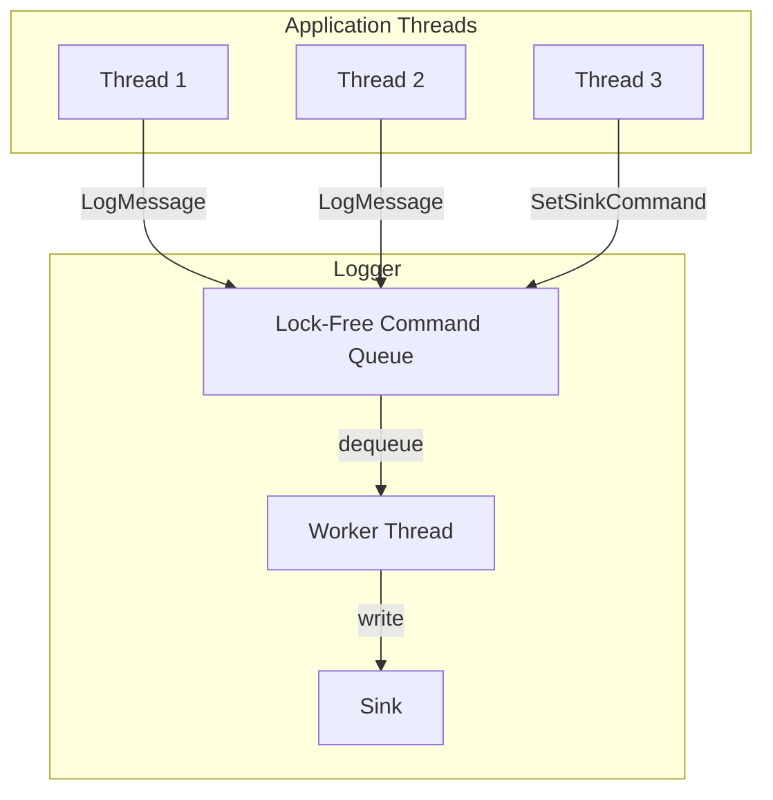
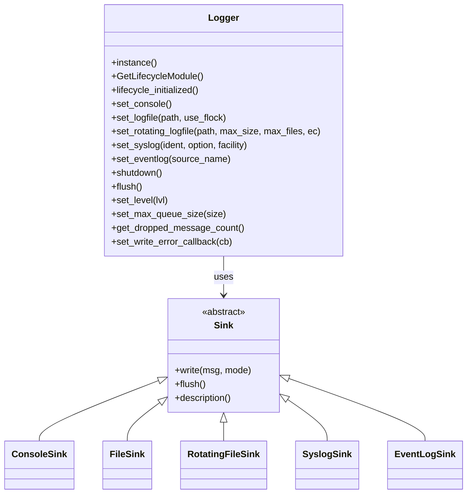
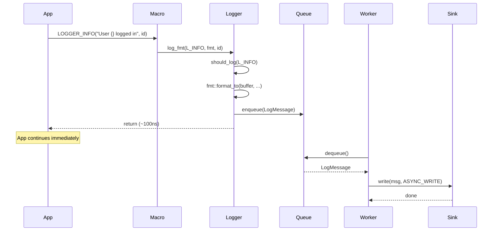
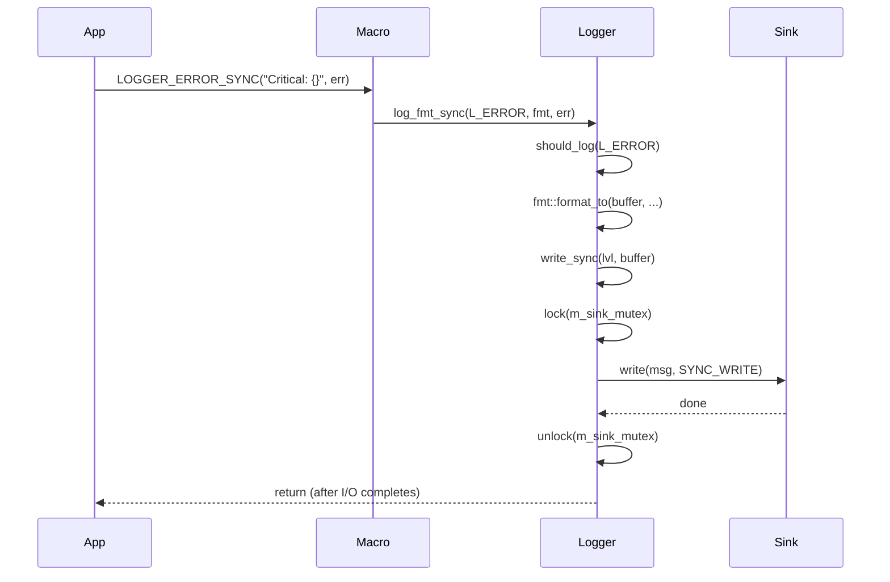
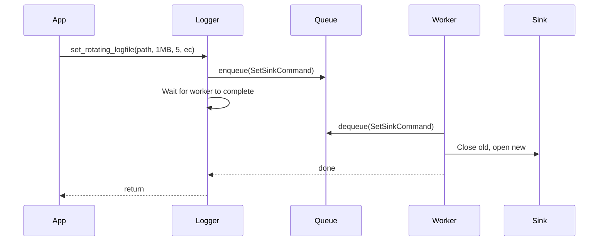
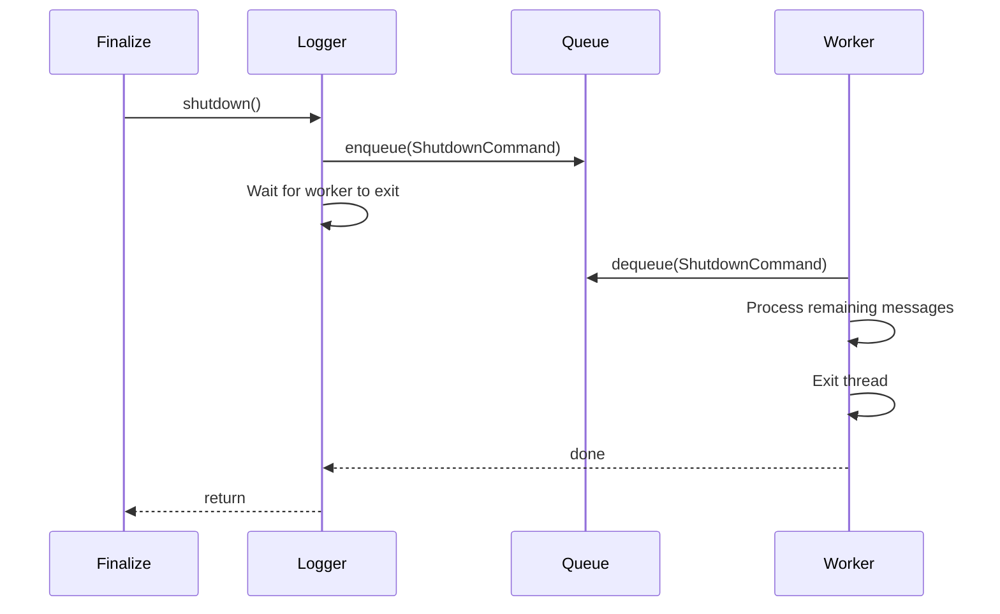

| Property       | Value                                        |
| -------------- | -------------------------------------------- |
| **HEP**        | `core-0004`                                  |
| **Title**      | High-Performance Asynchronous Logger         |
| **Author**     | Quan Qing, AI assistant                      |
| **Status**     | Draft                                        |
| **Category**   | Core                                         |
| **Created**    | 2026-01-30                                   |
| **Updated**    | 2026-02-06                                   |
| **C++-Standard** | C++20                                        |

## Abstract

This Hub Enhancement Proposal (HEP) describes the design of `pylabhub::utils::Logger`, a high-performance, asynchronous, thread-safe logging framework. Its core architecture uses a decoupled command queue and a dedicated worker thread, ensuring that logging operations have minimal performance impact on application-critical threads. The logger is extensible through a sink-based architecture and integrates with the `LifecycleManager` for graceful startup and shutdown.

## Motivation

Naive logging that performs I/O directly on the calling thread introduces significant latency. In multi-threaded, high-throughput environments, this harms performance and responsiveness.

| Need | Logger Solution |
|------|-----------------|
| Low-latency logging | Async: format + enqueue only (~50-200 ns) |
| Thread safety | Lock-free queue; single worker consumes |
| Extensibility | Sink abstraction (Console, File, RotatingFile, Syslog, EventLog) |
| Robustness | Bounded queue; drop strategy when full; graceful shutdown flush |
| Type safety | Compile-time format validation via `fmt::format_string` |

---

## Design Philosophy

### Design Goals

| Goal | Description |
|------|-------------|
| **Asynchronous by default** | Logging macros enqueue; worker thread performs I/O |
| **Single worker thread** | All I/O isolated; serializes access to sinks |
| **Sink abstraction** | Polymorphic `Sink` base; concrete implementations for each destination |
| **Bounded queue** | Configurable max size; drop when full; recovery message when capacity returns |
| **Compile-time format validation** | `LOGGER_INFO(FMT_STRING(fmt), ...)` validates at compile time |
| **ABI stability** | Pimpl idiom; `Logger::Impl` hides queue, mutexes, worker |

### Design Considerations

- **Why single worker?** Simplifies serialization; I/O is typically the bottleneck, not the worker. Multiple workers would add complexity (ordering, sink contention).
- **Why drop when full?** Prevents unbounded memory growth; application stability over guaranteed delivery in extreme burst scenarios.
- **Why tiered drop strategy?** Soft limit: drop only log messages; hard limit (2×): drop all commands. Ensures control operations (sink switch, flush) can complete under load.
- **Before init:** Logging macros silently drop; config methods (set_level, set_logfile, flush) call `PLH_PANIC`.

### Highlights

- **Compile-time level filtering** — `LOGGER_COMPILE_LEVEL` strips logs below threshold at compile time (zero runtime cost).
- **Synchronous variants** — `LOGGER_*_SYNC` bypass queue for critical messages (e.g., before abort).
- **Runtime format** — `LOGGER_*_RT` accepts `fmt::string_view` for dynamic format strings.
- **Callback on write error** — `set_write_error_callback` runs on dedicated thread to avoid deadlock if callback logs.

---

## Synchronous Logging (LOGGER_*_SYNC)

### Purpose

The synchronous variants (`LOGGER_TRACE_SYNC`, `LOGGER_DEBUG_SYNC`, `LOGGER_INFO_SYNC`, `LOGGER_WARN_SYNC`, `LOGGER_ERROR_SYNC`, `LOGGER_SYSTEM_SYNC`) provide a **blocking** path for urgent messages that must be written immediately. They bypass the asynchronous queue entirely.

### When to Use

| Use Case | Rationale |
|----------|-----------|
| **Immediately before `std::abort()`** | Ensures the message is on disk before termination |
| **Critical error handling** | Must-deliver audit trail for failures |
| **Signal handlers** | Use with extreme caution; sync path avoids queue (see warnings) |
| **Timing-sensitive debugging** | Guarantees message order relative to async logs enqueued before it |

### Implementation

- **`log_fmt_sync`** → **`write_sync`** → acquires `m_sink_mutex` → **`sink_->write(msg, Sink::SYNC_WRITE)`**
- No queue involvement; the calling thread performs the I/O directly
- Sync messages are prefixed with `[LOGGER_SYNC]` in the output to distinguish them from async messages

### Sink Write Modes

```cpp
// In Sink interface (sink.hpp)
enum WRITE_MODE { ASYNC_WRITE, SYNC_WRITE };
virtual void write(const LogMessage &msg, WRITE_MODE mode) = 0;
```

| Mode | Caller | Output Prefix |
|------|--------|---------------|
| `ASYNC_WRITE` | Worker thread (from queue) | `[LOGGER]` |
| `SYNC_WRITE` | Calling thread (direct) | `[LOGGER_SYNC]` |

### Trade-offs

- **Blocks the calling thread** until the write completes (1–10 ms typical for disk I/O)
- **Contends with async worker** — both acquire `m_sink_mutex`; sync call may wait if worker is writing
- **Use sparingly** — overuse defeats the async design and can cause latency spikes

### Warning: Signal Handlers

`LOGGER_*_SYNC` is **not** async-signal-safe. It uses mutex and I/O. Calling it from a signal handler may deadlock or cause undefined behavior. For signal handlers, prefer writing directly to `stderr` or use a lock-free, signal-safe mechanism.

---

## Architecture Overview

### Command Queue Flow



### Class and Sink Hierarchy



### Logging Macro Variants

| Variant | Macro | Use Case |
|---------|-------|----------|
| **Compile-time (async)** | `LOGGER_INFO(fmt, ...)` | Default; format validated at compile time; enqueues |
| **Synchronous** | `LOGGER_INFO_SYNC(fmt, ...)` | Urgent messages; bypasses queue; blocks until written |
| **Runtime format** | `LOGGER_INFO_RT(fmt, ...)` | Dynamic format string; no compile-time check |

All six levels have sync variants: `LOGGER_TRACE_SYNC`, `LOGGER_DEBUG_SYNC`, `LOGGER_INFO_SYNC`, `LOGGER_WARN_SYNC`, `LOGGER_ERROR_SYNC`, `LOGGER_SYSTEM_SYNC`.

---

## Public API Reference

### Logger Class

| Method | Description |
|--------|-------------|
| `instance()` | Singleton accessor |
| `GetLifecycleModule()` | ModuleDef for LifecycleManager |
| `lifecycle_initialized()` | Check if module is initialized |
| `set_console()` | Switch to stderr (default) |
| `set_logfile(utf8_path)` | Switch to file |
| `set_logfile(utf8_path, use_flock)` | Switch to file with optional flock (POSIX) |
| `set_rotating_logfile(path, max_size, max_files, ec)` | Rotating file sink |
| `set_rotating_logfile(..., use_flock, ec)` | With explicit flock |
| `set_syslog(ident, option, facility)` | Syslog (POSIX only) |
| `set_eventlog(source_name)` | Windows Event Log (Windows only) |
| `shutdown()` | Blocking; flush and stop worker |
| `flush()` | Block until queue drained |
| `set_level(lvl)` | Minimum level to process |
| `level()` | Current level |
| `set_max_queue_size(size)` | Queue capacity |
| `get_max_queue_size()` | Current capacity |
| `get_dropped_message_count()` | Total dropped messages |
| `set_write_error_callback(cb)` | Callback on sink write error |
| `set_log_sink_messages_enabled(bool)` | Enable/disable sink switch messages |

### Log Levels

| Level | Value | Macro |
|-------|-------|-------|
| L_TRACE | 0 | LOGGER_TRACE |
| L_DEBUG | 1 | LOGGER_DEBUG |
| L_INFO | 2 | LOGGER_INFO |
| L_WARNING | 3 | LOGGER_WARN |
| L_ERROR | 4 | LOGGER_ERROR |
| L_SYSTEM | 5 | LOGGER_SYSTEM |

---

## Sequence of Operations

### Async Logging (Normal Path)



### Synchronous Logging (LOGGER_*_SYNC Path)



### Sink Switch (Blocking)



### Shutdown



---

## Example: Basic Usage

```cpp
#include "utils/lifecycle.hpp"
#include "utils/logger.hpp"

int main() {
    pylabhub::utils::LifecycleGuard app_lifecycle(
        pylabhub::utils::Logger::GetLifecycleModule()
    );

    LOGGER_INFO("Application started.");
    pylabhub::utils::Logger::instance().set_level(
        pylabhub::utils::Logger::Level::L_DEBUG);
    LOGGER_DEBUG("Debug message.");

    std::error_code ec;
    if (pylabhub::utils::Logger::instance().set_rotating_logfile(
            "/tmp/app.log", 1024*1024, 5, ec)) {
        LOGGER_SYSTEM("Switched to rotating file.");
    }

    pylabhub::utils::Logger::instance().flush();
    return 0;
}
```

## Example: Synchronous for Critical Error

```cpp
try {
    critical_operation();
} catch (const std::exception& e) {
    LOGGER_ERROR_SYNC("Critical failure: {}", e.what());
    std::abort();
}
```

## Example: Sync for Urgent Audit Before Exit

```cpp
void handle_fatal_error(const char* msg) {
    LOGGER_SYSTEM_SYNC("Fatal: {} - aborting", msg);
    // Message is guaranteed written before abort
    std::abort();
}
```

---

## Risk Analysis and Mitigations

| Risk | Mitigation |
|------|------------|
| Message loss on crash | Async trade-off; use `flush()` at critical points; `LOGGER_*_SYNC` for must-deliver (bypasses queue) |
| Sync overuse causes latency | Document trade-off; use sync only for urgent/critical paths |
| Unbounded memory | Bounded queue; drop when full; configurable size |
| Deadlock in error callback | Callback runs on dedicated thread; safe to call logger from callback |
| Single worker bottleneck | I/O is typically bottleneck; sufficient for most apps |

---

## Copyright

This document is placed in the public domain or under the CC0-1.0-Universal license, whichever is more permissive.
