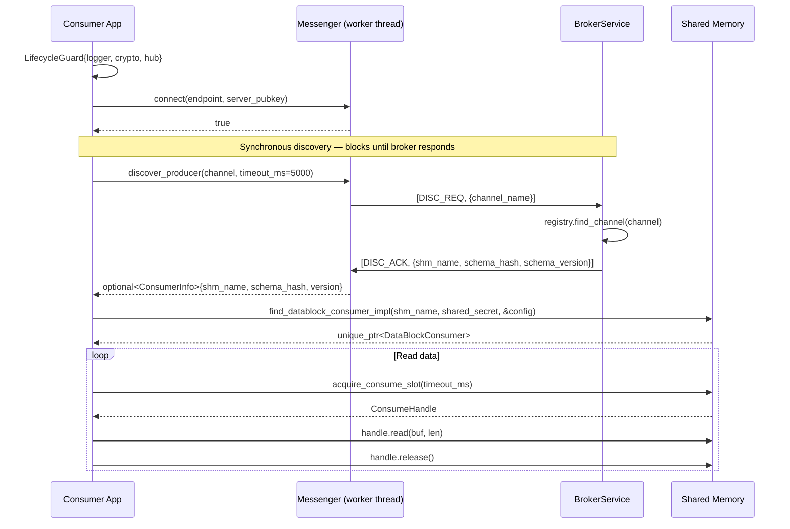
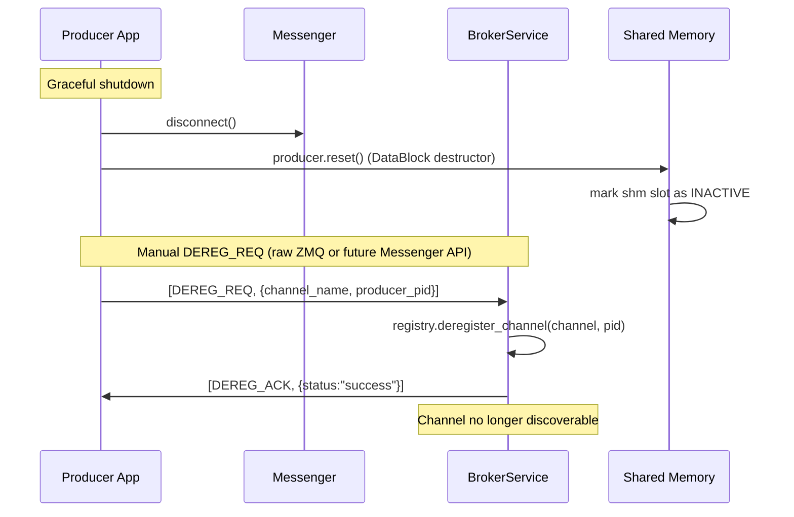

# Broker, DataBlock & Messenger Integration Guide

**Status:** Reference documentation (stable as of 2026-02-18, Phase C complete)
**Relates to:** `src/broker/`, `src/utils/messenger.cpp`, `src/utils/data_block.cpp`

---

## Overview

The three components form a layered IPC system:

| Component | Role | Location |
|---|---|---|
| `BrokerService` | Central channel directory — maps channel names to shared-memory segments | `src/broker/` |
| `Messenger` | Async ZMQ client that registers producers and discovers channels | `src/utils/messenger.cpp` |
| `DataBlock` | The actual shared-memory ring-buffer — where data flows | `src/utils/data_block.cpp` |

**Key principle:** The broker only handles *discovery metadata*. Bulk data never passes through it — it flows directly via shared memory between producer and consumer processes.

---

## Component Architecture

```
┌─────────────────────────────────────────────────────────────────┐
│                        Producer Process                         │
│                                                                 │
│  ┌──────────────┐   register_producer()   ┌─────────────────┐  │
│  │  Application │ ─────────────────────►  │    Messenger    │  │
│  │    Code      │                          │ (DEALER socket) │  │
│  │              │   acquire_write_slot()   └────────┬────────┘  │
│  │              │ ──────────────────────►           │ ZMQ/CurveZMQ
│  │              │       DataBlock                   │           │
│  └──────────────┘       (shm)                       │           │
└───────────────────────────────────────────────────  │ ──────────┘
                                                       │
                                              ┌────────▼────────┐
                                              │  BrokerService  │
                                              │ (ROUTER socket) │
                                              │                 │
                                              │ ChannelRegistry │
                                              │  channel_name   │
                                              │  → shm_name     │
                                              │  → schema_hash  │
                                              │  → producer_pid │
                                              └────────┬────────┘
                                                       │
┌─────────────────────────────────────────────────────  │ ──────────┐
│                        Consumer Process               │           │
│                                                       │           │
│  ┌──────────────┐   discover_producer()   ┌────────▼────────┐  │
│  │  Application │ ─────────────────────►  │    Messenger    │  │
│  │    Code      │ ◄─────────────────────  │ (DEALER socket) │  │
│  │              │      ConsumerInfo        └─────────────────┘  │
│  │              │   (shm_name, schema)                          │
│  │              │                                               │
│  │              │   find_datablock_consumer(shm_name)           │
│  │              │ ─────────────────────────────────────────►    │
│  │              │        DataBlock (shm, attached read-only)    │
│  │              │   acquire_consume_slot()                      │
│  └──────────────┘                                               │
└─────────────────────────────────────────────────────────────────┘
```

---

## Sequence Diagrams

### 1. Producer Startup

```mermaid
sequenceDiagram
    participant App as Producer App
    participant Msg as Messenger (worker thread)
    participant Brk as BrokerService
    participant Shm as Shared Memory

    App->>App: LifecycleGuard{logger, crypto, hub}
    App->>Msg: connect(endpoint, server_pubkey)
    Msg-->>App: true

    App->>Shm: create_datablock_producer_impl(channel, policy, config)
    Shm-->>App: unique_ptr<DataBlockProducer>

    Note over App,Msg: Fire-and-forget registration
    App->>Msg: register_producer(channel, {shm_name, pid, schema_hash, version})
    Msg->>Brk: [REG_REQ, {channel_name, shm_name, schema_hash, ...}]
    Brk->>Brk: registry.register_channel(channel, entry)
    Brk->>Msg: [REG_ACK, {status:"success"}]
    Note over Msg: Worker thread logs result; App already continued

    loop Write data
        App->>Shm: acquire_write_slot(timeout_ms)
        Shm-->>App: WriteHandle
        App->>Shm: handle.write(data, len)
        App->>Shm: handle.commit(len)
        App->>Shm: release_write_slot(handle)
    end
```

### 2. Consumer Discovery and Read



### 3. Producer Deregistration



### 4. Schema Mismatch (Error Path)

```mermaid
sequenceDiagram
    participant P1 as Producer v1
    participant P2 as Producer v2 (incompatible schema)
    participant Brk as BrokerService

    P1->>Brk: [REG_REQ, {channel="sensor.temp", schema_hash="aabb...", version=1}]
    Brk->>Brk: registry: new entry, schema_hash stored
    Brk->>P1: [REG_ACK, {status:"success"}]

    P2->>Brk: [REG_REQ, {channel="sensor.temp", schema_hash="ccdd...", version=2}]
    Brk->>Brk: registry: hash mismatch! "aabb" ≠ "ccdd"
    Brk->>P2: [ERROR, {error_code:"SCHEMA_MISMATCH", message:"..."}]
    Note over P2: Messenger logs ERROR; register_producer is fire-and-forget
```

---

## Complete Example: Producer Process

```cpp
#include "plh_datahub.hpp"

using namespace pylabhub::hub;
using namespace pylabhub::utils;

int main()
{
    // --- Lifecycle init (topological-sort init of logger → crypto → hub) ---
    LifecycleGuard guard(MakeModDefList(
        Logger::GetLifecycleModule(),
        crypto::GetLifecycleModule(),
        hub::GetLifecycleModule()
    ));

    // --- Connect Messenger to broker ---
    Messenger& messenger = Messenger::get_instance();
    const std::string broker_endpoint = "tcp://broker-host:5570";
    const std::string broker_pubkey   = "...40-char Z85 key from broker startup log...";
    if (!messenger.connect(broker_endpoint, broker_pubkey)) {
        LOGGER_ERROR("Failed to connect to broker");
        return 1;
    }

    // --- Create shared-memory ring buffer ---
    const std::string channel = "sensor.temperature";
    DataBlockConfig cfg{};
    cfg.policy                = DataBlockPolicy::RingBuffer;
    cfg.consumer_sync_policy  = ConsumerSyncPolicy::Latest_only;
    cfg.ring_buffer_capacity  = 8;
    cfg.physical_page_size    = DataBlockPageSize::Size4K;
    cfg.shared_secret         = 0xDEADBEEF12345678ULL;

    auto producer = create_datablock_producer_impl(
        channel, DataBlockPolicy::RingBuffer, cfg, nullptr, nullptr);
    if (!producer) { return 1; }

    // --- Register channel with broker (fire-and-forget) ---
    ProducerInfo pinfo{};
    pinfo.shm_name       = channel;           // shm segment name matches channel name
    pinfo.producer_pid   = platform::get_pid();
    pinfo.schema_hash.assign(32, '\0');       // replace with real BLAKE3 hash of schema
    pinfo.schema_version = 1;
    messenger.register_producer(channel, pinfo);

    // --- Produce data ---
    struct TempReading { double celsius; int64_t timestamp_ns; };
    TempReading reading{23.5, 1708300000000000000LL};

    while (/* running */) {
        auto slot = producer->acquire_write_slot(5000);
        if (!slot) continue;
        slot->write(&reading, sizeof(reading));
        slot->commit(sizeof(reading));
        producer->release_write_slot(*slot);
    }

    messenger.disconnect();
    return 0;
}
```

---

## Complete Example: Consumer Process

```cpp
#include "plh_datahub.hpp"

using namespace pylabhub::hub;
using namespace pylabhub::utils;

int main()
{
    // --- Lifecycle init ---
    LifecycleGuard guard(MakeModDefList(
        Logger::GetLifecycleModule(),
        crypto::GetLifecycleModule(),
        hub::GetLifecycleModule()
    ));

    // --- Connect to broker (same endpoint + public key) ---
    Messenger& messenger = Messenger::get_instance();
    messenger.connect("tcp://broker-host:5570", "...pubkey...");

    // --- Discover channel (synchronous — blocks until broker responds or timeout) ---
    const std::string channel = "sensor.temperature";
    std::optional<ConsumerInfo> info = messenger.discover_producer(channel, 10000);
    if (!info) {
        LOGGER_ERROR("Channel '{}' not found — is producer running?", channel);
        return 1;
    }
    LOGGER_INFO("Discovered '{}' at shm='{}' schema_v={}", channel,
                info->shm_name, info->schema_version);

    // --- Attach to shared memory ---
    DataBlockConfig cfg{};
    cfg.shared_secret = 0xDEADBEEF12345678ULL; // must match producer
    auto consumer = find_datablock_consumer_impl(
        info->shm_name, cfg.shared_secret, &cfg, nullptr, nullptr);
    if (!consumer) { return 1; }

    // --- Consume data ---
    struct TempReading { double celsius; int64_t timestamp_ns; };
    TempReading reading{};

    while (/* running */) {
        auto slot = consumer->acquire_consume_slot(1000);
        if (!slot) continue;  // timeout — no new data
        slot->read(&reading, sizeof(reading));
        LOGGER_INFO("T = {:.2f}°C  ts = {}", reading.celsius, reading.timestamp_ns);
        slot.reset();         // release slot
    }

    messenger.disconnect();
    return 0;
}
```

---

## Running the Broker

```bash
# Start broker (generates CurveZMQ keypair, logs public key)
./build/stage-debug/bin/pylabhub-broker

# Example output:
# [INFO] Broker: listening on tcp://0.0.0.0:5570
# [INFO] Broker: server_public_key = rq:rM>}U?@Lns47E1%kR.o@n%FcmmsL/@{H8]yf7

# Clients copy the public key into Messenger::connect():
messenger.connect("tcp://broker-host:5570",
                  "rq:rM>}U?@Lns47E1%kR.o@n%FcmmsL/@{H8]yf7");
```

---

## Message Wire Format

All messages are ZMQ multipart frames. The DEALER→ROUTER pattern is used:

```
Producer DEALER sends:   [msg_type_str] [json_payload_str]
Broker   ROUTER receives: [identity]    [msg_type_str]    [json_payload_str]
Broker   ROUTER sends:   [identity]    [msg_type_ack_str] [json_body_str]
Producer DEALER receives: [msg_type_ack_str] [json_body_str]
```

### REG_REQ / REG_ACK

```json
// Request (Producer → Broker)
{
  "channel_name":    "sensor.temperature",
  "shm_name":        "sensor.temperature",
  "schema_hash":     "0000000000000000000000000000000000000000000000000000000000000000",
  "schema_version":  1,
  "producer_pid":    12345,
  "producer_hostname": "workstation-01",
  "metadata":        { "ring_buffer_capacity": 8, "policy": "RingBuffer" }
}

// Success response (Broker → Producer)
{
  "status":       "success",
  "channel_id":   "sensor.temperature",
  "message":      "Producer registered successfully"
}

// Error response (schema mismatch)
{
  "status":     "error",
  "error_code": "SCHEMA_MISMATCH",
  "message":    "Schema hash differs from existing registration for channel 'sensor.temperature'"
}
```

### DISC_REQ / DISC_ACK

```json
// Request (Consumer → Broker)
{ "channel_name": "sensor.temperature" }

// Success response
{
  "status":         "success",
  "shm_name":       "sensor.temperature",
  "schema_hash":    "0000...0000",
  "schema_version": 1,
  "metadata":       { "ring_buffer_capacity": 8, "policy": "RingBuffer" }
}

// Error response (channel not registered)
{
  "status":     "error",
  "error_code": "CHANNEL_NOT_FOUND",
  "message":    "Channel 'sensor.temperature' is not registered"
}
```

### DEREG_REQ / DEREG_ACK

```json
// Request (Producer → Broker)
{
  "channel_name": "sensor.temperature",
  "producer_pid": 12345
}

// Success response
{ "status": "success", "message": "Producer deregistered successfully" }

// Error response (pid mismatch or not registered)
{
  "status":     "error",
  "error_code": "NOT_REGISTERED",
  "message":    "Channel 'sensor.temperature' not registered or pid mismatch"
}
```

---

## Lifecycle Module Dependencies

```
LifecycleGuard initializes modules in topological order:

  Logger (layer 2)
    └── CryptoUtils (layer 2)  ← libsodium init + CurveZMQ keypair support
          └── DataExchangeHub (layer 3)  ← ZMQContext + Messenger singleton

Teardown is reverse order:
  DataExchangeHub → CryptoUtils → Logger
```

The `DataExchangeHub` module:
- Calls `sodium_init()`
- Creates the shared `zmq::context_t` (`ZMQContext` module)
- Allocates `g_messenger_instance` (raw pointer, destroyed before ZMQ context teardown)

---

## Integration Test Coverage (Phase C, 390/390 passing)

| Test | Scenario | Method |
|---|---|---|
| `ChannelRegistryOps` | In-memory registry CRUD + schema-mismatch | In-process, no ZMQ |
| `RegDiscHappyPath` | Full REG → DISC round-trip | Messenger ↔ real BrokerService (CurveZMQ) |
| `SchemaMismatch` | Second REG with different hash rejected | Raw ZMQ DEALER, use_curve=false |
| `ChannelNotFound` | Discover unknown channel → nullopt | Messenger ↔ real BrokerService |
| `DeregHappyPath` | REG → DISC (found) → DEREG → DISC (nullopt) | Messenger + raw ZMQ DEALER (curve) |
| `DeregPidMismatch` | DEREG wrong pid → NOT_REGISTERED; channel survives | Raw ZMQ DEALER, use_curve=false |

BrokerService runs in a background `std::thread` within the worker process. Dynamic port
assignment (`tcp://127.0.0.1:0`) + `BrokerService::Config::on_ready` callback eliminates
port conflicts and sleep() hacks.
