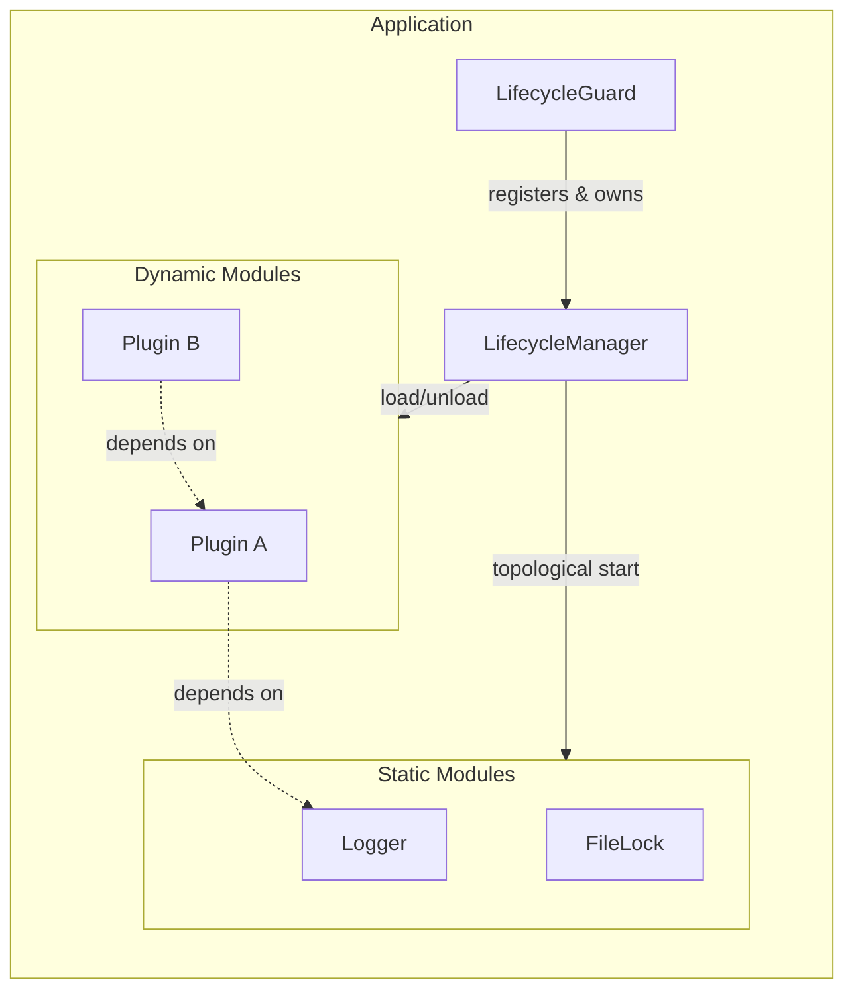
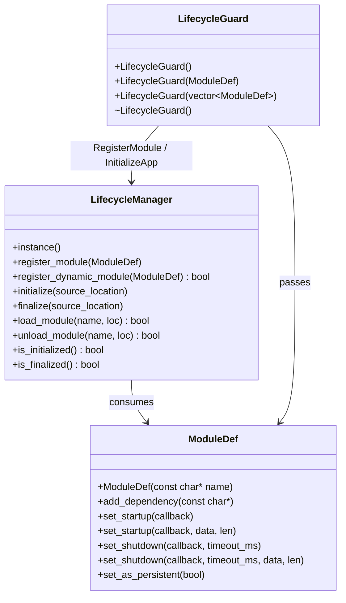
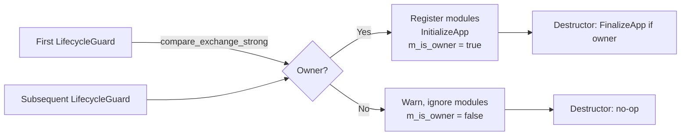
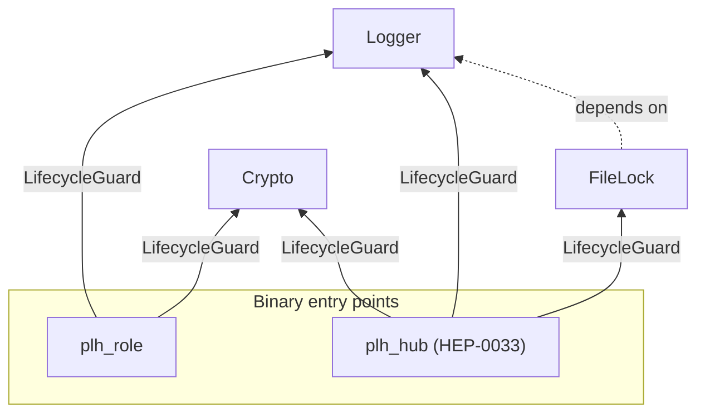
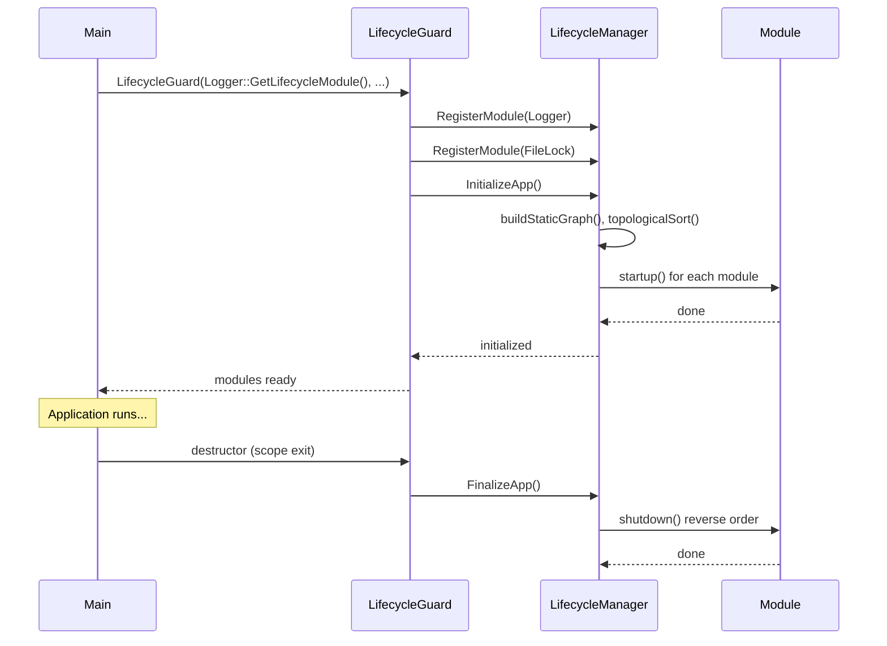
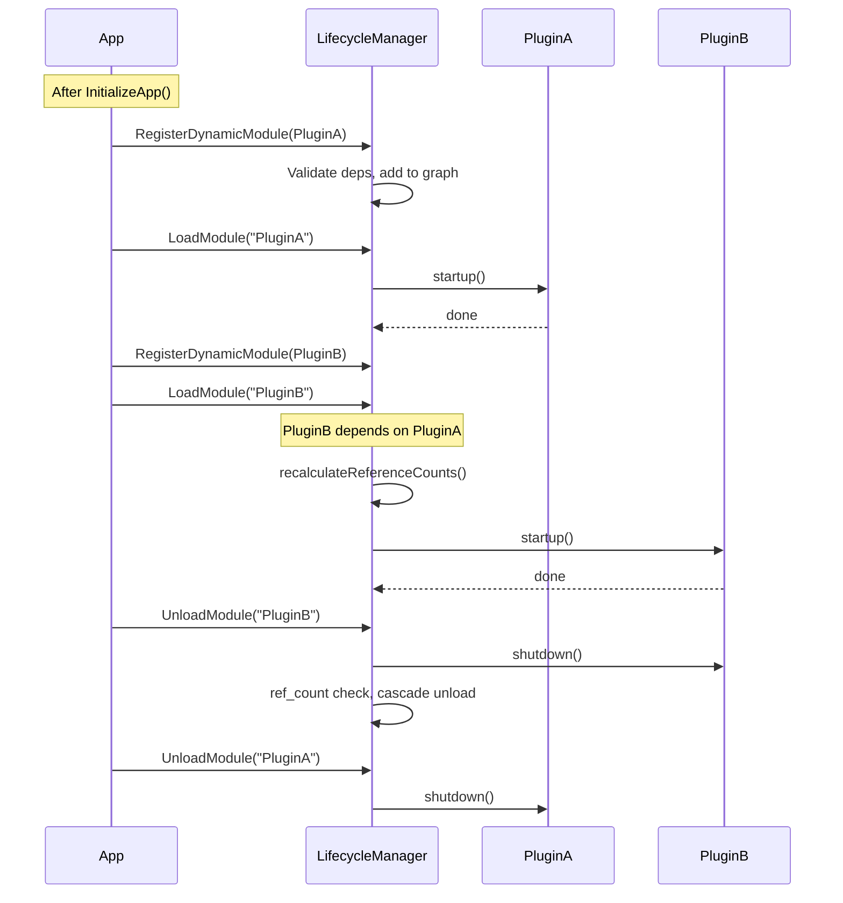

# HEP-CORE-0001: A Hybrid (Static & Dynamic) Module Lifecycle

| Property         | Value                                          |
| ---------------- | ---------------------------------------------- |
| **HEP**          | `HEP-CORE-0001`                                |
| **Title**        | A Hybrid (Static & Dynamic) Module Lifecycle   |
| **Author**       | Quan Qing, AI assistant                        |
| **Status**       | Implemented                                    |
| **Category**     | Core                                           |
| **Created**      | 2026-01-05                                     |
| **Updated**      | 2026-02-12; 2026-04-25 — `pylabhub-hubshell` referenced in §6 examples has been deleted; the hub-side lifecycle pattern returns on the new `plh_hub` binary (HEP-CORE-0033 §15 Phase 9). The lifecycle model itself is unchanged. |
| **C++-Standard** | C++20                                           |

---

## Implementation status

All described APIs are implemented in `src/include/utils/lifecycle.hpp`, `src/include/utils/module_def.hpp`, and three implementation files:
- `src/utils/service/lifecycle.cpp` — public API, ModuleDef, initialize/finalize, log sink
- `src/utils/service/lifecycle_topology.cpp` — buildStaticGraph, topologicalSort, printStatusAndAbort
- `src/utils/service/lifecycle_dynamic.cpp` — all dynamic module operations (load/unload/wait/computeClosure/dynShutdownThread)

They share the private header `src/utils/service/lifecycle_impl.hpp` (not installed).
Static and dynamic modules, `LifecycleGuard` (single/multiple/vector constructors), `MakeModDefList`, and all convenience functions are in use. For current plan and priorities elsewhere, see `docs/TODO_MASTER.md` and `docs/todo/`.

### Source file reference

| File | Layer | Description |
|------|-------|-------------|
| `src/include/utils/lifecycle.hpp` | L2 (public) | `LifecycleManager`, `LifecycleGuard`, `MakeModDefList`, convenience wrappers |
| `src/include/utils/module_def.hpp` | L2 (public) | `ModuleDef` builder, `LifecycleCallback` typedef, constants |
| `src/utils/service/lifecycle_impl.hpp` | internal | `LifecycleManagerImpl`, `InternalGraphNode`, `DynamicModuleStatus` enum |
| `src/utils/service/lifecycle.cpp` | impl | `ModuleDef` API, `register_module`, `initialize`/`finalize`, log sink |
| `src/utils/service/lifecycle_topology.cpp` | impl | `buildStaticGraph()`, Kahn's `topologicalSort()`, cycle detection |
| `src/utils/service/lifecycle_dynamic.cpp` | impl | `loadModule`/`unloadModule`, ref counting, `dynShutdownThreadMain()` |
| `tests/test_layer1_base/test_module_def.cpp` | test | `ModuleDef` builder validation (name, deps, move semantics) |
| `tests/test_layer2_service/test_lifecycle.cpp` | test | Static module init/finalize (multi-process workers) |
| `tests/test_layer2_service/test_lifecycle_dynamic.cpp` | test | Dynamic load/unload, ref counting, async shutdown |

---

## Abstract

This HEP specifies the **LifecycleManager**: a dependency-aware startup/shutdown system that supports **static** modules (registered before init, started once) and **dynamic** modules (registered after init, load/unload at runtime). It provides a single dependency graph, topological ordering, and optional reference counting for dynamic modules.

---

## Motivation

| Use Case | Description |
|----------|-------------|
| **Core services** | Logger, FileLock, etc. — started once with the application |
| **Optional / heavy features** | Load on demand; unload when ref_count drops to zero |
| **Plugin systems** | Third-party extensions registered and loaded after static core is up |
| **Mode-specific code** | Different tool sets for "Editing" vs "Playback" without restart |

---

## Design philosophy

### Goals

| Goal | Description |
|------|-------------|
| **Unified dependency graph** | Static and dynamic modules in one graph; topological sort determines start order |
| **Graceful failure** | Dynamic load failures return `false`; invalid names throw or return false |
| **Strict ordering** | Dynamic modules registered only *after* static init; static cannot depend on dynamic |
| **Reference counting** | Dynamic modules unload only when ref_count drops to zero (unless persistent) |
| **ABI stability** | Pimpl for `LifecycleManager` and `ModuleDef`; public API remains stable |

### Constraints

- **Module registration is NOT thread-safe** — must occur before `initialize()`.
- **Dynamic load/unload IS thread-safe** — protected by internal mutex.
- **RecursionGuard** prevents re-entrant calls from startup/shutdown callbacks (deadlock prevention).
- **Static modules cannot depend on dynamic modules**; dynamic may depend on static.

---

## Architecture overview

### Component diagram



### Class and API relationships



### LifecycleGuard owner semantics



Only the **first** `LifecycleGuard` to be constructed becomes the owner (registers modules and calls `InitializeApp`). Its destructor calls `FinalizeApp`. Any later guard is a no-op for registration and finalization.

### Concrete module dependency graph (pylabhub)

The project registers these static modules via `GetLifecycleModule()`. The topological sort
determines startup order; shutdown runs in reverse.



Each binary constructs a `LifecycleGuard` with its required `ModuleDef` set.
The topological sort ensures Logger starts before FileLock (which depends on it).
Crypto has no dependencies and can start in any position. Schema records are
not a lifecycle module — they live in `HubState.schemas` and are mutated only
via the broker (HEP-CORE-0034 §11; supersedes the HEP-0016-era `SchemaStore`
singleton, which is removed by HEP-0034 Phase 4).

### StartupLogFileSink — early log sink switching

`Logger::GetStartupLogFileSinkModule()` returns a `ModuleDef` named `"StartupLogFileSink"`
that depends on `"pylabhub::utils::Logger"` and switches the log sink to a file immediately
after Logger initialises — before any other module emits log messages.

Modules that produce startup log output (e.g. ZMQContext, DataExchangeHub) can declare
`add_dependency("StartupLogFileSink")` so the topological sort places them after the sink
switch, ensuring all their output goes to the file rather than the console.

**Factory method** (in `Logger`):

```cpp
// Plain append-mode log file:
static ModuleDef GetStartupLogFileSinkModule(
    const std::string &log_file_path,
    std::optional<RotatingLogConfig> rotating = std::nullopt);

// Rotating log file:
mods.push_back(Logger::GetStartupLogFileSinkModule(
    "/var/log/hub.log", Logger::RotatingLogConfig{10*1024*1024, 5}));
```

**RotatingLogConfig** fields: `max_file_size_bytes` (default 10 MiB),
`max_backup_files` (default 5 — matches `config::LoggingConfig`'s user-facing
default so JSON-driven and direct C++ users see the same retention),
`timestamped_names` (default `false`, numeric `base.1/base.2/...` rotation),
`use_flock` (default `true`).

The `-1` sentinel in JSON config (`"logging.backups": -1`) maps to
`LoggingConfig::kKeepAllBackups` (`SIZE_MAX`), meaning "never delete rotated
files". JSON value `0` is rejected by the parser. Direct C++ users may still
pass `0` to the sink, which is interpreted defensively as "no backup".

**Usage in role binaries** (`role_main_helpers.hpp`):

```cpp
auto zmq_mod = pylabhub::hub::GetZMQContextModule();
auto hub_mod = pylabhub::hub::GetLifecycleModule();
if (!log_file.empty())
{
    zmq_mod.add_dependency("StartupLogFileSink");
    hub_mod.add_dependency("StartupLogFileSink");
}
auto mods = MakeModDefList(Logger::GetLifecycleModule(), ..., std::move(zmq_mod), std::move(hub_mod));
if (!log_file.empty())
    mods.push_back(Logger::GetStartupLogFileSinkModule(log_file));
```

**Usage in hubshell** (rotating):

```cpp
mods.push_back(Logger::GetStartupLogFileSinkModule(
    hub_log_path, Logger::RotatingLogConfig{}));
```

---

## Public API reference

### LifecycleManager

| Method | Signature | Description |
|--------|-----------|-------------|
| `instance` | `static LifecycleManager& instance()` | Singleton accessor |
| `register_module` | `void register_module(ModuleDef&&)` | Register static module; must be called *before* `initialize()` |
| `register_dynamic_module` | `bool register_dynamic_module(ModuleDef&&)` | Register dynamic module; valid *after* `initialize()`, *before* `finalize()`. Returns false on failure (e.g. duplicate name, missing dependency). |
| `initialize` | `void initialize(std::source_location loc)` | Start all static modules in dependency order. Idempotent. |
| `finalize` | `void finalize(std::source_location loc)` | Shut down all modules in reverse order. Idempotent. |
| `load_module` | `bool load_module(const char* name, std::source_location loc)` | Load dynamic module and dependencies. Thread-safe, idempotent. Returns false if invalid name or load failed. Must not be called from startup/shutdown callback. |
| `unload_module` | `bool unload_module(const char* name, std::source_location loc)` | Unload dynamic module if ref_count is zero; runs shutdown, may cascade. Returns false if still in use. Must not be called from startup/shutdown callback. |
| `is_initialized` | `bool is_initialized()` | True if `initialize()` has been called |
| `is_finalized` | `bool is_finalized()` | True if `finalize()` has been called |

### ModuleDef

| Method | Signature | Description |
|--------|-----------|-------------|
| Constructor | `explicit ModuleDef(const char* name)` | Unique module name. C-string null-terminated, length ≤ `MAX_MODULE_NAME_LEN` (256). Throws `std::invalid_argument` / `std::length_error` if invalid. |
| `add_dependency` | `void add_dependency(const char* dependency_name)` | Add dependency by name. Null or oversized throws. |
| `set_startup` | `void set_startup(LifecycleCallback startup_func)` | Startup callback (no argument; `nullptr` passed). |
| `set_startup` | `void set_startup(LifecycleCallback startup_func, const char* data, size_t len)` | Startup callback with string argument. `len` must not exceed `MAX_CALLBACK_PARAM_STRLEN` (1024). |
| `set_shutdown` | `void set_shutdown(LifecycleCallback shutdown_func, unsigned int timeout_ms)` | Shutdown callback and timeout in milliseconds. |
| `set_shutdown` | `void set_shutdown(..., const char* data, size_t len)` | Shutdown callback with string argument. |
| `set_as_persistent` | `void set_as_persistent(bool persistent = true)` | Dynamic module: if persistent, not unloaded when ref_count reaches zero; only on finalize. |

**Constants**

| Constant | Value | Description |
|----------|-------|-------------|
| `ModuleDef::MAX_MODULE_NAME_LEN` | 256 | Max length (excluding null) for module and dependency names |
| `ModuleDef::MAX_CALLBACK_PARAM_STRLEN` | 1024 | Max length for callback string arguments |

**Callback type:** `typedef void (*LifecycleCallback)(const char* arg);` — C-style for ABI stability; `arg` may be `nullptr` when no data provided.

### LifecycleGuard

| Constructor | Description |
|-------------|-------------|
| `LifecycleGuard(std::source_location loc = ...)` | No modules; if first guard, calls `InitializeApp()` only |
| `explicit LifecycleGuard(ModuleDef&& module, std::source_location loc = ...)` | Single module; if owner, registers it and calls `InitializeApp()` |
| `explicit LifecycleGuard(std::vector<ModuleDef>&& modules, std::source_location loc = ...)` | Multiple modules; if owner, registers all and calls `InitializeApp()` |

Destructor: if this guard is the owner (`m_is_owner`), calls `FinalizeApp(loc)`. Non-copyable, non-movable.

### Convenience functions

| Function | Wrapper for | Notes |
|----------|-------------|--------|
| `RegisterModule(ModuleDef&&)` | `LifecycleManager::instance().register_module()` | Preferred for static registration |
| `InitializeApp(loc)` | `LifecycleManager::instance().initialize(loc)` | Default `loc = std::source_location::current()` |
| `FinalizeApp(loc)` | `LifecycleManager::instance().finalize(loc)` | |
| `IsAppInitialized()` | `LifecycleManager::instance().is_initialized()` | |
| `IsAppFinalized()` | `LifecycleManager::instance().is_finalized()` | |
| `RegisterDynamicModule(ModuleDef&&)` | `LifecycleManager::instance().register_dynamic_module()` | Returns bool |
| `LoadModule(name, loc)` | `LifecycleManager::instance().load_module()` | Returns bool |
| `UnloadModule(name, loc)` | `LifecycleManager::instance().unload_module()` | Returns bool |

### MakeModDefList

| Function | Description |
|----------|-------------|
| `MakeModDefList(Mods&&... mods)` | Builds `std::vector<ModuleDef>` from one or more `ModuleDef` rvalues. Use with `LifecycleGuard(std::move(vec))` or `LifecycleGuard(MakeModDefList(Logger::GetLifecycleModule(), FileLock::GetLifecycleModule()))`. |

---

## Internal implementation details

(Not part of the stable API; may change.)

### Graph node (conceptual)

```cpp
struct InternalGraphNode {
    std::string name;
    std::function<void()> startup;
    InternalModuleShutdownDef shutdown;
    std::vector<std::string> dependencies;
    std::vector<InternalGraphNode*> dependents;
    std::atomic<ModuleStatus> status;
    bool is_dynamic = false;
    bool is_persistent = false;
    std::atomic<DynamicModuleStatus> dynamic_status;
    std::atomic<int> ref_count;
};

enum class DynamicModuleStatus {
    UNLOADED,
    LOADING,          // Startup in progress (cycle-detection sentinel)
    LOADED,
    FAILED,           // Startup threw or returned error
    UNLOADING,        // Marked for shutdown; dyn-shutdown thread will process
    SHUTDOWN_TIMEOUT, // Shutdown callback timed out; module may be in undefined state
    FAILED_SHUTDOWN   // Shutdown callback threw; module may be in undefined state
};
```

Cycle detection during `load_module` uses `LOADING` to detect recursive load.

### Owner-managed teardown — opt-in exception to "validator-fail = anomaly"

By default, a userdata-validator returning false at unload time is treated as an **anomaly**: the lifecycle layer logs a WARN, marks the module contaminated, sets status `FAILED_SHUTDOWN`, and retains the entry in the graph for diagnostics. `wait_for_unload` reflects this via `ShutdownFailed`.  Re-registering with the same name fails because the entry persists.

A **module owner** (a C++ class whose destructor performs the real teardown synchronously, with the registered shutdown callback being a contractual no-op) can opt out of this anomaly classification by calling:

```cpp
ModuleDef mod(name, this, my_validator);
mod.set_startup(...);
mod.set_shutdown(my_shutdown_noop, timeout);
mod.set_owner_managed_teardown(true);  // opt-in flag
LifecycleManager::instance().register_dynamic_module(std::move(mod));
```

When the flag is `true`, a validator-fail at unload time is treated as a **success-without-callback**:

| Aspect                        | Default (flag `false`)             | Owner-managed (flag `true`)         |
|-------------------------------|------------------------------------|-------------------------------------|
| Logged severity               | WARN                               | DEBUG                               |
| Module status                 | `FAILED_SHUTDOWN`                  | (entry removed)                     |
| Contamination                 | yes                                | no                                  |
| Graph entry retention         | retained                           | erased                              |
| `wait_for_unload` outcome     | (closure not cleaned, eventually `Unloading` after timeout) | `NotRegistered` (clean) |
| Re-registration with same name| fails (entry persists)             | succeeds                            |
| Cascaded dependency unload    | halted ("destabilized" warning)    | propagates as in success path       |

**When to use the flag:**

- The module's registered shutdown callback is documented to be a no-op (cannot mutate state) AND
- The C++ owner's destructor performs the real teardown synchronously BEFORE letting the validator return false, AND
- The validator's only failure mode is the owner's deliberate "I'm gone, skip my callback" signal — not arbitrary memory corruption.

The canonical example is `pylabhub::utils::ThreadManager`: its destructor calls `drain()` (synchronous bounded-join of all spawned threads) BEFORE flipping `impl_alive=false`; the lifecycle-dispatched `tm_shutdown` thunk is a documented no-op (see `src/utils/service/thread_manager.cpp::tm_shutdown` and `tm_impl_validate`). Without the flag, every `~ThreadManager` would log a WARN as the lifecycle layer treated the deliberate validator-fail as anomaly.

**When NOT to use the flag:**

- If the validator's failure could mean genuine corruption (memory bug, double-destroy, bad userdata pointer), the flag would silently mask it. Modules with that failure-mode profile must NOT opt in — keep the default anomaly classification so corruption surfaces as a WARN.

**Implementation:**
- Field on `ModuleDef` (and persisted into `InternalModuleDef` / `InternalGraphNode`).
- `processOneUnloadInThread` reads the flag in Step 1 and branches in the validator-fail block — the owner-managed branch performs the same graph cleanup as the success path via the shared `cleanupAfterUnload_` helper.
- See `src/utils/service/lifecycle_dynamic.cpp` for the implementation; `tests/test_layer2_service/test_lifecycle_dynamic.cpp` covers both branches.

---

## Sequence of operations

### Static module lifecycle



### Dynamic module load / unload



---

## Examples

### Static modules (LifecycleGuard + MakeModDefList)

```cpp
#include "plh_service.hpp"

int main() {
    pylabhub::utils::LifecycleGuard app_lifecycle(
        pylabhub::utils::MakeModDefList(
            pylabhub::utils::Logger::GetLifecycleModule(),
            pylabhub::utils::FileLock::GetLifecycleModule()
        )
    );

    LOGGER_INFO("Application started.");
    // ... application logic ...
    return 0;  // FinalizeApp() called automatically
}
```

### Dynamic module

```cpp
namespace MyPlugin {
    void startup(const char*) { LOGGER_INFO("MyPlugin started"); }
    void shutdown(const char*) { LOGGER_INFO("MyPlugin shut down"); }

    pylabhub::utils::ModuleDef GetLifecycleModule() {
        pylabhub::utils::ModuleDef def("MyPlugin");
        def.add_dependency("Logger");
        def.set_startup(startup);
        def.set_shutdown(shutdown, 1000);
        return def;
    }
}

int main() {
    pylabhub::utils::LifecycleGuard app_lifecycle(
        pylabhub::utils::Logger::GetLifecycleModule()
    );

    if (pylabhub::utils::RegisterDynamicModule(MyPlugin::GetLifecycleModule())) {
        if (pylabhub::utils::LoadModule("MyPlugin")) {
            // Use plugin...
            pylabhub::utils::UnloadModule("MyPlugin");
        }
    }
    return 0;
}
```

---

## Testing implications

Lifecycle modules (`Logger`, `FileLock`, `JsonConfig`, `CryptoUtils`, `ZMQContext`,
`HubConfig`, hub `DataBlock`) are process-global singletons owned
by a single `LifecycleManager`. The design choices in this HEP constrain how
tests can exercise any code that touches a lifecycle-backed module.

### The contract

**Any test whose body transitively requires a lifecycle module must run inside
a spawned worker subprocess.** The worker owns its own `LifecycleGuard`; the
test-runner process owns none.

This contract is not stylistic — it is load-bearing:

- **Singleton ownership.** `LifecycleGuard` is designed to construct once per
  process and finalize once on scope exit. A test that re-constructs the guard
  per-`TEST_F` (e.g. from a fixture `SetUp/TearDown`) breaks the
  initialize-exactly-once invariant that `ModuleDef::startup` callbacks assume.
  Modules that register dynamic dependencies at startup (e.g. `ThreadManager`)
  observe a half-registered state on the second `initialize()` call.
- **Terminal teardown.** `LifecycleGuard`'s reverse-order shutdown is the *final*
  action expected to touch pylabhub state in any process. After it returns, the
  process is expected to exit. Library-global statics for `libzmq`, `luajit`,
  and `libsodium` run destructors outside our control and can hang indefinitely
  at program exit. The test framework calls `_exit()` inside the worker to skip
  these — a path only available if the lifecycle itself owns the process.

  **`_exit()` does NOT bypass our `LifecycleGuard` finalize.** The order in
  `run_gtest_worker` is: test body runs → `LifecycleGuard` destructor invokes
  every registered module's `shutdown` callback in reverse topological order
  (this is the contract under test for any module — `ZMQContext::shutdown`
  calls `zmq_ctx_term`, `Logger::shutdown` flushes + joins the worker thread,
  `FileLock::shutdown` releases pending locks) → `ThreadManager` leak check →
  `_exit(N)`. Only library-global static destructors *outside* our lifecycle
  graph (`libzmq.so`'s own globals, `__attribute__((destructor))` in
  `libsodium`, luajit GC finalizers) are skipped — those are owned by the
  third-party libraries themselves and are not part of the contract any
  pylabhub module has registered with `LifecycleManager`. So a worker that
  exercises `hub::ZMQContext` *does* validate that our init/finalize correctly
  drives `zmq_ctx_term`; what it does not validate is whether libzmq's own
  cleanup hooks run cleanly afterwards (separate concern, not our contract).

  **Silent-shortcircuit catch.** Inside `run_gtest_worker`, three stderr
  markers are emitted in order: `[WORKER_BEGIN] <name>` (before guard
  ctor), `[WORKER_END_OK] <name>` (after `test_logic()` returns without
  throwing), and `[WORKER_FINALIZED] <name>` (after `LifecycleGuard` dtor
  returns). The parent's `expect_worker_ok` requires all three — so a
  body that early-returned, called `GTEST_SKIP`, or ended on an
  unreachable line still exits 0 but does not produce `[WORKER_END_OK]`,
  and the parent test fails. This means correctness is asserted by *facts*
  (markers + log content), not just by exit code. Legacy multi-process
  IPC workers that bypass `run_gtest_worker` (e.g. process-shared mutex
  tests where the worker holds a resource and dies) opt out via
  `ExpectLegacyWorkerOk` / `require_completion_markers=false`; new tests
  must always route through `run_gtest_worker` so the catch applies.
- **Crash isolation.** A panic, `abort()`, or even a clean `finalize()` inside
  one test must not corrupt the singleton state observed by the next test.
  Per-test processes are the only mechanism that enforces this.

### Consequences for test authors

| Intent                                                                | Pattern                                                                |
|-----------------------------------------------------------------------|------------------------------------------------------------------------|
| Pure function / struct / algorithm, no `LOGGER_*`, no `FileLock`      | In-process gtest `TEST` / `TEST_F` — no guard, no worker               |
| Thread-racing only, no module calls                                   | In-process `TEST_F` with `ThreadRacer` — still no guard                |
| Any call path that reaches a lifecycle module (direct or transitive)  | Spawn a worker subprocess that owns the guard                          |

The test framework exposes two entry points for worker bodies:

- `run_gtest_worker(fn, name, mods...)` — standard path: installs the guard
  over `mods`, runs `fn`, catches gtest assertions, checks for
  `ThreadManager` leaks, then `_exit()`s with the appropriate code.
- `run_worker_bare(fn, name)` — bare path: no implicit guard; used when the
  test body *itself* exercises staged or partial initialization.

Both APIs live in `tests/test_framework/shared_test_helpers.h`. The comment
block at lines 303–322 of that file explains *why* workers `_exit()` instead of
returning, and is the authoritative reference for the library-global
teardown-hang issue.

### What this rules out

- In-process `LifecycleGuard` in test fixtures (per-`TEST_F` or
  `SetUpTestSuite`-owned). The fact that such a test passes in isolation says
  nothing — the second test in the suite, or a teardown-order change, reveals
  the issue.
- Fabricating a class that owns a `ThreadManager`, `Messenger`, or
  `RoleHostBase` without a guard. Those types transitively require
  `Logger`/`JsonConfig` and will either silently half-register or abort.
- `EXPECT_DEATH` for aborts in lifecycle-backed code. Death tests fork mid-test
  and inherit a partially-initialized state; the expected behaviour is instead
  to spawn a dedicated worker that deliberately aborts, and have the parent
  assert on the subprocess's exit code and stderr.

For the end-to-end mechanics (worker-file layout, dispatcher registration,
CMake wiring, how `IsolatedProcessTest::SpawnWorker` + `ExpectWorkerOk` work)
see **`docs/README/README_testing.md` §4 "Choosing a test pattern"** and the
code-level reference at `tests/test_framework/test_patterns.h`.

---

## Risk analysis and mitigations

| Risk | Mitigation |
|------|------------|
| Client forgets `unload_module()` | Resource leak for session; `finalize()` provides last-resort cleanup |
| Dependency loop between dynamic modules | `load_module` checks `LOADING` status to detect cycles |
| Callback calls `load_module`/`unload_module` | RecursionGuard detects and blocks (prevents deadlock) |
| Concurrent graph mutations | Internal mutex serializes all dynamic operations |
| Static object destructors after FinalizeApp | Documented: avoid destructors of static objects depending on lifecycle services |

---

## Copyright

This document is placed in the public domain or under the CC0-1.0-Universal license, whichever is more permissive.
