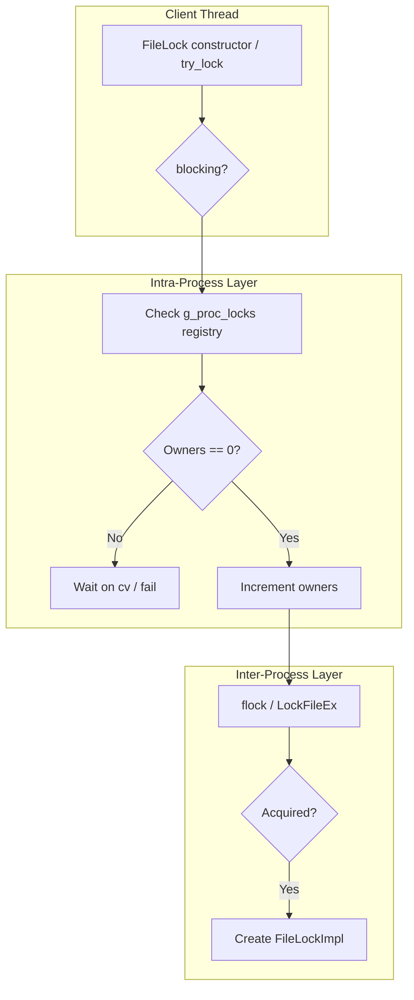
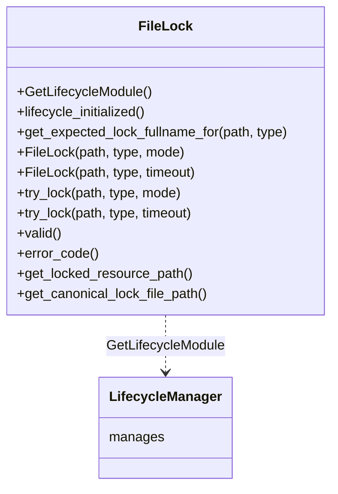
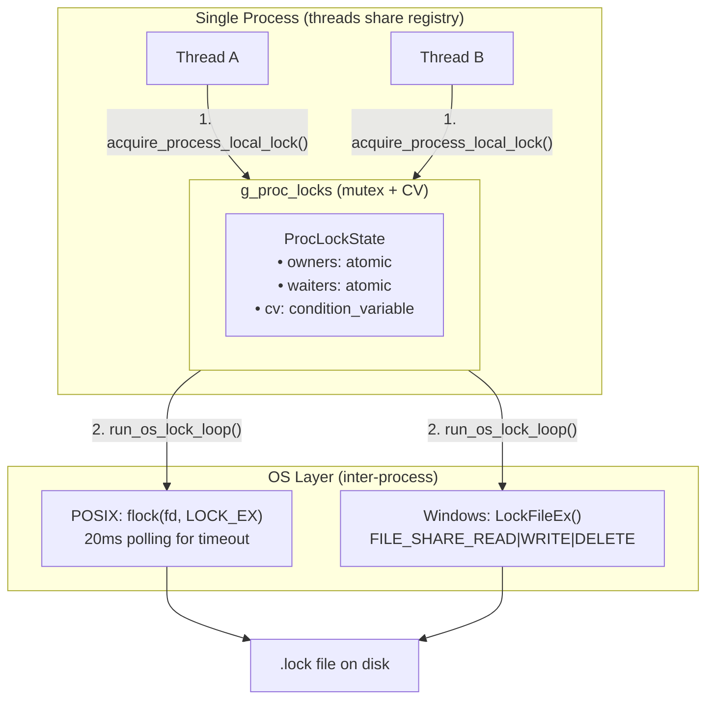
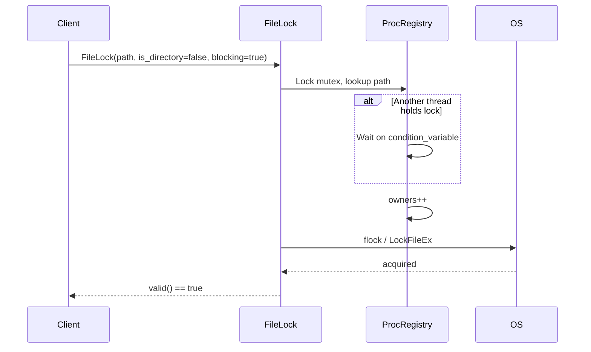
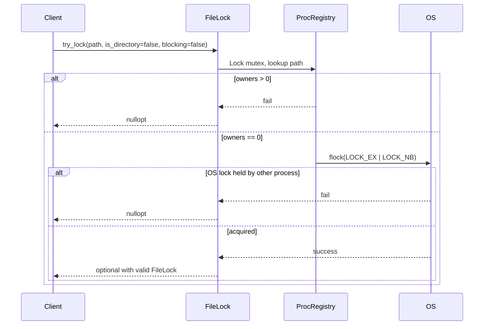

| Property         | Value                                          |
| ---------------- | ---------------------------------------------- |
| **HEP**          | `HEP-CORE-0003`                                |
| **Title**        | Cross-Platform RAII File Locking (FileLock)    |
| **Author**       | Quan Qing, AI assistant                        |
| **Status**       | Implemented                                    |
| **Category**     | Core                                           |
| **Created**      | 2026-01-30                                     |
| **Updated**      | 2026-02-12                                     |
| **C++-Standard** | C++20                                           |

---

## Implementation status

All described APIs are implemented in `src/include/utils/file_lock.hpp` and `src/utils/service/file_lock.cpp`. Two-layer locking (intra-process registry + OS `flock`/`LockFileEx`), RAII, `try_lock` returning `std::optional<FileLock>`, and timeout constructors are in use. For current plan and priorities, see `docs/TODO_MASTER.md` and `docs/todo/`.

### Source file reference

| File | Layer | Description |
|------|-------|-------------|
| `src/include/utils/file_lock.hpp` | L2 (public) | `FileLock` class, `try_lock` factory, lifecycle module |
| `src/utils/service/file_lock.cpp` | impl | `FileLockImpl` (Pimpl), `ProcLockState` registry, OS lock loops, custom deleter |
| `tests/test_layer2_service/test_filelock.cpp` | test | Multi-process lock contention (worker spawning) |
| `tests/test_layer2_service/test_filelock_singleprocess.cpp` | test | Same-process thread safety, API correctness |
| `tests/test_layer2_service/workers/filelock_workers.h` | test | Worker entry-point declarations |
| `tests/test_layer2_service/workers/filelock_workers.cpp` | test | Worker implementations (blocking, timeout, move) |

---

## Abstract

This Hub Enhancement Proposal (HEP) outlines the design and implementation of the `FileLock` module, a cross-platform, RAII-style advisory file locking mechanism. `FileLock` provides robust synchronization for both multi-process and multi-threaded applications interacting with shared filesystem resources, ensuring data integrity and preventing race conditions.

## Motivation

Multiple processes or threads often need to access and modify shared files (e.g., configuration files, data caches). Without proper synchronization, concurrent access can lead to data corruption. Platform-specific locking primitives are cumbersome to use correctly and portably.

| Need | FileLock Solution |
|------|-------------------|
| Simple, safe API | RAII: lock acquired in constructor, released in destructor |
| Cross-platform | `flock` (POSIX) / `LockFileEx` (Windows) |
| Inter- and intra-process | Two-layer model: OS lock + process-local registry |
| Blocking, non-blocking, timed | `blocking=true`, `blocking=false`, timeout constructor |

---

## Design Philosophy

### Design Goals

| Goal | Description |
|------|-------------|
| **RAII** | Lock acquired in constructor, released in destructor; exception-safe |
| **Two-layer locking** | OS-level for inter-process; process registry for intra-process consistency |
| **Advisory lock** | Cooperating processes must use FileLock; non-cooperating processes can ignore |
| **Separate lock file** | Target `data.json` → lock file `data.json.lock`; avoids content interference |
| **Path canonicalization** | `/a/./b` and `/a/b` contend for same lock |
| **ABI stability** | Pimpl idiom; `FileLockImpl` hides platform details |

### Design Considerations

- **Why separate lock file?** Avoids conflicts with read/write on the data file. `.lock` files are harmless if left on disk; do not remove them while any process may be running. If cleanup is desired (e.g., after a crash), use an external script when nothing is running.
- **Why process-local registry?** OS file locks can behave inconsistently for threads in the same process (e.g., POSIX `flock`); the registry ensures Blocking/NonBlocking semantics work identically.
- **Why advisory?** Mandatory locking is OS-specific and less portable; FileLock assumes cooperative use.
- **NFS warning:** `flock` may be unreliable over NFS; use local filesystem for critical locks.
- **Lock file cleanup:** `.lock` files are harmless if left on disk; they do not affect correctness. Do not remove them while any process may be running, as that could break cross-process lock semantics. If cleanup is desired (e.g., after a crash), use an external script when nothing is running.

### Highlights

- **Custom deleter on `unique_ptr<FileLockImpl>`** — Ensures lock release logic runs when the Pimpl is destroyed, even on move.
- **`try_lock` returns `std::optional<FileLock>`** — Modern C++ idiom for optional acquisition.
- **`LOCK_POLLING_INTERVAL` (20ms)** — Balance between responsiveness and CPU usage for timed/NonBlocking on POSIX.

---

## Architecture Overview

### Lock Acquisition Flow



### Class and API Relationships



### Two-Layer Locking Detail



Layer 1 (intra-process) serializes threads within the same process using `std::mutex` +
`std::condition_variable`. Layer 2 (inter-process) uses the OS advisory lock on the `.lock`
file. Both layers must succeed for `valid()` to return `true`.

### Lock File Naming

| Resource Type | Example Path | Lock File |
|---------------|--------------|-----------|
| File | `/data/config.json` | `/data/config.json.lock` |
| Directory | `/data/cache/` | `/data/cache.dir.lock` |

---

## Public API Reference

### Constructor Parameters (bool-based)

Early drafts of this HEP described `LockMode` and `ResourceType` enums. The implementation
uses plain `bool` parameters instead — simpler and equally expressive.

| Parameter | Type | Default | Description |
|-----------|------|---------|-------------|
| `is_directory` | `bool` | `false` | `true` → directory (`.dir.lock` suffix); `false` → file (`.lock` suffix) |
| `blocking` | `bool` | `true` | `true` → wait indefinitely; `false` → return immediately if lock unavailable |

**Constructor and factory signatures:**

```cpp
// Blocking or non-blocking constructor:
FileLock(const fs::path& path, bool is_directory = false, bool blocking = true) noexcept;

// Timeout constructor:
FileLock(const fs::path& path, bool is_directory, std::chrono::milliseconds timeout) noexcept;

// Non-blocking factory (returns nullopt on failure):
static std::optional<FileLock> try_lock(const fs::path& path,
    bool is_directory = false, bool blocking = true) noexcept;
static std::optional<FileLock> try_lock(const fs::path& path,
    bool is_directory, std::chrono::milliseconds timeout) noexcept;
```

### FileLock Class

| Method | Signature / return | Description |
|--------|--------------------|-------------|
| `GetLifecycleModule` | `static ModuleDef GetLifecycleModule()` | ModuleDef for LifecycleManager |
| `lifecycle_initialized` | `static bool lifecycle_initialized() noexcept` | True if FileLock module is initialized |
| `get_expected_lock_fullname_for` | `static path get_expected_lock_fullname_for(path, bool is_directory = false) noexcept` | Predict canonical lock file path; empty path on failure |
| `FileLock(path, is_dir, blocking)` | `explicit FileLock(path, bool is_directory = false, bool blocking = true) noexcept` | Construct and acquire; blocking or non-blocking |
| `FileLock(path, is_dir, timeout)` | `explicit FileLock(path, bool is_directory, chrono::milliseconds) noexcept` | Construct and acquire with timeout |
| `try_lock` | `static optional<FileLock> try_lock(path, bool is_directory = false, bool blocking = true) noexcept` | Factory; returns optional with valid lock or nullopt |
| `try_lock` | `static optional<FileLock> try_lock(path, bool is_directory, chrono::milliseconds) noexcept` | Factory with timeout |
| `valid` | `bool valid() const noexcept` | True if lock is held |
| `error_code` | `std::error_code error_code() const noexcept` | Error from failed acquisition; empty if valid |
| `get_locked_resource_path` | `optional<path> get_locked_resource_path() const noexcept` | Path of protected resource if valid; else empty optional |
| `get_canonical_lock_file_path` | `optional<path> get_canonical_lock_file_path() const noexcept` | Canonical path of `.lock` file if valid; else empty optional |

**Move semantics:** `FileLock` is movable (transfer of ownership); copy is deleted.

---

## Sequence of Operations

### Blocking Lock Acquisition



### Try-Lock (NonBlocking)



---

## Example: Blocking Lock with Timeout

```cpp
#include "utils/lifecycle.hpp"
#include "utils/file_lock.hpp"
#include "utils/logger.hpp"

void perform_exclusive_work(const std::filesystem::path& resource) {
    pylabhub::utils::LifecycleGuard guard(
        pylabhub::utils::FileLock::GetLifecycleModule(),
        pylabhub::utils::Logger::GetLifecycleModule()
    );

    pylabhub::utils::FileLock lock(resource,
        false,                     // is_directory
        std::chrono::seconds(5));

    if (lock.valid()) {
        // ... safely modify resource ...
    } else {
        LOGGER_ERROR("Failed to acquire lock: {}", lock.error_code().message());
    }
}
```

## Example: Try-Lock (Optional)

```cpp
if (auto lock = pylabhub::utils::FileLock::try_lock(
        path, false,               // is_directory
        false)) {                  // blocking
    LOGGER_INFO("Lock acquired for {}", lock->get_locked_resource_path()->string());
    // ... use resource ...
} else {
    LOGGER_WARN("Lock busy: {}", path.string());
}
```

---

## Internal Usage: JsonConfig Write Transactions

`JsonConfig::consume_write_()` uses `FileLock` to serialize disk I/O across processes.
Rather than blocking indefinitely, it uses a retry-with-timeout strategy:

- **3 retries × 2 s timeout** = 6 s maximum wait
- Each retry logs `LOGGER_WARN` with the attempt number
- On final failure, logs `LOGGER_ERROR` and returns `std::errc::timed_out` via the
  error-code output parameter — the write transaction is aborted, not silently dropped

This ensures config file contention produces visible diagnostics rather than silent hangs.

---

## Risk Analysis and Mitigations

| Risk | Mitigation |
|------|-------------|
| Advisory lock ignored by non-cooperating process | Inherent limitation; document cooperative use |
| Polling overhead (POSIX timed/NonBlocking) | 20ms interval; configurable in source |
| Stale lock files after crash | `.lock` files are harmless; use an external script to remove when nothing is running |
| Blocking CV wait in intra-process registry | Documented in header; bounded by OS thread liveness |
| Unreliable on NFS | Documented warning; recommend local filesystem |
| Self-deadlock (re-acquire same path) | Intra-process registry blocks or fails; no system deadlock |

---

## Copyright

This document is placed in the public domain or under the CC0-1.0-Universal license, whichever is more permissive.
