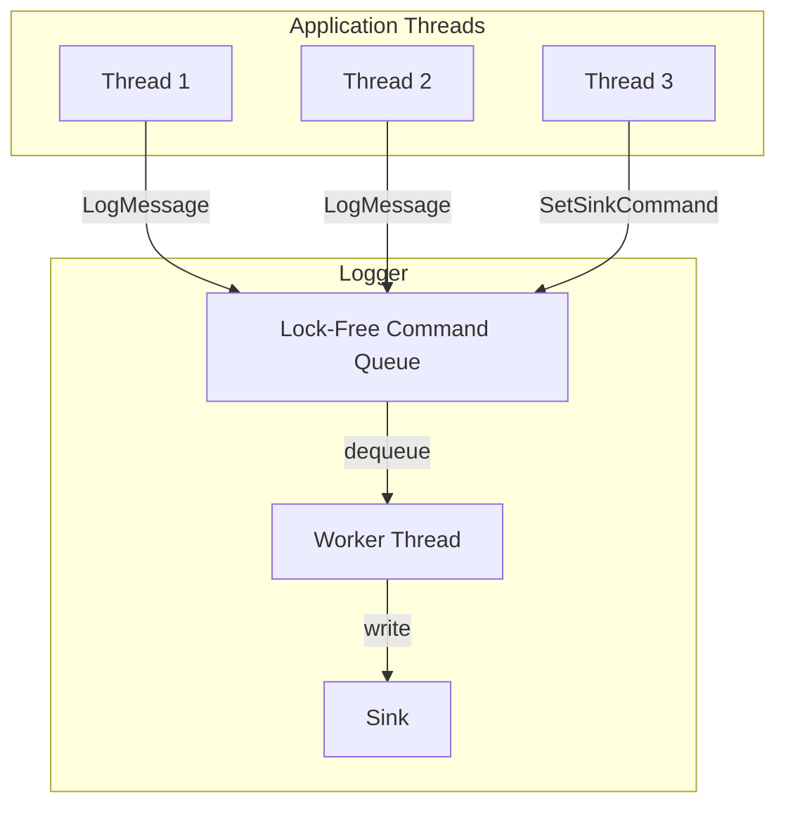
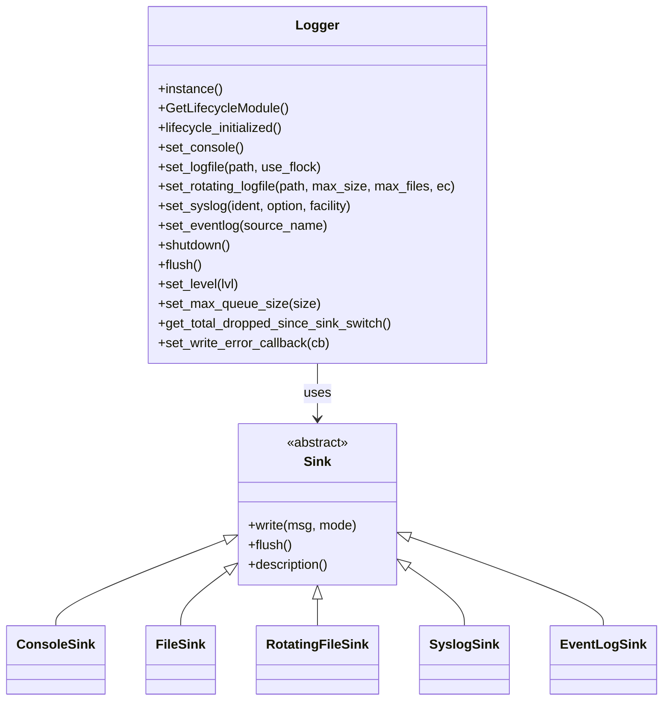
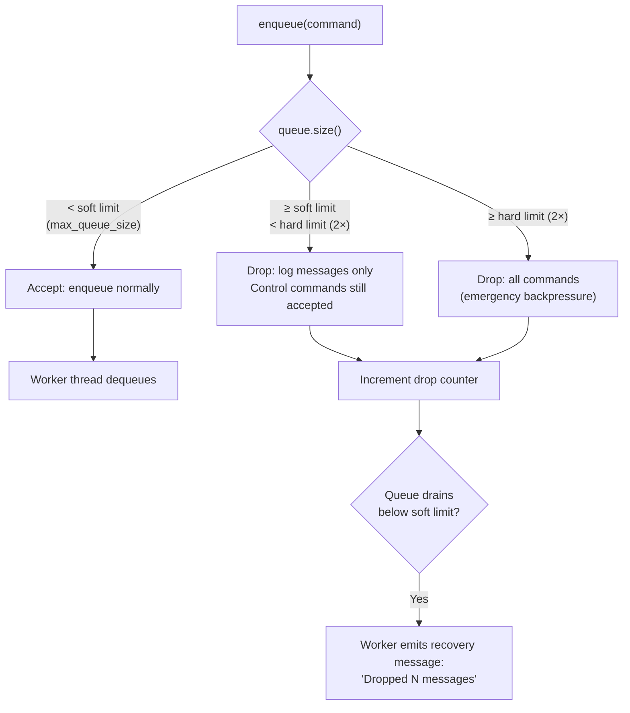
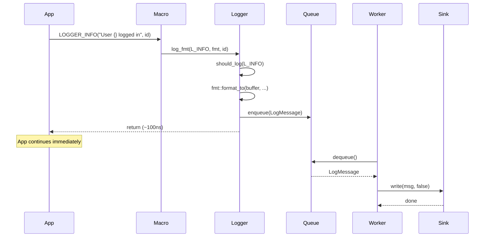
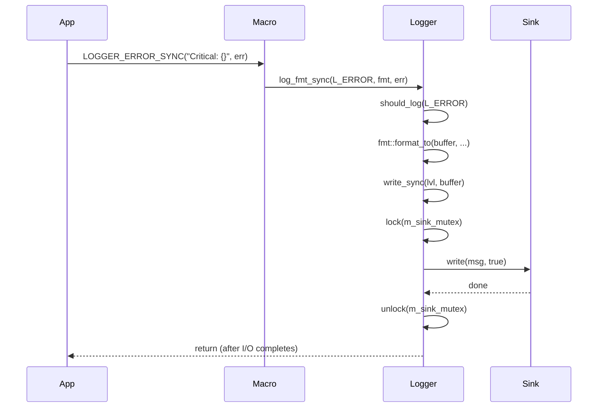
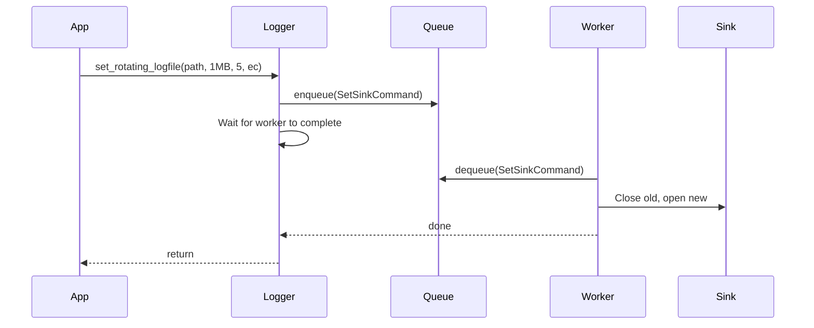
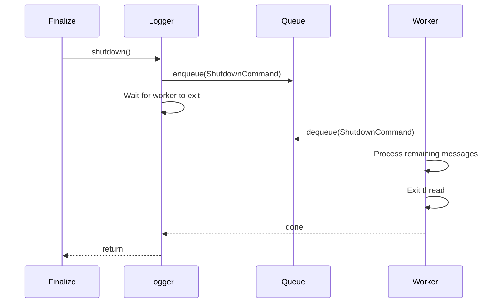

| Property         | Value                                          |
| ---------------- | ---------------------------------------------- |
| **HEP**          | `HEP-CORE-0004`                                |
| **Title**        | High-Performance Asynchronous Logger           |
| **Author**       | Quan Qing, AI assistant                        |
| **Status**       | Implemented                                    |
| **Category**     | Core                                           |
| **Created**      | 2026-01-30                                     |
| **Updated**      | 2026-02-12                                     |
| **C++-Standard** | C++20                                           |

---

## Implementation status

All described APIs and sinks are implemented in `src/include/utils/logger.hpp`, `src/utils/logging/logger.cpp`, and `src/utils/logging/logger_sinks/`. Async queue, sync variants, sink abstraction (Console, File, RotatingFile, Syslog, EventLog), and lifecycle integration are in use.

### Source file reference

| File | Layer | Description |
|------|-------|-------------|
| `src/include/utils/logger.hpp` | L2 (public) | `Logger` singleton, `Level` enum, macros (`LOGGER_*`, `LOGGER_*_SYNC`, `LOGGER_*_RT`) |
| `src/include/utils/logger_sinks/sink.hpp` | L2 (public) | `Sink` abstract base, `LogMessage` struct |
| `src/include/utils/logger_sinks/console_sink.hpp` | L2 (public) | `ConsoleSink` — stderr output |
| `src/include/utils/logger_sinks/file_sink.hpp` | L2 (public) | `FileSink` — single-file append with optional flock |
| `src/include/utils/logger_sinks/base_file_sink.hpp` | L2 (public) | `BaseFileSink` — cross-platform file I/O (POSIX fd / Windows HANDLE) |
| `src/include/utils/logger_sinks/rotating_file_sink.hpp` | L2 (public) | `RotatingFileSink` — size-based rotation with numbered backups |
| `src/include/utils/logger_sinks/syslog_sink.hpp` | L2 (public) | `SyslogSink` — POSIX syslog (conditional compile) |
| `src/include/utils/logger_sinks/event_log_sink.hpp` | L2 (public) | `EventLogSink` — Windows Event Log (conditional compile) |
| `src/utils/logging/logger.cpp` | impl | `Logger::Impl`, worker thread, command queue, `CallbackDispatcher` |
| `src/utils/logging/logger_sinks/sink.cpp` | impl | `format_logmsg()`, `level_to_string_internal()` |
| `src/utils/logging/logger_sinks/base_file_sink.cpp` | impl | Cross-platform open/write/close (POSIX `open(2)` / Windows `CreateFileW`) |
| `src/utils/logging/logger_sinks/file_sink.cpp` | impl | `FileSink::write()` delegation to `BaseFileSink` |
| `src/utils/logging/logger_sinks/rotating_file_sink.cpp` | impl | Rotation logic: close, rename backups, reopen |
| `src/utils/logging/logger_sinks/syslog_sink.cpp` | impl | `openlog()`/`syslog()`/`closelog()` (POSIX) |
| `src/utils/logging/logger_sinks/event_log_sink.cpp` | impl | `RegisterEventSourceW()`/`ReportEventW()` (Windows) |
| `tests/test_layer2_service/test_logger.cpp` | test | 14 test cases (async, sync, rotation, drop, stress, flock) |
| `tests/test_layer2_service/workers/logger_workers.h` | test | Worker declarations for multi-process tests |
| `tests/test_layer2_service/workers/logger_workers.cpp` | test | Worker implementations |

---

## Abstract

This Hub Enhancement Proposal (HEP) describes the design of `pylabhub::utils::Logger`, a high-performance, asynchronous, thread-safe logging framework. Its core architecture uses a decoupled command queue and a dedicated worker thread, ensuring that logging operations have minimal performance impact on application-critical threads. The logger is extensible through a sink-based architecture and integrates with the `LifecycleManager` for graceful startup and shutdown.

## Motivation

Naive logging that performs I/O directly on the calling thread introduces significant latency. In multi-threaded, high-throughput environments, this harms performance and responsiveness.

| Need | Logger Solution |
|------|-----------------|
| Low-latency logging | Async: format + enqueue only (~50-200 ns) |
| Thread safety | Lock-free queue; single worker consumes |
| Extensibility | Sink abstraction (Console, File, RotatingFile, Syslog, EventLog) |
| Robustness | Bounded queue; drop strategy when full; graceful shutdown flush |
| Type safety | Compile-time format validation via `fmt::format_string` |

---

## Design Philosophy

### Design Goals

| Goal | Description |
|------|-------------|
| **Asynchronous by default** | Logging macros enqueue; worker thread performs I/O |
| **Single worker thread** | All I/O isolated; serializes access to sinks |
| **Sink abstraction** | Polymorphic `Sink` base; concrete implementations for each destination |
| **Bounded queue** | Configurable max size; drop when full; recovery message when capacity returns |
| **Compile-time format validation** | `LOGGER_INFO(FMT_STRING(fmt), ...)` validates at compile time |
| **ABI stability** | Pimpl idiom; `Logger::Impl` hides queue, mutexes, worker |

### Design Considerations

- **Why single worker?** Simplifies serialization; I/O is typically the bottleneck, not the worker. Multiple workers would add complexity (ordering, sink contention).
- **Why drop when full?** Prevents unbounded memory growth; application stability over guaranteed delivery in extreme burst scenarios.
- **Why tiered drop strategy?** Soft limit: drop only log messages; hard limit (2×): drop all commands. Ensures control operations (sink switch, flush) can complete under load.
- **Before init:** Logging macros silently drop; config methods (set_level, set_logfile, flush) call `PLH_PANIC`.

### Highlights

- **Compile-time level filtering** — `LOGGER_COMPILE_LEVEL` strips logs below threshold at compile time (zero runtime cost).
- **Synchronous variants** — `LOGGER_*_SYNC` bypass queue for critical messages (e.g., before abort).
- **Runtime format** — `LOGGER_*_RT` accepts `fmt::string_view` for dynamic format strings.
- **Callback on write error** — `set_write_error_callback` runs on dedicated thread to avoid deadlock if callback logs.

---

## Synchronous Logging (LOGGER_*_SYNC)

### Purpose

The synchronous variants (`LOGGER_TRACE_SYNC`, `LOGGER_DEBUG_SYNC`, `LOGGER_INFO_SYNC`, `LOGGER_WARN_SYNC`, `LOGGER_ERROR_SYNC`, `LOGGER_SYSTEM_SYNC`) provide a **blocking** path for urgent messages that must be written immediately. They bypass the asynchronous queue entirely.

### When to Use

| Use Case | Rationale |
|----------|-----------|
| **Immediately before `std::abort()`** | Ensures the message is on disk before termination |
| **Critical error handling** | Must-deliver audit trail for failures |
| **Signal handlers** | Use with extreme caution; sync path avoids queue (see warnings) |
| **Timing-sensitive debugging** | Guarantees message order relative to async logs enqueued before it |

### Implementation

- **`log_fmt_sync`** → **`write_sync`** → acquires `m_sink_mutex` → **`sink_->write(msg, /*sync_flag=*/true)`**
- No queue involvement; the calling thread performs the I/O directly
- Sync messages are prefixed with `[LOGGER_SYNC]` in the output to distinguish them from async messages

### Sink Write Modes

```cpp
// In Sink interface (src/include/utils/logger_sinks/sink.hpp)
// sync_flag: false = normal async path (worker thread); true = emergency sync path.
virtual void write(const LogMessage &msg, bool sync_flag) = 0;
```

| `sync_flag` | Caller | Output Prefix |
|---|---|---|
| `false` | Worker thread (from queue) | `[LOGGER]` |
| `true` | Calling thread (direct) | `[LOGGER_SYNC]` |

### Trade-offs

- **Blocks the calling thread** until the write completes (1–10 ms typical for disk I/O)
- **Contends with async worker** — both acquire `m_sink_mutex`; sync call may wait if worker is writing
- **Use sparingly** — overuse defeats the async design and can cause latency spikes

### Warning: Signal Handlers

`LOGGER_*_SYNC` is **not** async-signal-safe. It uses mutex and I/O. Calling it from a signal handler may deadlock or cause undefined behavior. For signal handlers, prefer writing directly to `stderr` or use a lock-free, signal-safe mechanism.

---

## Architecture Overview

### Command Queue Flow



### Class and Sink Hierarchy



### Logging Macro Variants

| Variant | Macro | Use Case |
|---------|-------|----------|
| **Compile-time (async)** | `LOGGER_INFO(fmt, ...)` | Default; format validated at compile time; enqueues |
| **Synchronous** | `LOGGER_INFO_SYNC(fmt, ...)` | Urgent messages; bypasses queue; blocks until written |
| **Runtime format** | `LOGGER_INFO_RT(fmt, ...)` | Dynamic format string; no compile-time check |

All six levels have sync variants: `LOGGER_TRACE_SYNC`, `LOGGER_DEBUG_SYNC`, `LOGGER_INFO_SYNC`, `LOGGER_WARN_SYNC`, `LOGGER_ERROR_SYNC`, `LOGGER_SYSTEM_SYNC`.

### Queue Bounds and Drop Strategy



The tiered strategy ensures that control operations (sink switches, flush, shutdown) can still
be processed during burst scenarios. The `get_total_dropped_since_sink_switch()` counter
tracks accumulated drops for monitoring.

---

## Public API Reference

### Logger Class

| Method | Description |
|--------|-------------|
| `instance()` | Singleton accessor |
| `GetLifecycleModule()` | ModuleDef for LifecycleManager |
| `lifecycle_initialized()` | Check if module is initialized |
| `set_console()` | Switch to stderr (default) |
| `set_logfile(utf8_path)` | Switch to file |
| `set_logfile(utf8_path, use_flock)` | Switch to file with optional flock (POSIX) |
| `set_rotating_logfile(path, max_size, max_files, ec)` | Rotating file sink; returns bool, errors in `ec` |
| `set_rotating_logfile(..., use_flock, ec)` | With explicit flock |
| `set_syslog(ident, option, facility)` | Syslog (POSIX only) |
| `set_eventlog(source_name)` | Windows Event Log (Windows only) |
| `shutdown()` | Blocking; flush and stop worker |
| `flush()` | Block until queue drained |
| `set_level(lvl)` | Minimum level to process |
| `level()` | Current level (getter) |
| `set_max_queue_size(size)` | Set queue capacity |
| `get_max_queue_size()` | Current capacity |
| `get_total_dropped_since_sink_switch()` | Accumulated dropped messages since last sink switch |
| `set_write_error_callback(cb)` | Callback on sink write error (runs on dedicated thread) |
| `set_log_sink_messages_enabled(bool)` | Enable/disable sink switch log messages |

### Log Levels

| Level | Value | Macro |
|-------|-------|-------|
| L_TRACE | 0 | LOGGER_TRACE |
| L_DEBUG | 1 | LOGGER_DEBUG |
| L_INFO | 2 | LOGGER_INFO |
| L_WARNING | 3 | LOGGER_WARN |
| L_ERROR | 4 | LOGGER_ERROR |
| L_SYSTEM | 5 | LOGGER_SYSTEM |

---

## Sequence of Operations

### Async Logging (Normal Path)



### Synchronous Logging (LOGGER_*_SYNC Path)



### Sink Switch (Blocking)



### Shutdown



### Shutdown observability (PLH_DEBUG probe contract)

**Why this contract exists.**  Across multiple sessions (tracked as
TaskList #93 `PlhRoleInitTest.InitOutputValidates/producer 60s hang`,
#242 `PlhHubCliTest.NoScriptPasses 60s hang`, and the `PlhRoleValidate
DirectoryFlavorPasses/processor` flake observed during the HEP-0036
§5b unification work) we have repeatedly seen tests fail with a
characteristic signature: the role / hub binary completes its work,
prints `application finalization done`, then NEVER actually exits.
ctest sends `SIGTERM` after 60 s, the process dies with `rc=143`, and
the only on-stderr clue is one line: `pylabhub::utils::Logger uses
default ASYNC-with-timeout shutdown — spawning timedShutdown worker
(deadline 5000ms)` followed eventually by `TIMEOUT (5000ms)! Thread
detached.`  We do not yet know whether this is:

  1. **Our bug.**  A racing condition inside `Impl::shutdown()` /
     `worker_loop` / `CallbackDispatcher::shutdown` / sink-destructor.
     For example, a slow `flock()` release in a `FileSink` destructor
     under contention; or the `RotatingFileSink` flush queueing
     synchronous writes on a buffer that has accumulated under heavy
     `-j N` test parallelism.

  2. **Outside our code.**  Filesystem-level contention (tmpfs, `/tmp`
     cleanup races, NFS), kernel-level scheduling, or pthread teardown
     interacting with detached threads at process exit.

The probes documented below exist so the next failure is diagnosable
in one shot instead of one more inconclusive sample.  See `Risk
Analysis` "Shutdown stalls > deadline" row.

**Routing.**  All shutdown-path probes use `PLH_DEBUG(...)`, which
routes via `pylabhub::debug::debug_msg()` directly to `stderr`
(`fmt::print(stderr, "[DBG] ...")`), bypassing the Logger machinery
entirely.  This is intentional: PLH_DEBUG probes inside the Logger
must survive sink switches, stuck worker threads, and shutdown stalls.

**Compile-time gate.**  `PLH_DEBUG` is a no-op
(`do { } while (0)`) when the cmake option
`PYLABHUB_ENABLE_DEBUG_MESSAGES` is OFF (Release builds default to
OFF).  Probes are therefore zero-cost in production.

**Probe sites and what they mean.**

| Site | Marker (excerpt) | Tells you |
|---|---|---|
| `Impl::shutdown` ENTER | `[+0.000ms] ENTER tid=N` | Logger module shutdown began |
| `Impl::shutdown` notify | `[+X.XXXms] set shutdown_requested_; about to notify cv_` | Stop flag set; worker should wake |
| `Impl::shutdown` before/after worker join | `BEFORE/AFTER worker_thread_.join()` | Worker exited cleanly within budget (or not) |
| `Impl::shutdown` before/after callback_dispatcher_.shutdown | mirrors worker join | Secondary join site |
| `worker_loop` ENTER | `worker_loop ENTER tid=N` | Worker thread alive |
| `worker_loop` cv_.wait before/after | `cv_.wait queue_size=K shutdown_req=B` / `WOKE` | Confirms wake on stop flag |
| `worker_loop` SetSinkCommand sequence | `BEFORE/AFTER old_sink->write`, `old_sink->flush`, `sink_ = move(new_sink)`, `old_sink.reset()`, `new_sink->write` | Per-step sink-switch boundary so a slow flock release or fd close in the OLD sink destructor is named explicitly |
| `worker_loop` per-message (shutdown-mode only) | `msg I/N BEFORE/AFTER sink_->write` | Gated on `shutdown_requested_.load()` — silent in steady state; only fires once shutdown begins, giving per-message granularity into the drain |
| `worker_loop` final shutdown branch | `BEFORE/AFTER final sink_->write`, `flush`, `BREAKING from while loop`, `EXIT` | Worker reached normal exit |
| `CallbackDispatcher::shutdown` | ENTER, notify, before/after `worker_.join()`, EXIT | Secondary thread teardown visibility |

**SIGTERM watchdog dump
(`Logger::debug_dump_state_to_stderr`).**  When `ctest` (or any
external supervisor) sends `SIGTERM`,
`InteractiveSignalHandler::watcher_loop` calls
`Logger::instance().debug_dump_state_to_stderr(<trigger>)` BEFORE
`do_shutdown()`.  The dump:

  * reads `shutdown_requested_`, `shutdown_completed_`,
    `worker_thread_.joinable()` via atomics
  * `try_lock`s `queue_mutex_` (reports `?(contended)` on failure —
    never blocks)
  * computes ms since `Impl::shutdown()` was entered
    (`shutdown_start_steady_` atomic)
  * emits ONE line: `[LOGGER_DUMP] trigger='...'
    shutdown_req=B shutdown_done=B shutdown_age_ms=X.XXX
    worker_joinable=B queue_mutex_acquirable=B queue_size=N|?(contended)`

This is the post-mortem we previously lacked: if the timeout fires
while Logger is mid-shutdown, the dump shows us _which atomic was set
and how long ago_ instead of pure silence.

**Test-artifact persistence.**  L4 plh_role / plh_hub fixtures root
their scratch directories at `<build>/test_artifacts/<binary>/...`
(not `/tmp`), and `PlhRoleCliTest::TearDown()` preserves the dir on
test failure (or when `PLH_KEEP_TEST_ARTIFACTS` is set in the env).
This means: when a Logger-shutdown stall fires, the rotating-file log
sink's actual output file survives the test failure and can be read
post-mortem — the per-message probes that fire during shutdown will
be in that file, not lost to `/tmp` cleanup.

**Test-side reading discipline — implicit settings to make explicit.**

Tests that drive `plh_role` / `plh_hub` binaries as subprocesses MUST
read markers from the right surface.  Failure to do so produced a
#258 self-inflicted investigation chain in 2026-06-26.  Both points
are codified in `docs/README/README_testing.md` § "L4 end-to-end
binary-driven tests — implicit settings that MUST be set explicitly":

- After the role's Logger sink switch (early in startup), every
  `LOGGER_*` call goes to `<role_dir>/logs/<role-name>.log`, NOT
  stderr.  Asserting via `prod.get_stderr().find(marker)` therefore
  only sees pre-sink-switch output (banner + bootstrap debug).  Use
  `read_role_log(role_dir)` (or `wait_for_role_marker`) for any
  marker that fires after startup.
- Any path written into a role config JSON (`out_hub_dir`,
  `keyfile`, etc.) MUST be `fs::absolute(...)` — relative paths
  derived from `argv[0]` (which ctest invokes as
  `./build/stage-debug/tests/...`) resolve against the subprocess
  CWD, not the parent's.
- Set `PLH_KEEP_TEST_ARTIFACTS=1` (or rely on `HasFailure()`) to
  preserve `<role_dir>/logs/*.log` across TearDown so the rotating
  log survives for post-mortem.

**How to investigate when this hits next.**

  1. Read `<build>/Testing/Temporary/LastTest.log` for the captured
     stderr (the probe output and the `[LOGGER_DUMP]` line).
  2. Read the rotating log file under
     `<build>/test_artifacts/<binary>/.../logs/<role>.log` for any
     probes that fired AFTER the sink switch.
  3. Match `iter=N msg M/K` markers to find which message the worker
     stalled on.
  4. If the dump shows `shutdown_age_ms` ≈ 60000 and
     `worker_joinable=true`, the worker thread is alive but stuck —
     attach `gdb -p` or read the `[LOGGER_DUMP]` line for which
     mutex was contended.
  5. If the dump shows `shutdown_age_ms` ≈ 5000 (~the lifecycle
     deadline) but the process did NOT exit until SIGTERM at 60 s,
     the worker was detached after lifecycle gave up — the residual
     time was spent in pthread teardown, not in `Impl::shutdown()`.

---

## Example: Basic Usage

```cpp
#include "utils/lifecycle.hpp"
#include "utils/logger.hpp"

int main() {
    pylabhub::utils::LifecycleGuard app_lifecycle(
        pylabhub::utils::Logger::GetLifecycleModule()
    );

    LOGGER_INFO("Application started.");
    pylabhub::utils::Logger::instance().set_level(
        pylabhub::utils::Logger::Level::L_DEBUG);
    LOGGER_DEBUG("Debug message.");

    std::error_code ec;
    if (pylabhub::utils::Logger::instance().set_rotating_logfile(
            "/tmp/app.log", 1024*1024, 5, ec)) {
        LOGGER_SYSTEM("Switched to rotating file.");
    }

    pylabhub::utils::Logger::instance().flush();
    return 0;
}
```

## Example: Synchronous for Critical Error

```cpp
try {
    critical_operation();
} catch (const std::exception& e) {
    LOGGER_ERROR_SYNC("Critical failure: {}", e.what());
    std::abort();
}
```

## Example: Sync for Urgent Audit Before Exit

```cpp
void handle_fatal_error(const char* msg) {
    LOGGER_SYSTEM_SYNC("Fatal: {} - aborting", msg);
    // Message is guaranteed written before abort
    std::abort();
}
```

---

## Risk Analysis and Mitigations

| Risk | Mitigation |
|------|------------|
| Message loss on crash | Async trade-off; use `flush()` at critical points; `LOGGER_*_SYNC` for must-deliver (bypasses queue) |
| Sync overuse causes latency | Document trade-off; use sync only for urgent/critical paths |
| Unbounded memory | Bounded queue; drop when full; configurable size |
| Deadlock in error callback | Callback runs on dedicated thread; safe to call logger from callback |
| Single worker bottleneck | I/O is typically bottleneck; sufficient for most apps |
| **Shutdown stalls beyond the 5000 ms lifecycle deadline** (observed intermittently — see TaskList #93, #242) | Per-step `PLH_DEBUG` probe contract in `Impl::shutdown` + `worker_loop` + `CallbackDispatcher::shutdown` + sink-switch sequence (timing-stamped via monotonic `steady_clock`); SIGTERM-time `Logger::debug_dump_state_to_stderr` in `InteractiveSignalHandler::watcher_loop`; persistent test-artifact dir for post-mortem of the rotating log file. **Root cause unconfirmed** — open question whether stalls originate inside Logger (race / slow sink destructor / drain backlog) or outside (filesystem contention / pthread teardown of detached threads). The probe contract is the instrument to answer this next time it fires. |

---

## Copyright

This document is placed in the public domain or under the CC0-1.0-Universal license, whichever is more permissive.
