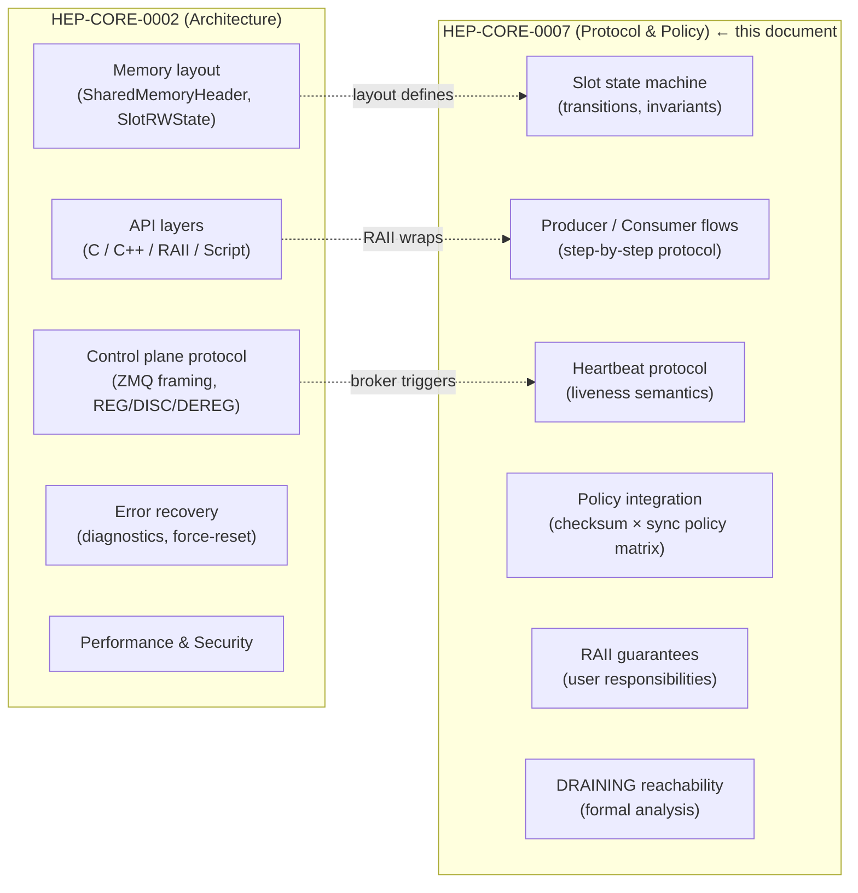
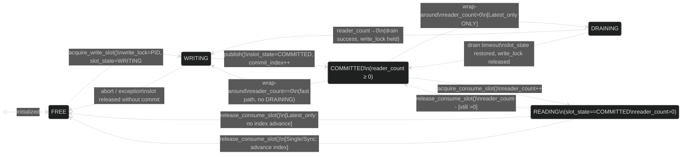
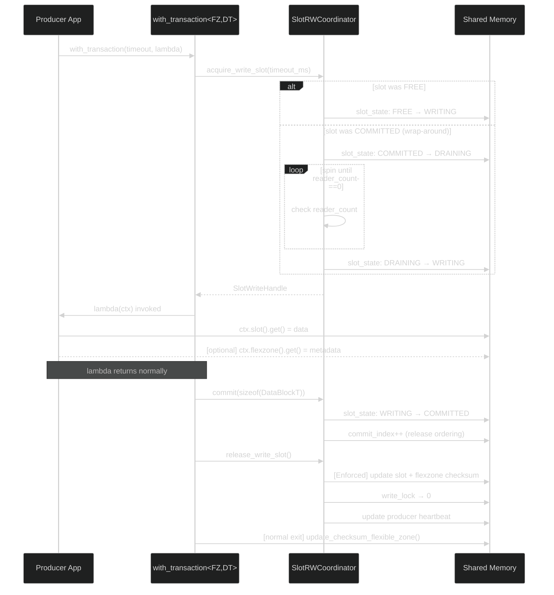
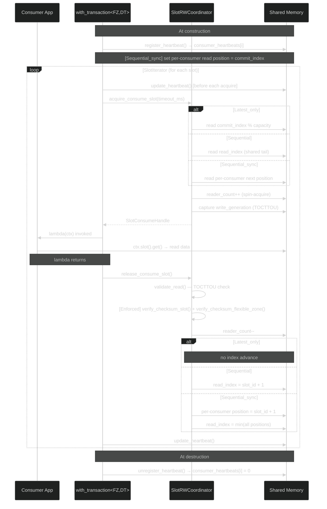
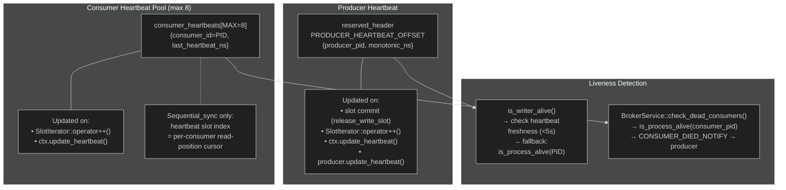
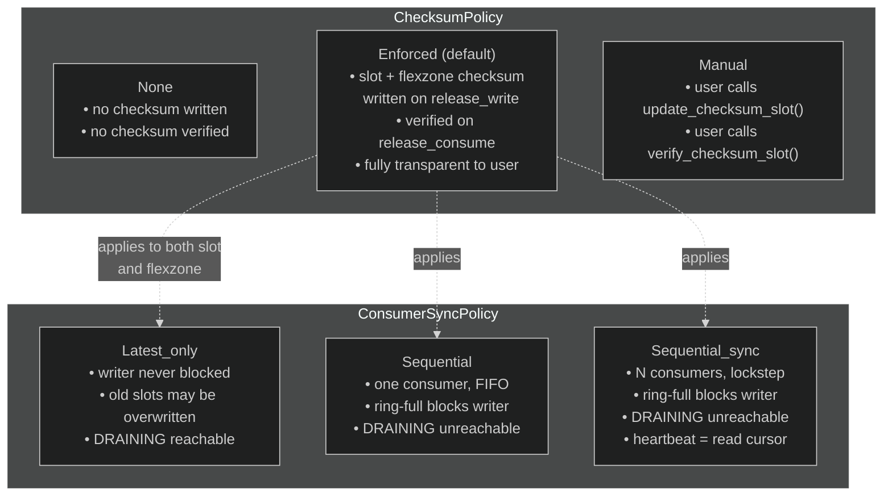
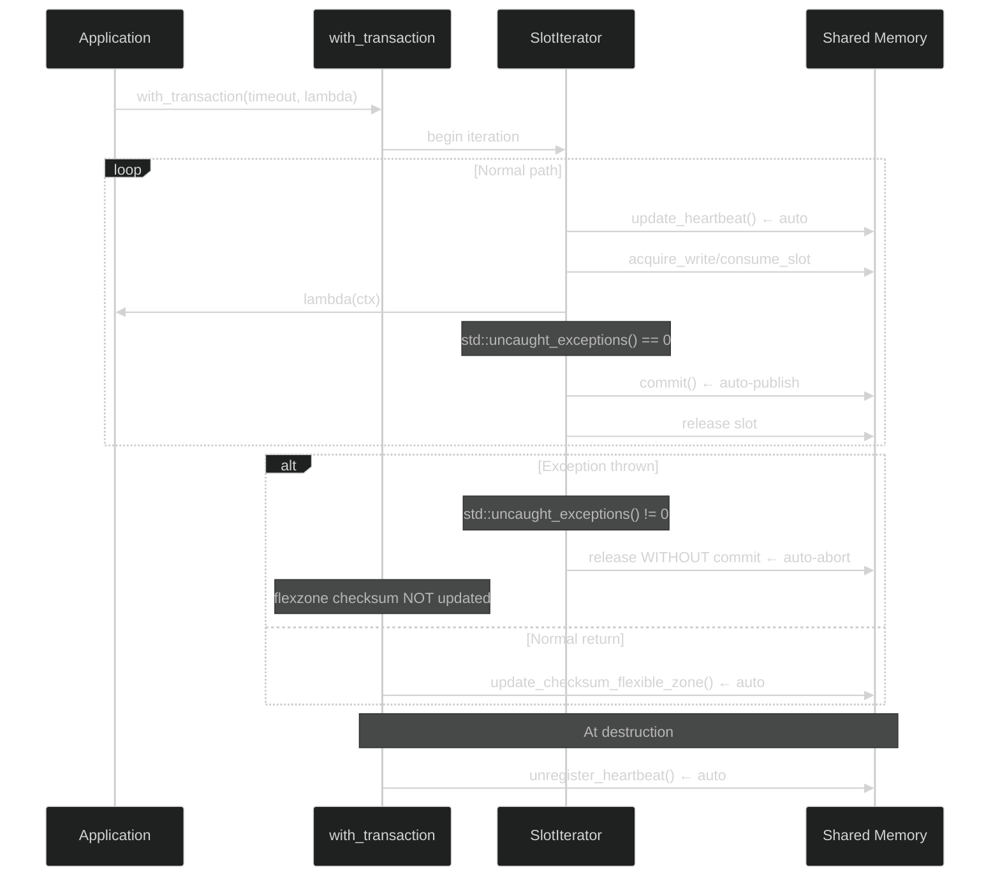
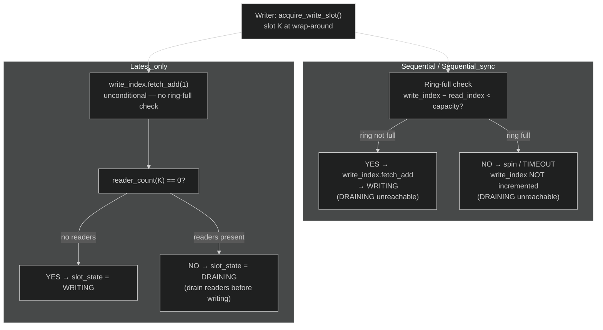

# HEP-CORE-0007: DataHub Protocol and Policy Reference

| Property         | Value                                                      |
| ---------------- | ---------------------------------------------------------- |
| **HEP**          | `HEP-CORE-0007`                                            |
| **Title**        | DataHub Protocol and Policy Reference                      |
| **Author**       | Quan Qing, AI assistant                                    |
| **Status**       | ✅ Active — canonical reference (promoted 2026-02-21; extended 2026-03-10) |
| **Category**     | Core                                                       |
| **Created**      | 2026-02-15                                                 |
| **Promoted**     | 2026-02-21 (was `docs/DATAHUB_PROTOCOL_AND_POLICY.md`)     |
| **Depends-on**   | HEP-CORE-0002 (DataHub), HEP-CORE-0006 (Slot-Processor)   |

This document is the **authoritative reference for slot-level protocol correctness**, policy
semantics, RAII layer guarantees, and user responsibilities. It covers the **slot-level
state machine**, producer/consumer protocol flows, FlexZone access semantics, DRAINING
policy, and user-facing RAII contracts.

**Scope split with HEP-CORE-0002:**



Update this document whenever protocol or policy behavior changes.

---

## Table of Contents

1. [Slot State Machine](#1-slot-state-machine)
2. [Protocol Flow — Producer](#2-protocol-flow--producer)
3. [Protocol Flow — Consumer](#3-protocol-flow--consumer)
4. [Heartbeat Protocol](#4-heartbeat-protocol)
5. [Policy Integration Table](#5-policy-integration-table)
6. [RAII Layer Guarantees](#6-raii-layer-guarantees)
7. [Explicit Control Points](#7-explicit-control-points-user-callable)
8. [User Responsibilities](#8-what-users-are-responsible-for)
9. [FlexZone and DataBlock Type Requirements](#9-flexzone-and-datablock-type-requirements)
10. [Invariants the System Maintains](#10-invariants-the-system-maintains)
11. [DRAINING Reachability by ConsumerSyncPolicy](#11-draining-reachability-by-consumersyncpolicy)
12. [ZMQ Control Plane Protocol](#12-zmq-control-plane-protocol)
13. [Source File Reference](#13-source-file-reference)

---

## 1. Slot State Machine

Each ring-buffer slot transitions through the following states. The state machine is enforced
by atomic operations in `SlotRWState`. `READING` is not a distinct `slot_state` value — it
is the logical overlay where `slot_state == COMMITTED` and `reader_count > 0`.



**State definitions:**
- `FREE` — available for writing; `write_lock == 0`
- `WRITING` — producer holds write_lock (PID-based); `slot_state == WRITING`
- `COMMITTED / READY` — data visible to consumers; `slot_state == COMMITTED`; `commit_index` advanced
- `READING` — consumer holds read lock (`reader_count > 0`); `slot_state` stays `COMMITTED`
- `DRAINING` — write_lock held; producer draining in-progress readers before writing. Entered
  when `acquire_write` wraps around a previously `COMMITTED` slot. New readers are rejected
  (`slot_state != COMMITTED → NOT_READY`). On drain success: → `WRITING`. On drain timeout:
  `slot_state` restored to `COMMITTED` (last data still valid); `write_lock` released.

> **Scope note:** For the `SlotRWState` memory layout and the C-API function signatures, see
> **HEP-CORE-0002 §3.3** and **§4.2**.

---

## 2. Protocol Flow — Producer



**Exception path:**
- If an exception propagates through `SlotIterator`, `std::uncaught_exceptions() != 0`,
  so auto-publish is skipped — slot is released without commit (`slot_state → FREE`).
- If an exception propagates through `with_transaction`, the flexzone checksum is NOT
  updated — leaving the stored checksum inconsistent with any partial flexzone writes.
  This is intentional: the checksum mismatch signals to consumers that the flexzone state
  is unreliable until the producer recovers and exits `with_transaction` normally.

**Step-by-step detail:**

```
1. acquire_write_slot(timeout_ms)
     → spin-acquire write_lock (PID-based CAS)
     → if previous slot_state == COMMITTED (wrap-around):
         → slot_state: COMMITTED → DRAINING  (new readers see non-COMMITTED → reject fast)
         → spin until reader_count == 0  (existing readers drain naturally)
         → on drain timeout: slot_state restored to COMMITTED; write_lock released → return nullptr
         → on drain success: slot_state: DRAINING → WRITING
     → if previous slot_state == FREE: slot_state: FREE → WRITING  (no readers possible)
     → returns SlotWriteHandle (or nullptr on timeout)
     → note: writer_waiting flag kept for diagnostic compat; set/cleared alongside DRAINING

2. Write data to slot buffer
     → via SlotWriteHandle::buffer_span() or WriteSlotRef::get()

3. [Optional] Write flexzone via ctx.flexzone().get()
     → flexzone is a shared memory region separate from the ring buffer
     → always visible to consumers regardless of slot commit state

4. publish() — or auto-publish at SlotIterator loop exit
     = SlotWriteHandle::commit(sizeof(DataBlockT))
         → sets slot_state: WRITING → COMMITTED
         → increments commit_index (release ordering — visible to consumers)
     + release_write_slot()
         → [ChecksumPolicy::Enforced] update slot checksum + update flexzone checksum
         → release write_lock
         → update producer heartbeat

5. [auto at with_transaction exit — conservative: only on normal return]
     → [ChecksumPolicy != None && FlexZoneT != void && !ctx.suppress_flexzone_checksum()]
     → update_checksum_flexible_zone()
     → This covers the case where the producer updated the flexzone but did not publish a slot
```

---

## 3. Protocol Flow — Consumer



**Step-by-step detail:**

```
1. [All policies] Heartbeat auto-registered on consumer construction.
     → register_heartbeat() called in find_datablock_consumer_impl
     → consumes one slot from consumer_heartbeats[MAX_CONSUMER_HEARTBEATS]
     → auto-updated by SlotIterator::operator++() on every iteration
     → auto-unregistered in DataBlockConsumerImpl destructor

2. [Sequential_sync only] Read position initialized at join time (join-at-latest).
     → consumer_next_read_slot_ptr(header, heartbeat_slot) set to current commit_index
     → done once at construction, not repeated per acquire

3. acquire_consume_slot(timeout_ms)
     → determine next slot via get_next_slot_to_read()
     → Latest_only:    latest committed slot (commit_index % capacity)
     → Sequential:  read_index (shared tail)
     → Sequential_sync:    consumer_next_read_slot_ptr(header, heartbeat_slot) (per-consumer)
     → spin-acquire read_lock (increment reader_count)
     → capture write_generation for TOCTTOU validation
     → returns SlotConsumeHandle (or nullptr on timeout/no-slot)

4. Read data from slot buffer
     → via SlotConsumeHandle::buffer_span() or ReadSlotRef::get()
     → validate_read() checks generation has not changed (TOCTTOU protection)

5. release_consume_slot() / SlotConsumeHandle destructor
     → validate_read_impl() — TOCTTOU check (always on, regardless of checksum policy)
     → [ChecksumPolicy::Enforced] verify_checksum_slot() + verify_checksum_flexible_zone()
     → decrement reader_count (release read_lock)
     → Latest_only:    no index advance
     → Sequential:  read_index = slot_id + 1 (shared advance)
     → Sequential_sync:    consumer_next_read_slot_ptr = slot_id + 1 (per-consumer advance)
                       read_index = min(all registered per-consumer positions)
```

---

## 4. Heartbeat Protocol

Heartbeats provide liveness signals for broker-level visibility and producer health checks.



### Producer Heartbeat

- Stored at `reserved_header[PRODUCER_HEARTBEAT_OFFSET]` as `{producer_pid, monotonic_ns}`.
- One dedicated slot (not from the consumer pool).
- Updated on: every slot commit, every `SlotIterator::operator++()` call, explicit
  `ctx.update_heartbeat()` / `producer.update_heartbeat()`.
- Read by `is_writer_alive()` — checks freshness; falls back to `is_process_alive()` if stale.
- Staleness threshold: `PRODUCER_HEARTBEAT_STALE_THRESHOLD_NS` (5 seconds).

### Consumer Heartbeat

- Stored in `consumer_heartbeats[MAX_CONSUMER_HEARTBEATS]` as `{consumer_id (PID), last_heartbeat_ns}`.
- Pool of `MAX_CONSUMER_HEARTBEATS = 8` slots (V1.0 ABI limit).
- **Enforced for all consumer sync policies** (Latest_only, Sequential, Sequential_sync).
  All consumers are registered for liveness; Sequential_sync additionally uses the slot index
  as the read-position cursor index in `reserved_header`.
- Updated on: every `SlotIterator::operator++()` call, explicit `ctx.update_heartbeat()`.
- Auto-registered at consumer construction (`find_datablock_consumer_impl`).
- Auto-unregistered at consumer destruction (`DataBlockConsumerImpl::~DataBlockConsumerImpl()`).

### User Responsibility for Long Per-Slot Operations

`SlotIterator::operator++()` fires a heartbeat before each slot acquisition attempt.
This covers the "waiting for a slot" gap. It does NOT cover long work inside the loop body.

If the work inside the loop body may block for seconds (camera exposure, heavy computation,
blocking I/O), call `ctx.update_heartbeat()` periodically:

```cpp
for (auto& result : ctx.slots(50ms)) {
    if (!result.is_ok()) { continue; }

    auto& slot = result.content();
    for (int frame = 0; frame < 1000; ++frame) {
        acquire_camera_frame(slot.get().buffer[frame]);
        if (frame % 100 == 0) { ctx.update_heartbeat(); }  // keep liveness signal fresh
    }
    break;
}
```

---

## 5. Policy Integration Table



| Policy | Producer Effect | Consumer Effect | RAII Auto-handling |
|---|---|---|---|
| `ChecksumPolicy::None` | No checksum computed | No checksum verified | N/A |
| `ChecksumPolicy::Enforced` | Slot + flexzone checksum updated on `release_write_slot()` | Slot + flexzone checksum verified on `release_consume_slot()` | Yes — fully transparent |
| `ChecksumPolicy::Manual` | User calls `slot.update_checksum_slot()` and `producer.update_checksum_flexible_zone()` | User calls `slot.verify_checksum_slot()` and `consumer.verify_checksum_flexible_zone()` | No — user responsible |
| `ConsumerSyncPolicy::Latest_only` | Never blocked on readers; old slots may be overwritten | Always reads latest committed slot | No heartbeat needed for read-position tracking; heartbeat still registered for liveness |
| `ConsumerSyncPolicy::Sequential` | Blocked when ring full and consumer has not advanced | Reads sequentially; shared `read_index` tracked | Same as above |
| `ConsumerSyncPolicy::Sequential_sync` | Blocked when slowest consumer is behind | Per-consumer read position tracked via heartbeat slot index | Heartbeat slot doubles as read-position cursor; always auto-registered at construction |
| `DataBlockPolicy::RingBuffer` | N-slot circular; wraps | Reads in policy-defined order | Managed by C API |

**Note — DRAINING reachability by policy.** `SlotState::DRAINING` is only ever entered by `Latest_only` producers. For `Sequential` and `Sequential_sync`, the ring-full check (`write_index - read_index < capacity`, evaluated *before* `write_index.fetch_add`) creates a structural barrier that makes DRAINING unreachable. See § 11 for the formal analysis.

---

## 6. RAII Layer Guarantees

These guarantees are provided by the C++ RAII layer and require no user action.



| Guarantee | Mechanism |
|---|---|
| **Auto-publish on normal SlotIterator exit** | `SlotIterator` destructor checks `std::uncaught_exceptions() == 0`; calls `commit()` if true |
| **Auto-abort on exception through SlotIterator** | `std::uncaught_exceptions() != 0` → slot released without commit → `slot_state → FREE` |
| **Auto-heartbeat every iterator iteration** | `SlotIterator::operator++()` calls `m_handle->update_heartbeat()` before each slot acquisition |
| **Auto-update flexzone checksum at with_transaction exit** | Producer `with_transaction` updates flexzone checksum after lambda returns normally (not on exception) |
| **No flexzone checksum update on exception** | Conservative path: partial flexzone writes leave stale checksum → consumer detects mismatch |
| **Slot generation validation on every consumer release** | `validate_read_impl()` called unconditionally in `release_consume_slot()` regardless of checksum policy |
| **Consumer heartbeat auto-registered at construction** | `find_datablock_consumer_impl` calls `register_heartbeat()` |
| **Consumer heartbeat auto-unregistered at destruction** | `DataBlockConsumerImpl::~DataBlockConsumerImpl()` releases heartbeat slot |
| **Producer heartbeat auto-updated on every commit** | `release_write_slot()` calls `update_producer_heartbeat_impl()` |

---

## 7. Explicit Control Points (User-Callable)

These are user-callable methods for cases where the automatic behavior is insufficient.

| Method | Who | When to Use |
|---|---|---|
| `ctx.publish()` | Producer | Force-publish current slot immediately (advanced control; auto-publish is sufficient for most uses) |
| `ctx.publish_flexzone()` | Producer | Immediately update flexzone checksum (e.g., before breaking from loop to ensure checksum is fresh) |
| `ctx.suppress_flexzone_checksum()` | Producer | Prevent auto-update of flexzone checksum at `with_transaction` exit (e.g., when flexzone was not modified in this transaction) |
| `ctx.update_heartbeat()` | Producer + Consumer | Keep heartbeat fresh during long per-slot operations inside the loop body |
| `producer.update_heartbeat()` | Producer | Keep heartbeat fresh when not inside a `with_transaction` loop |
| `producer.update_checksum_flexible_zone()` | Producer | Update flexzone checksum outside a `with_transaction` call |

---

## 8. What Users Are Responsible For

1. **`ChecksumPolicy::Manual`**: Call `slot.update_checksum_slot()` before `release_write_slot()`,
   and `slot.verify_checksum_slot()` before consuming. Same for flexzone checksums.

2. **Long per-slot operations**: Call `ctx.update_heartbeat()` periodically inside the loop body
   if per-slot processing may block for more than a few seconds.

3. **Flexzone-only writes (no slot publish)**: `with_transaction` auto-updates the flexzone
   checksum on normal exit. If you write the flexzone and then return normally from the lambda,
   the checksum is automatically updated. If you want to update it earlier (before the lambda
   returns), call `ctx.publish_flexzone()`.

4. **Flexzone write suppression**: If your `with_transaction` lambda does not write the flexzone,
   call `ctx.suppress_flexzone_checksum()` to avoid an unnecessary checksum recomputation.
   (The recomputation is not wrong, just wasteful.)

5. **Heartbeat pool capacity**: The consumer heartbeat pool holds `MAX_CONSUMER_HEARTBEATS = 8`
   entries (V1.0 ABI). If all slots are occupied, `register_heartbeat()` returns -1 and a
   warning is logged. Design your application so the total number of concurrent consumers on
   a single DataBlock does not exceed 8.

6. **Reconnect = Re-register invariant (broker layer)**: If a producer or consumer
   disconnects and reconnects at the ZMQ transport layer (e.g., due to a network flap or
   process restart), the broker's ROUTER socket assigns a **new ROUTER identity** to the
   reconnected peer. The old ROUTER identity in the broker's channel registry is now stale
   and will be purged on the next heartbeat timeout.
   - A reconnected **producer** must send a fresh `REG_REQ` to get its new identity
     registered. The broker does not automatically detect reconnection — it waits for
     the heartbeat to expire and issues `CHANNEL_CLOSING_NOTIFY`.
   - A reconnected **consumer** must send a fresh `CONSUMER_REG_REQ`.
   - **Design implication**: reconnect handling is identical to a fresh start. No
     special reconnect path exists; the producer/consumer bootstrap sequence covers it.

---

## 9. FlexZone and DataBlock Type Requirements

### Trivially-Copyable Constraint

Both `FlexZoneT` and `DataBlockT` must satisfy `std::is_trivially_copyable_v<T>`. This is
enforced at compile time by `static_assert` in `ZoneRef`, `SlotRef`, and `TransactionContext`.

**Why it matters:** Slot and flexzone data live in a POSIX/Win32 shared memory segment. The
checksum mechanism copies the raw bytes of the struct. Types that are not trivially copyable
may contain internal pointers, OS handles, or virtual dispatch tables that are meaningless
across process boundaries.

**Common pitfall — `std::atomic<T>` members:**

```cpp
// WRONG — fails static_assert on MSVC (std::atomic<T> has deleted copy ctor/assign)
struct BadFlexZone {
    std::atomic<uint32_t> counter{0};  // NOT trivially copyable on MSVC
    std::atomic<bool> flag{false};     // same issue
};

// CORRECT — plain POD layout; apply atomic_ref<T> at call sites when needed
struct GoodFlexZone {
    uint32_t counter{0};
    uint32_t flag{0};  // 0 = false, 1 = true
};
```

On GCC/Linux `std::atomic<T>` for lock-free integer types happens to pass the
`is_trivially_copyable` check, but this is non-portable. MSVC explicitly marks
`std::atomic<T>` as non-trivially copyable because its copy constructor is deleted.
Always use plain POD types.

### Atomic Access Pattern for FlexZone Fields

**Inside `with_transaction`** — no per-field atomics needed.
The `with_transaction` call holds a `SharedSpinLock` whose acquire uses
`memory_order_acquire` and release uses `memory_order_release`. This provides a full
memory fence; plain reads and writes inside the lambda are sequentially consistent.

```cpp
producer->with_transaction<GoodFlexZone, Payload>(timeout, [](auto& ctx) {
    // Spinlock held — plain assignment is safe and sequentially ordered.
    ctx.flexzone().get().counter = 42;
    ctx.flexzone().get().flag = 1;
});
```

**Outside `with_transaction`** — use `std::atomic_ref<T>` (C++20).
If a consumer needs to poll a FlexZone field _without_ acquiring the lock (e.g. a
UI thread reading a status flag the producer sets), use `std::atomic_ref<T>` to impose
atomic semantics on the plain storage:

```cpp
// Producer side (inside with_transaction — plain write is fine):
ctx.flexzone().get().flag = 1;

// Consumer side (outside with_transaction — atomic read via atomic_ref):
auto& fz = *reinterpret_cast<GoodFlexZone*>(
    consumer.flexible_zone_span().data()); // low-level raw access
uint32_t v = std::atomic_ref<uint32_t>(fz.flag).load(std::memory_order_acquire);
```

`std::atomic_ref<T>` requires the underlying storage to be suitably aligned and of a
lock-free-compatible size (same requirements as placing a `std::atomic<T>` there).
Use `alignas` on the struct member if necessary.

**Summary table:**

| Access location | Pattern | Why |
|---|---|---|
| Inside `with_transaction` | Plain read/write | Spinlock provides acquire/release fence |
| Outside lock — lock-free poll | `std::atomic_ref<T>(field).load/store` | Imposes atomic semantics on POD storage |
| Outside lock — full mutual exclusion | Acquire the spinlock via C API | Strongest guarantee; heavier weight |

---

## 10. Invariants the System Maintains

These are invariants that hold at all times during correct operation. Violation indicates
a bug in the protocol implementation, not user code.

- `commit_index >= read_index` always (ring buffer does not advance past readers).
- `write_lock` is always cleared (→ 0) on `release_write_slot()`, regardless of commit state.
- `reader_count` for a slot is always decremented by `release_consume_slot()` or `SlotConsumeHandle` destructor.
- `consumer_heartbeats[i].consumer_id` is 0 (unregistered) or a valid PID.
- `active_consumer_count` equals the number of entries in `consumer_heartbeats[]` with `consumer_id != 0`.
- The stored flexzone checksum reflects the last `update_checksum_flexible_zone()` call, not necessarily the current flexzone content (checksum is a snapshot).
- For `Sequential` and `Sequential_sync`: `write_index - read_index < capacity` at the moment of the ring-full check (before `fetch_add`) guarantees the writer never reaches a slot held by the slowest active reader. DRAINING is therefore structurally unreachable for those policies.

---

## 11. DRAINING Reachability by ConsumerSyncPolicy

### Claim

`SlotState::DRAINING` is only reachable for `ConsumerSyncPolicy::Latest_only`.
For `Sequential` and `Sequential_sync` it is structurally unreachable; the ring-full
check creates a hard arithmetic barrier before any drain attempt can occur.



### Proof (ring-full barrier)

**Preconditions:**

1. Reader **R** holds slot **K** (i.e., `reader_count(K) ≥ 1`).
   - `read_index` has NOT yet advanced past K — it advances only inside
     `release_consume_slot()`, not at acquire time.
   - Therefore: `read_index ≤ K`.
   - For `Sequential_sync`, `read_index = min(all registered per-consumer positions)`; still `≤ K`.

2. Writer **W** tries to overwrite the same physical slot (ring wrap).
   - Physical slot `K % capacity` is reused when `write_index = K + capacity`.
   - DRAINING is entered by `acquire_write()` **after** `write_index.fetch_add(1)` (irrevocable).

**Ring-full check (before `fetch_add`):**

```
(write_index.load() - read_index.load()) < capacity   →  proceed
(write_index.load() - read_index.load()) ≥ capacity   →  spin / return TIMEOUT
```

**For W to reach slot K (same physical slot), W needs `write_index = K + capacity`.**

Ring-full condition at that moment:

```
(K + capacity) - read_index < capacity
⟺  K < read_index
```

But from precondition 1: `read_index ≤ K`.
**Contradiction.** The ring-full check always fires before `fetch_add` reaches `K + capacity`.

**Therefore:**
- `write_index.fetch_add(1)` to value `K + capacity` is impossible while reader R holds slot K.
- `acquire_write()` for slot K is never called.
- DRAINING is never entered.

### Why `Latest_only` is different

`Latest_only` has **no ring-full check**. The writer advances `write_index.fetch_add(1)`
unconditionally on every call. Multiple slot-IDs can be issued and "overwritten" without
reader coordination. DRAINING is the mechanism that prevents corruption when a reader is
actively reading the slot being overwritten — the writer pauses until `reader_count → 0`.

### Discriminating metric

`writer_reader_timeout_count` is incremented **only** by the drain-spin timeout path inside
`acquire_write()`. The ring-full timeout path increments `writer_timeout_count` only.

| Policy | Expected on reader stall |
|---|---|
| `Latest_only` | `writer_reader_timeout_count > 0` — drain spin timed out |
| `Sequential` | `writer_reader_timeout_count == 0` — ring-full blocked; no drain ever attempted |
| `Sequential_sync` | `writer_reader_timeout_count == 0` — same ring-full barrier |

This is verified by tests `DatahubSlotDrainingTest.SingleReaderRingFullBlocksNotDraining`
and `DatahubSlotDrainingTest.SyncReaderRingFullBlocksNotDraining`.

---

## 12. ZMQ Control Plane Protocol

This section is the authoritative reference for the **ZMQ control plane** — all broker
protocol messages, unsolicited notifications, peer-to-peer messages, and how they flow
through the system to Python script callbacks.

### Data Packaging Agreement

All ZMQ control plane messages use JSON encoding. User-supplied data follows these rules:

1. **User data is always a string** — the `"data"` field in the JSON body
2. **The `"data"` field is always present** when the API accepts a `data` parameter;
   it may be an empty string `""`
3. **The framework passes the string through transparently** — no wrapping, no encoding,
   no parsing. If the user sends `"world"`, the receiver gets `"world"`
4. **If the user wants structured data**, they encode it themselves (e.g. as JSON) and
   the receiver decodes it — that's the application's responsibility, not the framework's

This applies to:
- `api.notify_channel(target, event, data)` → `"data": data` in CHANNEL_NOTIFY_REQ
- `api.broadcast_channel(target, message, data)` → `"data": data` in CHANNEL_BROADCAST_REQ
- `pylabhub.broadcast_channel(channel, message, data)` (admin shell) → same

Peer-to-peer data messages (Category A) are **raw binary** on direct ZMQ sockets — no JSON,
no wrapping. They arrive in Python as `bytes` objects.

### 12.1 Message Framing

All ZMQ messages use a multi-frame format. Frame 0 is a single-byte type discriminator.

```
Control frame (Messenger ↔ Broker):
  Frame 0: 'C'               (1 byte — control type)
  Frame 1: message_type       (string, e.g. "REG_REQ")
  Frame 2: JSON payload        (string)

ROUTER envelope (broker side prepends identity):
  Frame 0: [ZMQ identity]     (opaque ROUTER envelope)
  Frame 1: 'C'
  Frame 2: message_type
  Frame 3: JSON payload
```

### 12.2 Message Categories

Messages are grouped into four categories based on their flow pattern:

| Category | Pattern | Examples |
|----------|---------|---------|
| **Request/Response** | Client → Broker → Client | REG_REQ/ACK, DISC_REQ/ACK, CHANNEL_LIST_REQ/ACK, METRICS_REQ/ACK, ROLE_PRESENCE_REQ/ACK, ROLE_INFO_REQ/ACK |
| **Fire-and-Forget** | Client → Broker (no reply) | HEARTBEAT_REQ, CHECKSUM_ERROR_REPORT, CHANNEL_NOTIFY_REQ, CHANNEL_BROADCAST_REQ, METRICS_REPORT_REQ |
| **Unsolicited Push** | Broker → Client (async) | CHANNEL_CLOSING_NOTIFY, CONSUMER_DIED_NOTIFY, CHANNEL_ERROR_NOTIFY, CHANNEL_EVENT_NOTIFY, CHANNEL_BROADCAST_NOTIFY, ROLE_REGISTERED_NOTIFY, ROLE_DEREGISTERED_NOTIFY |
| **Peer-to-Peer** | Producer ↔ Consumer (direct ZMQ) | HELLO, BYE, application ctrl messages |

### 12.3 Request/Response Messages

These follow a strict request → response pattern. The client blocks on a future
until the broker sends the corresponding ACK or ERROR.

#### REG_REQ / REG_ACK — Register Producer Channel

```
Direction:  Producer → Broker → Producer
Trigger:    Messenger::create_channel() or Messenger::register_producer()
Sequence:
  1. Producer binds P2C ROUTER + XPUB/PUSH sockets on ephemeral ports
  2. Producer sends REG_REQ with socket endpoints, schema, identity
  3. Broker validates connection policy, stores ChannelEntry
  4. Broker sends REG_ACK (status="success") or ERROR
  5. Producer registers heartbeat on success

Payload (REG_REQ):
  channel_name          string   Channel identifier (e.g. "lab.sensors.raw")
  shm_name              string   SHM segment name (= channel_name when has_shared_memory)
  producer_pid          uint64   Producer process ID
  schema_hash           string   64-char hex BLAKE2b-256 hash (or empty)
  schema_version        uint32   Schema version number
  has_shared_memory     bool     Whether SHM segment exists
  channel_pattern       string   "PubSub" | "Pipeline" | "Bidir"
  zmq_ctrl_endpoint     string   Producer ROUTER bind endpoint (e.g. "tcp://127.0.0.1:56789")
  zmq_data_endpoint     string   Producer XPUB/PUSH bind endpoint (empty for Bidir)
  zmq_pubkey            string   Producer CurveZMQ public key (Z85, 40 chars)
  role_name             string   (opt) Human-readable producer name
  role_uid              string   (opt) Producer UID (e.g. "PROD-MySensor-A1B2C3D4")
  schema_id             string   (opt) Named schema ID (e.g. "lab.sensors.temperature.raw@1")
  schema_blds           string   (opt) BLDS type description string

Payload (REG_ACK):
  status                string   "success"

role_type field (added 2026-03-10):
  role_type             string   (opt) "producer" | "consumer" | "processor"
                                 Recorded in ChannelEntry; broadcast in ROLE_REGISTERED_NOTIFY.
                                 Absent field treated as "producer" for backward compatibility.
```

#### DISC_REQ / DISC_ACK — Discover Channel

```
Direction:  Consumer → Broker → Consumer
Trigger:    Messenger::connect_channel() or Messenger::discover_producer()
Sequence:
  1. Consumer sends DISC_REQ with channel_name
  2. Broker looks up channel in registry
  3. If channel exists AND status == Ready: sends DISC_ACK with connection info
  4. If channel exists but status == PendingReady: sends ERROR with "CHANNEL_NOT_READY"
     (Messenger retries automatically within timeout)
  5. If channel does not exist: sends ERROR with "CHANNEL_NOT_FOUND"

Payload (DISC_REQ):
  channel_name          string

Deferred DISC_ACK (added 2026-03-10):
  When channel_name is not yet registered (or status == PendingReady), the broker
  queues the DISC_REQ and holds the reply until the producer registers (up to
  pending_disc_timeout_ms, default 30 s). This eliminates the need for client-side
  retry loops in most startup scenarios. See HEP-CORE-0023 for the full protocol.
  Timeout: broker sends ERROR "CHANNEL_NOT_FOUND" after pending_disc_timeout_ms.

Payload (DISC_ACK):
  status                string   "success"
  shm_name              string   SHM segment to attach
  schema_hash           string   64-char hex hash
  schema_version        uint32
  has_shared_memory     bool
  channel_pattern       string
  zmq_ctrl_endpoint     string   Producer's ROUTER endpoint for consumer to connect
  zmq_data_endpoint     string   Producer's XPUB/PUSH endpoint
  zmq_pubkey            string   Producer's CurveZMQ public key
  consumer_count        uint32   Current consumer count on this channel
  schema_id             string   (opt) Named schema ID
  blds                  string   (opt) BLDS string
```

#### CONSUMER_REG_REQ / CONSUMER_REG_ACK — Register Consumer

```
Direction:  Consumer → Broker → Consumer
Trigger:    After successful DISC_REQ/ACK; part of connect_channel() sequence
Sequence:
  1. Consumer sends CONSUMER_REG_REQ with identity
  2. Broker validates expected_schema_id/hash if provided
  3. Broker stores consumer in ChannelEntry.consumers[]
  4. Broker sends CONSUMER_REG_ACK or ERROR (e.g. "SCHEMA_MISMATCH")

Payload (CONSUMER_REG_REQ):
  channel_name          string
  consumer_pid          uint64
  consumer_hostname     string
  consumer_uid          string   (opt) Consumer UID
  consumer_name         string   (opt) Human-readable name
  expected_schema_id    string   (opt) Validate schema matches this ID

Payload (CONSUMER_REG_ACK):
  status                string   "success"

role_type field (added 2026-03-10):
  role_type             string   (opt) "producer" | "consumer" | "processor"
                                 Allows broker to distinguish processor consumers from
                                 plain consumers in ROLE_REGISTERED_NOTIFY broadcasts.
```

#### CONSUMER_DEREG_REQ / CONSUMER_DEREG_ACK — Deregister Consumer

```
Direction:  Consumer → Broker → Consumer
Trigger:    Consumer::close() or graceful shutdown

Payload (CONSUMER_DEREG_REQ):
  channel_name          string
  consumer_pid          uint64
```

#### DEREG_REQ / DEREG_ACK — Deregister Channel

```
Direction:  Producer → Broker → Producer
Trigger:    Messenger::unregister_channel() during Producer::close()
Effect:     Removes channel from registry; triggers CHANNEL_CLOSING_NOTIFY to consumers

Payload (DEREG_REQ):
  channel_name          string
  producer_pid          uint64
```

#### SCHEMA_REQ / SCHEMA_ACK — Query Channel Schema

```
Direction:  Any → Broker → Any
Trigger:    Messenger::query_channel_schema() or SchemaStore::query_from_broker()

Payload (SCHEMA_REQ):
  channel_name          string

Payload (SCHEMA_ACK):
  status                string   "success"
  schema_id             string   Named schema ID (empty if anonymous)
  blds                  string   BLDS type string (empty if not provided)
  schema_hash           string   64-char hex hash
```

#### METRICS_REQ / METRICS_ACK — Query Metrics (HEP-CORE-0019)

```
Direction:  Any → Broker → Any
Trigger:    pylabhub.metrics(channel) (AdminShell) or direct Messenger call
Pattern:    Synchronous request/response

Payload (METRICS_REQ):
  channel_name          string   (opt) Channel to query; empty/omitted = all channels

Payload (METRICS_ACK):
  status                string   "success"
  channels              object   Map of channel_name → metrics:
    <channel_name>:
      producer:
        uid              string   Producer UID
        pid              uint64   Producer PID
        last_report      string   ISO 8601 timestamp
        base             object   {out_written, drops, script_errors, iteration_count, …}
        custom           object   User-defined {key: number} pairs
      consumers:         array    Array of consumer metrics objects:
        uid              string
        pid              uint64
        last_report      string
        base             object   {in_received, script_errors, iteration_count, …}
        custom           object

Returns empty channels if no metrics have been reported yet.
```

### 12.4 Fire-and-Forget Messages

These require no response from the broker.

#### HEARTBEAT_REQ — Producer Liveness + Metrics

```
Direction:  Producer/Processor → Broker
Trigger:    Periodic HeartbeatTracker in zmq_thread_ (fires when iteration_count
            advances AND heartbeat interval elapsed, default 2s)
Effect:     Updates channel last_heartbeat timestamp; transitions PendingReady → Ready;
            if metrics field present, updates MetricsStore (HEP-CORE-0019)

Payload:
  channel_name          string
  producer_pid          uint64
  metrics               object   (opt, HEP-CORE-0019) Metrics snapshot:
    out_written          uint64   Slots committed
    drops                uint64   Overflow drops
    script_errors        uint64   Script exception count
    iteration_count      uint64   Loop iterations
    in_received          uint64   (processor only) Input slots received
    custom               object   (opt) User-defined {key: number} pairs

Backward compatibility: Brokers that predate HEP-CORE-0019 ignore the metrics field
(unknown JSON keys are silently dropped). No version negotiation needed.

Note: Heartbeats are sent only when iteration_count advances, proving the script
loop is progressing — not just that the ZMQ connection is alive.
```

#### CHECKSUM_ERROR_REPORT — Slot Integrity Error

```
Direction:  Producer/Consumer → Broker
Trigger:    Messenger::report_checksum_error()
Effect:     Broker logs and, if ChecksumRepairPolicy::NotifyOnly, forwards as
            CHANNEL_EVENT_NOTIFY to all channel participants

Payload:
  channel_name          string
  slot_index            int32
  error                 string   Human-readable description
  reporter_pid          uint64
```

#### CHANNEL_NOTIFY_REQ — Application-Level Signal Relay (NEW)

```
Direction:  Any role → Broker → Target channel's producer
Trigger:    api.notify_channel(target_channel, event, data)
Effect:     Broker looks up target channel, forwards as CHANNEL_EVENT_NOTIFY to producer

Payload:
  target_channel        string   Channel name to notify
  sender_uid            string   UID of the sending role
  event                 string   Application-defined event name (e.g. "consumer_ready")
  data                  string   (opt) User data string (passthrough, may be empty)

Use cases:
  - Consumer signals upstream producer: "pipeline_ready"
  - Processor notifies downstream: "batch_complete"
  - Cross-pipeline coordination signals
```

#### CHANNEL_BROADCAST_REQ — Application-Level Broadcast to All Members

```
Direction:  Any role / Admin shell → Broker → ALL channel members (producer + consumers)
Trigger:    api.broadcast_channel(target_channel, message, data)
            OR pylabhub.broadcast_channel(channel, message, data)  (admin shell)
Effect:     Broker fans out as CHANNEL_BROADCAST_NOTIFY to every member of the channel

Payload:
  target_channel        string   Channel name to broadcast to
  sender_uid            string   UID of the sending role (or "admin_shell")
  message               string   Application-defined message tag (e.g. "start", "stop")
  data                  string   (opt) User data string (per Data Packaging Agreement)

Use cases:
  - Admin shell triggers pipeline start/stop
  - Any role broadcasts coordination signals to all channel members
  - Hub-wide status notifications

Difference from CHANNEL_NOTIFY_REQ:
  - CHANNEL_NOTIFY_REQ → producer only (unicast)
  - CHANNEL_BROADCAST_REQ → all members (fan-out: consumers + producer)
```

#### METRICS_REPORT_REQ — Consumer Metrics Report (HEP-CORE-0019)

```
Direction:  Consumer → Broker
Trigger:    Periodic HeartbeatTracker in consumer zmq_thread_
Effect:     Broker updates MetricsStore with consumer's latest metrics snapshot

Payload:
  channel_name          string
  consumer_pid          uint64
  consumer_uid          string   Consumer UID (e.g. "CONS-LOGGER-A1B2C3D4")
  metrics               object   Metrics snapshot:
    in_received          uint64   Slots consumed
    script_errors        uint64   Script exception count
    iteration_count      uint64   Loop iterations
    custom               object   (opt) User-defined {key: number} pairs

Why consumers use a dedicated message: Consumers don't send HEARTBEAT_REQ
(the broker tracks their liveness via PID checks). So consumers use this
separate fire-and-forget message to report metrics at the same interval.
```

#### CHANNEL_LIST_REQ — Query Registered Channels

```
Direction:  Any role → Broker → Any role
Trigger:    api.list_channels() or Messenger::list_channels()
Pattern:    Synchronous request/response (blocks until broker replies)

Payload (CHANNEL_LIST_REQ):
  (empty object — no fields needed)

Payload (CHANNEL_LIST_ACK):
  status                string   "success"
  channels              array    Array of channel objects:
    name                string   Channel identifier
    status              string   "Ready" | "PendingReady" | "Closing"
    producer_uid        string   Producer UID
    schema_id           string   Named schema ID (empty if anonymous)
    consumer_count      int      Number of registered consumers

Use cases:
  - Role queries available channels for dynamic subscription
  - Admin shell inspects pipeline topology
  - Monitoring / debugging
```

#### ROLE_PRESENCE_REQ / ROLE_PRESENCE_ACK — Query Role Presence (added 2026-03-10)

```
Direction:  Any role → Broker → Any role
Trigger:    api.wait_for_role() polling loop; or direct Messenger call
Pattern:    Synchronous request/response

Payload (ROLE_PRESENCE_REQ):
  role_uid              string   Exact UID or UID prefix pattern (e.g. "PROD-SENSOR-*")

Payload (ROLE_PRESENCE_ACK):
  status                string   "success"
  present               bool     true if any matching role is currently registered
```

#### ROLE_INFO_REQ / ROLE_INFO_ACK — Query Role Details (added 2026-03-10)

```
Direction:  Any role → Broker → Any role
Trigger:    api.open_inbox(uid): needs inbox_endpoint + schema to connect DEALER
Pattern:    Synchronous request/response

Payload (ROLE_INFO_REQ):
  role_uid              string   Exact UID match

Payload (ROLE_INFO_ACK):
  status                string   "success"
  role_uid              string
  role_type             string   "producer" | "consumer" | "processor"
  channel               string   Channel name the role is registered on
  inbox_endpoint        string   ZMQ ROUTER bind endpoint (empty if no inbox)
  inbox_schema_json     string   JSON string of inbox slot schema (empty if no inbox)
  inbox_packing         string   "aligned" | "packed" (empty if no inbox)
```

### 12.5 Unsolicited Broker Notifications

These are pushed asynchronously by the broker to connected clients. They are received
by the Messenger worker thread and dispatched to registered callbacks.

#### CHANNEL_CLOSING_NOTIFY — Graceful Channel Shutdown (Tier 1)

```
Direction:  Broker → All channel participants (producer + consumers)
Trigger:    request_close_channel(), or heartbeat timeout (producer died)
Effect:     Channel enters Closing state. Broker starts grace period timer.
            Recipients receive event in their message queue (FIFO).
            Script is expected to call api.stop() after cleanup.
Callback:   Messenger::on_channel_closing(channel, cb)
            → hub::Producer/Consumer::on_channel_closing(cb)

Payload:
  channel_name          string
  reason                string   ("script_requested" | "heartbeat_timeout")

Script host behavior: Queued as IncomingMessage{event="channel_closing"}.
  Delivered in FIFO order alongside other messages (broadcasts, data, etc.).
  Script should process pending work, then call api.stop() to deregister.

Two-tier shutdown protocol:
  1. CHANNEL_CLOSING_NOTIFY → queued message, script decides when to stop.
  2. If client does not deregister within channel_shutdown_grace (default 5s),
     broker escalates to FORCE_SHUTDOWN (see below).
```

#### FORCE_SHUTDOWN — Forced Channel Shutdown (Tier 2)

```
Direction:  Broker → All remaining channel participants
Trigger:    Grace period expired after CHANNEL_CLOSING_NOTIFY;
            client still registered (did not send DEREG_REQ/CONSUMER_DEREG_REQ).
Effect:     Bypasses message queue. Forces immediate shutdown_requested flag.
            Broker deregisters the channel entry.
Callback:   Messenger::on_force_shutdown(channel, cb)
            → hub::Producer/Consumer::on_force_shutdown(cb)

Payload:
  channel_name          string
  reason                string   ("grace_period_expired")

Script host behavior: Sets core_.shutdown_requested = true directly (no queue).
  This is the "kill -9" equivalent — script may not get on_stop() callback.

Config: BrokerService::Config::channel_shutdown_grace (default 5s).
  Set to 0 for immediate deregister (legacy behavior, used in L3 tests).
```

#### CONSUMER_DIED_NOTIFY — Consumer Process Death

```
Direction:  Broker → Producer
Trigger:    Broker's periodic check_dead_consumers() detects consumer PID no longer alive
Effect:     Producer informed that a consumer has died
Callback:   Messenger::on_consumer_died(channel, cb) → hub::Producer::on_consumer_died(cb)

Payload:
  channel_name          string
  consumer_pid          uint64
  reason                string   (e.g. "process_not_alive")

Script host delivery: Event dict in msgs:
  {"event": "consumer_died", "pid": <uint64>, "reason": "<string>"}
```

#### CHANNEL_ERROR_NOTIFY — Category 1 Error (Invariant Violation)

```
Direction:  Broker → Affected client
Trigger:    Schema mismatch on REG_REQ, connection policy rejection
Effect:     Informs client of a protocol-level error
Callback:   Messenger::on_channel_error(channel, cb)

Payload:
  channel_name          string
  event                 string   e.g. "schema_mismatch_attempt", "connection_policy_rejected"
  ...                   json     Additional error context fields

Script host delivery: Event dict in msgs:
  {"event": "channel_error", "error": "<event_string>", ...details}
```

#### CHANNEL_EVENT_NOTIFY — Category 2 Informational Event

```
Direction:  Broker → Channel participants
Trigger:    Checksum error forwarding (NotifyOnly policy), CHANNEL_NOTIFY_REQ relay
Effect:     Informational — no automatic shutdown
Callback:   Messenger::on_channel_error(channel, cb)  ← SAME callback as CHANNEL_ERROR_NOTIFY
            (both Cat 1 and Cat 2 share the same dispatch path)

Payload:
  channel_name          string
  event                 string   e.g. "checksum_error", "consumer_ready" (from relay)
  sender_uid            string   (present when relayed from CHANNEL_NOTIFY_REQ)
  ...                   json     Additional context

Script host delivery: Event dict in msgs:
  {"event": "<event_string>", "detail": "<event_string>", "sender_uid": "...", ...body_fields}

Note: The body from the broker includes "event" in its JSON fields. When the script host
converts IncomingMessage to a Python dict, the broker body fields are iterated and added
to the dict. Since the broker body's "event" field (e.g. "consumer_ready") overwrites
the script host's initial d["event"]="channel_event", the Python script sees:
  m["event"] = the broker's event string (e.g. "consumer_ready", "checksum_error")
  m["detail"] = same string (added by script host from the callback's event parameter)

Distinguishing system vs application events:
  - System events: sender_uid absent, event is a known system string
  - Application events: sender_uid present (from CHANNEL_NOTIFY_REQ relay)
```

#### CHANNEL_BROADCAST_NOTIFY — Broadcast Delivery

```
Direction:  Broker → ALL channel members (producer + consumers)
Trigger:    CHANNEL_BROADCAST_REQ received (from role or admin shell queue)
Effect:     Each member receives the broadcast in its on_channel_error callback
Callback:   Messenger::on_channel_error(channel, cb)  ← same dispatch path as
            CHANNEL_ERROR_NOTIFY and CHANNEL_EVENT_NOTIFY

Payload (wire format):
  channel_name          string   Channel name
  event                 string   "broadcast"
  sender_uid            string   UID of the sender (or "admin_shell")
  message               string   Application message tag
  data                  string   (opt) User data string (per Data Packaging Agreement)

Script host delivery: Event dict in msgs:
  {"event": "broadcast", "detail": "broadcast", "sender_uid": "...",
   "channel_name": "...", "message": "...", "data": "..."}

Note: The "data" field is a plain string passed through transparently by the
framework. If the sender passed data="world", the receiver gets "world". If the
sender needs structured data, they encode it as JSON themselves.

Symmetric delivery: Unlike CHANNEL_NOTIFY_REQ (producer-only), broadcast is
delivered to ALL members — both producer and consumers. Both roles receive
identical event dicts.
```

#### ROLE_REGISTERED_NOTIFY — Role Registration Event (added 2026-03-10)

```
Direction:  Broker → ALL connected roles on this hub
Trigger:    Successful REG_REQ or CONSUMER_REG_REQ (role fully registered and heartbeat received)
Delivery:   Unsolicited push; enqueued in each recipient's message queue

Payload:
  role_uid              string   UID of the newly registered role
  role_type             string   "producer" | "consumer" | "processor"
  channel               string   Channel the role registered on
  hub_uid               string   UID of this hub (used as source_hub_uid in IncomingMessage)

Script host delivery:
  {"event": "role_registered", "role_uid": "PROD-SENSOR-A1B2C3D4",
   "role_type": "producer", "channel": "lab.raw", "source_hub_uid": "HUB-..."}

Use cases:
  - wait_for_roles implementation: processor waits for "PROD-*" pattern match
  - Dynamic pipeline adaptation: consumer reacts when new processor connects
```

#### ROLE_DEREGISTERED_NOTIFY — Role Deregistration Event (added 2026-03-10)

```
Direction:  Broker → ALL connected roles on this hub
Trigger:    Successful DEREG_REQ or CONSUMER_DEREG_REQ; or broker-detected role death

Payload:
  role_uid              string
  role_type             string   "producer" | "consumer" | "processor"
  channel               string
  reason                string   "graceful" | "heartbeat_timeout" | "process_dead"
  hub_uid               string

Script host delivery:
  {"event": "role_deregistered", "role_uid": "...", "role_type": "...",
   "channel": "...", "reason": "graceful", "source_hub_uid": "..."}
```

### 12.6 Peer-to-Peer Messages (Producer ↔ Consumer Direct)

These flow directly on the P2C ZMQ sockets (ROUTER ctrl + XPUB/PUSH data),
**not through the broker**.

#### HELLO — Consumer Connect Handshake

```
Direction:  Consumer → Producer (P2C ctrl socket)
Trigger:    Consumer::start_embedded() or Consumer::start()
Callback:   Producer::on_consumer_joined(identity)

Script host delivery: Event dict in msgs:
  {"event": "consumer_joined", "identity": "<zmq_identity>"}
```

#### BYE — Consumer Disconnect

```
Direction:  Consumer → Producer (P2C ctrl socket)
Trigger:    Consumer::stop() or Consumer::close()
Callback:   Producer::on_consumer_left(identity)

Script host delivery: Event dict in msgs:
  {"event": "consumer_left", "identity": "<zmq_identity>"}
```

#### Application Data (Consumer → Producer)

```
Direction:  Consumer → Producer (P2C ctrl socket)
Trigger:    Consumer::send_ctrl(type, data, size)
Callback:   Producer::on_consumer_message(identity, data)

Script host delivery: (sender, bytes) tuple in msgs (existing behavior)
```

#### Application Data (Producer → Consumer)

```
Direction:  Producer → Consumer (data socket: XPUB/PUSH)
Trigger:    Producer::send(data, size) or Producer::send_to(identity, data, size)
Callback:   Consumer::on_zmq_data(data)

Script host delivery: bytes in msgs (consumer) or (sender, bytes) tuple (processor)
```

#### Producer Control Message (Producer → Consumer)

```
Direction:  Producer → specific Consumer (P2C ctrl socket via ROUTER)
Trigger:    Producer::send_ctrl(identity, type, data, size)
Callback:   Consumer::on_producer_message(type, data)

Script host delivery: Event dict in msgs:
  {"event": "producer_message", "type": "<type>", "data": <bytes>}
```

### 12.7 Complete Protocol Sequences

#### Sequence A: Channel Registration + Consumer Join

```
┌──────────┐          ┌────────┐          ┌──────────┐
│ Producer  │          │ Broker │          │ Consumer │
└────┬─────┘          └───┬────┘          └────┬─────┘
     │                    │                    │
     │── REG_REQ ────────>│                    │
     │<── REG_ACK ────────│                    │
     │── HEARTBEAT_REQ ──>│                    │
     │  (channel: Ready)  │                    │
     │                    │                    │
     │                    │<── DISC_REQ ───────│
     │                    │── DISC_ACK ───────>│
     │                    │                    │
     │                    │<── CONSUMER_REG ───│
     │                    │── CONSUMER_REG_ACK>│
     │                    │                    │
     │<───────────── HELLO (P2C) ─────────────│
     │   on_consumer_joined fires             │
     │                    │                    │
```

#### Sequence B: Graceful Channel Shutdown (Two-Tier Protocol)

**Tier 1 — Cooperative shutdown** (CHANNEL_CLOSING_NOTIFY):
The broker sends CHANNEL_CLOSING_NOTIFY to all channel members. This is delivered
as a queued FIFO event message so scripts can finish in-flight work before calling
`api.stop()`. Clients deregister normally (DEREG_REQ / CONSUMER_DEREG_REQ).

**Tier 2 — Forced shutdown** (FORCE_SHUTDOWN):
If clients do not deregister within `channel_shutdown_grace` (default 5 s), the
broker sends FORCE_SHUTDOWN which bypasses the message queue and sets the shutdown
flag directly. The broker then deregisters all remaining members.

```
┌──────────┐          ┌────────┐          ┌──────────┐
│ Producer  │          │ Broker │          │ Consumer │
└────┬─────┘          └───┬────┘          └────┬─────┘
     │                    │                    │
     │   request_close_channel("ch")           │
     │                    │                    │
     │<── CHANNEL_CLOSING │── CHANNEL_CLOSING ─>│
     │    NOTIFY          │    NOTIFY           │
     │                    │                    │
     │  (script handles   │  (status = Closing) │
     │   event, calls     │  (deadline set)     │
     │   api.stop())      │                    │
     │                    │                    │
     │                    │<── CONSUMER_DEREG ──│
     │                    │── CONSUMER_DEREG    │
     │                    │   ACK ─────────────>│
     │                    │                    │
     │── DEREG_REQ ──────>│                    │
     │<── DEREG_ACK ──────│                    │
     │                    │                    │
     │   (all members deregistered →           │
     │    channel removed from registry)       │
     │                    │                    │
```

If clients do NOT deregister before the grace period expires:

```
     │                    │                    │
     │   ... grace period expires ...          │
     │                    │                    │
     │<── FORCE_SHUTDOWN  │── FORCE_SHUTDOWN ──>│
     │                    │                    │
     │  (shutdown_requested set directly,      │
     │   bypasses message queue)               │
     │                    │                    │
     │  (broker deregisters all remaining      │
     │   members, channel removed)             │
     │                    │                    │
```

#### Sequence C: Application Signal via CHANNEL_NOTIFY_REQ (NEW)

```
┌──────────┐          ┌────────┐          ┌──────────┐
│ Consumer  │          │ Broker │          │ Producer  │
│ (sender)  │          │        │          │ (target)  │
└────┬─────┘          └───┬────┘          └────┬─────┘
     │                    │                    │
     │── CHANNEL_NOTIFY ─>│                    │
     │   REQ              │                    │
     │   target="ch.raw"  │                    │
     │   event="ready"    │                    │
     │                    │                    │
     │                    │── CHANNEL_EVENT ──>│
     │                    │   NOTIFY            │
     │                    │   event="ready"     │
     │                    │   sender_uid="..."  │
     │                    │                    │
     │                    │  on_channel_error   │
     │                    │  callback fires     │
     │                    │  → enqueued to msgs │
     │                    │                    │
```

#### Sequence D: Broadcast to All Channel Members

```
┌──────────┐          ┌────────┐          ┌──────────┐
│ Admin /   │          │ Broker │          │ Channel   │
│ Any Role  │          │        │          │ Members   │
└────┬─────┘          └───┬────┘          └────┬─────┘
     │                    │                    │
     │── CHANNEL_BCAST ──>│                    │
     │   REQ              │                    │
     │   target="ch.raw"  │                    │
     │   message="start"  │                    │
     │                    │                    │
     │                    │── CHANNEL_BCAST ──>│ (to each consumer)
     │                    │   NOTIFY            │
     │                    │── CHANNEL_BCAST ──>│ (to producer)
     │                    │   NOTIFY            │
     │                    │                    │
     │                    │  on_channel_error   │
     │                    │  callback fires     │
     │                    │  → event dict in    │
     │                    │    msgs for each    │
     │                    │                    │
```

#### Sequence E: List Channels Query

```
┌──────────┐          ┌────────┐
│ Any Role  │          │ Broker │
└────┬─────┘          └───┬────┘
     │                    │
     │── CHANNEL_LIST ───>│
     │   REQ              │
     │                    │
     │<── CHANNEL_LIST ───│
     │    ACK              │
     │    channels=[...]   │
     │                    │
```

### 12.8 Script Host Event Delivery Model

All events are delivered to the Python script via the `msgs` list parameter in the
callback (`on_produce`, `on_consume`, `on_process`). The list contains mixed types:

```python
def on_produce(out_slot, flexzone, msgs, api):
    for m in msgs:
        if isinstance(m, dict):
            # Event message — has "event" key
            if m["event"] == "consumer_joined":
                api.log("info", f"Consumer joined: {m['identity']}")
            elif m["event"] == "broadcast":
                api.log("info", f"Broadcast: {m['message']} from {m.get('sender_uid')}")
            elif m.get("sender_uid"):
                # Application event relayed via CHANNEL_NOTIFY_REQ
                api.log("info", f"Event '{m['event']}' from {m['sender_uid']}")
        else:
            # Data message — (sender_identity, data_bytes) tuple
            sender, data = m
            # sender is bytes (ZMQ identity — may contain non-UTF-8 binary)
            api.log("info", f"Data from {sender!r}: {len(data)} bytes")
```

#### Message formats by role

| Role | Data messages | Event messages |
|------|--------------|----------------|
| **Producer** | `(sender: bytes, data: bytes)` tuple — sender is ZMQ identity (binary) | `dict` with `"event"` key |
| **Consumer** | `bytes` (no sender — data is from the producer) | `dict` with `"event"` key |
| **Processor** | `(sender: bytes, data: bytes)` tuple (from output side) | `dict` with `"event"` key |

#### Event dictionary reference

| Event name | Source | Recipient | Dict fields |
|-----------|--------|-----------|-------------|
| `consumer_joined` | P2P HELLO | Producer, Processor | `event`, `identity`, `source_hub_uid` |
| `consumer_left` | P2P BYE | Producer, Processor | `event`, `identity`, `source_hub_uid` |
| `consumer_died` | Broker CONSUMER_DIED_NOTIFY | Producer, Processor | `event`, `pid`, `reason`, `source_hub_uid` |
| `channel_closing` | Broker CHANNEL_CLOSING_NOTIFY | All roles | `event`, `channel_name`, `reason`, `source_hub_uid` |
| `role_registered` | Broker ROLE_REGISTERED_NOTIFY | All roles | `event`, `role_uid`, `role_type`, `channel`, `source_hub_uid` |
| `role_deregistered` | Broker ROLE_DEREGISTERED_NOTIFY | All roles | `event`, `role_uid`, `role_type`, `channel`, `reason`, `source_hub_uid` |
| `broadcast` | Broker CHANNEL_BROADCAST_NOTIFY | All roles | `event`, `detail`, `channel_name`, `sender_uid`, `message`, `data` (opt), `source_hub_uid` |
| _(app event)_ | Broker CHANNEL_EVENT_NOTIFY (relay) | Producer (target) | `event`=_app string_, `detail`=_same_, `channel_name`, `sender_uid`, `source_hub_uid` |
| _(system event)_ | Broker CHANNEL_ERROR/EVENT_NOTIFY | Affected role | `event`=_error string_, `detail`=_same_, `channel_name`, + context, `source_hub_uid` |
| `producer_message` | P2P ctrl frame | Consumer, Processor | `event`, `type`, `data`, `source_hub_uid` |

**Note on `event` field overwrite behavior**: The script host sets `msg.event = "channel_event"`,
then copies all body fields from the broker JSON into `msg.details`. When `build_messages_list_()`
constructs the Python dict, it first sets `d["event"] = msg.event` ("channel_event"), then iterates
`msg.details` which includes the broker's `"event"` field — this **overwrites** `d["event"]` with
the broker's original event string (e.g. `"broadcast"`, `"consumer_ready"`, `"checksum_error"`).
This means Python scripts should dispatch on the **broker's event name**, not "channel_event".

#### Thread safety

All event callbacks fire on background threads. They are thread-safe because they all
funnel through `RoleHostCore::enqueue_message()` which is mutex-guarded. The script
handler on the loop thread drains the queue and converts messages to Python objects with
the GIL held.

| Callback | Thread |
|----------|--------|
| `on_consumer_joined` / `on_consumer_left` | `peer_thread` (Producer internal) |
| `on_consumer_message` | `peer_thread` |
| `on_consumer_died` | Messenger worker thread |
| `on_channel_error` / `on_channel_event` | Messenger worker thread |
| `on_producer_message` | `ctrl_thread` (Consumer internal) |
| `on_zmq_data` | `data_thread` (Consumer internal) or `zmq_thread_` (embedded) |

### 12.9 Design Notes — No Interference

**Why CHANNEL_ERROR_NOTIFY and CHANNEL_EVENT_NOTIFY share the same callback:**

Both are handled by `Messenger::on_channel_error()` and dispatched to the same
`on_channel_error` callback on `hub::Producer` / `hub::Consumer`. This is intentional:

1. They share the same JSON framing and payload structure
2. The `event` field in the JSON body distinguishes the specific event type
3. In the script host, both are converted to event dicts — the Python script decides
   what to do based on `m["event"]`
4. CHANNEL_ERROR_NOTIFY events use known system event strings (e.g.
   `schema_mismatch_attempt`); CHANNEL_EVENT_NOTIFY from CHANNEL_NOTIFY_REQ relay
   includes `sender_uid` to identify user-originated signals

**Why CHANNEL_NOTIFY_REQ targets producers only:**

The broker's channel registry is producer-centric: each channel has exactly one producer
ZMQ identity. Routing to "all consumers" would require iterating consumers[]. The current
design targets the channel owner (producer) because the primary use case is downstream
signaling upstream ("consumer_ready", "pipeline_ready"). For fan-out to all members, use
CHANNEL_BROADCAST_REQ instead.

**CHANNEL_NOTIFY_REQ vs CHANNEL_BROADCAST_REQ — design distinction:**

| Aspect | `notify_channel()` | `broadcast_channel()` |
|--------|-------------------|----------------------|
| Wire message | CHANNEL_NOTIFY_REQ | CHANNEL_BROADCAST_REQ |
| Delivery | CHANNEL_EVENT_NOTIFY to **producer only** | CHANNEL_BROADCAST_NOTIFY to **all members** |
| Use case | Upstream signaling (consumer→producer) | Coordination (admin→pipeline, role→all) |
| event field in Python | Application-defined (e.g. "ready") | Always `"broadcast"` |
| Has `message` field | No | Yes |

**Three notification dispatch paths share one callback:**

CHANNEL_ERROR_NOTIFY, CHANNEL_EVENT_NOTIFY, and CHANNEL_BROADCAST_NOTIFY all dispatch
through `Messenger::on_channel_error()`. This is intentional: they share wire framing and
the script host converts all three to event dicts. The `event` field (from the broker body)
distinguishes them. CHANNEL_BROADCAST_NOTIFY uses `event="broadcast"`; CHANNEL_EVENT_NOTIFY
preserves the original event string.

**Message non-interference guarantee:**

No two message types produce the same event dict format. Each event dict has a unique
`"event"` value. Data messages are always tuples or bytes (never dicts). Scripts can
unambiguously dispatch on `isinstance(m, dict)` and `m["event"]`.

### 12.3. Shutdown Pitfalls — Embedded-Mode ZMQ Recv Loops

**Problem discovered 2026-03-04:**

The embedded-mode helpers `handle_peer_events_nowait()` (Producer) and
`handle_data_events_nowait()` / `handle_ctrl_events_nowait()` (Consumer) use a drain loop:

```cpp
while (pImpl->recv_and_dispatch_ctrl_()) {}
```

`recv_and_dispatch_ctrl_()` uses `zmq::recv_multipart(*sock, ..., dontwait)`. Normally this
throws `zmq::error_t(EAGAIN)` when no message is available, causing the function to return
`false` and the drain loop to exit. However, under certain conditions (socket handshaking,
partial multipart frames, peer disconnect notifications), `recv_multipart` can return
successfully with zero useful frames, causing the "malformed message" path to return `true`.
This creates an **infinite spin loop** that blocks the ZMQ thread and prevents graceful
shutdown.

**Three-layer defense (all required):**

| Layer | What | Where |
|-------|------|-------|
| 1. **Result validation** | Check `!res.has_value() \|\| *res == 0` after `recv_multipart` — return `false` if no frames actually received | `recv_and_dispatch_ctrl_()`, `recv_and_dispatch_data_()` in `hub_producer.cpp`, `hub_consumer.cpp` |
| 2. **Batch cap** | Limit drain loop to 100 messages per call: `while (fn() && ++n < 100) {}` | `handle_peer_events_nowait()`, `handle_data_events_nowait()`, `handle_ctrl_events_nowait()` |
| 3. **Shutdown flags in loop conditions** | All worker thread `while` loops must check both `running_threads` AND `shutdown_requested` | All `run_loop_shm_()` and `run_zmq_thread_()` in producer/consumer/processor script hosts |

**The batch cap does NOT cause message loss.** Unprocessed messages remain in the socket
buffer and are drained on the next `zmq_poll` cycle (5ms later).

**`api.stop()` flag propagation chain:**

```
Python api.stop()
  → ProducerAPI::stop() / ConsumerAPI::stop() / ProcessorAPI::stop()
    → core_.g_shutdown->store(true)        // wakes main thread
    → core_.shutdown_requested.store(true)  // wakes do_python_work + worker loops
      → run_loop_shm_() checks shutdown_requested → exits
      → run_zmq_thread_() checks shutdown_requested → exits
      → do_python_work() wait loop exits → calls stop_role()
        → stop_role() sets running_threads=false, joins threads
```

---

## 13. Source File Reference

| File | Layer | Description |
|------|-------|-------------|
| `src/include/plh_datahub.hpp` | L3 (public) | Umbrella header; re-exports DataBlock, policies, transaction context |
| `src/include/utils/data_block.hpp` | L3 (public) | `DataBlockProducer`, `DataBlockConsumer`, `SlotRWState`, primitive API |
| `src/include/utils/data_block_config.hpp` | L3 (public) | `DataBlockConfig` struct, factory parameters |
| `src/include/utils/data_block_policy.hpp` | L3 (public) | `DataBlockPolicy`, `ConsumerSyncPolicy`, `ChecksumPolicy`, `LoopPolicy` enums |
| `src/include/utils/transaction_context.hpp` | L3 (public) | `WriteTransactionContext`, `ReadTransactionContext`, `SlotIterator` |
| `src/utils/shm/data_block.cpp` | impl | SHM create/attach, slot acquire/release, checksum, DRAINING spin |
| `src/utils/shm/data_block_mutex.cpp` | impl | `DataBlockMutex` — OS-backed mutex for control zone |
| `src/utils/shm/shared_memory_spinlock.cpp` | impl | `SharedSpinLock` — atomic PID-based spinlock for data slots |
| `src/utils/ipc/messenger.cpp` | impl | `Messenger` — ZMQ sockets, heartbeat, registration |
| `src/utils/ipc/messenger_protocol.cpp` | impl | Protocol frame parsing, REG_REQ/ACK, CONSUMER_REG |
| `src/utils/ipc/broker_service.cpp` | impl | `BrokerService` — channel registry, policy enforcement |
| `tests/test_layer3_datahub/` | test | Slot state machine, DRAINING, heartbeat, checksum, broker protocol |

### Related Documents

- **HEP-CORE-0023** — Startup Coordination: deferred DISC_ACK, wait_for_roles, ROLE_REGISTERED/DEREGISTERED_NOTIFY spec
- **HEP-CORE-0015** — Processor Binary: role_type usage, dual-hub messaging, source_hub_uid
