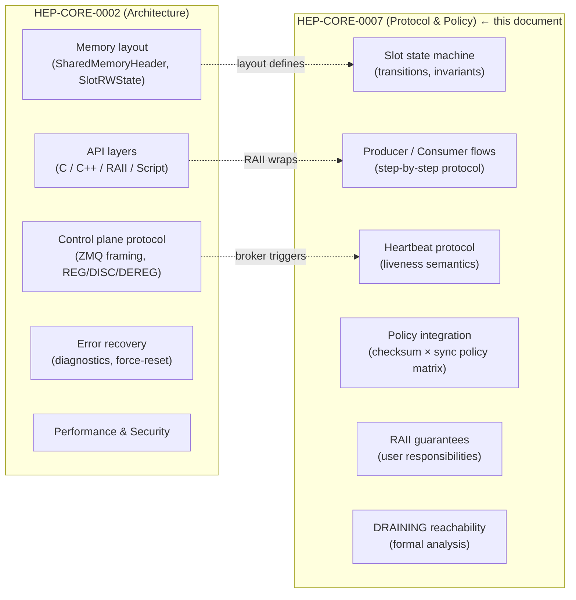
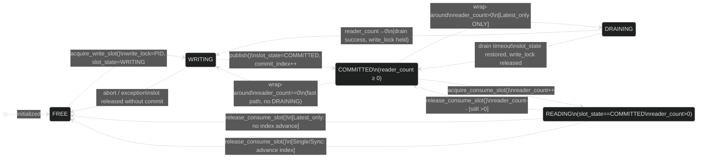
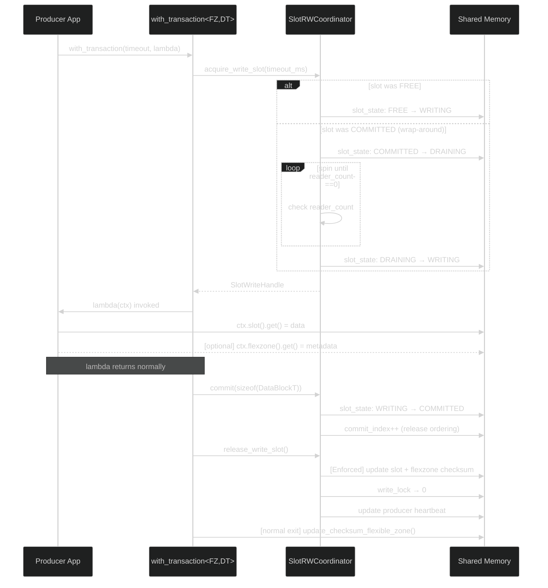
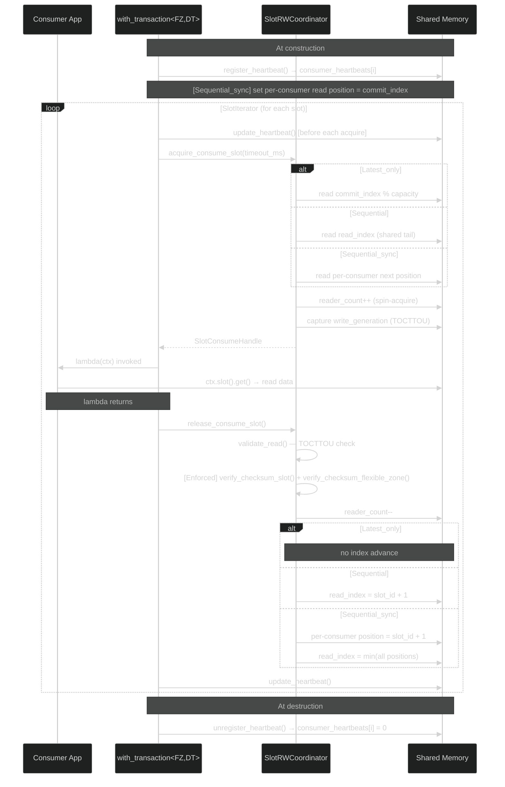
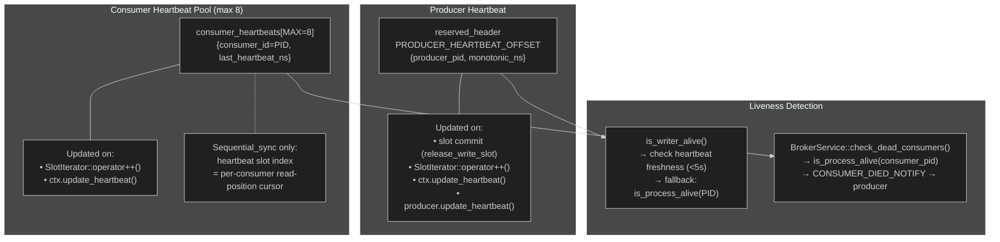
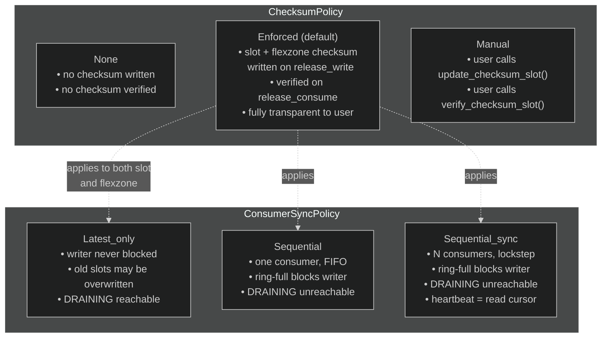
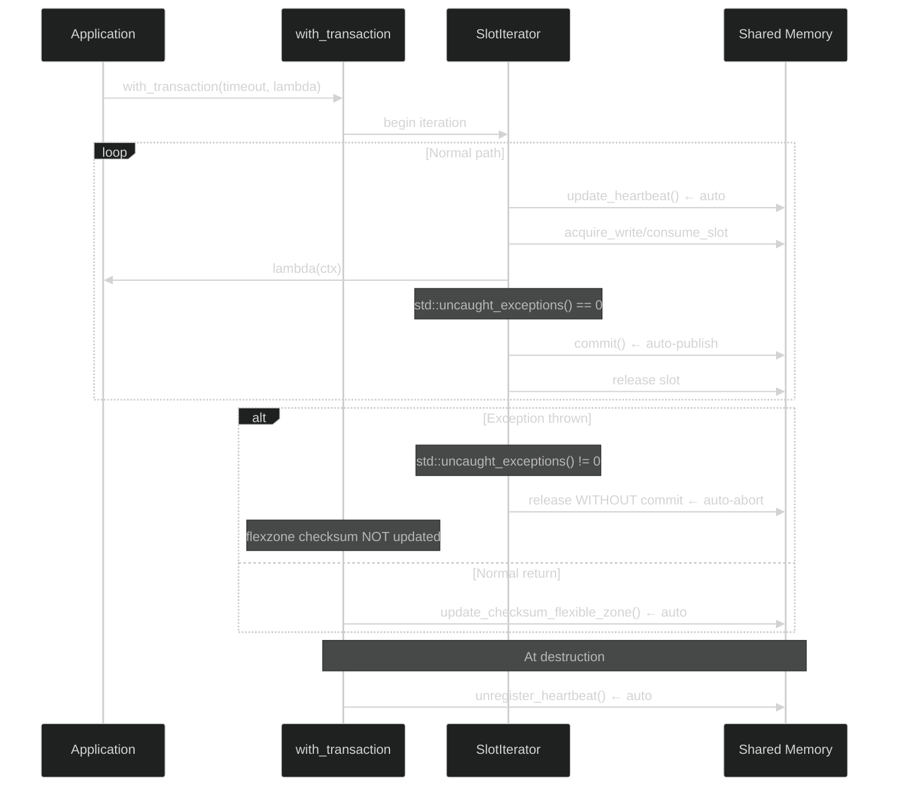
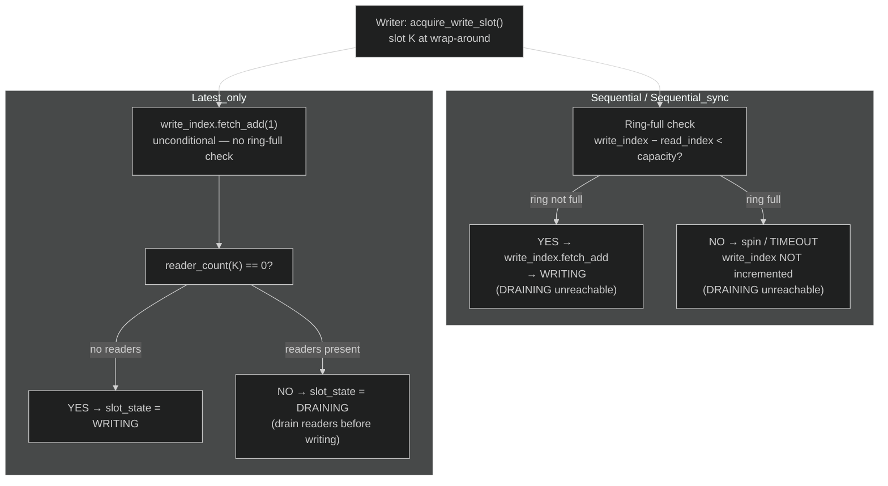

# HEP-CORE-0007: DataHub Protocol and Policy Reference

| Property         | Value                                                      |
| ---------------- | ---------------------------------------------------------- |
| **HEP**          | `HEP-CORE-0007`                                            |
| **Title**        | DataHub Protocol and Policy Reference                      |
| **Author**       | Quan Qing, AI assistant                                    |
| **Status**       | ✅ Active — canonical reference (promoted 2026-02-21; extended 2026-03-10) |
| **Category**     | Core                                                       |
| **Created**      | 2026-02-15                                                 |
| **Promoted**     | 2026-02-21 (was `docs/DATAHUB_PROTOCOL_AND_POLICY.md`)     |
| **Depends-on**   | HEP-CORE-0002 (DataHub), HEP-CORE-0006 (Slot-Processor)   |

This document is the **authoritative reference for slot-level protocol correctness**, policy
semantics, RAII layer guarantees, and user responsibilities. It covers the **slot-level
state machine**, producer/consumer protocol flows, FlexZone access semantics, DRAINING
policy, and user-facing RAII contracts.

**Scope split with HEP-CORE-0002:**



Update this document whenever protocol or policy behavior changes.

---

## Table of Contents

1. [Slot State Machine](#1-slot-state-machine)
2. [Protocol Flow — Producer](#2-protocol-flow--producer)
3. [Protocol Flow — Consumer](#3-protocol-flow--consumer)
4. [Heartbeat Protocol](#4-heartbeat-protocol)
5. [Policy Integration Table](#5-policy-integration-table)
6. [RAII Layer Guarantees](#6-raii-layer-guarantees)
7. [Explicit Control Points](#7-explicit-control-points-user-callable)
8. [User Responsibilities](#8-what-users-are-responsible-for)
9. [FlexZone and DataBlock Type Requirements](#9-flexzone-and-datablock-type-requirements)
10. [Invariants the System Maintains](#10-invariants-the-system-maintains)
11. [DRAINING Reachability by ConsumerSyncPolicy](#11-draining-reachability-by-consumersyncpolicy)
12. [ZMQ Control Plane Protocol](#12-zmq-control-plane-protocol)
13. [Source File Reference](#13-source-file-reference)

---

## 1. Slot State Machine

Each ring-buffer slot transitions through the following states. The state machine is enforced
by atomic operations in `SlotRWState`. `READING` is not a distinct `slot_state` value — it
is the logical overlay where `slot_state == COMMITTED` and `reader_count > 0`.



**State definitions:**
- `FREE` — available for writing; `write_lock == 0`
- `WRITING` — producer holds write_lock (PID-based); `slot_state == WRITING`
- `COMMITTED / READY` — data visible to consumers; `slot_state == COMMITTED`; `commit_index` advanced
- `READING` — consumer holds read lock (`reader_count > 0`); `slot_state` stays `COMMITTED`
- `DRAINING` — write_lock held; producer draining in-progress readers before writing. Entered
  when `acquire_write` wraps around a previously `COMMITTED` slot. New readers are rejected
  (`slot_state != COMMITTED → NOT_READY`). On drain success: → `WRITING`. On drain timeout:
  `slot_state` restored to `COMMITTED` (last data still valid); `write_lock` released.

> **Scope note:** For the `SlotRWState` memory layout and the C-API function signatures, see
> **HEP-CORE-0002 §3.3** and **§4.2**.

---

## 2. Protocol Flow — Producer



**Exception path:**
- If an exception propagates through `SlotIterator`, `std::uncaught_exceptions() != 0`,
  so auto-publish is skipped — slot is released without commit (`slot_state → FREE`).
- If an exception propagates through `with_transaction`, the flexzone checksum is NOT
  updated — leaving the stored checksum inconsistent with any partial flexzone writes.
  This is intentional: the checksum mismatch signals to consumers that the flexzone state
  is unreliable until the producer recovers and exits `with_transaction` normally.

**Step-by-step detail:**

```
1. acquire_write_slot(timeout_ms)
     → spin-acquire write_lock (PID-based CAS)
     → if previous slot_state == COMMITTED (wrap-around):
         → slot_state: COMMITTED → DRAINING  (new readers see non-COMMITTED → reject fast)
         → spin until reader_count == 0  (existing readers drain naturally)
         → on drain timeout: slot_state restored to COMMITTED; write_lock released → return nullptr
         → on drain success: slot_state: DRAINING → WRITING
     → if previous slot_state == FREE: slot_state: FREE → WRITING  (no readers possible)
     → returns SlotWriteHandle (or nullptr on timeout)
     → note: writer_waiting flag kept for diagnostic compat; set/cleared alongside DRAINING

2. Write data to slot buffer
     → via SlotWriteHandle::buffer_span() or WriteSlotRef::get()

3. [Optional] Write flexzone via ctx.flexzone().get()
     → flexzone is a shared memory region separate from the ring buffer
     → always visible to consumers regardless of slot commit state

4. publish() — or auto-publish at SlotIterator loop exit
     = SlotWriteHandle::commit(sizeof(DataBlockT))
         → sets slot_state: WRITING → COMMITTED
         → increments commit_index (release ordering — visible to consumers)
     + release_write_slot()
         → [ChecksumPolicy::Enforced] update slot checksum + update flexzone checksum
         → release write_lock
         → update producer heartbeat

5. [auto at with_transaction exit — conservative: only on normal return]
     → [ChecksumPolicy != None && FlexZoneT != void && !ctx.suppress_flexzone_checksum()]
     → update_checksum_flexible_zone()
     → This covers the case where the producer updated the flexzone but did not publish a slot
```

---

## 3. Protocol Flow — Consumer



**Step-by-step detail:**

```
1. [All policies] Heartbeat auto-registered on consumer construction.
     → register_heartbeat() called in find_datablock_consumer_impl
     → consumes one slot from consumer_heartbeats[MAX_CONSUMER_HEARTBEATS]
     → auto-updated by SlotIterator::operator++() on every iteration
     → auto-unregistered in DataBlockConsumerImpl destructor

2. [Sequential_sync only] Read position initialized at join time (join-at-latest).
     → consumer_next_read_slot_ptr(header, heartbeat_slot) set to current commit_index
     → done once at construction, not repeated per acquire

3. acquire_consume_slot(timeout_ms)
     → determine next slot via get_next_slot_to_read()
     → Latest_only:    latest committed slot (commit_index % capacity)
     → Sequential:  read_index (shared tail)
     → Sequential_sync:    consumer_next_read_slot_ptr(header, heartbeat_slot) (per-consumer)
     → spin-acquire read_lock (increment reader_count)
     → capture write_generation for TOCTTOU validation
     → returns SlotConsumeHandle (or nullptr on timeout/no-slot)

4. Read data from slot buffer
     → via SlotConsumeHandle::buffer_span() or ReadSlotRef::get()
     → validate_read() checks generation has not changed (TOCTTOU protection)

5. release_consume_slot() / SlotConsumeHandle destructor
     → validate_read_impl() — TOCTTOU check (always on, regardless of checksum policy)
     → [ChecksumPolicy::Enforced] verify_checksum_slot() + verify_checksum_flexible_zone()
     → decrement reader_count (release read_lock)
     → Latest_only:    no index advance
     → Sequential:  read_index = slot_id + 1 (shared advance)
     → Sequential_sync:    consumer_next_read_slot_ptr = slot_id + 1 (per-consumer advance)
                       read_index = min(all registered per-consumer positions)
```

---

## 4. Heartbeat Protocol

Heartbeats provide liveness signals for broker-level visibility and producer health checks.



### Producer Heartbeat

- Stored at `reserved_header[PRODUCER_HEARTBEAT_OFFSET]` as `{producer_pid, monotonic_ns}`.
- One dedicated slot (not from the consumer pool).
- Updated on: every slot commit, every `SlotIterator::operator++()` call, explicit
  `ctx.update_heartbeat()` / `producer.update_heartbeat()`.
- Read by `is_writer_alive()` — checks freshness; falls back to `is_process_alive()` if stale.
- Staleness threshold: `PRODUCER_HEARTBEAT_STALE_THRESHOLD_NS` (5 seconds).

### Consumer Heartbeat

- Stored in `consumer_heartbeats[MAX_CONSUMER_HEARTBEATS]` as `{consumer_id (PID), last_heartbeat_ns}`.
- Pool of `MAX_CONSUMER_HEARTBEATS = 8` slots (V1.0 ABI limit).
- **Enforced for all consumer sync policies** (Latest_only, Sequential, Sequential_sync).
  All consumers are registered for liveness; Sequential_sync additionally uses the slot index
  as the read-position cursor index in `reserved_header`.
- Updated on: every `SlotIterator::operator++()` call, explicit `ctx.update_heartbeat()`.
- Auto-registered at consumer construction (`find_datablock_consumer_impl`).
- Auto-unregistered at consumer destruction (`DataBlockConsumerImpl::~DataBlockConsumerImpl()`).

### User Responsibility for Long Per-Slot Operations

`SlotIterator::operator++()` fires a heartbeat before each slot acquisition attempt.
This covers the "waiting for a slot" gap. It does NOT cover long work inside the loop body.

If the work inside the loop body may block for seconds (camera exposure, heavy computation,
blocking I/O), call `ctx.update_heartbeat()` periodically:

```cpp
for (auto& result : ctx.slots(50ms)) {
    if (!result.is_ok()) { continue; }

    auto& slot = result.content();
    for (int frame = 0; frame < 1000; ++frame) {
        acquire_camera_frame(slot.get().buffer[frame]);
        if (frame % 100 == 0) { ctx.update_heartbeat(); }  // keep liveness signal fresh
    }
    break;
}
```

---

## 5. Policy Integration Table



| Policy | Producer Effect | Consumer Effect | RAII Auto-handling |
|---|---|---|---|
| `ChecksumPolicy::None` | No checksum computed | No checksum verified | N/A |
| `ChecksumPolicy::Enforced` | Slot + flexzone checksum updated on `release_write_slot()` | Slot + flexzone checksum verified on `release_consume_slot()` | Yes — fully transparent |
| `ChecksumPolicy::Manual` | User calls `slot.update_checksum_slot()` and `producer.update_checksum_flexible_zone()` | User calls `slot.verify_checksum_slot()` and `consumer.verify_checksum_flexible_zone()` | No — user responsible |
| `ConsumerSyncPolicy::Latest_only` | Never blocked on readers; old slots may be overwritten | Always reads latest committed slot | No heartbeat needed for read-position tracking; heartbeat still registered for liveness |
| `ConsumerSyncPolicy::Sequential` | Blocked when ring full and consumer has not advanced | Reads sequentially; shared `read_index` tracked | Same as above |
| `ConsumerSyncPolicy::Sequential_sync` | Blocked when slowest consumer is behind | Per-consumer read position tracked via heartbeat slot index | Heartbeat slot doubles as read-position cursor; always auto-registered at construction |
| `DataBlockPolicy::RingBuffer` | N-slot circular; wraps | Reads in policy-defined order | Managed by C API |

**Note — DRAINING reachability by policy.** `SlotState::DRAINING` is only ever entered by `Latest_only` producers. For `Sequential` and `Sequential_sync`, the ring-full check (`write_index - read_index < capacity`, evaluated *before* `write_index.fetch_add`) creates a structural barrier that makes DRAINING unreachable. See § 11 for the formal analysis.

---

## 6. RAII Layer Guarantees

These guarantees are provided by the C++ RAII layer and require no user action.



| Guarantee | Mechanism |
|---|---|
| **Auto-publish on normal SlotIterator exit** | `SlotIterator` destructor checks `std::uncaught_exceptions() == 0`; calls `commit()` if true |
| **Auto-abort on exception through SlotIterator** | `std::uncaught_exceptions() != 0` → slot released without commit → `slot_state → FREE` |
| **Auto-heartbeat every iterator iteration** | `SlotIterator::operator++()` calls `m_handle->update_heartbeat()` before each slot acquisition |
| **Auto-update flexzone checksum at with_transaction exit** | Producer `with_transaction` updates flexzone checksum after lambda returns normally (not on exception) |
| **No flexzone checksum update on exception** | Conservative path: partial flexzone writes leave stale checksum → consumer detects mismatch |
| **Slot generation validation on every consumer release** | `validate_read_impl()` called unconditionally in `release_consume_slot()` regardless of checksum policy |
| **Consumer heartbeat auto-registered at construction** | `find_datablock_consumer_impl` calls `register_heartbeat()` |
| **Consumer heartbeat auto-unregistered at destruction** | `DataBlockConsumerImpl::~DataBlockConsumerImpl()` releases heartbeat slot |
| **Producer heartbeat auto-updated on every commit** | `release_write_slot()` calls `update_producer_heartbeat_impl()` |

---

## 7. Explicit Control Points (User-Callable)

These are user-callable methods for cases where the automatic behavior is insufficient.

| Method | Who | When to Use |
|---|---|---|
| `ctx.publish()` | Producer | Force-publish current slot immediately (advanced control; auto-publish is sufficient for most uses) |
| `ctx.publish_flexzone()` | Producer | Immediately update flexzone checksum (e.g., before breaking from loop to ensure checksum is fresh) |
| `ctx.suppress_flexzone_checksum()` | Producer | Prevent auto-update of flexzone checksum at `with_transaction` exit (e.g., when flexzone was not modified in this transaction) |
| `ctx.update_heartbeat()` | Producer + Consumer | Keep heartbeat fresh during long per-slot operations inside the loop body |
| `producer.update_heartbeat()` | Producer | Keep heartbeat fresh when not inside a `with_transaction` loop |
| `producer.update_checksum_flexible_zone()` | Producer | Update flexzone checksum outside a `with_transaction` call |

---

## 8. What Users Are Responsible For

1. **`ChecksumPolicy::Manual`**: Call `slot.update_checksum_slot()` before `release_write_slot()`,
   and `slot.verify_checksum_slot()` before consuming. Same for flexzone checksums.

2. **Long per-slot operations**: Call `ctx.update_heartbeat()` periodically inside the loop body
   if per-slot processing may block for more than a few seconds.

3. **Flexzone-only writes (no slot publish)**: `with_transaction` auto-updates the flexzone
   checksum on normal exit. If you write the flexzone and then return normally from the lambda,
   the checksum is automatically updated. If you want to update it earlier (before the lambda
   returns), call `ctx.publish_flexzone()`.

4. **Flexzone write suppression**: If your `with_transaction` lambda does not write the flexzone,
   call `ctx.suppress_flexzone_checksum()` to avoid an unnecessary checksum recomputation.
   (The recomputation is not wrong, just wasteful.)

5. **Heartbeat pool capacity**: The consumer heartbeat pool holds `MAX_CONSUMER_HEARTBEATS = 8`
   entries (V1.0 ABI). If all slots are occupied, `register_heartbeat()` returns -1 and a
   warning is logged. Design your application so the total number of concurrent consumers on
   a single DataBlock does not exceed 8.

6. **Reconnect = Re-register invariant (broker layer)**: If a producer or consumer
   disconnects and reconnects at the ZMQ transport layer (e.g., due to a network flap or
   process restart), the broker's ROUTER socket assigns a **new ROUTER identity** to the
   reconnected peer. The old ROUTER identity in the broker's channel registry is now stale
   and will be purged on the next heartbeat timeout.
   - A reconnected **producer** must send a fresh `REG_REQ` to get its new identity
     registered. The broker does not automatically detect reconnection — it waits for
     the heartbeat to expire and issues `CHANNEL_CLOSING_NOTIFY`.
   - A reconnected **consumer** must send a fresh `CONSUMER_REG_REQ`.
   - **Design implication**: reconnect handling is identical to a fresh start. No
     special reconnect path exists; the producer/consumer bootstrap sequence covers it.

---

## 9. FlexZone and DataBlock Type Requirements

### Trivially-Copyable Constraint

Both `FlexZoneT` and `DataBlockT` must satisfy `std::is_trivially_copyable_v<T>`. This is
enforced at compile time by `static_assert` in `ZoneRef`, `SlotRef`, and `TransactionContext`.

**Why it matters:** Slot and flexzone data live in a POSIX/Win32 shared memory segment. The
checksum mechanism copies the raw bytes of the struct. Types that are not trivially copyable
may contain internal pointers, OS handles, or virtual dispatch tables that are meaningless
across process boundaries.

**Common pitfall — `std::atomic<T>` members:**

```cpp
// WRONG — fails static_assert on MSVC (std::atomic<T> has deleted copy ctor/assign)
struct BadFlexZone {
    std::atomic<uint32_t> counter{0};  // NOT trivially copyable on MSVC
    std::atomic<bool> flag{false};     // same issue
};

// CORRECT — plain POD layout; apply atomic_ref<T> at call sites when needed
struct GoodFlexZone {
    uint32_t counter{0};
    uint32_t flag{0};  // 0 = false, 1 = true
};
```

On GCC/Linux `std::atomic<T>` for lock-free integer types happens to pass the
`is_trivially_copyable` check, but this is non-portable. MSVC explicitly marks
`std::atomic<T>` as non-trivially copyable because its copy constructor is deleted.
Always use plain POD types.

### Atomic Access Pattern for FlexZone Fields

**Inside `with_transaction`** — no per-field atomics needed.
The `with_transaction` call holds a `SharedSpinLock` whose acquire uses
`memory_order_acquire` and release uses `memory_order_release`. This provides a full
memory fence; plain reads and writes inside the lambda are sequentially consistent.

```cpp
producer->with_transaction<GoodFlexZone, Payload>(timeout, [](auto& ctx) {
    // Spinlock held — plain assignment is safe and sequentially ordered.
    ctx.flexzone().get().counter = 42;
    ctx.flexzone().get().flag = 1;
});
```

**Outside `with_transaction`** — use `std::atomic_ref<T>` (C++20).
If a consumer needs to poll a FlexZone field _without_ acquiring the lock (e.g. a
UI thread reading a status flag the producer sets), use `std::atomic_ref<T>` to impose
atomic semantics on the plain storage:

```cpp
// Producer side (inside with_transaction — plain write is fine):
ctx.flexzone().get().flag = 1;

// Consumer side (outside with_transaction — atomic read via atomic_ref):
auto& fz = *reinterpret_cast<GoodFlexZone*>(
    consumer.flexible_zone_span().data()); // low-level raw access
uint32_t v = std::atomic_ref<uint32_t>(fz.flag).load(std::memory_order_acquire);
```

`std::atomic_ref<T>` requires the underlying storage to be suitably aligned and of a
lock-free-compatible size (same requirements as placing a `std::atomic<T>` there).
Use `alignas` on the struct member if necessary.

**Summary table:**

| Access location | Pattern | Why |
|---|---|---|
| Inside `with_transaction` | Plain read/write | Spinlock provides acquire/release fence |
| Outside lock — lock-free poll | `std::atomic_ref<T>(field).load/store` | Imposes atomic semantics on POD storage |
| Outside lock — full mutual exclusion | Acquire the spinlock via C API | Strongest guarantee; heavier weight |

---

## 10. Invariants the System Maintains

These are invariants that hold at all times during correct operation. Violation indicates
a bug in the protocol implementation, not user code.

- `commit_index >= read_index` always (ring buffer does not advance past readers).
- `write_lock` is always cleared (→ 0) on `release_write_slot()`, regardless of commit state.
- `reader_count` for a slot is always decremented by `release_consume_slot()` or `SlotConsumeHandle` destructor.
- `consumer_heartbeats[i].consumer_id` is 0 (unregistered) or a valid PID.
- `active_consumer_count` equals the number of entries in `consumer_heartbeats[]` with `consumer_id != 0`.
- The stored flexzone checksum reflects the last `update_checksum_flexible_zone()` call, not necessarily the current flexzone content (checksum is a snapshot).
- For `Sequential` and `Sequential_sync`: `write_index - read_index < capacity` at the moment of the ring-full check (before `fetch_add`) guarantees the writer never reaches a slot held by the slowest active reader. DRAINING is therefore structurally unreachable for those policies.

---

## 11. DRAINING Reachability by ConsumerSyncPolicy

### Claim

`SlotState::DRAINING` is only reachable for `ConsumerSyncPolicy::Latest_only`.
For `Sequential` and `Sequential_sync` it is structurally unreachable; the ring-full
check creates a hard arithmetic barrier before any drain attempt can occur.



### Proof (ring-full barrier)

**Preconditions:**

1. Reader **R** holds slot **K** (i.e., `reader_count(K) ≥ 1`).
   - `read_index` has NOT yet advanced past K — it advances only inside
     `release_consume_slot()`, not at acquire time.
   - Therefore: `read_index ≤ K`.
   - For `Sequential_sync`, `read_index = min(all registered per-consumer positions)`; still `≤ K`.

2. Writer **W** tries to overwrite the same physical slot (ring wrap).
   - Physical slot `K % capacity` is reused when `write_index = K + capacity`.
   - DRAINING is entered by `acquire_write()` **after** `write_index.fetch_add(1)` (irrevocable).

**Ring-full check (before `fetch_add`):**

```
(write_index.load() - read_index.load()) < capacity   →  proceed
(write_index.load() - read_index.load()) ≥ capacity   →  spin / return TIMEOUT
```

**For W to reach slot K (same physical slot), W needs `write_index = K + capacity`.**

Ring-full condition at that moment:

```
(K + capacity) - read_index < capacity
⟺  K < read_index
```

But from precondition 1: `read_index ≤ K`.
**Contradiction.** The ring-full check always fires before `fetch_add` reaches `K + capacity`.

**Therefore:**
- `write_index.fetch_add(1)` to value `K + capacity` is impossible while reader R holds slot K.
- `acquire_write()` for slot K is never called.
- DRAINING is never entered.

### Why `Latest_only` is different

`Latest_only` has **no ring-full check**. The writer advances `write_index.fetch_add(1)`
unconditionally on every call. Multiple slot-IDs can be issued and "overwritten" without
reader coordination. DRAINING is the mechanism that prevents corruption when a reader is
actively reading the slot being overwritten — the writer pauses until `reader_count → 0`.

### Discriminating metric

`writer_reader_timeout_count` is incremented **only** by the drain-spin timeout path inside
`acquire_write()`. The ring-full timeout path increments `writer_timeout_count` only.

| Policy | Expected on reader stall |
|---|---|
| `Latest_only` | `writer_reader_timeout_count > 0` — drain spin timed out |
| `Sequential` | `writer_reader_timeout_count == 0` — ring-full blocked; no drain ever attempted |
| `Sequential_sync` | `writer_reader_timeout_count == 0` — same ring-full barrier |

This is verified by tests `DatahubSlotDrainingTest.SingleReaderRingFullBlocksNotDraining`
and `DatahubSlotDrainingTest.SyncReaderRingFullBlocksNotDraining`.

---

## 12. ZMQ Control Plane Protocol

> **Note (2026-04-10):** The Peer-to-Peer message category, CHANNEL_NOTIFY_REQ,
> CHANNEL_BROADCAST_REQ, CHANNEL_EVENT_NOTIFY, and CHANNEL_BROADCAST_NOTIFY
> are **superseded** by HEP-CORE-0030 (Band Messaging Protocol).
> The new protocol replaces asymmetric producer-owned channels with symmetric
> broker-hosted pub/sub groups (bands). See HEP-CORE-0030 for the replacement protocol.

This section is the authoritative reference for the **ZMQ control plane** — all broker
protocol messages, unsolicited notifications, and how they flow through the system
to script callbacks.

### Data Packaging Agreement

All ZMQ control plane messages use JSON encoding. User-supplied data follows these rules:

1. **User data is always a string** — the `"data"` field in the JSON body
2. **The `"data"` field is always present** when the API accepts a `data` parameter;
   it may be an empty string `""`
3. **The framework passes the string through transparently** — no wrapping, no encoding,
   no parsing. If the user sends `"world"`, the receiver gets `"world"`
4. **If the user wants structured data**, they encode it themselves (e.g. as JSON) and
   the receiver decodes it — that's the application's responsibility, not the framework's

This applies to:
- `api.band_broadcast(band, body)` → `"data"` field in BAND_BROADCAST_REQ
- Band messaging (HEP-CORE-0030) — all band messages use JSON bodies

### 12.1 Message Framing

All ZMQ messages use a multi-frame format. Frame 0 is a single-byte type discriminator.

```
Control frame (Role ↔ Broker via BrokerRequestComm):
  Frame 0: 'C'               (1 byte — control type)
  Frame 1: message_type       (string, e.g. "REG_REQ")
  Frame 2: JSON payload        (string)

ROUTER envelope (broker side prepends identity):
  Frame 0: [ZMQ identity]     (opaque ROUTER envelope)
  Frame 1: 'C'
  Frame 2: message_type
  Frame 3: JSON payload
```

### 12.2 Message Categories

Messages are grouped into four categories based on their flow pattern:

| Category | Pattern | Examples |
|----------|---------|---------|
| **Request/Response** | Client → Broker → Client | REG_REQ/ACK, DISC_REQ/ACK, CHANNEL_LIST_REQ/ACK, METRICS_REQ/ACK, ROLE_PRESENCE_REQ/ACK, ROLE_INFO_REQ/ACK, ENDPOINT_UPDATE_REQ/ACK |
| **Fire-and-Forget** | Client → Broker (no reply) | HEARTBEAT_REQ, CHECKSUM_ERROR_REPORT, BAND_BROADCAST_REQ |
| **Unsolicited Push** | Broker → Client (async) | CHANNEL_CLOSING_NOTIFY, CONSUMER_DIED_NOTIFY, BAND_JOIN_NOTIFY, BAND_LEAVE_NOTIFY, BAND_BROADCAST_NOTIFY, ROLE_REGISTERED_NOTIFY, ROLE_DEREGISTERED_NOTIFY |
| **Band Pub/Sub** | Role → Broker → Members (HEP-CORE-0030) | BAND_JOIN_REQ/ACK, BAND_LEAVE_REQ/ACK, BAND_BROADCAST_REQ, BAND_MEMBERS_REQ/ACK |

### 12.2.1 REQ shape contract — Sync vs Fire-and-Forget (added 2026-05-21)

Every wire frame ending in `_REQ` belongs to exactly one of two
shapes.  The HEP defining a `_REQ` MUST state which shape it is in
the corresponding subsection of §12.3 or §12.4.

**Sync Request/Response (§12.3)** — broker mutates state or computes
a result, then sends `_ACK` (success) or `ERROR` (rejection).
- **Client API**: `std::optional<json> X(..., int timeout_ms)`.
  Blocks up to `timeout_ms` and returns the broker's reply (or
  `nullopt` on timeout / transport failure).
- **Caller contract**: must inspect the return.  Branch on
  success / typed error / timeout.
- **When to use**: whenever the caller's next decision depends on
  whether the broker accepted the operation.  The ACK is a
  durability guarantee — the broker mutates state BEFORE emitting
  the ACK, so any subsequent observation by any other client is
  guaranteed to see the mutation.
- **Complete list (audit 2026-05-21):** REG_REQ, DISC_REQ,
  DEREG_REQ, CONSUMER_REG_REQ, CONSUMER_DEREG_REQ,
  ENDPOINT_UPDATE_REQ, CHANNEL_LIST_REQ, SHM_BLOCK_QUERY_REQ,
  ROLE_PRESENCE_REQ, ROLE_INFO_REQ, BAND_JOIN_REQ,
  BAND_LEAVE_REQ, BAND_MEMBERS_REQ.  Also: SCHEMA_REQ and
  METRICS_REQ exist as broker handlers but have no production
  caller — see task #95 for KEEP-RESERVED / DELETE decision.

**Fire-and-Forget (§12.4)** — broker processes silently; no reply
on the wire.
- **Client API**: returns `void`.
- **Caller contract**: must NOT depend on broker acceptance.  Loss
  is recoverable at a higher level (e.g. the next periodic
  re-assertion).
- **When to use**: heartbeats, telemetry, periodic state
  re-assertions — anything where the caller can correctly proceed
  regardless of acceptance.
- **Complete list (audit 2026-05-21):** HEARTBEAT_REQ,
  CHECKSUM_ERROR_REPORT, CHANNEL_BROADCAST_REQ, BAND_BROADCAST_REQ.

**Don't mix.**  A `_REQ` that has a wire `_ACK` MUST have a sync
client API that observes it.  A `_REQ` whose client API returns
`void` MUST NOT have a wire `_ACK` — sending a reply nobody reads
wastes bandwidth and creates the false impression of acknowledgement.

**Mixed-shape implementations are protocol bugs.**  Detected by:
- Broker emits `_ACK` but `BrokerRequestComm` method returns `void`
  (the ACK is dropped at the client).
- Client API blocks waiting for an `_ACK` the broker never sends
  (deadlock waiting for a reply that doesn't exist).

Both cases require either the broker side or the client side to be
brought in line; the rule above tells you which.  Existing in-tree
audit + remediation tracked as a P3 follow-up (see harness task
#92).

### 12.3 Request/Response Messages

These follow a strict request → response pattern. The client blocks on a future
until the broker sends the corresponding ACK or ERROR.

#### REG_REQ / REG_ACK — Register Producer Channel

```
Direction:  Producer → Broker → Producer
Trigger:    BrokerRequestComm::register_channel() (called from RoleAPIBase during role startup)
Sequence:
  1. Producer sends REG_REQ with channel identity, schema, and SHM info
  2. Broker validates connection policy, admits or restart-replaces the
     producer in ChannelEntry.producers per the admission table below
  3. Broker sends REG_ACK (status="success") or ERROR
  4. Producer registers heartbeat on success

Admission semantics (HEP-CORE-0023 §2.1.1 multi-producer model):
  ┌─────────────────────────────────────┬──────────────────────────────────────────┐
  │ State when REG_REQ arrives          │ Broker action                             │
  ├─────────────────────────────────────┼──────────────────────────────────────────┤
  │ Channel does not exist              │ Create ChannelEntry; admit the producer   │
  │                                     │ as the first ProducerEntry.               │
  ├─────────────────────────────────────┼──────────────────────────────────────────┤
  │ Channel exists; new role_uid;       │ ZMQ transport: append the producer as a   │
  │ schema_hash + packing match         │   new ProducerEntry on                    │
  │ existing channel-wide invariant     │   ChannelEntry.producers.  Channel becomes│
  │                                     │   multi-producer (Fan-In, HEP-0017 §4.6). │
  │                                     │ SHM transport: reject with                │
  │                                     │   MULTI_PRODUCER_NOT_SUPPORTED_FOR_SHM    │
  │                                     │   (§12.4a) — SHM is physically            │
  │                                     │   single-producer.                        │
  ├─────────────────────────────────────┼──────────────────────────────────────────┤
  │ Channel exists; same role_uid as an │ Restart-replace: replace that producer's  │
  │ already-admitted ProducerEntry      │ ProducerEntry in place; reset its         │
  │ (producer restart case)             │ producer-presence to fresh Connected      │
  │                                     │ (first_heartbeat_seen=false).  No new     │
  │                                     │ ProducerEntry is appended.                │
  ├─────────────────────────────────────┼──────────────────────────────────────────┤
  │ Channel exists; schema_hash or      │ Reject with SCHEMA_MISMATCH.              │
  │ packing differs from the channel-   │ Broker also fires a one-shot              │
  │ wide invariant                      │ CHANNEL_ERROR_NOTIFY to every existing    │
  │                                     │ ProducerEntry as diagnostic.              │
  └─────────────────────────────────────┴──────────────────────────────────────────┘

Channel-wide schema invariant: every producer on the same channel
MUST publish identical schema_hash + schema_blds + packing.  Per-
producer private-schema records (HEP-CORE-0034 namespace-by-owner)
remain owner-keyed per producer role_uid; the invariant gate is the
channel-wide hash/packing equality, not record-instance equality.

Cross-tag admission: ZMQ Fan-In channels admit producers from
heterogeneous role tags (prod.X, proc.Y, etc.) per HEP-CORE-0017
§4.6 (a processor's out_channel makes it a producer side).  The
schema invariant applies uniformly.

Payload (REG_REQ):
  channel_name          string   Channel identifier (e.g. "lab.sensors.raw")
  shm_name              string   SHM segment name (= channel_name when has_shared_memory)
  producer_pid          uint64   Producer process ID
  has_shared_memory     bool     Whether SHM segment exists
  role_name             string   (opt) Human-readable producer name
  role_uid              string   (opt) Producer UID
                                 (HEP-CORE-0033 §G2.2.0a: "$<base>.uid<8hex>")

  # Schema-citation fields — see HEP-CORE-0034 §10.1 for the full
  # schema-related wire-field list (schema_id / schema_owner /
  # schema_hash / schema_blds / schema_packing / flexzone_blds /
  # flexzone_packing) and HEP-CORE-0034 §6.3 for the canonical-form
  # rule.  HEP-0007 is the message-frame contract; HEP-0034 owns the
  # schema-field semantics.

  # Inbox-citation fields — see HEP-CORE-0027 §4.1 (inbox_endpoint /
  # inbox_schema_json / inbox_packing / inbox_checksum) and
  # HEP-CORE-0034 §11.4 for owner-keyed storage.

Payload (REG_ACK):
  status                string   "success"
  channel_id            string   Echo of the requested channel_name.
  message               string   "Producer registered successfully" (informational).
  heartbeat             object   Per-presence heartbeat configuration block
                                 (HEP-CORE-0023 §2.5):
                                   interval_ms             int     Heartbeat cadence
                                   ready_miss_heartbeats   int     Misses before Connected→Pending
                                   pending_miss_heartbeats int     Misses before Pending→Disconnected (atomic teardown)
  correlation_id        string   (opt) Echo of request correlation_id if provided.

role_type field (added 2026-03-10):
  role_type             string   (opt) "producer" | "consumer" | "processor"
                                 Recorded in ChannelEntry; broadcast in ROLE_REGISTERED_NOTIFY.
                                 Absent field treated as "producer" for backward compatibility.
```

#### DISC_REQ — Discover Channel (three-response state-machine, HEP-CORE-0023 §2.2)

```
Direction:  Consumer → Broker → Consumer
Trigger:    BrokerRequestComm::discover_channel()
Pattern:    Synchronous request/reply. Broker always replies immediately —
            no queued/deferred responses. The reply encodes one of three
            outcomes derived from the producer-PRESENCE's FSM state
            (HEP-CORE-0023 §2.1); the client decides how to react.

Payload (DISC_REQ):
  channel_name          string

Broker dispatch logic (multi-producer aware per HEP-CORE-0023 §2.1.1):
  let ch = HubState.channels[channel_name]
  if ch == nullptr:
      reply ERROR "CHANNEL_NOT_FOUND"

  // Scan every ProducerEntry on the channel.  In single-producer
  // channels this is a 1-element loop; in ZMQ Fan-In channels
  // (HEP-CORE-0017 §4.6) it visits each co-producer.
  let live_producer = first p in ch.producers such that
       HubState.roles[p.role_uid]
           .find_presence(channel_name, "producer")
           ≠ nullptr AND state == Connected AND first_heartbeat_seen
  let any_pending  = exists p in ch.producers such that
       presence is Connected (no heartbeat yet) OR Pending

  if live_producer present:
      reply DISC_ACK with connection info (pick one live producer's
      endpoint; for Fan-In channels with multiple endpoints, return
      the canonical first or a list — see "DISC_ACK fan-in payload"
      below)
  elif any_pending:
      reply DISC_PENDING (no connection info — client MUST retry)
  else:
      // No producer-presence currently alive; ChannelEntry is
      // removed atomically when the LAST producer transitions
      // Disconnected (HEP-CORE-0023 §2.1.1), so this branch is
      // rare — only the brief window between presence transition
      // and channel removal.
      reply ERROR "CHANNEL_NOT_FOUND"
```

**Reply variant 1 — DISC_ACK (producer-presence Connected, heartbeats fresh):**
```
Payload:
  status                string   "success"
  shm_name              string   SHM segment to attach
  schema_hash           string   64-char hex hash
  schema_version        uint32
  has_shared_memory     bool
  consumer_count        uint32   Current consumer count on this channel
  schema_id             string   (opt) Named schema ID
  blds                  string   (opt) BLDS string
  data_transport        string   "shm" or "zmq"
  metadata              object   Per-producer metadata tree.  Each key is a
                                 producer `role_uid` (HEP-CORE-0033 §G2.2.0b);
                                 each value is that producer's REG_REQ-supplied
                                 free-form JSON blob.  Producers with null
                                 metadata are omitted from the tree (not
                                 present-as-`null`).  Empty tree is `{}`,
                                 never `null` — consumers may rely on the
                                 field being an object.
  channel_pattern       string   "PubSub" or other ChannelPattern variant.
  zmq_pubkey            string   (if CURVE) Producer's published CURVE public
                                 key (Z85, 40 chars).  HEP-CORE-0021 §5.2
                                 specifies this is per-producer; Wave M2.5
                                 stores it on `ProducerEntry.zmq_pubkey`.
                                 This DISC_REQ_ACK field returns the FIRST
                                 admitted producer's pubkey for the legacy
                                 single-producer shape; consumers needing
                                 every producer's pubkey should read the
                                 per-producer entries via the admin API
                                 (`query_channel_snapshot` →
                                 `producer_uids` + per-producer queries).
  zmq_node_endpoint     string   (if data_transport="zmq") Producer's node endpoint
                                 (HEP-CORE-0021).  Wave M2.5 makes this
                                 per-producer; this field returns the FIRST
                                 admitted producer's endpoint for the legacy
                                 single-producer shape — consumers that
                                 need every producer should read the
                                 `producers[]` field instead.
  correlation_id        string   (opt) Echo of request correlation_id if provided.
```

**Reply variant 2 — DISC_PENDING (producer-presence registered but heartbeats not fresh):**
```
Payload:
  status                string   "pending"
  channel_name          string   Echo of the requested channel
  reason                string   One of:
                                   "awaiting_first_heartbeat" — producer-presence
                                       Connected but `first_heartbeat_seen=false`
                                       (REG_REQ accepted but no HEARTBEAT_REQ yet).
                                   "heartbeat_stalled" — producer-presence in
                                       state Pending (heartbeats stopped past the
                                       ready_timeout but recoverable; see
                                       HEP-CORE-0023 §2.2).
  correlation_id        string   (opt) Echo of request correlation_id if provided.

Meaning: the producer has been registered but its presence is not Live.  The
broker does NOT queue this request; the client must retry DISC_REQ after a
short delay.  The retry cadence is a client policy (default 100ms) and is
bounded by the client's overall discover timeout.  The two reason values let
the client distinguish "still starting up" from "was live but stalled" for
diagnostics; both require the same retry behavior.
```

**Reply variant 3 — ERROR CHANNEL_NOT_FOUND (channel not registered):**
```
Payload:
  status                string   "error"
  error_code            string   "CHANNEL_NOT_FOUND"
  message               string   Human-readable description.
  correlation_id        string   (opt) Echo of request correlation_id if provided.

Meaning: no producer has sent REG_REQ for this channel_name. Client should
retry if it is within its own discover timeout (producer may register later);
after the client timeout, the caller gives up.
```

**Design rationale (three-response state machine):**
1. **Bounded broker memory.** The broker does NOT hold pending DISC_REQs.
   State storage is O(registered roles), not O(outstanding requests).
2. **Predictable semantics.** A DISC_REQ always returns the current state of
   the role registry. No invisible "reply pending" state on the broker.
3. **Client owns retry policy.** Different clients may tolerate different
   delays; encoding a broker-side timeout forces one policy on everyone.
4. **Observability.** Any query at any time reflects the role registry state.
   No need to reason about "what's in the deferred queue."

**Replaces:** HEP-CORE-0023 §2 "Deferred DISC_ACK" (broker-side queuing model),
which had the broker hold replies until role transition. That design was
superseded on 2026-04-14 by the three-response state machine.

#### CONSUMER_REG_REQ / CONSUMER_REG_ACK — Register Consumer

```
Direction:  Consumer → Broker → Consumer
Trigger:    After successful DISC_REQ/ACK; part of connect_channel() sequence
Sequence:
  1. Consumer sends CONSUMER_REG_REQ with identity
  2. Broker validates expected_schema_id/hash if provided
  3. Broker stores consumer in ChannelEntry.consumers[]
  4. Broker sends CONSUMER_REG_ACK or ERROR (e.g. "SCHEMA_MISMATCH")

Payload (CONSUMER_REG_REQ):
  channel_name          string
  consumer_pid          uint64
  consumer_hostname     string
  consumer_uid          string   (opt) Consumer UID
  consumer_name         string   (opt) Human-readable name

  # Schema-citation fields — see HEP-CORE-0034 §10.2 + §10.3 for the
  # full citation field list and rules:
  #   Named mode:     expected_schema_id + expected_schema_hash (required);
  #                   expected_schema_blds + expected_schema_packing (optional,
  #                   defense-in-depth)
  #   Anonymous mode: expected_schema_blds + expected_schema_packing
  #                   (required); expected_schema_hash (optional,
  #                   self-consistency)
  #   Plus expected_flexzone_blds / expected_flexzone_packing when the
  #   citer's structure includes a flexzone.

Payload (CONSUMER_REG_ACK):
  status                string   "success"
  channel_name          string   Echo of the requested channel_name.
  message               string   "Consumer registered successfully" (informational).
  heartbeat             object   Per-presence heartbeat configuration block — same
                                 shape as REG_ACK.heartbeat (HEP-CORE-0023 §2.5).
  correlation_id        string   (opt) Echo of request correlation_id if provided.
  producers             array    (HEP-CORE-0036 §6.4, T1 locked 2026-05-28;
                                 HEP-CORE-0021 §5.2 sibling-sync 2026-05-28)
                                 Per-producer descriptors for the channel.  Length 1
                                 for single-producer channels; length N for fan-in
                                 (HEP-CORE-0023 §2.1.1 — ZMQ-only; SHM rejects N>1).
                                 Each element: {role_uid, pubkey, endpoint}.
                                 `pubkey` is the producer's IDENTITY pubkey (HEP-0036
                                 I6 — broker mints NO data-plane CURVE keys); `endpoint`
                                 is the producer's bound TCP endpoint (per HEP-0021 §16).
                                 REPLACES the pre-HEP-0036 singular `zmq_endpoint` +
                                 `producer_zmq_pubkey` shape (now retired wire fields).
                                 For SHM transport: `producers[]` is absent; `shm_name`
                                 + `shm_secret` carry the SHM attach info (HEP-0036 §6.4).

role_type field (added 2026-03-10):
  role_type             string   (opt) "producer" | "consumer" | "processor"
                                 Allows broker to distinguish processor consumers from
                                 plain consumers in ROLE_REGISTERED_NOTIFY broadcasts.
```

#### CONSUMER_DEREG_REQ / CONSUMER_DEREG_ACK — Deregister Consumer

```
Direction:  Consumer → Broker → Consumer
Trigger:    Consumer::close() or graceful shutdown
Effect:     Broker removes the consumer matching (channel_name, consumer_pid,
            role_uid) from ChannelEntry.consumers[].  Resolution is by the
            (pid, role_uid) tuple — both must match the same admitted
            consumer.  pid-only resolution was racy under OS pid reuse
            across consumer restarts (broker_proto 2→3 closure, 2026-05-15;
            audit C3).

Payload (CONSUMER_DEREG_REQ):
  channel_name          string
  role_uid              string   REQUIRED — consumer's role_uid (the same
                                  value carried on CONSUMER_REG_REQ).
                                  Missing/empty → broker replies ERROR
                                  with error_code="INVALID_REQUEST".
  consumer_pid          uint64

  Resolution: the broker scans `ChannelEntry.consumers[]` for an entry
  where BOTH `consumer_pid == wire.consumer_pid` AND
  `role_uid == wire.role_uid`.  Mismatch on either field →
  error_code="NOT_REGISTERED".

Payload (CONSUMER_DEREG_ACK):
  status                string   "success"
  message               string   "Consumer deregistered successfully" (informational).
  correlation_id        string   (opt) Echo of request correlation_id if provided.
```

#### DEREG_REQ / DEREG_ACK — Deregister Channel

```
Direction:  Producer → Broker → Producer
Trigger:    BrokerRequestComm::deregister_channel() during role shutdown
Effect:     Removes the producer-presence (or, if this is the LAST
            producer, the channel record itself + atomic CHANNEL_CLOSING_NOTIFY
            fan-out per HEP-CORE-0023 §2.1.1).  Resolution is by the
            (pid, role_uid) tuple — both must match the same admitted
            producer.  HEP-CORE-0023 §2.1.1 multi-producer channels admit
            multiple producers; pid-alone resolution was racy under OS
            pid reuse (broker_proto 2→3 closure, 2026-05-15; audit C3).

Payload (DEREG_REQ):
  channel_name          string
  role_uid              string   REQUIRED — producer's role_uid (same
                                  value carried on REG_REQ).  Missing or
                                  empty → broker replies ERROR with
                                  error_code="INVALID_REQUEST".
  producer_pid          uint64

  Resolution: the broker scans `ChannelEntry.producers[]` for an entry
  where BOTH `producer_pid == wire.producer_pid` AND
  `role_uid == wire.role_uid`.  Mismatch on either field →
  error_code="NOT_REGISTERED".

Payload (DEREG_ACK):
  status                string   "success"
  message               string   "Producer deregistered successfully" (informational).
  correlation_id        string   (opt) Echo of request correlation_id if provided.
```

#### SCHEMA_REQ / SCHEMA_ACK — Fetch Schema Record (HEP-CORE-0034 §10.3)

```
Direction:  Any → Broker → Any
Trigger:    Any participant fetching a schema record by owner+id
            (e.g. consumer pre-flight before CONSUMER_REG_REQ).

Payload (SCHEMA_REQ):
  owner                 string   "hub" or producer/inbox-receiver uid
  schema_id             string   "frame", "lab.sensors.x@1", "inbox", ...

Payload (SCHEMA_ACK):
  status                string   "success" | error reason
  owner                 string   echo
  schema_id             string   echo
  schema_hash           string   64-char hex hash; BLAKE2b-256 over the
                                 HEP-CORE-0034 §6.3 canonical wire form
                                 ("slot:" + canon_fields + "|pack:" + packing
                                 [+ flexzone section]).
  packing               string   "aligned" | "packed"
  blds                  string   canonical wire-form BLDS for ctypes
                                 reconstruction (HEP-CORE-0034 §6.3 form,
                                 NOT the HEP-CORE-0002 BLDS short-token form
                                 used in SHM-header SchemaInfo)
  correlation_id        string   (opt) Echo of request correlation_id if provided.

Legacy `channel_name` form additionally carries:
  channel_name          string   Echo of the requested channel_name
  schema_owner          string   Owner key under which the schema record
                                 lives ("hub" for hub-globals, or the
                                 producer's role uid for path-B records).
                                 Empty when the channel adopts an anonymous
                                 schema.
```

The HEP-0016-era channel-keyed lookup (`SCHEMA_REQ { channel_name }`) is
replaced by owner+id keying. To find which schema a channel uses, callers
read `ChannelEntry.{schema_owner, schema_id}` from the channel-listing RPC,
then issue `SCHEMA_REQ` on the result.

#### METRICS_REQ / METRICS_ACK — Query Metrics (HEP-CORE-0019)

```
Direction:  Any → Broker → Any
Trigger:    pylabhub.metrics(channel) (AdminShell) or direct BrokerRequestComm call
Pattern:    Synchronous request/response

Payload (METRICS_REQ):
  channel_name          string   (opt) Channel to query; empty/omitted = all channels

Payload (METRICS_ACK):
  status                string   "success"
  channels              object   Map of channel_name → metrics:
    <channel_name>:
      producer:
        uid              string   Producer UID
        pid              uint64   Producer PID
        last_report      string   ISO 8601 timestamp
        base             object   {out_written, drops, script_errors, iteration_count, …}
        custom           object   User-defined {key: number} pairs
      consumers:         array    Array of consumer metrics objects:
        uid              string
        pid              uint64
        last_report      string
        base             object   {in_received, script_errors, iteration_count, …}
        custom           object

Returns empty channels if no metrics have been reported yet.
```

### 12.4 Fire-and-Forget Messages

These require no response from the broker.

#### HEARTBEAT_REQ — Per-Presence Liveness + Metrics

```
Direction:  Producer / Consumer / Processor → Broker
            (one heartbeat per presence — see HEP-CORE-0019 §2.3 / Phase 6)
Trigger:    Periodic per-presence tick installed by the role host's
            ctrl thread after REG_ACK / CONSUMER_REG_ACK
            (default cadence 500 ms = 2 Hz; HEP-CORE-0023 §2.5)
Effect:     Looks up RoleEntry(uid).find_presence(channel_name, role_type),
            refreshes that presence's last_heartbeat, advances its
            Connected ↔ Pending FSM (HEP-CORE-0023 §2.1).
            If the metrics field is present, writes
            MetricsStore[(channel_name, uid, role_type)] (HEP-CORE-0019).
            No heartbeat ever touches another presence's bookkeeping;
            channel observability is derived from the producer-presence's
            state, not from a separate ChannelEntry field.

Payload (Phase 6 — required fields):
  channel_name          string
  uid                   string   Sending presence's role UID
  role_type             string   "producer" | "consumer"
  producer_pid          uint64   Sending process PID (back-compat field;
                                 retained from Phase 1 wire format)
  metrics               object   (opt, HEP-CORE-0019) Per-presence metrics
                                 snapshot.  Shape varies by presence
                                 (producer: out_written, drops, ...;
                                 consumer: in_received, drops, ...);
                                 see HEP-CORE-0019 §3 for full schemas.

Backward compatibility: brokers that predate HEP-CORE-0019 Phase 6
(no `uid` / `role_type` fields) ignore the metrics field but ALSO
silently mis-attributed every heartbeat to the channel's producer.
Phase 6-aware brokers require both new fields and reject heartbeats
that omit them; pre-Phase-6 roles must be updated together with the
broker.

Note: Heartbeats are sent only when iteration_count advances, proving the script
loop is progressing — not just that the ZMQ connection is alive.
```

#### CHECKSUM_ERROR_REPORT — Slot Integrity Error

```
Direction:  Producer/Consumer → Broker
Trigger:    BrokerRequestComm::report_checksum_error() (fire-and-forget)
Effect:     Broker logs and, if ChecksumRepairPolicy::NotifyOnly, forwards as
            CHANNEL_ERROR_NOTIFY to all channel participants

Payload:
  channel_name          string
  slot_index            int32
  error                 string   Human-readable description
  reporter_pid          uint64
```

#### ~~CHANNEL_NOTIFY_REQ~~ — **REMOVED** (superseded by HEP-CORE-0030)

Replaced by `BAND_BROADCAST_REQ` in the new band pub/sub protocol.
See HEP-CORE-0030 §5.2 for the replacement.

#### ~~CHANNEL_BROADCAST_REQ~~ — **REMOVED** (superseded by HEP-CORE-0030)

Replaced by `BAND_BROADCAST_REQ` in the new band pub/sub protocol.
See HEP-CORE-0030 §5.2 for the replacement.

#### ~~METRICS_REPORT_REQ~~ — **RETIRED** (Wave M1.4, 2026-05-11)

```
Direction:  (was) Consumer → Broker
Status:     RETIRED — message type removed from the protocol entirely.
            Broker handler + role-side sender + wire-msg dispatch entry
            are all deleted.  Old clients that send this wire message
            receive UNKNOWN_MSG_TYPE error replies (broker_proto_major
            bumped 1 → 2 to signal the break).

Wave M1.4 (commit see git log Wave M1.4 — 2026-05-11) retired this
message in full.  Consumers send their own per-presence
HEARTBEAT_REQ with role_type="consumer"; metrics piggyback on that
heartbeat per HEP-CORE-0019 §2.3 Phase 6.  No code path inside the
broker, role hosts, or role API still references METRICS_REPORT_REQ.
```

#### CHANNEL_LIST_REQ — Query Registered Channels

```
Direction:  Any role → Broker → Any role
Trigger:    api.list_channels() or BrokerRequestComm::list_channels()
Pattern:    Synchronous request/response (blocks until broker replies)

Payload (CHANNEL_LIST_REQ):
  (empty object — no fields needed)

Payload (CHANNEL_LIST_ACK):
  status                string   "success"
  channels              array    Array of channel objects:
    name                string   Channel identifier
    observable          string   Protocol-defined channel observable, derived
                                 from the producer-presence's FSM state in
                                 RoleEntry (HEP-CORE-0023 §2.2 + §2.6):
                                   "live"        — producer-presence Connected,
                                                   heartbeats fresh
                                   "stalled"     — producer-presence Pending
                                                   (heartbeats stalled but
                                                   recoverable)
                                   "registering" — producer-presence
                                                   Connected, no heartbeat
                                                   seen yet (just registered)
                                   "absent"      — channel registered but
                                                   producer-presence is missing
                                                   or Disconnected (rare; brief
                                                   window during atomic teardown)
                                 The "absent" case is normally not visible —
                                 channels whose producer-presence is fully
                                 Disconnected are removed atomically
                                 (HEP-CORE-0023 §2.1) before the next
                                 CHANNEL_LIST_REQ.
    producer_uid        string   Producer UID
    schema_id           string   Named schema ID (empty if anonymous)
    consumer_count      int      Number of registered consumer-presences

Use cases:
  - Role queries available channels for dynamic subscription
  - Admin shell inspects pipeline topology
  - Monitoring / debugging
```

#### ROLE_PRESENCE_REQ / ROLE_PRESENCE_ACK — Query Role Presence (added 2026-03-10)

```
Direction:  Any role → Broker → Any role
Trigger:    api.wait_for_role() polling loop; or direct BrokerRequestComm call
Pattern:    Synchronous request/response

Payload (ROLE_PRESENCE_REQ):
  role_uid              string   Exact UID match (no prefix patterns).

Payload (ROLE_PRESENCE_ACK) — when found:
  present               bool     true
  channel               string   Channel the role is registered on
  role                  string   "producer" | "consumer"

Payload (ROLE_PRESENCE_ACK) — when not found:
  present               bool     false

Payload — when role_uid missing/empty in request, broker emits the
standard ERROR envelope (HEP-CORE-0007 §12.3 + §12.4a) instead of an
ROLE_PRESENCE_ACK:
  status                string   "error"
  error_code            string   "MISSING_ROLE_UID"
  message               string   "missing role_uid"
  correlation_id        string   (opt) Echo of request correlation_id if provided.
```

#### ROLE_INFO_REQ / ROLE_INFO_ACK — Query Role Details (added 2026-03-10, updated 2026-03-30)

```
Direction:  Any role → Broker → Any role
Trigger:    api.open_inbox(uid): needs inbox_endpoint + schema + checksum policy
Pattern:    Synchronous request/response

Payload (ROLE_INFO_REQ):
  role_uid              string   Exact UID match.

Payload (ROLE_INFO_ACK) — when found and role has an inbox:
  found                 bool     true
  channel               string   Channel name the role is registered on
  inbox_endpoint        string   ZMQ ROUTER bind endpoint
  inbox_schema          json     Array of {type, count, length} field defs;
                                 empty array if the stored inbox_schema_json
                                 is malformed (broker logs WARN in that case
                                 — see broker_service.cpp:handle_role_info_req).
  inbox_packing         string   "aligned" | "packed"
  inbox_checksum        string   "enforced" | "manual" | "none"

Payload (ROLE_INFO_ACK) — when role found but has no inbox:
  found                 bool     false
  channel               string   Channel name the role is registered on
  inbox_*               (empty fields)

Payload (ROLE_INFO_ACK) — when not found:
  found                 bool     false

Payload — when role_uid missing/empty in request, broker emits the
standard ERROR envelope (HEP-CORE-0007 §12.3 + §12.4a) instead of an
ROLE_INFO_ACK:
  status                string   "error"
  error_code            string   "MISSING_ROLE_UID"
  message               string   "missing role_uid"
  correlation_id        string   (opt) Echo of request correlation_id if provided.
```

**Broker search order** (2026-03-30, multi-producer aware per
HEP-CORE-0023 §2.1.1):
1. Search every `ProducerEntry::role_uid` across all channels
   (producer / processor on out_channel).  Returns the first
   matching `(channel, producer)` pair; a uid registered as a
   producer on multiple channels resolves to whichever match the
   broker visits first.
2. Search every `ConsumerEntry::role_uid` across all channels (consumer).
3. Return first match.  If no match, `found=false`.

**Inbox registration sources:**
- Producer: inbox fields in `REG_REQ` → stored on `ChannelEntry`
- Consumer: inbox fields in `CONSUMER_REG_REQ` → stored on `ConsumerEntry`
- Processor: inbox fields in `REG_REQ` (output channel) → stored on `ChannelEntry`

The inbox owner dictates the checksum policy. The sender (InboxClient) reads
`inbox_checksum` from ROLE_INFO_ACK and adopts the owner's policy.

**CONSUMER_REG_REQ inbox fields** (added 2026-03-30):
```
  inbox_endpoint        string   Optional. Empty = no inbox.
  inbox_schema_json     string   Optional. JSON schema for ROLE_INFO_REQ discovery.
  inbox_packing         string   Optional. "aligned" or "packed".
  inbox_checksum        string   Optional. "enforced", "manual", "none".
```

**REG_REQ inbox_checksum field** (added 2026-03-30):
```
  inbox_checksum        string   Optional. "enforced", "manual", "none".
```

### 12.4a Error Code Taxonomy

Every ERROR reply carries a structured `error_code` (HEP-0007 §12.3 ERROR
payload).  Clients SHOULD switch on `error_code` to choose recovery
behavior; `message` is human-readable only.  This table enumerates every
code the broker emits and the contract it signals.

The ground truth is `BrokerServiceImpl::make_error(...)` call sites in
`src/utils/ipc/broker_service.cpp`; this section is regenerated from
those.  Adding a new `error_code` requires adding a row here in the
same change.

| `error_code` | Triggering condition (which handler emits) | Recommended client action |
|---|---|---|
| `UNKNOWN_MSG_TYPE` | Dispatcher received an msg_type not in the known-list (cardinality-attack mitigation, HEP-0033 §9.3 R1). | Stop sending the unknown type.  Treat as a programming error; do not retry. |
| `INVALID_REQUEST` | Generic field-validation failure: missing/empty `channel_name`, malformed required field, etc.  Catches REG_REQ / DISC_REQ / DEREG_REQ / CONSUMER_DEREG_REQ / CHECKSUM_ERROR_REPORT field guards. | Programming error in client.  Fix the request payload and retry. |
| `IDENTITY_REQUIRED` | REG_REQ / CONSUMER_REG_REQ from a connection whose ZMQ identity is empty (broker cannot route notifications back without identity). | Reconnect with a non-empty ZMQ identity. |
| `MISSING_ROLE_UID` | REG_REQ / CONSUMER_REG_REQ without a `role_uid` field when the broker's connection-policy requires one. | Generate or supply a `role_uid` per HEP-CORE-0033 §G2.2.0a. |
| `NOT_IN_KNOWN_ROLES` | REG_REQ from a `role_uid` not on the broker's `known_roles` allowlist (closed connection-policy mode). | Cannot recover from client side; broker-admin must add the role. |
| `CHANNEL_NOT_FOUND` | DISC_REQ / CONSUMER_REG_REQ / DEREG_REQ / CONSUMER_DEREG_REQ for a channel that is not registered, OR for a channel whose producer-presence has just been reaped (rare race per HEP-CORE-0023 §2.1). | Retry within the client's discover budget; producer may register shortly.  Give up after the timeout. |
| `CHANNEL_NOT_READY` | DISC_REQ / CONSUMER_REG_REQ for a channel whose `data_transport=zmq` but `zmq_node_endpoint` has unresolved port `0`. | Wait briefly and retry; producer is still resolving its endpoint. |
| `TRANSPORT_MISMATCH` | CONSUMER_REG_REQ where the consumer's declared transport (`shm`/`zmq`) doesn't match the producer's. | Programming error or misconfiguration; reconcile the channel's transport setting. |
| `NOT_REGISTERED` | DEREG_REQ where the (producer_pid, role_uid) tuple doesn't match any admitted producer; CONSUMER_DEREG_REQ where the (consumer_pid, role_uid) tuple doesn't match any admitted consumer.  broker_proto 2→3 (2026-05-15): role_uid mismatch is a NOT_REGISTERED variant; missing role_uid is INVALID_REQUEST instead. | Verify the calling process actually registered first and is sending its own role_uid (not someone else's).  No retry — the request itself is logically wrong. |
| `NOT_CHANNEL_OWNER` | An admin / control request (e.g. ENDPOINT_UPDATE_REQ) issued by a role whose uid doesn't match the channel's owner. | Cannot recover from non-owner side. |
| `SCHEMA_MISMATCH` | REG_REQ for an existing channel where the new producer's schema_hash differs from the channel-wide invariant (HEP-CORE-0023 §2.1.1: all producers on a channel must agree). | Reconcile schemas across producers; the channel cannot be re-registered with a different schema. |
| `MULTI_PRODUCER_NOT_SUPPORTED_FOR_SHM` | Second REG_REQ on a `data_transport == "shm"` channel from a different `role_uid` (HEP-CORE-0023 §2.1.1: SHM is physically single-producer; multi-producer channels require ZMQ transport).  Same-`role_uid` does NOT reach this code path — the broker resolves same-uid first and rejects with `UID_CONFLICT` (see next row).  Structurally, the check lives in `ChannelEntry::add_producer` itself rather than the wire layer, so the wire handler cannot bypass it. | Choose a different channel name, or use ZMQ transport for multi-producer Fan-In topologies (HEP-CORE-0017 §4.6). |
| `UID_CONFLICT` | REG_REQ / CONSUMER_REG_REQ carrying a `role_uid` that already exists in HubState — regardless of whether the existing entry is active (HEP-CORE-0023 §2.1 Connected/Pending) or stale-residue.  Proper uid construction (`tag.name.unique` per HEP-CORE-0033 §G2.2.0b) makes a same-uid collision effectively impossible, so any collision indicates either bookkeeping residue (hub-side bug) or a remote-side breach/violation.  Broker logs at `LOGGER_ERROR`. | Retry with a clean state — if your role process restarted, regenerate a fresh `unique` component for the uid.  Persistent failures after restart mean hub-side residue (file a bug). |
| `SCHEMA_HASH_MISMATCH_SELF` | Same `(role_uid, schema_id)` re-registered with a different schema_hash (HEP-CORE-0034 §8 namespace-by-owner self-conflict). | Reconcile your own producer's schema; do not re-register conflicting versions under the same id. |
| `SCHEMA_ID_MISMATCH` | CONSUMER_REG_REQ with `expected_schema_id` that disagrees with the producer's stored schema_id. | Programming error or version drift; reconcile expected schema_id. |
| `SCHEMA_FORBIDDEN_OWNER` | REG_REQ / CONSUMER_REG_REQ citing `schema_owner` that is neither `"hub"` nor a `role_uid` of any producer currently admitted on the channel (HEP-CORE-0034 §9.1; multi-producer-aware per HEP-CORE-0023 §2.1.1). | Cite hub-globals or one of the channel's registered producer's schemas only. |
| `SCHEMA_UNKNOWN` | REG_REQ path-C citing `schema_owner="hub"` + `schema_id=X` where the broker has no record for that key. | Producer must register the schema (path-B) or wait for the hub-global to be loaded.  Verify schema_search_dirs at hub startup. |
| `SCHEMA_CITATION_REJECTED` | CONSUMER_REG_REQ where the cited schema's stored fingerprint disagrees with the consumer's expected fingerprint (HEP-CORE-0034 §9.3). | Reconcile schemas; do not retry without aligning fingerprints. |
| `FINGERPRINT_INCONSISTENT` | REG_REQ where `schema_hash` doesn't match `compute_schema_hash(blds, packing)` (broker re-derives and rejects). | Programming error in producer's hash computation; fix and retry. |
| `MISSING_BLDS` | REG_REQ that should carry `schema_blds` but doesn't (named-citation path that requires structure). | Add the field; retry. |
| `MISSING_PACKING` | REG_REQ with `schema_id` set but no `schema_packing`. | Add `"aligned"` or `"packed"` per HEP-CORE-0034 §6.3; retry. |
| `MISSING_HASH` | REG_REQ that should carry `schema_hash` but doesn't. | Compute and supply hash; retry. |
| `MISSING_HASH_FOR_NAMED_CITATION` | CONSUMER_REG_REQ in named-citation mode without `expected_schema_hash`. | Supply `expected_schema_hash` along with `expected_schema_id`. |
| `MISSING_BLDS_FOR_ANONYMOUS_CITATION` | CONSUMER_REG_REQ in anonymous-citation mode without `expected_schema_blds`. | Supply BLDS + packing for anonymous mode. |
| `MISSING_PACKING_FOR_ANONYMOUS_CITATION` | Same — without `expected_schema_packing`. | Supply BLDS + packing. |
| `INVALID_INBOX_ENDPOINT` | REG_REQ / CONSUMER_REG_REQ `inbox_endpoint` failed `validate_tcp_endpoint`. | Fix endpoint syntax; retry. |
| `INVALID_INBOX_PACKING` | REG_REQ / CONSUMER_REG_REQ `inbox_packing` not in `{"aligned","packed"}`. | Use one of the two valid values. |
| `INBOX_SCHEMA_INVALID` | REG_REQ / CONSUMER_REG_REQ `inbox_schema_json` failed JSON parse or schema-shape validation. | Fix the inbox schema; retry. |
| `INBOX_UPDATE_NOT_SUPPORTED` | ENDPOINT_UPDATE_REQ requesting an inbox endpoint update (currently a one-time set, not updateable). | Programming error; design currently doesn't allow inbox endpoint mutation post-registration. |
| `INVALID_ENDPOINT` | ENDPOINT_UPDATE_REQ with malformed `endpoint`. | Fix endpoint syntax; retry. |
| `UNKNOWN_ENDPOINT_TYPE` | ENDPOINT_UPDATE_REQ with `key` not in the supported endpoint-key whitelist. | Programming error; check the whitelist in HEP-CORE-0021. |
| `ENDPOINT_ALREADY_SET` | ENDPOINT_UPDATE_REQ for an endpoint that has already been set (one-time-set fields). | Programming error; endpoints are write-once. |

**Adding a new error_code** — when introducing a new code path that
emits via `make_error`, also add a row above with: triggering handler,
recommended client action, severity (transient/programming/admin).
This taxonomy is the wire-protocol contract the client side relies on
to choose recovery behavior.

### 12.5 Unsolicited Broker Notifications

These are pushed asynchronously by the broker to connected clients.  They
are received by the `BrokerRequestComm` poll loop (running on the role's
ctrl thread) and delivered to a single user-supplied callback registered
via `BrokerRequestComm::on_notification(NotificationCallback cb)`.  The
callback gets the raw `(msg_type, payload)` pair and dispatches to
event-specific logic by `msg_type` string match — there is no
per-event-method API on `BrokerRequestComm` itself.  Each notification
type below documents the wire payload and the role-host's typical
dispatch behaviour.

#### CHANNEL_CLOSING_NOTIFY — Graceful Channel Shutdown (Tier 1)

```
Direction:  Broker → All channel participants
              (every ProducerEntry on `ChannelEntry.producers`,
               every ConsumerEntry on `ChannelEntry.consumers`,
               and federated peers relaying the channel)
Trigger:    request_close_channel(); DEREG_REQ from the LAST live
            producer-role (multi-producer channels stay open until
            the last producer drops); producer-presence transition
            to Disconnected from heartbeat-timeout reap of the LAST
            live producer (HEP-CORE-0023 §2.1, §2.1.1).
Effect:     Channel is removed from the broker's registry atomically
            with the fan-out.  Recipients receive the event in their
            message queue (FIFO); script is expected to call
            `api.stop()` after cleanup.

Multi-producer note: when a non-last producer drops (DEREG_REQ or
heartbeat timeout), CHANNEL_CLOSING_NOTIFY is NOT emitted — the
channel remains open with the surviving producers.  Per-producer
disconnect events are observable via role_disconnected /
ROLE_DEREGISTERED_NOTIFY but do not cascade to a channel close.
Dispatch:   `on_notification(cb)` callback receives msg_type
            "CHANNEL_CLOSING_NOTIFY"; role host queues an
            `IncomingMessage{event="channel_closing", ...}` for the script.

Payload:
  channel_name          string
  reason                string   ("script_requested" | "heartbeat_timeout" | "voluntary_close")

Script host behavior: Queued as IncomingMessage{event="channel_closing"}.
  Delivered in FIFO order alongside other messages (broadcasts, data, etc.).
  Script should process pending work, then call api.stop() to deregister.
  No subsequent broker-driven escalation: a consumer that does not
  deregister will simply observe its data-plane connection drop (when
  the broker tears down channel resources) and any later DISC_REQ
  returns CHANNEL_NOT_FOUND.  See HEP-CORE-0023 §2.1.
```

#### ~~FORCE_SHUTDOWN~~ — **REMOVED 2026-05-07**

```
The broker-side post-grace escalation was removed when the channel
"Closing" state was retired (HEP-CORE-0023 §2.1).  Channel teardown
is now atomic on the producer-presence's transition to Disconnected:
the broker emits CHANNEL_CLOSING_NOTIFY (best-effort) and removes
the channel entry in the same handler.  There is no second tier.

Rationale:
  - The role-presence's pending_miss_heartbeats window already gives
    a bounded recovery interval; the channel-grace was redundant.
  - Voluntary DEREG_REQ is initiated by the producer-role itself —
    no "we asked it to leave but it hasn't" race that grace covers.
  - Consumers that fail to drain in time observe the data-plane
    socket close (broker tears down channel resources) and respond
    to CHANNEL_NOT_FOUND on any subsequent DISC_REQ — same observable
    end-state as FORCE_SHUTDOWN, without a separate wire message.

Operator escalation: if an admin needs to forcibly remove a hung
member, use admin tooling that drives CHANNEL_CLOSING_NOTIFY +
broker-side resource teardown — same path as the natural close.

Config: BrokerService::Config::channel_shutdown_grace_s and the
former wire message FORCE_SHUTDOWN are both retired; remove from
hub.json.
```

#### CONSUMER_DIED_NOTIFY — Consumer Process Death

```
Direction:  Broker → Producer
Trigger:    Broker detects a registered consumer is no longer alive.  Two
            independent triggers, both emit the same wire-frame shape and
            are distinguished by the `reason` field:
              - reason="process_dead"        — `check_dead_consumers` sweep
                                               sees the consumer PID is gone
                                               (Cat 2 dead consumer).
              - reason="heartbeat_timeout"   — `check_heartbeat_timeouts`
                                               consumer-presence Pending →
                                               Disconnected (HEP-CORE-0023
                                               §2.1; Wave-B M2 3/3).
Effect:     Producer informed that a consumer has died
Dispatch:   `on_notification(cb)` callback receives msg_type
            "CONSUMER_DIED_NOTIFY"; producer role host queues an event for the script.

Payload:
  channel_name          string
  consumer_uid          string   (role_uid of the dead consumer — REQUIRED;
                                  pid alone is not unique across role
                                  restarts on the same OS pid)
  consumer_pid          uint64
  consumer_hostname     string   (may be empty if unknown)
  reason                string   ("process_dead" | "heartbeat_timeout")

Script host delivery: Event dict in msgs:
  {"event": "consumer_died", "uid": "<string>", "pid": <uint64>,
   "reason": "<string>"}
```

#### CHANNEL_ERROR_NOTIFY — Category 1 Error (Invariant Violation)

```
Direction:  Broker → All existing producers on the affected channel
              (every ProducerEntry on `ChannelEntry.producers` —
               multi-producer channels notify every co-producer so
               that any of them can react to a downstream policy
               event).  Consumers are NOT in the fan-out set —
               their channel-error path is the existing
               CHANNEL_CLOSING_NOTIFY / CHANNEL_NOT_FOUND signal.
Trigger:    Schema mismatch on REG_REQ (channel-wide invariant —
            HEP-CORE-0023 §2.1.1), connection-policy rejection.
Effect:     Informs producer(s) of a protocol-level error.
Dispatch:   `on_notification(cb)` callback receives msg_type
            "CHANNEL_ERROR_NOTIFY"; role host queues an event for the script.

Payload:
  channel_name          string
  event                 string   e.g. "schema_mismatch_attempt", "connection_policy_rejected"
  ...                   json     Additional error context fields

Script host delivery: Event dict in msgs:
  {"event": "channel_error", "error": "<event_string>", ...details}
```

#### ~~CHANNEL_EVENT_NOTIFY~~ — **REMOVED** (superseded by HEP-CORE-0030)

Replaced by `BAND_BROADCAST_NOTIFY` in the new band pub/sub protocol.
See HEP-CORE-0030 §5.3 for the replacement.

#### ~~CHANNEL_BROADCAST_NOTIFY~~ — **REMOVED** (superseded by HEP-CORE-0030)

Replaced by `BAND_BROADCAST_NOTIFY` in the new band pub/sub protocol.
See HEP-CORE-0030 §5.3 for the replacement.

#### ROLE_REGISTERED_NOTIFY — Role Registration Event (added 2026-03-10)

```
Direction:  Broker → ALL connected roles on this hub
Trigger:    Successful REG_REQ or CONSUMER_REG_REQ (role fully registered and heartbeat received)
Delivery:   Unsolicited push; enqueued in each recipient's message queue

Payload:
  role_uid              string   UID of the newly registered role
  role_type             string   "producer" | "consumer" | "processor"
  channel               string   Channel the role registered on
  hub_uid               string   UID of this hub (used as source_hub_uid in IncomingMessage)

Script host delivery:
  {"event": "role_registered", "role_uid": "PROD-SENSOR-A1B2C3D4",
   "role_type": "producer", "channel": "lab.raw", "source_hub_uid": "HUB-..."}

Use cases:
  - wait_for_roles implementation: processor waits for "PROD-*" pattern match
  - Dynamic pipeline adaptation: consumer reacts when new processor connects
```

#### ROLE_DEREGISTERED_NOTIFY — Role Deregistration Event (added 2026-03-10)

```
Direction:  Broker → ALL connected roles on this hub
Trigger:    Successful DEREG_REQ or CONSUMER_DEREG_REQ; or broker-detected role death

Payload:
  role_uid              string
  role_type             string   "producer" | "consumer" | "processor"
  channel               string
  reason                string   "graceful" | "heartbeat_timeout" | "process_dead"
  hub_uid               string

Script host delivery:
  {"event": "role_deregistered", "role_uid": "...", "role_type": "...",
   "channel": "...", "reason": "graceful", "source_hub_uid": "..."}
```

### 12.6 P2C Peer Protocol (REMOVED)

The P2C peer-to-peer protocol (HELLO/BYE handshake, direct producer-to-consumer
ZMQ sockets, ChannelHandle, ChannelPattern) has been removed from the
architecture. See HEP-CORE-0030 for the supersession table.

Replacement mechanisms:
- Consumer registration: CONSUMER_REG_REQ / CONSUMER_DEREG_REQ (broker-mediated)
- Consumer liveness: Broker heartbeat timeout + CONSUMER_DIED_NOTIFY
- Data streaming: ShmQueue / ZmqQueue (typed frames, not raw P2C bytes)
- Coordination messaging: Bands (HEP-CORE-0030)
- P2P data exchange: Inbox (HEP-CORE-0027)

### 12.7 Complete Protocol Sequences

#### Sequence A: Channel Registration + Consumer Join

```
┌──────────┐          ┌────────┐          ┌──────────┐
│ Producer  │          │ Broker │          │ Consumer │
└────┬─────┘          └───┬────┘          └────┬─────┘
     │                    │                    │
     │── REG_REQ ────────>│                    │
     │<── REG_ACK ────────│                    │
     │── HEARTBEAT_REQ ──>│                    │
     │  (channel: Ready)  │                    │
     │                    │                    │
     │                    │<── DISC_REQ ───────│
     │                    │── DISC_ACK ───────>│
     │                    │                    │
     │                    │<── CONSUMER_REG ───│
     │                    │── CONSUMER_REG_ACK>│
     │                    │                    │
     │  (Consumer attaches SHM or connects ZmqQueue)
     │                    │                    │
```

#### Sequence B: Channel Shutdown (single-tier — corrected 2026-05-07)

**Trigger.**  CHANNEL_CLOSING_NOTIFY is fanned out (best-effort, FIFO-
queued) when ANY of:
- Producer-role calls `request_close_channel()` or sends `DEREG_REQ`.
- Producer-presence transitions to Disconnected via heartbeat
  timeout (HEP-CORE-0023 §2.1 — the role's `pending_miss_heartbeats`
  window IS the only grace).

**Atomic teardown.**  The broker removes the `ChannelEntry` in the
same handler that emits the notify.  Consumers' `RoleEntry` rows are
unaffected (the consumer-presence may still be alive on other
channels); only their `ConsumerEntry` membership in the closed
channel is removed.

```
┌──────────┐          ┌────────┐          ┌──────────┐
│ Producer  │          │ Broker │          │ Consumer │
└────┬─────┘          └───┬────┘          └────┬─────┘
     │                    │                    │
     │── DEREG_REQ ──────>│                    │
     │   (or producer-presence reaped by heartbeat timeout)
     │                    │                    │
     │<── CHANNEL_CLOSING │── CHANNEL_CLOSING ─>│
     │    NOTIFY          │    NOTIFY           │
     │                    │                    │
     │   (broker removes ChannelEntry atomically;
     │    data-plane resources torn down;
     │    consumer's CONSUMER_DEREG_REQ is optional —
     │    its ConsumerEntry is already gone)
     │                    │                    │
     │<── DEREG_ACK ──────│                    │
     │                    │                    │
     │  (script handles   │                    │  (script handles
     │   event, calls     │                    │   event, drains in-flight
     │   api.stop())      │                    │   work, calls api.stop();
     │                    │                    │   any future DISC_REQ
     │                    │                    │   returns CHANNEL_NOT_FOUND)
     │                    │                    │
```

#### Sequence C: Band Broadcast (HEP-CORE-0030)

```
┌──────────┐          ┌────────┐          ┌──────────┐
│ Any Role  │          │ Broker │          │ Band      │
│ (sender)  │          │        │          │ Members   │
└────┬─────┘          └───┬────┘          └────┬─────┘
     │                    │                    │
     │── BAND_BROADCAST ─>│                    │
     │   REQ              │                    │
     │   band="#my-band"  │                    │
     │   body={...}       │                    │
     │                    │                    │
     │                    │── BAND_BROADCAST ──>│ (to each member)
     │                    │   NOTIFY            │
     │                    │                    │
     │                    │  enqueued to msgs   │
     │                    │  as event dict      │
     │                    │                    │
```

#### Sequence E: List Channels Query

```
┌──────────┐          ┌────────┐
│ Any Role  │          │ Broker │
└────┬─────┘          └───┬────┘
     │                    │
     │── CHANNEL_LIST ───>│
     │   REQ              │
     │                    │
     │<── CHANNEL_LIST ───│
     │    ACK              │
     │    channels=[...]   │
     │                    │
```

### 12.8 Script Host Event Delivery Model

All events are delivered to the script via the `msgs` list parameter in the
callback (`on_produce`, `on_consume`, `on_process`). The list contains event dicts:

```python
def on_produce(tx, msgs, api):
    for m in msgs:
        if m["event"] == "band_broadcast":
            api.log("info", f"Band msg from {m['sender_uid']}: {m['body']}")
        elif m["event"] == "consumer_died":
            api.log("warn", f"Consumer died: PID {m['pid']}")
        elif m["event"] == "channel_closing":
            api.stop()
```

#### Message format

All messages in `msgs` are event dicts with an `"event"` key. Data streaming is handled
separately through QueueReader/QueueWriter (slot acquisition in the main loop), not
through the `msgs` parameter.

| Role | `msgs` contents |
|------|----------------|
| **All roles** | `list[dict]` — each dict has `"event"` key identifying the notification type |

#### Event dictionary reference

| Event name | Source | Recipient | Dict fields |
|-----------|--------|-----------|-------------|
| ~~`consumer_joined`~~ | ~~P2P HELLO~~ | — | **REMOVED** — P2C protocol eliminated. Use BAND_JOIN_NOTIFY (HEP-CORE-0030) |
| ~~`consumer_left`~~ | ~~P2P BYE~~ | — | **REMOVED** — P2C protocol eliminated. Use BAND_LEAVE_NOTIFY (HEP-CORE-0030) |
| `consumer_died` | Broker CONSUMER_DIED_NOTIFY | Producer, Processor | `event`, `uid`, `pid`, `reason`, `source_hub_uid` |
| `channel_closing` | Broker CHANNEL_CLOSING_NOTIFY | All roles | `event`, `channel_name`, `reason`, `source_hub_uid` |
| `role_registered` | Broker ROLE_REGISTERED_NOTIFY | All roles | `event`, `role_uid`, `role_type`, `channel`, `source_hub_uid` |
| `role_deregistered` | Broker ROLE_DEREGISTERED_NOTIFY | All roles | `event`, `role_uid`, `role_type`, `channel`, `reason`, `source_hub_uid` |
| `band_broadcast` | Broker BAND_BROADCAST_NOTIFY | Band members | `event`, `band`, `sender_uid`, `body`, `source_hub_uid` |
| `band_join` | Broker BAND_JOIN_NOTIFY | Band members | `event`, `band`, `role_uid`, `source_hub_uid` |
| `band_leave` | Broker BAND_LEAVE_NOTIFY | Band members | `event`, `band`, `role_uid`, `source_hub_uid` |
| _(system event)_ | Broker CHANNEL_ERROR_NOTIFY | Affected role | `event`=_error string_, `detail`=_same_, `channel_name`, + context, `source_hub_uid` |

**Note on `event` field**: Each notification type has a well-defined `"event"` string value.
Scripts should dispatch on this field (e.g. `"band_broadcast"`, `"consumer_died"`,
`"channel_closing"`).

#### Thread safety

All event callbacks fire on background threads. They are thread-safe because they all
funnel through `RoleHostCore::enqueue_message()` which is mutex-guarded. The script
handler on the loop thread drains the queue and converts messages to Python objects with
the GIL held.

| Callback | Thread |
|----------|--------|
| `on_consumer_died` | BrokerRequestComm notification callback |
| `on_channel_error` | BrokerRequestComm notification callback |
| `on_band_broadcast` / `on_band_join` / `on_band_leave` | BrokerRequestComm notification callback |

### 12.9 Design Notes — No Interference

**Notification dispatch:**

All broker notifications (CHANNEL_ERROR_NOTIFY, BAND_BROADCAST_NOTIFY, BAND_JOIN_NOTIFY,
BAND_LEAVE_NOTIFY, CONSUMER_DIED_NOTIFY, ROLE_REGISTERED_NOTIFY, ROLE_DEREGISTERED_NOTIFY)
are received by `BrokerRequestComm`'s notification callback and dispatched to
`RoleHostCore::enqueue_message()`. The script handler on the loop thread drains the queue
and converts messages to language-native objects.

Each notification type produces a unique event dict format with a distinct `"event"` value.
Scripts dispatch on `m["event"]` (Python) or `m.event` (Lua).

**Message non-interference guarantee:**

No two message types produce the same event dict format. Each event dict has a unique
`"event"` value. Data messages are delivered through QueueReader/QueueWriter (slot
acquisition), not through the event dict system. Scripts can unambiguously dispatch
on event type.

### 12.10. Shutdown Flag Propagation

**`api.stop()` flag propagation chain:**

```
api.stop()  (Python / Lua / Native)
  → RoleAPIBase::stop()
    → core_.g_shutdown->store(true)        // wakes main thread
    → core_.shutdown_requested.store(true)  // wakes worker loops
      → data loop checks shutdown_requested → exits
      → do_python_work() / worker wait loop exits → calls stop_role()
        → stop_role() sets running_threads=false, joins threads
```

All worker thread `while` loops must check both `running_threads` AND `shutdown_requested`.

---

## 13. Source File Reference

| File | Layer | Description |
|------|-------|-------------|
| `src/include/plh_datahub.hpp` | L3 (public) | Umbrella header; re-exports DataBlock, policies, transaction context |
| `src/include/utils/data_block.hpp` | L3 (public) | `DataBlockProducer`, `DataBlockConsumer`, `SlotRWState`, primitive API |
| `src/include/utils/data_block_config.hpp` | L3 (public) | `DataBlockConfig` struct, factory parameters |
| `src/include/utils/data_block_policy.hpp` | L3 (public) | `DataBlockPolicy`, `ConsumerSyncPolicy`, `ChecksumPolicy`, `LoopPolicy` enums |
| `src/include/utils/transaction_context.hpp` | L3 (public) | `WriteTransactionContext`, `ReadTransactionContext`, `SlotIterator` |
| `src/utils/shm/data_block.cpp` | impl | SHM create/attach, slot acquire/release, checksum, DRAINING spin |
| `src/utils/shm/data_block_mutex.cpp` | impl | `DataBlockMutex` — OS-backed mutex for control zone |
| `src/utils/shm/shared_memory_spinlock.cpp` | impl | `SharedSpinLock` — atomic PID-based spinlock for data slots |
| `src/utils/network_comm/broker_request_comm.cpp` | impl | `BrokerRequestComm` — REQ/REP-style ROUTER client; protocol frame build/parse, REG/DISC/HEARTBEAT/SCHEMA/METRICS, periodic-task scheduler. Replaces the deleted `messenger.cpp` / `messenger_protocol.cpp`. |
| `src/utils/ipc/broker_service.cpp` | impl | `BrokerService` — sole mutator of `HubState` (channel/role/band/peer/schema records), policy enforcement, federation relay, message-processing contract per HEP-CORE-0033 §9 |
| `src/utils/ipc/hub_state.cpp` | impl | `HubState` — authoritative state aggregate (HEP-CORE-0033 §G2). Mutated only by `BrokerService` via `_on_*` capability ops. |
| `tests/test_layer3_datahub/` | test | Slot state machine, DRAINING, heartbeat, checksum, broker protocol |

### Related Documents

- **HEP-CORE-0023** — Startup Coordination: deferred DISC_ACK, wait_for_roles, ROLE_REGISTERED/DEREGISTERED_NOTIFY spec
- **HEP-CORE-0015** — Processor Binary: role_type usage, dual-hub messaging, source_hub_uid
