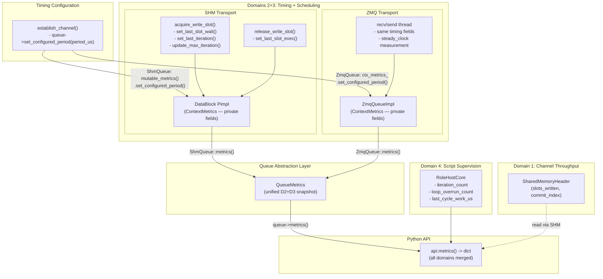
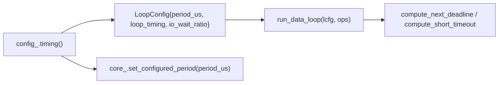
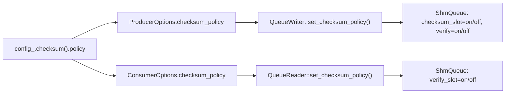

# HEP-CORE-0008: LoopPolicy and Iteration Metrics

**Status**: Pass 4 complete (2026-03-28) — Queue-level metrics unification, timing refactoring: `ContextMetrics` moved to `context_metrics.hpp` with private fields + accessor API; `set_loop_policy()` removed from DataBlock; `LoopPolicy` enum is dead code; `configured_period_us` set at queue level via `set_configured_period()`; `LoopTimingParams timing{}` replaces `loop_policy` + `configured_period_us` in Options; `parse_timing_config()` requires `loop_timing` (no implicit defaults)
**Created**: 2026-02-22
**Area**: DataHub RAII Layer / Standalone Binaries
**Depends on**: HEP-CORE-0002 (DataHub), HEP-CORE-0011 (ScriptHost), HEP-CORE-0006 (SlotProcessor API)

---

## 0. Implementation Status

### Pass 1 — Binary-level LoopTimingPolicy + RoleMetrics (2026-02-23)

Each standalone binary's script host has its own deadline-based pacing loop that
operates **above** the RAII layer. It uses explicit `sleep_until` in the
producer/consumer while-loops and calls `acquire_write_slot()` / `release_write_slot()`
directly on the primitive API — it does **not** go through `ctx.slots()` / `SlotIterator`.

What was added:
- `LoopTimingPolicy`: `MaxRate` (no sleep) / `FixedRate` (`next = now() + interval`) / `FixedRateWithCompensation` (`next += interval`)
- `api.loop_overrun_count()` — overrun counter incremented in the script host
- `api.last_cycle_work_us()` — work time measured in the script host
- JSON: `"loop_timing": "max_rate" | "fixed_rate" | "fixed_rate_with_compensation"` per binary config

These binary-level metrics are supervised (C++ host writes, Python reads).

### Pass 2 — ContextMetrics Pimpl + timing in acquire/release (2026-02-23)

Added `ContextMetrics` to DataBlock Pimpl and timing at every `acquire_*_slot()` /
`release_*_slot()` call. `TransactionContext::metrics()` is a pass-through reference to
the same Pimpl storage. `api.metrics()` dict wired (D2+D3 keys from Pimpl).

### Pass 3 — RAII SlotIterator sleep + Options fields + api.metrics() completeness (2026-02-25)

Three remaining items now complete:

1. **`SlotIterator::operator++()`** gains `apply_loop_policy_sleep_()` — reads
   `configured_period_us` from ContextMetrics via `m_handle->metrics().configured_period_us_val()`;
   if non-zero, sleeps `sleep_until(m_last_acquire_ + configured_period_us)`
   before the next `acquire_next_slot()` call. Start-to-start anchor `m_last_acquire_` is
   recorded after each successful acquisition. First call has `m_last_acquire_` = zero ->
   skip sleep (correct). Heartbeat fires before the sleep so liveness is refreshed first.

2. **`ProducerOptions::timing` + `ConsumerOptions::timing`** (`LoopTimingParams` struct)
   added. `establish_channel()` calls `queue_writer_->set_configured_period(period_us)` /
   `queue_reader_->set_configured_period(period_us)` — the single unified path for both
   SHM and ZMQ transports.

3. **`api.metrics()` dict** now includes all Domain 4 keys: `loop_overrun_count` and
   `last_cycle_work_us` (from `RoleMetrics`) moved outside the `if (cm != nullptr)/else` block
   so they always contain live binary-level values regardless of SHM availability.

### Pass 4 — Queue-Level Metrics Unification + Timing Refactoring (2026-03-25/28)

Major structural changes:

1. **`ContextMetrics` moved** from `data_block_metrics.hpp` to `context_metrics.hpp`
   (`pylabhub::hub` namespace). Fields are now **private** with a full accessor API:
   `set_*()`, `inc_*()`, `update_*()`, `*_val()`, `clear()`.

2. **`DataBlockProducer::set_loop_policy()` and `DataBlockConsumer::set_loop_policy()` REMOVED.**
   DataBlock no longer owns timing configuration. The `LoopPolicy` enum in
   `data_block_policy.hpp` is dead code (retained for ABI but unused).

3. **`configured_period_us` is set at the queue level** via `ShmQueue::set_configured_period()`
   (writes directly to `ContextMetrics` via `mutable_metrics().set_configured_period()`)
   and `ZmqQueue::set_configured_period()` (writes to its own `ContextMetrics`).

4. **`ProducerOptions`/`ConsumerOptions`** replaced `loop_policy` + `configured_period_us` +
   `queue_period_us` with a single `LoopTimingParams timing{}` struct.

5. **`parse_timing_config()`** now **requires** `loop_timing` in JSON config — no implicit
   defaults. `default_loop_timing_policy()` is dead code.

6. **`establish_channel()`** sets timing through `queue_writer_->set_configured_period()` /
   `queue_reader_->set_configured_period()` — a single unified path for SHM and ZMQ.

7. **ShmQueue factories** no longer accept `configured_period_us` parameter.

8. **SlotIterator** reads `configured_period_us` from ContextMetrics via
   `m_handle->metrics().configured_period_us_val()` (accessor, not public field).

---

## 1. Motivation

The primary DAQ model in the standalone binaries is a `with_transaction` session containing
an indefinite slot-iteration loop:

```python
# on_write callback drives one slot per iteration
def on_write(slot, flexzone, api) -> bool:
    slot.count += 1
    return True

# C++ side (conceptual — script host wires this automatically):
with producer.with_transaction() as ctx:
    for slot in ctx.slots():
        call_on_write(slot)
        if shutdown_requested:
            break
```

**Gaps identified in the current design:**

1. No way to pace the write loop to a target frequency (fixed-rate DAQ).
2. No per-iteration timing observability — Python scripts cannot measure their own
   execution time or detect overruns.
3. The existing `interval_ms` approach is a crude `sleep()` in the handler body,
   unaware of actual handler execution time and unable to detect drift.

This HEP defines:
- `LoopTimingPolicy` — how the iteration loop paces between slot acquisitions
- `ContextMetrics` — per-context and per-iteration timing state, organized by domain
- Integration with the standalone binaries (`api.metrics()` from Python)

### 1.1 Metric Domain Model

Runtime metrics in pylabhub are organized by **measurement domain** — where they
naturally arise and what subsystem produces them. This avoids assigning ownership to
a single layer and instead focuses on where values are computed (the measurement site),
where they are stored (the collection site), and what interface surfaces them to callers.

Three organizing concepts:

| Concept | Definition |
|---------|-----------|
| **Measurement site** | Where the value is computed — follows the code, non-negotiable |
| **Collection site** | Where the value is stored for later retrieval — a design choice |
| **Access API** | The interface presented to callers (C++ RAII, Python script, broker) |

Five natural domains in the stack:

| Domain | What is measured | Measurement site | Accessible to |
|--------|-----------------|------------------|---------------|
| 1. Channel throughput | `slots_written`, `commit_index` | SHM `SharedMemoryHeader` (cross-process) | All parties via SHM read |
| 2. Acquire/release timing | `last_slot_wait_us`, `iteration_count`, `last_iteration_us`, `max_iteration_us` | `acquire_write_slot()` / `acquire_consume_slot()` in data_block.cpp | Queue impl -> ContextMetrics -> QueueMetrics |
| 3. Loop scheduling | `last_slot_exec_us`, `context_elapsed_us` | Queue implementation's acquire/release methods | Queue impl -> ContextMetrics -> QueueMetrics |
| 3b. Loop config | `configured_period_us` | Set at startup from config | ContextMetrics (storage) -> LoopMetricsSnapshot (reporting) |
| 4. Script supervision | `script_error_count`, `slot_valid` | Script host (Python error paths) | Python only (binary-specific) |
| 5. Channel topology | `consumer_count`, `last_heartbeat_us` | Broker / heartbeat protocol | Broker; Python via broker query |

This HEP covers **Domains 2 and 3** only. Domain 1 is already in the SHM header.
Domains 4 and 5 are out of scope.

**Collection site for Domains 2 and 3**: `ContextMetrics` struct, owned at the queue level:
- **SHM path**: `DataBlockProducer::Impl` / `DataBlockConsumer::Impl` (the Pimpl structs).
  `ShmQueue` reads via `DataBlock::metrics()`.
- **ZMQ path**: `ZmqQueueImpl` owns a `ContextMetrics` instance directly.

Storing metrics in the queue implementation (rather than inside `TransactionContext`)
gives two important properties:
- Metrics survive across `with_transaction()` calls (useful for long-running services).
- The script host can read metrics from `queue->metrics()` directly, without
  needing a `TransactionContext` in scope.

**Timing configuration flows through the queue abstraction.** `establish_channel()` calls
`queue_writer_->set_configured_period(period_us)` or `queue_reader_->set_configured_period(period_us)`.
For SHM, this writes to DataBlock's `ContextMetrics` via `mutable_metrics().set_configured_period()`.
For ZMQ, this writes to `ZmqQueueImpl`'s `ContextMetrics`. DataBlock itself has no
knowledge of timing policy.

---

## 2. LoopTimingPolicy Enum

**Location**: `src/include/utils/loop_timing_policy.hpp`

```cpp
enum class LoopTimingPolicy : uint8_t
{
    MaxRate,                   ///< No sleep between iterations; maximum throughput.
    FixedRate,                 ///< Fixed start-to-start period; reset deadline on overrun.
    FixedRateWithCompensation, ///< Fixed period; advance deadline from cycle start on overrun.
};
```

**Semantics:**

| Policy | Behavior | Use case |
|--------|----------|----------|
| `MaxRate` | No sleep; iterate as fast as possible. Single acquire per cycle. Period must be 0. | Maximum throughput; backlog drain |
| `FixedRate` | Sleep to deadline. On overrun: reset deadline to `now + period` (no catch-up). Period must be > 0. | Fixed-rate DAQ (e.g. 100 Hz sensor) |
| `FixedRateWithCompensation` | Sleep to deadline. On overrun: advance deadline from cycle start (catches up). Period must be > 0. | Burst recovery with steady average rate |

**LoopTimingParams (single source of truth for timing configuration):**

```cpp
struct LoopTimingParams
{
    LoopTimingPolicy policy{LoopTimingPolicy::MaxRate};
    uint64_t         period_us{0};       ///< Target period (us). 0 = MaxRate.
    double           io_wait_ratio{kDefaultQueueIoWaitRatio}; ///< Fraction of period per acquire attempt.
};
```

Created by `TimingConfig::timing_params()` after strict validation. Carried through
`ProducerOptions`/`ConsumerOptions` to `establish_channel()`, the queue (for metrics
reporting via `set_configured_period()`), and the main loop / SlotIterator (for execution).

**Deprecated `LoopPolicy` enum** (`data_block_policy.hpp`):

The `LoopPolicy` enum (`MaxRate`/`FixedRate`/`MixTriggered`) is dead code. It remains
in `data_block_policy.hpp` for ABI stability but is no longer used by any runtime code.
`set_loop_policy()` has been removed from `DataBlockProducer` and `DataBlockConsumer`.

**JSON config** (per-binary config):

```json
"loop_timing": "fixed_rate",
"target_period_ms": 10.0
```

**Configuration rules (enforced by `parse_timing_config()` in `timing_config.hpp`):**
- `loop_timing` is **required** -- error if absent. No implicit default.
- `"max_rate"`: neither `target_period_ms` nor `target_rate_hz` may be present. Error if either set.
- `"fixed_rate"` / `"fixed_rate_with_compensation"`: exactly one of `target_period_ms` or
  `target_rate_hz` must be present. Error if both. Error if neither.
- Config validation is the **single source of truth** -- downstream code receives clean,
  non-contradictory values and never re-derives policy from period.

**Config -> Queue mapping (single path):**
```
parse_timing_config() -> TimingConfig {loop_timing, period_us}
    | tc.timing_params()
    v
ProducerOptions / ConsumerOptions {timing: LoopTimingParams}
    | establish_channel()
    v
queue_writer_->set_configured_period(opts.timing.period_us)
queue_reader_->set_configured_period(opts.timing.period_us)
```

The timing policy and period are set exclusively through the queue abstraction.
DataBlock has no timing knowledge. ShmQueue delegates to `mutable_metrics().set_configured_period()`.
ZmqQueue stores the period in its own `ContextMetrics`.

### 2.2 Queue I/O Timeout (merged from loop_design_unified.md §1.2)

> Verified: `compute_short_timeout()` in `loop_timing_policy.hpp`.

The per-attempt timeout for the inner retry-acquire loop:

```
short_timeout_us = max(period_us * queue_io_wait_timeout_ratio, kMinQueueIoTimeoutUs)
```

Where `kMinQueueIoTimeoutUs = 10` (10 μs floor). Default ratio = 0.1.

| Policy | period_us | ratio | short_timeout |
|--------|-----------|-------|---------------|
| MaxRate | 0 | 0.1 | 10 μs (floor) |
| FixedRate 1 kHz | 1000 | 0.1 | 100 μs |
| FixedRate 100 Hz | 10000 | 0.1 | 1 ms |

**Processor output timeout** (different concern — pipeline backpressure):

| Overflow Policy | Output timeout | Behavior |
|-----------------|---------------|----------|
| Drop (default) | 0 ms (non-blocking) | Immediate fail; drops counted |
| Block | remaining cycle budget | Wait up to deadline; fall back to short_timeout on overrun |

---

## 3. ContextMetrics Struct

**Location**: `src/include/utils/context_metrics.hpp` (namespace `pylabhub::hub`)

ContextMetrics is a transport-agnostic metrics container for queue acquire/release timing.
All fields are **private** with a public accessor API.

```cpp
struct PYLABHUB_UTILS_EXPORT ContextMetrics
{
    using Clock = std::chrono::steady_clock;

    // ── Readers (const) ─────────────────────────────────────────────────────
    [[nodiscard]] Clock::time_point context_start_time_val() const noexcept;
    [[nodiscard]] uint64_t context_elapsed_us_val() const noexcept;
    [[nodiscard]] uint64_t last_slot_wait_us_val()  const noexcept;
    [[nodiscard]] uint64_t last_iteration_us_val()  const noexcept;
    [[nodiscard]] uint64_t max_iteration_us_val()   const noexcept;
    [[nodiscard]] uint64_t last_slot_exec_us_val()  const noexcept;
    [[nodiscard]] uint64_t checksum_error_count_val() const noexcept; // atomic read
    [[nodiscard]] uint64_t configured_period_us_val() const noexcept;

    // ── Writers (mutators) ──────────────────────────────────────────────────
    void set_context_start(Clock::time_point t) noexcept;
    void set_context_elapsed(uint64_t us)       noexcept;
    void set_last_slot_wait(uint64_t us)  noexcept;
    void set_last_iteration(uint64_t us)  noexcept;
    void set_max_iteration(uint64_t us)   noexcept;
    void update_max_iteration(uint64_t us) noexcept; // max(current, us)
    void set_last_slot_exec(uint64_t us) noexcept;
    void inc_checksum_error() noexcept;              // atomic increment
    void set_configured_period(uint64_t us) noexcept;

    // ── Reset ───────────────────────────────────────────────────────────────
    /// Clear all counters. preserve_config=true keeps configured_period_us.
    void clear(bool preserve_config = true) noexcept;

  private:
    Clock::time_point context_start_time_{};  ///< Set on first acquire; zero until then.
    uint64_t          context_elapsed_us_{0}; ///< Elapsed since context_start_time (us).
    uint64_t          last_slot_wait_us_{0};  ///< Time blocking inside acquire (us).
    uint64_t          last_iteration_us_{0};  ///< Start-to-start between acquires (us).
    uint64_t          max_iteration_us_{0};   ///< Peak iteration time since reset (us).
    uint64_t          last_slot_exec_us_{0};  ///< Acquire to release (us).
    std::atomic<uint64_t> checksum_error_count_{0}; ///< Atomic: data thread writes, metrics reads.
    uint64_t          configured_period_us_{0}; ///< Target period (us). 0 = MaxRate. Set by queue.
};
```

### 3.1 Ownership and Lifetime

- **SHM path**: owned by `DataBlockProducer::Impl` / `DataBlockConsumer::Impl`.
  `ShmQueue` accesses via `DataBlock::metrics()` (const) and `mutable_metrics()`.
- **ZMQ path**: owned by `ZmqQueueImpl` directly.
- Initialized to zero-value at construction.
- `context_start_time_` is set on the first `acquire_*_slot()` call (whichever comes first).
- **Persists across `with_transaction()` calls** -- all timing state accumulates for the
  lifetime of the handle. Call `clear()` at session start to reset counters.
- **Not stored in SHM** -- entirely process-local.
- **`configured_period_us`** is set by the queue's `set_configured_period()`, NOT by DataBlock.
  `clear(true)` preserves it (it's configuration, not a measurement).

### 3.2 Access

The caller accesses metrics through the **queue abstraction**, not DataBlock directly:

```cpp
// On QueueReader / QueueWriter (abstract base):
QueueMetrics metrics() const;   // read-only snapshot bridged from ContextMetrics

// On DataBlock (internal, used by ShmQueue implementation):
const ContextMetrics& metrics() const noexcept;
ContextMetrics& mutable_metrics() noexcept;
```

---

## 4. Measurement Sites

ContextMetrics fields are populated by the queue implementation's acquire/release internals:

### 4.1 Domain 2 -- inside acquire (SHM: `acquire_write_slot()` / `acquire_consume_slot()`)

These functions are the natural measurement site: they know when blocking started and
when the slot was granted. The implementation holds a `t_iter_start_` anchor tracking when the
previous acquire completed.

```
acquire called:
  t_now = Clock::now()

  if context_start_time is zero:
    ctx_metrics.set_context_start(t_now)

  if t_iter_start_ is valid (not the first call):
    elapsed_us = t_now - t_iter_start_
    ctx_metrics.set_last_iteration(elapsed_us)
    ctx_metrics.update_max_iteration(elapsed_us)
    ctx_metrics.set_context_elapsed((t_now - context_start_time) as us)

  t_acquire_start = Clock::now()
  [existing acquire logic -- blocks until slot or timeout]
  t_acquire_done  = Clock::now()

  if slot acquired:
    ctx_metrics.set_last_slot_wait((t_acquire_done - t_acquire_start) as us)
    t_iter_start_ = t_acquire_done   // anchor for next iteration
```

### 4.2 Domain 2 -- inside release (SHM: `release_write_slot()` / `release_consume_slot()`)

```
release called:
  ctx_metrics.set_last_slot_exec((Clock::now() - t_iter_start_) as us)
  // then existing release logic
```

### 4.3 Domain 3 -- sleep control in SlotIterator (RAII path only)

For the **RAII path**, the sleep lives in `SlotIterator::operator++()`.
Before calling into `acquire_next_slot()`, operator++() paces to the target period:

```
operator++() called:
  update_heartbeat()    // existing -- unchanged

  // Read configured_period_us from ContextMetrics via accessor:
  period_us = m_handle->metrics().configured_period_us_val()
  if period_us > 0 and t_last_acquire_ is valid:
    elapsed = Clock::now() - t_last_acquire_
    if elapsed < configured_period_us:
      sleep_for(configured_period_us - elapsed)   // pace before next acquire

  acquire_next_slot()   // calls acquire_write_slot() -> timing updates happen there
```

`SlotIterator` reads `configured_period_us` from `ContextMetrics` via the `*_val()` accessor
at each iteration. It does **not** update ContextMetrics directly -- that happens inside
`acquire_write_slot()`.

For the **binary path**: the sleep is in the script host (deadline-based loop with
`LoopTimingPolicy`). The script host calls `acquire_write_slot()` directly. Timing
measurement still fires inside `acquire_write_slot()` because the same DataBlock code
runs regardless of caller.

### 4.4 Overrun Detection

**Overrun counting is exclusively the main loop's responsibility** (in RoleHostCore).
After each cycle, the main loop compares `now > deadline` -- this is the only place that
knows the actual deadline (accounting for FixedRate vs FixedRateWithCompensation slack).

DataBlock and ZmqQueue do **NOT** detect or count overruns. They only measure timing
(iteration, wait, exec). The main loop judges whether the timing constitutes an overrun.

`MaxRate` (configured_period_us = 0): `loop_overrun_count` is never incremented.

---

## 5. Manual Update API on TransactionContext

For C++ users who do not use the `SlotIterator` loop (single-slot break pattern):

```cpp
// Timestamp facility
static Clock::time_point now() noexcept;     // consistent clock for manual measurements

// Manual helpers -- delegate to the Pimpl via TransactionContext
void update_context_elapsed() noexcept;      // ctx_metrics.set_context_elapsed(now() - context_start)
void increment_overrun() noexcept;           // no-op (overrun tracking removed from DataBlock)

// Read -- forwards to DataBlock Pimpl
const ContextMetrics& metrics() const noexcept;
```

For the single-slot break pattern:
- `context_elapsed_us` is auto-updated at every `acquire_write_slot()` call.
- Overrun detection is handled by the main loop, not DataBlock.

---

## 6. Binary Script API Integration

### 6.1 Python `api.metrics()` dict

`api.metrics()` assembles a dict from three sources:
- **Queue metrics** (`queue->metrics()` -> `QueueMetrics`): timing fields measured by DataBlock (SHM) or ZmqQueue
- **RoleHostCore**: loop-level counters (iteration_count, loop_overrun_count, drops, etc.)
- **ScriptEngine**: script_errors (via core_)

#### Producer / Consumer dict (hierarchical)

```python
api.metrics() -> dict:
{
    "queue": {                             # from QueueMetrics (PYLABHUB_QUEUE_METRICS_FIELDS)
        "context_elapsed_us":     int,     # us since first slot acquisition
        "last_iteration_us":      int,     # full cycle time: acquire(N) to acquire(N+1) (us)
        "max_iteration_us":       int,     # peak cycle time since reset (us)
        "last_slot_wait_us":      int,     # time blocked in acquire waiting for data/slot (us)
        "last_slot_exec_us":      int,     # time from acquire to release -- callback execution (us)
        "data_drop_count":        int,     # ZMQ write buffer full/timeout. Always 0 for SHM.
        "recv_overflow_count":    int,     # ZMQ recv ring full. Always 0 for SHM.
        "recv_frame_error_count": int,     # ZMQ bad frames. Always 0 for SHM.
        "recv_gap_count":         int,     # ZMQ sequence gaps. Always 0 for SHM.
        "send_drop_count":        int,     # ZMQ send failure. Always 0 for SHM.
        "send_retry_count":       int,     # ZMQ EAGAIN retries. Always 0 for SHM.
        "checksum_error_count":   int,     # BLAKE2b verification failures.
    },
    "loop": {                              # from RoleHostCore (PYLABHUB_LOOP_METRICS_FIELDS)
        "iteration_count":       int,      # main loop cycles completed
        "loop_overrun_count":    int,      # cycles where now > deadline
        "last_cycle_work_us":    int,      # us of active work in last cycle
        "configured_period_us":  int,      # target loop period (0 = MaxRate). Config input.
        "acquire_retry_count":   int,      # cumulative queue acquire retries (0 = no contention)
    },
    "role": {                              # role-specific counters
        "out_slots_written":   int,        # committed output slots (producer/processor)
        "out_drop_count":      int,        # discarded output slots (producer/processor)
        "in_slots_received":   int,        # consumed input slots (consumer/processor)
        "script_error_count":  int,        # unhandled callback exceptions
    },
    "inbox": {                             # from InboxQueue (PYLABHUB_INBOX_METRICS_FIELDS)
        "recv_frame_error_count": int,     # if inbox configured; absent otherwise
        "ack_send_error_count":   int,
        "recv_gap_count":         int,
    },
    "custom": { ... }                      # user-reported via api.report_metric()
}
```

#### Processor dict (hierarchical, dual queue)

The processor has two queues. Each gets its own sub-dict (`"in_queue"`, `"out_queue"`):

```python
api.metrics() -> dict:
{
    "in_queue":  { <12 QueueMetrics fields> },   # input queue
    "out_queue": { <12 QueueMetrics fields> },   # output queue
    "loop": {
        "iteration_count":       int,
        "loop_overrun_count":    int,
        "last_cycle_work_us":    int,
        "configured_period_us":  int,
        "acquire_retry_count":   int,
    },
    "role": {
        "in_slots_received":   int,
        "out_slots_written":   int,
        "out_drop_count":      int,
        "script_error_count":  int,
    },
    "inbox": { ... },                            # if inbox configured
    "custom": { ... }
}
```

#### Metric sources and ownership

| Source | What it measures | Who writes | Where stored |
|--------|-----------------|------------|-------------|
| Queue (DataBlock/ZmqQueue) | Timing: wait, iteration, exec, max, elapsed | acquire/release internals | ContextMetrics (private fields) |
| Queue (ZmqQueue only) | Data drops: write buffer full/timeout | write_acquire failure | QueueMetrics::data_drop_count |
| RoleHostCore | Loop: iteration count, overrun, cycle work time | Main loop after each cycle | Atomic fields in core_ |
| ScriptEngine | Script errors | Exception handler in invoke | core_->script_errors() |

**`loop_overrun_count`** is the authoritative overrun counter. It compares `now > deadline`
after each cycle in the main loop -- the only place that knows the actual deadline (accounting
for FixedRate vs FixedRateWithCompensation slack). DataBlock and ZmqQueue do NOT detect
overruns -- they only measure timing. The main loop judges.

**`data_drop_count`** counts data that was supposed to be sent/written but wasn't:
- SHM: always 0 (Sequential blocks writer; Latest_only skips by design -- no loss)
- ZMQ write: buffer full (Drop policy) or timeout (Block policy) = caller's data not sent

**`iteration_count`** is the main loop cycle count from RoleHostCore, NOT the queue's
acquire count. Every loop iteration increments it, even if acquire returned nullptr.

#### Convenience method getters

These methods return individual fields (same values as the dict):
- `api.loop_overrun_count()` -> `core_->loop_overrun_count()`
- `api.last_cycle_work_us()` -> `core_->last_cycle_work_us()`
- `api.script_error_count()` -> `core_->script_error_count()`

#### Metrics serialization -- X-macro pattern

Each metrics group defines a canonical field list via an X-macro, co-located with its struct:

| Macro | Header | Fields |
|-------|--------|--------|
| `PYLABHUB_QUEUE_METRICS_FIELDS` | `hub_queue.hpp` | 13 QueueMetrics fields |
| `PYLABHUB_LOOP_METRICS_FIELDS` | `role_host_core.hpp` | 5 LoopMetricsSnapshot fields |
| `PYLABHUB_INBOX_METRICS_FIELDS` | `hub_inbox_queue.hpp` | 3 InboxMetricsSnapshot fields |

Each output format provides adapter functions that expand the macros:

| Output | Header | Functions |
|--------|--------|-----------|
| JSON (`nlohmann::json`) | `queue_metrics_json.hpp` | `queue_metrics_to_json`, `loop_metrics_to_json`, `inbox_metrics_to_json` |
| Python (`py::dict`) | `queue_metrics_pydict.hpp` | `queue_metrics_to_pydict`, `loop_metrics_to_pydict`, `inbox_metrics_to_pydict` |
| Lua (table) | `queue_metrics_lua.hpp` | `queue_metrics_to_lua`, `loop_metrics_to_lua`, `inbox_metrics_to_lua` |
| C/C++ NativeEngine | NativeEngine header (future) | POD struct via X-macro |

Adding a new field: add to the struct + add one line to the macro. All adapters pick it up.

The output is hierarchical -- each group becomes a named sub-object (`"queue"`, `"loop"`,
`"role"`, `"inbox"`, `"custom"`). The processor uses `"in_queue"` / `"out_queue"` for its
dual-queue layout. Role-specific fields vary per role type and are built inline (no X-macro).

### 6.2 Metrics wiring in role host startup

The role host maps `TimingConfig` to `ProducerOptions`/`ConsumerOptions`:

```cpp
const auto &tc = config_.timing();
opts.timing = tc.timing_params();   // LoopTimingParams{policy, period_us, io_wait_ratio}
```

`establish_channel()` applies timing to the queue (single unified path for SHM and ZMQ):

```cpp
// Single call -- the only place configured_period_us is set on the queue:
if (impl->queue_writer_ && opts.timing.period_us > 0)
{
    impl->queue_writer_->set_configured_period(opts.timing.period_us);
}
// (analogous for queue_reader_ in consumer)
```

For SHM, `ShmQueue::set_configured_period()` delegates to
`DataBlock::mutable_metrics().set_configured_period(period_us)`.
For ZMQ, `ZmqQueue::set_configured_period()` writes to its own `ContextMetrics`.

ShmQueue factories do **NOT** accept a `configured_period_us` parameter -- timing
configuration is exclusively the service layer's responsibility (`establish_channel()`).

After each main loop cycle (Step F):

```cpp
core_.set_last_cycle_work_us(work_us);
core_.inc_iteration_count();
if (deadline != Clock::time_point::max() && now > deadline)
    core_.inc_loop_overrun();
```

### 6.3 Config fields

Timing is configured via `parse_timing_config()` in `timing_config.hpp`:

| Field | Required | Values | Description |
|-------|----------|--------|-------------|
| `loop_timing` | **yes** | `"max_rate"`, `"fixed_rate"`, `"fixed_rate_with_compensation"` | Loop timing policy. **Required -- error if absent.** |
| `target_period_ms` | if fixed_rate | double > 0 | Target period in milliseconds |
| `target_rate_hz` | if fixed_rate | double > 0 | Target rate (alternative to period) |
| `queue_io_wait_timeout_ratio` | no | 0.1--0.5 (default 0.1) | Fraction of period per acquire attempt |

**Validation rules (strict, no implicit defaults):**
- `loop_timing` absent -> **error** (no implicit derivation from period).
- `"max_rate"` + any period/rate present -> **error**.
- `"fixed_rate"` / `"fixed_rate_with_compensation"` + both period and rate -> **error**.
- `"fixed_rate"` / `"fixed_rate_with_compensation"` + neither period nor rate -> **error**.
- Period below `kMinPeriodUs` (100 us at default 10 kHz max rate) -> **error**.

`parse_loop_timing_policy()` is a **pure string -> enum parser** (no cross-field validation).
Cross-field validation (policy vs period presence) is entirely in `parse_timing_config()`.

`default_loop_timing_policy()` is dead code (retained but unused; `loop_timing` is always required).

---

## 7. Files Affected

### Pass 2 (2026-02-23)

| File | Change | Domain |
|------|--------|--------|
| `src/include/utils/data_block.hpp` | `ContextMetrics` struct; `metrics()`, `mutable_metrics()`, `clear_metrics()` declarations on DataBlockProducer/Consumer | D2+D3 |
| `src/utils/shm/data_block.cpp` | Pimpl gains `ContextMetrics`, `t_iter_start_`; timing in `acquire_write_slot()` / `release_write_slot()` / `acquire_consume_slot()` / `release_consume_slot()` | D2+D3 |
| `src/include/utils/transaction_context.hpp` | `metrics()` pass-through (const ref to Pimpl); `now()` static; `update_context_elapsed()`, `increment_overrun()` manual helpers | D2+D3 |

### Pass 3 (2026-02-25)

| File | Change | Domain |
|------|--------|--------|
| `src/include/utils/slot_iterator.hpp` | `m_last_acquire_` member; `apply_loop_policy_sleep_()` helper; reads `configured_period_us_val()` from ContextMetrics | D3 |
| `src/include/utils/hub_producer.hpp` | `ProducerOptions::timing` (`LoopTimingParams`) | config |
| `src/utils/hub/hub_producer.cpp` | Wire `queue_writer_->set_configured_period()` in `establish_channel()` | config |
| `src/include/utils/hub_consumer.hpp` | `ConsumerOptions::timing` (`LoopTimingParams`) | config |
| `src/utils/hub/hub_consumer.cpp` | Wire `queue_reader_->set_configured_period()` in `establish_channel()` | config |
| `tests/test_layer3_datahub/test_datahub_loop_policy.cpp` | Tests: metrics accumulate/clear, overrun detect, SlotIterator pacing | -- |

### Pass 4 (2026-03-25/28)

| File | Change | Domain |
|------|--------|--------|
| `src/include/utils/context_metrics.hpp` | **NEW**: `ContextMetrics` struct with private fields + accessor API (moved from `data_block_metrics.hpp`) | D2+D3 |
| `src/include/utils/hub_shm_queue.hpp` | ShmQueue factories: no `configured_period_us` parameter | config |
| `src/utils/hub/hub_shm_queue.cpp` | `set_configured_period()` writes to `mutable_metrics().set_configured_period()` | D3 |
| `src/utils/hub/hub_zmq_queue.cpp` | Timing measurement in recv/send thread; `set_configured_period()` on own `ContextMetrics` | D2+D3 |
| `src/include/utils/config/timing_config.hpp` | `parse_timing_config()` requires `loop_timing`; strict validation | config |
| `src/include/utils/loop_timing_policy.hpp` | `parse_loop_timing_policy()` is pure string->enum parser | config |

**Note**: `ContextMetrics` is in `context_metrics.hpp` in the `pylabhub::hub` namespace.
No SHM layout change -- `ContextMetrics` is entirely process-local.
Core Structure Change Protocol review not required.

---

## 8. Verification

```bash
cmake --build build -j2
ctest --test-dir build --output-on-failure -j2   # 1164/1164 must pass (as of 2026-03-26)

# Loop policy tests:
ctest --test-dir build -R "DatahubLoopPolicy" --output-on-failure
# -> 5+ tests pass (ProducerMetricsAccumulate, ProducerMetricsClear,
#    ProducerFixedRateOverrunDetect, SlotIteratorFixedRatePacing, ConsumerMetricsAccumulate)

# Layer 4 binary metrics tests (api.metrics() dict completeness):
ctest --test-dir build -R "ProducerConfig|ConsumerConfig|ProcessorConfig" --output-on-failure

# Metrics API tests (hierarchical dict, X-macro pattern):
ctest --test-dir build -R "MetricsApi" --output-on-failure
```

---

## 9. Source File Reference

| File | Layer | Description |
|------|-------|-------------|
| `src/include/utils/context_metrics.hpp` | L3 (public) | `ContextMetrics` struct (private fields + accessor API) |
| `src/include/utils/loop_timing_policy.hpp` | shared | `LoopTimingPolicy` enum, `LoopTimingParams`, `parse_loop_timing_policy()`, `compute_short_timeout()`, `compute_next_deadline()` |
| `src/include/utils/config/timing_config.hpp` | config | `TimingConfig`, `parse_timing_config()` (requires `loop_timing`) |
| `src/include/utils/data_block_policy.hpp` | L3 (public) | `LoopPolicy` enum (dead code -- retained for ABI) |
| `src/include/utils/slot_iterator.hpp` | L3 (public) | `SlotIterator`: reads `configured_period_us_val()` from ContextMetrics |
| `src/include/utils/transaction_context.hpp` | L3 (public) | `TransactionContext::metrics()` pass-through to Pimpl |
| `src/utils/shm/data_block.cpp` | impl | Timing in `acquire_write_slot()` / `release_write_slot()` via ContextMetrics accessors |
| `src/include/utils/hub_producer.hpp` | L3 (public) | `ProducerOptions::timing` (`LoopTimingParams`) |
| `src/include/utils/hub_consumer.hpp` | L3 (public) | `ConsumerOptions::timing` (`LoopTimingParams`) |
| `src/utils/hub/hub_producer.cpp` | impl | `establish_channel()` calls `queue_writer_->set_configured_period()` |
| `src/utils/hub/hub_consumer.cpp` | impl | `establish_channel()` calls `queue_reader_->set_configured_period()` |
| `src/utils/hub/hub_shm_queue.cpp` | impl | `ShmQueue::set_configured_period()` -> `mutable_metrics().set_configured_period()` |
| `src/utils/hub/hub_zmq_queue.cpp` | impl | ZmqQueue timing in recv/send thread + `set_configured_period()` |
| `tests/test_layer3_datahub/test_datahub_loop_policy.cpp` | test | Metrics accumulate/clear, overrun detect, SlotIterator pacing |

### Metrics Data Flow



---

## 10. Pass 4 -- Queue-Level Metrics Unification (2026-03-25)

### 10.1 Problem

`ContextMetrics` timing fields (Domains 2+3) are tracked inside DataBlock's acquire/release
methods. `ShmQueue` wraps DataBlock but only bridges `overrun_count` to `QueueMetrics` -- the
5 timing fields are not surfaced through the queue abstraction layer.

`ZmqQueue` has no timing measurement at all -- only error/gap/drop counters.

Role hosts bypass the queue abstraction entirely (`producer->shm()->metrics()`) to access
timing data. This breaks the transport-agnostic design: role hosts must know whether the
underlying transport is SHM to get timing metrics.

### 10.2 Design Principles

**The queue abstraction layer owns the metrics contract.** Both `QueueReader` and
`QueueWriter` define the timing fields. Each implementation fulfills them:

- **ShmQueue**: delegates to DataBlock's `ContextMetrics` (measurements happen in
  `acquire_write_slot()` / `release_write_slot()` etc. -- unchanged). `set_configured_period()`
  writes to DataBlock's `ContextMetrics` via `mutable_metrics().set_configured_period()`.
- **ZmqQueue**: tracks timing in its own `ContextMetrics` instance using `steady_clock`.
  `set_configured_period()` writes to its own `ContextMetrics`.

The user (role host, script API) accesses metrics only through `queue->metrics()`.
No transport detection, no `shm()` access for metrics.

**Metrics reflect the handle's perspective, not the shared resource.**

A DataBlock shared memory segment is accessed by multiple roles (producer writes,
consumer reads). Each role creates its own handle (`DataBlockProducer` or
`DataBlockConsumer`), and the ShmQueue wraps exactly one handle. The metrics
returned by `queue->metrics()` reflect **this handle's timing** -- how long this
role waited for a slot, how fast this role is iterating, whether this role is
meeting its target period.

Two roles accessing the same DataBlock will have different metrics because they
have different access patterns (write vs read), different contention profiles,
and potentially different configured periods.

For the Processor, which has both an input queue (reader on channel A) and an
output queue (writer on channel B), each queue independently tracks its own
metrics. They are separate handles on separate DataBlock segments.

This per-handle design means:
- No cross-role metric contamination
- Each `queue->metrics()` call returns a self-consistent snapshot for one direction
- The factory determines the mode (read or write) at construction; the queue
  never changes mode

### 10.3 QueueMetrics Expansion

Add to `QueueMetrics` (read-only snapshot, returned by `metrics()`):

```cpp
// Domain 2: Acquire/release timing
uint64_t last_slot_wait_us{0};    ///< Time blocked inside acquire (us).
uint64_t last_iteration_us{0};    ///< Start-to-start time between consecutive acquires (us).
uint64_t max_iteration_us{0};     ///< Peak start-to-start time since reset (us).
uint64_t iteration_count{0};      ///< Successful slot acquisitions since reset.
uint64_t context_elapsed_us{0};   ///< Elapsed since first acquire (us). Updated per acquire.

// Domain 2: Acquire/release timing (continued)
uint64_t last_slot_exec_us{0};    ///< Time from acquire to release (us).

// Data flow
uint64_t data_drop_count{0};      ///< ZMQ write: buffer full/timeout. SHM: always 0.
uint64_t configured_period_us{0}; ///< Target period (0 = MaxRate). Config input.
```

**QueueMetrics field definitions:**

| Field | Measurement | When updated | Meaning |
|-------|-------------|-------------|---------|
| `last_slot_wait_us` | `t_acquired - t_enter_acquire` | Each successful acquire | How long the queue blocked waiting for data |
| `last_iteration_us` | `t_acquired(N) - t_acquired(N-1)` | Each successful acquire (after first) | Full cycle time: user exec + sleep + drain + wait |
| `max_iteration_us` | running max of `last_iteration_us` | Each successful acquire (after first) | Peak full cycle time since reset |
| `context_elapsed_us` | `t_acquired - t_first_acquired` | Each successful acquire (after first) | Total elapsed time since the queue started processing |
| `last_slot_exec_us` | `t_release - t_acquired` | Each release/commit | Time the caller held the slot (user callback execution) |
| `data_drop_count` | +1 on write_acquire failure | ZMQ write buffer full or timeout | Data not sent. SHM: always 0. |
| `configured_period_us` | set once at startup | `set_configured_period()` | Target loop period; 0 = MaxRate. Informational only. |

**Fields NOT in QueueMetrics (owned by RoleHostCore):**

| Field | Where | Meaning |
|-------|-------|---------|
| `iteration_count` | `core_.iteration_count()` | Main loop cycles (inc'd every cycle, even failed acquire) |
| `loop_overrun_count` | `core_.loop_overrun_count()` | Cycles where `now > deadline` (deadline-based, not elapsed-based) |

**Behavior on failed acquire:**

When `read_acquire()` times out (no data) or `write_acquire()` fails (buffer full / timeout),
no timing fields are updated. The `t_iter_start_` anchor remains at the previous successful
acquire's `t_acquired`. This means:

- `last_iteration_us` on the **next** successful acquire will include the time spent in
  the failed attempt(s). This reflects reality -- the loop was stalled.
- For ZMQ write mode, a failed write_acquire increments `data_drop_count` (the caller's
  data was not sent).
- The main loop's `iteration_count` still increments (the loop ran, even though acquire
  failed). The main loop's `loop_overrun_count` checks the deadline independently (when
  `last_iteration_us` exceeds `configured_period_us`).
- For ZmqQueue write mode with Drop policy, a buffer-full failure increments
  `overrun_count` immediately (buffer capacity overrun, distinct from timing overrun).

This design ensures metrics reflect the caller's actual experience: if the queue was
unavailable for 100ms, the next `last_iteration_us` will show ~100ms, and the overrun
detector will fire if that exceeds the configured period.

### 10.4 Queue Lifecycle API Additions

```cpp
// On QueueReader and QueueWriter base classes:

/// Reset all counters. Preserves configured_period_us.
/// Called at role startup before the data loop.
virtual void reset_metrics() {}

/// Set the target loop period for metrics reporting.
/// Called once at startup after queue creation (by establish_channel()).
virtual void set_configured_period(uint64_t period_us) { (void)period_us; }
```

### 10.5 Measurement Responsibility

| Field | ShmQueue | ZmqQueue |
|-------|----------|----------|
| `last_slot_wait_us` | DataBlock acquire (existing) | read_acquire/write_acquire: time blocked |
| `last_iteration_us` | DataBlock acquire (existing) | read_acquire/write_acquire: start-to-start gap |
| `max_iteration_us` | DataBlock acquire (existing) | read_acquire/write_acquire: running max |
| `context_elapsed_us` | DataBlock acquire (existing) | read_acquire/write_acquire: elapsed since first acquire |
| `last_slot_exec_us` | DataBlock release (existing) | read_release/write_commit: acquire-to-release gap |
| `configured_period_us` | `set_configured_period()` -> `mutable_metrics().set_configured_period()` | `set_configured_period()` -> stored in own ContextMetrics |

For ShmQueue: no new measurement code. `metrics()` reads from `ContextMetrics` (the data is
already tracked by DataBlock). `set_configured_period()` delegates to DataBlock's
`mutable_metrics().set_configured_period()` -- DataBlock itself has no timing policy concept.

For ZmqQueue: timing code in recv_thread_/send_thread_ using `steady_clock`. Same
measurement points as DataBlock (start-of-acquire, end-of-acquire, release).

**Note**: overrun detection is NOT a queue responsibility. The main loop in RoleHostCore
compares `now > deadline` after each cycle. The queue only measures timing; the main loop
judges whether it constitutes an overrun.

### 10.6 Access Rules

| Operation | Who calls | When |
|-----------|-----------|------|
| `metrics()` | Role host, script API | Any time (read-only snapshot) |
| `reset_metrics()` | Role host | Once at startup, before data loop |
| `set_configured_period()` | `establish_channel()` | Once at startup, after queue creation |
| Timing updates | Queue implementation internally | Every acquire/release cycle |

**No external code writes to individual metric fields.** The queue owns the measurement.
`establish_channel()` configures the period and the role host reads the results.

### 10.7 What Stays Below the Abstraction

These remain DataBlock-specific, not surfaced through QueueMetrics:

- `context_start_time_` -- session start timestamp (DataBlock lifecycle concept, accessed via `context_start_time_val()`)
- Spinlock contention counters -- SHM-specific
- Ring buffer slot indices -- SHM implementation detail
- `recv_frame_error_count`, `recv_gap_count`, `send_drop_count`, `send_retry_count` -- ZMQ-specific diagnostic counters (already in QueueMetrics, ZMQ-only)

---

## 11. Config Single-Truth Propagation (2026-04-16)

> Merged from `docs/tech_draft/config_single_truth.md` (implemented 2026-03-30).

### 11.1 Timing — single derived path

All three role hosts derive timing from `config_.timing()` through a
single `LoopConfig` struct passed to `run_data_loop(api, core, cfg, ops)`:



- `LoopTimingParams` struct (`loop_timing_policy.hpp`): `{LoopTimingPolicy, period_us, io_wait_ratio}`
- `TimingConfig::timing_params()` → constructs `LoopTimingParams` from parsed config
- Role hosts call `core_.set_configured_period()` once; loop reads from `LoopConfig`
- No direct `config_` reads inside the data loop

### 11.2 Checksum — single policy from config



`ChecksumPolicy` enum → ShmQueue mapping:
| Policy | `checksum_slot` (write) | `verify_slot` (read) |
|--------|-------------------------|----------------------|
| `Enforced` | true | true |
| `Manual` | false | true (catches missing stamps) |
| `None` | false | false |

### 11.3 Config key whitelist

`validate_known_keys()` in `role_config.cpp` rejects unknown JSON keys at
parse time. Whitelist covers all valid fields across identity, script, timing,
transport, SHM, checksum, inbox, monitoring, startup, and auth sections.

---

## 12. Related Documents

- HEP-CORE-0002: DataHub FINAL -- SHM layout and slot state machine
- HEP-CORE-0011: ScriptHost Abstraction Framework -- Python callback model
- HEP-CORE-0006: SlotProcessor API -- C++ RAII transaction layer
- HEP-CORE-0009: Policy Reference -- all policy enums in one place
- `docs/tech_draft/schema_architecture.md` S6 -- Engine type caching and queue abstraction
- `docs/todo/API_TODO.md` -- Queue Abstraction Unification phased implementation plan
