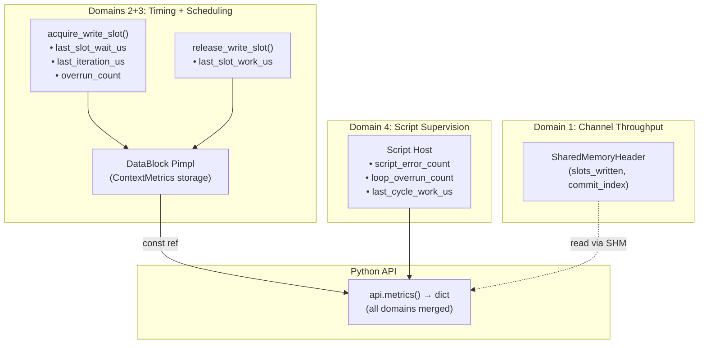

# HEP-CORE-0008: LoopPolicy and Iteration Metrics

**Status**: Pass 3 complete (2026-02-25) — SlotIterator FixedRate sleep, ProducerOptions/ConsumerOptions loop_policy fields, api.metrics() dict completeness (D4 keys added); **585/585 tests passing** (as of 2026-02-28)
**Created**: 2026-02-22
**Area**: DataHub RAII Layer / Standalone Binaries
**Depends on**: HEP-CORE-0002 (DataHub), HEP-CORE-0011 (ScriptHost), HEP-CORE-0006 (SlotProcessor API)

---

## 0. Implementation Status

### Pass 1 — Binary-level LoopTimingPolicy + RoleMetrics (2026-02-23)

Each standalone binary's script host has its own deadline-based pacing loop that
operates **above** the RAII layer. It uses explicit `sleep_until` in the
producer/consumer while-loops and calls `acquire_write_slot()` / `release_write_slot()`
directly on the primitive API — it does **not** go through `ctx.slots()` / `SlotIterator`.

What was added:
- `LoopTimingPolicy`: `MaxRate` (no sleep) / `FixedRate` (`next = now() + interval`) / `FixedRateWithCompensation` (`next += interval`)
- `api.loop_overrun_count()` — overrun counter incremented in the script host
- `api.last_cycle_work_us()` — work time measured in the script host
- JSON: `"loop_timing": "max_rate" | "fixed_rate" | "fixed_rate_with_compensation"` per binary config

These binary-level metrics are supervised (C++ host writes, Python reads).

### Pass 2 — ContextMetrics Pimpl + timing in acquire/release (2026-02-23)

Added `ContextMetrics` to DataBlock Pimpl and timing at every `acquire_*_slot()` /
`release_*_slot()` call. `TransactionContext::metrics()` is a pass-through reference to
the same Pimpl storage. `set_loop_policy()` implemented on both `DataBlockProducer` and
`DataBlockConsumer`. `api.metrics()` dict wired (D2+D3 keys from Pimpl).

### Pass 3 — RAII SlotIterator sleep + Options fields + api.metrics() completeness (2026-02-25)

Three remaining items now complete:

1. **`SlotIterator::operator++()`** gains `apply_loop_policy_sleep_()` — reads
   `configured_period_us` from the DataBlock Pimpl; if non-zero, sleeps `sleep_until(m_last_acquire_ + configured_period_us)`
   before the next `acquire_next_slot()` call. Start-to-start anchor `m_last_acquire_` is
   recorded after each successful acquisition. First call has `m_last_acquire_` = zero →
   skip sleep (correct). Heartbeat fires before the sleep so liveness is refreshed first.

2. **`ProducerOptions::loop_policy` + `configured_period_us`** and **`ConsumerOptions::loop_policy` + `configured_period_us`**
   added. `hub::Producer::create()` / `hub::Consumer::connect()` wire `set_loop_policy()`
   from options at creation time. Binary-level `set_loop_policy()` call (in the script host)
   overrides this if needed (binary config takes precedence).

3. **`api.metrics()` dict** now includes all Domain 4 keys: `loop_overrun_count` and
   `last_cycle_work_us` (from `RoleMetrics`) moved outside the `if (cm != nullptr)/else` block
   so they always contain live binary-level values regardless of SHM availability.

**Interaction between binary-level and RAII-layer pacing**: `LoopPolicy` (RAII/Pimpl)
controls the sleep in `SlotIterator`. `LoopTimingPolicy` (binary-level, max_rate/fixed_rate/fixed_rate_with_compensation)
controls how the script host deadline advances after an overrun. The two are complementary
and independent.

---

## 1. Motivation

The primary DAQ model in the standalone binaries is a `with_transaction` session containing
an indefinite slot-iteration loop:

```python
# on_write callback drives one slot per iteration
def on_write(slot, flexzone, api) -> bool:
    slot.count += 1
    return True

# C++ side (conceptual — script host wires this automatically):
with producer.with_transaction() as ctx:
    for slot in ctx.slots():
        call_on_write(slot)
        if shutdown_requested:
            break
```

**Gaps identified in the current design:**

1. No way to pace the write loop to a target frequency (fixed-rate DAQ).
2. No per-iteration timing observability — Python scripts cannot measure their own
   execution time or detect overruns.
3. The existing `interval_ms` approach is a crude `sleep()` in the handler body,
   unaware of actual handler execution time and unable to detect drift.

This HEP defines:
- `LoopPolicy` — how the iterator paces between slot acquisitions
- `ContextMetrics` — per-context and per-iteration timing state, organized by domain
- Integration with the standalone binaries (`api.metrics()` from Python)

### 1.1 Metric Domain Model

Runtime metrics in pylabhub are organized by **measurement domain** — where they
naturally arise and what subsystem produces them. This avoids assigning ownership to
a single layer and instead focuses on where values are computed (the measurement site),
where they are stored (the collection site), and what interface surfaces them to callers.

Three organizing concepts:

| Concept | Definition |
|---------|-----------|
| **Measurement site** | Where the value is computed — follows the code, non-negotiable |
| **Collection site** | Where the value is stored for later retrieval — a design choice |
| **Access API** | The interface presented to callers (C++ RAII, Python script, broker) |

Five natural domains in the stack:

| Domain | What is measured | Measurement site | Accessible to |
|--------|-----------------|------------------|---------------|
| 1. Channel throughput | `slots_written`, `commit_index` | SHM `SharedMemoryHeader` (cross-process) | All parties via SHM read |
| 2. Acquire/release timing | `last_slot_wait_us`, `iteration_count`, `last_iteration_us`, `max_iteration_us` | `acquire_write_slot()` / `acquire_consume_slot()` in data_block.cpp | DataBlock Pimpl → RAII ctx → Python |
| 3. Loop scheduling | `overrun_count`, `last_slot_work_us`, `configured_period_us`, `context_elapsed_us` | Whoever runs the timing loop — `SlotIterator` (RAII path) or script host (binary path) | DataBlock Pimpl → RAII ctx → Python |
| 4. Script supervision | `script_error_count`, `slot_valid` | Script host (Python error paths) | Python only (binary-specific) |
| 5. Channel topology | `consumer_count`, `last_heartbeat_us` | Broker / heartbeat protocol | Broker; Python via broker query |

This HEP covers **Domains 2 and 3** only. Domain 1 is already in the SHM header.
Domains 4 and 5 are out of scope.

**Collection site for Domains 2 and 3**: `DataBlockProducer::Impl` /
`DataBlockConsumer::Impl` (the Pimpl structs). Storing metrics here, rather than inside
`TransactionContext`, gives two important properties:
- Metrics survive across `with_transaction()` calls (useful for long-running services).
- The script host can read metrics from `producer_->metrics()` directly, without
  needing a `TransactionContext` in scope. `TransactionContext::metrics()` is a
  pass-through reference to the same Pimpl storage.

**Unification via `set_loop_policy()`**: calling `set_loop_policy(FixedRate, configured_period_us)` on
the DataBlockProducer/Consumer stores the timing target in the Pimpl. The primitive
`acquire_write_slot()` implementation then detects overruns using that target. Since both
the binary path (primitive calls in the script host) and the RAII path (via SlotIterator)
go through `acquire_write_slot()`, the measurement is shared — no duplication.

---

## 2. LoopPolicy Enum

**Location**: `src/include/utils/data_block.hpp`

```cpp
enum class LoopPolicy : uint8_t {
    MaxRate,      ///< No sleep — run as fast as possible (default).
    FixedRate,    ///< Start-to-start period: sleep(max(0, configured_period_us − elapsed)).
    MixTriggered, ///< Reserved — not implemented this version.
};
```

**Semantics:**

| Policy | Behavior | Use case |
|--------|----------|----------|
| `MaxRate` | No sleep; `operator++()` returns immediately after slot acquire | Maximum throughput; backlog drain |
| `FixedRate` | Measures start-to-start interval; sleeps the remainder of `configured_period_us` | Fixed-rate DAQ (e.g. 100 Hz sensor) |
| `MixTriggered` | Reserved; behaviour undefined until designed | Event-driven mixed timing |

**Configuration API** (on `DataBlockProducer` / `DataBlockConsumer`):

```cpp
void set_loop_policy(LoopPolicy policy,
                     std::chrono::milliseconds period = {});
```

`period` is ignored when `policy == MaxRate`.
For `FixedRate`, `period = 0ms` is treated as `MaxRate` (no sleep).

**JSON config** (per-binary config):

```json
"loop_policy": "fixed_rate",
"configured_period_us": 10000
```

Both fields are optional; `loop_policy` defaults to `"max_rate"` and `configured_period_us` defaults to `0`.
The `target_period_ms` field controls the binary-level deadline loop (separate concern);
`loop_policy`/`configured_period_us` control the DataBlock Pimpl overrun detection and (in a future pass)
the RAII `SlotIterator` sleep.

---

## 3. ContextMetrics Struct

**Location**: `src/include/utils/data_block.hpp`

```cpp
using Clock = std::chrono::steady_clock;

struct ContextMetrics {
    // ── Session boundaries ──────────────────────────────────────────────────────
    Clock::time_point context_start_time{};    ///< Set on first acquire or set_loop_policy() call.
    uint64_t          context_elapsed_us{0};   ///< Updated at each acquire; final at session end.
    Clock::time_point context_end_time{};      ///< Zero while running; set when handle is destroyed.

    // ── Domain 2: Acquire/release timing ──────────────────────────────────────
    uint64_t last_slot_wait_us{0};  ///< Time blocked inside acquire_*_slot().
    uint64_t last_iteration_us{0};  ///< Start-to-start time between consecutive acquires.
    uint64_t max_iteration_us{0};   ///< Peak start-to-start time since session start.
    uint64_t iteration_count{0};    ///< Successful slot acquisitions since session start.

    // ── Domain 3: Loop scheduling ──────────────────────────────────────────────
    uint64_t overrun_count{0};      ///< Iterations where start-to-start gap > configured_period_us.
    uint64_t last_slot_work_us{0};  ///< Time from acquire to release (user code + overhead).

    // ── Config reference (informational, not a metric) ─────────────────────────
    uint64_t configured_period_us{0}; ///< Configured target period in µs (0 = MaxRate).
};
```

### 3.1 Ownership and Lifetime

- **Owned by `DataBlockProducer::Impl` / `DataBlockConsumer::Impl`** (the Pimpl structs).
- Initialized to zero-value at construction.
- `context_start_time` is set on the first `acquire_*_slot()` call (or when `set_loop_policy()`
  is called with a non-zero period), whichever comes first.
- `context_end_time` is set when the DataBlock producer/consumer handle is destroyed.
- **Persists across `with_transaction()` calls** — all timing state accumulates for the
  lifetime of the handle. Call `clear_metrics()` at session start to reset counters.
- **Not stored in SHM** — entirely process-local.

### 3.2 Access

```cpp
// On DataBlockProducer / DataBlockConsumer handle:
const ContextMetrics& metrics() const noexcept;    // read-only live view from Pimpl
void clear_metrics() noexcept;                     // reset all counters; preserve context_start_time

static Clock::time_point now() noexcept;           // consistent timestamp

// On TransactionContext — pass-through to the producer/consumer Pimpl:
const ContextMetrics& ctx.metrics() const noexcept;    // reference into Pimpl storage
static Clock::time_point ctx.now() noexcept;
```

---

## 4. Measurement Sites

ContextMetrics fields are populated at two sites in `data_block.cpp`:

### 4.1 Domain 2 — inside `acquire_write_slot()` / `acquire_consume_slot()`

These functions are the natural measurement site: they know when blocking started and
when the slot was granted. The Pimpl holds a `t_iter_start_` anchor tracking when the
previous acquire completed.

```
acquire_write_slot() called:
  t_now = Clock::now()

  if context_start_time is zero:
    context_start_time = t_now

  if t_iter_start_ is valid (not the first call):
    elapsed = t_now − t_iter_start_
    metrics_.last_iteration_us  = elapsed_us
    metrics_.max_iteration_us   = max(max, elapsed_us)
    metrics_.context_elapsed_us = (t_now − context_start_time) as us

    if loop_policy_ == FixedRate and configured_period_us_ > 0:
      if elapsed_us > configured_period_us_us:
        ++metrics_.overrun_count     // start-to-start was late

  t_acquire_start = Clock::now()
  [existing acquire logic — blocks until slot or timeout]
  t_acquire_done  = Clock::now()

  if slot acquired:
    metrics_.last_slot_wait_us = (t_acquire_done − t_acquire_start) as us
    ++metrics_.iteration_count
    t_iter_start_ = t_acquire_done   // anchor for next iteration
```

### 4.2 Domain 2 — inside `release_write_slot()` / `release_consume_slot()`

```
release_write_slot() called:
  metrics_.last_slot_work_us = (Clock::now() − t_iter_start_) as us
  // then existing release logic
```

### 4.3 Domain 3 — sleep control in SlotIterator (RAII path only)

For the **RAII path**, the sleep lives in `SlotIterator::operator++()`.
Before calling into `acquire_next_slot()`, operator++() paces to the target period:

```
operator++() called:
  update_heartbeat()    // existing — unchanged

  if loop_policy_ == FixedRate and configured_period_us_ > 0 and t_last_acquire_ is valid:
    elapsed = Clock::now() − t_last_acquire_
    if elapsed < configured_period_us:
      sleep_for(configured_period_us − elapsed)   // pace before next acquire

  acquire_next_slot()   // calls acquire_write_slot() → timing updates happen there
```

`SlotIterator` reads `loop_policy_` and `configured_period_us_` from the DataBlock Pimpl at
construction. It does **not** update ContextMetrics directly — that happens inside
`acquire_write_slot()`.

For the **binary path**: the sleep is in the script host (deadline-based loop with
`LoopTimingPolicy`). The script host calls `acquire_write_slot()` directly. Overrun detection
still fires inside `acquire_write_slot()` because `set_loop_policy()` has been called.
This is the unification point: regardless of which caller runs the timing loop, the
overrun measurement occurs at `acquire_write_slot()` — the same code path.

### 4.4 Overrun Definition

**Overrun** = gap between `t_iter_N_acquire` and `t_iter_N+1_acquire` exceeds `configured_period_us`.

Both slow user code **and** blocked slot acquisition contribute to the gap. This
matches real-time system semantics: the period budget is "start to start", so any
time spent anywhere in the iteration is charged against the budget.

`MaxRate` (configured_period_us = 0): `overrun_count` is never incremented.

---

## 5. Manual Update API on TransactionContext

For C++ users who do not use the `SlotIterator` loop (single-slot break pattern):

```cpp
// Timestamp facility
static Clock::time_point now() noexcept;     // consistent clock for manual measurements

// Manual helpers — delegate to the Pimpl via TransactionContext
void update_context_elapsed() noexcept;      // metrics_.context_elapsed_us = now() − context_start
void increment_overrun() noexcept;           // ++metrics_.overrun_count

// Read — forwards to DataBlock Pimpl
const ContextMetrics& metrics() const noexcept;
```

For the single-slot break pattern:
- `context_elapsed_us` is auto-updated at every `acquire_write_slot()` call.
- `overrun_count` = 0 unless the loop runs long enough to trigger it, or
  `increment_overrun()` is called manually for edge-case tracking.

---

## 6. Binary Script API Integration

### 6.1 Python `api.metrics()` dict

In each binary's API module, `api.metrics()` assembles a dict from two sources:
- **Domains 2 + 3**: from `producer_->metrics()` (DataBlock Pimpl)
- **Domain 4** (binary-specific): from script host metrics

```python
api.metrics() -> dict:
{
    # Domain 2 — Acquire/release timing (from DataBlock Pimpl)
    "context_elapsed_us": int,   # µs since first slot acquisition this run
    "iteration_count":    int,   # successful slot acquisitions
    "last_iteration_us":  int,   # start-to-start time between last two acquires (us)
    "max_iteration_us":   int,   # peak start-to-start time this run (us)
    "last_slot_wait_us":  int,   # time blocked waiting for a free slot (us)

    # Domain 3 — Loop scheduling (from DataBlock Pimpl / LoopPolicy config)
    "overrun_count":      int,   # acquire cycles exceeding configured_period_us
    "last_slot_work_us":  int,   # time from acquire to release (us)
    "configured_period_us":  int,   # configured target period (0 = MaxRate)

    # Domain 4 — Script supervision (from script host metrics, binary-specific)
    "script_error_count":  int,  # unhandled Python exceptions in any callback
    "loop_overrun_count":  int,  # write-loop deadline overruns (target_period_ms exceeded)
    "last_cycle_work_us":  int,  # µs of active work in the last completed write cycle
}
```

`overrun_count` (D3) and `loop_overrun_count` (D4) measure different things:
- D3: DataBlock Pimpl detects start-to-start acquisition interval exceeded `configured_period_us`
  (i.e., SHM was slow or write body was slow). Works for both producer and consumer.
- D4: Script host measures write-loop deadline was already past when checked
  (i.e., Python callback was slow relative to `target_period_ms`).
  Producer-only. Requires `target_period_ms > 0` in config.

**Individual getters**: `api.loop_overrun_count()` and `api.last_cycle_work_us()` on
the script API remain as convenience aliases for the corresponding D4 dict keys.
`api.metrics()` is the canonical single-call access for all metric domains.

### 6.2 Config wiring in script host

After `create_datablock_producer(opts)` / `hub::Consumer::connect(opts)`:

```cpp
// Wire loop policy so acquire_write_slot() can detect overruns:
producer_->set_loop_policy(role_cfg_.loop_policy, role_cfg_.configured_period_us);

// Reset metrics at the start of each role run:
producer_->clear_metrics();
```

### 6.3 Config additions

Each binary's config has:

```cpp
// In producer_config.hpp / consumer_config.hpp:
int target_period_ms{100};                    // binary-level deadline loop (0 = free-run)
LoopTimingPolicy loop_timing{LoopTimingPolicy::FixedRate}; // policy for period>0

// DataBlock-layer pacing (HEP-CORE-0008)
hub::LoopPolicy           loop_policy{hub::LoopPolicy::MaxRate};
std::chrono::microseconds configured_period_us{0};
```

`target_period_ms` drives the binary-level deadline loop in the script host.
`loop_policy`/`configured_period_us` drive the DataBlock Pimpl overrun detection in `acquire_write_slot()`.
They are independent: a binary can have `target_period_ms=10` (script host sleep) and
`loop_policy=fixed_rate, configured_period_us=10000` (DataBlock overrun tracking) simultaneously.

---

## 7. Files Affected

### Pass 2 (2026-02-23)

| File | Change | Domain |
|------|--------|--------|
| `src/include/utils/data_block.hpp` | `LoopPolicy` enum; `ContextMetrics` struct; `set_loop_policy()`, `metrics()`, `clear_metrics()` declarations on DataBlockProducer/Consumer | D2+D3 |
| `src/utils/data_block.cpp` | Pimpl gains `ContextMetrics`, `t_iter_start_`, `t_last_acquire_`, `loop_policy_`, `configured_period_us_`; timing in `acquire_write_slot()` / `release_write_slot()` / `acquire_consume_slot()` / `release_consume_slot()` | D2+D3 |
| `src/include/utils/transaction_context.hpp` | `metrics()` pass-through (const ref to Pimpl); `now()` static; `update_context_elapsed()`, `increment_overrun()` manual helpers | D2+D3 |
| `src/producer/producer_config.hpp` | `loop_policy` + `configured_period_us` in config | config |
| `src/producer/producer_config.cpp` | Parse `loop_policy` + `configured_period_us` JSON | config |
| `src/producer/producer_script_host.cpp` | Wire `set_loop_policy()` + `clear_metrics()` after producer create | D3 |
| `src/producer/producer_api.cpp` | `api.metrics()` → dict from DataBlock Pimpl + script host counters | D2+D3+D4 |

### Pass 3 (2026-02-25)

| File | Change | Domain |
|------|--------|--------|
| `src/include/utils/slot_iterator.hpp` | `m_last_acquire_` member; `apply_loop_policy_sleep_()` helper; sleep call in `operator++()`; anchor recorded after each successful acquisition | D3 |
| `src/include/utils/hub_producer.hpp` | `ProducerOptions::loop_policy` + `configured_period_us` | config |
| `src/utils/hub_producer.cpp` | Wire `set_loop_policy()` in `create_from_parts()` from opts | config |
| `src/include/utils/hub_consumer.hpp` | `ConsumerOptions::loop_policy` + `configured_period_us` | config |
| `src/utils/hub_consumer.cpp` | Wire `set_loop_policy()` in `connect_from_parts()` from opts | config |
| `src/producer/producer_api.cpp` | `loop_overrun_count` + `last_cycle_work_us` in metrics dict; D4 block always live | D4 |
| (analogous for consumer/processor APIs) | Same D4 keys in respective API modules | doc |
| `tests/test_layer3_datahub/test_datahub_loop_policy.cpp` | New: 5 tests (ProducerMetricsAccumulate, ProducerMetricsClear, ProducerFixedRateOverrunDetect, SlotIteratorFixedRatePacing, ConsumerMetricsAccumulate) | — |
| `tests/test_layer3_datahub/CMakeLists.txt` | Added new test file under RAII section | — |

**Note**: `ContextMetrics` is declared in `data_block.hpp` (not `transaction_context.hpp`)
because its collection site is the DataBlock Pimpl. `TransactionContext` holds only a
const reference into the Pimpl. No SHM layout change — `ContextMetrics` is entirely
process-local. Core Structure Change Protocol review not required.

---

## 8. Verification

```bash
cmake --build build -j2
ctest --test-dir build --output-on-failure -j2   # 528/528 must pass (as of 2026-02-26)

# New loop policy tests (Pass 3):
ctest --test-dir build -R "DatahubLoopPolicy" --output-on-failure
# → 5/5 tests pass (ProducerMetricsAccumulate, ProducerMetricsClear,
#    ProducerFixedRateOverrunDetect, SlotIteratorFixedRatePacing, ConsumerMetricsAccumulate)

# Layer 4 binary metrics tests (api.metrics() dict completeness):
ctest --test-dir build -R "ProducerConfig|ConsumerConfig|ProcessorConfig" --output-on-failure

# Manual RAII path timing verification:
# set_loop_policy(FixedRate, 30ms) on DataBlockProducer
# SlotIterator: 5 iterations → elapsed >= 4 * 30ms = 120ms
# ctx.metrics().last_iteration_us ≈ 30000

# Overrun detection:
# set_loop_policy(FixedRate, 1ms); body sleeps 5ms → overrun_count increments
```

---

## 9. Source File Reference

| File | Layer | Description |
|------|-------|-------------|
| `src/include/utils/data_block.hpp` | L3 (public) | `LoopPolicy` enum, `ContextMetrics` struct, `set_loop_policy()`, `metrics()` |
| `src/include/utils/data_block_policy.hpp` | L3 (public) | `LoopPolicy` enum definition |
| `src/include/utils/transaction_context.hpp` | L3 (public) | `TransactionContext::metrics()` pass-through to Pimpl |
| `src/utils/shm/data_block.cpp` | impl | Timing in `acquire_write_slot()` / `release_write_slot()`, overrun detection |
| `src/producer/producer_config.hpp` | L4 | `loop_policy`, `configured_period_us`, `loop_timing` config fields |
| `src/consumer/consumer_config.hpp` | L4 | Same config fields for consumer |
| `src/producer/producer_api.cpp` | L4 | `api.metrics()` dict assembly (D2+D3+D4) |
| `tests/test_layer3_datahub/test_datahub_loop_policy.cpp` | test | 5 tests: metrics accumulate/clear, overrun detect, SlotIterator pacing |

### Metrics Data Flow



---

## 10. Related Documents

- HEP-CORE-0002: DataHub FINAL — SHM layout and slot state machine
- HEP-CORE-0011: ScriptHost Abstraction Framework — Python callback model
- HEP-CORE-0006: SlotProcessor API — C++ RAII transaction layer
- HEP-CORE-0009: Policy Reference — all policy enums in one place
