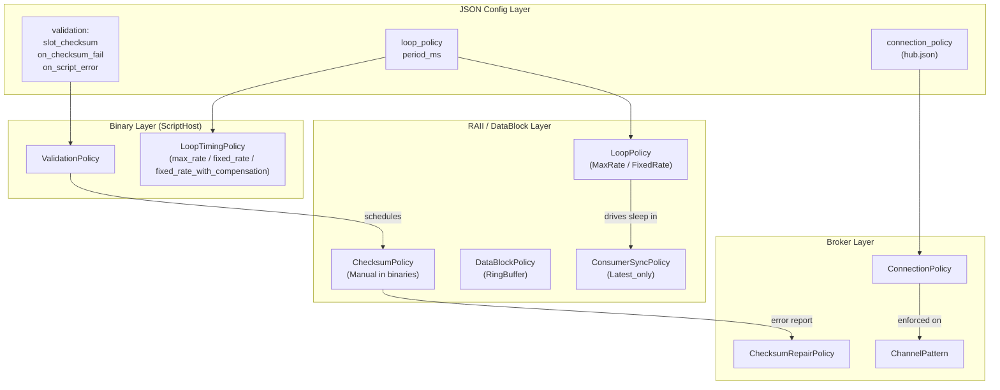

# HEP-CORE-0009: Policy Reference

**Status**: Active — maintained document; updated when new policies are added
**Created**: 2026-02-22
**Area**: Cross-cutting — DataHub, BrokerService, Standalone Binaries

---

## 1. Purpose

pylabhub has several distinct "policy" enums that control behaviour at different
layers of the stack. This document is the canonical cross-reference: where each
policy lives, what layer applies it, and how it interacts with other policies.

Related documents:
- HEP-CORE-0002: DataHub — slot state machine, SHM layout
- HEP-CORE-0007: DataHub Protocol and Policy — protocol flows, DRAINING proof
- HEP-CORE-0008: LoopPolicy and Iteration Metrics — loop pacing
- `docs/IMPLEMENTATION_GUIDANCE.md` § "Error Taxonomy" — Cat 1 / Cat 2 errors

---

## 2. Policy Categories

### 2.1 Buffer Management

**`DataBlockPolicy`** — `src/include/utils/data_block_policy.hpp` (included by `data_block_config.hpp` → `data_block.hpp`)
**Applied by**: `DataBlockProducer` at SHM creation time. Stored in `SharedMemoryHeader`.

| Value | Description |
|-------|-------------|
| `Single` | One slot; producer blocks until consumer has released it. |
| `DoubleBuffer` | Two slots; producer writes to the idle slot while consumer reads the other. |
| `RingBuffer` | N slots ring buffer; writer advances independently; fastest throughput. |
| `Unset` | Sentinel — must not appear in a live SHM header. |

**Configuration**: `DataBlockConfig::policy` in `ProducerOptions::shm_config`.
**Immutable** once the SHM segment is created; cannot change without destroying and
recreating the segment.

---

### 2.2 Consumer Read Advancement

**`ConsumerSyncPolicy`** — `src/include/utils/data_block_policy.hpp` (included by `data_block_config.hpp` → `data_block.hpp`)
**Applied by**: `DataBlockProducer` at SHM creation; `DataBlockConsumer` at attach time.
Stored in `SharedMemoryHeader`.

| Value | Consumers | Read order | Writer block |
|-------|-----------|------------|--------------|
| `Latest_only` | Any number | Latest slot only; older slots silently skipped | Never — writer always advances freely |
| `Sequential` | Exactly 1 | Strict FIFO; read_index = tail | Yes — blocks when ring full |
| `Sequential_sync` | Multiple | Per-consumer position; slowest determines ring space | Yes — blocks until slowest consumer catches up |
| `Unset` | — | Sentinel | — |

**Configuration**: `DataBlockConfig::consumer_sync_policy`.
**Immutable** once SHM is created (stored in header).
**JSON key**: `"shm.reader_sync_policy"` (producer), `"shm.out.reader_sync_policy"` (processor).
**JSON values**: `"sequential"` (default, maps to `Sequential`) or `"latest_only"` (maps to `Latest_only`).

**Interaction with DataBlockPolicy**:
- `Latest_only` is only meaningful with `RingBuffer`.
- `Sequential` works with any policy but is most useful with `RingBuffer`.
- `Sequential_sync` requires `RingBuffer` with capacity ≥ 2.

---

### 2.3 Checksum Enforcement (DataBlock layer)

**`ChecksumPolicy`** — `src/include/utils/data_block_policy.hpp` (included by `data_block_config.hpp` → `data_block.hpp`)
**Applied by**: `DataBlockProducer` on write; `DataBlockConsumer` on read.
**NOT stored in SHM** — set per-handle at `DataBlockConfig` time.

| Value | Producer | Consumer |
|-------|----------|----------|
| `None` | No checksum calls | No verification |
| `Manual` | Caller must call `update_checksum_slot()` / `update_checksum_flexible_zone()` explicitly | Caller must call `verify_checksum_*()` explicitly |
| `Enforced` | System calls update automatically on `release_write_slot` | System calls verify automatically on `release_consume_slot`; error returned on mismatch |

**Configuration**: `DataBlockConfig::checksum_policy`.
**Default** in standalone binaries: `ChecksumPolicy::Manual` (C++ script host calls update
after the Python callback completes).

**Algorithm**: Always BLAKE2b-256 (`ChecksumType::BLAKE2b`). Algorithm selection is
stored in `SharedMemoryHeader`; currently only one algorithm is supported.

---

### 2.4 Script Validation (binary config layer)

**`ValidationPolicy`** — defined in each binary's config header (e.g. `producer_config.hpp`, `consumer_config.hpp`, `processor_config.hpp`)
**Applied by**: Each binary's `ScriptHost` implementation.
This is the **binary-level** view of checksum policies, with additional script-level
error handling flags:

```cpp
struct ValidationPolicy {
    enum class Checksum { None, Update, Enforce };

    Checksum  slot_checksum{Checksum::Update};
    Checksum  flexzone_checksum{Checksum::Update};
    bool      skip_on_validation_error{true};   // true=discard+warn; false=call handler
    bool      stop_on_script_error{false};       // false=log+continue; true=log+stop
};
```

**`Checksum` sub-enum (per zone)**:

| Value | Producer action | Consumer action |
|-------|----------------|----------------|
| `None` | No update | No verify |
| `Update` | C++ writes BLAKE2b after `on_iteration()` | No verify (trust producer) |
| `Enforce` | C++ writes BLAKE2b after `on_iteration()` | C++ verifies before `on_iteration()`; sets `api.slot_valid()=false` on mismatch |

**`skip_on_validation_error`** (consumer only — what to do when `Enforce` finds a mismatch):

| Value | Action |
|-------|--------|
| `true` (default) | Discard slot; do not call `on_iteration()`; log Cat 2 warning |
| `false` | Call `on_iteration()` with `api.slot_valid() == False` |

JSON: `"on_checksum_fail": "skip"` → `true` \| `"pass"` → `false`.

**`stop_on_script_error`** (both sides — unhandled Python exception in any callback):

| Value | Action |
|-------|--------|
| `false` (default) | Log full traceback; discard current slot; keep running |
| `true` | Log traceback; stop the binary cleanly |

JSON: `"on_script_error": "continue"` → `false` \| `"stop"` → `true`.

**JSON config** (per role):
```json
"validation": {
    "slot_checksum":     "update",
    "flexzone_checksum": "update",
    "on_checksum_fail":  "skip",
    "on_script_error":   "continue"
}
```

**Relationship to DataBlock `ChecksumPolicy`**:
- Standalone binaries always create `DataBlockProducer` with `ChecksumPolicy::Manual`.
- `ValidationPolicy::Checksum::Update/Enforce` controls WHEN the script host
  calls `update_checksum_slot()` / `verify_checksum_slot()`.
- The two layers are complementary: DataBlock owns the SHM mechanism; binary config
  controls the scheduling of that mechanism.

---

### 2.5 Broker Checksum Repair

**`ChecksumRepairPolicy`** — `src/include/utils/broker_service.hpp`
**Applied by**: `BrokerService` when it receives a `CHECKSUM_ERROR_REPORT` message
(Cat 2 error reported by a producer or consumer).

| Value | Broker action |
|-------|--------------|
| `None` | Log the report; ignore (default). |
| `NotifyOnly` | Log + forward the report to all channel parties via `CHANNEL_EVENT_NOTIFY`. |
| `Repair` | Reserved — requires WriteAttach slot repair path; not implemented. |

**Configuration**: `BrokerService::Config::checksum_repair_policy`.
**Default**: `None`.

**Triggering**: A producer or consumer sends `CHECKSUM_ERROR_REPORT` to the broker
when `ChecksumPolicy::Enforced` detects a mismatch. The broker then applies this
policy. This is a Cat 2 (non-fatal, recoverable) error path.

---

### 2.6 Loop Pacing

#### 2.6.0 Binary-level: LoopDriver (IMPLEMENTED, 2026-03-07)

**`QueueType`** — defined in `consumer_config.hpp` (producer/processor not applicable)
**Applied by**: `ConsumerScriptHost` — selects which backing queue implementation drives `on_consume`.

A consumer connects to two potential data channels: a **SHM DataBlock** (low-latency
shared memory ring buffer) and a **ZMQ data socket** (direct PUSH/PULL, per HEP-CORE-0021).
`QueueType` selects which one the `hub::QueueReader*` points to for the consume loop.

| Value | Main loop blocks on | ZMQ ctrl thread |
|-------|---------------------|-----------------|
| `Shm` (default) | SHM `acquire_consume_slot()` | Control plane only (heartbeat, shutdown) |
| `Zmq` | ZMQ PULL receive (HEP-0021) | Data + control plane |

JSON: `"queue_type": "shm"` (default) | `"zmq"`.

#### 2.6.1 Binary-level: LoopTimingPolicy (IMPLEMENTED, 2026-02-23)

**`LoopTimingPolicy`** — defined in `utils/loop_timing_policy.hpp` (shared, `pylabhub` namespace)
**Applied by**: Each binary's script host loop when `loop_timing != MaxRate`.

| Value | JSON | Deadline formula | Overrun behaviour |
|-------|------|-----------------|-------------------|
| `MaxRate` | `"max_rate"` | No sleep; requires `target_period_ms == 0` | N/A |
| `FixedRate` | `"fixed_rate"` | `next = now() + target_period_ms` | No catch-up; rate ≤ target |
| `FixedRateWithCompensation` | `"fixed_rate_with_compensation"` | `next += target_period_ms` | Fires immediately; average rate converges to target |

JSON: `"loop_timing": "max_rate"` | `"fixed_rate"` | `"fixed_rate_with_compensation"`.

**Configuration rules (enforced by `parse_timing_config()`):**
- `loop_timing` is **required** — error if absent.
- `"max_rate"`: `target_period_ms` and `target_rate_hz` must NOT be present — error if either set.
- `"fixed_rate"` / `"fixed_rate_with_compensation"`: exactly one of `target_period_ms` or
  `target_rate_hz` must be present — error if both, error if neither.
Observability: `api.overrun_count()`, `api.last_cycle_work_us()`.

#### 2.6.2 RAII-layer: LoopPolicy ✅ Implemented (Pass 3 complete 2026-02-25)

**`LoopPolicy`** — `src/include/utils/data_block_policy.hpp` (included by `data_block_config.hpp` → `data_block.hpp`)
**Applied by**: `SlotIterator::operator++()` (sleep); `acquire_write_slot()` (overrun detection).
See `tests/test_layer3_datahub/test_datahub_loop_policy.cpp` — 5 tests passing.

| Value | Sleep behaviour | Overrun tracking |
|-------|----------------|-----------------|
| `MaxRate` | None — iterate as fast as possible | No |
| `FixedRate` | `sleep(max(0, period_ms − elapsed))` in `SlotIterator::operator++()` | Yes — `acquire_write_slot()` increments `ContextMetrics::overrun_count` |
| `MixTriggered` | Reserved | Reserved |

See **HEP-CORE-0008** for the full design, including the five-domain metrics model
(Channel throughput / Acquire timing / Loop scheduling / Script supervision / Topology)
and the `set_loop_policy()` unification mechanism (`ContextMetrics` lives in DataBlock
Pimpl; `TransactionContext::metrics()` is a pass-through reference).

**JSON config** (per role, Pass 2):
```json
"loop_policy": "fixed_rate",
"period_ms": 10
```

---

### 2.7 Channel Access Policy (broker layer)

**`ConnectionPolicy`** — `src/include/utils/channel_access_policy.hpp`
**Applied by**: `BrokerServiceImpl::check_connection_policy()` in `broker_service.cpp`,
called on every incoming REG_REQ (producer) and CONSUMER_REG_REQ (consumer).

| Value | Identity required? | Must be in known_roles? | Suitable for |
|-------|--------------------|--------------------------|--------------|
| `Open` | No | No | Dev/local hubs (default) |
| `Tracked` | Optional (if provided, stored in registry) | No | Observability and auditing |
| `Required` | Yes (producer_name + producer_uid) | No | Deployment environments |
| `Verified` | Yes (producer_name + producer_uid) | Yes (allowlist) | Production |

**Configuration**: `BrokerService::Config::connection_policy` wired from
`HubConfig::connection_policy()` in `hubshell.cpp`.
JSON: hub.json `"connection_policy": "open"` | `"tracked"` | `"required"` | `"verified"`.

**Per-channel override**: `ChannelPolicy` (list of glob patterns + policy level) can
tighten the effective policy for specific channels. First match wins.
`BrokerServiceImpl::effective_policy()` applies the override logic.

---

### 2.8 Channel Communication Pattern

**`ChannelPattern`** — `src/include/utils/channel_pattern.hpp`
**Applied by**: `Messenger.cpp` (producer socket setup); `BrokerService` broadcasts
the pattern in `CHANNEL_READY_NOTIFY` so consumers can connect with the correct socket.

| Value | Producer socket | Consumer socket | Use case |
|-------|-----------------|-----------------|----------|
| `PubSub` | XPUB (binds) | SUB (connects) | 1:many broadcast; consumers may miss frames |
| `Pipeline` | PUSH (binds) | PULL (connects) | Load-balanced; each frame to one consumer |
| `Bidir` | ROUTER (binds) | DEALER (connects) | Bidirectional; full routing |

**Configuration**: `ProducerOptions::channel_pattern` (default: `PubSub`).
JSON wire values: `"PubSub"` | `"Pipeline"` | `"Bidir"`.

---

## 3. Policy Interaction Summary

```
┌─────────────────────────────────────────────────────────────────────────────┐
│  Binary JSON config (producer.json / consumer.json / processor.json)        │
│    "validation": { slot_checksum, flexzone_checksum,                        │
│                    on_checksum_fail (→ skip_on_validation_error bool),      │
│                    on_script_error  (→ stop_on_script_error bool) }         │
│                                              ← ValidationPolicy             │
│    "loop_policy", "period_ms"                ← LoopPolicy                   │
│                                                                             │
│  ScriptHost (ProducerScriptHost / ConsumerScriptHost / ProcessorScriptHost)│
│    Reads ValidationPolicy → controls WHEN update/verify are called          │
│    Reads LoopPolicy → passes to SlotIterator / hub::Processor              │
│                                                                             │
│  hub::Producer / hub::Consumer (ProducerOptions / ConsumerOptions)          │
│    shm_config.checksum_policy = Manual   ← always Manual in binaries        │
│    shm_config.policy = RingBuffer        ← from JSON "shm.slot_count"       │
│    shm_config.consumer_sync_policy = from JSON "reader_sync_policy"         │
│                                                                             │
│  DataBlockProducer (SHM write path)                                        │
│    ChecksumPolicy::Manual → script host drives update_checksum_*()          │
│    DataBlockPolicy::RingBuffer → ring buffer slot management                │
│    ConsumerSyncPolicy per config → Sequential (default) or Latest_only      │
│                                                                             │
│  BrokerService                                                              │
│    ChecksumRepairPolicy → what to do with CHECKSUM_ERROR_REPORT msgs        │
└─────────────────────────────────────────────────────────────────────────────┘
```

---

## 4. Default Policy Stack (Standalone Binaries)

When a user creates a producer/consumer/processor with default JSON config:

| Layer | Policy | Value |
|-------|--------|-------|
| SHM buffer | `DataBlockPolicy` | `RingBuffer` |
| SHM consumer sync | `ConsumerSyncPolicy` | `Sequential` (`Sequential`) |
| SHM checksum mechanism | `ChecksumPolicy` | `Manual` |
| Script slot checksum | `ValidationPolicy::Checksum` | `Update` (producer updates; consumer does not verify) |
| Script flexzone checksum | `ValidationPolicy::Checksum` | `Update` |
| Script on checksum fail | `skip_on_validation_error` | `true` (discard + log Cat 2 warning) |
| Script on error | `stop_on_script_error` | `false` (log traceback, keep running) |
| Broker checksum repair | `ChecksumRepairPolicy` | `None` |
| Loop pacing | `LoopPolicy` | `MaxRate` |

This default prioritizes **throughput and resilience**: slots flow as fast as
possible; checksum errors are logged but do not stop the consumer; Python errors
are logged and the slot is discarded.

For **safety-critical** applications, set:
- `slot_checksum: "enforce"` + `on_checksum_fail: "skip"` (Cat 2: verified reads)
- `on_script_error: "stop"` (treat script errors as fatal)
- `checksum_repair_policy: "notify_only"` (alert all parties on mismatch)

---

## 5. Where to Find Each Policy

| Policy | Header | JSON key | Applied in |
|--------|--------|----------|------------|
| `DataBlockPolicy` | `data_block_policy.hpp` | `shm.slot_count` (implicit RingBuffer) | `DataBlockProducer` ctor |
| `ConsumerSyncPolicy` | `data_block_policy.hpp` | N/A (fixed in binaries) | `DataBlockProducer` ctor |
| `ChecksumPolicy` | `data_block_policy.hpp` | N/A (fixed Manual in binaries) | `DataBlockProducer` / `Consumer` per-slot |
| `ChecksumType` | `data_block_policy.hpp` | N/A (fixed BLAKE2b) | SHM header |
| `ValidationPolicy::Checksum` | `producer_config.hpp` / `consumer_config.hpp` | `validation.slot_checksum` | `ProducerScriptHost` / `ConsumerScriptHost` |
| `skip_on_validation_error` (bool) | `consumer_config.hpp` | `validation.on_checksum_fail` | `ConsumerScriptHost` |
| `stop_on_script_error` (bool) | per-binary config | `validation.on_script_error` | All script hosts |
| `ChecksumRepairPolicy` | `broker_service.hpp` | `BrokerService::Config` | `BrokerService::run()` |
| `QueueType` | `consumer_config.hpp` | `queue_type` | `ConsumerScriptHost` — selects SHM vs ZMQ as backing queue for the data plane |
| `LoopTimingPolicy` | `producer_config.hpp`, `consumer_config.hpp` | `loop_timing` | `ProducerScriptHost` / `ConsumerScriptHost` when `target_period_ms > 0` |
| `LoopPolicy` *(RAII Pass 2)* | `data_block_policy.hpp` | auto-set from `target_period_ms` | Sleep: `SlotIterator::operator++()`; overrun: `acquire_write_slot()` |
| `ConnectionPolicy` | `channel_access_policy.hpp` | hub.json `"connection_policy"` | `BrokerServiceImpl::check_connection_policy()` |
| `ChannelPattern` | `channel_pattern.hpp` | `ProducerOptions::channel_pattern` | `Messenger` (socket type) + `BrokerService` (CHANNEL_READY_NOTIFY) |

---

## 6. Policy Dependency Graph



---

## 7. Source File Reference

| File | Layer | Description |
|------|-------|-------------|
| `src/include/utils/data_block_policy.hpp` | L3 (public) | `DataBlockPolicy`, `ConsumerSyncPolicy`, `ChecksumPolicy`, `LoopPolicy` |
| `src/include/utils/channel_access_policy.hpp` | L3 (public) | `ConnectionPolicy` enum |
| `src/include/utils/channel_pattern.hpp` | L3 (public) | `ChannelPattern` enum |
| `src/include/utils/broker_service.hpp` | L3 (public) | `BrokerService::Config` — `ChecksumRepairPolicy`, `ConnectionPolicy` |
| `src/producer/producer_config.hpp` | L4 | `ValidationPolicy` struct, `LoopTimingPolicy` |
| `src/consumer/consumer_config.hpp` | L4 | Same policy config fields for consumer |
| `src/processor/processor_config.hpp` | L4 | `overflow_policy`, validation policy for processor |
| `src/utils/ipc/broker_service.cpp` | impl | `check_connection_policy()`, `effective_policy()` |
| `src/utils/shm/data_block.cpp` | impl | Policy enforcement in slot acquire/release |
