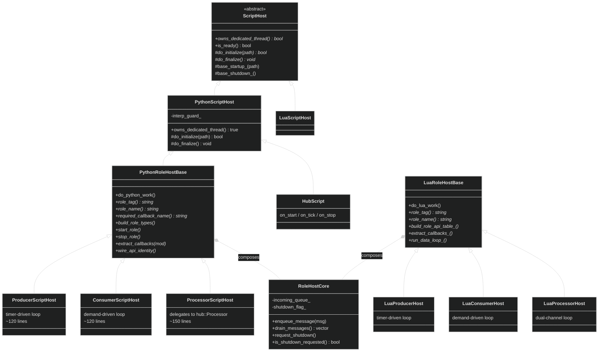
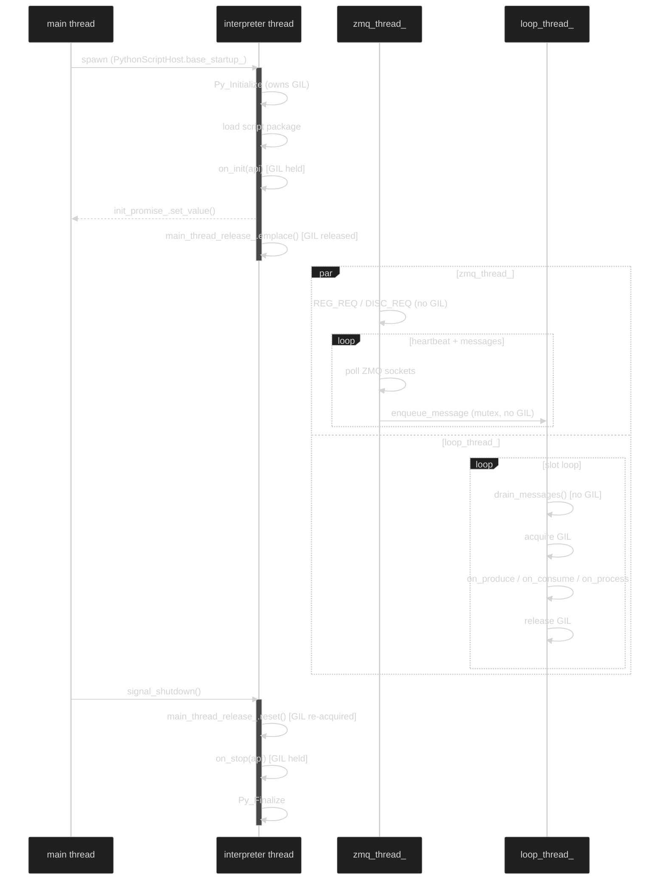

# HEP-CORE-0011: ScriptHost Abstraction Framework

| Property           | Value                                                   |
| ------------------ | ------------------------------------------------------- |
| **HEP**            | `HEP-CORE-0011`                                         |
| **Title**          | ScriptHost Abstraction Framework                        |
| **Author**         | pylabhub development team                               |
| **Status**         | Implemented (2026-03-03)                                |
| **Created**        | 2026-02-28                                              |
| **Updated**        | 2026-03-03 (RoleHostCore + PythonRoleHostBase dedup)    |
| **Supersedes**     | `HEP-CORE-0005` (Script Interface Abstraction Framework)|
| **Related**        | `HEP-CORE-0018` (Producer and Consumer Binaries)        |

---

## Abstract

This HEP defines the `ScriptHost` abstraction layer — a C++ base class that unifies lifecycle
management and thread ownership for embedded scripting runtimes (Python, LuaJIT, and future
engines) across all pylabhub executables. It replaces the ad-hoc per-executable embedding
patterns that evolved independently in `pylabhub-hubshell` (HubScript + PythonInterpreter) and
the standalone binaries (stack-scoped `py::scoped_interpreter` in each binary's `main.cpp`).

The design principle is: **the abstract interface owns lifecycle and thread model; invocation
stays native in the concrete class.** No generic `ScriptValue` or `call_function(name, args)`
type-erased interface is introduced. This avoids the lowest-common-denominator abstraction
failure identified in the superseded HEP-CORE-0005 design.

---

## Motivation

### Problem: duplicated embedding boilerplate

Both the hub executable and the standalone binaries independently embed a Python interpreter,
duplicating:
- `PyConfig` setup (PYTHONHOME derivation from exe path, signal handlers, parse_argv)
- Interpreter thread ownership (who creates `py::scoped_interpreter`, on which thread)
- Startup synchronization (`std::promise<void>`/`std::future<void>`)
- GIL management (release between work, acquire around Python calls)
- Lifecycle integration (`ModuleDef`, singleton pattern, C-style function pointer callbacks)

### Problem: no path to LuaJIT script hosting

LuaJIT is already linked into `pylabhub-utils` for DataBlock slot scripting. There is no
structured mechanism for a hub or binary to host a LuaJIT script with the same
`on_start`/`on_tick`/`on_stop` callback contract that Python scripts use.

### Problem: third-party executable authors have no pattern

Developers building custom executables on top of `pylabhub-utils` must reverse-engineer
the embedding approach from the hub and binary source. A public abstract interface gives
them a documented, supported pattern.

---

## Design Decisions

| # | Decision | Rationale |
|---|---|---|
| 1 | Abstract interface owns **lifecycle + thread model only** — not invocation | Avoids type-erased `ScriptValue`/`call_function` lowest-common-denominator API |
| 2 | `owns_dedicated_thread()` flag determines threading model | Python requires a GIL-owner thread; Lua runs on caller's thread naturally |
| 3 | `thread_local ScriptHostThreadState` in base | Foundation for future per-thread validation, multi-thread model, and diagnostics without invasive passing through call stacks |
| 4 | No templates — virtual dispatch | `ScriptHost` is a lifecycle object called O(1) times; vtable overhead is unmeasurable. Templates would force `pybind11/embed.h` into public headers, breaking the clean abstraction boundary |
| 5 | `LuaScriptHost` in `pylabhub-utils` | LuaJIT already linked there; no new dependency for utils consumers |
| 6 | `PythonScriptHost` in separate `pylabhub-scripting` static lib | `libpython` must not become a hard dependency of all `pylabhub-utils` consumers |
| 7 | Script directory uses `python/` or `lua/` subdirs | Runtime-specific isolation; allows both script types to coexist in one instance dir |
| 8 | `script.type` in JSON config | Explicit over implicit; eliminates ambiguity when discovering script directories |
| 9 | Single-thread model for now | Validates the design with one worker thread per ScriptHost; multi-thread deferred to future HEP |

---

## Library Structure

```
pylabhub-utils (shared lib — existing)
  include/utils/script_host.hpp              ← ScriptHost abstract base (PUBLIC header)
  include/utils/script_host_helpers.hpp      ← Shared inline helpers (resolve_schema, etc.)
  include/utils/script_host_schema.hpp       ← SchemaSpec, FieldDef, SlotExposure types
  src/utils/scripting/script_host.cpp        ← base implementation (thread_local, startup/shutdown)
  src/utils/scripting/lua_script_host.hpp/.cpp  ← LuaScriptHost concrete class

pylabhub-scripting (thin STATIC lib)
  src/scripting/python_script_host.hpp/.cpp     ← PythonScriptHost concrete class
  src/scripting/role_host_core.hpp/.cpp          ← RoleHostCore (engine-agnostic infrastructure)
  src/scripting/python_role_host_base.hpp/.cpp   ← PythonRoleHostBase (common Python layer)
  src/scripting/lua_role_host_base.hpp/.cpp       ← LuaRoleHostBase (common Lua role layer)
  (linked by all four standalone binaries; NOT by pure-C++ consumers)

pylabhub-hubshell (executable)
  src/hub_python/hub_script.hpp/.cpp            ← HubScript : PythonScriptHost (no RoleHostBase)

pylabhub-producer (executable)
  src/producer/producer_script_host.hpp/.cpp    ← ProducerScriptHost : PythonRoleHostBase
  src/producer/lua_producer_host.hpp/.cpp       ← LuaProducerHost : LuaRoleHostBase

pylabhub-consumer (executable)
  src/consumer/consumer_script_host.hpp/.cpp    ← ConsumerScriptHost : PythonRoleHostBase
  src/consumer/lua_consumer_host.hpp/.cpp       ← LuaConsumerHost : LuaRoleHostBase

pylabhub-processor (executable)
  src/processor/processor_script_host.hpp/.cpp  ← ProcessorScriptHost : PythonRoleHostBase
  src/processor/lua_processor_host.hpp/.cpp     ← LuaProcessorHost : LuaRoleHostBase
```

### Class Hierarchy

```
RoleHostCore                              (engine-agnostic infrastructure, composed)
  — message queue, shutdown flags, state, schema storage
  — reusable by any scripting engine

ScriptHost (abstract)                     (lifecycle contract — in pylabhub-utils)
├── LuaScriptHost                         (Lua runtime — in pylabhub-utils)
├── PythonScriptHost                      (Python runtime — in pylabhub-scripting)
│   ├── HubScript                         (hub-specific; no RoleHostBase — different callback set)
│   └── PythonRoleHostBase                (common do_python_work() skeleton + virtual hooks)
│       ├── ProducerScriptHost            (thin: ~120 lines, timer-driven production loop)
│       ├── ConsumerScriptHost            (thin: ~120 lines, demand-driven consumption loop)
│       └── ProcessorScriptHost           (thin: ~150 lines, delegates to hub::Processor)
└── LuaRoleHostBase                       (Lua runtime + same virtual hooks)
        ├── LuaProducerHost              (timer-driven production loop)
        ├── LuaConsumerHost              (demand-driven consumption loop)
        └── LuaProcessorHost             (dual-channel manual loop)
```



**Design: Composition + Inheritance.**

- `RoleHostCore` is **composed** (has-a) by `PythonRoleHostBase` and `LuaRoleHostBase`.
  No virtual methods — pure infrastructure. No diamond inheritance problems.
- `PythonRoleHostBase` **inherits** `PythonScriptHost` for interpreter lifecycle, and
  provides the shared `do_python_work()` skeleton with ~15 virtual hooks for role dispatch.
- Each role subclass overrides only the hooks specific to its role (~100-150 lines).

### Virtual Hook Contract (PythonRoleHostBase)

| Hook | Purpose | Example override |
|------|---------|-----------------|
| `role_tag()` | Short log prefix | `"prod"`, `"cons"`, `"proc"` |
| `role_name()` | Full role name | `"producer"`, `"consumer"`, `"processor"` |
| `role_uid()` | UID from config | `config_.producer_uid` |
| `script_base_dir()` | Script path from config | `config_.script_path` |
| `script_type_str()` | Script type from config | `config_.script_type` |
| `required_callback_name()` | Entry-point callback | `"on_produce"`, `"on_consume"`, `"on_process"` |
| `wire_api_identity()` | Set uid/name/channel on API | Sets api_.set_uid(), etc. |
| `extract_callbacks(mod)` | Pull callbacks from Python module | `py_on_produce_ = getattr(mod, ...)` |
| `has_required_callback()` | Validate entry-point exists | `is_callable(py_on_produce_)` |
| `build_role_types()` | Build slot/fz types | Dual schemas (processor) or single |
| `print_validate_layout()` | --validate output | Print slot+fz layout |
| `start_role()` | Connect, start threads | Create Producer/Consumer/Processor |
| `stop_role()` | Join threads, disconnect | Stop and close connections |
| `cleanup_on_start_failure()` | Rollback on error | Close partial connections |
| `clear_role_pyobjects()` | Release role-specific py objects | Reset py_on_produce_ etc. |
| `on_script_error()` | Increment error counter | `api_.increment_script_errors()` |
| `has_connection_for_stop()` | Guard for on_stop | `out_producer_.has_value()` |
| `update_fz_checksum_after_init()` | Post-init checksum (default: no-op) | Producer updates SHM checksum |
| `build_messages_list_(msgs)` | Build Python message list (virtual) | Consumer omits sender |

---

## Abstract Interface

### `ScriptHost` (in `pylabhub-utils`, public header)

```cpp
// include/utils/script_host.hpp
namespace pylabhub::utils {

/// Per-thread state set by ScriptHost on the thread it initializes.
/// Foundation for future per-thread validation and diagnostics.
struct ScriptHostThreadState {
    ScriptHost* owner{nullptr};          ///< Which host initialized on this thread.
    bool        is_interpreter_thread{}; ///< true = this thread owns the script runtime.
};

/// Thread-local state — one instance per thread, zero-initialized by default.
/// Set by ScriptHost::base_startup_() on the owning thread.
extern thread_local ScriptHostThreadState g_script_thread_state;

class ScriptHost {
public:
    virtual ~ScriptHost() = default;

    // ── Threading model ──────────────────────────────────────────────────────

    /// Returns true if this host spawns its own dedicated interpreter thread.
    ///
    /// - Python (GIL): true — hub_thread_ / binary_python_thread_ own the interpreter.
    /// - Lua (no GIL):  false — initialize() and all calls run on the caller's thread.
    ///
    /// The base class branches on this flag in base_startup_() and base_shutdown_().
    [[nodiscard]] virtual bool owns_dedicated_thread() const noexcept = 0;

    // ── State ─────────────────────────────────────────────────────────────────

    /// Thread-safe. True between base_startup_() completion and base_shutdown_() start.
    [[nodiscard]] bool is_ready() const noexcept;

    // ── Lifecycle integration ─────────────────────────────────────────────────
    //
    // Each concrete subclass provides:
    //   static utils::ModuleDef GetLifecycleModule();   ← singleton + C-style callbacks
    //
    // This cannot be virtual+static; it is a documented convention.

protected:
    // ── Protected lifecycle hooks (implemented by each concrete class) ────────

    /// Called on the interpreter thread (threaded mode) or calling thread (direct mode)
    /// after the runtime is initialized. Subclass loads the script and calls on_start here.
    /// Returns false on fatal error; base will set_exception on the init_promise_.
    virtual bool do_initialize(const std::filesystem::path& script_path) = 0;

    /// Called with the runtime still live. Subclass calls on_stop and releases
    /// script objects. Called on interpreter thread (threaded) or calling thread (direct).
    virtual void do_finalize() noexcept = 0;

    // ── Base machinery (called by concrete class startup_()/shutdown_()) ──────

    /// Starts the host:
    ///   - threaded mode: spawns thread_, waits on init_future_.get()
    ///   - direct mode:   calls do_initialize() on calling thread, sets ready_=true
    /// Throws std::runtime_error on initialization failure.
    void base_startup_(const std::filesystem::path& script_path);

    /// Stops the host:
    ///   - threaded mode: sets stop_=true, joins thread_
    ///   - direct mode:   calls do_finalize() on calling thread, sets ready_=false
    void base_shutdown_() noexcept;

    std::atomic<bool> ready_{false};
    std::atomic<bool> stop_{false};

private:
    /// Entry point for the dedicated interpreter thread (threaded mode only).
    /// Calls do_initialize(), signals init_promise_, runs idle loop, calls do_finalize().
    void thread_fn_(const std::filesystem::path& script_path);

    std::thread        thread_;
    std::promise<void> init_promise_;
    std::future<void>  init_future_{init_promise_.get_future()};
};

} // namespace pylabhub::utils
```

### `thread_local ScriptHostThreadState` usage

```
Thread A (hub_thread_ / binary_python_thread_):
  ScriptHost::thread_fn_() entry:
    g_script_thread_state.owner                = this;
    g_script_thread_state.is_interpreter_thread = true;

Thread B (main / any caller in direct/Lua mode):
  ScriptHost::base_startup_() direct path:
    g_script_thread_state.owner                = this;
    g_script_thread_state.is_interpreter_thread = true;

  ScriptHost::base_shutdown_() direct path:
    g_script_thread_state.owner                = nullptr;
    g_script_thread_state.is_interpreter_thread = false;
```

Concrete classes use this state for:
- `LuaScriptHost`: validate `g_script_thread_state.owner == this` on every call (hard error if wrong thread)
- `PythonScriptHost`: assert `is_interpreter_thread` for calls that must stay on the GIL-owner thread
- Future multi-thread: each worker thread sets its own state identifying the ScriptHost and role it belongs to

---

## Concrete Classes

### `LuaScriptHost` (in `pylabhub-utils`)

```
Threading model: owns_dedicated_thread() = false
  → runs on caller's thread
  → do_initialize() called directly by base_startup_() on calling thread
  → all on_start / on_tick / on_stop calls must come from same thread

Runtime init in do_initialize():
  L_ = luaL_newstate()
  luaL_openlibs(L_)
  Sandbox: push nil over io.*, os.execute, dofile, loadfile (configurable)
  Set package.path to include: <exe_dir>/../opt/luajit/jit/?.lua
  Load script (luaL_loadfile + lua_pcall)
  Call on_start if defined

on_tick dispatch:
  Caller verifies g_script_thread_state.owner == this (thread safety check)
  lua_getglobal(L_, "on_tick") + push LuaTickInfo userdata + lua_pcall

on_stop dispatch:
  lua_getglobal(L_, "on_stop") + lua_pcall

do_finalize():
  lua_close(L_); L_ = nullptr;
  g_script_thread_state = {}; (clear on owning thread)
```

**Script file location**: `<script_path>/lua/main.lua`
(where `script_path` is the base script directory from config)

### `PythonScriptHost` (in `pylabhub-scripting` static lib)

```
Threading model: owns_dedicated_thread() = true
  → spawns dedicated thread_ (hub_thread_ / binary_python_thread_)
  → thread_ owns py::scoped_interpreter (Py_Initialize → Py_Finalize)
  → main thread blocks on init_future_.get() in base_startup_()

Runtime init in do_initialize() (called on thread_):
  1. Derive python_home: <exe_dir>/../opt/python (hard error if missing)
  2. PyConfig setup: parse_argv=0, install_signal_handlers=0, home=python_home
  3. py::scoped_interpreter interp_guard{&config}  ← RAII, owns Py_Initialize/Py_Finalize
  4. PythonInterpreter::get_instance().init_namespace_()  ← sets ready_=true
  5. Load script package from <script_path>/python/__init__.py
  6. Call on_start(api) if defined
  7. Signal init_promise_.set_value() → base_startup_() returns on main thread
  8. GIL released (py::gil_scoped_release outer_release)
  9. Tick loop: sleep → [acquire GIL] → on_tick → [release GIL]
  10. on_stop(api)
  11. PythonInterpreter::get_instance().release_namespace_()
  12. interp_guard destructor → Py_Finalize

Threading notes:
  - GIL released between ticks → AdminShell exec() can run concurrently
  - BrokerService queries happen without GIL (lock-free channel snapshot)
  - All py::object locals to thread_fn_(); no py::object members on PythonScriptHost
```

**Script file location**: `<script_path>/python/__init__.py`
(where `script_path` is the base script directory from config)

---

## Configuration Schema

### Hub (`hub.json`)

**Before (current):**
```json
{
  "python": {
    "script":                  "./script",
    "tick_interval_ms":        1000,
    "health_log_interval_ms":  60000,
    "requirements":            "../share/scripts/python/requirements.txt"
  }
}
```

**After:**
```json
{
  "script": {
    "type":                    "python",
    "path":                    "./script",
    "tick_interval_ms":        1000,
    "health_log_interval_ms":  60000
  },
  "python": {
    "requirements":            "../share/scripts/python/requirements.txt"
  }
}
```

The `script.type` field is **required** when `script.path` is set. It selects which
`ScriptHost` subclass the hub instantiates and which subdirectory is used:
- `"python"` → `<path>/python/__init__.py` (Python package)
- `"lua"`    → `<path>/lua/main.lua` (Lua script)

**Hub directory layout:**
```
<hub_dir>/
  hub.json
  script/
    python/
      __init__.py      ← on_start(api) / on_tick(api, tick) / on_stop(api)
      helpers.py       ← optional submodules
    lua/               ← present only when type = "lua"
      main.lua         ← on_start(api) / on_tick(api, tick) / on_stop(api)
  logs/
  run/
```

### Producer (`producer.json`)

```json
{
  "script": {
    "type": "python",
    "path": "./script"
  }
}
```

**Producer directory layout:**
```
<producer_dir>/
  producer.json
  vault/
  script/
    python/
      __init__.py      ← on_init(api) / on_produce(out_slot, fz, msgs, api) -> bool / on_stop(api)
    lua/               ← present only when type = "lua"
      main.lua
  logs/
  run/
    producer.pid
```

### Consumer (`consumer.json`)

```json
{
  "script": {
    "type": "python",
    "path": "./script"
  }
}
```

**Consumer directory layout:**
```
<consumer_dir>/
  consumer.json
  vault/
  script/
    python/
      __init__.py      ← on_init(api) / on_consume(in_slot, fz, msgs, api) / on_stop(api)
    lua/               ← present only when type = "lua"
      main.lua
  logs/
  run/
    consumer.pid
```

### Processor (`processor.json`)

```json
{
  "script": {
    "type": "python",
    "path": "./script"
  }
}
```

**Processor directory layout:**
```
<processor_dir>/
  processor.json
  vault/
  script/
    python/
      __init__.py      ← on_init(api) / on_process(in_slot, out_slot, fz, msgs, api) -> bool / on_stop(api)
    lua/               ← present only when type = "lua"
      main.lua
  logs/
  run/
    processor.pid
```

### Script path resolution rule (all four components)

`script.type` is **required** in every config. C++ resolution:

```
<script.path> + "/" + <script.type> + "/" + "__init__.py"   (Python)
<script.path> + "/" + <script.type> + "/main.lua"           (Lua)
```

With `"path": "./script"` and `"type": "python"` → `./script/python/__init__.py`.

The subdir and its entry file must exist; missing either throws a `std::runtime_error`
that is caught and logged as an error. No fallback, no silent skip.

---

## LuaJIT Runtime Staging

Symmetric with the Python standalone installation at `opt/python/`:

```
stage-<buildtype>/
  opt/
    python/            ← Python standalone home (PYTHONHOME)
      bin/
      lib/
      ...
    luajit/            ← LuaJIT runtime support directory (NEW)
      jit/             ← JIT support scripts (dis_*.lua, dump.lua, zone.lua, ...)
```

The `opt/luajit/` directory contains runtime support scripts needed by LuaJIT's JIT
compiler and profiling tools (accessed via `require "jit.dump"` etc.).

`LuaScriptHost::do_initialize()` derives the LuaJIT home:
```cpp
fs::path luajit_home = derive_exe_dir() / ".." / "opt" / "luajit";
// Set Lua package.path to include luajit_home / "jit" / "?.lua"
```

**CMake change**: `luajit_install.cmake` changes `_dest_jit_dir` from
`${_install_dir}/share/luajit/jit` to `${_install_dir}/opt/luajit/jit`.
The staging step copies `prereqs/opt/luajit/` → `stage-<type>/opt/luajit/`.

---

## Lua Script Interface

Lua scripts implement the same callback convention as Python scripts.
All callbacks are optional; missing ones are silently skipped.

```lua
-- <script_path>/lua/main.lua

--- Called once after the runtime is initialized.
--- @param api table   LuaScriptAPI proxy (methods: hub_name, hub_uid, log, shutdown, channels)
function on_start(api)
    api.log("info", "Hub '" .. api.hub_name() .. "' Lua script started")
end

--- Called every tick_interval_ms.
--- @param api  table   LuaScriptAPI proxy
--- @param tick table   {tick_count, elapsed_ms, uptime_ms, channels_ready,
---                      channels_pending, channels_closing}
function on_tick(api, tick)
    -- Custom monitoring or policy actions
end

--- Called once before shutdown.
--- @param api table   LuaScriptAPI proxy
function on_stop(api)
    api.log("info", "Hub Lua script stopping")
end
```

The `api` table is a lightweight C-backed proxy (implemented via Lua userdata +
`__index` metatable dispatching to `LuaScriptAPI` C++ methods).

---

## Sandbox Policy

`LuaScriptHost` applies a default sandbox at initialization:

| Function / Module | Default | Config override |
|---|---|---|
| `io.*` | disabled | `script.lua.allow_io: true` |
| `os.execute`, `os.exit` | disabled | `script.lua.allow_os: true` |
| `dofile`, `loadfile` | disabled | always disabled |
| `package.loadlib` | disabled | always disabled |
| `require` | enabled (safe modules only) | `script.lua.allowed_modules: [...]` |
| `jit.*` | enabled (profiling/tuning) | — |

Python scripts are not sandboxed at the C++ level (CPython's import system is too
rich to reliably sandbox without significant complexity). Script authors are trusted.

---

## Thread Safety Summary

| Scenario | Python | Lua |
|---|---|---|
| Interpreter ownership | Dedicated `interpreter_thread_` per binary | Calling thread |
| Callbacks (`on_init`, `on_produce`/`on_consume`/`on_process`/`on_tick`, `on_stop`) | GIL held on interpreter thread | Caller's thread (validated) |
| AdminShell `exec()` (hub only) | `py::gil_scoped_acquire` (concurrent, GIL serializes) | Not applicable |
| ZMQ callbacks (`zmq_thread_`) | Routes to `RoleHostCore::enqueue_message()` (mutex, no GIL) | Same — no GIL |
| Loop thread drain-and-dispatch | `RoleHostCore::drain_messages()` then GIL acquire for callback | Direct Lua stack call |
| Concurrent calls from wrong thread | Prevented by GIL | Detected via `g_script_thread_state`, hard error logged |
| `is_ready()` check | Lock-free `std::atomic<bool>` | Lock-free `std::atomic<bool>` |

---

## Expansion Path: Future Multi-Thread Model

The `thread_local ScriptHostThreadState` is the foundational hook for future expansion.
Each standalone binary currently has exactly one `ScriptHost` instance. If per-channel
sub-interpreters are needed in a future multi-channel binary:

1. Each worker thread sets `g_script_thread_state` with its own `ScriptHost*` and channel index.
2. `PythonScriptHost` checks thread state for dispatch validation.
3. Sub-interpreter support (CPython 3.12+ `Py_NewInterpreterFromConfig`) could be enabled
   per-channel without changing the abstract interface.

For Lua, the path is simpler: one `lua_State*` per `LuaScriptHost` instance — fully
independent (no GIL). The `thread_local` state allows future diagnostics and cross-thread
coordination without changing call sites.

**What is explicitly deferred to a future HEP:**
- Multi-thread script execution
- Script hot-reload
- Cross-language scripting within one process
- External Python process mode (ZMQ/MsgPack bridge, originally proposed in HEP-CORE-0005)

---

## Implementation Status

| # | Component | Status | Date |
|---|-----------|--------|------|
| 1 | `include/utils/script_host.hpp` — ScriptHost abstract base | Done | 2026-02-28 |
| 2 | `src/scripting/python_script_host.hpp/.cpp` — PythonScriptHost | Done | 2026-02-28 |
| 3 | `hub_script.hpp/.cpp` — HubScript : PythonScriptHost | Done | 2026-02-28 |
| 4 | Producer/Consumer/Processor ScriptHost subclasses | Done | 2026-03-01 |
| 5 | `script_host_helpers.hpp` — 14 shared inline helpers | Done | 2026-03-02 |
| 6 | `script_host_schema.hpp` — SchemaSpec, FieldDef types | Done | 2026-03-02 |
| 7 | `role_host_core.hpp/.cpp` — engine-agnostic infrastructure | Done | 2026-03-03 |
| 8 | `python_role_host_base.hpp/.cpp` — common Python layer | Done | 2026-03-03 |
| 9 | `lua_role_host_base.hpp/.cpp` — LuaRoleHostBase common layer | Done | 2026-03-16 |
| 10 | Slim down 3 role subclasses to ~120-150 lines each | Done | 2026-03-03 |
| 11 | `luajit_install.cmake` — LuaJIT staging to `opt/luajit/jit/` | Done | 2026-03-16 |
| 12 | `lua_script_host.hpp/.cpp` — LuaScriptHost concrete class | Done | 2026-03-16 |
| 13 | Full Lua role subclasses (via LuaRoleHostBase) | Done | 2026-03-16 |

---

## Relation to HEP-CORE-0005

HEP-CORE-0005 proposed an `IScriptEngine` / `IScriptContext` / `ScriptValue` abstraction.
That design was never implemented; the Python goal was achieved via direct pybind11 embedding
(HEP-CORE-0010). This HEP supersedes HEP-CORE-0005 with a fundamentally different approach:

| HEP-CORE-0005 | HEP-CORE-0011 |
|---|---|
| `IScriptEngine::call_function(name, ScriptValue args)` generic dispatch | No generic call interface; concrete classes expose native-typed methods |
| `IScriptContext` for C++ → script callbacks | Concrete API objects (`HubScriptAPI`, `LuaScriptAPI`) passed directly |
| `ScriptValue` variant for argument exchange | Not used; Python uses pybind11 native types, Lua uses Lua stack |
| Engine-agnostic factory `create_script_engine(type)` | `ScriptHost` subclasses registered as typed lifecycle modules |
| `LuaJITScriptEngine` as first implementation | `LuaScriptHost` — simpler, no `ScriptValue` marshalling layer |

What is **retained** from HEP-CORE-0005:
- The concurrency model insight: one interpreter per process, GIL analysis (§ Design Principles 6c)
- LuaJIT sandboxing strategy (disable `io.*`, `os.*`, etc.)
- The goal of engine agnosticism via a clean C++ interface

---

## GIL Management and Thread Model

The following diagram shows the thread model and GIL ownership for the standalone
binaries (producer, consumer, processor). HubScript uses a similar pattern but with
tick-driven callbacks instead of slot-driven loops.



---

## ZMQ Poll Loop Utility

All three role script hosts (producer, consumer, processor) share near-identical
`run_zmq_thread_()` implementations: poll setup, EINTR handling, shutdown checks,
event dispatch, and heartbeat tracking. This redundancy caused a real bug (infinite
spin in `recv_and_dispatch_ctrl_()` — HEP-0007 §12.3) that had to be fixed in 3
places independently.

The shared utility in `src/scripting/zmq_poll_loop.hpp` (header-only, internal)
provides two components:

### `HeartbeatTracker`

A periodic-action driver that fires only when the iteration counter has advanced
**and** a configurable time interval has elapsed. Constructor initialises
`last_sent` to `now - interval` so the first fire is immediate on progress.
The action is a `std::function<void()>` — not hardcoded to Messenger — so future
periodic tasks (metrics push per HEP-0019, etc.) reuse the same pattern.

### `ZmqPollLoop`

A configurable poll loop object. Callers populate:

| Field | Purpose |
|-------|---------|
| `sockets` | `vector<ZmqPollEntry>`: `{void* socket, std::function<void()> dispatch}` |
| `get_iteration` | `std::function<uint64_t()>` returning the role's iteration counter |
| `periodic_tasks` | `vector<HeartbeatTracker>` (heartbeat, future metrics, etc.) |
| `poll_interval_ms` | zmq_poll timeout per cycle (default 5ms) |

`run()` blocks until `core.running_threads` or `core.shutdown_requested` signal exit.
Nullptr sockets are auto-filtered. Logs startup/shutdown at INFO with role identity
and socket count, and zmq_poll errors at WARN.

Each role's `run_zmq_thread_()` is now ~10 lines of setup:

```cpp
void ProducerScriptHost::run_zmq_thread_()
{
    scripting::ZmqPollLoop loop{core_, "prod:" + config_.producer_uid};
    loop.sockets = {{out_producer_->peer_ctrl_socket_handle(),
                     [&]{ out_producer_->handle_peer_events_nowait(); }}};
    loop.get_iteration = [&]{ return iteration_count_.load(std::memory_order_relaxed); };
    loop.periodic_tasks.emplace_back(
        [&]{ out_messenger_.enqueue_heartbeat(config_.channel); },
        config_.heartbeat_interval_ms);
    loop.run();
}
```

See also HEP-CORE-0007 §12.3 for the shutdown pitfalls that motivated centralising this logic.

---

## Source File Reference

| File | Layer | Description |
|------|-------|-------------|
| `src/include/utils/script_host.hpp` | L2 (public) | `ScriptHost` abstract base class |
| `src/include/utils/script_host_helpers.hpp` | L2 (public) | 14 shared inline helpers (`resolve_schema`, etc.) |
| `src/include/utils/script_host_schema.hpp` | L2 (public) | `SchemaSpec`, `FieldDef`, `SlotExposure` types |
| `src/scripting/role_host_core.hpp` | scripting | `RoleHostCore` — engine-agnostic infrastructure |
| `src/scripting/role_host_core.cpp` | scripting | Message queue, shutdown flags, state |
| `src/scripting/zmq_poll_loop.hpp` | scripting | `ZmqPollLoop` + `HeartbeatTracker` — shared ZMQ event loop |
| `src/scripting/python_role_host_base.hpp` | scripting | `PythonRoleHostBase` — common Python layer (~15 virtual hooks) |
| `src/scripting/python_role_host_base.cpp` | scripting | `do_python_work()` skeleton |
| `src/scripting/lua_role_host_base.hpp/.cpp` | scripting | `LuaRoleHostBase` — common Lua role layer (~15 virtual hooks) |
| `src/producer/lua_producer_host.hpp/.cpp` | L4 | `LuaProducerHost` — timer-driven Lua production |
| `src/consumer/lua_consumer_host.hpp/.cpp` | L4 | `LuaConsumerHost` — demand-driven Lua consumption |
| `src/processor/lua_processor_host.hpp/.cpp` | L4 | `LuaProcessorHost` — dual-channel Lua processing |
| `tests/test_layer2_service/test_lua_role_host_base.cpp` | test | LuaRoleHostBase lifecycle and FFI tests |
| `src/producer/producer_script_host.hpp` | L4 | `ProducerScriptHost` — timer-driven production |
| `src/consumer/consumer_script_host.hpp` | L4 | `ConsumerScriptHost` — demand-driven consumption |
| `src/processor/processor_script_host.hpp` | L4 | `ProcessorScriptHost` — delegates to hub::Processor |
| `tests/test_layer2_service/test_script_host.cpp` | test | ScriptHost lifecycle tests |
| `tests/test_layer3_datahub/test_datahub_zmq_poll_loop.cpp` | test | ZmqPollLoop + HeartbeatTracker unit tests |

---

## Copyright

This document is placed in the public domain or under the CC0-1.0-Universal license,
whichever is more permissive.
