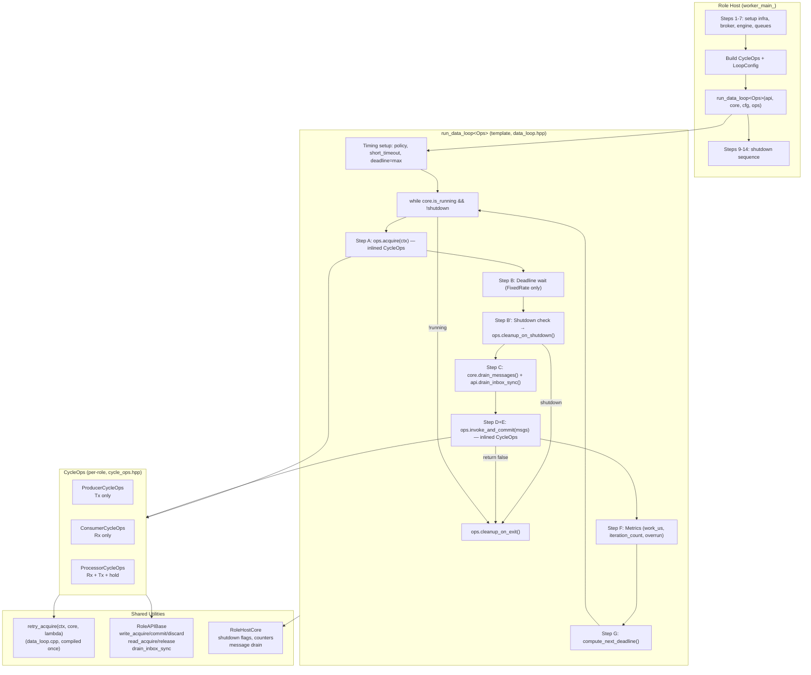
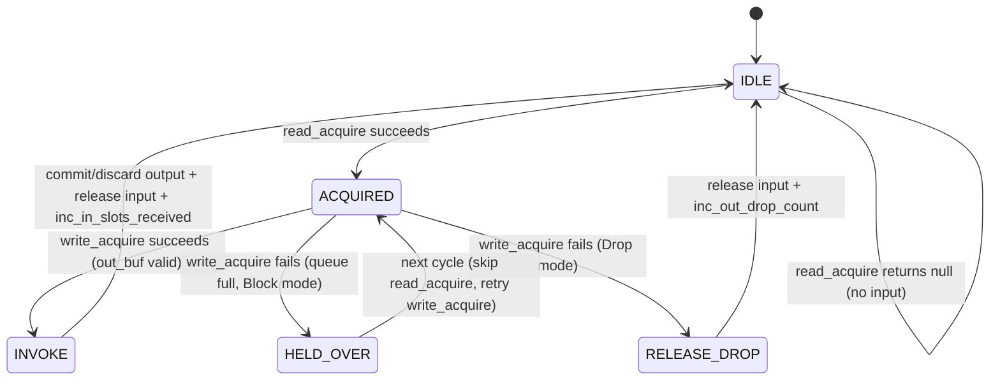

# HEP-CORE-0011: Script Engine Abstraction Framework

| Property           | Value                                                   |
| ------------------ | ------------------------------------------------------- |
| **HEP**            | `HEP-CORE-0011`                                         |
| **Title**          | Script Engine Abstraction Framework                      |
| **Author**         | pylabhub development team                               |
| **Status**         | Implemented (revised 2026-04-04; obsolete-term scrub 2026-04-14) |
| **Created**        | 2026-02-28                                              |
| **Updated**        | 2026-04-14 (Messenger -> BrokerRequestComm; ctrl thread is now in RoleAPIBase per HEP-CORE-0023 §2.5; full §"Threading Model" rewrite deferred until role-host unification lands) |
| **Supersedes**     | `HEP-CORE-0005` (Script Interface Abstraction Framework)|
| **Related**        | `HEP-CORE-0018` (Producer and Consumer Binaries), `HEP-CORE-0023` (Startup Coordination & Role Liveness) |

---

## Abstract

This HEP defines the script engine abstraction layer for pylabhub. The design
separates concerns into three layers:

1. **ScriptEngine** (abstract base) -- owns interpreter lifecycle, type registration,
   and callback invocation. Concrete implementations: PythonEngine, LuaEngine, NativeEngine.
2. **RoleAPIBase** (unified, language-neutral) -- single C++ class exposing all role
   operations (identity, messaging, broker, inbox, spinlocks, metrics, schema sizes).
   ABI-stable via Pimpl. Part of `pylabhub-utils` shared library.
3. **RoleHost** (engine-agnostic) -- owns infrastructure (broker, queues, SHM) and the
   data loop. Creates RoleAPIBase, loads the engine via lifecycle startup, runs callbacks.

The design principle: **the engine knows nothing about infrastructure; the role host
knows nothing about the script language.** RoleAPIBase is the bridge.

---

## Architecture Overview

### Ownership and Dependency

```
RoleHost (ProducerRoleHost / ConsumerRoleHost / ProcessorRoleHost)
  |
  |-- owns --> RoleHostCore (metrics, state, shutdown flags, schema specs)
  |-- owns --> RoleAPIBase (wired to infrastructure after setup)
  |-- owns --> ScriptEngine (PythonEngine / LuaEngine / NativeEngine)
  |-- owns --> Infrastructure (BrokerRequestComm, hub::Producer/Consumer, InboxQueue)
  |
  |-- calls --> engine_lifecycle_startup(EngineModuleParams)
  |               |-- initialize()
  |               |-- load_script()
  |               |-- register_slot_type() x N
  |               |-- build_api(RoleAPIBase)
  |
  |-- calls --> engine->invoke_on_init()
  |-- calls --> engine->invoke_produce / invoke_consume / invoke_process (loop)
  |-- calls --> engine->invoke_on_stop()
  |-- calls --> engine->finalize()
```

### Class Hierarchy

```
ScriptEngine (abstract base -- in pylabhub-utils)
  |-- PythonEngine (CPython + pybind11 -- in pylabhub-scripting)
  |-- LuaEngine    (LuaJIT -- in pylabhub-utils)
  |-- NativeEngine (dlopen C/C++ plugin -- in pylabhub-scripting)

RoleHostCore (engine-agnostic state -- in pylabhub-utils)
  -- metrics counters, shutdown flags, schema specs, inbox cache, shared data

RoleAPIBase (unified role API -- in pylabhub-utils, Pimpl, ABI-stable)
  -- wired to: RoleHostCore, hub::Producer*, hub::Consumer*, BrokerRequestComm*, InboxQueue*
  -- direction-agnostic: role defined by which pointers are set
  -- owns ctrl thread (start_ctrl_thread): heartbeat, broker notifications,
     deregistration sequencing -- see HEP-CORE-0023 §2.5

ProducerRoleHost / ConsumerRoleHost / ProcessorRoleHost
  -- engine-agnostic data loop + infrastructure setup/teardown
  -- each owns one ScriptEngine, one RoleAPIBase, one RoleHostCore
```

### Data Flow Diagram

```
                    Config JSON
                        |
                        v
                  [Schema Resolution]
                        |
         +--------------+--------------+
         |              |              |
    slot specs     fz specs       inbox spec
         |              |              |
         v              v              v
  core.set_*_slot_spec  core.set_*_fz_spec  setup_inbox_facility()
         |              |              |
         v              v              v
 +-------+------+  +---+----+  +------+------+
 | RoleAPIBase   |  | SHM    |  | InboxQueue  |
 | (wired)       |  | Queue  |  | (bind)      |
 +-------+------+  +--------+  +------+------+
         |                             |
         +------> Broker <-------------+
                  (register channel, advertise inbox)
         |
         v
   engine_lifecycle_startup()
         |-- initialize engine
         |-- load script
         |-- register_slot_type (InSlot, OutSlot, InFlex, OutFlex, Inbox)
         |-- assert: engine type_sizeof == core logical size
         |-- build_api(RoleAPIBase)
         |
         v
   invoke_on_init(api)  -->  on_init(api) [script]
         |
         v
   Data Loop:
     acquire slot --> invoke_produce/consume/process(tx/rx, msgs, api) --> commit/release
         |
         v
   invoke_on_stop(api)  -->  on_stop(api) [script]
         |
         v
   finalize() --> teardown_infrastructure()
```

---

## Library Structure

```
pylabhub-utils (shared lib)
  src/include/utils/script_engine.hpp        -- ScriptEngine abstract base
  src/include/utils/role_api_base.hpp        -- RoleAPIBase (Pimpl, ABI-stable)
  src/include/utils/role_host_core.hpp       -- RoleHostCore (metrics, state)
  src/include/utils/schema_types.hpp         -- FieldDef, SchemaSpec (hub:: namespace)
  src/include/utils/schema_utils.hpp         -- parse, resolve, compute_schema_size, align_to_physical_page
  src/include/utils/native_engine_api.h      -- C ABI for native plugins

pylabhub-scripting (static lib, linked by executables that embed script engines)
  src/scripting/python_engine.hpp/.cpp       -- PythonEngine
  src/scripting/lua_engine.hpp/.cpp          -- LuaEngine
  src/scripting/native_engine.hpp/.cpp       -- NativeEngine
  src/scripting/engine_module_params.hpp/.cpp -- EngineModuleParams + lifecycle callbacks
  src/scripting/python_helpers.hpp           -- Python ctypes, slot views, SpinLockPy, InboxHandle
  src/scripting/role_host_helpers.hpp        -- Shared helpers (drain_inbox, wait_for_roles, setup_inbox_facility)
  src/scripting/zmq_poll_loop.hpp            -- ZmqPollLoop + HeartbeatTracker

pylabhub-producer (executable)
  src/producer/producer_role_host.hpp/.cpp   -- ProducerRoleHost (engine-agnostic)
  src/producer/producer_api.hpp/.cpp         -- ProducerAPI (Python wrapper) + pybind11 module

pylabhub-consumer (executable)
  src/consumer/consumer_role_host.hpp/.cpp   -- ConsumerRoleHost
  src/consumer/consumer_api.hpp/.cpp         -- ConsumerAPI (Python wrapper) + pybind11 module

pylabhub-processor (executable)
  src/processor/processor_role_host.hpp/.cpp -- ProcessorRoleHost
  src/processor/processor_api.hpp/.cpp       -- ProcessorAPI (Python wrapper) + pybind11 module
```

---

## Design Decisions

| # | Decision | Rationale |
|---|----------|-----------|
| 1 | ScriptEngine owns lifecycle + invocation; not a generic `call_function` API | Avoids type-erased ScriptValue; each engine uses native types |
| 2 | RoleAPIBase is pure C++ (no pybind11, no Lua) | Single implementation, multiple bindings; ABI-stable in shared lib |
| 3 | Direction-agnostic: role defined by wired pointers, not class hierarchy | No subclasses; Producer sets `set_producer()`, Consumer sets `set_consumer()`, Processor sets both |
| 4 | `ChannelSide::Tx` / `ChannelSide::Rx` for side-specific access | Spinlocks, schema sizes: optional for single-side roles, required for processor |
| 5 | Lifecycle startup via `engine_lifecycle_startup()` | One function replaces 150+ lines of manual engine init per role host |
| 6 | Inbox packing from schema, not transport config | Inbox is an independent communication path; packing is in `SchemaSpec.packing` |
| 7 | Flexzone physical size = `align_to_physical_page(logical_size)` | Single function for 4KB page alignment; assert validates in lifecycle startup |
| 8 | Engine type_sizeof cross-validated against compute_schema_size | Hard error if engine-built struct doesn't match infrastructure layout |
| 9 | Python wrappers (ProducerAPI/ConsumerAPI/ProcessorAPI) stay as translation layer | py::bytes, py::dict, GIL release, InboxHandle -- language-specific, cannot be in RoleAPIBase |

---

## ScriptEngine Interface

### State Machine

```
Unloaded --> Initialized --> ScriptLoaded --> ApiBuilt --> Finalized
                                                  ^
                                                  |
                                            accepting_ = true
```

`finalize()` is idempotent. `accepting_` gates non-owner thread invocations.

### Key Methods

| Method | Thread | Purpose |
|--------|--------|---------|
| `initialize(tag, core)` | worker | Create interpreter/state |
| `load_script(dir, entry, callback)` | worker | Load script file, validate required callback |
| `register_slot_type(spec, name, packing)` | worker | Build language-native type (ctypes/FFI/sizeof) |
| `build_api(RoleAPIBase&)` | worker | Create language-specific bindings, set accepting=true |
| `invoke_on_init()` | worker | Call script's `on_init(api)` |
| `invoke_produce(tx, msgs)` | worker | Call `on_produce(tx, msgs, api)` -- hot path |
| `invoke_consume(rx, msgs)` | worker | Call `on_consume(rx, msgs, api)` -- hot path |
| `invoke_process(rx, tx, msgs)` | worker | Call `on_process(rx, tx, msgs, api)` -- hot path |
| `invoke_on_inbox(msg)` | worker | Call `on_inbox(msg, api)` |
| `invoke_on_stop()` | worker | Call `on_stop(api)` |
| `invoke(name, args)` | any | Generic invocation (e.g., admin shell) |
| `eval(code)` | any | Evaluate code string (admin shell) |
| `finalize()` | worker | Destroy interpreter, release resources |

---

## RoleAPIBase Interface

### Python Script API

```python
# Identity
api.uid()                    # Role UID
api.name()                   # Role display name
api.channel()                # Primary channel name
api.log_level()              # Configured log level
api.script_dir()             # Script directory path
api.role_dir()               # Role base directory

# Control
api.log(level, msg)          # Log a message
api.stop()                   # Request graceful shutdown
api.set_critical_error()     # Flag critical error
api.critical_error()         # Check critical error flag
api.stop_reason()            # Shutdown reason string

# Band messaging (HEP-CORE-0030)
api.band_join(band)          # Join a band, returns member list
api.band_leave(band)         # Leave a band
api.band_broadcast(band, body)  # Broadcast JSON body to all band members
api.band_members(band)       # List band members ({role_uid, role_name})

# Inbox (P2P messaging, HEP-CORE-0027)
api.open_inbox(target_uid)   # Open InboxHandle to target role
api.send_to(role_uid, data)  # Send data to specific role via inbox
api.wait_for_role(uid, ms)   # Block until role appears in broker

# Broker queries
api.list_channels()
api.shm_info(channel="")

# Diagnostics
api.script_error_count()
api.loop_overrun_count()
api.last_cycle_work_us()
api.ctrl_queue_dropped()
api.metrics()                # Full hierarchical metrics dict

# Schema sizes (logical = C struct size, no page alignment)
api.slot_logical_size(side=None)      # side=api.Tx or api.Rx
api.flexzone_logical_size(side=None)  # side optional for single-side roles
api.flexzone_size()                   # Physical (page-aligned) flexzone allocation

# Spinlocks (SHM-only)
api.spinlock(index, side=None)        # Returns SpinLock context manager
api.spinlock_count(side=None)         # Number of spinlocks (8 = MAX_SHARED_SPINLOCKS)
api.Tx                                # ChannelSide constant (output/producer side)
api.Rx                                # ChannelSide constant (input/consumer side)

# Numpy views
api.as_numpy(ctypes_array)            # Convert ctypes array field to numpy view

# Custom metrics
api.report_metric(key, value)
api.report_metrics({key: value, ...})
api.clear_custom_metrics()

# Queue state
api.out_capacity()           # Output queue capacity (slots)
api.out_policy()             # Output overflow policy
api.in_capacity()            # Input queue capacity
api.in_policy()              # Input overflow policy
api.last_seq()               # Last consumed sequence number
api.set_verify_checksum(enable)
api.update_flexzone_checksum()
```

### ChannelSide Parameter

For single-side roles (producer = Tx only, consumer = Rx only), the `side`
parameter is optional and auto-selects. For processor (both sides), `side`
is required -- omitting it raises an error.

```python
# Producer script
lock = api.spinlock(0)                # OK: auto-selects Tx
lock = api.spinlock(0, side=api.Tx)   # OK: explicit
sz = api.slot_logical_size()          # OK: auto-selects Tx

# Processor script
lock = api.spinlock(0, side=api.Rx)   # OK: input SHM
lock = api.spinlock(0, side=api.Tx)   # OK: output SHM
lock = api.spinlock(0)                # ERROR: side required
```

---

## Schema and Size Model

### Canonical type names (closed set)

The engine exposes **five canonical frame names** to scripts and role
hosts — the complete list of type-registration slots.  There is no
user-extensible type namespace; these correspond to the library's
fixed role-frame contract.

| Name           | Direction | Writability | Registered by |
|----------------|-----------|-------------|---------------|
| `InSlotFrame`  | input slot       | read-only    | Consumer, Processor |
| `OutSlotFrame` | output slot      | writable     | Producer, Processor |
| `InFlexFrame`  | input flexzone   | mutable      | Consumer, Processor (when fz configured) |
| `OutFlexFrame` | output flexzone  | mutable      | Producer, Processor (when fz configured) |
| `InboxFrame`   | inbox payload    | read-only    | Producer, Consumer, Processor (when inbox configured) |

Producer/Consumer also get auto-generated aliases at `build_api()`:
- Producer: `SlotFrame` → alias of `OutSlotFrame`; `FlexFrame` →
  alias of `OutFlexFrame` (when present).
- Consumer: `SlotFrame` → alias of `InSlotFrame`; `FlexFrame` →
  alias of `InFlexFrame` (when present).
- Processor: **no** bare aliases (both directions are explicit —
  `SlotFrame` would be ambiguous).

**`register_slot_type()` contract (enforced by both engines)**:
- `type_name` MUST be one of the five canonical names above.
- Any other name is rejected: return `false` + `LOGGER_ERROR`,
  listing the five valid names.  No silent acceptance, no silent
  "type built but not cached" fallthrough.
- Re-registration under the SAME canonical name is allowed — it
  overwrites the previously cached type.  Primarily a test-side
  convenience (verifying different packings on the same slot);
  production role hosts register each canonical name at most once.

This closed-set design is intentional: frames are role-contract
identities, not a user-extension point.  Adding a new frame
category is coordinated library work touching
role host + schema + engine dispatchers.  The canonical-name
rejection at `register_slot_type` ensures a typo or schema-config
misuse fails immediately at the registration site rather than
surfacing later as a `type_sizeof(name) == 0` silent corruption
(e.g., role host allocating wrong-sized buffers).

### Two size concepts

| Concept | What it means | How computed | Where stored |
|---------|---------------|--------------|--------------|
| **Logical size** | C struct size with internal padding (aligned or packed) | `compute_schema_size(spec, packing)` | `RoleHostCore::*_slot_logical_size_` |
| **Physical size** | Page-aligned allocation size (4KB boundary) | `align_to_physical_page(logical_size)` | `RoleHostCore::*_schema_fz_size_` (flexzone only) |

- Slots: logical size = effective size (64-byte cache-line alignment handled by DataBlock)
- Flexzone: logical size != physical size (page alignment for SHM allocation)
- ZMQ/Inbox: logical size = wire buffer size (no extra alignment)

### Cross-validation (defense in depth)

`register_slot_type()` **internally** validates the engine's
language-native struct size against `compute_schema_size(spec,
packing)` before caching the type.  A silent packing-ignore bug
(e.g., the engine always building aligned regardless of the
`packing` argument) is caught there: the built size mismatches
the schema-computed size, and `register_slot_type` returns false.

On top of this, `engine_lifecycle_startup()` re-validates after all
`register_slot_type()` calls have completed (defense in depth):

```
assert engine.type_sizeof("OutSlotFrame") == core.out_slot_logical_size()
assert engine.type_sizeof("InSlotFrame")  == core.in_slot_logical_size()
assert engine.type_sizeof("OutFlexFrame") == compute_schema_size(out_fz_spec, packing)
assert engine.type_sizeof("InFlexFrame")  == compute_schema_size(in_fz_spec, packing)
```

Engine-internal validation is the primary guard.  The lifecycle-level
assert is a backup that fires if someone bypassed the registration
API (hypothetically injecting a type through a private path).

### Engine-specific `type_sizeof` storage

All three engines enforce the same canonical-name contract at the
API surface; internal storage layouts differ and reflect what each
engine actually needs to track:

- **Lua** (LuaJIT FFI): types live in LuaJIT's global FFI cdef
  registry, keyed by name.  `ffi.sizeof(name)` reads the registry.
  In addition, the engine caches typed `ffi.typeof()` handles in
  role-specific ref slots (`ref_in_slot_readonly_`,
  `ref_out_slot_writable_`, `ref_in_fz_`, `ref_out_fz_`,
  `ref_inbox_readonly_`) because the hot path (slot-view
  construction) needs the exact ctype including its readonly
  flavor.  Re-registering the same cdef name with a different
  layout fails (LuaJIT cdefs are immutable per name); use a
  different canonical name to test both packings for the same
  schema.

- **Python** (ctypes): types are stored in explicit `py::object`
  fields of `PythonEngine` (`in_slot_type_ro_`, `out_slot_type_`,
  `in_fz_type_`, `out_fz_type_`, `inbox_type_ro_`).  The inbound
  and inbox variants are wrapped by `wrap_as_readonly_ctypes` —
  the stored object carries the readonly flavor.  Re-registration
  under the same canonical name is a simple field overwrite (old
  type garbage-collected).  `type_sizeof` dispatches on the
  canonical name to the matching field.

- **Native** (C/C++ plugins): the engine stores only **sizes** in a
  single `std::unordered_map<std::string, size_t> type_sizes_`.
  This is the natural shape for native — the actual C/C++ struct
  definitions live in the plugin itself (resolved via
  `native_sizeof_<NAME>` / `native_schema_<NAME>` dynamic-library
  exports), so the engine doesn't need to cache typed handles.
  `type_sizeof` is a single map lookup.  The map also leaves
  headroom for future protocol extensions that might introduce
  additional canonical names — adding one is a one-line change to
  the canonical-name validator, no storage refactor.

The per-engine storage is implementation choice matching each
engine's semantic needs; it is NOT a difference in the API contract.
All three engines reject non-canonical names identically.

### Packing

| Context | Source of packing | Notes |
|---------|-------------------|-------|
| Data channel (slot/flexzone) | `TransportConfig.zmq_packing` | Role-level config |
| Inbox | `inbox_spec.packing` (from schema JSON) | Defaults to "aligned"; independent of data channel |
| Broker discovery | Advertised via REG_REQ/CONSUMER_REG_REQ | Sender gets packing from ROLE_INFO_ACK |

---

## Initialization Protocol

### Role Host `worker_main_()` Steps

```
Step 1: Resolve schemas from config
  - out_slot_spec_, in_slot_spec_ from role-specific JSON
  - out_fz_local, in_fz_local from flexzone JSON
  - inbox_spec_local from inbox JSON
  - Compute and store on core:
    core.set_out_slot_spec(spec, compute_schema_size(spec, packing))
    core.set_out_fz_spec(spec, align_to_physical_page(compute_schema_size(spec, packing)))

Step 2: Setup infrastructure (no engine dependency)
  - Create hub::Producer / hub::Consumer (SHM + ZMQ queues)
  - Setup inbox via setup_inbox_facility() (shared helper)

Step 3: Create RoleAPIBase and wire infrastructure
  - api_ = make_unique<RoleAPIBase>(core_)
  - api_->set_producer(out_producer_), set_consumer(in_consumer_)
  - api_->set_broker_comm(&brc_), set_inbox_queue(inbox_queue_)
  - api_->set_uid(), set_name(), set_channel(), etc.
  - (Broker REG_REQ + heartbeat are handled inside start_ctrl_thread; see Step 6.)

Step 4: Load engine via engine_lifecycle_startup()
  - Assembles EngineModuleParams (schemas, packing, script_dir, entry_point)
  - engine_lifecycle_startup() does:
    1. engine->initialize(tag, core)
    2. engine->load_script(dir, entry, required_callback)
    3. engine->register_slot_type() for each direction (InSlot, OutSlot, InFlex, OutFlex, Inbox)
    4. Assert flexzone specs page-aligned
    5. engine->build_api(RoleAPIBase)
    6. Assert engine type sizes == schema logical sizes

Step 5: invoke_on_init()
Step 6: api_->start_ctrl_thread(CtrlThreadConfig)
        — connects BrokerRequestComm to broker
        — sends REG_REQ / CONSUMER_REG_REQ from the ctrl thread
        — periodic heartbeat (default 500ms = 2 Hz, see HEP-CORE-0023 §2.5)
        — dispatches unsolicited broker notifications (CHANNEL_CLOSING_NOTIFY,
          FORCE_SHUTDOWN, CHANNEL_ERROR_NOTIFY) onto the message queue
        — signal ready
Step 7: Run data loop (invoke_produce / invoke_consume / invoke_process)
Step 8: stop_accepting() + deregister_from_broker()
Step 9: invoke_on_stop()           (ctrl thread still alive for final I/O)
Step 10: engine->finalize()
Step 11: broker_comm->stop() + set_running(false)   (signal ctrl to exit — non-destructive)
Step 12: teardown_infrastructure()   (disconnect broker, close queues/inbox)
Step 13: thread_manager().drain()    (last — join ctrl + all threads; immediate since signaled)
```

---

## Configuration Schema

### Producer (`producer.json`)
```json
{
  "identity": {"uid": "PROD-001", "name": "my-producer"},
  "script": {"type": "python", "path": "."},
  "out_channel": "sensor-data",
  "out_slot_schema": {
    "fields": [
      {"name": "timestamp", "type": "float64"},
      {"name": "values",    "type": "float32", "count": 4}
    ],
    "packing": "aligned"
  },
  "out_flexzone_schema": {
    "fields": [{"name": "label", "type": "string", "length": 64}]
  },
  "inbox_schema": {
    "fields": [{"name": "command", "type": "uint32"}]
  }
}
```

### Consumer (`consumer.json`)
```json
{
  "identity": {"uid": "CONS-001", "name": "my-consumer"},
  "script": {"type": "lua", "path": "."},
  "in_channel": "sensor-data",
  "in_slot_schema": {
    "fields": [
      {"name": "timestamp", "type": "float64"},
      {"name": "values",    "type": "float32", "count": 4}
    ]
  }
}
```

### Processor (`processor.json`)
```json
{
  "identity": {"uid": "PROC-001", "name": "my-processor"},
  "script": {"type": "python", "path": "."},
  "in_channel": "raw-data",
  "out_channel": "processed-data",
  "in_slot_schema": {"fields": [{"name": "raw", "type": "float64"}]},
  "out_slot_schema": {"fields": [{"name": "result", "type": "float64"}]}
}
```

### Script path resolution

`<script.path>/script/<script.type>/__init__.py` (Python) or `<script.path>/script/<script.type>/init.lua` (Lua).

With `"path": "."` and `"type": "python"` --> `./script/python/__init__.py`.

---

## Script Callback Contract

### Python

```python
def on_init(api):
    """Called once after engine + infrastructure ready. Optional."""
    pass

def on_produce(tx, msgs, api):
    """Called per slot acquisition. tx.slot = writable ctypes struct.
    Return True (commit), False (discard), or raise (error)."""
    tx.slot.timestamp = time.time()
    return True

def on_consume(rx, msgs, api):
    """Called per slot read. rx.slot = read-only ctypes struct.
    Return True (release), False (skip), or raise (error)."""
    print(rx.slot.timestamp)
    return True

def on_process(rx, tx, msgs, api):
    """Called per dual slot acquisition. Read rx, write tx.
    Return True (commit both), False (discard output), or raise."""
    tx.slot.result = rx.slot.raw * 2.0
    return True

def on_inbox(msg, api):
    """Called per inbox message. msg.data = ctypes struct, msg.sender_uid, msg.seq."""
    pass

def on_stop(api):
    """Called once before shutdown. Optional."""
    pass
```

### Lua

```lua
function on_init(api)
    api.log("info", "started: " .. api.uid())
end

function on_produce(tx, msgs, api)
    local slot = tx.slot
    slot.timestamp = os.clock()
    return true
end

function on_consume(rx, msgs, api)
    local slot = rx.slot
    api.log("info", "received: " .. tostring(slot.timestamp))
    return true
end

function on_stop(api)
    api.log("info", "stopping")
end
```

---

## Thread Safety

| Scenario | Python | Lua | Native |
|----------|--------|-----|--------|
| Interpreter ownership | Worker thread (GIL-based) | Worker thread (single lua_State) | Worker thread (dlopen handle) |
| Callbacks (on_init, on_produce, ...) | GIL held on worker thread | Direct call on worker thread | Function pointer call on worker thread |
| Generic invoke/eval (admin shell) | Queued, processed on worker thread | Queued, processed on worker thread | Queued, processed on worker thread |
| Non-owner thread guard | `accepting_` flag + queue | `accepting_` flag + queue | `accepting_` flag + queue |
| Inbox drain | Before each data callback | Before each data callback | Before each data callback |
| Broker control events | Ctrl thread owned by RoleAPIBase, GIL not held | Ctrl thread owned by RoleAPIBase | Ctrl thread owned by RoleAPIBase |

---

## ThreadManager

> See **HEP-CORE-0031** for the full specification. ThreadManager is a Layer 2
> service utility — role hosts use it but it's not specific to the script
> framework.

Role hosts access it via `api_->thread_manager()`. All role-scope threads
(worker, ctrl, future) live under one ThreadManager instance per role.

---

## Unified Data Loop Architecture

> Rewritten 2026-04-16 to reflect template-based CycleOps design.
> All entities verified against `service/cycle_ops.hpp`, `service/data_loop.hpp`,
> `role_api_base.hpp`.

### Design Rationale

The data loop uses **templates instead of virtual dispatch** for the
role-specific operations. Three concrete `CycleOps` classes (Producer,
Consumer, Processor) are duck-typed into the `run_data_loop<Ops>` template.
The compiler inlines all CycleOps calls into the loop body, eliminating
vtable indirection and enabling cross-boundary optimization.

Why keep three separate CycleOps instead of unifying into one:
- Each role's acquire/commit logic is structurally distinct (not just
  parameterized — processor has input-hold state machine)
- Separate classes are easier to reason about and extend independently
- Future roles can add their own CycleOps without touching existing ones
- The template approach gets full inlining benefit regardless

All loop internals are **internal to the library** — not exposed in
the public `role_api_base.hpp` header. The public API is the role-facing
surface (identity, data-plane verbs, messaging, diagnostics). Tests include
internal headers directly as internal consumers.

### File Layout

| File | Scope | Contents |
|------|-------|----------|
| `src/utils/service/data_loop.hpp` | Internal | `AcquireContext`, `retry_acquire` decl, `LoopConfig`, `run_data_loop<Ops>` template definition |
| `src/utils/service/data_loop.cpp` | Internal | `retry_acquire` implementation (compiled once) |
| `src/utils/service/cycle_ops.hpp` | Internal | `ProducerCycleOps`, `ConsumerCycleOps`, `ProcessorCycleOps` — plain concrete classes, no virtual base |
| `src/include/utils/role_api_base.hpp` | Public | `RoleAPIBase` — no loop internals exposed |

### CycleOps Duck-Typed Interface

Each CycleOps class provides these four methods (no virtual base — the
`run_data_loop` template uses duck typing):

```
acquire(AcquireContext) → bool       // Step A: acquire queue slot(s)
cleanup_on_shutdown()                // Step B': release on shutdown break
invoke_and_commit(msgs) → bool      // Step D+E: engine callback + commit/release
cleanup_on_exit()                    // post-loop: release held state
```

Three concrete implementations:

| Class | Sides | Key behavior |
|-------|-------|-------------|
| `ProducerCycleOps` | Tx only | write_acquire → memset → invoke_produce → commit/discard |
| `ConsumerCycleOps` | Rx only | read_acquire → invoke_consume → read_release; error detection via count delta |
| `ProcessorCycleOps` | Rx + Tx | Input hold-across-cycles in Block mode; two-phase acquire with policy-dependent timeout |

### AcquireContext

Bundles timing state for one cycle, computed by the loop frame and
passed to `CycleOps::acquire()`:

```cpp
struct AcquireContext {
    std::chrono::milliseconds              short_timeout;     // per-attempt queue I/O budget
    std::chrono::microseconds              short_timeout_us;  // same, for deadline comparison
    std::chrono::steady_clock::time_point  deadline;          // this cycle's target completion
    bool                                   is_max_rate;       // single attempt, no retry
};
```

### retry_acquire

Shared inner retry utility (`data_loop.cpp`). Calls `try_once(short_timeout)`
in a loop until:
- `try_once` returns non-null (success)
- `is_max_rate` (single attempt only)
- `core` signals shutdown or process exit
- Remaining time until deadline < `short_timeout_us`

First cycle (`deadline == time_point::max()`): retries indefinitely until
success or shutdown.

Not a template — the retry logic is identical for all queue operations.
The `std::function` lambda captures the specific queue verb. This function
does not benefit from inlining (the queue acquire inside the lambda is
the bottleneck, not the retry decision).

### LoopConfig

```cpp
struct LoopConfig {
    double           period_us{0};
    LoopTimingPolicy loop_timing{LoopTimingPolicy::MaxRate};
    double           queue_io_wait_timeout_ratio{0.1};
};
```

Constructed by the role host from `config_.timing()` — single-truth path
(see HEP-0008 §11.1).

### run_data_loop Flow Diagram



### run_data_loop Pseudocode Reference

```
═══════════════════════════════════════════════════════════════
ROLE HOST (producer_role_host.cpp / consumer / processor)
═══════════════════════════════════════════════════════════════

worker_main_():
    // Steps 1-7: setup infrastructure, broker, engine, queues...
    // ... (see §14-Step Lifecycle below)

    // Step 8: build CycleOps + LoopConfig, enter data loop
    ProducerCycleOps ops(*api_, *engine_, core_, stop_on_error)
    LoopConfig lcfg { .period_us, .loop_timing, .queue_io_wait_timeout_ratio }

    run_data_loop(*api_, core_, lcfg, ops)   ← template free function
    //            ^^^^   ^^^^   ^^^^  ^^^
    //            │      │      │     └─ duck-typed CycleOps (inlined)
    //            │      │      └─ timing config (value struct)
    //            │      └─ metrics, shutdown flags, message drain
    //            └─ queue verbs, inbox drain, identity

    // Steps 9+: shutdown sequence...


═══════════════════════════════════════════════════════════════
run_data_loop<Ops>(api, core, cfg, ops)     [data_loop.hpp]
═══════════════════════════════════════════════════════════════

    // Timing setup (once)
    policy        = cfg.loop_timing        // MaxRate | FixedRate | FixedRateWithCompensation
    period_us     = cfg.period_us
    is_max_rate   = (policy == MaxRate)
    short_timeout = compute_short_timeout(period_us, ratio)
    deadline      = time_point::max()      // first cycle: no deadline

    // ── OUTER LOOP ─────────────────────────────────────────
    while (core.is_running() && !shutdown && !critical_error):

        cycle_start = now()

        // Step A: ACQUIRE (role-specific, inlined)
        ctx = AcquireContext { short_timeout, deadline, is_max_rate }
        has_data = ops.acquire(ctx)
        //         └──── dispatches to one of:
        //   Producer:  buf_  = retry_acquire(... write_acquire ...)
        //   Consumer:  data_ = retry_acquire(... read_acquire ...)
        //   Processor: held_input_ = retry_acquire(... read_acquire ...)
        //              out_buf_    = write_acquire(policy-dependent timeout)

        // Step B: DEADLINE WAIT
        if (!is_max_rate && has_data && past_first_cycle && now() < deadline):
            sleep_until(deadline)

        // Step B': SHUTDOWN CHECK after potential sleep
        if (shutdown):
            ops.cleanup_on_shutdown()   // release/discard any held slots
            break

        // Step C: DRAIN MESSAGES + INBOX
        msgs = core.drain_messages()    // ctrl-thread notifications
        api.drain_inbox_sync()          // recv_one → invoke_on_inbox, repeat

        // Step D+E: INVOKE + COMMIT (role-specific, inlined)
        if (!ops.invoke_and_commit(msgs)):
            break   // stop_on_script_error fired
        //
        //   Producer:
        //       memset(buf_); result = engine.invoke_produce(InvokeTx{...})
        //       Commit → write_commit + inc_out_slots_written
        //       else   → write_discard + inc_out_drop_count
        //
        //   Consumer:
        //       inc_in_slots_received; engine.invoke_consume(InvokeRx{...})
        //       read_release; check error count delta for stop
        //
        //   Processor:
        //       memset(out_buf_); result = engine.invoke_process(rx, tx)
        //       OUTPUT: commit/discard/drop (same as producer)
        //       INPUT:  held && (out_buf_ || drop_mode) → release
        //               held && block_mode && !out_buf_ → HOLD across cycles
        //               !held → no action

        // Step F: METRICS
        work_us = now() - cycle_start
        core.set_last_cycle_work_us(work_us)
        core.inc_iteration_count()
        if (past_first_cycle && now() > deadline): core.inc_loop_overrun()

        // Step G: NEXT DEADLINE
        deadline = compute_next_deadline(policy, deadline, cycle_start, period_us)

    // ── POST-LOOP ──────────────────────────────────────────
    ops.cleanup_on_exit()
    //   Producer/Consumer: no-op
    //   Processor: if (held_input_) read_release   // release late-held input


═══════════════════════════════════════════════════════════════
KEY DATA STRUCTURES
═══════════════════════════════════════════════════════════════

AcquireContext          per-cycle timing state, computed by loop frame
LoopConfig              from role config, immutable for loop lifetime
InvokeTx                { void *slot, size_t slot_size }  — output to engine
InvokeRx                { const void *slot, size_t slot_size } — input to engine
RoleAPIBase             queue verbs, inbox drain, identity, metrics snapshot
RoleHostCore            shutdown flags, metric counters, message queue
ScriptEngine            invoke_produce/consume/process — calls user script
                        (runtime-polymorphic: Python/Lua/Native)
retry_acquire           inner retry loop — compiled once, not inlined
```

### Processor Input-Hold State Machine

The processor's input-hold behavior is the most subtle part of the loop.
In Block overflow mode, when the output queue is full, the input slot is
preserved across cycles until the output queue has space.



In Drop mode, `write_acquire(0ms)` never blocks — if output is full, the
input is released immediately with `inc_out_drop_count`.

### 14-Step Lifecycle Sequence (verified 2026-04-16)

```
Step 1:  Resolve schemas from config
Step 2:  Setup infrastructure (queues, inbox, broker comm)
Step 3:  Wire RoleAPIBase (name, channels, engine, queues)
Step 4:  Engine lifecycle startup (init → load → schema → build_api)
Step 5:  invoke_on_init()
Step 6:  Connect broker, start ctrl thread, register
Step 6b: Startup coordination (wait_for_roles)
Step 7:  Signal ready
Step 8:  Run data loop (run_data_loop<CycleOps> + LoopConfig)
Step 9:  stop_accepting()
Step 9a: deregister_from_broker()
Step 10: invoke_on_stop()        ← ctrl thread alive for final I/O
Step 11: engine->finalize()
Step 12: broker_comm->stop() + set_running(false)
Step 13: teardown_infrastructure()
Step 14: thread_manager().drain() ← last; all threads exit
```

---

## Metrics Model

`api.metrics()` returns a hierarchical dict/table:

```json
{
  "queue": {                    // "in_queue"/"out_queue" for processor
    "seq": 1234,
    "checksum_error_count": 0,
    ...                         // 12 fields from ContextMetrics X-macros
  },
  "loop": {
    "iteration_count": 5678,
    "loop_overrun_count": 0,
    "last_cycle_work_us": 42,
    "configured_period_us": 1000
  },
  "role": {
    "out_slots_written": 5678,   // present when has_producer
    "in_slots_received": 5678,   // present when has_consumer
    "out_drop_count": 0,
    "script_error_count": 0,
    "ctrl_queue_dropped": 0     // nested {input, output} for processor
  },
  "inbox": { ... },             // present when inbox configured
  "custom": { ... }             // present when custom metrics reported
}
```

---

## Shared Script State

Scripts need persistent state across callbacks (`on_init` -> `on_produce` -> `on_stop`).
RoleHostCore provides a thread-safe C++ store (`std::unordered_map<string, StateValue>`
with `std::shared_mutex`). Each engine can use this mechanism or provide a
language-native alternative.

| Engine | Mechanism | API | Thread safety |
|--------|-----------|-----|---------------|
| Python | `py::dict` on wrapper object | `api.shared_data["key"] = value` | Single-threaded (GIL) |
| Lua | RoleHostCore C++ map | `api.set_shared_data(key, val)` / `api.get_shared_data(key)` | `shared_mutex` (multi-state safe) |
| Native | Direct C++ access | `RoleHostCore::set_shared_data()` or plugin-managed state | Caller's responsibility |

**Design rationale**: Python's native dict is simpler and more natural for Python users.
Lua's multi-state model requires thread-safe shared storage, which RoleHostCore provides.
The two stores are independent -- a Python script's `api.shared_data` and a Lua script's
`api.get_shared_data()` are not synchronized and do not share content. This is by design:
each engine manages state in the way that's idiomatic for its language.

The `StateValue` type is `std::variant<int64_t, double, bool, std::string>` -- covers
the common scalar types. Python scripts that need richer types (dicts, lists, objects)
use the native `py::dict` directly.

---

## Implementation Status

| # | Component | Status | Date |
|---|-----------|--------|------|
| 1 | ScriptEngine abstract base | Done | 2026-03-16 |
| 2 | PythonEngine | Done | 2026-03-16 |
| 3 | LuaEngine | Done | 2026-03-16 |
| 4 | NativeEngine | Done | 2026-03-30 |
| 5 | RoleAPIBase (Pimpl, ABI-stable) | Done | 2026-04-03 |
| 6 | RoleContext elimination | Done | 2026-04-03 |
| 7 | ProducerAPI/ConsumerAPI/ProcessorAPI (Python wrappers) | Done | 2026-04-03 |
| 8 | Lifecycle integration (engine_lifecycle_startup) | Done | 2026-04-04 |
| 9 | ChannelSide enum (spinlock side parameter) | Done | 2026-04-04 |
| 10 | Schema logical size API (slot_logical_size, flexzone_logical_size) | Done | 2026-04-04 |
| 11 | align_to_physical_page utility | Done | 2026-04-04 |
| 12 | Inbox packing from schema (setup_inbox_facility) | Done | 2026-04-04 |
| 13 | Cross-validation: engine type_sizeof == schema logical size | Done | 2026-04-04 |
| 14 | Schema size tests (complex schemas, aligned/packed/arrays) | Done | 2026-04-04 |
| 15 | Multi-process spinlock test through RoleAPIBase | Done | 2026-04-04 |

---

## Design History

This HEP consolidates the following tech drafts (archived 2026-04-05):

| Document | Scope | Archive |
|----------|-------|---------|
| `role_api_base_design.md` | Unified RoleAPIBase, 6-phase plan | `docs/archive/transient-2026-04-05/` |
| `role_context_simplification.md` | RoleContext elimination | `docs/archive/transient-2026-04-05/` |
| `script_engine_lifecycle_module.md` | Engine lifecycle startup/shutdown | `docs/archive/transient-2026-04-05/` |
| `lifecycle_dynamic_module_extensions.md` | ModuleDef userdata support | `docs/archive/transient-2026-04-05/` |
| `script_engine_refactor.md` | Original ScriptEngine abstraction (superseded) | `docs/archive/transient-2026-04-05/` |

---

## Copyright

This document is placed in the public domain or under the CC0-1.0-Universal license,
whichever is more permissive.
