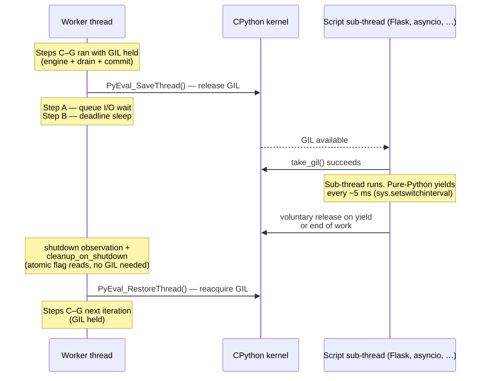
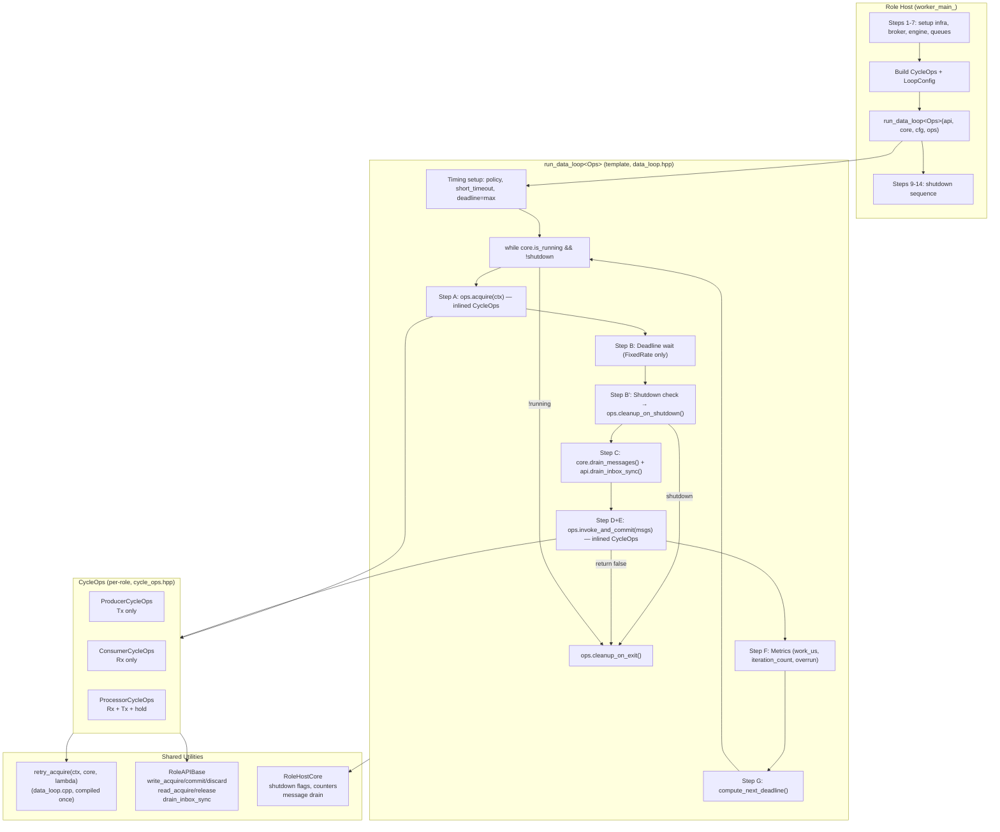
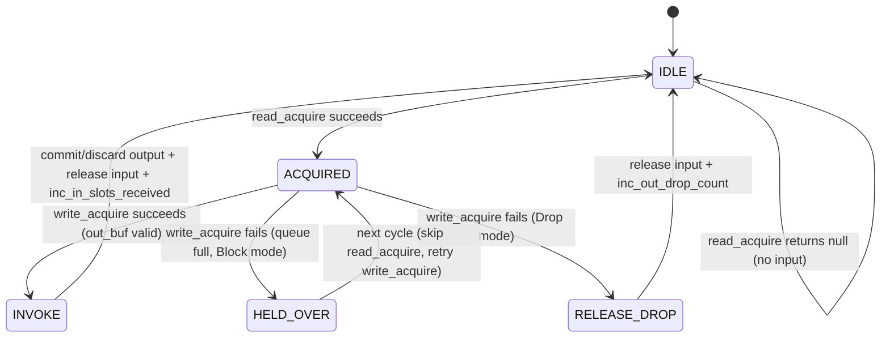

# HEP-CORE-0011: Script Engine Abstraction Framework

| Property           | Value                                                   |
| ------------------ | ------------------------------------------------------- |
| **HEP**            | `HEP-CORE-0011`                                         |
| **Title**          | Script Engine Abstraction Framework                      |
| **Author**         | pylabhub development team                               |
| **Status**         | Implemented (revised 2026-04-04; obsolete-term scrub 2026-04-14; engine-construction-on-worker + `PythonInterpreter` lifecycle module added 2026-05-07) |
| **Created**        | 2026-02-28                                              |
| **Updated**        | 2026-05-07: §"Engine Construction Lifecycle" (NEW) ratifies that script engines are constructed on the worker thread, not on `main()`. `PythonInterpreter` becomes a dynamic lifecycle module (`pylabhub::scripting::PythonInterpreter`) loaded lazily on first `PythonEngine` ctor, fixing the pybind11 `inc_ref()`-without-GIL violation that fired during process startup when class-level `py::object{py::none()}` defaults ran on `main` before the interpreter existed. `HostFactory` signature changes: drops the `unique_ptr<ScriptEngine>` parameter; the host's `worker_main_` constructs the engine via `make_engine_from_script_config`. — 2026-05-06 (post-HEP-0024 alignment: role-host unification has shipped; `hub::Producer`/`hub::Consumer` references scrubbed — those classes were eliminated in L3.γ A6.3 (2026-03-01) and the data plane is now reached via `RoleAPIBase`'s internally-owned Tx/Rx queue handles; threading-model deferral note retired since unification has landed); 2026-04-14 (Messenger -> BrokerRequestComm; ctrl thread is now in RoleAPIBase per HEP-CORE-0023 §2.5) |
| **Supersedes**     | `HEP-CORE-0005` (Script Interface Abstraction Framework)|
| **Related**        | `HEP-CORE-0024` (Role Directory Service — `plh_role` unified binary; supersedes the per-role binaries originally in HEP-CORE-0018), `HEP-CORE-0023` (Startup Coordination & Role Liveness), `HEP-CORE-0019` §2.3 (per-presence heartbeat protocol — Phase 6) |

---

## Abstract

This HEP defines the script engine abstraction layer for pylabhub. The design
separates concerns into three layers:

1. **ScriptEngine** (abstract base) -- owns interpreter lifecycle, type registration,
   and callback invocation. Concrete implementations: PythonEngine, LuaEngine, NativeEngine.
2. **RoleAPIBase** (unified, language-neutral) -- single C++ class exposing all role
   operations (identity, messaging, broker, inbox, spinlocks, metrics, schema sizes).
   ABI-stable via Pimpl. Part of `pylabhub-utils` shared library.
3. **RoleHost** (engine-agnostic) -- a class hierarchy: `EngineHost<RoleAPIBase>`
   (aliased `RoleHostBase`) is the template base that owns shared scaffolding
   (RoleHostCore, ScriptEngine, RoleAPIBase, ready-promise, phase FSM, worker
   thread spawn).  The concrete derived classes (ProducerRoleHost,
   ConsumerRoleHost, ProcessorRoleHost) own the role-specific infrastructure
   (BrokerRequestComm, InboxQueue, resolved schema specs) and implement
   `worker_main_()` — the data loop and the setup/teardown of role-specific
   queues.  The data plane (Tx/Rx queues, SHM/ZMQ underneath) is owned by
   RoleAPIBase via `build_tx_queue` / `build_rx_queue`.

The design principle: **the engine knows nothing about infrastructure; the role host
knows nothing about the script language.** RoleAPIBase is the bridge.

---

## Architecture Overview

### Ownership and Dependency

```
RoleHostBase (= EngineHost<RoleAPIBase>)
  |   (template base; owns shared role state)
  |
  |-- owns --> RoleConfig          (passed in at construction; held until worker_main_)
  |-- owns --> RoleHostCore        (metrics, state, shutdown flags, schema specs)
  |-- owns --> ScriptEngine        (PythonEngine / LuaEngine / NativeEngine —
  |                                  constructed in worker_main_ Step 0,
  |                                  see "Engine Construction Lifecycle" §)
  |-- owns --> RoleAPIBase         (constructed lazily in startup_; wired by derived
  |                                  before broker register; RoleAPIBase internally
  |                                  owns its Tx/Rx QueueWriter/Reader handles)
  |
  ^   inherits
  |
ProducerRoleHost / ConsumerRoleHost / ProcessorRoleHost
  |   (concrete derived; owns role-specific state)
  |
  |-- owns --> BrokerRequestComm
  |-- owns --> InboxQueue (optional, when inbox is configured)
  |-- owns --> resolved schema specs (in_slot, out_slot, in_fz, out_fz, inbox)
  |
  |-- implements --> worker_main_():
  |     |-- Step 0:  make_engine_from_script_config(config_.script())
  |     |             |-- (PythonEngine path) ensure_python_interpreter_loaded()
  |     |             |     → first ctor: PythonInterpreter module registered + loaded
  |     |             |       on THIS worker thread → py::scoped_interpreter on worker
  |     |             |       → worker holds GIL.
  |     |             |-- engine ctor's {py::none()} defaults run safely (GIL held).
  |     |             engine_ = std::move(engine);
  |     |
  |     |-- calls --> engine_lifecycle_startup(EngineModuleParams)
  |     |               |-- initialize()
  |     |               |-- load_script()
  |     |               |-- register_slot_type() x N
  |     |               |-- build_api(RoleAPIBase)
  |     |
  |     |-- calls --> engine->invoke_on_init()
  |     |-- calls --> engine->invoke_produce / invoke_consume / invoke_process (loop)
  |     |-- calls --> engine->invoke_on_stop()
  |     |-- calls --> engine->finalize()
  |     |-- engine_.reset()  → ~PythonEngine → release_python_interpreter()
  |                           → if last engine, module unload → Py_Finalize
```

### Class Hierarchy

```
ScriptEngine (abstract base -- in pylabhub-utils)
  |-- PythonEngine (CPython + pybind11 -- in pylabhub-scripting)
  |-- LuaEngine    (LuaJIT -- in pylabhub-utils)
  |-- NativeEngine (dlopen C/C++ plugin -- in pylabhub-scripting)

RoleHostCore (engine-agnostic state -- in pylabhub-utils)
  -- metrics counters, shutdown flags, schema specs, inbox cache, shared data

RoleAPIBase (unified role API -- in pylabhub-utils, Pimpl, ABI-stable)
  -- internally owns: Tx queue handle (QueueWriter*) for producer-side
                       Rx queue handle (QueueReader*) for consumer-side
                       (built via build_tx_queue / build_rx_queue —
                        underlying type is ShmQueue or ZmqQueue depending
                        on transport; the `hub::Producer` / `hub::Consumer`
                        wrapper classes were retired in L3.γ A6.3, 2026-03-01)
  -- wired to (non-owning): RoleHostCore*, BrokerRequestComm*, InboxQueue*
  -- direction-agnostic: role defined by which queues + pointers are set
  -- owns ctrl thread (start_ctrl_thread): heartbeat, broker notifications,
     deregistration sequencing -- see HEP-CORE-0023 §2.5

EngineHost<ApiT>  (template base, in pylabhub-utils)
  -- generic start/stop scaffold parameterised on the script-visible API:
       phase FSM (Constructed → Running → ShutDown), ApiT lazy construction
       in startup_(), worker thread spawn under api_->thread_manager(),
       ready promise plumbing, RAII shutdown.
  -- pure virtual hook: worker_main_() — derived runs the engine + data loop here.
  -- one type alias per ApiT:
       using RoleHostBase        = EngineHost<RoleAPIBase>;   // role-side
       using HubScriptRunnerBase = EngineHost<HubAPI>;        // hub-side (HEP-CORE-0033 §15)
  -- the OUTER hub container `HubHost` is a plain concrete class —
     NOT derived from EngineHost (HEP-CORE-0033 §G1 retraction).
  -- introduced HEP-CORE-0033 G1 (commit 139b4ca, 2026-04-23); promoted from
     the prior non-template `RoleHostBase` class.

ProducerRoleHost / ConsumerRoleHost / ProcessorRoleHost
  : public RoleHostBase   (= EngineHost<RoleAPIBase>)
  -- inherit shared state from base: ScriptEngine, RoleHostCore,
     RoleAPIBase, ready_promise (+ role_tag, uid, config).
  -- own role-specific state directly: BrokerRequestComm, InboxQueue,
     resolved schema specs, engine_module_name.
  -- implement worker_main_() with the role-specific data loop +
     setup_infrastructure_ / teardown_infrastructure_ helpers.
```

### Data Flow Diagram

```
                    Config JSON
                        |
                        v
                  [Schema Resolution]
                        |
         +--------------+--------------+
         |              |              |
    slot specs     fz specs       inbox spec
         |              |              |
         v              v              v
  core.set_*_slot_spec  core.set_*_fz_spec  setup_inbox_facility()
         |              |              |
         v              v              v
 +-------+------+  +---+----+  +------+------+
 | RoleAPIBase   |  | SHM    |  | InboxQueue  |
 | (wired)       |  | Queue  |  | (bind)      |
 +-------+------+  +--------+  +------+------+
         |                             |
         +------> Broker <-------------+
                  (register channel, advertise inbox)
         |
         v
   engine_lifecycle_startup()
         |-- initialize engine
         |-- load script
         |-- register_slot_type (InSlot, OutSlot, InFlex, OutFlex, Inbox)
         |-- assert: engine type_sizeof == core logical size
         |-- build_api(RoleAPIBase)
         |
         v
   invoke_on_init(api)  -->  on_init(api) [script]
         |
         v
   Data Loop:
     acquire slot --> invoke_produce/consume/process(tx/rx, msgs, api) --> commit/release
         |
         v
   invoke_on_stop(api)  -->  on_stop(api) [script]
         |
         v
   finalize() --> teardown_infrastructure()
```

---

## Library Structure

```
pylabhub-utils (shared lib)
  src/include/utils/script_engine.hpp        -- ScriptEngine abstract base
  src/include/utils/role_api_base.hpp        -- RoleAPIBase (Pimpl, ABI-stable)
  src/include/utils/role_host_core.hpp       -- RoleHostCore (metrics, state)
  src/include/utils/schema_types.hpp         -- FieldDef, SchemaSpec (hub:: namespace)
  src/include/utils/schema_utils.hpp         -- parse, resolve, compute_schema_size, align_to_physical_page
  src/include/utils/native_engine_api.h      -- C ABI for native plugins

pylabhub-scripting (static lib, linked by executables that embed script engines)
  src/scripting/python_engine.hpp/.cpp       -- PythonEngine
  src/scripting/lua_engine.hpp/.cpp          -- LuaEngine
  src/scripting/native_engine.hpp/.cpp       -- NativeEngine
  src/scripting/engine_module_params.hpp/.cpp -- EngineModuleParams + lifecycle callbacks
  src/scripting/python_helpers.hpp           -- Python ctypes, slot views, SpinLockPy, InboxHandle
  src/scripting/role_host_helpers.hpp        -- Shared helpers (drain_inbox, wait_for_roles, setup_inbox_facility)
  src/scripting/zmq_poll_loop.hpp            -- ZmqPollLoop + HeartbeatTracker

pylabhub-producer (executable)
  src/producer/producer_role_host.hpp/.cpp   -- ProducerRoleHost (engine-agnostic)
  src/producer/producer_api.hpp/.cpp         -- ProducerAPI (Python wrapper) + pybind11 module

pylabhub-consumer (executable)
  src/consumer/consumer_role_host.hpp/.cpp   -- ConsumerRoleHost
  src/consumer/consumer_api.hpp/.cpp         -- ConsumerAPI (Python wrapper) + pybind11 module

pylabhub-processor (executable)
  src/processor/processor_role_host.hpp/.cpp -- ProcessorRoleHost
  src/processor/processor_api.hpp/.cpp       -- ProcessorAPI (Python wrapper) + pybind11 module
```

---

## Design Decisions

| # | Decision | Rationale |
|---|----------|-----------|
| 1 | ScriptEngine owns lifecycle + invocation; not a generic `call_function` API | Avoids type-erased ScriptValue; each engine uses native types |
| 2 | RoleAPIBase is pure C++ (no pybind11, no Lua) | Single implementation, multiple bindings; ABI-stable in shared lib |
| 3 | Direction-agnostic: role defined by which queues + ctrl pointers are wired, not class hierarchy | No subclasses; producer-side roles call `build_tx_queue()`, consumer-side call `build_rx_queue()`, processor calls both.  The ctrl-plane wiring (`set_inbox_queue`, `set_broker_comm`, `set_engine`) is the same for every role |
| 4 | `ChannelSide::Tx` / `ChannelSide::Rx` for side-specific access | Spinlocks, schema sizes: optional for single-side roles, required for processor |
| 5 | Lifecycle startup via `engine_lifecycle_startup()` | One function replaces 150+ lines of manual engine init per role host |
| 6 | Inbox packing from schema, not transport config | Inbox is an independent communication path; packing is in `SchemaSpec.packing` |
| 7 | Flexzone physical size = `align_to_physical_page(logical_size)` | Single function for 4KB page alignment; assert validates in lifecycle startup |
| 8 | Engine type_sizeof cross-validated against compute_schema_size | Hard error if engine-built struct doesn't match infrastructure layout |
| 9 | Python wrappers (ProducerAPI/ConsumerAPI/ProcessorAPI) stay as translation layer | py::bytes, py::dict, GIL release, InboxHandle -- language-specific, cannot be in RoleAPIBase |

---

## ScriptEngine Interface

### State Machine

```
Unloaded --> Initialized --> ScriptLoaded --> ApiBuilt --> Finalized
                                                  ^
                                                  |
                                            accepting_ = true
```

`finalize()` is idempotent. `accepting_` gates non-owner thread invocations.

### Key Methods

| Method | Thread | Purpose |
|--------|--------|---------|
| `initialize(tag, core)` | worker | Create interpreter/state |
| `load_script(dir, entry, callback)` | worker | Load script file, validate required callback |
| `register_slot_type(spec, name, packing)` | worker | Build language-native type (ctypes/FFI/sizeof) |
| `build_api(RoleAPIBase&)` | worker | Create language-specific bindings, set accepting=true |
| `invoke_on_init()` | worker | Call script's `on_init(api)` |
| `invoke_produce(tx, msgs)` | worker | Call `on_produce(tx, msgs, api)` -- hot path |
| `invoke_consume(rx, msgs)` | worker | Call `on_consume(rx, msgs, api)` -- hot path |
| `invoke_process(rx, tx, msgs)` | worker | Call `on_process(rx, tx, msgs, api)` -- hot path |
| `invoke_on_inbox(msg)` | worker | Call `on_inbox(msg, api)` |
| `invoke_on_channel_closing(channel, reason)` | worker | Adapter — pulls `(channel_name, reason)` from the notify and calls `on_channel_closing(channel, reason, api)`.  Invoked by the dispatcher ONLY when the script has defined the override (`has_callback("on_channel_closing") == true`).  When the override is absent, the dispatcher calls the framework's native default (`default_channel_closing` — graceful stop with `StopReason::ChannelClosed`) instead.  Either way, the notify is consumed from `msgs`.  Per design call 2026-05-15T03:29: "this is really just a callback that replaces the default straightforward stop()". |
| `invoke_on_consumer_died(channel, consumer_uid, reason)` | worker | Adapter for the producer-side `on_consumer_died(channel, consumer_uid, reason, api)` override.  Dispatched under the unified model: override invoked iff the script defines it; otherwise the native default (`default_consumer_died` — no-op, producer survives) runs.  Notify is consumed from `msgs` either way.  `reason` is one of `"heartbeat_timeout"` (consumer-presence Pending → Disconnected; HEP-CORE-0023 §2.1.1) or `"process_dead"` (broker PID-liveness check). |
| `invoke_on_hub_dead(source_hub_uid)` | worker | Adapter for the `on_hub_dead(source_hub_uid, api)` override.  Dispatched under the unified model: override invoked iff defined; otherwise the native default (`default_hub_dead`) runs — graceful stop with `StopReason::HubDead` if the dead connection was master, no-op if peer (role keeps running on master per HEP-CORE-0023 §2.5).  Audit D1/D2 (2026-05-18).  Synthetic notification: not a wire frame; enqueued by the role-side ctrl-thread `on_hub_dead` lambda (`role_api_base.cpp` Phase 2) when ZMTP declares a broker connection dead.  **Fires at most ONCE per (role lifetime, connection) pair** — pylabhub policy: disconnect is terminal (HEP-CORE-0023 §2.5.3), `ZMQ_RECONNECT_IVL=-1` on every BRC DEALER socket so a dead connection cannot be silently re-established by libzmq.  If the role wants to talk to a broker again after a disconnect it must do so explicitly at the lifecycle layer (tear down `RoleHandler` / build a fresh one) — not by waiting for the same socket to come back.  Script can check `api.is_connection_alive(i)` / `api.connections_alive_count()` to disambiguate master vs peer if needed, then call `api.stop()` or keep the role alive while it drives an explicit role-restart from outside. |
| `invoke_on_stop()` | worker | Call `on_stop(api)` |
| `invoke(name, args)` | any | Generic invocation (e.g., admin shell) |
| `eval(code)` | any | Evaluate code string (admin shell) |
| `finalize()` | worker | Destroy interpreter, release resources |

---

### Notification dispatch

Broker-emitted notifications (CHANNEL_CLOSING_NOTIFY,
CONSUMER_DIED_NOTIFY, …) arrive at the role-host's BRC
`on_notification(type, body)` callback (`broker_request_comm.cpp`).
The role-host enqueues each as an `IncomingMessage`
(`role_host_core.hpp`), tagging it at enqueue time with a
`NotificationId` enum value parsed from the wire `type` via
`parse_notification_id`.  The worker drains the message queue once
per data cycle and calls `dispatch_notifications(engine, msgs)`
(`service/cycle_ops.hpp`).

#### Unified dispatch model (audit D1/D2, 2026-05-18)

Every known notification follows the SAME recipe: the framework
ships a **native default callback** (C++ function) for every
notification, and the script may **override** any of them by
defining the named Python/Lua/Native callback.  The dispatcher
fires either the override or the native default — never both, never
neither.  Replaced the earlier two-pattern A/B taxonomy with one
uniform rule (user design call, 2026-05-18):

  > "each slot/message has a default callback (this can be native
  >  calls).  if user replace it, call that; if not, default is
  >  called and the default is whatever needs to be done by default."

`dispatch_notifications(engine, msgs, stop_req)` is a single-pass
loop driven by a fixed-size table `kNotificationTable` in
`cycle_ops.hpp`, indexed by `NotificationId`.  Each row holds:

  - `callback_name`   — the script-side identifier (e.g.
    `"on_channel_closing"`) the engine probes via `has_callback`.
  - `invoke_user`     — C++ adapter that unpacks `details` from
    the message and calls `engine.invoke_on_X(...)` to invoke the
    script override.
  - `default_native`  — C++ function called when the override is
    NOT defined.  Takes the message + a `StopRequestor` capability
    handle (defined in `role_host_core.hpp` — exposes only
    `request(StopReason)`, not the rest of `RoleHostCore`'s API).
    Defaults that never stop the role (e.g. `default_consumer_died`)
    simply ignore the `StopRequestor`.

Per-cycle loop:

```
for each msg in msgs:
    entry = kNotificationTable[msg.notification_id]
    if entry.invoke_user is nullptr:           // Unknown — never seen by table
        leave in msgs                          // generic-scan fallback for
                                               // future wire types not yet
                                               // in the enum
        continue
    if engine.has_callback(entry.callback_name):
        entry.invoke_user(engine, msg)         // user override
    else:
        entry.default_native(msg, stop_req)    // framework default
    erase from msgs                            // always consumed for known types
```

Current rows (post-D1/D2 + S4 expansion 2026-05-19):

| Row | callback_name | default action |
|---|---|---|
| `ChannelClosing`   | `on_channel_closing`   | `default_channel_closing` → graceful stop with `StopReason::ChannelClosed` |
| `ConsumerDied`     | `on_consumer_died`     | `default_consumer_died` → no-op (producer survives consumer death) |
| `HubDead`          | `on_hub_dead`          | `default_hub_dead` → master: graceful stop with `StopReason::HubDead`; peer: no-op (role continues on master per HEP-CORE-0023 §2.5) |
| `BandMemberJoined` | `on_band_member_joined` | `default_band_member_joined` → no-op (bands are script-domain coordination; framework only delivers the event, script decides what to do) |
| `BandMemberLeft`   | `on_band_member_left`   | `default_band_member_left` → no-op |
| `BandMessage`      | `on_band_message`       | `default_band_message` → no-op |
| `BandLost`         | `on_band_lost`          | `default_band_lost` → no-op (synthetic event from hub-dead; the role can lose band routing without exiting — by-default scripts proceed on whichever connections remain alive.  Scripts wanting to exit on band loss override and call `api.stop()`.) |

Band-callback signatures (defined in `ScriptEngine`):

- `on_band_member_joined(band: str, role_uid: str, role_name: str, api)` — peer joined a band this role is in (mirrors `BAND_JOIN_NOTIFY` per HEP-CORE-0030 §5.3).
- `on_band_member_left(band: str, role_uid: str, reason: str, api)` — peer left.  `reason` ∈ `{voluntary, heartbeat_timeout, process_dead}` per HEP-CORE-0023 §2.1.1 reason vocabulary.
- `on_band_message(band: str, sender_role_uid: str, body: dict/table, api)` — broadcast received from another band member.  Broker enforces sender-must-be-member (HEP-CORE-0030 §5.2), so `sender_role_uid` is guaranteed to be a band member at emission time.
- `on_band_lost(band: str, reason: str, api)` — synthetic, fired when role-side band routing is invalidated.  Currently `reason="hub_dead"` only (the role's broker connection died, so the BRC for this band is no longer reachable).  NOT a wire frame.

Native C ABI mirror: each callback has a matching `plh_band_*_args_t` struct in `native_invoke_types.h` carrying the same fields (plus `body_json` for `on_band_message` — the C ABI doesn't ship a JSON parser so plugins receive the body as a JSON string).

Adding a notification:

  1. Append the enum value to `NotificationId` in
     `role_host_core.hpp` (at the end, before `Count`).
  2. Map the wire-string in `parse_notification_id`.  (Synthetic
     non-wire events like `HUB_DEAD` get an enum value and an
     identity mapping — see `HUB_DEAD` for the pattern.)
  3. Add the matching `invoke_on_X` pure virtual on `ScriptEngine`
     + implementations across `NativeEngine`, `LuaEngine`,
     `PythonEngine` (including a `set_standard_callback_present`
     entry in each engine's `load_script`).
  4. Write the `invoke_user_X` adapter (one-liner) AND the
     `default_X` native function (the framework's "what to do
     when the script didn't override" answer) in `cycle_ops.hpp`.
  5. Append a row `{ "on_X", &invoke_user_X, &default_X }` to
     `kNotificationTable`.
  6. If the default stops the role with a distinguishable reason,
     add the variant to `RoleHostCore::StopReason` and a case to
     `stop_reason_string()`.

Design notes:

  - **One mental model for script authors**: "Every event has a
    default.  Define `on_X(...)` if you want different behavior.
    The framework will never both stop AND fire your callback."
    No "this one auto-stops, that one silently waits in `msgs`,
    a third one fires only when you opt in."
  - **No generic-scan fallback for known notifications**.  Once a
    notification has a row in `kNotificationTable`, scripts that
    don't define the override no longer find that notify type
    sitting in `msgs` to scan inside `on_produce`/`on_consume`.
    The native default IS what the framework wants done; relying
    on `msgs` scan to bypass the default is no longer supported.
  - Wire arrival order = dispatch order.  Cascading events
    (CHANNEL_CLOSING_NOTIFY followed by CONSUMER_DIED_NOTIFY in
    the same cycle) reach the script in the order the broker
    emitted them.
  - String compares are done once at the BRC enqueue boundary, not
    per cycle.  Per-cycle dispatch is an integer-indexed table
    lookup.
  - The wire `type` string is preserved on `IncomingMessage::event`
    for debug logging.
  - `HUB_DEAD` is synthetic — not a wire frame.  The role-side
    ctrl-thread `on_hub_dead` lambda enqueues it directly (see
    `role_api_base.cpp` Phase 2).  Treated as a notification for
    dispatch uniformity, with `details["is_master"]` set so the
    native default can branch on master vs peer.
  - `StopRequestor` (in `role_host_core.hpp`) is a deliberate
    narrowing of `RoleHostCore` to its lifecycle-stop surface so
    native defaults can stop the role without being handed
    access to the rest of `RoleHostCore`'s ~30 methods.  Reduces
    re-entrance hazard (no `enqueue_message` from inside the
    dispatcher) and keeps the contract obvious at the type level.

---

### Stop / critical-error usage (audit S2, 2026-05-18)

Scripts have two explicit stop APIs and the framework auto-stops
in several scenarios.  The resulting `stop_reason` is observable
via `api.stop_reason()` (and the C plugin's `ctx->stop_reason(ctx)`)
and is logged at shutdown.

| Trigger | API call | `stop_reason` after stop | `critical_error()` flag |
|---|---|---|---|
| Script wants to stop the role gracefully | `api.stop()` | `"normal"` | false |
| Script detects unrecoverable condition | `api.set_critical_error(msg)` | `"critical_error"` | **true** |
| Script callback raised AND `stop_on_script_error=true` | (framework auto) | `"script_error"` | false |
| `CHANNEL_CLOSING_NOTIFY` arrived, no `on_channel_closing` override | (framework auto via `default_channel_closing`) | `"channel_closed"` | false |
| `HUB_DEAD` for master broker, no `on_hub_dead` override | (framework auto via `default_hub_dead`) | `"hub_dead"` | false |
| Broker-initiated peer-death policy (future Wave-B M2) | (framework auto) | `"peer_dead"` | false |

**`api.stop()` vs `api.set_critical_error()`:**

- Use **`api.stop()`** for an orderly exit when the role has done
  its job, hit a configured exit condition, or the user wants
  graceful shutdown.  `stop_reason="normal"`.
- Use **`api.set_critical_error([msg])`** for an unrecoverable
  condition — corrupt schema, hardware fault, license check
  failure, an invariant a downstream operator would want to be
  paged about.  The role still shuts down via the same code path
  (`shutdown_requested_=true`), but `critical_error()` latches
  true so monitoring scripts / health checks can distinguish a
  "stopped because of an error" exit from a "stopped because we
  asked it to" exit.  `stop_reason="critical_error"`.
- **Don't use `api.set_critical_error()` just because a script
  callback raised** — that's already covered by the
  `stop_on_script_error` config flag, which the framework
  auto-tags with `stop_reason="script_error"`.

**`api.set_critical_error(msg)` — REQUIRED message, uniform
signature across all three engines (audit S2):**

- Python — `api.set_critical_error("schema corrupt — field width mismatch")`
- Lua — `api.set_critical_error("hardware fault: ADC overrun")`
- Native C — `ctx->set_critical_error(ctx, "license expired")`
  (C ABI v3 — v2 plugins must be rebuilt)
- Native C++ wrapper — `ctx.set_critical_error("…")`

The framework emits an ERROR-level log line
`[role_tag/uid] CRITICAL: <msg>` BEFORE flipping state — so log
scrapers ALWAYS see a breadcrumb explaining why a role flagged
critical.  The message is mandatory by design: a "silent"
critical error with no log line is considered a bug in the
calling script.  Enforcement at each engine:

- Python — pybind11 raises `TypeError` if `msg` is missing.
- Lua — binding raises `luaL_error("api.set_critical_error(msg)
  requires a string message argument")` if missing / non-string.
- Native C — passing NULL is tolerated (host logs "(no message
  — C plugin passed NULL; bug)") but considered a plugin bug;
  plugin authors should always pass a real string.

**Worked example — Python:**

```python
def on_produce(tx, msgs, api):
    raw = read_sensor()
    if raw.checksum != expected_checksum(raw.payload):
        # Corrupt frame — not a transient read failure, the wire
        # itself is wrong.  Set critical so an operator gets paged.
        api.set_critical_error(
            f"sensor frame checksum mismatch: got {raw.checksum:#x}")
        return False  # discard this slot
    tx.slot.value = raw.payload
    return True
```

**Worked example — Lua:**

```lua
function on_consume(rx, msgs, api)
    local slot = rx.slot
    if slot.magic ~= 0xPLH then
        api.set_critical_error(
            "input slot magic invalid — schema drift?")
        return true
    end
    handle(slot)
    return true
end
```

**Worked example — Native C plugin (API v3):**

```c
PLH_EXPORT bool on_produce(const plh_tx_t *tx) {
    if (!sensor_ok()) {
        g_ctx->set_critical_error(g_ctx, "sensor link down");
        return false;
    }
    /* fill *tx->slot ... */
    return true;
}
```

---

## RoleAPIBase Interface

### Python Script API

```python
# Identity
api.uid()                    # Role UID
api.name()                   # Role display name
api.channel()                # Primary channel name
api.log_level()              # Configured log level
api.script_dir()             # Script directory path
api.role_dir()               # Role base directory

# Control
api.log(level, msg)          # Log a message
api.stop()                   # Request graceful shutdown
api.set_critical_error()     # Flag critical error
api.critical_error()         # Check critical error flag
api.stop_reason()            # Shutdown reason string

# Band messaging (HEP-CORE-0030)
api.band_join(band)          # Join a band, returns member list
api.band_leave(band)         # Leave a band
api.band_broadcast(band, body)  # Broadcast JSON body to all band members
api.band_members(band)       # List band members ({role_uid, role_name})

# Inbox (P2P messaging, HEP-CORE-0027)
api.open_inbox(target_uid)   # Open InboxHandle to target role
api.send_to(role_uid, data)  # Send data to specific role via inbox
api.wait_for_role(uid, ms)   # Block until role appears in broker

# Broker queries
api.list_channels()
api.shm_info(channel="")

# Diagnostics
api.script_error_count()
api.loop_overrun_count()
api.last_cycle_work_us()
api.ctrl_queue_dropped()
api.metrics()                # Full hierarchical metrics dict

# Schema sizes (logical = C struct size, no page alignment)
api.slot_logical_size(side=None)      # side=api.Tx or api.Rx
api.flexzone_logical_size(side=None)  # side optional for single-side roles
api.flexzone_size()                   # Physical (page-aligned) flexzone allocation

# Spinlocks (SHM-only)
api.spinlock(index, side=None)        # Returns SpinLock context manager
api.spinlock_count(side=None)         # Number of spinlocks (8 = MAX_SHARED_SPINLOCKS)
api.Tx                                # ChannelSide constant (output/producer side)
api.Rx                                # ChannelSide constant (input/consumer side)

# Numpy views
api.as_numpy(ctypes_array)            # Convert ctypes array field to numpy view

# Custom metrics
api.report_metric(key, value)
api.report_metrics({key: value, ...})
api.clear_custom_metrics()

# Queue state
api.out_capacity()           # Output queue capacity (slots)
api.out_policy()             # Output overflow policy
api.in_capacity()            # Input queue capacity
api.in_policy()              # Input overflow policy
api.last_seq()               # Last consumed sequence number
api.set_verify_checksum(enable)
api.update_flexzone_checksum()
```

### ChannelSide Parameter

For single-side roles (producer = Tx only, consumer = Rx only), the `side`
parameter is optional and auto-selects. For processor (both sides), `side`
is required -- omitting it raises an error.

```python
# Producer script
lock = api.spinlock(0)                # OK: auto-selects Tx
lock = api.spinlock(0, side=api.Tx)   # OK: explicit
sz = api.slot_logical_size()          # OK: auto-selects Tx

# Processor script
lock = api.spinlock(0, side=api.Rx)   # OK: input SHM
lock = api.spinlock(0, side=api.Tx)   # OK: output SHM
lock = api.spinlock(0)                # ERROR: side required
```

---

## Schema and Size Model

### Canonical type names (closed set)

The engine exposes **five canonical frame names** to scripts and role
hosts — the complete list of type-registration slots.  There is no
user-extensible type namespace; these correspond to the library's
fixed role-frame contract.

| Name           | Direction | Writability | Registered by |
|----------------|-----------|-------------|---------------|
| `InSlotFrame`  | input slot       | read-only    | Consumer, Processor |
| `OutSlotFrame` | output slot      | writable     | Producer, Processor |
| `InFlexFrame`  | input flexzone   | mutable      | Consumer, Processor (when fz configured) |
| `OutFlexFrame` | output flexzone  | mutable      | Producer, Processor (when fz configured) |
| `InboxFrame`   | inbox payload    | read-only    | Producer, Consumer, Processor (when inbox configured) |

Producer/Consumer also get auto-generated aliases at `build_api()`:
- Producer: `SlotFrame` → alias of `OutSlotFrame`; `FlexFrame` →
  alias of `OutFlexFrame` (when present).
- Consumer: `SlotFrame` → alias of `InSlotFrame`; `FlexFrame` →
  alias of `InFlexFrame` (when present).
- Processor: **no** bare aliases (both directions are explicit —
  `SlotFrame` would be ambiguous).

**`register_slot_type()` contract (enforced by both engines)**:
- `type_name` MUST be one of the five canonical names above.
- Any other name is rejected: return `false` + `LOGGER_ERROR`,
  listing the five valid names.  No silent acceptance, no silent
  "type built but not cached" fallthrough.
- Re-registration under the SAME canonical name is allowed — it
  overwrites the previously cached type.  Primarily a test-side
  convenience (verifying different packings on the same slot);
  production role hosts register each canonical name at most once.

This closed-set design is intentional: frames are role-contract
identities, not a user-extension point.  Adding a new frame
category is coordinated library work touching
role host + schema + engine dispatchers.  The canonical-name
rejection at `register_slot_type` ensures a typo or schema-config
misuse fails immediately at the registration site rather than
surfacing later as a `type_sizeof(name) == 0` silent corruption
(e.g., role host allocating wrong-sized buffers).

### Two size concepts

| Concept | What it means | How computed | Where stored |
|---------|---------------|--------------|--------------|
| **Logical size** | C struct size with internal padding (aligned or packed) | `compute_schema_size(spec, packing)` | `RoleHostCore::*_slot_logical_size_` |
| **Physical size** | Page-aligned allocation size (4KB boundary) | `align_to_physical_page(logical_size)` | `RoleHostCore::*_schema_fz_size_` (flexzone only) |

- Slots: logical size = effective size (64-byte cache-line alignment handled by DataBlock)
- Flexzone: logical size != physical size (page alignment for SHM allocation)
- ZMQ/Inbox: logical size = wire buffer size (no extra alignment)

### Cross-validation (defense in depth)

`register_slot_type()` **internally** validates the engine's
language-native struct size against `compute_schema_size(spec,
packing)` before caching the type.  A silent packing-ignore bug
(e.g., the engine always building aligned regardless of the
`packing` argument) is caught there: the built size mismatches
the schema-computed size, and `register_slot_type` returns false.

On top of this, `engine_lifecycle_startup()` re-validates after all
`register_slot_type()` calls have completed (defense in depth):

```
assert engine.type_sizeof("OutSlotFrame") == core.out_slot_logical_size()
assert engine.type_sizeof("InSlotFrame")  == core.in_slot_logical_size()
assert engine.type_sizeof("OutFlexFrame") == compute_schema_size(out_fz_spec, packing)
assert engine.type_sizeof("InFlexFrame")  == compute_schema_size(in_fz_spec, packing)
```

Engine-internal validation is the primary guard.  The lifecycle-level
assert is a backup that fires if someone bypassed the registration
API (hypothetically injecting a type through a private path).

### Engine-specific `type_sizeof` storage

All three engines enforce the same canonical-name contract at the
API surface; internal storage layouts differ and reflect what each
engine actually needs to track:

- **Lua** (LuaJIT FFI): types live in LuaJIT's global FFI cdef
  registry, keyed by name.  `ffi.sizeof(name)` reads the registry.
  In addition, the engine caches typed `ffi.typeof()` handles in
  role-specific ref slots (`ref_in_slot_readonly_`,
  `ref_out_slot_writable_`, `ref_in_fz_`, `ref_out_fz_`,
  `ref_inbox_readonly_`) because the hot path (slot-view
  construction) needs the exact ctype including its readonly
  flavor.  Re-registering the same cdef name with a different
  layout fails (LuaJIT cdefs are immutable per name); use a
  different canonical name to test both packings for the same
  schema.

- **Python** (ctypes): types are stored in explicit `py::object`
  fields of `PythonEngine` (`in_slot_type_ro_`, `out_slot_type_`,
  `in_fz_type_`, `out_fz_type_`, `inbox_type_ro_`).  The inbound
  and inbox variants are wrapped by `wrap_as_readonly_ctypes` —
  the stored object carries the readonly flavor.  Re-registration
  under the same canonical name is a simple field overwrite (old
  type garbage-collected).  `type_sizeof` dispatches on the
  canonical name to the matching field.

- **Native** (C/C++ plugins): the engine stores only **sizes** in a
  single `std::unordered_map<std::string, size_t> type_sizes_`.
  This is the natural shape for native — the actual C/C++ struct
  definitions live in the plugin itself (resolved via
  `native_sizeof_<NAME>` / `native_schema_<NAME>` dynamic-library
  exports), so the engine doesn't need to cache typed handles.
  `type_sizeof` is a single map lookup.  The map also leaves
  headroom for future protocol extensions that might introduce
  additional canonical names — adding one is a one-line change to
  the canonical-name validator, no storage refactor.

The per-engine storage is implementation choice matching each
engine's semantic needs; it is NOT a difference in the API contract.
All three engines reject non-canonical names identically.

### Packing

| Context | Source of packing | Notes |
|---------|-------------------|-------|
| Data channel (slot/flexzone) | `TransportConfig.zmq_packing` | Role-level config |
| Inbox | `inbox_spec.packing` (from schema JSON) | Defaults to "aligned"; independent of data channel |
| Broker discovery | Advertised via REG_REQ/CONSUMER_REG_REQ | Sender gets packing from ROLE_INFO_ACK |

---

## Engine Construction Lifecycle (added 2026-05-07)

### Why on the worker thread, not on `main()`

Script engines that wrap a process-singleton runtime (currently
`PythonEngine`, which embeds CPython) have to satisfy two invariants
simultaneously:

1. **The interpreter must be alive** before any pybind11 operation that
   touches Python state (e.g., `py::none()` returns a handle to
   `Py_None`; the copy / inc-ref'd into a `py::object` member runs the
   GIL-held assertion).
2. **A single thread must own the GIL for the engine's lifetime** (the
   request-queue model — see §"Thread Safety").  That thread is the
   **worker thread** the host spawns inside `EngineHost::startup_()`.

Pre-2026-05-07 code constructed the engine on `main()` (via
`make_engine_from_script_config(...)` called before `host_factory(...)`).
At that point neither invariant held: the interpreter wasn't initialized
(it was created later, inside `PythonEngine::initialize()` on the
worker), and the worker thread didn't exist yet.  The class-level
`py::object x{py::none()};` default-initializers in `PythonEngine`
nonetheless fired during the construction call, triggering pybind11's
`pybind11::handle::inc_ref()` GIL-held assertion in debug builds and
silent racy-Py_None refcount bumps in release.

The fix is structural: **construct the engine on the worker thread**.
The worker is the only thread that can simultaneously (a) know that
the runtime it's about to use is alive and (b) be the lasting GIL
holder.

### `PythonInterpreter` dynamic lifecycle module

A new dynamic LifecycleManager module — name
`pylabhub::scripting::PythonInterpreter` — owns the embedded CPython
interpreter as a process-singleton.

```mermaid
graph TD
    A["plh_role main()"] -->|reads| B["RoleConfig"]
    A -->|host_factory(config, shutdown)| C["ProducerRoleHost"]
    A -->|host->startup_()| D["EngineHost::startup_()"]
    D -->|spawns worker thread| E["worker_main_()"]
    E -->|"Step 0"| F["make_engine_from_script_config(config.script())"]
    F -->|"sc.type == python"| G["new PythonEngine"]
    G -->|ctor calls| H["ensure_python_interpreter_loaded()"]
    H -->|first call: register + load| I["PythonInterpreter module startup"]
    I -->|on worker thread| J["py::scoped_interpreter ctor → worker holds GIL"]
    G -.->|"GIL held → {py::none()} defaults safe"| K["engine ready"]

    F -->|"sc.type == lua"| L["new LuaEngine"]
    L -.->|"no module load"| M["engine ready"]

    F -->|"sc.type == native"| N["new NativeEngine"]
    N -.->|"no module load"| M
```

**Module startup callback** (runs on whichever thread first calls
`ensure_python_interpreter_loaded()` — by design this is the worker
thread, on first `PythonEngine` ctor):

1. Resolve Python home (3-tier chain — see below).
2. Build `PyConfig`; pass to `py::scoped_interpreter` constructor —
   interpreter alive, GIL held on this thread.
3. Stash the `py::scoped_interpreter` in module userdata.

**Python home resolution (3-tier chain)** — same logic that previously
lived in `PythonEngine::init_engine_`, moved to the module:

| Tier | Source | When used |
|---|---|---|
| **1** | `$PYLABHUB_PYTHON_HOME` environment variable | User override; explicit "use this Python install" — useful for development against an alternate venv-base or for system-Python deployments |
| **2** | `<install_prefix>/config/pylabhub.json` field `python_home` | Defensive escape hatch.  **NOT written by the build today** — no current CMake target produces this file.  Retained as a future system-config injection point (see deferred TODO below) |
| **3** | `<install_prefix>/opt/python` (standalone default) | The path the build's stage step populates with the embedded CPython distribution.  This is the **operative default** for every deployment today |

The `<install_prefix>` is computed relative to the binary's path
(`exe_path.parent_path() / ".."`).  No config file is required for the
standalone default — it falls out of the install layout.

**Deferred TODO (out of M1.1 scope)** — promote `pylabhub.json` (or a
successor) to a real process-level platform config managed by a new
helper, e.g. `pylabhub::platform::config`, loaded once at binary
startup.  Today's `pylabhub.json` is a phantom escape hatch
referenced only by the resolver itself; the deferred work is to
either (a) make it a first-class staged artifact or (b) replace it
with a proper platform-config system covering `python_home` plus
other cross-cutting platform settings (Python venv search dir,
LD_LIBRARY_PATH overrides, etc.).

**Per-instance Python config** (e.g. `script.python_venv` from
`RoleConfig.script` / `HubConfig.script`) is **NOT** part of the
module's resolution — it is per-engine-instance and remains applied
inside `PythonEngine::init_engine_` (after the interpreter is up,
GIL held, via `py::module_::import("site").attr("addsitedir")`).
The module owns the **process-level** Python install; `RoleConfig` /
`HubConfig` own the **per-instance** Python script settings.

**Module shutdown callback** (runs on the same thread when last
`release_python_interpreter()` drops the refcount to zero):

1. `~py::scoped_interpreter` runs `Py_FinalizeEx` and releases GIL.

The module is **registered + loaded lazily** on first need — never on
process startup, never for Lua-only or Native-only roles.  Once
loaded the module's lifecycle refcount is held by the live
`PythonEngine`(s); a new engine bumps the count, a destroyed engine
drops it.

### Engine factory contract

```cpp
// pylabhub::scripting::make_engine_from_script_config
//
// Called from worker_main_() on the worker thread.  Dispatches on
// sc.type and returns the constructed engine.  Engine-type-specific
// lifecycle dependencies (e.g., the PythonInterpreter module for
// PythonEngine) are handled by the engine ctor itself, not by this
// factory.
unique_ptr<ScriptEngine>
make_engine_from_script_config(const config::ScriptConfig &sc);
```

The factory is the only place that dispatches on `sc.type`.  Mains
never see engine-type-specific lifecycle.

### `PythonEngine` ctor / dtor — module-ref discipline

```cpp
// src/scripting/python_engine.cpp
PythonEngine::PythonEngine() {
    if (!ensure_python_interpreter_loaded()) {
        PLH_PANIC("PythonEngine: PythonInterpreter module failed to load");
    }
    // Class-level py::object{py::none()} defaults run here.  The
    // interpreter is alive (module startup just finished on this
    // thread) and the worker now holds GIL → defaults are safe.
}

PythonEngine::~PythonEngine() {
    finalize();                       // existing — clear py::objects under GIL
    release_python_interpreter();     // drop module refcount;
                                      // last drop → module shutdown →
                                      // ~py::scoped_interpreter → Py_Finalize
}
```

Other engines (`LuaEngine`, `NativeEngine`) do **not** call
`ensure_python_interpreter_loaded()` — the module is never registered
when only those engines are in use.

### `HostFactory` signature change

```cpp
// Before (pre-2026-05-07):
using HostFactory = unique_ptr<RoleHostBase>(*)(
    RoleConfig, unique_ptr<ScriptEngine>, atomic<bool>*);

// After (2026-05-07):
using HostFactory = unique_ptr<RoleHostBase>(*)(
    RoleConfig, atomic<bool>*);
```

`main()` no longer constructs the engine; the host stores `RoleConfig`
and constructs the engine on its worker thread (Step 0 below).

### Why this is the right shape long-term

- **`main()` is engine-agnostic.**  It only sees `RoleConfig` and
  `RoleHostBase`.  Adding a future engine type does not touch `main()`.
- **The library does not pay for what it doesn't use.**  A Lua-only
  deployment never registers the `PythonInterpreter` module.
- **Engine construction is on the same thread that owns the runtime.**
  No GIL handoff, no `PyEval_SaveThread`/`RestoreThread` plumbing, no
  cross-thread coordination.
- **The construction-time invariant is enforced declaratively** — by
  the engine's ctor calling its own dependency, with a loud
  `PLH_PANIC` if the module fails to load.

---

## Initialization Protocol

### Role Host `worker_main_()` Steps

```
Step 0: Construct the script engine ON THE WORKER THREAD
  - auto engine = make_engine_from_script_config(config_.script());
  - For Python config: PythonEngine ctor calls
    ensure_python_interpreter_loaded() — first call registers + loads
    the PythonInterpreter dynamic module on this worker thread,
    constructing py::scoped_interpreter and acquiring the GIL.
  - For Lua / Native: no lifecycle module is loaded; engine is
    self-contained.
  - engine_ = std::move(engine);  // Host now owns the engine.

Step 1: Resolve schemas from config
  - out_slot_spec_, in_slot_spec_ from role-specific JSON
  - out_fz_local, in_fz_local from flexzone JSON
  - inbox_spec_local from inbox JSON
  - Compute and store on core:
    core.set_out_slot_spec(spec, compute_schema_size(spec, packing))
    core.set_out_fz_spec(spec, align_to_physical_page(compute_schema_size(spec, packing)))

Step 2a: Wire api_ identity + config (no infrastructure dependency)
  - (api_ was constructed earlier by EngineHost::startup_() so the
     worker thread could spawn under api_'s ThreadManager — bounded join.)
  - api_->set_name(), set_channel(in or out), set_log_level(),
     set_script_dir(), set_role_dir(), set_checksum_policy(),
     set_stop_on_script_error(), set_engine(&engine_).
  - For processor: also set_out_channel() (processor has BOTH directions).

> **ORDERING (audit B2, 2026-05-20 — demo-harness discovery).**
> The api_ state wiring MUST happen BEFORE `setup_infrastructure_`,
> because `build_tx_queue` and `build_rx_queue` read `pImpl->channel`
> (and `pImpl->out_channel`) to derive the SHM block name —
> `tx_channel = pImpl->out_channel.empty() ? pImpl->channel : pImpl->out_channel`
> (`role_api_base.cpp`).  Pre-fix the order was reversed in all three
> role hosts: setup_infrastructure_ ran first, found an empty channel
> string, and `shm_create("", ...)` failed with EINVAL — the worker
> thread threw and the role died at startup.  Discovered via the
> demo harness; the L3 test that exercises `build_tx_queue` directly
> through the API (`RoleAPIBase_StartHandlerThreads_DualHub_E2E`) sets
> channel via `api_->set_channel(...)` before calling build_*_queue,
> so it never hit the worker_main_ bug.  The fix split Step 2 into
> Step 2a (api state, unconditional, comes first) + Step 2b
> (`setup_infrastructure_`, gated on !validate_only) — and the
> `set_inbox_queue` call moved into Step 2b because it depends on
> `inbox_queue_` being initialised by `setup_infrastructure_`.
>
> The CRTP refactor in Wave-B M9 (`RoleHostFrame<HostT>`) is meant to
> lift this phase ordering into a single template body so the
> duplication across producer/consumer/processor role hosts can't
> drift again.  When M9 lands, the lifted template MUST inherit this
> Step-2a-before-Step-2b ordering.

Step 2b: Setup infrastructure (depends on Step 2a)
  - Build Tx queue (producer-side) and/or Rx queue (consumer-side) via
    api_->build_tx_queue(...) / api_->build_rx_queue(...).  The factory
    selects ShmQueue or ZmqQueue based on the transport in opts; the
    queue is owned internally by RoleAPIBase.  For SHM rx, the
    queue option `shm_name` is the channel name (matches the producer's
    `ShmQueue::create_writer(channel, ...)` first arg — audit B5).
  - Setup inbox via setup_inbox_facility() (shared helper).
  - api_->set_inbox_queue(inbox_queue_.get())   // depends on inbox setup above
  - (Broker REG_REQ + heartbeat are handled later by start_handler_threads
    + register_*_channel; see Step 6.)

Step 4: Load engine via engine_lifecycle_startup()
  - Assembles EngineModuleParams (schemas, packing, script_dir, entry_point)
  - engine_lifecycle_startup() does:
    1. engine->initialize(tag, core)
    2. engine->load_script(dir, entry, required_callback)
    3. engine->register_slot_type() for each direction (InSlot, OutSlot, InFlex, OutFlex, Inbox)
    4. Assert flexzone specs page-aligned
    5. engine->build_api(RoleAPIBase)
    6. Assert engine type sizes == schema logical sizes

Step 5: invoke_on_init()
Step 6: api_->start_ctrl_thread(CtrlThreadConfig)
        — connects BrokerRequestComm to broker
        — sends REG_REQ / CONSUMER_REG_REQ from the ctrl thread
        — periodic heartbeat (default 500ms = 2 Hz, see HEP-CORE-0023 §2.5)
        — dispatches unsolicited broker notifications (CHANNEL_CLOSING_NOTIFY,
          CHANNEL_ERROR_NOTIFY, ROLE_REGISTERED_NOTIFY,
          ROLE_DEREGISTERED_NOTIFY) onto the message queue
        — signal ready
Step 7: Run data loop (invoke_produce / invoke_consume / invoke_process)
Step 8: stop_accepting() + deregister_from_broker()
Step 9: invoke_on_stop()           (ctrl thread still alive for final I/O)
Step 10: engine->finalize()
Step 11: broker_comm->stop() + set_running(false)                       (signal ctrl thread; non-destructive)
Step 12: api.thread_manager().wait_for_active_loop_exit("ctrl", T)      (honor BRC ctrl thread's shutdown contract)
Step 13: teardown_infrastructure()                                       (disconnect broker, close queues/inbox)
Step 14: api.thread_manager().drain()                                    (final join; safety net)
```

> **Thread Shutdown Contract** (canonical: HEP-CORE-0031 §4.1; cross-
> cutting reference: `docs/IMPLEMENTATION_GUIDANCE.md`).  Steps 11-14
> honor the contract:
>
> - Step 11 signals the ctrl thread to exit (sets `stop_requested` +
>   wakes the poll loop).  No destruction.  The ctrl thread observes
>   the signal on its next iteration and exits `loop.run()`.
> - **Step 12 (NEW under MD1)** waits up to a bounded timeout for the
>   ctrl thread to mark `active_loop_exited` via its `SlotContext`.
>   Per the contract (rule 4), once the flag is set the ctrl thread
>   has released its `pImpl` dependencies — destroying `broker_comm_`
>   is now safe.
> - Step 13 runs `teardown_infrastructure_` (role-supplied callback)
>   to release the role's owned resources in the historical handover
>   order — `clear_inbox_cache`, inbox stop+reset, broker_comm
>   disconnect+reset, `close_queues`.  This step preserves the
>   pre-MD1 placement (resource handover before joins) and is now
>   provably safe because Step 12 honored the BRC ctrl thread's
>   contract.
> - Step 14 drains the remaining slots (worker thread self-detaches
>   since it's the caller; main-thread `EngineHost::shutdown_()`
>   joins it later).  Acts as the final safety net.
>
> **Why this Step 12 was needed.**  `BrokerRequestComm` is
> externally-threaded — its ctrl thread is spawned into
> `RoleAPIBase::thread_manager()`, not BRC's own.  Pre-MD1, the
> ctrl thread's body had dead post-loop pImpl stores at
> `broker_request_comm.cpp:594-595` (verified zero readers); Step 13's
> `broker_comm_.reset()` raced with those stores under concurrent
> CPU pressure (1/13 reproductions under `ctest -j2`).  The MD1 fix
> (a) cleaned the thread's body to honor rule 4 (no pImpl touch
> after the active loop), and (b) added Step 12 to honor the
> contract from the caller side.  See HEP-CORE-0031 §4.1.5 for the
> historical detail.
>
> **Per-class patterns** governing how each lifecycle-managed class
> participates in the contract:
>
> | Pattern | Owns its threads? | Contract obligation |
> |---|---|---|
> | **Externally-threaded** | No — caller's `ThreadManager` | Active-loop body calls `SlotContext::mark_active_loop_exited()` after loop returns; class's `disconnect()` / `reset()` are deferred by the caller until the flag is honored.  Example: `BrokerRequestComm`. |
> | **Self-threaded** | Yes — class's private `ThreadManager` | `stop()` is one atomic step (signal + own-drain + destroy).  Callers treat it as a leaf.  Example: `ZmqQueue`. |
> | **Inline / no thread** | No threads of its own | No contract — no separate thread.  Example: `InboxQueue`. |

---

## Configuration Schema

### Producer (`producer.json`)
```json
{
  "identity": {"uid": "PROD-001", "name": "my-producer"},
  "script": {"type": "python", "path": "."},
  "out_channel": "sensor-data",
  "out_slot_schema": {
    "fields": [
      {"name": "timestamp", "type": "float64"},
      {"name": "values",    "type": "float32", "count": 4}
    ],
    "packing": "aligned"
  },
  "out_flexzone_schema": {
    "fields": [{"name": "label", "type": "string", "length": 64}]
  },
  "inbox_schema": {
    "fields": [{"name": "command", "type": "uint32"}]
  }
}
```

### Consumer (`consumer.json`)
```json
{
  "identity": {"uid": "CONS-001", "name": "my-consumer"},
  "script": {"type": "lua", "path": "."},
  "in_channel": "sensor-data",
  "in_slot_schema": {
    "fields": [
      {"name": "timestamp", "type": "float64"},
      {"name": "values",    "type": "float32", "count": 4}
    ]
  }
}
```

### Processor (`processor.json`)
```json
{
  "identity": {"uid": "PROC-001", "name": "my-processor"},
  "script": {"type": "python", "path": "."},
  "in_channel": "raw-data",
  "out_channel": "processed-data",
  "in_slot_schema": {"fields": [{"name": "raw", "type": "float64"}]},
  "out_slot_schema": {"fields": [{"name": "result", "type": "float64"}]}
}
```

### Script path resolution

`<script.path>/script/<script.type>/__init__.py` (Python) or `<script.path>/script/<script.type>/init.lua` (Lua).

With `"path": "."` and `"type": "python"` --> `./script/python/__init__.py`.

---

## Script Callback Contract

### Python

```python
def on_init(api):
    """Called once after engine + infrastructure ready. Optional."""
    pass

def on_produce(tx, msgs, api):
    """Called per slot acquisition. tx.slot = writable ctypes struct.
    Return True (commit), False (discard), or raise (error)."""
    tx.slot.timestamp = time.time()
    return True

def on_consume(rx, msgs, api):
    """Called per slot read. rx.slot = read-only ctypes struct.
    Return True (release), False (skip), or raise (error)."""
    print(rx.slot.timestamp)
    return True

def on_process(rx, tx, msgs, api):
    """Called per dual slot acquisition. Read rx, write tx.
    Return True (commit both), False (discard output), or raise."""
    tx.slot.result = rx.slot.raw * 2.0
    return True

def on_inbox(msg, api):
    """Called per inbox message. msg.data = ctypes struct, msg.sender_uid, msg.seq."""
    pass

def on_channel_closing(channel, reason, api):
    """Called when a channel this role registered for has been
    destroyed by the broker (last producer-presence reached
    Disconnected, broker fanned out CHANNEL_CLOSING_NOTIFY).

    Optional override (audit D1, 2026-05-18).  When defined, this
    REPLACES the framework's default action; the framework will
    NOT also call api.stop().  When NOT defined, the framework's
    `default_channel_closing` runs — graceful stop with
    StopReason::ChannelClosed.  In both cases the notify is
    consumed from per-cycle msgs (no fall-through to generic scan).

    Override use-cases:
        - reconnection / retry: leave the role running, mutate
          internal state, and let the next iteration re-register;
        - clean stop: just call api.stop() (equivalent to default,
          but the script may want to log first);
        - bookkeeping: drop per-channel state then api.stop().

    Args:
        channel  (str): Closed channel name.
        reason   (str): Reason from broker — one of
                        'producer_deregistered', 'pending_timeout',
                        'script_requested', etc.
    """
    pass

def on_consumer_died(channel, consumer_uid, reason, api):
    """Called on a producer when one of its registered consumers has
    died (process exit or heartbeat timeout).  Channel survives —
    only CHANNEL_CLOSING_NOTIFY indicates the channel itself is gone.

    Optional override (audit D1, 2026-05-18).  When defined, the
    framework fires this callback and consumes the notify.  When
    NOT defined, the framework's `default_consumer_died` runs — a
    no-op (the producer survives consumer death; no framework
    action needed) — and the notify is consumed.  Either way the
    notify is removed from msgs.

    Use this to drop per-consumer bookkeeping (open inbox state,
    addressed-message tracking, etc.) symmetrically with the
    consumer's own teardown.

    Args:
        channel       (str): Channel the dead consumer was on.
        consumer_uid  (str): UID of the dead consumer presence.
        reason        (str): 'heartbeat_timeout' or 'process_dead'.
    """
    pass

def on_hub_dead(source_hub_uid, api):
    """Called when ZMTP declares one of the role's broker
    connections dead.

    Optional override (audit D2, 2026-05-18).  When defined, this
    REPLACES the framework's default action.  When NOT defined,
    the framework's `default_hub_dead` runs — graceful stop with
    StopReason::HubDead if the dead connection was master, no-op
    if peer (role keeps running on master per HEP-CORE-0023 §2.5).
    Either way the synthetic HUB_DEAD msg is consumed.

    The role-side ctrl-thread `on_hub_dead` lambda
    (`role_api_base.cpp` Phase 2) enqueues the synthetic
    HUB_DEAD msg for the worker-thread dispatcher.  Use
    `api.is_connection_alive(i)` / `api.connections_alive_count()`
    inside the override to disambiguate master vs peer if needed.

    Override use-cases:
        - exit on any hub death (`api.stop()` unconditionally) —
          restores the HEP-0033 §19.6 "either-hub-exits" original;
        - survive master death by setting internal "reconnect"
          state for the next iteration (caveat: master ctrl
          thread drives heartbeat; broker WILL reap the role —
          best-effort reconnection logic should plan for that);
        - degrade quietly on peer death and continue on master.

    Args:
        source_hub_uid (str): Broker endpoint of the dead hub —
                              the role's stable identifier per
                              HEP-0033 §19.2.
    """
    pass

def on_stop(api):
    """Called once before shutdown. Optional."""
    pass
```

### API availability per callback (audit B10, 2026-05-21)

Not every `api.X(...)` method is usable from every callback.  The
limiting factor is the per-callback init phase (see §"Initialization
Protocol" Steps 0..14): some APIs depend on machinery that's not
yet wired when the callback fires.

| API | `on_init` | `on_produce`/`consume`/`process` | `on_stop` | `on_band_*` |
|---|---|---|---|---|
| `api.log()`, `api.uid()`, `api.name()`, `api.channel()` | ✓ | ✓ | ✓ | ✓ |
| `api.script_dir()`, `api.role_dir()`, `api.logs_dir()`, `api.run_dir()` | ✓ | ✓ | ✓ | ✓ |
| `api.flexzone()` / `api.flexzone(side)` | ✓ | ✓ | ✓ | ✓ |
| `api.update_flexzone_checksum()` | ✓ | ✓ | ✓ | ✓ |
| `api.as_numpy(field)` | — (no slot) | ✓ | — (no slot) | — |
| `api.metrics()` / `api.last_cycle_work_us()` / counters | ✓ (empty pre-loop) | ✓ | ✓ | ✓ |
| `api.report_metric()` / `api.clear_custom_metrics()` | ✓ | ✓ | ✓ | ✓ |
| `api.stop()` / `api.set_critical_error()` / `api.critical_error()` | ✓ | ✓ | ✓ | ✓ |
| `api.spinlock(idx)` (SHM only) | ✓ | ✓ | ✓ | ✓ |
| **`api.band_join(band)`** | **✗ FAILS SILENTLY** (returns `None` — handler not yet up at Step 5; needs Step 6 `start_handler_threads`) | ✓ | ✓ | ✓ |
| `api.band_leave(band)` | ✗ same as band_join | ✓ | ✓ | ✓ |
| `api.band_broadcast(band, dict)` | ✗ same | ✓ | ✓ | ✓ |
| `api.band_members(band)` / `api.is_in_band(band)` | ✗ same | ✓ | ✓ | ✓ |
| `api.discover_channel(channel)` | ✗ requires handler | ✓ | ✓ | ✓ |
| `api.open_inbox(uid)` / `api.wait_for_role(uid, ...)` | ✗ requires handler | ✓ | ✓ | ✓ |
| `api.notify_channel`, `api.broadcast_channel`, `api.broadcast`, `api.send`, `api.consumers()` | RETIRED (R3.6 / M4f deleted backing infra; see README_Deployment §8.3 banner) |

**Why `on_init` can't use handler-dependent APIs:** the role-host's
`worker_main_` calls `invoke_on_init` at Step 5, but
`start_handler_threads` (which connects the BRC pool) runs at
Step 6.  All "talk to the broker" APIs need a BRC; in `on_init`
they walk `resolve_bc_for_role()` → `handler_->connections()[0].brc`
where `handler_` is still `nullptr`, and the call returns
`std::nullopt`.  The Python binding surfaces that as `None`; the
script sees no exception — the call simply did nothing.

**Pattern for "join a band as soon as possible":** lazy-init in the
data callback (gate with a module-level flag):

```python
_band_joined = False

def on_produce(tx, msgs, api):
    global _band_joined
    if not _band_joined:
        res = api.band_join("!demo.coordination")
        if res is not None and res.get("status") == "success":
            _band_joined = True
        else:
            api.log("warn", f"band_join failed: {res}")
            _band_joined = True  # don't retry forever
    # ... normal slot work ...
```

See `share/py-demo-single-processor-shm/` for the working example.

**Future code-fix candidates (Audit B10):** either (a) defer
`band_join` etc. in `RoleAPIBase` so calls made before the handler
is up enqueue and replay later, or (b) surface a clear error
(`std::runtime_error("api.band_join: handler not yet up")`) so the
silent-None failure is impossible.  (b) is the smaller change.

### Lua

```lua
function on_init(api)
    api.log("info", "started: " .. api.uid())
end

function on_produce(tx, msgs, api)
    local slot = tx.slot
    slot.timestamp = os.clock()
    return true
end

function on_consume(rx, msgs, api)
    local slot = rx.slot
    api.log("info", "received: " .. tostring(slot.timestamp))
    return true
end

function on_channel_closing(channel, reason, api)
    -- Optional override (audit D1, 2026-05-18).
    -- When defined, REPLACES the framework default
    -- (graceful stop with StopReason::ChannelClosed).
    -- Script chooses: api.stop(), retry on next iteration via
    -- internal state, or do nothing (zombie mode).
    api.log("warn", "channel " .. channel .. " closed: " .. reason)
    api.stop()
end

function on_consumer_died(channel, consumer_uid, reason, api)
    -- Optional override.  When defined, the framework fires this
    -- and consumes the notify; when not defined, the framework's
    -- default_consumer_died is a no-op (producer survives consumer
    -- death) and the notify is still consumed.  reason is
    -- "heartbeat_timeout" or "process_dead".  Channel survives;
    -- only on_channel_closing indicates the channel itself is gone.
    api.log("warn", "consumer " .. consumer_uid
                  .. " on " .. channel
                  .. " died: " .. reason)
    -- Drop any per-consumer state here (open inbox slots, etc.).
end

function on_hub_dead(source_hub_uid, api)
    -- Optional override (audit D2, 2026-05-18).
    -- When defined, REPLACES the framework default
    -- (master-death: stop with StopReason::HubDead; peer-death:
    -- no-op so role survives on master per HEP-0023 §2.5).
    -- source_hub_uid is the dead broker's endpoint string
    -- (HEP-0033 §19.2).  Use api.is_connection_alive(i) to
    -- disambiguate master vs peer.
    api.log("warn", "hub dead: " .. source_hub_uid)
    -- Default-mimicking implementation; remove for non-fatal logic:
    api.stop()
end

function on_stop(api)
    api.log("info", "stopping")
end
```

---

## Thread Safety

| Scenario | Python | Lua | Native |
|----------|--------|-----|--------|
| Interpreter ownership | Worker thread (GIL-based) | Worker thread (single lua_State) | Worker thread (dlopen handle) |
| Callbacks (on_init, on_produce, ...) | GIL held on worker thread | Direct call on worker thread | Function pointer call on worker thread |
| Generic invoke/eval (admin shell) | Queued, processed on worker thread | Queued, processed on worker thread | Queued, processed on worker thread |
| Non-owner thread guard | `accepting_` flag + queue | `accepting_` flag + queue | `accepting_` flag + queue |
| Inbox drain | Before each data callback | Before each data callback | Before each data callback |
| Broker control events | Ctrl thread owned by RoleAPIBase, GIL not held | Ctrl thread owned by RoleAPIBase | Ctrl thread owned by RoleAPIBase |
| Idle-wait GIL release (opt-in) | Worker may release GIL during queue/sleep waits — see §"Engine Thread Affinity" below | N/A (no GIL) | N/A (no interpreter) |

---

## Engine Thread Affinity (added 2026-05-08)

This section formalises the thread-safety contract that every
`ScriptEngine` virtual must honour, the Tier 1 callback-presence cache
that backs cross-thread `has_callback` lookups, and the optional
global-lock release during idle waits.

### Annotation contract

Every virtual on `ScriptEngine` carries one of three thread-safety
annotations in its doc comment:

- **`THREAD-SAFETY: any thread`** — callable from any thread without
  holding the language runtime's lock.  Implementations MUST NOT
  touch GIL-required (Python) or `lua_State`-required (Lua) state.
  Examples: `has_callback`, `script_error_count`,
  `pending_script_engine_request_count`, `supports_multi_state`,
  `supports_dynamic_callbacks`, `release_global_lock_during_wait`.
- **`THREAD-SAFETY: worker only (runtime lock required)`** — must run
  on the engine's owner thread (the thread that ran `initialize()`)
  which holds the runtime lock.  Examples: `load_script`,
  `register_slot_type`, `invoke_*` (typed cycle ops), `finalize_engine_`.
- **`THREAD-SAFETY: any thread (cross-thread routing)`** — callable
  from any thread; implementation routes to the worker via the
  engine's request queue.  Examples: `invoke_returning`.

The Tier 1 callback-presence cache (populated under the runtime lock
during `load_script`, read lock-free thereafter) backs the any-thread
`has_callback` contract.  The cache records which lifecycle and
data-loop callback names the loaded script defines; subsequent
`has_callback(name)` queries from any thread read the immutable
post-load snapshot without acquiring the runtime lock.  A future
**Tier 2** mechanism (reserved, capability-gated by
`supports_dynamic_callbacks`) would allow scripts to register
callbacks after `load_script` returns; until that capability is
exposed, only Tier 1 names are queryable.

### Optional global-lock release during idle waits

#### Motivation

The historical default is that the worker thread holds the GIL for
the **entire** lifetime of `worker_main_` — released only at process
exit.  This is the cheapest hot path: no per-iteration
acquire/release, every engine touch is GIL-held by construction, and
no race can arise between the worker and any other Python code in
the process (because there IS no other Python code in the process —
the GIL is permanently parked on the worker).

This breaks for a class of useful integrations: a hub script that
runs a Flask web endpoint on a `threading.Thread`, a role script
that uses `asyncio` in a side thread for concurrent I/O, any script
that wants cooperative Python-level concurrency.  In those cases the
sub-thread starves — it never gets the GIL because the worker never
yields.

The opt-in flag `script.release_global_lock_during_wait` (false by
default) tells the worker loop to release the GIL across its
**idle-wait sites** — the points where the worker is doing pure C++
work that does not touch the engine.  Cooperative Python sub-threads
get a window every loop iteration to run.

#### Where the GIL is released

In role-side `run_data_loop` (`src/utils/service/data_loop.hpp`) the
release wraps Steps A + B + B':

| Step | What runs | Engine touched? | GIL needed? |
|---|---|---|---|
| A — `ops.acquire(ctx)` | SHM/ZMQ queue read with timeout | No | No |
| B — `sleep_until(deadline)` | Deterministic period sleep | No | No |
| B' — shutdown observation + `cleanup_on_shutdown` | Atomic flag reads + SHM slot release | No | No |
| C — `drain_messages` | C++ queue drain | No | No |
| D — `drain_inbox_sync` + `invoke_and_commit` | Inbox dispatch + script callback | **Yes** | **Yes** |
| F — metrics | Atomic counters | No | No |
| G — `compute_next_deadline` | Pure math | No | No |

The wrap covers A + B + B' only.  Step C onwards runs with the GIL
re-held by the optional's destructor at the closing brace of the
wrap.

In `HubScriptRunner::worker_main_` the same pattern applies around
`core().wait_for_incoming(ms)`.

#### The 4-step cycle (flag enabled)



#### Why the shutdown check moved INSIDE the wrap

The dtor at the closing brace of the wrap calls
`PyEval_RestoreThread`, which BLOCKS until the GIL is available.  In
the rare case that a script-spawned non-yielding C extension holds
the GIL, that reacquire blocks indefinitely.  By placing the
shutdown observation INSIDE the wrap (atomic-flag read; no GIL
needed) we guarantee the worker observes the signal AND runs
`cleanup_on_shutdown` (audited GIL-free for all three roles —
SHM queue ops only) BEFORE attempting the reacquire.  The reacquire
is still attempted on scope exit; if it blocks, the bounded join in
`EngineHost::shutdown_()` (HEP-CORE-0023 §"Bounded Shutdown Join")
detaches the worker thread after the timeout so the parent unblocks.

#### CPython GIL semantics — why pure Python is safe

`take_gil()` (called by `PyEval_RestoreThread`) is not a hard wait.
CPython 3.10+ wakes the would-be acquirer every
`sys.setswitchinterval()` (default **5 ms**) and signals the current
holder (`_PY_GIL_DROP_REQUEST_BIT` on `eval_breaker`).  Pure-Python
code observes the eval breaker at every bytecode boundary (~100
bytecodes since 3.10) and yields the GIL.  In practice:

- **Pure-Python `while True: pass`** — yields within ~5 ms.
- **`time.sleep(...)`** — yields immediately (CPython implementation
  releases GIL).
- **Most `numpy` / `scipy` / `pandas` ops** — yield (use `with nogil:`
  internally for hot paths).
- **A C extension that does NOT release the GIL** — wedges the
  reacquire until the extension returns.  This is the only failure
  mode for the flag.

So the residual risk is **narrow but real**: scripts that opt in
must verify that any C extension called from a sub-thread either
yields the GIL (pure Python or `with nogil:`) or returns promptly.
The bounded-join safety net catches the worst case so the operator
gets a CRITICAL log + clean process exit instead of a silent hang.

#### Cost when disabled (the default)

The cached flag is a runtime `const bool`; the inner
`std::optional<EngineGlobalLockRelease>` stays empty when the flag
is false.  Construct + destruct of an empty `optional<T>` is one
test of the engaged-bit; the compiler typically elides both.  No
GIL syscalls, no engine virtual call per iteration.  Identical
observable behaviour to the pre-flag loop.

#### Cost when enabled

Two CPython operations per loop iteration: `PyEval_SaveThread` on
release, `PyEval_RestoreThread` on reacquire.  Each is a few atomic
ops + (under contention) a condition-variable signal.  Steady-state
cost ~100 ns each on contemporary x86-64.  For a 100 Hz tick loop:
~20 µs/sec overhead — negligible.  For a 10 kHz tick loop: ~2 ms/sec
— measurable but the script writer who opted in is paying for
sub-thread compatibility.

#### Wiring summary

- **Config:** `ScriptConfig::release_global_lock_during_wait` (default
  false), parsed from `script.release_global_lock_during_wait`.
- **Engine virtual:** `ScriptEngine::release_global_lock_during_wait()`
  — default returns false; `PythonEngine` overrides to return the
  config field; `LuaEngine` and `NativeEngine` keep default.
- **Loop frame:** `LoopConfig::release_global_lock_during_wait` —
  populated by the role host BEFORE calling `run_data_loop` (cached
  bool); the loop body never reaches into the engine.
- **RAII type:** `pylabhub::scripting::EngineGlobalLockRelease`
  declared in `utils/script_engine_factory.hpp`; impl registered by
  `pylabhub-scripting`'s `init_scripting()` (uses
  `py::gil_scoped_release`).  No-op for Lua/native-only builds.
- **Bounded shutdown safety net:** existing
  `ThreadManager::drain()` + per-thread join timeout (default 5 s) +
  detach + ERROR log on timeout.  `EngineHost::shutdown_()` adds a
  CRITICAL diagnostic when the leak coincides with this flag being
  enabled, pointing at non-yielding C extensions as the most likely
  cause.

---

## ThreadManager

> See **HEP-CORE-0031** for the full specification. ThreadManager is a Layer 2
> service utility — role hosts use it but it's not specific to the script
> framework.

Role hosts access it via `api_->thread_manager()`. All role-scope threads
(worker, ctrl, future) live under one ThreadManager instance per role.

### Bounded Shutdown Join (safety net for stolen-GIL wedge)

`EngineHost::shutdown_()` calls `api_->thread_manager().drain()` which
runs a per-thread bounded join with detach + ERROR log on timeout
(default per-thread timeout: `kMidTimeoutMs` = 5 s).  This is the
process-level safety net for any case where the worker thread cannot
exit cleanly — including the rare case where a script-spawned C
extension holds the GIL across the worker's reacquire (see §"Engine
Thread Affinity" → "Optional global-lock release during idle waits").

The drain sequence:

1. `core_.request_stop()` — flips the shutdown atomic the worker reads.
2. `core_.notify_incoming()` — wakes the worker out of `wait_for_incoming`.
3. `api_->thread_manager().drain()` — per-thread bounded join, LIFO.
   - For each thread: poll the `done` flag at 10 ms granularity until
     `join_timeout` elapses.  If `done` flips, `join()` is fast.
   - On timeout: detach + LOGGER_ERROR identifying owner + thread name.
   - Returns count of detached threads; bumps process-wide
     `g_process_detached_count`.
4. **GIL-stolen diagnostic** (added 2026-05-08): if any thread detached
   AND the engine has `release_global_lock_during_wait` enabled,
   `EngineHost::shutdown_()` emits a `LOGGER_CRITICAL` message
   pointing at non-yielding C extensions in script sub-threads as
   the most likely cause.  This is the user-facing "look here first"
   pointer that the generic ThreadManager log does not provide.
5. `api_.reset()` — drops API + remaining role infrastructure (queues,
   broker_comm).

The detached worker is leaked until process exit, where the OS reaps
it.  Engine-owned resources (Python objects, sockets) may leak with
it; the operator is expected to investigate the reported C-extension
hang and fix the script, then restart.

This safety net is **always active** — it is not gated on the GIL flag.
The flag's only effect is the ADDITIONAL CRITICAL diagnostic that
narrows the diagnosis when the leak coincides with the flag being on.

---

## Unified Data Loop Architecture

> Rewritten 2026-04-16 to reflect template-based CycleOps design.
> All entities verified against `service/cycle_ops.hpp`, `service/data_loop.hpp`,
> `role_api_base.hpp`.

### Design Rationale

The data loop uses **templates instead of virtual dispatch** for the
role-specific operations. Three concrete `CycleOps` classes (Producer,
Consumer, Processor) are duck-typed into the `run_data_loop<Ops>` template.
The compiler inlines all CycleOps calls into the loop body, eliminating
vtable indirection and enabling cross-boundary optimization.

Why keep three separate CycleOps instead of unifying into one:
- Each role's acquire/commit logic is structurally distinct (not just
  parameterized — processor has input-hold state machine)
- Separate classes are easier to reason about and extend independently
- Future roles can add their own CycleOps without touching existing ones
- The template approach gets full inlining benefit regardless

All loop internals are **internal to the library** — not exposed in
the public `role_api_base.hpp` header. The public API is the role-facing
surface (identity, data-plane verbs, messaging, diagnostics). Tests include
internal headers directly as internal consumers.

### File Layout

| File | Scope | Contents |
|------|-------|----------|
| `src/utils/service/data_loop.hpp` | Internal | `AcquireContext`, `retry_acquire` decl, `LoopConfig`, `run_data_loop<Ops>` template definition |
| `src/utils/service/data_loop.cpp` | Internal | `retry_acquire` implementation (compiled once) |
| `src/utils/service/cycle_ops.hpp` | Internal | `ProducerCycleOps`, `ConsumerCycleOps`, `ProcessorCycleOps` — plain concrete classes, no virtual base |
| `src/include/utils/role_api_base.hpp` | Public | `RoleAPIBase` — no loop internals exposed |

### CycleOps Duck-Typed Interface

Each CycleOps class provides these four methods (no virtual base — the
`run_data_loop` template uses duck typing):

```
acquire(AcquireContext) → bool       // Step A: acquire queue slot(s)
cleanup_on_shutdown()                // Step B': release on shutdown break
invoke_and_commit(msgs) → bool      // Step D+E: engine callback + commit/release
cleanup_on_exit()                    // post-loop: release held state
```

Three concrete implementations:

| Class | Sides | Key behavior |
|-------|-------|-------------|
| `ProducerCycleOps` | Tx only | write_acquire → memset → invoke_produce → commit/discard |
| `ConsumerCycleOps` | Rx only | read_acquire → invoke_consume → read_release; error detection via count delta |
| `ProcessorCycleOps` | Rx + Tx | Input hold-across-cycles in Block mode; two-phase acquire with policy-dependent timeout |

### AcquireContext

Bundles timing state for one cycle, computed by the loop frame and
passed to `CycleOps::acquire()`:

```cpp
struct AcquireContext {
    std::chrono::milliseconds              short_timeout;     // per-attempt queue I/O budget
    std::chrono::microseconds              short_timeout_us;  // same, for deadline comparison
    std::chrono::steady_clock::time_point  deadline;          // this cycle's target completion
    bool                                   is_max_rate;       // single attempt, no retry
};
```

### retry_acquire

Shared inner retry utility (`data_loop.cpp`). Calls `try_once(short_timeout)`
in a loop until:
- `try_once` returns non-null (success)
- `is_max_rate` (single attempt only)
- `core` signals shutdown or process exit
- Remaining time until deadline < `short_timeout_us`

First cycle (`deadline == time_point::max()`): retries indefinitely until
success or shutdown.

Not a template — the retry logic is identical for all queue operations.
The `std::function` lambda captures the specific queue verb. This function
does not benefit from inlining (the queue acquire inside the lambda is
the bottleneck, not the retry decision).

### LoopConfig

```cpp
struct LoopConfig {
    double           period_us{0};
    LoopTimingPolicy loop_timing{LoopTimingPolicy::MaxRate};
    double           queue_io_wait_timeout_ratio{0.1};
};
```

Constructed by the role host from `config_.timing()` — single-truth path
(see HEP-0008 §11.1).

### run_data_loop Flow Diagram



### run_data_loop Pseudocode Reference

```
═══════════════════════════════════════════════════════════════
ROLE HOST (producer_role_host.cpp / consumer / processor)
═══════════════════════════════════════════════════════════════

worker_main_():
    // Steps 1-7: setup infrastructure, broker, engine, queues...
    // ... (see §14-Step Lifecycle below)

    // Step 8: build CycleOps + LoopConfig, enter data loop
    ProducerCycleOps ops(*api_, *engine_, core_, stop_on_error)
    LoopConfig lcfg { .period_us, .loop_timing, .queue_io_wait_timeout_ratio }

    run_data_loop(*api_, core_, lcfg, ops)   ← template free function
    //            ^^^^   ^^^^   ^^^^  ^^^
    //            │      │      │     └─ duck-typed CycleOps (inlined)
    //            │      │      └─ timing config (value struct)
    //            │      └─ metrics, shutdown flags, message drain
    //            └─ queue verbs, inbox drain, identity

    // Steps 9+: shutdown sequence...


═══════════════════════════════════════════════════════════════
run_data_loop<Ops>(api, core, cfg, ops)     [data_loop.hpp]
═══════════════════════════════════════════════════════════════

    // Timing setup (once)
    policy        = cfg.loop_timing        // MaxRate | FixedRate | FixedRateWithCompensation
    period_us     = cfg.period_us
    is_max_rate   = (policy == MaxRate)
    short_timeout = compute_short_timeout(period_us, ratio)
    deadline      = time_point::max()      // first cycle: no deadline

    // ── OUTER LOOP ─────────────────────────────────────────
    while (core.is_running() && !shutdown && !critical_error):

        cycle_start = now()

        // Step A: ACQUIRE (role-specific, inlined)
        ctx = AcquireContext { short_timeout, deadline, is_max_rate }
        has_data = ops.acquire(ctx)
        //         └──── dispatches to one of:
        //   Producer:  buf_  = retry_acquire(... write_acquire ...)
        //   Consumer:  data_ = retry_acquire(... read_acquire ...)
        //   Processor: held_input_ = retry_acquire(... read_acquire ...)
        //              out_buf_    = write_acquire(policy-dependent timeout)

        // Step B: DEADLINE WAIT
        if (!is_max_rate && has_data && past_first_cycle && now() < deadline):
            sleep_until(deadline)

        // Step B': SHUTDOWN CHECK after potential sleep
        if (shutdown):
            ops.cleanup_on_shutdown()   // release/discard any held slots
            break

        // Step C: DRAIN MESSAGES + INBOX
        msgs = core.drain_messages()    // ctrl-thread notifications
        api.drain_inbox_sync()          // recv_one → invoke_on_inbox, repeat

        // Step D+E: INVOKE + COMMIT (role-specific, inlined)
        if (!ops.invoke_and_commit(msgs)):
            break   // stop_on_script_error fired
        //
        //   Producer:
        //       memset(buf_); result = engine.invoke_produce(InvokeTx{...})
        //       Commit → write_commit + inc_out_slots_written
        //       else   → write_discard + inc_out_drop_count
        //
        //   Consumer:
        //       inc_in_slots_received; engine.invoke_consume(InvokeRx{...})
        //       read_release; check error count delta for stop
        //
        //   Processor:
        //       memset(out_buf_); result = engine.invoke_process(rx, tx)
        //       OUTPUT: commit/discard/drop (same as producer)
        //       INPUT:  held && (out_buf_ || drop_mode) → release
        //               held && block_mode && !out_buf_ → HOLD across cycles
        //               !held → no action

        // Step F: METRICS
        work_us = now() - cycle_start
        core.set_last_cycle_work_us(work_us)
        core.inc_iteration_count()
        if (past_first_cycle && now() > deadline): core.inc_loop_overrun()

        // Step G: NEXT DEADLINE
        deadline = compute_next_deadline(policy, deadline, cycle_start, period_us)

    // ── POST-LOOP ──────────────────────────────────────────
    ops.cleanup_on_exit()
    //   Producer/Consumer: no-op
    //   Processor: if (held_input_) read_release   // release late-held input


═══════════════════════════════════════════════════════════════
KEY DATA STRUCTURES
═══════════════════════════════════════════════════════════════

AcquireContext          per-cycle timing state, computed by loop frame
LoopConfig              from role config, immutable for loop lifetime
InvokeTx                { void *slot, size_t slot_size }  — output to engine
InvokeRx                { const void *slot, size_t slot_size } — input to engine
RoleAPIBase             queue verbs, inbox drain, identity, metrics snapshot
RoleHostCore            shutdown flags, metric counters, message queue
ScriptEngine            invoke_produce/consume/process — calls user script
                        (runtime-polymorphic: Python/Lua/Native)
retry_acquire           inner retry loop — compiled once, not inlined
```

### Processor Input-Hold State Machine

The processor's input-hold behavior is the most subtle part of the loop.
In Block overflow mode, when the output queue is full, the input slot is
preserved across cycles until the output queue has space.



In Drop mode, `write_acquire(0ms)` never blocks — if output is full, the
input is released immediately with `inc_out_drop_count`.

### 14-Step Lifecycle Sequence (verified 2026-04-16)

```
Step 1:  Resolve schemas from config
Step 2:  Setup infrastructure (queues, inbox, broker comm)
Step 3:  Wire RoleAPIBase (name, channels, engine, queues)
Step 4:  Engine lifecycle startup (init → load → schema → build_api)
Step 5:  invoke_on_init()
Step 6:  Connect broker, start ctrl thread, register
Step 6b: Startup coordination (wait_for_roles)
Step 7:  Signal ready
Step 8:  Run data loop (run_data_loop<CycleOps> + LoopConfig)
Step 9:  stop_accepting()
Step 9a: deregister_from_broker()
Step 10: invoke_on_stop()        ← ctrl thread alive for final I/O
Step 11: engine->finalize()
Step 12: broker_comm->stop() + set_running(false)                       (signal ctrl thread)
Step 12.5 (NEW under MD1): thread_manager().wait_for_active_loop_exit("ctrl", T)
                                                                        (honor BRC ctrl thread's shutdown contract)
Step 13: teardown_infrastructure()                                       (resource handover)
Step 14: thread_manager().drain()                                        (final safety net)
```

> See the §"Role Host `worker_main_()` Steps" subsection above for the
> full **Thread Shutdown Contract** that governs Steps 11-14.  Step
> 12.5 is the contract-honoring synchronization point added by MD1
> (2026-05-12); it eliminates the pre-MD1 use-after-free race on
> `BrokerRequestComm.pImpl` by deterministically waiting for the
> BRC ctrl thread to mark `active_loop_exited` before
> `teardown_infrastructure_` destroys `broker_comm_`.  Final drain
> at Step 14 is unchanged.

---

## Error Handling & Log Conventions

All three engines (Lua, Python, Native) route script errors through
centralized helpers so `stop_on_script_error_` is honored uniformly
and the log format stays consistent.

**Canonical error log format** (emitted from the engine-specific
helper — `on_pcall_error_` for Lua, `on_python_error_` +
`handle_script_error_` for Python, future equivalent for Native):

```
[<log_tag>] <callback_name> error: <detail>
```

**Missing-callback path** (hot-path `invoke_{produce,consume,process,
on_inbox}` called when the callback is not registered):

- If `is_accepting()` is **true** (engine alive, callback genuinely
  missing): emit LOGGER_ERROR `"invoke_X called but on_X is not
  registered — dispatch bug"` and return `InvokeResult::Error`.
  Should be structurally unreachable for required callbacks
  (load_script's `required_callback` check rejects them earlier)
  and for optional callbacks the CALLER should gate on
  `has_callback()` (see `RoleAPIBase::drain_inbox_sync`).
- If `is_accepting()` is **false** (engine shut down): silently
  return `InvokeResult::Error` — test helpers intentionally call
  the invoke paths post-shutdown to verify they refuse cleanly.
  Script error counter is NOT incremented on this path (deferred
  — see TESTING_TODO "Missing-callback error-count wiring").

**stop_on_script_error behaviour**: when a script raises an
exception / returns an invalid value / fails an engine-internal
check, after the primary ERROR log, the helper emits a second
`"stop_on_script_error: requesting shutdown after <tag> error"`
ERROR and calls `core->request_stop()`.  Distinct from
`api.set_critical_error()` (which sets the `CriticalError` stop
reason); `stop_on_script_error` keeps stop_reason == "normal".

**Admin-facing invoke/eval paths** (ScriptEngine::invoke(name),
ScriptEngine::eval(code)) use the same format: Python's admin
paths tag as `"invoke('<name>')"` / `"eval()"`, producing lines
like `"[{tag}] invoke('foo') error: <exc>"` — same primary ERROR
line shape as hot-path callbacks.

---

## Metrics Model

`api.metrics()` returns a hierarchical dict/table:

```json
{
  "queue": {                    // "in_queue"/"out_queue" for processor
    "seq": 1234,
    "checksum_error_count": 0,
    ...                         // 12 fields from ContextMetrics X-macros
  },
  "loop": {
    "iteration_count": 5678,
    "loop_overrun_count": 0,
    "last_cycle_work_us": 42,
    "configured_period_us": 1000
  },
  "role": {
    "out_slots_written": 5678,   // present when has_producer
    "in_slots_received": 5678,   // present when has_consumer
    "out_drop_count": 0,
    "script_error_count": 0,
    "ctrl_queue_dropped": 0     // nested {input, output} for processor
  },
  "inbox": { ... },             // present when inbox configured
  "custom": { ... }             // present when custom metrics reported
}
```

---

## Shared Script State

Scripts need persistent state across callbacks (`on_init` -> `on_produce` -> `on_stop`).
RoleHostCore provides a thread-safe C++ store (`std::unordered_map<string, StateValue>`
with `std::shared_mutex`). Each engine can use this mechanism or provide a
language-native alternative.

| Engine | Mechanism | API | Thread safety |
|--------|-----------|-----|---------------|
| Python | `py::dict` on wrapper object | `api.shared_data["key"] = value` | Single-threaded (GIL) |
| Lua | RoleHostCore C++ map | `api.set_shared_data(key, val)` / `api.get_shared_data(key)` | `shared_mutex` (multi-state safe) |
| Native | Direct C++ access | `RoleHostCore::set_shared_data()` or plugin-managed state | Caller's responsibility |

**Design rationale**: Python's native dict is simpler and more natural for Python users.
Lua's multi-state model requires thread-safe shared storage, which RoleHostCore provides.
The two stores are independent -- a Python script's `api.shared_data` and a Lua script's
`api.get_shared_data()` are not synchronized and do not share content. This is by design:
each engine manages state in the way that's idiomatic for its language.

The `StateValue` type is `std::variant<int64_t, double, bool, std::string>` -- covers
the common scalar types. Python scripts that need richer types (dicts, lists, objects)
use the native `py::dict` directly.

---

## Implementation Status

| # | Component | Status | Date |
|---|-----------|--------|------|
| 1 | ScriptEngine abstract base | Done | 2026-03-16 |
| 2 | PythonEngine | Done | 2026-03-16 |
| 3 | LuaEngine | Done | 2026-03-16 |
| 4 | NativeEngine | Done | 2026-03-30 |
| 5 | RoleAPIBase (Pimpl, ABI-stable) | Done | 2026-04-03 |
| 6 | RoleContext elimination | Done | 2026-04-03 |
| 7 | ProducerAPI/ConsumerAPI/ProcessorAPI (Python wrappers) | Done | 2026-04-03 |
| 8 | Lifecycle integration (engine_lifecycle_startup) | Done | 2026-04-04 |
| 9 | ChannelSide enum (spinlock side parameter) | Done | 2026-04-04 |
| 10 | Schema logical size API (slot_logical_size, flexzone_logical_size) | Done | 2026-04-04 |
| 11 | align_to_physical_page utility | Done | 2026-04-04 |
| 12 | Inbox packing from schema (setup_inbox_facility) | Done | 2026-04-04 |
| 13 | Cross-validation: engine type_sizeof == schema logical size | Done | 2026-04-04 |
| 14 | Schema size tests (complex schemas, aligned/packed/arrays) | Done | 2026-04-04 |
| 15 | Multi-process spinlock test through RoleAPIBase | Done | 2026-04-04 |

---

## Design History

This HEP consolidates the following tech drafts (archived 2026-04-05):

| Document | Scope | Archive |
|----------|-------|---------|
| `role_api_base_design.md` | Unified RoleAPIBase, 6-phase plan | `docs/archive/transient-2026-04-05/` |
| `role_context_simplification.md` | RoleContext elimination | `docs/archive/transient-2026-04-05/` |
| `script_engine_lifecycle_module.md` | Engine lifecycle startup/shutdown | `docs/archive/transient-2026-04-05/` |
| `lifecycle_dynamic_module_extensions.md` | ModuleDef userdata support | `docs/archive/transient-2026-04-05/` |
| `script_engine_refactor.md` | Original ScriptEngine abstraction (superseded) | `docs/archive/transient-2026-04-05/` |

---

## Copyright

This document is placed in the public domain or under the CC0-1.0-Universal license,
whichever is more permissive.
