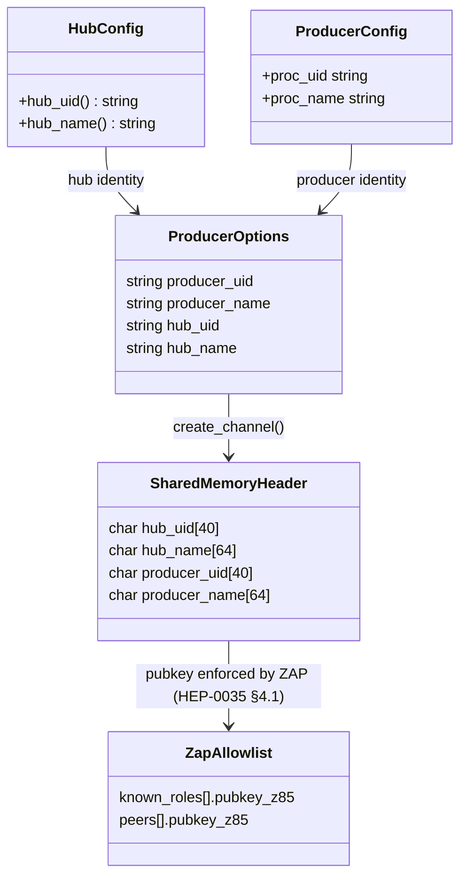
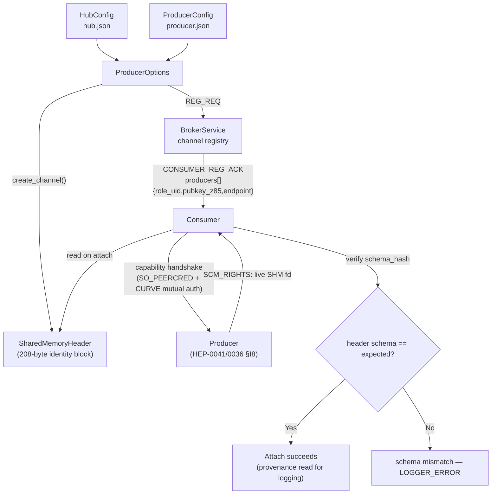

# HEP-CORE-0013: Channel Identity and Provenance

| Property      | Value                                                           |
|---------------|-----------------------------------------------------------------|
| **HEP**       | `HEP-CORE-0013`                                                 |
| **Title**     | Channel Identity and Provenance                                 |
| **Status**    | Implemented (2026-02-28). **PARTIALLY SUPERSEDED — see banner below.** |
| **Created**   | 2026-02-28                                                      |
| **Area**      | DataHub Security / Identity                                     |
| **Depends on**| HEP-CORE-0002 (DataHub), HEP-CORE-0009 (Policy Reference)      |
| **Related**   | HEP-CORE-0011 (ScriptHost Framework)                            |

> 🚧 **Supersession banner (2026-07-20) — role-identity enforcement.**
> §4 and §5 below describe role-identity enforcement via the
> `RoleIdentityPolicy` enum + `BrokerServiceImpl::check_role_identity`,
> including a `Verified` mode that "validates the producer's CurveZMQ
> public key matches the registered entry."  **That enforcement never
> existed in code** — `check_role_identity` only string-matched the
> role's self-asserted `role_name`/`role_uid` and never read any pubkey.
> The whole placeholder was **deleted 2026-07-20** (HEP-CORE-0035 §4.5 /
> §8 Phase 6) as redundant with the real gate.
>
> **Authoritative today:** a role's CURVE pubkey is enforced by the CTRL
> ROUTER's **ZAP handler** at the socket layer (HEP-CORE-0035 §4.1),
> keyed on the vault-backed `known_roles[].pubkey_z85` allowlist
> (`KnownRolesStore::as_peer_allowlist` → `zap_router.cpp`).  A role
> whose pubkey is not allowlisted never completes the handshake.  The
> identity data-block (§1–§3, `SharedMemoryHeader` provenance fields) is
> unchanged and remains accurate; only the §4/§5 enforcement narrative
> is superseded.
>
> 🚧 **Supersession banner (2026-07-21) — §4.2 stale-SHM check retired.**
> §4.2's "compare `SharedMemoryHeader.producer_uid` against the DISC_ACK
> `producer_uid` and abort" was never implemented and is unimplementable
> as written — DISC_ACK carries no `producer_uid` (the reply is
> status / schema_hash / metadata / consumer_count / zmq_pubkey /
> data_transport / zmq_node_endpoint).  The stale-SHM threat is now
> handled structurally by the HEP-CORE-0041 capability-fd attach model
> (per-channel capability endpoint, SO_PEERCRED + CURVE mutual auth —
> HEP-CORE-0036 §I8) plus the on-attach `schema_hash` verification
> (`data_block.cpp`, "schema hash mismatch" → `LOGGER_ERROR`).  §4.2 is
> retired; see the rewritten §4.2 below.

### Source file reference

| File | Layer | Description |
|------|-------|-------------|
| `src/include/utils/uid_utils.hpp` | L3 (public) | `generate_hub_uid()`, `generate_producer_uid()`, `generate_consumer_uid()`, `generate_processor_uid()` |
| `src/include/plh_datahub.hpp` | L3 (public) | `SharedMemoryHeader` with identity block (char arrays) |
| `src/include/utils/hub_producer.hpp` | L3 (public) | `ProducerOptions::producer_uid`, `producer_name` |
| `src/include/utils/hub_consumer.hpp` | L3 (public) | `ConsumerOptions` |
| `src/include/utils/role_identity_policy.hpp` | L3 (public) | `KnownRole` (vault allowlist entry). *(Formerly `RoleIdentityPolicy` enum — deleted 2026-07-20, HEP-0035 §4.5.)* |
| `src/include/utils/actor_vault.hpp` | L3 (public) | Encrypted keypair vault (generic, legacy name) |
| `src/utils/security/zap_router.cpp` | impl | ZAP CURVE-pubkey enforcement (HEP-0035 §4.1) — the actual role-identity gate |
| `src/utils/security/attach_protocol.cpp` | impl | SHM capability-fd attach: SO_PEERCRED + CURVE mutual auth (HEP-0036 §I8 / HEP-0041) — replaces the retired §4.2 producer_uid cross-check |
| `src/utils/shm/data_block.cpp` | impl | writes the identity block (single producer_uid) at `create_channel()`; verifies `schema_hash` on attach |
| `tests/test_layer2_service/test_uid_utils.cpp` | test | UID format validation, uniqueness, generation |
| `tests/test_layer2_service/test_actor_vault.cpp` | test | Vault create/open, keypair storage |
| `tests/test_layer2_service/test_attach_protocol.cpp` | test | capability-fd handshake (SO_PEERCRED uid check + CURVE mutual auth) |
| `tests/test_layer3_datahub/test_datahub_schema_validation.cpp` | test | on-attach schema-hash mismatch → `LOGGER_ERROR` (stale/wrong-segment guard) |
| `tests/test_layer2_service/test_hub_state.cpp` | test | SHM single-producer: `ONE_TO_ONE_CARDINALITY_VIOLATED` (fan-in / 2nd-producer rejection) |

---

## Abstract

This HEP defines the **Channel Identity block** embedded in every `SharedMemoryHeader` and
the **provenance chain** that carries hub and producer identity from configuration files
through broker registration to shared memory, enabling connection-policy enforcement and
diagnostic tracing without additional broker round-trips.

The Channel Identity block is logically independent of the DataHub memory layout (HEP-CORE-0002)
and the connection-policy rules (HEP-CORE-0009); this HEP isolates the identity flow so that
both can cross-reference it with a brief note rather than duplicating the full specification.

---

## 1. Channel Identity Block (208 bytes)

The `SharedMemoryHeader` reserves a 208-byte **Channel Identity** block (see HEP-CORE-0002 §3.2):

```cpp
// Within SharedMemoryHeader (written once at create_channel(); read-only thereafter)
char hub_uid[40];       // Hub unique ID: HUB-<name>-<8hex>, null-terminated
char hub_name[64];      // Hub display name, null-terminated
char producer_uid[40];  // Producer unique ID: PROD-<name>-<8hex>, null-terminated
char producer_name[64]; // Producer display name, null-terminated
```

| Field | Source | Written by | Consumers use |
|---|---|---|---|
| `hub_uid` | `HubConfig::hub_uid()` | `DataBlockProducer` at `create_channel()` | Verify identity; logging |
| `hub_name` | `HubConfig::hub_name()` | `DataBlockProducer` at `create_channel()` | Logging and diagnostics |
| `producer_uid` | `ProducerOptions::producer_uid` | `DataBlockProducer` at `create_channel()` | provenance/logging (pubkey enforced by ZAP, HEP-0035 §4.1) |
| `producer_name` | `ProducerOptions::producer_name` | `DataBlockProducer` at `create_channel()` | Logging and diagnostics |

**Write contract**: all four fields are written atomically relative to producer startup —
before any HELLO frames are sent and before consumers can attach. No synchronization is
needed for reads: consumers attach after the channel is registered (`REG_ACK`), so the
identity fields are fully written before any consumer can read them.

**Empty fields**: in `--dev` mode or when the producer runs outside a hub context, `hub_uid`
and `hub_name` are empty strings. Channels with empty `hub_uid` are unmanaged; no ZAP
allowlist applies (dev-mode loopback, HEP-CORE-0035 §7 open-question 5).

**Scope and level — a transport-layer provenance stamp, not the identity model.**
The authoritative producer model is **always a list**, symmetric across every
transport and topology: the broker holds `ChannelEntry.producers[]`
(`std::vector<ProducerEntry>`, 1..N — HEP-CORE-0023 §2.1.1) and surfaces it
uniformly as `CONSUMER_REG_ACK.producers[] = [{role_uid, pubkey_z85, endpoint}, …]`
for **both** SHM and ZMQ (HEP-CORE-0036 §6.4 — the B-4 unification, #289, that
removed the old "SHM emits flat fields, ZMQ emits an array" asymmetry). The
`QueueReader`/`QueueWriter` abstraction (`hub_queue.hpp`) isolates the user from
whether a channel is backed by SHM or ZMQ; producer identity is the same list
either way, of size 1 for a single-producer channel.

This `SharedMemoryHeader` identity block is **not** a second identity model — it
is a physical provenance stamp co-located with the data at the **SHM transport
layer**, below the queue abstraction (inside the ShmQueue backend). It stamps a
single `producer_uid`/`producer_name` because an SHM segment is physically
single-writer: SHM channels are always single-producer (only `FanOut` 1→N and
`OneToOne` 1→1; `FanIn` N→1 is ZMQ-only — `hub_shm_queue.hpp` `LOGGER_ERROR`s on
an SHM fan-in request, and the broker rejects a second SHM producer with
`ONE_TO_ONE_CARDINALITY_VIOLATED` / fan-out cardinality at REG_REQ). So for an
SHM channel the stamped `producer_uid` is exactly `producers[0].role_uid` — the
one entry in that channel's list, not a different representation. ZMQ channels
have no SHM header; their producers are read from the same `producers[]` list,
never from a transport-specific field.

---

## 2. UID Format

| Entity | Format | Example |
|---|---|---|
| Hub | `HUB-{NAME}-{8HEX}` | `HUB-TestLab-3F2A1B0E` |
| Producer | `PROD-{NAME}-{8HEX}` | `PROD-Sensor-A1B2C3D4` |
| Consumer | `CONS-{NAME}-{8HEX}` | `CONS-Logger-7E8F9A0B` |
| Processor | `PROC-{NAME}-{8HEX}` | `PROC-TempNorm-A3F7C219` |

Generated by `uid_utils::generate_hub_uid(name)`, `generate_producer_uid(name)`,
`generate_consumer_uid(name)`, `generate_processor_uid(name)`.
The 8-hex suffix is derived from 4 cryptographically random bytes (32-bit entropy).

---

## 3. Provenance Chain

### Identity Model



### Provenance Flow



The consumer does **not** open a named segment that could be stale: it receives
the live SHM fd directly from the CURVE-authenticated producer over the
per-channel capability handshake (HEP-CORE-0041 §5.3), so a wrong/stale
producer's segment cannot reach it. The identity fields are then read for
provenance/logging, and `schema_hash` is verified on attach.

```
HubConfig (hub.json)             ProducerConfig (producer.json)
  hub_uid = "HUB-Lab-3F2A1B0E"    producer_uid  = "PROD-Sensor-A1B2C3D4"
  hub_name = "TestLab"             producer_name = "Sensor"
       │                                │
       └──────────────┬─────────────────┘
                      ▼
           ProducerOptions (passed to create_channel())
             producer_uid  = producer_uid   ← producer identity
             producer_name = producer_name
             (hub fields populated from HubConfig if hub is running)
                      │
                      ▼
           DataBlockProducer::create_channel()
             SharedMemoryHeader.hub_uid       = HubConfig::hub_uid()
             SharedMemoryHeader.hub_name      = HubConfig::hub_name()
             SharedMemoryHeader.producer_uid  = opts.producer_uid
             SharedMemoryHeader.producer_name = opts.producer_name
                      │
           ┌──────────┴──────────────┐
           │                         │
           ▼                         ▼
BrokerService Registry         Consumer on attach
  channel.producer_uid            reads channel identity
  channel.producer_name           from SharedMemoryHeader
  channel.hub_uid                 (no broker query needed)
           │
           ▼
(role pubkey already enforced by ZAP at the
 CURVE handshake — HEP-CORE-0035 §4.1)
```

### 3.1 Hub context injection

When a `hub::Producer` is created inside a hub process (i.e., the hub lifecycle is running),
the hub's `HubConfig::hub_uid()` and `HubConfig::hub_name()` are injected into the
`DataBlockConfig` before `create_channel()` is called. This is done automatically by the
standalone binaries when `hub_dir` is specified in the config.

When running outside a hub (standalone dev mode), `hub_uid` and `hub_name` remain
empty; such channels are unmanaged and no ZAP allowlist applies (dev-mode
loopback, HEP-CORE-0035 §7 open-question 5).

### 3.2 Consumer provenance read

When a consumer calls `connect_channel()`, it reads the channel identity fields from the
`SharedMemoryHeader` immediately after attaching shared memory. The identity is available
without a broker query:

```cpp
// In DataBlockConsumer::connect_channel_from_parts():
std::string producer_uid  = header->producer_uid;   // from SHM identity block
std::string producer_name = header->producer_name;
std::string hub_uid       = header->hub_uid;
LOGGER_INFO("[consumer] Channel '{}' — producer: {} ({}), hub: {} ({})",
            channel_name, producer_name, producer_uid, hub_name, hub_uid);
```

---

## 4. Role-identity enforcement (superseded — see banner)

> **Superseded 2026-07-20.**  The `RoleIdentityPolicy` enum +
> `check_role_identity` string gate described in the original §4.1/§5
> was **deleted** (HEP-CORE-0035 §4.5 / §8 Phase 6).  It only
> string-matched the role's self-asserted `role_name`/`role_uid` and
> never verified a CURVE pubkey, so its `Verified` "CurveZMQ key matches"
> claim was never true in code.  This section is retained for historical
> context; the paragraphs below record what actually enforces identity.

Role-identity is enforced cryptographically by the CTRL ROUTER's **ZAP
handler** at the CURVE handshake (HEP-CORE-0035 §4.1), *before* any
`REG_REQ`/`DISC_REQ` reaches the broker logic.  The gate is keyed on the
vault-backed `known_roles[].pubkey_z85` allowlist
(`KnownRolesStore::as_peer_allowlist` → `zap_router.cpp`): a role whose
pubkey is not allowlisted is rejected at the handshake and never
registers.  The allowlist is the UNION of `known_roles[].pubkey_z85` and
federation `peers[].pubkey_z85` (HEP-0035 §4.2); an empty union is the
legal deny-all state.  There is no per-`RoleIdentityPolicy` mode and no
`DISC`-time string check — the ZAP gate is unconditional.

### 4.2 Stale / wrong-segment detection (retired mandate — see how it is handled today)

> **Retired 2026-07-21.**  The original mandate — "compare
> `SharedMemoryHeader.producer_uid` against the `producer_uid` in the DISC_ACK
> and abort on mismatch" — was **never implemented** and is unimplementable as
> written: **DISC_ACK carries no `producer_uid`** (its reply is status /
> schema_hash / metadata / consumer_count / zmq_pubkey / data_transport /
> zmq_node_endpoint, `broker_service.cpp`).  Producer identity moved to
> `CONSUMER_REG_ACK.producers[]{role_uid, pubkey_z85, endpoint}` when the wire
> protocol was reworked (HEP-CORE-0036 §6.4 / HEP-CORE-0041).

The "stale SHM segment reused by a different producer" threat this section
targeted is now handled **structurally**, so no producer_uid cross-check is
required:

1. **The consumer never opens a named segment that could be stale.** It receives
   the live SHM fd directly from the producer via `SCM_RIGHTS`, over a
   **per-channel capability endpoint** (`default_shm_capability_endpoint(channel)`,
   HEP-CORE-0041 §5.3).  The fd therefore comes from the specific, live producer
   for that channel — a different/stale producer's segment cannot be substituted.
   (The name-based `shm_attach` path exists only for `ReadAttach` diagnostic
   tools and `WriteAttach` source processes, not the consumer data path.)
2. **The producer handing the fd is cryptographically authenticated.**
   SO_PEERCRED verifies the peer's OS uid (HEP-CORE-0036 §I8) and a CURVE mutual
   handshake verifies the producer's pubkey against the one the broker
   authorized (`CONSUMER_REG_ACK.producers[].pubkey_z85`, ZAP-gated per
   HEP-CORE-0035).
3. **A wrong-schema segment is caught on attach.** The consumer verifies the
   header `schema_hash` against the expected schema; a mismatch is a
   `LOGGER_ERROR` (`data_block.cpp`, "DataBlock/FlexZone schema hash mismatch";
   pinned by `test_datahub_schema_validation.cpp`).

Enforcement summary: ZAP pubkey allowlist (HEP-0035 §4.1) + SO_PEERCRED + CURVE
capability handshake (HEP-0036 §I8 / HEP-0041) + on-attach schema verification
replace the never-built producer_uid cross-check.  `producer_uid` in the header
remains a **provenance/diagnostic** field (§3.2), not an enforcement input.

**Level.** All of the above — the capability endpoint, the fd handoff, the SHM
header — is the **ShmQueue backend's** transport concern, below the
`QueueReader`/`QueueWriter` abstraction (`hub_queue.hpp`). A role reading or
writing a channel sees only the uniform queue interface and the authoritative
`producers[]` list; it never touches the fd handshake or the header directly,
and the same code path serves a ZMQ-backed channel with no SHM segment at all.

---

## 5. Vault and Key Association

Each standalone binary has a vault (e.g. `vault/producer.vault`, created by
`pylabhub-producer --keygen`). The binary's CurveZMQ keypair is stored encrypted
in the vault. The `producer_uid` and CurveZMQ public key are permanently
associated — both are stored together and derived from the same password.

This means the `producer_uid` in the `SharedMemoryHeader` corresponds to a specific keypair.
The producer's CurveZMQ public key is validated by the CTRL ROUTER's ZAP
handler against the vault-backed `known_roles[].pubkey_z85` allowlist at
the CURVE handshake (HEP-CORE-0035 §4.1) — a role whose pubkey is not
allowlisted never registers.  (The legacy `RoleIdentityPolicy = Verified`
string check that this section originally described was deleted
2026-07-20; it never actually compared pubkeys — see the banner.)

See **HEP-CORE-0035 §4.1–§4.2** for the ZAP allowlist enforcement model.

---

## 6. Implementation Notes

### 6.1 Fields are char arrays, not std::string

All four identity fields are fixed-size `char[]` arrays to keep the `SharedMemoryHeader`
a plain POD-compatible struct that can be safely placed in shared memory without vtables,
allocators, or atomics. Strings longer than the field size are truncated silently.

### 6.2 Null termination contract

All four fields are null-terminated C strings. Producers must call `std::strncpy()` or
equivalent with `size - 1` to guarantee the null terminator:

```cpp
std::strncpy(hdr->hub_uid,      opts.hub_uid.c_str(),      39); hdr->hub_uid[39]      = '\0';
std::strncpy(hdr->hub_name,     opts.hub_name.c_str(),     63); hdr->hub_name[63]     = '\0';
std::strncpy(hdr->producer_uid, opts.producer_uid.c_str(),  39); hdr->producer_uid[39] = '\0';
std::strncpy(hdr->producer_name,opts.producer_name.c_str(),63); hdr->producer_name[63]= '\0';
```

### 6.3 Diagnostics access

The identity fields are read-only after `create_channel()`, so a diagnostic tool
can `ReadAttach` the segment by name (the non-capability path reserved for
diagnostics; §4.2) and print the provenance block:

```
Hub:      TestLab (HUB-TestLab-3F2A1B0E)
Producer: Sensor  (PROD-Sensor-A1B2C3D4)
```

(Attaching by name for *data* consumption is not the consumer path — consumers
receive the fd via the capability handshake, §4.2. A read-only diagnostic
attach cannot forge provenance: the fields were written once by the producer at
channel creation.)

---

## Copyright

This document is placed in the public domain or under CC0-1.0-Universal.
