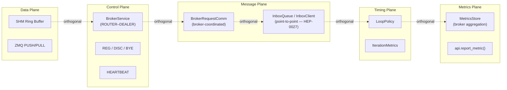
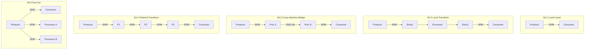
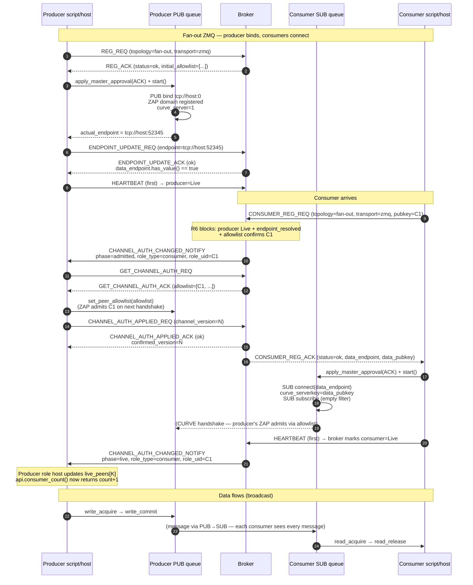
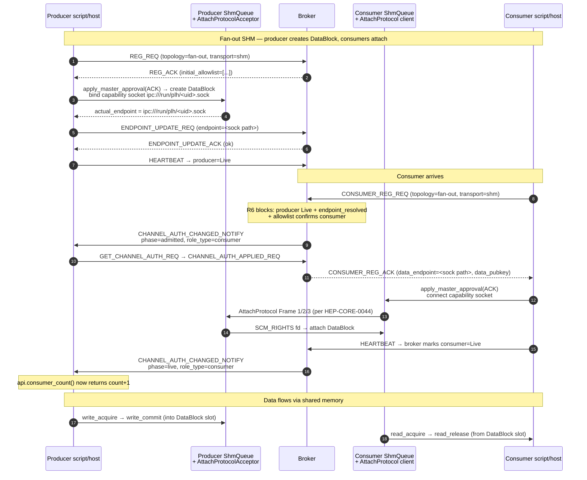
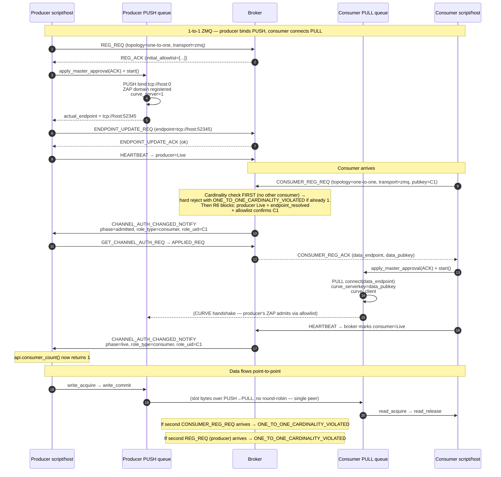
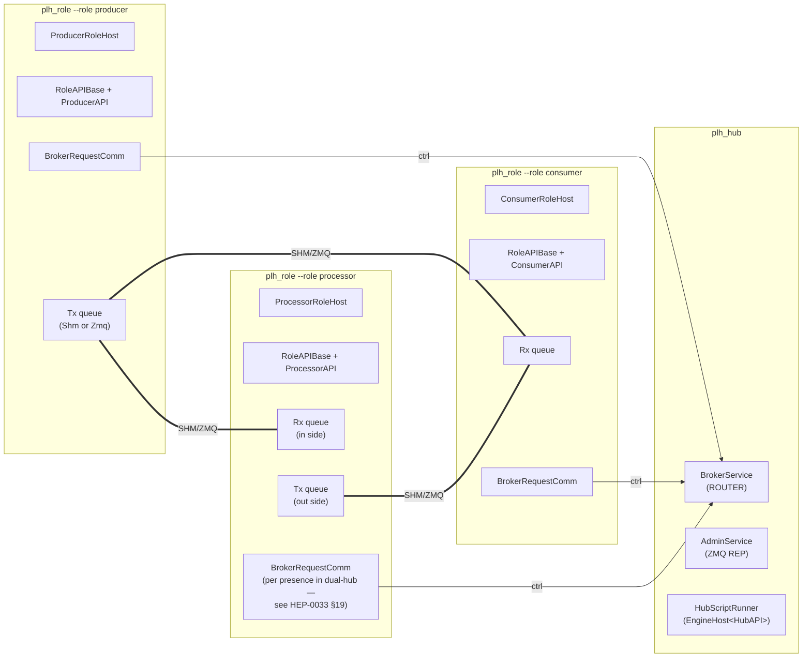

# HEP-CORE-0017: Pipeline Architecture

| Property      | Value                                                                           |
|---------------|---------------------------------------------------------------------------------|
| **HEP**       | `HEP-CORE-0017`                                                                 |
| **Title**     | Pipeline Architecture — Components, Planes, Topologies, and Boundaries         |
| **Status**    | Implemented — 2026-03-03.  Doc text refreshed 2026-05-06 against current binaries: roles run via `plh_role --role <producer|consumer|processor>` (HEP-CORE-0024) and the hub binary is `plh_hub` (HEP-CORE-0033 §15).  Earlier per-role binaries (`pylabhub-producer/consumer/processor`) and the legacy `pylabhub-hubshell` have been retired and deleted from the tree. |
| **Created**   | 2026-03-01                                                                      |
| **Updated**   | 2026-03-01 (actor eliminated; producer/consumer binaries added); 2026-04-21 (binary unification — `pylabhub-producer/consumer/processor` retired in favor of unified `plh_role`) |
| **Area**      | Framework Architecture (`pylabhub-utils`, `pylabhub-scripting`, `plh_role` unified binary) |
| **Depends on**| HEP-CORE-0002 (DataHub), HEP-CORE-0007 (Protocol), HEP-CORE-0011 (ScriptHost), HEP-CORE-0034 (Schema Registry — supersedes HEP-CORE-0016), HEP-CORE-0024 (Role Directory Service — binary unification) |

> **Binaries (current, 2026-05-06)**: this document uses the current
> launch form throughout: roles run via
> `plh_role --role <producer|consumer|processor>` (HEP-CORE-0024) and
> the hub binary is `plh_hub` (HEP-CORE-0033 §15).  Where this HEP
> earlier referred to per-role binaries (`pylabhub-{producer,consumer,
> processor}`) or the legacy `pylabhub-hubshell`, those names are
> retained only in `## 12 Document History` for traceability.
> Protocol, topology, and architectural content is unchanged.

---

> **REG-family wire authority (2026-07-12):** REG_REQ / CONSUMER_REG_REQ / DEREG_REQ / ENDPOINT_UPDATE_REQ / GET_CHANNEL_AUTH_REQ / CHANNEL_AUTH_APPLIED_REQ / CHANNEL_AUTH_CHANGED_NOTIFY / CHECK_PEER_READY_REQ wire format, admission-gate ordering, and retirement policy are owned by **HEP-CORE-0046 (REG Protocol Redesign)**.  This HEP references these wires only where behavior specific to its own subsystem is described; the wire authority always resolves to HEP-CORE-0046, and any new REG-family field / message / gate MUST be added there first.  See `docs/IMPLEMENTATION_GUIDANCE.md § "REG Protocol Wire Discipline (HEP-CORE-0046)"` for the rule that binds this to code.

## 1. Motivation

As the DataHub system grows to include Producers, Consumers, Processors, and schema
management, it becomes useful to have a single document that captures:

1. The **five planes** of communication and their strict separation
2. The **component roles** and the boundary decisions behind each
3. The **topology patterns** that compose these components into pipelines
4. How **schema** integrates with pipeline construction
5. The **deployment model** that governs binary identity and config

This document does not re-specify any protocol or implementation detail — those
live in the per-component HEPs (0002, 0007, 0015, 0016, 0018). This document
provides the cross-cutting architectural view.

---

## 2. The Five Planes

Every channel in the DataHub system carries traffic on five independent planes.
These planes are strictly orthogonal: changes to one have no effect on the others.

| Plane | What flows | Mechanism | Where defined |
|-------|-----------|-----------|---------------|
| **Data plane** | Slot payloads (typed fields) | SHM ring buffer (`DataBlockProducer`/`Consumer`) or msgpack-encoded ZMQ frames (`hub::ZmqQueue`) | HEP-CORE-0002 §3, §7.1 |
| **Control plane** | HELLO / BYE / REG / DISC / HEARTBEAT | ZMQ ROUTER–DEALER ctrl sockets + Broker | HEP-CORE-0007 |
| **Message plane** | Inter-role messaging (broker-coordinated channel events + point-to-point inbox) | ZMQ via `BrokerRequestComm` (channel notifications, role discovery, broadcasts) and `InboxQueue` / `InboxClient` (point-to-point, HEP-CORE-0027) | HEP-CORE-0007 §6, HEP-CORE-0027 |
| **Timing plane** | Loop pacing — fixed rate, max rate, compensating | `LoopPolicy` on `DataBlockProducer`/`Consumer` | HEP-CORE-0008 |
| **Metrics plane** | Counter snapshots, custom KV pairs | Piggyback on per-presence `HEARTBEAT_REQ` (Phase 6 — every presence, including consumers, carries an optional `metrics` field on its own heartbeat); `METRICS_REQ/ACK` (admin query). `METRICS_REPORT_REQ` **RETIRED** in Wave M1.4 (2026-05-11). | HEP-CORE-0019 |



**Why this separation matters:**

- Replacing SHM with ZMQ on the data plane does not touch the control plane
  (HELLO/BYE/heartbeat still flow on the same ZMQ ctrl sockets).
- Changing `LoopTimingPolicy` from `FixedRate` to `MaxRate` has no effect on what
  messages flow on the message plane.
- A Processor that bridges two brokers must maintain control-plane connections
  to **both** brokers independently of whether its data transport is SHM or ZMQ.

The invariant: **the broker is always a control-plane coordinator, never a data relay.**
Data bytes never pass through the broker.

---

## 3. Component Roles and Boundaries

### 3.1 Producer role

| Property | Value |
|---|---|
| Direction | Write-only |
| Data transport | SHM **or** ZMQ (selected via `out_transport` in `producer.json`) |
| Channel ownership | Creates the channel; registers as producer with broker via `REG_REQ` |
| SHM-specific facilities (when `out_transport=shm`) | Spinlocks (`api.spinlock(i)`), zero-copy slot writes, flexzone R/W, acquire-timing metrics |
| Broker protocol | `REG_REQ` → `REG_ACK`; sends `HEARTBEAT_REQ` (per-presence — see HEP-CORE-0019 §2.3); handles consumer `BYE` events |
| Lives on | SHM: same host as the SHM segment. ZMQ: any host with TCP connectivity. |

The Producer role is implemented today as `ProducerRoleHost` (in
`src/producer/`); the role's data plane is reached via
`RoleAPIBase::build_tx_queue()` which selects `ShmQueue` or `ZmqQueue`
internally based on `out_transport`.  The historical `Producer`
wrapper class was retired in L3.γ A6.3 (2026-03-01); SHM-specific
facilities (spinlocks, flexzone) are now exposed directly through
`RoleAPIBase` for the SHM-side transport.

### 3.2 Consumer role

| Property | Value |
|---|---|
| Direction | Read-only |
| Data transport | SHM **or** ZMQ (selected via `in_transport` in `consumer.json`) |
| Channel ownership | Attaches to existing SHM or connects to ZMQ endpoint; registers as consumer via `CONSUMER_REG_REQ` |
| SHM-specific facilities (when `in_transport=shm`) | Spinlocks, zero-copy slot view, flexzone R/W, acquire-timing metrics |
| ZMQ-specific note | Endpoint discovery depends on topology (§3.3.0): fan-out / one-to-one consumer (DIALING) receives scalar `data_endpoint` + `data_pubkey` on `CONSUMER_REG_ACK` (HEP-CORE-0036 §I7 + §5.2 amendment); fan-in consumer (BINDING) publishes its own endpoint via `ENDPOINT_UPDATE_REQ` post-bind (HEP-CORE-0021 §16).  `DISC_ACK` is for separate channel-observability queries.  Pre-migration `CONSUMER_REG_ACK.producers[]` array retires per §3.3-retired. |
| Broker protocol | `CONSUMER_REG_REQ` → `CONSUMER_REG_ACK`; sends HELLO to producer; `CONSUMER_DEREG_REQ` on exit |
| Lives on | SHM: same host as the SHM segment. ZMQ: any host with TCP connectivity. |

The Consumer role is implemented as `ConsumerRoleHost` (in
`src/consumer/`); data plane via `RoleAPIBase::build_rx_queue()`.  The
broker enforces transport compatibility (rejects with
`TRANSPORT_MISMATCH` if consumer and producer transports diverge).
The control plane (ctrl thread inside `RoleAPIBase`) is always active
regardless of data transport.

SHM-specific facilities (spinlocks, flexzone) are only available when
`in_transport=shm`.  For cross-machine reading, compose with a bridge
Processor (§4.3) or use `in_transport=zmq` with a ZMQ-transport
producer.

### 3.3 hub::QueueReader and hub::QueueWriter

> **Amendment (2026-07-08) — topology migration.**  This section
> gains a topology-parameterized model that supersedes the pre-2026-07-08
> "one producer binds, N consumers connect" hardcoding.  Three
> explicit topologies (`fan-in`, `fan-out`, `one-to-one`) declared on
> every REG_REQ.  The BINDING side of each topology owns the single
> `data_endpoint`; the DIALING side connects.  The pre-migration
> multi-endpoint PULL model (with `ProducerPeer` vector, per-peer
> `curve_serverkey` mutation, and `add_producer_peer` / `remove_producer_peer`
> APIs) is superseded by single-bind-single-connect per topology.
> The `ProducerEntry::zmq_node_endpoint` per-producer field retires;
> it becomes `ChannelEntry::data_endpoint` (scalar, owned by binding
> side).  Design authority: `docs/tech_draft/DRAFT_topology_singular_side_2026-07.md`
> (status: DESIGN LOCKED).  Downstream consumers of this section
> (HEP-CORE-0007, HEP-CORE-0033, HEP-CORE-0036 amendments) reflect
> the new terminology.

### 3.3.0 Topology-parameterized model (2026-07-08 amendment)

The framework declares three topologies, each with an explicit
BINDING side and DIALING side (`docs/tech_draft/DRAFT_topology_singular_side_2026-07.md`
§2):

| Topology | Wire value | Transports | Binding side | Socket pair |
|---|---|---|---|---|
| Fan-in (N → 1) | `"fan-in"` | ZMQ only | Consumer | PULL (bind) ← PUSH (connect) |
| Fan-out (1 → N) | `"fan-out"` | ZMQ or SHM | Producer | ZMQ: PUB (bind) → SUB (connect); SHM: DataBlock (create) → capability-transport (attach) |
| 1-to-1 (1 → 1) | `"one-to-one"` | ZMQ or SHM | Producer | ZMQ: PUSH (bind) → PULL (connect); SHM: as fan-out |

The BINDING side of each topology owns the channel's single
`data_endpoint`, publishes it via `ENDPOINT_UPDATE_REQ` after S3 bind
(per HEP-CORE-0021 §16), maintains the ZAP allowlist (fed by
`CHANNEL_AUTH_CHANGED_NOTIFY(phase=admitted)`), and tracks its
live-peer set (fed by `CHANNEL_AUTH_CHANGED_NOTIFY(phase=live)`).
The DIALING side receives `data_endpoint` + `data_pubkey` on its
REG_ACK and dials.

**Queue factory signature:**

`hub::Queue` is a static-methods-only class in `hub_queue_factory.hpp`
(companion header to `hub_queue.hpp`).  It is not instantiable — all
methods are static.  The class shape (rather than free functions in a
`hub::Queue` sub-namespace) matches the style used by concrete queue
classes' factories (`ZmqQueue::create_reader`, `ShmQueue::create_*`)
and lets the two-level factory dispatch (`hub::Queue::create_*` →
`ZmqQueue::create_*` / `ShmQueue::create_*`) share the same `Class::`
prefix idiom at both layers.

```cpp
namespace pylabhub::hub {

enum class ChannelTopology { FanIn, FanOut, OneToOne };
enum class Transport       { Zmq, Shm };

class Queue
{
public:
    // No instances — factory-only.
    Queue() = delete;

    // Consumer side (reader).
    static std::unique_ptr<QueueReader>
    create_reader(ChannelTopology topology,
                  Transport       transport,
                  RxOptions       opts);

    // Producer side (writer).
    static std::unique_ptr<QueueWriter>
    create_writer(ChannelTopology topology,
                  Transport       transport,
                  TxOptions       opts);
};

} // namespace pylabhub::hub
```

Three facts — side + topology + transport — uniquely determine the
socket configuration.  The role provides `topology` from config and
inherits `side` from the role kind; the queue picks socket type,
bind direction, CURVE role, and endpoint owner from the §3.3.0
decision matrix below.  Role code NEVER touches libzmq; role-host
code NEVER makes bind/connect decisions.

**Full decision matrix (all six side × topology cells):**

| Side | Topology | Transport | Socket type | Bind or connect | Post-connect step | CURVE role | Endpoint owner |
|---|---|---|---|---|---|---|---|
| Reader (consumer) | Fan-in     | ZMQ | PULL | **bind**    | — | server | self |
| Reader (consumer) | Fan-out    | ZMQ | SUB  | connect     | `setsockopt(ZMQ_SUBSCRIBE, "")` | client | peer |
| Reader (consumer) | Fan-out    | SHM | capability socket | connect | AttachProtocol handshake (HEP-CORE-0044) | crypto_box | peer |
| Reader (consumer) | 1-to-1     | ZMQ | PULL | connect     | — | client | peer |
| Reader (consumer) | 1-to-1     | SHM | capability socket | connect | AttachProtocol handshake | crypto_box | peer |
| Writer (producer) | Fan-in     | ZMQ | PUSH | connect     | — | client | peer |
| Writer (producer) | Fan-out    | ZMQ | PUB  | **bind**    | — | server | self |
| Writer (producer) | Fan-out    | SHM | DataBlock create | (creates DataBlock + owns capability socket) | — | owner | self |
| Writer (producer) | 1-to-1     | ZMQ | PUSH | **bind**    | — | server | self |
| Writer (producer) | 1-to-1     | SHM | DataBlock create | (creates DataBlock + owns capability socket) | — | owner | self |

**Legality gates enforced at `hub::Queue::create_*` (INVARIANT):**

The factory is the SINGLE enforcement site for topology × transport
legality.  Neither role code nor the broker duplicates these checks;
downstream layers assume the factory has already refused an illegal
combination and never reach construction.

1. **Fan-in requires ZMQ.**
   `topology == FanIn && transport == Shm` → return `nullptr` +
   `LOGGER_ERROR` with reason `TOPOLOGY_NOT_SUPPORTED_FOR_TRANSPORT`
   (HEP-CORE-0007 §12.4a).  Rationale: SHM is host-local + single-
   producer by physical constraint of a shared DataBlock — no fan-in
   semantics.

2. **Fan-out permits ZMQ or SHM.**
   ZMQ maps to PUB/SUB; SHM maps to DataBlock + per-consumer
   capability transport (HEP-CORE-0041 §5.5).  Both are legal.

3. **One-to-one permits ZMQ or SHM.**
   ZMQ maps to PUSH/PULL; SHM maps to single-consumer DataBlock.

4. **Endpoint-hint validity per side + topology.**
   - Binding side (see §3.3.0 matrix "Endpoint owner = self"):
     `endpoint_hint` MAY be non-empty (e.g., `tcp://host:0` for
     ephemeral bind, or explicit port).  Empty is legal — queue will
     bind to a framework-chosen default.
   - Dialing side (matrix "Endpoint owner = peer"):
     `endpoint_hint` MUST be empty.  The endpoint arrives on the
     REG_ACK's `data_endpoint` field (HEP-CORE-0036 §5.2).  A
     non-empty `endpoint_hint` on the dialing side is a caller error
     — return `nullptr` + `LOGGER_ERROR` with reason
     `CONFIG_INVALID_ENDPOINT_HINT_ON_DIALING_SIDE`.

5. **Unknown topology / transport enum value.**
   Any value outside the legal set → return `nullptr` +
   `LOGGER_ERROR`.  Callers passing a string from JSON parse first
   through `topology::parse` / `transport::parse` (which reject
   unknown strings at the config layer with `CONFIG_INVALID`);
   the enum-level check is defense-in-depth.

Gates 1–5 fire BEFORE any concrete queue construction.  The factory
returns `nullptr` on any gate failure; role code checks for null and
propagates as a config-load failure.

**Options structs:**

```cpp
struct RxOptions
{
    SchemaSpec      slot_spec;      // required
    SchemaSpec      fz_spec;        // optional (empty → no flexzone)
    std::string     endpoint_hint;  // see legality gate #4 above
    size_t          buffer_depth = kDefaultBufferDepth;
    ChecksumPolicy  checksum_policy = ChecksumPolicy::Enforced;
    bool            flexzone_checksum = true;
    std::string     instance_id;    // optional — auto-derived from role uid if empty

    // Transport-specific extras.  The factory reads only the fields
    // matching the requested transport; the others are ignored.
    // Rationale: keeping one options struct instead of a variant
    // avoids caller boilerplate; the factory's transport dispatch
    // picks the relevant subset.

    // ZMQ-specific extras
    // (none required beyond the common fields above at present)

    // SHM-specific extras (HEP-CORE-0041 §5.5)
    int             shm_capability_fd = -1;   // producer-created memfd for the SHM
                                              // channel; set on writer side, read on
                                              // reader side after §5.5 handshake.
};

struct TxOptions
{
    SchemaSpec      slot_spec;
    SchemaSpec      fz_spec;
    std::string     endpoint_hint;  // see legality gate #4 above
    size_t          buffer_depth = kDefaultBufferDepth;
    OverflowPolicy  overflow_policy = OverflowPolicy::Drop;
    ChecksumPolicy  checksum_policy = ChecksumPolicy::Enforced;
    bool            flexzone_checksum = true;
    bool            always_clear_slot = true;
    std::string     instance_id;

    // Transport-specific extras
    int             sndhwm = 0;                    // ZMQ only; 0 → libzmq default
    int             send_retry_interval_ms = 10;   // ZMQ only
    int             shm_capability_fd = -1;        // SHM only; set on binding side
    DataBlockConfig shm_config{};                  // SHM only
};
```

Both structs are transport-agnostic at the type level — the same
struct is used for ZMQ and SHM.  The factory reads the relevant
subset based on `Transport`; unused fields are ignored (documented
as such).  This keeps role-config translation simple: one options
struct per direction (Rx / Tx), populated by the config parser
regardless of transport, with the factory picking the fields it
needs.  Transport-specific validation (e.g. "SHM writer requires
`shm_capability_fd >= 0`") is applied inside the factory's
transport-specific branch, after the top-level legality gates.

### 3.3.0.1 Internal dispatch — `hub::Queue` → `ZmqQueue` / `ShmQueue`

`hub::Queue::create_reader` / `create_writer` is a thin dispatcher.
It applies the §3.3.0 legality gates, then delegates to the
concrete transport class's topology-parametric factory.  Pseudocode:

```cpp
std::unique_ptr<QueueWriter>
Queue::create_writer(ChannelTopology topology,
                     Transport       transport,
                     TxOptions       opts)
{
    // Gate 1: legality by (topology, transport)
    if (topology == ChannelTopology::FanIn && transport == Transport::Shm) {
        LOGGER_ERROR("fan-in requires ZMQ (SHM is host-local single-producer)");
        return nullptr;
    }
    // Gate 4: endpoint_hint validity per side + topology
    if (writer_is_binding_side(topology) == false && !opts.endpoint_hint.empty()) {
        LOGGER_ERROR("dialing-side writer must not pre-declare endpoint_hint");
        return nullptr;
    }

    // Dispatch to concrete
    switch (transport) {
    case Transport::Zmq:
        return ZmqQueue::create_writer(topology, translate_tx_opts_to_zmq(opts));
    case Transport::Shm:
        return ShmQueue::create_writer(topology, translate_tx_opts_to_shm(opts));
    }
    return nullptr;
}
```

`writer_is_binding_side(topology)` is derived from the §3.3.0 matrix:
Writer + Fan-in → dialing; Writer + Fan-out → binding; Writer +
One-to-one → binding.  Symmetric reader form:
`reader_is_binding_side(topology)`: Fan-in → binding; Fan-out →
dialing; One-to-one → dialing.

Concrete transport factories (`ZmqQueue::create_writer`,
`ShmQueue::create_writer`) each read the topology enum and apply the
matrix row for their transport.

The dispatcher owns no per-transport knowledge beyond the two
translation helpers `translate_tx_opts_to_zmq` /
`translate_tx_opts_to_shm`, which extract the transport-relevant
subset of `TxOptions`.  Adding a new transport in the future means
one new switch case + one new translation helper — no changes to
role code, no changes to broker, no changes to the abstract
`QueueReader` / `QueueWriter` interfaces.

### 3.3.1 Framework integration

Both directions follow the same "build in Standby, ask the broker,
activate inside `apply_master_approval`" shape (per HEP-CORE-0036
§3.5 + §6.7 — those sections carry the symmetric R6 gate).  What
the topology model changes:

**Binding side S3 flow** (fan-in consumer; fan-out or 1-to-1 producer):

1. `apply_master_approval(REG_ACK)` — no `data_endpoint` in ACK
   (binding side already has its own).
2. Queue picks socket type from topology matrix; binds; enters Configured.
3. Role host queries `queue->actual_endpoint()`, sends `ENDPOINT_UPDATE_REQ`
   with the resolved endpoint (per HEP-CORE-0021 §16.4-16.6).
4. Heartbeat task starts.  First heartbeat marks binding side Live.
5. From now on, `CHANNEL_AUTH_CHANGED_NOTIFY(phase=admitted)` fires
   for each dialing-side peer joining the allowlist; role host pulls
   via `GET_CHANNEL_AUTH_REQ` and applies to ZAP.
   `CHANNEL_AUTH_CHANGED_NOTIFY(phase=live)` fires when each dialing
   peer becomes Live; role host updates its `live_peers[channel]`
   map (feeds `api.consumer_count()` / `api.producer_count()`).

**Dialing side S3 flow** (fan-in producer; fan-out or 1-to-1 consumer):

1. REG_REQ pends at broker R6 gate until binding side is Live +
   `data_endpoint.has_value()` (endpoint published) +
   `confirmed_version >= role_registration_version` (all three
   conditions per tech draft §5.4).
2. REG_ACK arrives carrying `data_endpoint` + `data_pubkey`.
3. `apply_master_approval(REG_ACK)` — queue sets
   `curve_serverkey = data_pubkey`, connects to `data_endpoint`,
   enters Active.  For fan-out consumer (SUB): subscribes with empty
   topic.  For SHM consumers: runs AttachProtocol handshake per HEP-CORE-0044.
4. Heartbeat task starts.
5. No further peer-set coordination — the singular binding side is
   the only peer, and it's the one the dialing side connected to.

### 3.3.2 Script-facing accessors (2026-07-08 amendment, HEP-CORE-0028 sync)

Four LIVE-peer accessors bound on every role's api object across every
engine (Native / Lua / Python), per HEP-CORE-0011 §"Cross-Engine
Surface Parity" Read-only observation surface principle:

```
api.consumer_count(channel_name: str) -> int
api.producer_count(channel_name: str) -> int
api.consumers(channel_name: str)      -> list[str]  # role_uids
api.producers(channel_name: str)      -> list[str]  # role_uids
```

The binding side of the channel populates the underlying `live_peers`
map (the binding-side role host receives the `phase=live` NOTIFYs);
dialing-side callers on the same channel see empty lists / zero
counts — the documented "not applicable on this side" sentinel per
HEP-CORE-0011.  Callers do NOT need to switch APIs based on role
kind — a fan-in producer script calling `api.consumer_count(K)` on a
channel where it is the dialing side just gets 0.

Objective counts (self-inclusive when applicable).  Feed from the
binding-side `live_peers` map maintained by `phase=live` NOTIFY
events.  Script decides when to produce/consume based on peer
readiness (framework provides mechanisms, script decides policy —
see tech draft §7.6).  HEP-CORE-0028 amendment ships the accessor
bindings for Lua + Python + Native engines.

---

### 3.3-retired — Pre-2026-07-08 model (SUPERSEDED; archaeological reference)

The material below described the pre-2026-07-08 model where
`ZmqQueue` PULL was multi-producer via per-peer `connect()` under a
`ProducerPeer` vector.  That model is superseded by the topology
model described in §3.3.0.  Retained here for callers and tests
that haven't yet been converted to the new factories.

The data plane abstraction is split into two independent abstract classes:

| Class | Role | Methods |
|-------|------|---------|
| `hub::QueueReader` | Read-only access | `read_acquire`, `read_release`, `read_flexzone`, `last_seq`, `capacity`, `policy_info`, `set_verify_checksum` + metadata |
| `hub::QueueWriter` | Write-only access | `write_acquire`, `write_commit`, `write_discard`, `write_flexzone`, `capacity`, `policy_info`, `set_checksum_options` + metadata |

Concrete implementations use C++ multiple inheritance:
```
ShmQueue : QueueReader, QueueWriter  (internal — wraps DataBlockConsumer/Producer)
ZmqQueue : QueueReader, QueueWriter  (internal — wraps ZMQ PULL/PUSH socket)
```

`ShmQueue` and `ZmqQueue` are internal implementation details; public API exposes
only `unique_ptr<QueueReader>` or `unique_ptr<QueueWriter>`. There is no combined
`Queue` interface: the old `hub::Queue` class is eliminated.

**No runtime cost**: metadata methods declared in both abstract classes (item_size,
flexzone_size, name, metrics, start, stop, is_running, capacity, policy_info) are
implemented once in the concrete class. Virtual dispatch costs ~2 ns vs 100–500 ns
for the actual SHM acquire — < 1% overhead.

QueueReader and QueueWriter are designed for independent ownership and
composition.  A processor role obtains BOTH (one per side) via
RoleAPIBase; a producer role uses only a QueueWriter; a consumer role
uses only a QueueReader.

| Property | Value |
|---|---|
| Used by | `ProducerRoleHost` (`QueueWriter` only, via `RoleAPIBase::build_tx_queue`); `ConsumerRoleHost` (`QueueReader` only, via `build_rx_queue`); `ProcessorRoleHost` (both — one per side) |
| Does NOT carry | Control plane, message plane, timing plane |

#### ZmqQueue — API contract and schema requirements

> **⚠️ LEGACY factory API — superseded by §3.3.0.**  The
> `ZmqQueue::push_to` / `pull_from` factories shown below accept
> an explicit `bind: bool` parameter and require the caller (role
> code) to decide bind vs connect direction — a decision that
> §3.3.0 explicitly forbids at role level.  The current entry point
> is `hub::Queue::create_reader` / `create_writer(topology,
> transport, opts)` per §3.3.0; the internal concrete-transport
> factory is `ZmqQueue::create_reader(topology, RxCreateOptions)`
> / `ZmqQueue::create_writer(topology, TxCreateOptions)` per
> §3.3.0.1 dispatch.  The legacy `push_to` / `pull_from` factories
> are retained for tests that exercise ZMQ-specific parameters
> (`sndhwm`, `send_retry_interval_ms`, `zap_domain`) directly and
> are on track for retirement alongside `zmq_bind` in role config.
> New code MUST use the §3.3.0 unified factory.

`hub::ZmqQueue` always operates in **schema mode**. A non-empty
`std::vector<ZmqSchemaField>` and a packing rule are **required** at construction.

```cpp
// Factories return unique_ptr<ZmqQueue>.  Both flavors are CURVE-only
// (HEP-CORE-0035 §2 unconditional-CURVE invariant); the public surface
// matches HEP-CORE-0040 §8.4 endpoint shape.  Identity bytes are NOT
// passed by value — `identity_key_name` is the KeyStore lookup key
// that the factory body resolves via `key_store().with_seckey(name, cb)`
// + `key_store().pubkey(name)`.
std::unique_ptr<ZmqQueue> ZmqQueue::push_to(
    const std::string& endpoint,
    std::vector<ZmqSchemaField> schema,  // REQUIRED: must not be empty
    std::string packing,                 // REQUIRED: "aligned" or "packed"
    std::string_view identity_key_name = security::kRoleIdentityName,
    std::string zap_domain = {},         // empty → derive from instance_id
    bool bind = true,
    std::optional<std::array<uint8_t, 8>> schema_tag = std::nullopt,
    /* sndhwm, send_buffer_depth, overflow_policy, retry_ms, instance_id */ ...);

std::unique_ptr<ZmqQueue> ZmqQueue::pull_from(
    const std::string& endpoint,
    security::Z85PublicKey server_pubkey, // PULL/connect: producer pubkey;
                                          // PULL/bind: empty sentinel ok
    std::vector<ZmqSchemaField> schema,   // REQUIRED: must not be empty
    std::string packing,                  // REQUIRED: "aligned" or "packed"
    std::string_view identity_key_name = security::kRoleIdentityName,
    bool bind = false,
    size_t max_buffer_depth = 64,
    std::optional<std::array<uint8_t, 8>> schema_tag = std::nullopt,
    /* instance_id */ ...);
```

**Violation of these requirements** causes the factory to log a `LOGGER_ERROR` and
return `nullptr`. When called through `ProducerOptions`/`ConsumerOptions`, the outer
`Producer::create` / `Consumer::connect` propagates the failure as `std::nullopt`.

Key differences from `ShmQueue`:

| Property | ShmQueue | ZmqQueue |
|---|---|---|
| Encoding | Raw slot bytes (no overhead) | msgpack field-by-field |
| Type safety | Schema hash checked at attach | Type tag checked per frame |
| Flexzone | Supported | Not supported (fz=None in scripts) |
| Alignment | SHM slot alignment rules | ctypes-compatible (per `packing`) |
| Overflow | `OverflowPolicy::Block` or `Drop` | Bounded internal buffer (drop oldest) |
| Checksum (write) | `set_checksum_options()` → BLAKE2b on commit | `set_checksum_options()` → no-op (TCP integrity) |
| Checksum (read) | `set_verify_checksum()` → BLAKE2b on acquire | `set_verify_checksum()` → no-op |
| last_seq() | `SlotConsumeHandle::slot_id()` (commit_index) | Wire frame `seq` field |
| Cross-machine | No (SHM is host-local) | Yes (TCP, PGM, etc.) |

See HEP-CORE-0002 §7.1 for the complete wire format specification.

See HEP-CORE-0002 §17.3 for detailed rationale.

#### ZmqQueue — Dynamic peer membership (HEP-CORE-0036)

A `ZmqQueue` PULL side is intrinsically multi-producer-capable
(ZMQ PULL fair-queues data from any number of connected PUSH peers;
see §4.6 Fan-In Pipeline).  Under HEP-CORE-0036, the channel's
producer set can change at runtime — producers join and leave via
REG_REQ / DEREG_REQ — and the framework drives those changes into
the queue via a small dynamic-peer API.  Roles never see ZMQ socket
operations; the queue handles bind/connect direction, per-peer
connection lifecycle, ZAP cache, and fair-queue accounting
internally.

**Extended `RxQueueOptions`** (`role_api_base.hpp`):

The single `zmq_node_endpoint` is replaced by a vector of producer
peer descriptors, one per producer in `CONSUMER_REG_ACK.producers[]`
(HEP-CORE-0036 §6.4).  Single-producer channels are the N=1 case
with no special-cased options struct.

```cpp
struct ProducerPeer
{
    std::string role_uid;       ///< Producer's role uid (HEP-CORE-0033 §G2.2.0b).
    std::string endpoint;       ///< tcp://host:port (HEP-CORE-0021 §16.3 per-producer scope).
    std::string pubkey_z85;     ///< Producer's identity pubkey
                                ///<  (HEP-CORE-0036 I6 — used by consumer-side
                                ///<   ZAP wiring if any; the broker-side ZAP
                                ///<   on the producer's PUSH is what gates
                                ///<   consumer admission).
};

struct RxQueueOptions
{
    // ... existing fields (slot_spec, fz_spec, packing, etc.) ...

    // Transport (HEP-CORE-0021 + HEP-CORE-0036).
    // For ZMQ transport: one entry per producer of the channel.
    // For SHM transport: at most 1 entry (SHM is physically single-producer).
    std::vector<ProducerPeer> producer_peers;
    // ...
};
```

**Dynamic add/remove methods** on the queue interface:

```cpp
class ZmqQueue : public QueueReader, public QueueWriter
{
public:
    // Add a producer peer to the PULL side.  ZmqQueue internally
    // performs the corresponding socket operation (current
    // implementation: socket.connect(peer.endpoint); see §4.6 for the
    // bind/connect direction discussion — choice is internal).
    void add_producer_peer(const ProducerPeer& peer);

    // Remove a producer peer.  Does NOT close any data already
    // received; only affects future connections (consistent with
    // HEP-CORE-0036 I5: revocation is forward-looking).
    void remove_producer_peer(const std::string& role_uid);
};
```

**Framework integration** (staged per HEP-CORE-0036 §3.5 +
§6.7 "Role-host integration pattern").  Both directions follow the
same shape — build in Standby, ask the broker, activate inside
`apply_master_approval`.

#### Consumer side (PULL / rx queue)

- **S1 — `setup_infrastructure_`**: `build_rx_queue(opts)`
  constructs the queue in **Standby** state per HEP-CORE-0036 §6.7.
  At this point `opts.producer_peers` may be empty — no PULL
  `connect()` happens, no PULL worker is spawned.  The queue object
  exists; the socket side is dormant.
- **S3 — `apply_master_approval(CONSUMER_REG_ACK)`**: when the
  consumer's REG_REQ is approved, the framework hands the broker's
  `CONSUMER_REG_ACK.producers[]` to the queue via the single
  polymorphic mutator
  `queue->apply_master_approval(CONSUMER_REG_ACK)`.  That mutator
  seeds `producer_peers` (merged with any S2→S3 buffered
  `set_producer_peers` calls per HEP-CORE-0036 §6.7 Option B —
  `apply_master_approval` payload wins on overlap), per-producer
  `connect()`s with `curve_serverkey = producer.pubkey` (HEP-CORE-0036
  §3.5.4 INV4), spawns the PULL worker under ThreadManager scope,
  and transitions the queue Standby → Configured → Active.  The
  queue does **NOT** call `connect()` or spawn any worker until
  `apply_master_approval` runs.
- **Runtime add/remove (post-S3, queue Active)**: on a "producer
  joined channel X" broadcast (HEP-CORE-0033 §12 channel event),
  the role-host framework looks up the queue for X and calls
  `queue.add_producer_peer(new_producer)`.  On a "producer left
  channel X" broadcast, the framework calls
  `queue.remove_producer_peer(role_uid)`.  These operations apply
  to an already-Active queue; see §4.6.1 for the full runtime flow.

#### Producer side (PUSH / tx queue) — symmetric

- **S1 — `setup_infrastructure_`**: `build_tx_queue(opts)`
  constructs the queue in **Standby** state.  The bind endpoint is
  carried in `opts.zmq_node_endpoint` but the socket is NOT bound
  yet, the ZAP handler is NOT armed, and no PUSH worker thread
  exists.  This is the AUTH-gate principle from HEP-CORE-0036 §3.5
  applied to the producer side — no listening socket exists before
  the broker has authorized the channel.
- **S3 — `apply_master_approval(REG_ACK)`**: when the producer's
  REG_REQ is approved, the framework hands the broker's
  `REG_ACK.initial_allowlist` (array of Z85 pubkey strings per
  HEP-CORE-0036 §6.2 / §6.5) to the queue via the same single
  polymorphic mutator: `queue->apply_master_approval(REG_ACK)`.
  Internally the PUSH path does, in order:
    1. **Load the allowlist** — `set_peer_allowlist(initial_allowlist)`
       writes the broker-supplied admit set into the queue's
       allowlist atomic.
    2. **`start()`** — registers the ZAP domain with the process
       ZapRouter BEFORE the socket binds (so an early peer connect
       can't race into an unregistered domain), then binds the PUSH
       socket and spawns the PUSH worker.  start() preserves the
       pre-set allowlist; the queue lands Active with the broker-
       supplied admit set already in force, not a transient empty
       one.  See HEP-CORE-0011 § "Role Host `worker_main_()` Steps"
       Step 6d.
  Transitions Standby → Configured → Active.  As on the PULL side:
  the queue does **NOT** bind or spawn any worker until
  `apply_master_approval` runs.
- **Runtime authorization changes (post-S3)**: when the broker's
  per-channel allowlist changes (consumer joined / revoked), the
  broker fires `CHANNEL_AUTH_CHANGED_NOTIFY` to the producer; the
  role-host's BRC handler pulls the new allowlist via
  `GET_CHANNEL_AUTH_REQ` and **snapshot-replaces** the queue's
  allowlist with `set_peer_allowlist` (HEP-CORE-0036 §6.5
  notify-then-pull, amendment 2026-06-04 — supersedes the retired
  snapshot-push `CHANNEL_AUTH_UPDATE` wire frame).  Replace, not
  merge: the new allowlist fully replaces the prior one atomically.
  The queue stays Active; future handshakes consult the refreshed
  cache.

#### PULL vs PUSH symmetry — and where they differ

Both sides build in Standby, defer all socket I/O to
`apply_master_approval`, and present scripts a queue interface
that hides the auth machinery.  Two asymmetries are worth calling
out so readers don't try to apply one side's runtime API to the
other:

- **PULL side has per-peer add/remove**:
  `queue.add_producer_peer(...)` and `queue.remove_producer_peer(...)`
  let the role-host framework register a new producer or evict a
  departed one without resetting the rest of the peer set.  Used by
  the runtime CHANNEL_NOTIFY broadcast path (§4.6.1).
- **PUSH side is allowlist-only, snapshot-replace**: no per-peer
  add/remove on the PUSH side.  Allowlist refreshes are always full
  snapshot replacements via `set_peer_allowlist`.  Rationale: the
  producer-side ZAP handler enforces a flat pubkey set, not
  per-connection state — there's nothing to "add" beyond writing a
  new snapshot.  See HEP-CORE-0036 §6.5 design rationale.
- **Two caches, one per script-observable + one per ZAP**: the
  PUSH-side `set_peer_allowlist` write feeds the local ZAP cache
  (transport-specific enforcement); the SAME wire event also writes
  the script-observable `RoleAPIBase::allowlist_cache` which is
  transport-agnostic.  For the cache architecture (which cache, who
  reads, who writes, who is the authority) see HEP-CORE-0036 §I11.1.
  SHM channels reuse the same script-observable cache but have NO
  local enforcement cache — broker pre-confirm per attach is the
  gate (HEP-CORE-0041 §9 D4).

#### Script visibility — both sides

Scripts never see this API.  They see only `queue.write_acquire()`
/ `queue.write_commit()` (producer) or `queue.read_acquire()` /
`queue.read_release()` (consumer).  Slots route through whatever
peer set the framework has populated; the underlying ZMQ socket
multiplexes per its native semantics — round-robin among
connected PUSH peers on the PULL side, load-balanced across
connected PULL consumers on the PUSH side.

**Pattern-neutrality**: HEP-CORE-0017 does NOT specify whether
ZmqQueue uses Pattern A (PULL binds, peers' PUSH connect to it) or
Pattern B (PULL connects to each peer's bound PUSH endpoint).  Both
are valid implementations of the multi-producer surface; the
choice is internal to ZmqQueue.  The current code uses Pattern B
(consumer's PULL connects per producer endpoint); future
implementations may switch to Pattern A for simpler dynamic-membership
semantics without changing this interface.

**ShmQueue parallel**: for SHM transport `producer_peers.size() ≤ 1`
(SHM is physically single-producer per HEP-CORE-0007 §12.4a
`MULTI_PRODUCER_NOT_SUPPORTED_FOR_SHM`).  `add_producer_peer` /
`remove_producer_peer` on a ShmQueue are no-ops post-attach;
ShmQueue lifecycle is bound to the single DataBlock attach.

> **SHM auth attaches via a different mechanism — not via this surface.**
> Both transports share the same control-plane registration + NOTIFY
> flow (canonical side-by-side at HEP-CORE-0036 §3.6); they diverge
> only in the data-plane attach step.  ZMQ consumers populate
> `producer_peers` from `CONSUMER_REG_ACK.producers` and the PULL
> socket connects to each.  SHM consumers do NOT use this queue-level
> peer surface for authorization.  Instead, on
> `apply_consumer_reg_ack` the consumer reads `shm_capability_endpoint`
> + `producer_pubkey_z85` from the ACK, dials the producer's Unix
> socket, runs the `crypto_box` challenge-response (HEP-CORE-0041
> §5.5), and receives an SHM fd via `SCM_RIGHTS`.  The ShmQueue is
> then handed that fd and never sees the legacy ZMQ-style
> apply_master_approval allowlist path.  See HEP-CORE-0041 §9 D4 for
> the full sequence.

### 3.4 Processor role transform loop

| Property | Value |
|---|---|
| Direction | Read-from-one-Queue, write-to-another-Queue |
| Data transport | Any QueueReader / QueueWriter combination (SHM, ZMQ, or mixed) |
| Channel ownership | Both sides — input via `RoleAPIBase::build_rx_queue`, output via `build_tx_queue` |
| Control plane | One BrokerRequestComm per hub the processor participates in (1 in single-hub deployment after dedup; 2 in dual-hub — see HEP-CORE-0033 §19) |
| Timing | Inner retry on `read_acquire(short_timeout)`; deadline-driven outer loop per `LoopTimingPolicy` (HEP-CORE-0008) |
| Lives on | Any host — transport constraints are per-Queue, not per-role |

The processor's transform body is implemented by `ProcessorCycleOps`
(see `src/utils/service/cycle_ops.hpp`) plugged into the shared
`run_data_loop` template (`src/utils/service/data_loop.hpp`).  Per
cycle: acquire input slot → conditionally acquire output slot → call
the script's `on_process(rx, tx, msgs, api)` → commit or discard
output → release input.  The cycle ops know nothing about schema,
broker protocol, or Python GIL — those concerns are handled by
`ProcessorRoleHost` (in `src/processor/`), which builds both queues
via `RoleAPIBase` and owns the BRC(s) + ctrl thread(s).

(The pre-L3.γ standalone `hub::Processor` C++ class — which took
`Queue&` references and ran independently of any role host — was
retired in L3.γ A6.3, 2026-03-01.  Today the role host IS the
processor.)

### 3.5 Operation modes

(Historical note: the pre-L3.γ `Producer` / `Consumer`
classes had two operation modes — "standalone" with internal threads
and "embedded" external-poll.  After L3.γ A6.3 (2026-03-01) those
classes were retired and the role-host is the single owner of every
thread it needs; "embedded" is no longer a separate mode of the data-
plane object.  The text below describes the historical contract, kept
for context — current behaviour is "the role host's threads", with
ThreadManager bounded join.)

**Standalone mode** (`start()` / `stop()`): The object launches its own internal
threads. Producer spawns `peer_thread` (ctrl socket polling, peer-dead check) and
`write_thread` (SHM slot processing). Consumer spawns `ctrl_thread`, `data_thread`,
and `shm_thread`. External code must not call `handle_*_events_nowait()` or obtain
socket handles — those sockets are owned by the internal threads.

**Embedded mode** (`start_embedded()` + `handle_*_events_nowait()`): No threads are
launched. The calling code drives ZMQ polling from its own thread, inserting
`handle_peer_events_nowait()` / `handle_ctrl_events_nowait()` / `handle_data_events_nowait()`
into its own poll loop. Raw socket handles are available via `peer_ctrl_socket_handle()` /
`ctrl_zmq_socket_handle()` / `data_zmq_socket_handle()` for use in `zmq::poll()`.
All four standard binaries use embedded mode internally.

**Critical invariant**: In embedded mode, all socket-touching calls (`handle_*`,
socket-handle accessors, `pull()`, `synced_write()`) must be issued from the
**same thread** that owns the poll loop. ZMQ sockets are not thread-safe.

**Callback registration ordering**: All `on_*` callbacks (`on_peer_dead`,
`on_consumer_joined`, `on_channel_closing`, etc.) must be registered before
`start()` or before the first `handle_*_events_nowait()` call. Registering after
the poll loop has started creates a data race on the callback storage.

For detailed API usage, threading diagrams, and worked examples including a custom
data recorder, a hardware acquisition loop, and a dual-hub bridge, see
`docs/README/README_EmbeddedAPI.md`.

---

## 4. Topology Patterns

### 4.0 Topology Overview



### 4.1 Local Linear Pipeline

All components on the same host, single broker:

```
  Producer ──[SHM]──► Consumer
```

- Producer creates the SHM segment and registers with broker.
- Consumer attaches and registers as reader.
- Both use `LoopPolicy` for timing; both have full spinlock access.
- Broker coordinates registration and monitors health via heartbeat.

This is the baseline topology. No Queue, no Processor involved.

### 4.2 Local Transform Pipeline

All components on the same host; Processor transforms in-line:

```
  Producer ──[SHM]──► ShmQueue(read) ──► Processor ──► ShmQueue(write) ──[SHM]──► Consumer
```

- Producer and Consumer own their SHM segments and broker registrations.
- The processor's transform body (`ProcessorCycleOps`) is a pure
  data-plane unit: it knows nothing about brokers or schemas.
- When the processor runs as `plh_role --role processor`,
  `ProcessorRoleHost` builds the input + output queues via RoleAPIBase
  and owns the broker connection(s); the cycle ops then run inside
  the shared `run_data_loop` template.

### 4.3 Cross-Machine Bridge

Processor bridges SHM on Machine A to SHM on Machine B via ZMQ:

```
Machine A:
  Producer ──[SHM]──► ShmQueue(read) ──► Processor(bridge A) ──► ZmqQueue(write) ──[net]──►

Machine B:
  ──[net]──► ZmqQueue(read) ──► Processor(bridge B) ──► ShmQueue(write) ──[SHM]──► Consumer
```

Each bridge Processor:
- On Machine A: `in_transport=shm`, `out_transport=zmq`
- On Machine B: `in_transport=zmq`, `out_transport=shm`
- Has a pass-through handler (copy in_slot → out_slot) or a lightweight transform
- Maintains separate control-plane connections to its respective broker(s)

`Producer` and `Consumer` at both ends are unchanged — they remain
SHM-local and expose the full set of SHM-specific facilities to their callers.

A runnable 6-process dual-hub bridge demo (2 hubs, 1 producer, 2 processors, 1 consumer)
is provided at `share/py-demo-dual-processor-bridge/`. Run with `bash share/py-demo-dual-processor-bridge/run_demo.sh`.

### 4.4 Chained Transform Pipeline

Multiple Processors in series for staged processing:

```
  Producer ──[SHM]──► P1(normalize) ──[SHM]──► P2(filter) ──[SHM]──► P3(compress) ──[SHM]──► Consumer
```

Each Processor reads from one SHM channel and writes to the next.  Each runs as
its own `plh_role --role processor` instance with its own ProcessorRoleHost,
its own broker registration(s), and its own `on_process` script callback.  The
intermediate SHM segments have no direct Producer/Consumer — they are created
by P1/P2/P3 as their output channels.

Note: In this topology each intermediate channel has only one writer (Processor Pn)
and one reader (Processor Pn+1). The Producer/Consumer heartbeat model handles
liveness for each hop.

### 4.5 Fan-Out Pipeline (topology: `"fan-out"`)

One producer, multiple consumers.  Post-2026-07-08 topology
migration, this is one of three explicitly-declared topologies:

```
                                       ──► plh_role --role consumer  (local monitor)
  plh_role --role producer ──[SHM/ZMQ]──► plh_role --role processor (archive)
                                       ──► plh_role --role processor (analysis, cross-machine)
```

**Binding side:** producer (owns the `data_endpoint`).  Under ZMQ,
producer binds a PUB socket; consumers connect SUB and subscribe
with an empty topic filter to receive the full stream.  Under SHM,
producer creates the DataBlock and binds a capability-transport
socket; consumers attach via AttachProtocol (HEP-CORE-0044).

**Cardinality:** exactly 1 producer, 1..N consumers.  Broker
rejects a second `REG_REQ` with `FAN_OUT_IS_SINGLE_PRODUCER`
(HEP-CORE-0007 §12.4a).  Each consumer registers independently;
the producer's live-consumer set is delivered via
`CHANNEL_AUTH_CHANGED_NOTIFY(phase=live, role_type="consumer")` per
consumer.

**Channel life:** channel exists as long as the producer (binding
side) is alive.  Producer death → channel torn down; all consumers
receive `CHANNEL_CLOSING_NOTIFY`.

### 4.5a One-to-One Pipeline (topology: `"one-to-one"`)

Exactly one producer, exactly one consumer.  Introduced 2026-07-08
as a distinct topology from fan-out because the broker enforces
cardinality-1 on BOTH sides (a second consumer's REG_REQ is rejected
with `ONE_TO_ONE_CARDINALITY_VIOLATED`).

```
  plh_role --role producer ──[SHM/ZMQ]──► plh_role --role consumer
```

**Binding side:** producer (same convention as fan-out).  Under ZMQ
uses PUSH bind / PULL connect (no PUB/SUB overhead needed for a
single subscriber).  Under SHM: same DataBlock + capability model as
fan-out.

**Channel life:** same as fan-out — producer death → channel dies.

### 4.6 Fan-In Pipeline (topology: `"fan-in"` — ZMQ only)

Multiple producers, exactly one consumer.  The 2026-07-08 topology
migration made this an explicitly-declared topology with the
CONSUMER as the binding side:

```
  plh_role --role producer (sensor A) ─┐
                                       ├─[ZMQ]──► plh_role --role consumer (aggregator)
  plh_role --role producer (sensor B) ─┘
```

**Binding side:** consumer (owns the `data_endpoint`).  Consumer
binds PULL; producers connect PUSH.  This is the inverse of fan-out —
because the singular side under fan-in is the consumer, the consumer
is what stays put while producers may come and go.  libzmq's PULL
socket fair-queues messages from all connected PUSH peers natively;
no framework-level fair-queue accounting needed.

**Cardinality:** 1..N producers, exactly 1 consumer.  A second
`CONSUMER_REG_REQ` is rejected with `FAN_IN_IS_SINGLE_CONSUMER`
(HEP-CORE-0007 §12.4a).  Each producer registers independently.

Each producer issues its own `REG_REQ` on the same `channel_name`
with `channel_topology: "fan-in"`.  The broker admits producers as
additional `ProducerEntry` on `ChannelEntry.producers`.  All producers
MUST agree on the channel-wide schema invariant (`schema_hash` /
`schema_blds` / `packing`); REG_REQ that fails this gate is rejected
with `SCHEMA_MISMATCH`.

Cross-tag producers are allowed — a processor's `out_channel` makes
it a producer side, so `prod.X` + `proc.Y` may both be producers of
the same channel (e.g. data sensor X interleaved with a synthetic
data injector that is itself a processor's output).

**Channel life:** channel exists as long as the CONSUMER (binding
side) is alive.  Consumer death → channel torn down; all producers
receive `CHANNEL_CLOSING_NOTIFY`.  Individual producer drops do NOT
close the channel; those are just live_peers decrements.
**Amended 2026-07-08:** the pre-migration rule ("LAST producer's
transition to Disconnected triggers atomic teardown") is superseded
by the binding-side rule.  Under fan-in the binding side is the
consumer; under fan-out and 1-to-1 the binding side is the producer.
See HEP-CORE-0023 §2.1.1 for the generalized rule.

**SHM + fan-in is unsupported** — the shared-memory ring buffer is
physically bound to one writer.  The broker rejects `channel_topology:
"fan-in"` with `data_transport: "shm"` at REG_REQ entry with
`TOPOLOGY_NOT_SUPPORTED_FOR_TRANSPORT` (HEP-CORE-0007 §12.4a).  The
pre-2026-07-08 `MULTI_PRODUCER_NOT_SUPPORTED_FOR_SHM` code stays live
for legacy handlers.

> **Transport-agnostic principle.**  Role/hub code operates against
> the abstract queue base classes (HEP-CORE-0008 `QueueReader` /
> `QueueWriter`).  Whether a channel admits N producers is a
> queue-pattern property of the chosen transport, not a control-
> plane assumption — the broker-side bookkeeping (this section's
> Fan-In) matches the queue's natural admit-count.

#### 4.6.1 Dynamic membership under HEP-CORE-0036 (post-2026-07-08 topology migration)

Under the binding/dialing model, dynamic peer membership is handled
by the binding side maintaining a local `live_peers[channel]` map
fed by `CHANNEL_AUTH_CHANGED_NOTIFY` events from the broker (HEP-CORE-0007
§12.5 for the wire schema; HEP-CORE-0036 §6.5 for semantics).

**Fan-in binding side (consumer) flow:**

0. **Initial setup at S3.**  Consumer receives `CONSUMER_REG_ACK`
   (empty of dial targets — under fan-in the consumer is BINDING).
   Queue picks PULL socket, binds ephemeral endpoint, enters Configured.
   `ENDPOINT_UPDATE_REQ` publishes the resolved endpoint.  Heartbeat
   task starts; broker marks consumer Live.
1. **Broker** is the authoritative source of `ChannelEntry::producers[]`
   allowlist.  On dialing-side (producer) REG_REQ admission, broker
   fires `CHANNEL_AUTH_CHANGED_NOTIFY(phase=admitted, role_uid=P,
   role_type="producer")` to the consumer.  On producer first
   heartbeat, broker fires `phase=live` NOTIFY.  On DEREG /
   heartbeat-timeout / revocation, broker fires `phase=left`.
2. **Role-host framework** receives NOTIFY on BRC poll thread:
   - `phase=admitted` → pulls `GET_CHANNEL_AUTH_REQ`, applies to
     ZAP via `queue->set_peer_allowlist(...)`, sends
     `CHANNEL_AUTH_APPLIED_REQ`.  May wake R6-pending producer
     REG_REQs on the broker.
   - `phase=live` → local update to `live_peers[channel]` set.
     `api.producer_count(channel)` reflects the new size.  No wire
     round-trip; does not wake R6.
   - `phase=left` → removes from both `zap_allowlist` and
     `live_peers` maps.  Applies to ZAP.
3. **ZmqQueue** handles the underlying ZAP allowlist updates.  The
   PULL socket itself needs no per-peer `connect()` — libzmq's PULL
   accepts all connected PUSH peers admitted by ZAP.  No
   `add_producer_peer` / `remove_producer_peer` calls; those APIs
   retire (superseded by ZAP allowlist updates).
4. **Script** sees the new peer set via
   `api.producer_count(channel)` / `api.producers(channel)`
   accessors (HEP-CORE-0028 amendment).  `api.rx.acquire()` keeps
   returning the next slot from any producer currently admitted.

**Fan-out / 1-to-1 binding side (producer) flow:** symmetric with
producer↔consumer swapped.  Producer's PUB (fan-out ZMQ) or PUSH
(1-to-1 ZMQ) or DataBlock capability endpoint (SHM) is the binding
target.  Consumers dial in; broker fires
`CHANNEL_AUTH_CHANGED_NOTIFY(phase=..., role_type="consumer")` per
consumer to the producer.  `api.consumer_count(channel)` /
`api.consumers(channel)` accessors expose the live consumer set.

**Dialing side (across all topologies):** no runtime peer-set
tracking needed.  The dialing side has exactly one peer (the
binding side), addressed by `data_endpoint` + `data_pubkey` from
the REG_ACK.  If the binding side dies, the whole channel dies
(dialing side receives `CHANNEL_CLOSING_NOTIFY` — see §4.6 channel-
life rule).

This three-tier separation is required and load-bearing:

| Tier | Responsibility | What it knows |
|---|---|---|
| Broker (`HubState`) | Authoritative state + broadcasts | The truth |
| Framework (role-host) | Event routing + queue updates | Channel + peer descriptors + `live_peers` map |
| Queue (Zmq/ShmQueue) | Transport plumbing | Sockets, bind/connect (per topology matrix), ZAP allowlist, subscription |
| Script | Application logic | Queue read/write API + peer-count accessors |

Cross-references: HEP-CORE-0036 §3 (I9 invariant — three-tier
separation); HEP-CORE-0036 §6.5 (allowlist + readiness NOTIFY chain
with phase field); HEP-CORE-0028 (script API accessors); HEP-CORE-0007
§12.3 (`REG_ACK.data_endpoint` schema) + §12.5
(`CHANNEL_AUTH_CHANGED_NOTIFY.phase` schema).

---

#### 4.6.1-retired — Pre-2026-07-08 dynamic membership (SUPERSEDED; archaeological reference)

The material below described the pre-migration model where each
consumer maintained a per-producer `ProducerPeer` vector and applied
runtime `add_producer_peer` / `remove_producer_peer` on
`CHANNEL_PRODUCERS_CHANGED_NOTIFY` events (with `GET_CHANNEL_PRODUCERS_REQ`
as the follow-up pull).  Both wire messages retire 2026-07-08 (HEP-CORE-0007
§12.3, §12.5).  Retained for archaeological reference:

Under the pre-migration HEP-CORE-0036, the producer set was dynamic —
producers joined and left during the channel's lifetime.  The flow
that kept the consumer's queue in sync with the channel's current
producer set relied on `producers[]` array in `CONSUMER_REG_ACK`
(retired 2026-07-08 per HEP-CORE-0007 §12.3) and the
`CHANNEL_PRODUCERS_CHANGED_NOTIFY` → `GET_CHANNEL_PRODUCERS_REQ`
notify-then-pull chain (retired 2026-07-08 per HEP-CORE-0007 §12.5).
Runtime `add_producer_peer` / `remove_producer_peer` calls applied
each change to the queue's per-peer `connect()` list.  The
`ProducerPeer` vector structure in `RxQueueOptions::producer_peers`
retires alongside those wires.

---

### 4.7 End-to-end topology walkthroughs

§3.3 through §4.6 describe *what* the queue abstraction is: the
factory shape, the decision matrix, the per-topology descriptions.
This section shows *how* it plays out — for each of the five legal
(topology × transport) cells: a plain-language narrative of what
happens, the wire-level sequence diagram, and the role-side
pseudocode that drives it.  §4.6.1 covers the live-peer bookkeeping
(`live_peers` map + the `CHANNEL_AUTH_CHANGED_NOTIFY` chain) that
these walkthroughs exercise.

#### 4.7.0 Tier-boundary discipline

Every walkthrough in this section respects a **three-tier separation**.
The lines are load-bearing: crossing them is a design error that this
section's code MUST NOT show, and role code in the tree MUST NOT
introduce.  Same three tiers as §4.6.1 in diagram form:

```
┌──────────────────────────────────────────────────────────────┐
│ Tier 1 — Script                                              │
│   sees: api.read_acquire() / write_acquire() /               │
│         consumer_count() / producer_count() /                │
│         consumers() / producers()                            │
│   does NOT see: sockets, wire, topology enum values          │
├──────────────────────────────────────────────────────────────┤
│ Tier 2 — Role host (role_api_base.cpp, role_host_frame.cpp)  │
│   sees: hub::RxOptions / TxOptions, BRC client, queue        │
│         accessors, ChannelTopology + Transport enums         │
│   does NOT see: libzmq calls, ZAP handler internals,         │
│                 CURVE keypair bytes                          │
├──────────────────────────────────────────────────────────────┤
│ Tier 3 — Queue + BRC                                         │
│   sees: sockets, ZAP allowlists, CURVE keys, wire frames,    │
│         AttachProtocol handshake, DataBlock layout           │
└──────────────────────────────────────────────────────────────┘
```

Tier 2 (role host) NEVER calls `zmq_socket`, `zmq_bind`, `zmq_connect`
or any libzmq function directly — the queue owns that.  Tier 2's only
"transport decision" is picking `(topology, transport)` from role
config and passing them to `hub::Queue::create_reader/writer` per
§3.3.0.  The queue reads the §3.3.0 matrix row for that pair to pick
socket type, bind/connect, CURVE role, and endpoint owner.

#### 4.7.1 Fan-in ZMQ (N producers → 1 consumer)

**Shape:** several producers, one consumer.  **Who owns the
address:** the consumer.  **Typical use:** an aggregator or sink —
sensors come and go, the sink stays put.

**What happens in plain terms.**  The consumer starts first,
registers with the broker, opens a socket, tells the broker "here's
where I'm listening," starts sending heartbeats.  Now the channel
exists and the broker knows the consumer is up.  Later a producer
starts up.  Its registration asks the broker for the consumer's
address.  The broker doesn't answer yet — it first has to tell the
consumer "a new producer wants in, add this pubkey to your
accept-list," wait for the consumer to say "done," and only then
reply to the producer with the consumer's address.  The producer
dials in.  Because the accept-list was updated first, the CURVE
handshake succeeds on the first try.  Data flows.  The consumer's
`producer_count()` tick up.  If the producer dies or leaves, the
consumer sees `producer_count()` go back down.

**Wire-level sequence (technical):**

```mermaid
sequenceDiagram
    autonumber
    participant CS as Consumer script/host
    participant CQ as Consumer PULL queue
    participant B  as Broker
    participant PQ as Producer PUSH queue
    participant PS as Producer script/host

    Note over CS,PS: Fan-in ZMQ — consumer binds, producers connect
    CS->>B: CONSUMER_REG_REQ (topology=fan-in, transport=zmq)
    B-->>CS: CONSUMER_REG_ACK (status=ok; no producers[] array)
    CS->>CQ: apply_master_approval(ACK) + start()
    CQ->>CQ: PULL bind tcp://host:0<br/>ZAP domain registered<br/>curve_server=1
    CQ-->>CS: actual_endpoint = tcp://host:51234
    CS->>B: ENDPOINT_UPDATE_REQ (endpoint=tcp://host:51234)
    B-->>CS: ENDPOINT_UPDATE_ACK (ok)<br/>data_endpoint.has_value() == true
    CS->>B: HEARTBEAT (first) → consumer=Live

    Note over PS,B: Producer arrives (any time after or before consumer Live)
    PS->>B: REG_REQ (topology=fan-in, transport=zmq, pubkey=P1)
    Note over B: R6 blocks: needs consumer Live<br/>+ endpoint_resolved<br/>+ allowlist confirms P1
    B->>CS: CHANNEL_AUTH_CHANGED_NOTIFY<br/>phase=admitted, role_type=producer, role_uid=P1
    CS->>B: GET_CHANNEL_AUTH_REQ
    B-->>CS: GET_CHANNEL_AUTH_ACK (allowlist=[P1, ...])
    CS->>CQ: set_peer_allowlist(allowlist)<br/>(ZAP admits P1 on next handshake)
    CS->>B: CHANNEL_AUTH_APPLIED_REQ (channel_version=N)
    B-->>CS: CHANNEL_AUTH_APPLIED_ACK (ok)<br/>confirmed_version=N
    Note over B: R6 wakes for producer REG_REQ
    B-->>PS: REG_ACK (status=ok, data_endpoint, data_pubkey)
    PS->>PQ: apply_master_approval(ACK) + start()
    PQ->>PQ: PUSH connect(data_endpoint)<br/>curve_serverkey=data_pubkey<br/>curve_client
    PQ-->>CQ: (CURVE handshake — consumer's ZAP admits via allowlist)
    PS->>B: HEARTBEAT (first) → broker marks producer=Live
    B->>CS: CHANNEL_AUTH_CHANGED_NOTIFY<br/>phase=live, role_type=producer, role_uid=P1
    Note over CS: Consumer role host updates live_peers[K]<br/>api.producer_count() now returns count+1
    Note over PS,CS: Data flows
    PS->>PQ: write_acquire → write_commit
    PQ->>CQ: (slot bytes over PUSH→PULL)
    CQ->>CS: read_acquire → read_release
```

**Consumer role — Tier 2 pseudocode:**

```cpp
// role_api_base.cpp — consumer setup for fan-in ZMQ.

// S1: build rx queue in Standby.  Endpoint hint permitted on binding
// side (may be "tcp://host:0" for ephemeral bind); consumer is
// binding under fan-in per §3.3.0 matrix.
hub::RxOptions opts;
opts.slot_schema   = cfg.slot_schema();
opts.endpoint_hint = cfg.in_zmq_endpoint();     // may be "tcp://host:0"
opts.instance_id   = short_tag + ":" + uid + ":rx";

auto reader = hub::Queue::create_reader(
    hub::ChannelTopology::FanIn,   // from cfg.in_channel_topology()
    hub::Transport::Zmq,           // from cfg.in_transport()
    std::move(opts));
// Queue picks: PULL socket + bind + CURVE server + ZAP domain.
// State: Standby until apply_master_approval fires.

// S2: register with broker.
auto ack = brc.register_consumer(consumer_reg_payload);
if (!ack.ok()) exit(1);

// S3: activate.  Queue transitions Standby → Configured → Active:
//   - PULL binds tcp://host:0
//   - ZAP handler registers
//   - Empty allowlist initially (deny-all — safe by default)
reader->apply_master_approval(ack);

// Publish the resolved bind endpoint so the broker's data_endpoint
// state becomes "resolved" and dialing producers can be admitted.
const std::string endpoint = reader->actual_endpoint();
if (auto res = brc.send_endpoint_update(channel, "zmq_node", endpoint);
    !res.ok()) exit(1);

// Start heartbeat.  Broker's R6 unblocks pending producer REG_REQs
// as their pubkeys enter the allowlist via CHANNEL_AUTH_CHANGED_NOTIFY.
start_heartbeat_task();

// Data loop — script sees the transport-agnostic reader API.
while (running) {
    if (auto slot = reader->read_acquire(period_ms)) {
        script.on_consume(rx, msgs, api);
        reader->read_release();
    }
}
```

**Producer role — Tier 2 pseudocode:**

```cpp
// role_api_base.cpp — producer setup for fan-in ZMQ.

// S1: build tx queue in Standby.  Dialing side; endpoint_hint MUST
// be empty per §3.3.0 legality gate #4 — the consumer's endpoint
// arrives on REG_ACK.
hub::TxOptions opts;
opts.slot_schema = cfg.slot_schema();
opts.instance_id = short_tag + ":" + uid + ":tx";
// opts.endpoint_hint left empty — dialing side.

auto writer = hub::Queue::create_writer(
    hub::ChannelTopology::FanIn,   // from cfg.out_channel_topology()
    hub::Transport::Zmq,
    std::move(opts));
// Queue picks: PUSH socket + connect (deferred) + CURVE client.
// State: Standby until apply_master_approval delivers data_endpoint
// + data_pubkey.

// S2: REG_REQ.  Broker's R6 may block until consumer's allowlist is
// synced with this producer's pubkey — brc blocks until REG_ACK
// arrives (or the broker's REG_REQ budget expires).
auto ack = brc.register_channel(producer_reg_payload);
if (!ack.ok()) exit(1);

// S3: activate.  Queue transitions Standby → Configured → Active:
//   - PUSH sets curve_serverkey = ack.data_pubkey
//   - PUSH connects ack.data_endpoint
//   - Consumer's ZAP admits (pubkey already in consumer's allowlist)
writer->apply_master_approval(ack);

// Start heartbeat + data loop.  No further coordination — CURVE
// handshake already succeeded because R6 waited for allowlist sync.
start_heartbeat_task();
while (running) {
    if (auto slot = writer->write_acquire(period_ms)) {
        script.on_produce(tx, msgs, api);
        writer->write_commit();
    }
}
```

#### 4.7.2 Fan-out ZMQ (1 producer → N consumers)

**Shape:** one producer, several consumers.  **Who owns the
address:** the producer.  **Typical use:** broadcast — one source
stream feeds an archive, a live monitor, and maybe a cross-machine
bridge, all at once.

**What happens in plain terms.**  The producer starts first,
registers, binds a PUB socket, tells the broker where it lives,
starts heartbeating.  The channel exists.  A consumer starts up
later.  Its registration wants the producer's address, but before
handing it out, the broker first tells the producer "a new
consumer wants in — please add its pubkey to your accept-list,"
waits for the producer to say "done," and then replies to the
consumer with the address.  The consumer connects, subscribes to
everything (empty topic filter), and the CURVE handshake succeeds
because the producer's accept-list was updated first.  The
producer's `consumer_count()` ticks up.  Structurally symmetric
with fan-in ZMQ (§4.7.1) with the producer and consumer roles
swapped.

**Wire-level sequence (technical):**



**Producer role — Tier 2 pseudocode** (mirror of §4.7.1 consumer;
binding side, endpoint_hint permitted):

```cpp
hub::TxOptions opts;
opts.slot_schema   = cfg.slot_schema();
opts.endpoint_hint = cfg.out_zmq_endpoint();    // may be "tcp://host:0"
opts.instance_id   = short_tag + ":" + uid + ":tx";

auto writer = hub::Queue::create_writer(
    hub::ChannelTopology::FanOut,  // from cfg.out_channel_topology()
    hub::Transport::Zmq,
    std::move(opts));
// Queue picks: PUB socket + bind + CURVE server + ZAP domain.

auto ack = brc.register_channel(producer_reg_payload);
writer->apply_master_approval(ack);
brc.send_endpoint_update(channel, "zmq_node", writer->actual_endpoint());
start_heartbeat_task();

// PUB drops messages sent before SUB subscribes.  Script consults
// consumer_count() to skip iterations when no consumer is subscribed
// yet — see §4.7.6 for the framework-mechanism-not-policy contract.
```

**Consumer role — Tier 2 pseudocode** (dialing side, endpoint_hint
empty):

```cpp
hub::RxOptions opts;
opts.slot_schema = cfg.slot_schema();
opts.instance_id = short_tag + ":" + uid + ":rx";
// opts.endpoint_hint left empty — dialing side.

auto reader = hub::Queue::create_reader(
    hub::ChannelTopology::FanOut, hub::Transport::Zmq, std::move(opts));
// Queue picks: SUB socket + connect (deferred) + curve_client +
// subscribes empty topic filter on start().

auto ack = brc.register_consumer(consumer_reg_payload);
reader->apply_master_approval(ack);   // dials ack.data_endpoint
start_heartbeat_task();
```

#### 4.7.3 Fan-out SHM (1 producer → N consumers, host-local)

**Shape:** one producer, several consumers.  **Who owns the
address:** the producer.  **Typical use:** high-throughput
broadcast to several consumers on the same host — zero-copy
shared-memory ring, one segment created by the producer that each
consumer attaches to.

**What happens in plain terms.**  The producer creates a shared
memory segment and opens a Unix socket that consumers will dial to
"pick up" access to it.  It tells the broker where that socket
lives.  When a consumer arrives, the broker does the usual
accept-list dance (tell the producer, wait for confirmation, then
reply to the consumer with the socket path).  The consumer dials
the Unix socket, does a short handshake, and receives a file
descriptor for the shared memory segment through Unix ancillary
data (`SCM_RIGHTS`).  It maps the segment and starts reading.  From
that point on, producer writes and consumer reads are direct
memory operations — no message copies, no kernel round-trips per
slot.  Each additional consumer repeats the same dial-handshake-fd
dance against the same producer; the kernel refcounts the shared
memory.  The transport-layer handshake itself is defined in
HEP-CORE-0044 (AttachProtocol) and doesn't change here.

**Wire-level sequence (technical):**



**Tier 2 pseudocode** — same shape as §4.7.2 producer/consumer with
`Transport::Shm` in place of `Transport::Zmq`.  The SHM-specific
fields on `TxOptions` (see §3.3.0 struct spec) — `DataBlockConfig
shm_config` on the producer side, `int shm_capability_fd` on the
consumer side — are populated by the role host's SHM capability
prepare-hook before the factory call; role code never touches the
memfd directly.

#### 4.7.4 One-to-one ZMQ (1 producer → 1 consumer)

**Shape:** one producer, one consumer.  **Who owns the address:**
the producer.  **Typical use:** point-to-point stream where you
want the broker to make sure nobody else joins by accident.

**What happens in plain terms.**  Structurally the same as fan-out
ZMQ (§4.7.2), except the socket pair is PUSH/PULL instead of
PUB/SUB (no need for the pub/sub overhead when there's only ever
one subscriber, and no need to worry about pre-subscribe message
drops — PUSH holds messages in a queue until the peer connects).
The broker rejects a second producer or a second consumer with
`ONE_TO_ONE_CARDINALITY_VIOLATED` — the guarantee that only two
peers ever share the channel is enforced there, not on the
data-plane.

**Wire-level sequence (technical):**



**Tier 2 pseudocode** — identical shape to §4.7.2 (fan-out ZMQ)
producer/consumer, with `ChannelTopology::OneToOne` substituted for
`FanOut`.  The socket type switches PUB/SUB → PUSH/PULL inside the
factory per §3.3.0 matrix; role code sees no difference.

#### 4.7.5 One-to-one SHM (1 producer → 1 consumer, host-local)

Same shape as fan-out SHM (§4.7.3) — producer creates the shared
memory segment, consumer dials in and picks up a file descriptor.
The one difference is the broker: it rejects any second consumer
with `ONE_TO_ONE_CARDINALITY_VIOLATED`, which fan-out SHM would
accept.  Everything else — sequence, pseudocode, wire — matches
§4.7.3 with the topology enum switched from `FanOut` to `OneToOne`.

#### 4.7.6 Script-facing readiness accessors

The framework exposes the broker's Live-peer view to scripts via
four symmetric accessors on every role's `api` object (HEP-CORE-0028
§6a for the native ABI, HEP-CORE-0011 § "Cross-Engine Surface Parity"
for the Lua/Python/native parity declaration):

```
api.consumer_count(channel_name: str) -> int
api.producer_count(channel_name: str) -> int
api.consumers(channel_name: str)      -> list[str]  # role_uids
api.producers(channel_name: str)      -> list[str]  # role_uids
```

**Semantics.**  Count and list of Live consumers/producers of that
channel per the broker's authoritative view.  "Live" means the
broker has received the peer's first heartbeat; per HEP-CORE-0036
§3.5.5 S3 that heartbeat is emitted AFTER the peer's data-plane
socket is set up (bind or connect+subscribe issued).  So Live ≈
"wire is ready to deliver."

**Objective, not role-relative.**  The count includes self if self
is a consumer/producer of the channel.  Fan-in `consumer_count()`
returns 1 (the singular consumer) regardless of who's asking;
fan-out `producer_count()` returns 1 similarly; 1-to-1 both return
0 or 1.  The script knows its own role, so trivial self-count cases
don't create confusion.

**How the framework knows.**  The binding side's role host receives
`CHANNEL_AUTH_CHANGED_NOTIFY` with `phase=live` (HEP-CORE-0007 §12.5)
each time a dialing-side peer transitions to Live at the broker; it
updates `live_peers[channel]` locally.  On `phase=left` it removes.
Under fan-out/1-to-1 the producer role is binding; under fan-in the
consumer role is binding.  Dialing-side roles get the same signal
via their own role host if useful, but for fan-in producer /
fan-out consumer / 1-to-1 dialing side, the "peer count" is
trivially 0 or 1 anyway.

**Framework mechanism, not policy.**  Under fan-out ZMQ
specifically (PUB drops messages sent before SUB subscribes), the
producer's script is expected to consult `api.consumer_count()` in
`on_produce` and return early if no consumers are subscribed yet:

```python
def on_produce(tx, msgs, api):
    if api.consumer_count("data.stream") == 0:
        return   # nobody to send to; skip iteration
    # produce
```

The framework's job is to deliver accurate signals; the script's job
is to decide when the channel is "ready enough" to push data.  This
applies symmetrically to fan-in consumers (`api.producer_count()`
before upstream-triggered work) and 1-to-1 both sides.  There is
NO framework-level auto-hold, auto-retry, or auto-fallback.

#### 4.7.7 Why plain PUB (not XPUB) under fan-out ZMQ

The broker is the sole admission authority (HEP-CORE-0036 §3.5.1
auth-door principle).  A dialing-side role cannot reach the data
plane without receiving `data_endpoint` + `data_pubkey` from its
REG_ACK — which the broker only sends after admission.  So the
broker's Live-peer view IS the wire-truth for readiness: nobody can
be "ready to receive" without the broker having admitted them, and
Live means the peer's data-plane setup completed before the
heartbeat fired.

Under XPUB the framework would observe subscription frames at the
socket layer, but that observation is redundant — it's just a
downstream consequence of the broker's decision, which the framework
already learns via the `phase=live` NOTIFY.  Two observations of the
same event would create potential for divergence during transient
windows; one observation from the authority is simpler and canonical.

Plain PUB, broker-derived counts, one source of truth.

---

## 5. Schema Integration

### 5.1 Schema at Pipeline Construction Time

When constructing a pipeline, each channel endpoint declares its expected slot layout.
This layout drives:

1. **C++ struct size** passed as `item_size` to `ShmQueue::from_consumer/producer()`
2. **BLDS string + packing** registered with the broker in `REG_REQ`
   (HEP-CORE-0034 §10.1; fingerprint = BLAKE2b-256 over canonical fields + packing)
3. **Schema record key** `(schema_owner, schema_id)` carried in `REG_REQ`
   (HEP-CORE-0034 §4) — owner is `hub` for adoption of a hub-global, or self
   for a producer registering its own private schema

Schema validation occurs at the control-plane level (broker checks fingerprint
match against the cited schema record) before the data plane is even established.
By the time `read_acquire()` returns the first slot, the schema contract has
already been verified.

### 5.2 Schema Ownership and Citation (HEP-CORE-0034)

Every schema in flight is owned by exactly one party — either a registered
producer (private schema) or the hub itself (`<hub_dir>/schemas/` global).
Records are keyed `(owner_uid, schema_id)`; two producers may both register a
private schema named `frame` without colliding (HEP-CORE-0034 §8 namespace-by-owner).

| Citation path | Wire payload | Authority check |
|---|---|---|
| **Path A — cite by id** | `schema_owner` + `schema_id` + expected hash | Hub looks up record; owner must equal channel authority |
| **Path B — register-and-cite** (producer only) | `schema_owner=self` + `schema_id` + BLDS + hash + packing | Hub creates record under producer ownership |
| **Path C — adopt hub global** (producer only) | `schema_owner="hub"` + `schema_id` | Hub validates global exists with matching fingerprint |

Cross-citation (citing a third role's schema while connecting to a different
producer) is rejected even when fingerprints match — see HEP-CORE-0034 §9.1.

### 5.3 C++ Type ↔ Schema Linkage

In C++ code, struct registration via `PYLABHUB_SCHEMA_BEGIN/MEMBER/END` macros
produces a `SchemaInfo` that contains the BLDS string, packing, and the
fingerprint hash (BLAKE2b-256 over canonical fields + packing per HEP-0034
§6.3). The hash is passed in `ProducerOptions::schema_hash` — the struct IS
the schema at compile time. No runtime JSON parsing is involved.

For scripted roles (Python), `SchemaLibrary` (HEP-CORE-0034 §4 — stateless
file loader) reads named schema JSON and produces records that match the
runtime ctypes layout exactly (alignment determined by the explicit `packing`
field, no longer inferred). See HEP-CORE-0034 §6 for the JSON file format.

---

## 6. Deployment Model

### 6.1 Binary Interconnection



### 6.2 Binary Types

The framework ships two user-facing binaries.  `plh_role` is
parameterised by `--role <tag>`; `plh_hub` is the single hub binary.

| Binary invocation | Identity format | Config file | Description |
|---|---|---|---|
| `plh_hub <hub_dir>` | `hub.{name}.{8hex}` | `hub.json` | Data hub: broker service + AdminService + hub script runtime (HEP-CORE-0033 §15) |
| `plh_role --role producer <role_dir>` | `prod.{name}.{8hex}` | `producer.json` | Producer role: writes to one channel |
| `plh_role --role consumer <role_dir>` | `cons.{name}.{8hex}` | `consumer.json` | Consumer role: reads from one channel |
| `plh_role --role processor <role_dir>` | `proc.{name}.{8hex}` | `processor.json` | Processor role: reads from in-side, transforms, writes to out-side; may bridge two hubs (HEP-CORE-0033 §19) |

Each launched instance:
- Owns its directory: one config file, one vault, one script package, one PID lock
- Has exactly one UID — immutable after generation
- Hosts exactly one role kind (selected by `--role` for `plh_role`)

### 6.3 Configuration Hierarchy

```
<hub_dir>/
  hub.json           ← plh_hub config (broker, admin, script, vault)
  vault/             ← Encrypted keypair store (HubVault)
  script/
    python/
      __init__.py    ← on_start(api) / on_tick(api, tick) / on_stop(api)
  logs/
  run/

<producer_dir>/
  producer.json      ← producer name, channel, broker, schema, script
  vault/             ← Encrypted keypair store (RoleVault)
  script/
    python/
      __init__.py    ← on_init(api) / on_produce(out_slot, fz, msgs, api) / on_stop(api)
  logs/
  run/
    producer.pid

<consumer_dir>/
  consumer.json      ← consumer name, channel, broker, schema, script
  vault/             ← Encrypted keypair store (RoleVault)
  script/
    python/
      __init__.py    ← on_init(api) / on_consume(in_slot, fz, msgs, api) / on_stop(api)
  logs/
  run/
    consumer.pid

<processor_dir>/
  processor.json     ← processor name, in_channel, out_channel, broker(s), schema, script
  vault/             ← Encrypted keypair store (RoleVault)
  script/
    python/
      __init__.py    ← on_init(api) / on_process(in_slot, out_slot, fz, msgs, api) / on_stop(api)
  logs/
  run/
    processor.pid
```

**Script path rule (all four components):**
`script.type` is required; C++ resolves `<script.path>/<script.type>/__init__.py`.
Standard config: `"script": {"type": "python", "path": "./script"}`.

### 6.4 Deployment Topology Examples

**Single-machine pipeline:**
```
<hub_dir>/hub.json          ← one broker
<producer_dir>/producer.json  ← PROD-SENSOR-A3F7C219, connects to hub
<consumer_dir>/consumer.json  ← CONS-LOGGER-B7E3A142, connects to hub
```

**Multi-channel transform pipeline (same machine):**
```
<hub_dir>/hub.json
<sensor_producer>/producer.json    ← writes lab.raw.temperature
<norm_processor>/processor.json    ← reads lab.raw.temperature, writes lab.norm.temperature
<archive_consumer>/consumer.json   ← reads lab.norm.temperature
<monitor_consumer>/consumer.json   ← reads lab.norm.temperature (second consumer, same channel)
```

**Cross-machine bridge:**
```
Machine A: <hub_a>/hub.json + <sensor_producer>/producer.json
           <bridge_proc_a>/processor.json  (in=shm:lab.raw, out=zmq:bridge_endpoint)

Machine B: <hub_b>/hub.json
           <bridge_proc_b>/processor.json  (in=zmq:bridge_endpoint, out=shm:lab.norm)
           <archive_consumer>/consumer.json
```

Each process has its own directory and UID regardless of which machine it runs on.
Multi-machine coordination is via broker registrations, not shared config directories.

---

## 7. Design Invariants

The following invariants must hold across all topology patterns and all future
component additions:

1. **The broker never relays data.** All data bytes flow directly between endpoints
   via SHM or ZMQ point-to-point. The broker only coordinates registration and
   monitors liveness.

2. **Data plane and control plane are independent.** The data
   transport (SHM or ZMQ) is selected per-side via `in_transport` /
   `out_transport` in the role config; ZMQ-side transports work
   cross-machine while SHM-side transports require same-host
   placement.  The role's control-plane connection to the broker
   (the ctrl thread inside `RoleAPIBase`) is always active
   regardless of data transport.  Cross-machine SHM flow is achieved
   either via bridge processors (§4.3) or via `in_transport=zmq` on
   the consumer when the producer uses `out_transport=zmq`.

3. **hub::QueueReader and hub::QueueWriter carry the data plane only.** Queue
   implementations do not manage control-plane sockets, BrokerRequestComm
   instances, or LoopPolicy. Those are the responsibility of the component
   that owns the Queue (today: `RoleAPIBase` for the data-plane queue
   handles; the role host's derived class for the BRC).  The old
   `hub::Queue` combined class is eliminated; access-mode enforcement is
   by type at compile time.

4. **The checksum is the schema truth.** The broker always validates the BLAKE2b-256
   hash of the BLDS string. Schema names are human-readable aliases; they never
   override the structural hash check.

5. **Explicit transport selection, fail-fast.** Transport is declared in config, not
   inferred. A mismatch between declared transport and broker-advertised availability
   is a hard startup failure with a diagnostic message. Silent fallback is not allowed.

6. **Control-plane connections are per-broker.** A Processor using two brokers
   maintains two independent control-plane connections. There is no multiplexing or
   proxying at the control-plane level.

---

## 8. Cross-Reference Index

| Topic | Authoritative document |
|-------|----------------------|
| SHM memory layout, ring buffer, slot state machine | HEP-CORE-0002 |
| Five planes (data/control/message/timing/metrics) rationale | HEP-CORE-0002 §17, HEP-CORE-0019 |
| Producer/Consumer SHM-specific design principle | HEP-CORE-0002 §17.2 |
| hub::Queue data plane abstraction detail | HEP-CORE-0002 §17.3 |
| HELLO/BYE/REG/DISC/HEARTBEAT protocol | HEP-CORE-0007 |
| LoopPolicy and iteration metrics | HEP-CORE-0008 |
| Connection policy (ConsumerSyncPolicy, etc.) | HEP-CORE-0009 |
| Script engine abstraction (RoleHostBase, RoleAPIBase, ScriptEngine) | HEP-CORE-0011 |
| Channel identity and UID provenance | HEP-CORE-0013 |
| Role binary unification (`plh_role --role <tag>`) | HEP-CORE-0024 (supersedes HEP-CORE-0018 producer+consumer binaries and HEP-CORE-0015 processor binary) |
| Hub binary (`plh_hub`) + AdminService + HubScriptRunner | HEP-CORE-0033 |
| Schema records, ownership, citation rules | HEP-CORE-0034 (supersedes HEP-CORE-0016) |
| Inbox messaging (point-to-point ROUTER/DEALER side channel) | HEP-CORE-0027 |
| Metrics plane (per-presence keying — see HEP-0019 §2.3) | HEP-CORE-0019 |
| Startup coordination + heartbeat-derived liveness timeouts | HEP-CORE-0023 |

---

## 9. Source File Reference

This is an architecture overview document. The source files that implement each component:

| Component | Key Source Files |
|---|---|
| **hub::QueueReader / hub::QueueWriter** | `src/include/utils/hub_queue.hpp` (abstract bases; the historical `Producer` / `Consumer` wrapper classes were retired in L3.γ A6.3, 2026-03-01 — the data plane is now reached via `RoleAPIBase`'s `build_tx_queue()` / `build_rx_queue()`) |
| **hub::ShmQueue** | `src/include/utils/hub_shm_queue.hpp`, `src/utils/hub/hub_shm_queue.cpp` |
| **hub::ZmqQueue** | `src/include/utils/hub_zmq_queue.hpp`, `src/utils/hub/hub_zmq_queue.cpp` |
| **hub::InboxQueue / hub::InboxClient** | `src/include/utils/hub_inbox_queue.hpp`, `src/utils/hub/hub_inbox_queue.cpp` (HEP-CORE-0027) |
| **BrokerService** | `src/include/utils/broker_service.hpp`, `src/utils/ipc/broker_service.cpp` |
| **BrokerRequestComm** | `src/include/utils/broker_request_comm.hpp`, `src/utils/network_comm/broker_request_comm.cpp` (role-side DEALER + ctrl-thread poll loop) |
| **plh_hub binary** | `src/plh_hub/plh_hub_main.cpp` + `src/plh_hub/CMakeLists.txt` (HEP-CORE-0033 §15) |
| **plh_role binary** | `src/plh_role/plh_role_main.cpp` + per-role `worker_main_()` in `src/{producer,consumer,processor}/*_role_host.cpp` (HEP-CORE-0024) |
| **RoleAPIBase / RoleHostCore / EngineHost** | `src/include/utils/role_api_base.hpp` + `src/include/utils/role_host_core.hpp` + `src/include/utils/engine_host.hpp` (HEP-CORE-0011) |
| **HubState** | `src/include/utils/hub_state.hpp` — authoritative role + channel + schema registry (HEP-CORE-0033 §8 + HEP-CORE-0034) |
| **schema_loader** | `src/include/utils/schema_loader.hpp`, `src/utils/schema/schema_loader.cpp` (stateless file parsers; HEP-CORE-0034 §2.4 I5) |
| **LoopPolicy** | `src/include/utils/loop_timing_policy.hpp` (loop cadence enum + math) |

---

## Document Status

**Implemented** — 2026-03-03

This document captures architectural decisions made during the Queue Abstraction and
Processor design phase (2026-03-01). All components described here are implemented:
unified `plh_role` binary (HEP-CORE-0024), `plh_hub` binary (HEP-CORE-0033),
QueueReader / QueueWriter abstraction (`hub::ShmQueue` + `hub::ZmqQueue`),
Schema Registry (HEP-CORE-0034), and the five-plane architecture.  The
historical `hub::Producer`, `hub::Consumer`, `hub::Processor`, and `hub::Queue`
wrapper classes were retired in L3.γ A6.3 (2026-03-01); their roles are now
fulfilled by `RoleAPIBase::build_tx_queue` / `build_rx_queue` (data plane) +
`ProcessorRoleHost` (transform).

**Resolved topics:**
- HEP-CORE-0018: producer + consumer binaries — superseded by HEP-CORE-0024 unification
- HEP-CORE-0015: processor binary — superseded by HEP-CORE-0024 unification
- HEP-CORE-0016: Named Schema Registry — superseded by HEP-CORE-0034 (owner-authoritative model, 2026-04-26)

**Pending extension:**
- HEP-CORE-0019: Metrics Plane — fifth plane (implemented 2026-03-05; 19 tests)
