# HEP-CORE-0018: Producer and Consumer Binaries

| Property      | Value                                                                    |
|---------------|--------------------------------------------------------------------------|
| **HEP**       | `HEP-CORE-0018`                                                          |
| **Title**     | Producer and Consumer Binaries — Standalone `pylabhub-producer` and `pylabhub-consumer` |
| **Status**    | Implemented — Phase 1 + Layer 4 tests (2026-03-02)                       |
| **Created**   | 2026-03-01                                                               |
| **Area**      | Data Components (`src/producer/`, `src/consumer/`)                       |
| **Depends on**| HEP-CORE-0002 (DataHub), HEP-CORE-0007 (Protocol), HEP-CORE-0008 (LoopPolicy), HEP-CORE-0011 (ScriptHost), HEP-CORE-0013 (Channel Identity), HEP-CORE-0016 (Named Schema Registry), HEP-CORE-0030 (Band Messaging) |
| **Supersedes**| HEP-CORE-0010 (Actor Thread Model), HEP-CORE-0014 (Actor Framework Design) |

---

## 0. Implementation Status

**Fully implemented as of 2026-03-10. 996/996 tests passing.**

| Phase | What | Date |
|-------|------|------|
| Phase 1 | All files in `src/producer/` and `src/consumer/`; L4 tests: 14 producer + 12 consumer | 2026-03-01/02 |
| Metrics | HEP-CORE-0019 metrics API; `--name` CLI argument | 2026-03-05 |
| Transport | ZMQ transport for producer (`transport` + `zmq_out_endpoint`); unified `run_loop_()` | 2026-03-08 |
| Inbox | Per-role inbox (`InboxQueue`/`InboxClient`; `inbox_thread_`; `inbox_schema` in REG_REQ) | 2026-03-08 |
| Protocol | ROLE_INFO_REQ / ROLE_PRESENCE_REQ; `api.open_inbox()` / `api.wait_for_role()` | 2026-03-09 |
| Discard | `write_discard()` (renamed from `write_abort()`) — discard-and-continue semantics | 2026-03-09 |
| Arbitration | `consumer_queue_type` in CONSUMER_REG_REQ; `TRANSPORT_MISMATCH` rejection | 2026-03-09 |
| QueueReader/Writer | `hub::QueueReader` / `hub::QueueWriter` split replacing `hub::Queue`; unified `ConsumerScriptHost::run_loop_()` via `QueueReader*` | 2026-03-09 |
| Consumer API | `ConsumerAPI::spinlock()` / `spinlock_count()`; `api.last_seq()`; `api.in_capacity()`; `api.in_policy()`; `api.verify_checksum` | 2026-03-09 |
| Consumer inbox | Consumer `inbox_thread_` (ROUTER receiving side) | 2026-03-10 |
| ShmQueue tests | 9 additional L3 ShmQueue scenarios (multiple consumers, flexzone, ring wrap, last_seq, verify_checksum mismatch, etc.) | 2026-03-10 |
| Config validation | ConsumerConfig/ProducerConfig inbox validation hardened (zmq_packing, inbox_buffer_depth, inbox_schema type checks) | 2026-03-10 |

---

## 1. Motivation

The former `pylabhub-actor` combined multiple roles (producer, consumer, processor) into a
single process under a shared identity. This caused:

1. **Multi-broker identity ambiguity** — a producer role connecting to Hub A and a consumer
   role connecting to Hub B shared one actor UID, one vault, and one PID file. Logically,
   they were two different deployments.

2. **Multi-machine confusion** — the same actor directory could not serve processes deployed
   on different hosts without introducing conflicting PID locks and UID collisions.

3. **Inconsistency with the processor model** — `pylabhub-processor` was already standalone
   (its own directory, its own UID, its own process). Actor was the exception.

4. **Over-coupling** — the full actor lifecycle stack (Python interpreter, vault, role
   orchestration) ran even for a single-role deployment that would have been better served
   by a purpose-built binary.

**Resolution:** Producer and Consumer are standalone binaries, each owning its directory
exactly as `pylabhub-processor` owns its directory. The actor binary is eliminated.

---

## 2. Component Overview

| Binary | Config file | UID format | Role |
|--------|------------|------------|------|
| `pylabhub-producer` | `producer.json` | `PROD-{NAME}-{8HEX}` | Writes to one channel on one broker |
| `pylabhub-consumer` | `consumer.json` | `CONS-{NAME}-{8HEX}` | Reads from one channel on one broker |
| `pylabhub-processor` | `processor.json` | `PROC-{NAME}-{8HEX}` | Reads from A, transforms, writes to B |
| `pylabhub-hubshell` | `hub.json` | `HUB-{NAME}-{8HEX}` | Broker service + admin shell |

All four binaries:
- Own their directory (config, vault, script, logs, run)
- Have exactly one UID — immutable after generation
- Have one PID lock file (`run/<binary>.pid`) — exclusive: one process per directory at a time
- Host a Python (or Lua) script via `PythonScriptHost` / `LuaScriptHost` (HEP-CORE-0011)

---

## 3. Identity

### Producer

```
PROD-{NAME}-{8HEX}
```

- `{NAME}` — `producer.name` from `producer.json`, upper-cased, non-alphanum stripped
- `{8HEX}` — first 8 hex chars of BLAKE2b-256 of `(name + creation_timestamp_ms)`

Example: `PROD-TEMPSENSOR-A3F7C219`

### Consumer

```
CONS-{NAME}-{8HEX}
```

Example: `CONS-TEMPLOGGER-B7E3A142`

UID generation uses `uid_utils::generate_uid(prefix, name, timestamp)` — add
`generate_producer_uid()` and `generate_consumer_uid()` alongside `generate_processor_uid()`.

---

## 4. Directory Layout

### Producer

Created by `pylabhub-producer --init <dir>`:

```
<producer_dir>/
  producer.json         ← identity + channel + schema + script config
  vault/
    producer.vault      ← encrypted CurveZMQ keypair (optional)
  script/
    python/
      __init__.py       ← on_init / on_produce(tx, msgs, api) / on_stop
    lua/                ← only when script.type = "lua"
      main.lua
  logs/                 ← rotating log (producer.log, 10 MB × 3)
  run/
    producer.pid        ← PID while running
```

### Consumer

Created by `pylabhub-consumer --init <dir>`:

```
<consumer_dir>/
  consumer.json         ← identity + channel + schema + script config
  vault/
    consumer.vault      ← encrypted CurveZMQ keypair (optional)
  script/
    python/
      __init__.py       ← on_init / on_consume(rx, msgs, api) / on_stop
    lua/                ← only when script.type = "lua"
      main.lua
  logs/                 ← rotating log (consumer.log, 10 MB × 3)
  run/
    consumer.pid        ← PID while running
```

---

## 5. Config Schema

### 5.1 `producer.json`

```json
{
  "producer": {
    "name":      "TempSensor",
    "uid":       "PROD-TEMPSENSOR-A3F7C219",
    "log_level": "info",
    "auth": {
      "keyfile": "./vault/producer.vault"
    }
  },

  "broker":      "tcp://127.0.0.1:5570",
  "channel":     "lab.sensors.temperature",

  "target_period_ms": 100,
  "transport": "shm",

  "slot_schema": {
    "packing": "aligned",
    "fields": [
      {"name": "ts",    "type": "float64"},
      {"name": "value", "type": "float32"}
    ]
  },
  "flexzone_schema": {"fields": []},

  "shm": {
    "enabled":    true,
    "slot_count": 8,
    "secret":     0
  },

  "script": {
    "type": "python",
    "path": "."
  }
}
```

### 5.2 `consumer.json`

```json
{
  "consumer": {
    "name":      "TempLogger",
    "uid":       "CONS-TEMPLOGGER-B7E3A142",
    "log_level": "info",
    "auth": {
      "keyfile": "./vault/consumer.vault"
    }
  },

  "broker":     "tcp://127.0.0.1:5570",
  "channel":    "lab.sensors.temperature",

  "queue_type": "shm",

  "slot_schema": {
    "packing": "aligned",
    "fields": [
      {"name": "ts",    "type": "float64"},
      {"name": "value", "type": "float32"}
    ]
  },
  "flexzone_schema": {"fields": []},

  "shm": {
    "enabled":    true,
    "slot_count": 4,
    "secret":     0
  },

  "script": {
    "type": "python",
    "path": "."
  }
}
```

### 5.3 Field Reference — Producer

| Field | Required | Default | Description |
|-------|----------|---------|-------------|
| `producer.name` | yes | — | Human name; used in UID and log prefix |
| `producer.uid` | no | generated | Override auto-generated `PROD-*` UID |
| `producer.log_level` | no | `"info"` | `debug`/`info`/`warn`/`error` |
| `producer.auth.keyfile` | no | `""` | Vault file path; empty = ephemeral CURVE identity |
| `broker` | yes | — | Broker endpoint (`tcp://host:port`) |
| `broker_pubkey` | no | `""` | CurveZMQ broker public key Z85 |
| `hub_dir` | no | — | Hub directory; reads `hub.json` to derive `broker`/`broker_pubkey` |
| `channel` | yes | — | Channel name to publish on |
| `transport` | no | `"shm"` | `"shm"` (SHM ring buffer) or `"zmq"` (ZMQ PUSH socket) |
| `zmq_out_endpoint` | no† | — | Required when `transport=zmq`; ZMQ PUSH endpoint (e.g. `"tcp://0.0.0.0:5581"`) |
| `zmq_out_bind` | no | `true` | PUSH default=bind; set false to connect to a remote PULL |
| `zmq_buffer_depth` | no | `64` | Internal send buffer depth (>0); for `transport=zmq` |
| `target_period_ms` | no | `0` | Write loop period; 0 = free-run |
| `loop_timing` | no | implicit (0→`"max_rate"`, >0→`"fixed_rate"`) | `"max_rate"`, `"fixed_rate"`, or `"fixed_rate_with_compensation"` |
| `slot_schema` | yes‡ | — | Output slot layout (or use `schema_id` from HEP-CORE-0016) |
| `flexzone_schema` | no | absent | Writable flexzone layout; ignored (LOGGER_WARN) when `transport=zmq` |
| `shm.enabled` | no | `true` | Allocate SHM segment (must be true for `transport=shm`) |
| `shm.slot_count` | yes§ | — | Ring buffer depth (number of slots) |
| `shm.reader_sync_policy` | no | `"sequential"` | `"sequential"` (FIFO, no data loss) or `"latest_only"` (skip to newest) |
| `shm.secret` | no | `0` | Shared secret for SHM name derivation |
| `inbox_schema` | no | absent | Inbox field list for `inbox_thread_` (enables inbox facility) |
| `inbox_endpoint` | no | auto | ZMQ ROUTER bind endpoint for inbox |
| `inbox_buffer_depth` | no | `64` | Inbox recv buffer size |
| `inbox_overflow_policy` | no | `"drop"` | `"drop"` or `"block"` |
| `script.type` | yes | `"python"` | Script type: `"python"` or `"lua"` |
| `script.path` | yes | `"."` | Base script directory; C++ resolves `<path>/script/<type>/__init__.py` |

† Required when `transport=zmq`. § Required when `shm.enabled=true`.

### 5.4 Field Reference — Consumer

| Field | Required | Default | Description |
|-------|----------|---------|-------------|
| `consumer.name` | yes | — | Human name; used in UID and log prefix |
| `consumer.uid` | no | generated | Override auto-generated `CONS-*` UID |
| `consumer.log_level` | no | `"info"` | `debug`/`info`/`warn`/`error` |
| `consumer.auth.keyfile` | no | `""` | Vault file path; empty = ephemeral CURVE identity |
| `broker` | yes | — | Broker endpoint |
| `broker_pubkey` | no | `""` | CurveZMQ broker public key Z85 |
| `hub_dir` | no | — | Hub directory; derives `broker`/`broker_pubkey` from `hub.json` |
| `channel` | yes | — | Channel name to subscribe to |
| `queue_type` | no | `"shm"` | `"shm"` (SHM read via DataBlockConsumer) or `"zmq"` (ZMQ PULL; endpoint from broker) |
| `slot_schema` | yes‡ | — | Expected input slot layout (must match producer's schema) |
| `flexzone_schema` | no | absent | Flexzone layout (zero-copy writable view, user-coordinated R/W); SHM only |
| `verify_checksum` | no | `false` | Enable framework-level BLAKE2b slot verification on `read_acquire()` (SHM only; no-op for ZMQ) |
| `zmq_buffer_depth` | no | `64` | Internal recv-ring buffer depth for ZMQ transport (must be > 0) |
| `shm.enabled` | no | `true` | Attach to SHM segment (`queue_type=shm`); set false for ZMQ transport |
| `shm.secret` | no | `0` | Shared secret matching the producer's `shm.secret` |
| `shm.secret` | no | `0` | Shared secret matching the producer's `shm.secret` |
| `inbox_schema` | no | absent | Inbox field list for `inbox_thread_` (enables inbox facility) |
| `inbox_endpoint` | no | auto | ZMQ ROUTER bind endpoint for inbox |
| `inbox_buffer_depth` | no | `64` | Inbox recv buffer size (must be > 0) |
| `inbox_overflow_policy` | no | `"drop"` | `"drop"` or `"block"` |
| `zmq_packing` | no | `"aligned"` | ZMQ frame packing: `"aligned"` (C struct natural alignment) or `"packed"` (no padding); must be valid string |
| `script.type` | yes | `"python"` | Script type: `"python"` or `"lua"` |
| `script.path` | yes | `"."` | Base script directory; C++ resolves `<path>/script/<type>/__init__.py` |

‡ Exactly one of the inline `slot_schema` block or `schema_id` string is required
(Phase 2 after HEP-CORE-0016 Phase 3).

**ZMQ transport note**: When `queue_type=zmq`, the consumer discovers the producer's
ZMQ endpoint from the broker `DISC_ACK` (no `zmq_in_endpoint` needed in consumer.json).
The consumer connects (never binds). `flexzone_schema` is ignored and `fz=None` in script.
Broker enforces compatibility: `TRANSPORT_MISMATCH` is returned if consumer and producer
transports do not match.

---

## 6. Python Script Interface

### 6.1 Producer Script (`<producer_dir>/script/python/__init__.py`)

```python
def on_init(api) -> None:
    """Called once before the write loop starts. Use for state initialization."""
    api.log(f"Producer {api.name()} starting on channel {api.channel()}")

def on_produce(tx, msgs, api) -> bool:
    """
    Called once per write-loop iteration.

    tx:   transaction object with two attributes:
          tx.slot — writable ctypes struct (slot_schema layout). Always non-None.
          tx.fz   — writable ctypes struct (flexzone_schema layout). None if not configured.
                    Always None when transport='zmq' (flexzone is SHM-only).
    msgs: list of (sender: str, data: bytes) received via Messenger since last call.
    api:  ProducerAPI — see §6.3.

    Return value determines what the C++ framework does with the slot:
      True          → write_commit(): publishes the slot to the ring/queue
      False         → write_discard(): discards the slot (loop continues normally)
      None          → Error: increments script_errors, logs error.
                      If stop_on_script_error=true, requests shutdown.
                      Catches the common bug of omitting a return statement.
      Wrong type    → Error: increments script_errors, logs error.
                      Only explicit 'return True' commits; everything else is an error.

    "Discard" means the slot for this cycle is abandoned without publishing.
    It does NOT stop or abort the loop — the loop continues to the next iteration.
    Return False when a prerequisite is not ready (e.g., dependent role not online).
    """
    import time
    tx.slot.ts    = time.monotonic()
    tx.slot.value = read_sensor()
    return True

def on_stop(api) -> None:
    """Called once after the write loop exits cleanly."""
    api.log("Producer stopping")
```

### 6.2 Consumer Script (`<consumer_dir>/script/python/__init__.py`)

```python
def on_init(api) -> None:
    """Called once before the read loop starts."""
    api.log(f"Consumer {api.name()} subscribing to channel {api.channel()}")

def on_consume(rx, msgs, api) -> bool:
    """
    Called for each slot received, or on timeout.

    rx:   transaction object with two attributes:
          rx.slot — zero-copy read-only ctypes struct (slot_schema layout).
                    None on timeout (slot_acquire_timeout elapsed without a new slot).
                    Write-guarded via __setattr__: writing a field raises AttributeError.
                    The slot is valid only for the duration of this callback — do not store it.
                    See §6.4 for field access and numpy conversion.
          rx.fz   — zero-copy writable ctypes struct (flexzone_schema layout). User-coordinated R/W.
                    None if not configured or transport=zmq.
                    Use api.spinlock(idx) for coordination with the producer.
                    Persists across callbacks (lifetime = session).

    msgs: list of (sender_uid: str, data: bytes) received via Messenger since last call.

    api:  ConsumerAPI — see §6.3.

    Return value:
      True          → normal completion (slot released)
      False         → normal completion (slot released; semantically "skipped")

    Both True and False release the slot and continue the loop.
    """
    if rx.slot is None:
        api.log("timeout — no slot received", level="warn")
        return False
    api.log(f"seq={api.last_seq()} ts={rx.slot.ts:.3f}  value={rx.slot.value:.4f}")
    return True

def on_stop(api) -> None:
    """Called once after the read loop exits cleanly."""
```

### 6.3 ProducerAPI / ConsumerAPI

Both expose a common API surface, plus role-specific methods:

```python
# Identity / environment
api.name()          # → str: binary name ("TempSensor")
api.uid()           # → str: "PROD-TEMPSENSOR-A3F7C219"
api.channel()       # → str: channel name
api.log_level()     # → str: configured log level
api.script_dir()    # → str: absolute path to the script directory
api.role_dir()      # → str: absolute path to the role directory (empty if launched via --config)
api.logs_dir()      # → str: role_dir + "/logs" (empty if role_dir is empty)
api.run_dir()       # → str: role_dir + "/run"  (empty if role_dir is empty)

# Logging
api.log(level, msg)   # level: "debug"/"info"/"warn"/"error"

# Messaging (Messenger — same semantics as ProcessorAPI)
api.send(target, data)       # send to specific UID
api.broadcast(data)          # send to all connected peers
api.notify_channel(target, event, data="")  # signal relay to target channel's producer

# Counters
api.out_slots_written()      # → int (producer only)
api.in_slots_received()      # → int (consumer only)
api.script_error_count()     # → int

# Loop / timing — all roles
api.loop_overrun_count()     # → int: producer: cycles past deadline; consumer/processor: always 0
api.last_cycle_work_us()     # → int: µs of active work in the last callback invocation

# Queue metadata — producer
api.out_capacity()           # → int: ring buffer slot count (SHM) or send buffer depth (ZMQ)
api.out_policy()             # → str: overflow policy info

# Queue metadata — consumer
api.last_seq()               # → int: SHM=ring-buffer slot index (wraps at capacity); ZMQ=monotone wire seq
api.in_capacity()            # → int: ring buffer slot count (SHM) or recv buffer depth (ZMQ)
api.in_policy()              # → str: overflow policy info ("latest_only", "drop", etc.)
api.set_verify_checksum(enable)  # toggle BLAKE2b slot verification at runtime (SHM only; no-op for ZMQ)

# Custom Metrics (HEP-CORE-0019)
api.report_metric(key, value)     # report single custom metric (key: str, value: number)
api.report_metrics(dict)          # batch report {key: number} pairs
api.clear_custom_metrics()        # clear all custom metrics (base counters unaffected)

# Spinlock — producer and consumer (SHM transport only)
api.spinlock(idx)            # → context manager; GIL released during lock wait
api.spinlock_count()         # → int: number of spinlocks; 0 for ZMQ transport

# SHM block query (all roles)
api.shm_blocks()             # → list of dicts with SHM block metadata

# Inbox — send typed messages to another role's inbox (all roles)
api.open_inbox(target_uid)
    # → InboxHandle if target is online, None otherwise (cached after first call)
    # InboxHandle methods:
    #   handle.acquire()              → writable ctypes struct (fill fields before send)
    #   handle.send(timeout_ms=5000) → int: 0=OK, non-zero=error; GIL released during wait
    #   handle.discard()              → abandon acquired slot without sending
    #   handle.is_ready()             → bool
    #   handle.close()                → disconnect and invalidate

api.wait_for_role(uid, timeout_ms=5000)
    # → bool: True if the role is online, False if timed out
    # Polls broker with GIL released between 200 ms polls.
    # Use in on_init() when startup order is deterministic.

# Shutdown
api.stop()                   # Request clean shutdown from inside callback
api.set_critical_error()     # Mark as failed and trigger shutdown (no argument)
```

**Note on `api.last_seq()` gap detection:**
```python
_prev_seq = None

def on_consume(rx, msgs, api):
    if rx.slot is None: return True
    global _prev_seq
    seq = api.last_seq()
    if _prev_seq is not None and seq != _prev_seq + 1:
        api.log(f"gap: {_prev_seq} → {seq} ({seq - _prev_seq - 1} slots lost)", level="warn")
    _prev_seq = seq
    return True
```

**Consumer spinlock — SHM only:**
```python
# SHM flexzone + spinlock: producer and consumer both access the same flexzone
# Producer writes, consumer reads; spinlock arbitrates:
def on_consume(rx, msgs, api):
    with api.spinlock(0):    # GIL released during lock wait
        result = rx.fz.accumulator   # read shared state
    return True
# ZMQ consumer: api.spinlock_count() returns 0; api.spinlock(i) raises RuntimeError
```

#### Script Best Practice: `check_readiness()` pattern

When production depends on another role being available, use a module-level state
cache with an idempotent `check_readiness()` helper called at the top of every loop
callback. This handles lazy discovery and self-healing when a role restarts:

```python
_inbox_handle = None
_target_uid = "CONS-LOGGER-12345678"

def check_readiness(api):
    global _inbox_handle
    if _inbox_handle is not None and _inbox_handle.is_ready():
        return True
    _inbox_handle = api.open_inbox(_target_uid)
    return _inbox_handle is not None

def on_produce(tx, msgs, api):
    if not check_readiness(api):
        return False  # discard this slot; loop continues, tries again next cycle
    # ... fill tx.slot ...
    return True
```

Note: `api` does not support arbitrary attribute assignment. Use Python module-level
variables for state that persists across `on_produce()` calls.

---

### 6.4 Slot Types and Field Access

The slot objects accessible via `tx.slot` and `rx.slot` are **zero-copy views** into shared memory.

#### ctypes slots (field-based schema)

Fields map directly to the schema definition. Assignment is always in-place (no copy):

```python
# Schema: {"name": "ts", "type": "float64"}, {"name": "value", "type": "int32"}
tx.slot.ts    = time.monotonic()   # float64 field — writes into SHM
tx.slot.value = sensor_reading     # int32 field
```

Consumer `rx.slot` has `__setattr__` overridden to raise `AttributeError` on writes:

```python
rx.slot.ts              # OK — read
rx.slot.value = 42      # raises AttributeError: read-only slot: field 'value' cannot be written
```

*Known limitation:* Array sub-elements (`rx.slot.arr[0] = x`) bypass the struct-level guard —
this is a ctypes limitation (`__setitem__` on the subarray object, not `__setattr__` on the struct).

#### Array fields (`"count": N > 1`)

Fields with `"count": N` (e.g., `{"name": "samples", "type": "float32", "count": 100}`) become
ctypes arrays (`c_float * 100`). Use `api.as_numpy()` for a zero-copy numpy view:

```python
# Consumer — read-only numpy view (do not write back):
arr = api.as_numpy(rx.slot.samples)    # shape=(100,), dtype=float32

# Producer — writable numpy view:
arr = api.as_numpy(tx.slot.samples)
arr[:] = new_data                      # writes directly into SHM slot
```

`api.as_numpy(field)` infers the dtype automatically from the ctypes array element type.
It is available on all role APIs (producer, consumer, processor).

#### Raw buffer access

The raw bytes of any slot are accessible via the Python buffer protocol:

```python
data = bytes(rx.slot)                # immutable copy of all bytes
view = memoryview(rx.slot).cast('B') # zero-copy byte view
```

This is equivalent to the C++ `buffer_span()` accessor.

---

## 7. Thread Model

Each binary runs two threads per its data-path role, mirroring the
`hub::Producer` / `hub::Consumer` pattern from Layer 3:

### Producer

```
main thread:
  parse config → open vault → LifecycleGuard → ProducerScriptHost.start()
  → wait for SIGINT/SIGTERM

interpreter thread (PythonScriptHost.thread_fn_):
  Py_Initialize → load script package → on_init(api)
  GIL released (main_thread_release_.emplace())

zmq_thread_:
  HELLO → REG_REQ → await REG_ACK (SHM name + broker config)
  heartbeat loop (sends HEARTBEAT_REQ when iteration_count_ advances)
  handles BYE from consumers

loop_thread_:                                          ← updated 2026-03-13
  acquire_timeout = derived from target_period_ms (period/2, min 1; 50ms for MaxRate)
  while !stop_:
    out_slot = write_acquire(acquire_timeout)          ← may return None
    messages = drain incoming_queue_                    ← AFTER acquire (never lost on failure)
    if out_slot is None:
      if messages pending OR deadline due (FixedRate) OR MaxRate:
        acquire GIL → on_produce(tx{slot=None,fz}, msgs, api) → release GIL
        advance deadline
      increment drops; continue
    acquire GIL
    on_produce(tx{slot,fz}, msgs, api)
    if True: commit slot; if False: discard slot
    release GIL
    sleep to deadline (FixedRate) / advance deadline

on_stop(api) → GIL re-acquired → Py_Finalize
```

### Consumer

```
main thread:
  parse config → open vault → LifecycleGuard → ConsumerScriptHost.start()
  → wait for SIGINT/SIGTERM

interpreter thread (PythonScriptHost.thread_fn_):
  Py_Initialize → load script package → on_init(api)
  GIL released (main_thread_release_.emplace())

ctrl_thread_:   ← renamed from zmq_thread_ (2026-03-09)
  HELLO → CONSUMER_REG_REQ → await DISC_ACK (SHM secret or ZMQ endpoint)
  attach SHM or connect ZmqQueue PULL (depending on queue_type)
  heartbeat loop; handles producer BYE, CHANNEL_CLOSING_NOTIFY, FORCE_SHUTDOWN

loop_thread_:   ← unified via hub::QueueReader* (2026-03-09); updated 2026-03-13
  acquire_timeout = derived from target_period_ms (period/2, min 1; 50ms for MaxRate)
  while !stop_:
    in_slot = reader_->read_acquire(acquire_timeout)   ← None on timeout
    messages = drain incoming_queue_                    ← AFTER acquire (never lost on failure)
    if in_slot is None:
      if messages pending OR deadline due (FixedRate) OR MaxRate:
        acquire GIL → on_consume(rx{slot=None,fz}, msgs, api) → release GIL
        advance deadline
      continue
    acquire GIL
    on_consume(rx{slot,fz}, msgs, api)
    release GIL
    reader_->read_release()
    sleep to deadline (FixedRate) / advance deadline

inbox_thread_:  ← optional; active when inbox_schema is configured (2026-03-10)
  ZMQ ROUTER socket (binds inbox_endpoint)
  Recv: msgpack frame → on_inbox(msg, api) under GIL   [msg.slot, msg.sender_uid]
  Send: ACK back to sender DEALER identity

on_stop(api) → GIL re-acquired → Py_Finalize
```

**Key invariants:**
- `reader_` is `hub::QueueReader*` — same interface for SHM and ZMQ transport
- `incoming_queue_` (mutex + condvar) serialises ctrl_thread_ callbacks — no GIL race
- `loop_thread_` and `inbox_thread_` interleave on the GIL; `ctrl_thread_` never holds GIL

**Key invariants:**
- `incoming_queue_` (mutex + condvar) serialises ZMQ callbacks to the loop thread — no GIL race
- `PyConfig.install_signal_handlers = 0` in both binaries (same as hub and processor)
- `main_thread_release_` is emplaced after `on_init` completes, reset before `on_stop`
- All `py::object` locals live on the interpreter thread only — no shared Python objects

---

## 8. CLI

### Producer

```
pylabhub-producer --init <dir> [--name <name>]  # Create directory + producer.json + script stub
pylabhub-producer <dir>                          # Run (resolve hub, register, start loop)
pylabhub-producer --config <path> --validate     # Validate config + script; exit 0 on success
pylabhub-producer --config <path> --keygen       # Generate CurveZMQ keypair at auth.keyfile path
pylabhub-producer <dir> --log-file <path>        # Run with log output redirected to file
pylabhub-producer --help                         # Show usage
```

### Consumer

```
pylabhub-consumer --init <dir> [--name <name>]  # Create directory + consumer.json + script stub
pylabhub-consumer <dir>                          # Run (resolve hub, discover channel, start loop)
pylabhub-consumer --config <path> --validate     # Validate config + script; exit 0 on success
pylabhub-consumer --config <path> --keygen       # Generate CurveZMQ keypair at auth.keyfile path
pylabhub-consumer <dir> --log-file <path>        # Run with log output redirected to file
pylabhub-consumer --help                         # Show usage
```

`--init` generates:
- `producer.json` / `consumer.json` with template values and a generated UID
- `script/python/__init__.py` with template callbacks
- Directory structure: `logs/`, `run/`, `vault/` (0700 on POSIX)

Vault creation and password prompting are **not** part of `--init`. Use `--keygen`
separately to generate a CurveZMQ keypair at the `auth.keyfile` path.

`--name` is optional for `--init`. If provided, sets the component name in the generated config.
If omitted and stdin is a terminal, prompts interactively. If omitted and stdin is not a terminal
(e.g., spawned by tests or CI), uses the directory name as default.

---

## 9. C++ Implementation Plan

### 9.1 New Files — Producer

| File | Description |
|------|-------------|
| `src/producer/producer_config.hpp` | `ProducerConfig` struct + `from_json_file()` / `from_directory()` |
| `src/producer/producer_config.cpp` | JSON parsing (mirrors `processor_config.cpp`) |
| `src/producer/producer_api.hpp` | `ProducerAPI` class — C++ side of Python `api` object |
| `src/producer/producer_api.cpp` | Implementation + `PYBIND11_EMBEDDED_MODULE(pylabhub_producer, m)` |
| `src/producer/producer_script_host.hpp` | `ProducerScriptHost : PythonScriptHost` |
| `src/producer/producer_script_host.cpp` | Drives load/start/loop/stop |
| `src/producer/producer_main.cpp` | CLI entry point (mirrors `processor_main.cpp`) |
| `src/producer/CMakeLists.txt` | Builds `pylabhub-producer` binary |

### 9.2 New Files — Consumer

| File | Description |
|------|-------------|
| `src/consumer/consumer_config.hpp` | `ConsumerConfig` struct + `from_json_file()` / `from_directory()` |
| `src/consumer/consumer_config.cpp` | JSON parsing |
| `src/consumer/consumer_api.hpp` | `ConsumerAPI` class |
| `src/consumer/consumer_api.cpp` | Implementation + `PYBIND11_EMBEDDED_MODULE(pylabhub_consumer, m)` |
| `src/consumer/consumer_script_host.hpp` | `ConsumerScriptHost : PythonScriptHost` |
| `src/consumer/consumer_script_host.cpp` | Drives load/start/loop/stop |
| `src/consumer/consumer_main.cpp` | CLI entry point |
| `src/consumer/CMakeLists.txt` | Builds `pylabhub-consumer` binary |

### 9.3 Reused Components (no changes needed)

| Component | Reuse |
|-----------|-------|
| `hub::Producer` (`hub_producer.hpp/cpp`) | Embedded inside `ProducerScriptHost` — owns SHM segment |
| `hub::Consumer` (`hub_consumer.hpp/cpp`) | Embedded inside `ConsumerScriptHost` — attaches SHM |
| `Messenger` (`messenger.hpp/cpp`) | One per binary for ZMQ control plane |
| `RoleVault` | Reused: `using ProducerVault = RoleVault; using ConsumerVault = RoleVault;` (RoleVault is a generic vault — name is legacy) |
| `uid_utils` | Add `generate_producer_uid()`, `generate_consumer_uid()` |
| `scripting::PythonScriptHost` | Base class for both `ProducerScriptHost` and `ConsumerScriptHost` |
| `LifecycleGuard` | Manages Logger + Crypto modules |

### 9.4 ProducerConfig

```cpp
struct ProducerConfig {
    std::string  uid;
    std::string  name;
    std::string  log_level{"info"};
    std::string  keyfile;           // vault path; empty = ephemeral

    std::string  broker{"tcp://127.0.0.1:5570"};
    std::string  broker_pubkey;
    std::string  hub_dir;           // alternative to broker; reads hub.json

    std::string  channel;

    int          target_period_ms{0};  // 0 = max rate (SHM-slot paced)
    std::string  queue_type{"shm"};

    nlohmann::json slot_schema_json;
    nlohmann::json flexzone_schema_json;

    bool         shm_enabled{true};
    uint32_t     shm_slot_count{8};
    uint64_t     shm_secret{0};

    // Inbox facility (optional)
    nlohmann::json inbox_schema_json;
    std::string    inbox_endpoint;
    size_t         inbox_buffer_depth{64};
    std::string    inbox_overflow_policy{"drop"};

    std::string  script_type{"python"};
    std::string  script_path{"./script"};

    static ProducerConfig from_json_file(const std::string &path);
    static ProducerConfig from_directory(const std::string &dir);
};
```

### 9.5 ConsumerConfig

```cpp
struct ConsumerConfig {
    std::string  uid;
    std::string  name;
    std::string  log_level{"info"};
    std::string  keyfile;

    std::string  broker{"tcp://127.0.0.1:5570"};
    std::string  broker_pubkey;
    std::string  hub_dir;

    std::string  channel;

    std::string  queue_type{"shm"};  // "shm" or "zmq"; sets queue_type in CONSUMER_REG_REQ

    nlohmann::json slot_schema_json;
    nlohmann::json flexzone_schema_json;

    bool         shm_enabled{true};
    uint32_t     shm_slot_count{0};  // hint; broker-advertised value used
    uint64_t     shm_secret{0};

    bool         verify_checksum{false};  // enable BLAKE2b slot verification on read_acquire (SHM); no-op for ZMQ

    // Inbox facility (optional; shared with all role configs)
    nlohmann::json inbox_schema_json;
    std::string    inbox_endpoint;       // auto if empty
    size_t         inbox_buffer_depth{64};
    std::string    inbox_overflow_policy{"drop"};

    std::string  script_type{"python"};
    std::string  script_path{"./script"};

    static ConsumerConfig from_json_file(const std::string &path);
    static ConsumerConfig from_directory(const std::string &dir);
};
```

### 9.6 Script Path Resolution

C++ resolves the script path identically for all four components:

```
config.script_path + "/script/" + config.script_type + "/" + "__init__.py"
```

For `"script": {"type": "python", "path": "."}`:
→ `./script/python/__init__.py`

**Important:** The correct default is `"path": "."`, NOT `"path": "./script"`.
Using `"./script"` would resolve to `./script/script/python/__init__.py` (double-nesting bug).

This is implemented in `ProducerScriptHost::do_initialize()` and
`ConsumerScriptHost::do_initialize()` using the same helper function as
`ProcessorScriptHost`. No `module` parameter — each binary has exactly one script package.

---

## 10. PID Lock and Instance Guard

Each binary writes its PID to `<dir>/run/<binary>.pid` on startup and removes it on
clean exit. Before writing:

1. Read existing PID file if present
2. Check if that process is still alive (`kill(pid, 0)`)
3. If alive: log error and exit (duplicate instance)
4. If stale (process gone): overwrite PID file and continue

This ensures exactly one instance per directory at any time. Multiple deployments of the
same binary require separate directories.

---

## 11. Schema Configuration

Both producer and consumer support inline (unnamed) schemas and named schemas
(HEP-CORE-0016 Phase 3):

```json
// Inline (unnamed):
"slot_schema": {"packing": "aligned", "fields": [...]}

// Named (Phase 2, after HEP-CORE-0016 Phase 3):
"schema_id": "lab.sensors.temperature.raw@1"
```

The BLAKE2b-256 hash of the BLDS string is the wire primitive. Schema names are human
aliases that the broker resolves to hashes. Mismatches produce hard startup failures.

See HEP-CORE-0016 for the full Named Schema Registry specification.

---

## 12. Cross-Reference Index

| Topic | Authoritative document |
|-------|----------------------|
| SHM memory layout, ring buffer, slot state machine | HEP-CORE-0002 |
| HELLO/BYE/REG/DISC/HEARTBEAT protocol | HEP-CORE-0007 |
| LoopPolicy and iteration metrics | HEP-CORE-0008 |
| Connection policy (ConsumerSyncPolicy, etc.) | HEP-CORE-0009 |
| ScriptHost abstract base, PythonScriptHost | HEP-CORE-0011 |
| Channel identity and UID provenance | HEP-CORE-0013 |
| Named schema ID format, library, registry | HEP-CORE-0016 |
| Processor standalone binary | HEP-CORE-0015 |
| Pipeline topologies and five planes | HEP-CORE-0017 |

---

## 13. Binary Architecture

### 13.1 Shared Main-Entry Helpers

All three role binaries (`pylabhub-producer`, `pylabhub-consumer`, `pylabhub-processor`)
share a common implementation file:

```
src/scripting/role_main_helpers.hpp        (namespace pylabhub::scripting)
```

This header is included by each `*_main.cpp` and provides four inline/template helpers
that encapsulate the identical boilerplate across all three entry points:

| Helper | Purpose |
|--------|---------|
| `read_password_interactive(role_name, prompt)` | Read password from terminal without echo (POSIX: `getpass`; Windows: `stdin`). Logs role name on failure. |
| `get_role_password(role_name, prompt)` | Check `PYLABHUB_ACTOR_PASSWORD` env first; fall back to `read_password_interactive`. |
| `role_lifecycle_modules()` | Return `vector<ModuleDef>` with all 6 standard modules (Logger, FileLock, Crypto, JsonConfig, ZMQContext, DataExchangeHub) in correct initialization order. |
| `register_signal_handler_lifecycle(handler, log_tag)` | Register the installed `InteractiveSignalHandler` as a dynamic persistent lifecycle module so it is automatically uninstalled during `finalize()`. |
| `run_role_main_loop<Host>(g_shutdown, host, log_tag)` | Poll `g_shutdown` + `host.is_running()` at `kAdminPollIntervalMs` cadence; set `g_shutdown = true` (release) and log on exit. |

Each `*_main.cpp` uses these as:

```cpp
#include "role_main_helpers.hpp"
namespace scripting = pylabhub::scripting;

// In main():
LifecycleGuard runner_lifecycle(scripting::role_lifecycle_modules());
scripting::register_signal_handler_lifecycle(signal_handler, "[prod-main]");
// ... role-specific setup (config, script host, status callback) ...
scripting::run_role_main_loop(g_shutdown, prod_script, "[prod-main]");
```

What remains **unique per binary** (not extracted):
- Config type and loading (`ProducerConfig` / `ConsumerConfig` / `ProcessorConfig`)
- Script host type (`ProducerScriptHost` / `ConsumerScriptHost` / `ProcessorScriptHost`)
- `do_init()` — JSON template and `__init__.py` stub with role-specific callback signatures
- `--keygen` output text and vault creation
- Status callback — different metrics fields per role

### 13.2 Standard Lifecycle Modules

Every role binary initializes exactly these 6 modules in order (via `role_lifecycle_modules()`):

| Order | Module | What it starts |
|-------|--------|----------------|
| 1 | `Logger` | Async log queue + console/file sinks |
| 2 | `FileLock` | Per-directory PID lock file |
| 3 | `Crypto` | libsodium initialization |
| 4 | `JsonConfig` | Schema registry JSON config subsystem |
| 5 | `ZMQContext` | Global ZeroMQ I/O context |
| 6 | `DataExchangeHub` | SHM DataBlock subsystem (required even for ZMQ-only transport) |

The signal handler is registered as a **dynamic persistent** module after the static 6, so
it is torn down first during `finalize()` (ensuring no signals are processed during teardown).

### 13.3 Thread Architecture

Both producer and consumer follow the same three-thread model:

```mermaid
%%{init: {'theme': 'dark'}}%%
graph TB
    subgraph "pylabhub-producer"
        PM["main thread<br/>parse config → LifecycleGuard<br/>→ run_role_main_loop()"]
        PI["interpreter thread<br/>Py_Initialize → on_init(api)<br/>GIL released"]
        PZ["ctrl_thread_<br/>REG_REQ → heartbeat loop<br/>→ enqueue messages"]
        PL["loop_thread_<br/>acquire slot → GIL → on_produce<br/>→ commit/discard → GIL release"]
        PM --> PI
        PI --> PZ
        PI --> PL
    end

    subgraph "pylabhub-consumer"
        CM["main thread<br/>parse config → LifecycleGuard<br/>→ run_role_main_loop()"]
        CI["interpreter thread<br/>Py_Initialize → on_init(api)<br/>GIL released"]
        CZ["ctrl_thread_<br/>DISC_REQ → attach SHM<br/>→ heartbeat + messages"]
        CL["loop_thread_<br/>acquire slot → GIL → on_consume<br/>→ release slot → GIL release"]
        CM --> CI
        CI --> CZ
        CI --> CL
    end

    style PM fill:#1e3a5f
    style PI fill:#2a4a2a
    style PZ fill:#5a3a3a
    style PL fill:#4a2a4a
    style CM fill:#1e3a5f
    style CI fill:#2a4a2a
    style CZ fill:#5a3a3a
    style CL fill:#4a2a4a
```



See HEP-CORE-0015 §8.2 for the processor's three-thread model (`loop_thread_`,
`ctrl_thread_`, `inbox_thread_`).

---

## 14. Source File Reference

### Producer
| File | Description |
|------|-------------|
| `src/producer/producer_config.hpp` | `ProducerConfig` struct, `from_json_file()`, `from_directory()` |
| `src/producer/producer_config.cpp` | JSON parsing, hub_dir resolver |
| `src/producer/producer_api.hpp` | `ProducerAPI` — C++ side of Python `api` object |
| `src/producer/producer_api.cpp` | Implementation + `PYBIND11_EMBEDDED_MODULE(pylabhub_producer)` |
| `src/producer/producer_script_host.hpp` | `ProducerScriptHost : PythonRoleHostBase` |
| `src/producer/producer_script_host.cpp` | Timer-driven production loop |
| `src/producer/producer_main.cpp` | CLI entry point |
| `src/producer/CMakeLists.txt` | Builds `pylabhub-producer` binary |
| `tests/test_layer4_producer/` | Config (8) + CLI (6) tests |

### Shared
| File | Description |
|------|-------------|
| `src/scripting/role_main_helpers.hpp` | Shared `pylabhub::scripting` helpers for all three role `main()` entry points: password prompting, lifecycle modules, signal handler registration, main poll loop |

### Consumer
| File | Description |
|------|-------------|
| `src/consumer/consumer_config.hpp` | `ConsumerConfig` struct, `from_json_file()`, `from_directory()` |
| `src/consumer/consumer_config.cpp` | JSON parsing, hub_dir resolver |
| `src/consumer/consumer_api.hpp` | `ConsumerAPI` — C++ side of Python `api` object |
| `src/consumer/consumer_api.cpp` | Implementation + `PYBIND11_EMBEDDED_MODULE(pylabhub_consumer)` |
| `src/consumer/consumer_script_host.hpp` | `ConsumerScriptHost : PythonRoleHostBase` |
| `src/consumer/consumer_script_host.cpp` | Demand-driven consumption loop |
| `src/consumer/consumer_main.cpp` | CLI entry point |
| `src/consumer/CMakeLists.txt` | Builds `pylabhub-consumer` binary |
| `tests/test_layer4_consumer/` | Config (6) + CLI (6) tests |

---

## 15. Channel Establishment and Communication Planes

> **Note (2026-04-10):** The "Control plane" row in §15.1 and the P2C socket
> establishment sequences in §15.3/15.4 are being revised. Channel messaging
> is redesigned as a broker-hosted pub/sub system — see HEP-CORE-0030.
> The Control plane is replaced by `BrokerRequestComm` (broker DEALER protocol).
> P2C sockets (ChannelHandle, ChannelPattern) are eliminated.
> The Data plane (QueueReader/QueueWriter, SHM, ZMQ PUSH/PULL) is unchanged.

This section is the canonical reference for how each role establishes its data and
control connections. All roles follow the same layered pattern — the only variable is
whether a role is the **channel creator** (Producer) or **channel joiner** (Consumer).
The Processor is both: a joiner on its input channel and a creator on its output channel.

### 15.1 Communication Planes

Each role operates on four independent communication planes:

| Plane | Purpose | Transport | Ownership |
|-------|---------|-----------|-----------|
| **Data plane** | Streaming slot data (main loop) | SHM ring buffer or ZMQ PUSH/PULL | `QueueWriter` (write) / `QueueReader` (read) |
| **Broker plane** | Broker protocol: registration, heartbeat, shutdown | ZMQ DEALER (`BrokerRequestComm`) | `RoleAPIBase` thread manager ("broker" thread) |
| **Channel plane** | Pub/sub messaging between roles (HEP-CORE-0030) | Broker-mediated fan-out via same DEALER | `BrokerRequestComm` channel methods |
| **Inbox plane** | Targeted point-to-point messaging between roles | ZMQ ROUTER/DEALER (`InboxQueue` / `InboxClient`) | Role host owns `InboxQueue`; clients connect via `api.open_inbox()` |

These four planes are fully independent. The data plane carries slot data for the main
processing loop. The broker plane carries registration, heartbeat, and lifecycle protocol.
The channel plane carries application-level pub/sub messages between roles subscribed to
the same named channel (see HEP-CORE-0030). The inbox plane carries targeted one-to-one
messages between specific roles.

### 15.2 API Layering

The role host interacts with each plane through a specific API layer:

```
Role Host (ProducerRoleHost / ConsumerRoleHost / ProcessorRoleHost)
    │
    ├── Data plane:    queue_writer() / queue_reader()          ← QueueWriter / QueueReader
    ├── Broker plane:  BrokerRequestComm                     ← broker DEALER, managed thread
    ├── Band plane:    api.band_join / band_broadcast            ← HEP-CORE-0030 pub/sub
    └── Inbox plane:   InboxQueue (ROUTER bind)                 ← role host owns directly
```

**Critical invariant**: The role host accesses the data plane **only** through the
`QueueWriter` / `QueueReader` abstract interface. It never creates queue objects directly,
never inspects the transport type, and never calls transport-specific methods. The
`hub::Producer` / `hub::Consumer` module owns the queue and returns it via
`queue_writer()` / `queue_reader()`.

### 15.3 SHM Transport — Channel Establishment Sequence

**Producer role (channel creator):**

1. Role host builds `ProducerOptions` with `item_size`, `flexzone_size`, SHM config
2. `hub::Producer::create()` → `CREATE_CHANNEL_REQ` to broker (data_transport="shm")
3. Broker creates channel entry, replies `CREATE_CHANNEL_ACK`
4. `establish_channel()`: allocates `DataBlockProducer` (shared memory segment),
   creates `ShmQueue` wrapper → sets internal `queue_writer_`
5. Role host: `out_producer_->start_queue()`
6. Role host: `out_producer_->set_checksum_options()` → `reset_queue_metrics()` → `set_queue_period()`

**Consumer role (channel joiner):**

1. Role host builds `ConsumerOptions` with `item_size`, `flexzone_size`, SHM secret
2. `hub::Consumer::connect()` → `CONSUMER_REG_REQ` to broker
3. Broker replies `DISC_ACK` with SHM name, `data_transport="shm"`
4. `connect_from_parts()`: attaches `DataBlockConsumer` to Producer's shared memory
   (using SHM name + secret), creates `ShmQueue` wrapper → sets internal `queue_reader_`
5. Role host: `in_consumer_->start_queue()`
6. Role host: `in_consumer_->set_verify_checksum()` → `reset_queue_metrics()` → `set_queue_period()`

**Processor role (joiner on input, creator on output):**

- Input: identical to Consumer sequence above (steps 1–6)
- Output: identical to Producer sequence above (steps 1–6)

**Underlying resource**: One `DataBlock` shared memory segment, created by the Producer.
The Consumer attaches to it. Both sides wrap their handle in a `ShmQueue` for the abstract
`QueueReader` / `QueueWriter` interface. `ShmQueue::start()` is a no-op (SHM is always
operational once attached).

### 15.4 ZMQ Transport — Channel Establishment Sequence

**Producer role (channel creator):**

1. Role host builds `ProducerOptions` with `data_transport="zmq"`, `zmq_node_endpoint`,
   `zmq_schema`, `zmq_packing`, `item_size`, `flexzone_size`
2. `hub::Producer::create()` → `CREATE_CHANNEL_REQ` to broker (data_transport="zmq",
   zmq_node_endpoint advertised)
3. Broker creates channel entry, stores ZMQ endpoint, replies `CREATE_CHANNEL_ACK`
4. `establish_channel()`: creates `ZmqQueue` PUSH socket, binds to endpoint,
   calls `start()` → sets internal `queue_writer_`
5. Role host: `out_producer_->start_queue()` (idempotent)
6. Role host: `out_producer_->set_checksum_options()` → `reset_queue_metrics()` → `set_queue_period()`

**Consumer role (channel joiner):**

1. Role host builds `ConsumerOptions` with `queue_type="zmq"`, `zmq_schema`, `zmq_packing`,
   `item_size`, `flexzone_size`
2. `hub::Consumer::connect()` → `CONSUMER_REG_REQ` to broker
3. Broker replies `DISC_ACK` with `data_transport="zmq"`, `zmq_node_endpoint`
   (the Producer's bind address, discovered automatically)
4. `connect_from_parts()`: creates `ZmqQueue` PULL socket, connects to endpoint from
   DISC_ACK, calls `start()` → sets internal `queue_reader_`
5. Role host: `in_consumer_->start_queue()` (idempotent)
6. Role host: `in_consumer_->set_verify_checksum()` → `reset_queue_metrics()` → `set_queue_period()`

**Processor role (joiner on input, creator on output):**

- Input: identical to Consumer sequence above (steps 1–6)
- Output: identical to Producer sequence above (steps 1–6)

**Underlying resource**: A ZMQ PUSH/PULL socket pair. Producer binds PUSH, Consumer
connects PULL. The endpoint is discovered through the broker — neither side hardcodes the
other's address. `ZmqQueue::start()` initiates the background send/recv thread.

### 15.5 Control Plane

All roles use the same control plane architecture:

1. `hub::Producer` / `hub::Consumer` owns a DEALER ctrl socket (part of `ChannelHandle`)
2. The role host runs a `ctrl_thread_` that polls this socket via `zmq_pollitem_t`
3. Control messages include: heartbeats (periodic, to broker), `CHANNEL_CLOSING_NOTIFY`,
   `FORCE_SHUTDOWN`, `CHANNEL_ERROR_NOTIFY`, peer ctrl messages (producer↔consumer)
4. The `ctrl_thread_` dispatches incoming messages to the role host's `IncomingMessage` queue
5. The data loop drains this queue between iterations (via `drain_inbox_sync_()`)

The control plane is transport-independent — it operates identically regardless of whether
the data plane uses SHM or ZMQ.

### 15.6 Inbox Plane

The inbox is an optional point-to-point messaging channel available to all roles.
See **HEP-CORE-0027** for the complete specification: architecture, wire protocol,
threading model, configuration, script API, metrics, and use cases.

Summary: Each role can bind an InboxQueue (ZMQ ROUTER) that receives typed messages
from InboxClient (ZMQ DEALER) peers. Discovery is via the broker (ROLE_INFO_REQ);
message flow is direct P2P. Same wire format as ZmqQueue (msgpack fixarray[5]).

### 15.7 Unified Pattern

Abstracting away transport, every channel follows the same protocol:

```
Creator (Producer):
  1. Build Options with item_size, flexzone_size, transport config
  2. hub::Producer::create(messenger, opts)    → broker registration + internal queue creation
  3. producer->start_queue()                   → lifecycle
  4. producer->set_checksum_options(...)       → configure
  5. Main loop: producer->write_acquire() → fill → producer->write_commit()

Joiner (Consumer):
  1. Build Options with item_size, flexzone_size, transport preference
  2. hub::Consumer::connect(messenger, opts)   → broker discovery + internal queue creation
  3. consumer->start_queue()                   → lifecycle
  4. consumer->set_verify_checksum(...)        → configure
  5. Main loop: consumer->read_acquire() → process → consumer->read_release()
```

The role host never:
- Creates `ShmQueue` or `ZmqQueue` directly
- Holds a raw pointer to the internal queue
- Inspects `data_transport()` to decide queue behavior
- Passes different code paths based on transport type
- Hardcodes endpoints that the broker should provide

The transport is a configuration concern resolved at the `hub::Producer` / `hub::Consumer`
level during channel establishment. The role host accesses all data-plane operations
through forwarding methods on `hub::Producer` / `hub::Consumer`, which delegate to the
internal queue. The queue object is fully encapsulated — never exposed to the role host.

### 15.8 API Categories on hub::Producer / hub::Consumer

Each class provides three categories of operations:

**Queue operations** (forwarded to internal QueueWriter/QueueReader):
- `write_acquire()`, `write_commit()`, `write_discard()` (Producer)
- `read_acquire()`, `read_release()`, `last_seq()` (Consumer)
- `queue_item_size()`, `queue_capacity()`, `queue_metrics()`, `reset_queue_metrics()`
- `start_queue()`, `stop_queue()`

**Channel operations** (flexzone, checksum — SHM-specific, no-op for ZMQ):
- `write_flexzone()`, `read_flexzone()`, `flexzone_size()`
- `set_checksum_options()`, `set_verify_checksum()`, `sync_flexzone_checksum()`
- `set_queue_period()`

**Service operations** (broker protocol, peer management, ctrl messaging):
- `create()` / `connect()`, `close()`, `start()`, `stop()`
- Callbacks: `on_channel_closing()`, `on_force_shutdown()`, `on_peer_dead()`, etc.
- Ctrl messaging: `send_ctrl()`, `send_to()`, `connected_consumers()`
- Introspection: `channel_name()`, `has_shm()`, `data_transport()`, `messenger()`

This separation keeps queue internals fully encapsulated while providing the role host
with a clean, transport-agnostic API for all data-plane operations.

---

## Document Status

**Fully implemented — 1191/1191 tests (2026-03-26).** All phases complete. See §0 for
the complete implementation timeline. §15 added 2026-03-26 to document channel
establishment protocol, communication planes, and queue abstraction invariant.
