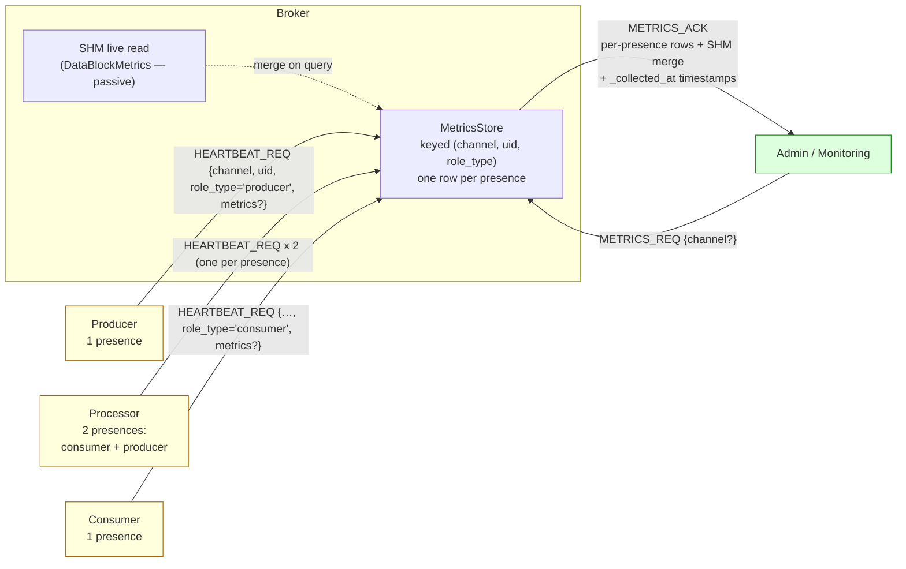
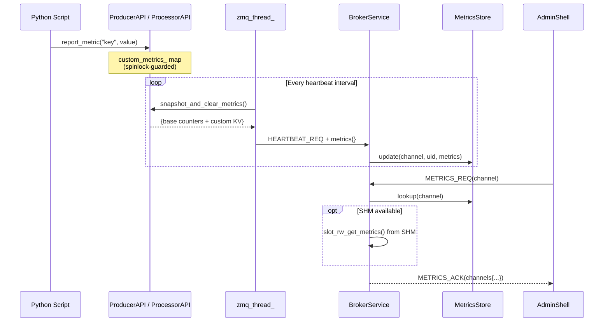

# HEP-CORE-0019: Metrics Plane

| Property       | Value                                                                            |
|----------------|----------------------------------------------------------------------------------|
| **HEP**        | `HEP-CORE-0019`                                                                  |
| **Title**      | Metrics Plane — Passive SHM Metrics, Broker-Initiated Pull, Global Role Table |
| **Status**     | **Phase 6 — Per-presence keying — ✅ SHIPPED 2026-05-11 (Wave M1.4).**  Phase 1-5 (Layer 1) shipped 2026-03-05; Layer 2 (paper-only nudge model) never shipped.  M1.4 retired `METRICS_REPORT_REQ` + `metrics_store_` in full; metrics live exclusively on `RolePresence::latest_metrics` and route through `HubState::channel_metrics_snapshot(channel)`. |
| **Created**    | 2026-03-02                                                                        |
| **Area**       | Framework Architecture (`pylabhub-utils`, all binaries, `BrokerService`)          |
| **Depends on** | HEP-CORE-0002 (DataHub), HEP-CORE-0007 (Protocol), HEP-CORE-0017 (Pipeline), HEP-CORE-0023 (Heartbeat semantics), HEP-CORE-0033 §8 (HubState entry types — `RolePresence::latest_metrics`, `RolePresence::metrics_collected_at` are per-presence rows under `RoleEntry::presences[]`), HEP-CORE-0033 §18 (broker routing classes — METRICS_REQ is Class C, HEARTBEAT_REQ metrics piggyback is Class A) |

> **Design layer history.**  This HEP records three layered designs.
> Sections below are tagged with which layer applies; readers should
> treat the **Phase 6 (current normative)** content as authoritative
> and the earlier layers as historical context.
>
> **Layer 1 — Phase 1-5, "original" (2026-03-02 → 2026-03-05).**
> Producer/processor piggyback metrics on every `HEARTBEAT_REQ`;
> consumer pushes metrics via a separate `METRICS_REPORT_REQ`.  All
> five sub-phases (§9) shipped.  Code state today still matches this
> layer with two latent bugs: consumer's heartbeat is treated as if
> it came from the channel's producer-role (refreshing the producer's
> liveness bookkeeping) because the wire payload omits `uid` /
> `role_type` and the broker derives both from
> `channel.producer_role_uid`; consequently the consumer's metrics
> piggyback gets attributed to the producer's `RoleEntry` row.  See
> the Phase 6 design draft §1 for the full bug analysis.
>
> **Layer 2 — Phase 2 "nudge + on-demand heartbeat" (2026-03-25, paper-only).**
> §2.1 + §3 + §4.1-4.3 propose a model where heartbeats are
> liveness-only by default and metrics ride on an enriched heartbeat
> only after a `METRICS_COLLECT_REQ` nudge from the broker.  This
> design **never shipped** — neither `METRICS_COLLECT_REQ` nor the
> nudge handling exist in code.  Retained in this HEP as a deferred
> design alternative; not the path forward.
>
> **Layer 3 — Phase 6 "per-presence keying" (✅ SHIPPED 2026-05-11, Wave M1.4).**
> Heartbeats unconditionally carry `(channel_name, uid, role_type)` +
> optional metrics.  Each presence (one per `(hub, channel, role_kind)`
> tuple a role registers as) emits its own heartbeat.  Metrics live
> directly on `RolePresence::latest_metrics` (per-presence row in
> `HubState`), written by `_on_heartbeat`.  A processor with two
> presences (consumer-of-in_channel + producer-of-out_channel) writes
> two distinct rows.  Each heartbeat refreshes only its own presence
> row — there is no separate channel-side bookkeeping; channel
> observability is derived from the producer-role's per-presence
> state (HEP-CORE-0023 §2.6).
>
> `METRICS_REPORT_REQ` is **RETIRED** (Wave M1.4, 2026-05-11) — the
> wire-protocol message, role-side sender, broker-side handler, and
> the broker's `metrics_store_` table are ALL deleted.  Old clients
> sending the retired message receive UNKNOWN_MSG_TYPE.
> `broker_proto_major` bumped 1 → 2 to signal the break.  Admin
> queries (`METRICS_REQ`) route through
> `HubState::channel_metrics_snapshot(channel)` which reads the
> per-presence rows directly.
>
> See `HEP-CORE-0033 §18` for the canonical four-class routing
> taxonomy that places metrics piggyback in Class A and metrics
> queries in Class C.

---

## 1. Motivation

The current system has metrics scattered across three independent mechanisms:

1. **SHM-level** (`DataBlockMetrics` in `SharedMemoryHeader`): contention counters,
   race detection, reader peaks — baked into the memory layout, always updated,
   but only readable by processes that have the SHM segment mapped.

2. **Per-binary counters** (`in_slots_received`, `out_slots_written`, `drops`,
   `script_error_count`): maintained by each API object, accessible from Python
   scripts, but never transmitted anywhere.

3. **Heartbeat** (`HEARTBEAT_REQ`): carries `{channel_name, producer_pid}` — a
   bare liveness signal with no metrics payload.

**What's missing:**

- No centralized view of pipeline health — an operator cannot ask the broker
  "what's the throughput on channel X?" or "how many drops has the processor seen?"
- No way for scripts to report custom domain metrics (e.g., "events above threshold",
  "calibration drift") to a central collector.
- SHM metrics are siloed per-segment; cross-segment comparisons require mapping
  every SHM block manually.

**This HEP introduces the Metrics Plane** — a fifth communication plane (extending
HEP-CORE-0017 §2) that unifies passive SHM monitoring and voluntary ZMQ reporting
through the broker as the single aggregation point.

---

## 2. Design Principles (Phase 6 — current normative)

1. **Passive SHM, active ZMQ**: SHM metrics are always being collected (they're
   embedded in `SharedMemoryHeader`). ZMQ metrics are collected by roles and
   reported via heartbeat to the broker.

2. **Broker maintains a per-presence metrics table.**  Each presence
   (one per `(hub, channel, role_kind)` a role participates as)
   writes one row keyed `(channel_name, uid, role_type)`.  Monitoring
   tools query the broker; the broker never relays metrics between
   participants.

3. **Heartbeat carries identity + optional metrics.**  `HEARTBEAT_REQ`
   always carries `channel_name`, `uid`, and `role_type` — enough to
   identify the sending presence.  When the role has new metrics to
   report, it includes a `metrics` field with the snapshot.  Each
   heartbeat refreshes only its **own** `(uid, role_type)` presence
   row in `RoleEntry` (advancing that presence's Connected ↔ Pending
   FSM per HEP-CORE-0023 §2.1) and writes its own
   `MetricsStore[(channel, uid, role_type)]` row — no heartbeat
   touches another presence's bookkeeping.  Same-host consumer
   liveness is also tracked independently via OS PID check + ZMTP
   socket monitoring as a faster reap signal.  See HEP-CORE-0023
   §2.5 for the timeout math.

4. **Per-presence emission.**  A role with N presences emits N
   heartbeats per cycle, each carrying its own (channel, uid,
   role_type) tuple, all over the appropriate `BrokerRequestComm`
   (which may be one connection or multiple after dedup — see
   HEP-CORE-0033 §19).  Producer / consumer / single-hub processor
   each emit 1 / 1 / 2 heartbeats respectively over their single
   DEALER socket; dual-hub processor emits 1 + 1 over two sockets.

5. **Scripts extend via `api.report_metric()`**: Custom key-value metrics are
   accumulated on the API object and included in the next heartbeat-borne
   metrics payload.  Zero configuration — just call the API.

6. **SHM metrics read locally**: Processes that have SHM mapped can read
   `DataBlockMetrics` directly (zero-copy, no ZMQ). The broker also reads SHM
   metrics for channels it knows about, merging them into the aggregated view.

7. **`METRICS_REPORT_REQ` is deprecated.**  The wire-protocol message
   stays one release for backward compatibility (the broker still
   handles it and writes to the same per-presence metrics table) but
   no role auto-emits it after the Phase 6 migration — consumer-side
   metrics now ride on the consumer's own heartbeat per Principle 4.

### 2.1 Phase 2 (paper-only nudge model — superseded by Phase 6)

(Historical note, retained for traceability.  The 2026-03-25 redesign
proposed a "nudge + on-demand heartbeat" model: heartbeats would be
liveness-only and metrics would ride on an enriched heartbeat only
after a `METRICS_COLLECT_REQ` from the broker.  That design never
shipped — neither `METRICS_COLLECT_REQ` nor the nudge handling exist
in code.  Phase 6 supersedes it with always-on metrics piggyback,
which removes the round-trip latency and matches what the role-side
code already does.)

---

## 3. Architecture (Phase 6 — current normative)



The data plane is per-presence:

- A producer role has 1 presence → 1 heartbeat per cycle → 1 metrics row.
- A consumer role has 1 presence → 1 heartbeat per cycle → 1 metrics row.
- A single-hub processor has 2 presences (consumer-of-in_channel +
  producer-of-out_channel) → 2 heartbeats per cycle over 1 DEALER
  socket (the connection deduplicates because both presences resolve
  to the same `(broker_endpoint, broker_pubkey)` pair) → 2 distinct
  rows in the broker's metrics store.
- A dual-hub processor has 2 presences → 2 heartbeats per cycle over
  2 DEALER sockets → 2 rows, one per hub.

Channel-FSM refresh is producer-only (Principle 3 above).
Consumer-presence heartbeats refresh `RoleEntry(uid).last_heartbeat`
(informational) and write the consumer's metrics row, but do NOT
touch `channel(name).last_heartbeat` — that's producer authority.

### 3.1 Message flows (Phase 6)

**Heartbeat** (per-presence, role → broker, periodic):

| Field | Required | Description |
|---|---|---|
| `channel_name` | yes | Channel this presence is registered on |
| `uid` | yes | Role's unique identity (e.g. `prod.sensor.aabbccdd`) |
| `role_type` | yes | `"producer"` or `"consumer"` (a processor's two presences send two heartbeats with distinct role_types) |
| `producer_pid` | yes (back-compat field) | Sending process PID — retained from Phase 1 wire format |
| `metrics` | optional | Snapshot of role-side metrics (`snapshot_metrics_json()`) when the role has new data; omit when nothing has changed since the last heartbeat |

A role with N presences emits N heartbeats per cycle.  Each
heartbeat carries the right `role_type` for its presence — even when
the same role process has multiple presences on the same hub
(processor in single-hub deployment), the two heartbeats land in two
distinct rows of the broker's metrics store.

**Broker handler** (`handle_heartbeat_req`):

1. Read `(channel_name, uid, role_type)` from the payload.
2. Look up the matching presence row:
   `RoleEntry(uid).find_presence(channel_name, role_type)`.
3. Refresh that presence's `last_heartbeat` and advance its
   Connected ↔ Pending FSM transition (HEP-CORE-0023 §2.1).
4. If a `metrics` payload is present, write it under
   `MetricsStore[(channel_name, uid, role_type)]`.

The handler never reaches into `ChannelEntry` for liveness
bookkeeping — `ChannelEntry` no longer stores `last_heartbeat` or
`status` (HEP-CORE-0023 §2.6).  The producer-presence row's state
is what makes a channel observable as live.

**Metrics query** (admin → broker):

| Step | Message | Direction | Content |
|---|---|---|---|
| 1 | `METRICS_REQ` | Admin → Broker | `{channel_name?}` (omit for all channels) |
| 2 | broker walks `MetricsStore` keyed `(channel, uid, role_type)`; merges live SHM `DataBlockMetrics` (§3.2); composes `_collected_at` per row | | |
| 3 | `METRICS_ACK` | Broker → Admin | Aggregated view: per-channel rows for `producer_metrics` + `consumers[uid]` map |

No `METRICS_COLLECT_REQ` round-trip is involved — the broker
returns whatever rows are currently in the store (last-known
metrics).  Roles refresh those rows on every heartbeat that
carries a `metrics` payload.
The broker returns immediately to the admin with whatever is currently in the
global table (may be stale). The admin can poll again after one heartbeat interval
(~1-2s) to get fresh data.

**SHM metrics are always fresh**: the broker reads `DataBlockMetrics` directly
from SharedMemoryHeader on every `METRICS_REQ`. These are low-level SHM counters
(contention, timeouts, reader peaks). Role-level metrics (timing, drops, loop
overrun) require the nudge+heartbeat path because they are process-local.

**Heartbeat with vs without metrics**: most heartbeats are bare `{channel_name,
uid, role_type}`. Only the heartbeat immediately after a `METRICS_COLLECT_REQ`
nudge carries the `metrics` field. The flag is cleared after one enriched heartbeat.

**SHM metrics** (broker reads directly, on query):

The broker reads `DataBlockMetrics` from SharedMemoryHeader for channels it
can access. These are merged into the `METRICS_ACK` response under the `shm`
key (unchanged from Phase 1).

### 3.2 Global role table

The broker maintains a table indexed by `(channel_name, uid)`:

```json
{
  "sensor.data": {
    "PROD-Sensor-AABBCCDD": {
      "role_type": "producer",
      "last_heartbeat": "2026-03-25T10:30:00.123Z",
      "metrics": {
        "base": {
          "out_written": 50042,
          "drops": 3,
          "iteration_count": 50045,
          "loop_overrun_count": 0,
          "last_cycle_work_us": 150,
          "script_errors": 0,
          "data_drop_count": 0,
          "last_iteration_us": 10012,
          "max_iteration_us": 15200,
          "last_slot_wait_us": 45,
          "last_slot_exec_us": 9800,
          "configured_period_us": 10000,
          "context_elapsed_us": 500420000,
          "ctrl_queue_dropped": 0
        },
        "custom": {
          "events_above_threshold": 127
        }
      },
      "metrics_timestamp": "2026-03-25T10:29:58.456Z"
    },
    "CONS-Display-11223344": {
      "role_type": "consumer",
      "last_heartbeat": "2026-03-25T10:30:01.789Z",
      "metrics": { ... },
      "metrics_timestamp": "2026-03-25T10:29:59.012Z"
    }
  }
}
```

**Lifecycle:**
- Entry created on first `HEARTBEAT_REQ` from a role
- `last_heartbeat` updated on each heartbeat
- `metrics` + `metrics_timestamp` updated on each `METRICS_COLLECT_ACK`
- Entry removed on `DISC_ACK` (role deregistered) or heartbeat timeout

### 3.3 Phase 6 changes (vs. Phase 1 baseline)

- **Heartbeat wire payload gains `uid` + `role_type`** — required.
  Pre-Phase-6 broker handlers ignored these fields harmlessly; the
  Phase 6 broker handler requires them.  See HEP-CORE-0023 §2.2 for
  the updated sequence diagram.
- **Per-presence keying**: `MetricsStore` is keyed `(channel, uid,
  role_type)` instead of channel-keyed.  A processor with two
  presences writes two rows; admin queries can filter by any
  combination.
- **Channel-FSM refresh becomes producer-only**: consumer-presence
  heartbeats refresh role-level liveness only; the channel's Pending
  ↔ Ready transition is driven exclusively by producer-presence
  heartbeats.  Fixes the "consumer keeps a dead-producer channel
  artificially Ready" bug.
- **`METRICS_REPORT_REQ` is deprecated** as a periodic role-side
  emission.  The wire-protocol message and broker handler stay one
  release for backward compatibility; admin tools may continue
  sending metrics this way during the transition.  After Phase 6
  migration, no role auto-emits it — consumer-side metrics now ride
  on the consumer's own heartbeat.

### 3.3a Phase 2 nudge-design content (paper-only — never shipped)

The 2026-03-25 redesign proposed a `METRICS_COLLECT_REQ` nudge from
broker to roles, with metrics riding on an "enriched" heartbeat
returned from the next cycle.  None of that machinery exists in code:
no `METRICS_COLLECT_REQ` wire type, no enriched-heartbeat flag, no
`METRICS_COLLECT_ACK`.  Phase 6 supersedes this design — roles emit
metrics on every heartbeat where they have new data, with no
broker-driven prompt — which removes the round-trip latency and
matches the role-side code that already ships metrics on every
heartbeat.

---

## 4. Protocol Extensions (Phase 6)

### 4.1 `HEARTBEAT_REQ` (per-presence)

Every presence sends one heartbeat per cycle:

```json
{
  "msg_type": "HEARTBEAT_REQ",
  "channel_name": "sensor.data",
  "uid":          "prod.sensor.aabbccdd",
  "role_type":    "producer",
  "producer_pid": 12345,
  "metrics": {
    "base":   { ... per-presence base counters ... },
    "custom": { ... user `api.report_metric()` keys ... }
  }
}
```

`role_type` is `"producer"` or `"consumer"`.  A processor role
emits two heartbeats per cycle — one with `role_type="consumer"`
(for its in_channel presence) and one with `role_type="producer"`
(for its out_channel presence) — over the appropriate connection(s)
per HEP-CORE-0033 §19.

The `metrics` field is OPTIONAL.  Roles emit it whenever they have
new data (today's `snapshot_metrics_json()` clears-on-read; sending
on every heartbeat is the simplest correct behaviour).  The broker
stores the snapshot in `MetricsStore[(channel, uid, role_type)]`
with a `_collected_at` timestamp.

`producer_pid` is retained from the Phase 1 wire format for
backward audit / diagnostic purposes — the broker only uses it for
an ERROR log when missing or zero.

### 4.2 `METRICS_REQ` / `METRICS_ACK` (admin → broker)

Direct query against the broker's `MetricsStore`.  No role-side
round-trip involved.

**Request:**
```json
{
  "msg_type":     "METRICS_REQ",
  "channel_name": "sensor.data"        // optional; omit for all channels
}
```

**Response (`METRICS_ACK`)** — per-channel rows aggregating each
presence registered on the channel.  Producer-presence rows appear
under `producer`; consumer-presence rows appear in the `consumers`
list keyed by uid.  Each row has its own `_collected_at` timestamp
(when the broker last received an update for that
`(channel, uid, role_type)` tuple) and `last_report` (alias) for
back-compat with Phase 1-5 admin tools.

```json
{
  "msg_type": "METRICS_ACK",
  "status":   "success",
  "channels": {
    "sensor.data": {
      "producer": {
        "uid": "prod.sensor.a1b2c3d4",
        "pid": 1234,
        "_collected_at": "2026-03-02T14:30:01.234Z",
        "base": {
          "out_written":     50042,
          "drops":           3,
          "script_errors":   0,
          "iteration_count": 50045
        },
        "custom": {
          "events_above_threshold": 127,
          "avg_processing_ms":      2.3
        }
      },
      "consumers": [
        {
          "uid": "cons.logger.a1b2c3d4",
          "pid": 5678,
          "_collected_at": "2026-03-02T14:30:00.891Z",
          "base": {
            "in_received":     49980,
            "script_errors":   0,
            "iteration_count": 49981
          },
          "custom": {
            "bytes_logged": 2048576
          }
        }
      ],
      "shm": {
        "write_lock_contention": 12,
        "writer_timeout_count":  0,
        "reader_race_detected":  3,
        "reader_peak_count":     2
      }
    }
  }
}
```

The `shm` section is populated on-demand when the broker can access
the SHM segment.  If the SHM is unavailable (e.g., ZMQ-only channel),
`shm` is omitted.

For a processor, both its `(in_channel, proc_uid, "consumer")` row
(under `channels.in_channel.consumers[]`) and its
`(out_channel, proc_uid, "producer")` row (under
`channels.out_channel.producer`) appear in the response —
admin tools can correlate the two by uid to get the full per-cycle
picture for the processor.

### 4.3 Deprecated: `METRICS_REPORT_REQ`

The Phase 1 message type for consumer-pushed metrics.  Wire format:

```json
{
  "msg_type":     "METRICS_REPORT_REQ",
  "channel_name": "sensor.data",
  "uid":          "cons.monitor.aabbccdd",
  "metrics":      { ... }
}
```

**Deprecated under Phase 6.**  No role auto-emits this after the
migration — consumer-side metrics now ride on the consumer's own
`HEARTBEAT_REQ` (§4.1).  The broker retains the handler one
release for backward compatibility (writes the same per-presence
metrics row); admin tools that previously pushed via this path
continue to work during the transition.  The handler is
scheduled for removal in the release after the Phase 6 migration
completes.

### 4.4 Deferred: `METRICS_COLLECT_REQ` nudge model (never shipped)

(Historical, retained for traceability.)  The 2026-03-25 paper
design proposed a broker → role nudge that would set a
`metrics_requested_` flag on the role; the role would then
include metrics in the next heartbeat and clear the flag.  Neither
the wire message nor the role-side flag exist in code; Phase 6's
always-on metrics piggyback supersedes this design and removes
the round-trip latency.

---

## 5. Script API

### 5.1 `api.report_metric(key, value)`

Available on all three API objects (`ProducerAPI`, `ConsumerAPI`, `ProcessorAPI`).

```python
def on_produce(out_slot, fz, msgs, api):
    # ... write data ...
    api.report_metric("events_above_threshold", count)
    api.report_metric("avg_processing_ms", elapsed)
    return True
```

- `key`: string, max 64 chars, alphanumeric + `._-`
- `value`: numeric (`int` or `float`), stored as `double`
- Metrics accumulate in a `std::unordered_map<std::string, double>` on the API
  object, guarded by a lightweight spinlock (updated from the script thread,
  read from the zmq thread that builds heartbeat payloads).
- The map is **snapshot-and-clear** on each heartbeat: the zmq thread takes a
  copy, clears the map, and serializes the copy into the heartbeat JSON.

### 5.2 `api.report_metrics(dict)`

Batch variant for efficiency:

```python
api.report_metrics({
    "events_above_threshold": count,
    "avg_processing_ms": elapsed,
    "calibration_drift_ppm": drift,
})
```

### 5.3 `api.clear_metrics()`

Clears all custom metrics. Base counters are never cleared.

### 5.4 Hierarchical metrics serialization architecture

All metrics output (heartbeat JSON, Python `api.metrics()`, Lua `api.metrics()`) follows
a hierarchical structure with 5 top-level groups:

```
{
    "queue":  { ... },    // or "in_queue"/"out_queue" for processor
    "loop":   { ... },
    "role":   { ... },
    "inbox":  { ... },    // only if inbox configured
    "custom": { ... }
}
```

Each group except `role` and `custom` has an X-macro that defines its canonical field list:

| Macro | Header | Struct |
|-------|--------|--------|
| `PYLABHUB_QUEUE_METRICS_FIELDS` | `hub_queue.hpp` | `QueueMetrics` (13 fields) |
| `PYLABHUB_LOOP_METRICS_FIELDS` | `role_host_core.hpp` | `LoopMetricsSnapshot` (3 fields) |
| `PYLABHUB_INBOX_METRICS_FIELDS` | `hub_inbox_queue.hpp` | `InboxMetricsSnapshot` (3 fields) |

Each output format provides adapter functions that expand the macros:

| Output | Header | Namespace |
|--------|--------|-----------|
| JSON (`nlohmann::json`) | `queue_metrics_json.hpp` | `pylabhub::hub` |
| Python (`py::dict`) | `queue_metrics_pydict.hpp` | `pylabhub::scripting` |
| Lua (table) | `queue_metrics_lua.hpp` | `pylabhub::scripting` |

`role` fields vary per role type (no X-macro). `custom` is user-defined (string→double map).

Adding a new metric: (1) add to the struct, (2) add one line to the X-macro.
All serialization targets pick it up at compile time.

See HEP-CORE-0008 §6.1 for the full field list and per-role dict layout.

---

## 6. Broker-side Storage

### 6.1 `MetricsStore`

A simple in-memory store keyed by `(channel_name, participant_uid)`:

```cpp
struct ParticipantMetrics
{
    std::string uid;
    uint64_t    pid          = 0;
    TimePoint   last_report;

    // Base counters (atomic snapshot from last report)
    uint64_t in_received     = 0;
    uint64_t out_written     = 0;
    uint64_t drops           = 0;
    uint64_t script_errors   = 0;
    uint64_t iteration_count = 0;

    // Custom KV (last reported values)
    std::unordered_map<std::string, double> custom;
};

struct ChannelMetrics
{
    ParticipantMetrics           producer;
    std::vector<ParticipantMetrics> consumers;
};

// Keyed by channel name
std::unordered_map<std::string, ChannelMetrics> store_;
```

- Updated on every `HEARTBEAT_REQ` (producer/processor) and every
  `METRICS_REPORT_REQ` (consumer).
- Entries removed when a channel is deregistered or a consumer deregisters.
- **No history** — only the latest snapshot is retained. Time-series collection
  is the responsibility of external monitoring tools that poll `METRICS_REQ`.

### 6.2 SHM metrics read

On `METRICS_REQ`, the broker attempts to open the channel's SHM segment
read-only and call `slot_rw_get_metrics()` to populate the `shm` section.
If the SHM segment is unavailable or the channel uses ZMQ-only transport,
the `shm` field is omitted.

---

## 7. Integration with HEP-CORE-0017 (Pipeline Architecture)

HEP-CORE-0017 §2 now defines five planes: Data, Control, Message, Timing, and Metrics.

This HEP adds a **fifth plane: Metrics**:

| Plane | What flows | Mechanism | Where defined |
|-------|-----------|-----------|---------------|
| **Metrics plane** | Counter snapshots, custom KV pairs | Piggyback on per-presence `HEARTBEAT_REQ` (Phase 6 — every presence, including consumers, carries an optional `metrics` field on its own heartbeat); `METRICS_REQ/ACK` (admin query). `METRICS_REPORT_REQ` retained one release for back-compat — see §4.3. | HEP-CORE-0019 |

The metrics plane is **read-only from the broker's perspective** — participants
report in, the broker aggregates and serves queries, but never pushes metrics
to participants or alters behavior based on metric values.

---

## 8. Data Flow Summary



---

## 9. Implementation Phases


### Phase 1: C++ infrastructure ✅ (historical)

1. Added `custom_metrics_` map + `InProcessSpinState` to `ProducerAPI`, `ConsumerAPI`,
   `ProcessorAPI`
2. Added `report_metric()`, `report_metrics()`, `clear_custom_metrics()` methods
3. Added `snapshot_metrics_json()` for zmq thread consumption (snapshot-and-clear)
4. Added `MetricsStore` to `BrokerService` (Pimpl-internal, guarded by `m_query_mu`)

### Phase 2: Heartbeat extension (producer + processor) ✅ (historical)

1. Extended heartbeat-message wire format with optional `metrics` field
   (originally `Messenger::enqueue_heartbeat(channel, json metrics)`;
   now via `BrokerRequestComm::send_heartbeat`).
2. In role-side ctrl thread: `api_.snapshot_metrics_json()` → pass to
   `send_heartbeat()` via the periodic-task scheduler.
3. Broker: `handle_heartbeat_req()` extracts `metrics` field, updates `MetricsStore`.

### Phase 3: Consumer metrics reporting ✅ (historical — deprecated by Phase 6)

1. Added `METRICS_REPORT_REQ` message type.
2. Consumer ctrl thread: periodic task sends `METRICS_REPORT_REQ`
   with base counters + custom metrics.
3. Broker: `handle_metrics_report_req()` updates `MetricsStore`.

(Under Phase 6, the consumer-side periodic task is removed; consumer
metrics ride on consumer's own `HEARTBEAT_REQ` instead.  The
broker-side `METRICS_REPORT_REQ` handler stays one release for
backward compatibility — see §4.3.)

### Phase 4: Query API ✅ (historical, mostly)

1. Added `METRICS_REQ`/`METRICS_ACK` handler to `BrokerService`.
2. SHM `DataBlockMetrics` read deferred (not included in Phase 4 — query returns ZMQ-reported metrics only).
3. Exposed via AdminService: `query_metrics(channel)` → JSON.
4. **Phase 6 update**: response shape gains the per-presence
   `(channel, uid, role_type)` keying; `producer_metrics` and
   `consumers[uid]` rows each carry `_collected_at` timestamps.

### Phase 5: Python bindings ✅ (historical)

1. Bound `api.report_metric(key, value)`, `api.report_metrics(dict)`,
   `api.clear_custom_metrics()` in all three `PYBIND11_EMBEDDED_MODULE` blocks.
2. Defaults applied at pybind11 level only (per pybind11 Default Parameter Rule —
   `docs/IMPLEMENTATION_GUIDANCE.md` § "pybind11 Default Parameter Rule").

### Phase 6: Per-presence keying ✅ shipped (Wave M1.4, 2026-05-11)

Resolves the latent bugs in Phase 1-5 where consumer's HEARTBEAT_REQ
(carrying no `uid` / `role_type`) was silently attributed to the
channel's producer-role in both `MetricsStore` and the producer-
role's `RoleEntry` liveness bookkeeping.

1. ✅ **Wire-format addition**: `HEARTBEAT_REQ` payload gains required
   `uid` and `role_type` fields.
2. ✅ **Broker handler keyed lookup**: `handle_heartbeat_req` reads
   `(channel, uid, role_type)`, looks up the matching presence row in
   `RoleEntry(uid)`, refreshes `last_heartbeat` + FSM, writes metrics
   to `RolePresence::latest_metrics`.
3. ✅ **Consumer-side heartbeat fix**: consumer's own heartbeat
   carries `role_type="consumer"` and writes its own row.
4. ✅ **Per-presence emission**: a role with N presences emits N
   heartbeats per cycle, each with the right `(uid, role_type)`.
5. ✅ **`METRICS_REPORT_REQ` retired** (Wave M1.4, 2026-05-11): the
   wire-protocol message + broker handler + role-side sender are
   **all deleted**.  Metrics piggyback on `HEARTBEAT_REQ` exclusively.
   Was kept "one release for compat" in earlier plan; M1.4 retired it
   in full as it was redundant (heartbeat + metrics-report were sent
   at the same cadence with the same payload).
6. ✅ **`metrics_store_` legacy retired** (Wave M1.4): the broker's
   separate `metrics_store_` map (and `ChannelMetrics` /
   `ParticipantMetrics` / `update_producer_metrics` /
   `update_consumer_metrics` / `query_metrics(channel)`) are all
   **deleted**.  Admin queries route through
   `HubState::channel_metrics_snapshot(channel)` which reads
   `RolePresence::latest_metrics` directly.  Closes H34 (per-uid
   leak class structurally — Wave M3 H18 erases presence rows on
   disconnect, so dead metrics naturally go away).
7. ✅ **`ChannelEntry.status` / `ChannelEntry.last_heartbeat` removed**
   (commit `a41ce71`): channel observability derived from the
   producer-presence FSM (HEP-CORE-0023 §2.6).

**Wave M1.4 implementation summary (2026-05-11):**
- `HubState::channel_metrics_snapshot(channel)` aggregates per-
  presence rows for admin queries (O(producers + consumers)).
- `BrokerService::query_metrics(MetricsFilter)`,
  `BrokerService::query_metrics_json_str`,
  `BrokerServiceImpl::handle_metrics_req` redirected to use the
  helper.
- L2 contract pinned by `HubStateChannelMetricsSnapshot.*` tests
  (6 tests in `test_hub_state.cpp`).  L3 test migrated to use
  `send_heartbeat(channel, uid, "consumer", metrics)` instead of
  the retired `send_metrics_report`.
- 1828/1828 tests pass post-M1.4.

### Test coverage

- 10 `MetricsPlaneTest` (protocol round-trip: heartbeat with metrics, METRICS_REPORT_REQ,
  METRICS_REQ/ACK, consumer metrics, all-channels query, unknown channel, update overwrites,
  multi-consumer, empty custom, backward compat)
- 9 `MetricsApiTest` (API unit: report_metric, report_metrics, snapshot_metrics_json,
  snapshot clears, clear_custom_metrics, base counters, thread safety, pybind11-linked)
- **Total: 19 new tests; 828/828 passing (2026-03-05)**

---

## 10. Non-Goals

- **Time-series storage**: The broker holds only the latest snapshot. Historical
  data is the responsibility of external tools.
- **Alerting / thresholds**: The broker does not evaluate metric values. A future
  HEP could add threshold-based `CHANNEL_WARNING_NOTIFY` messages.
- **Metric push to participants**: The broker never sends metrics to producers
  or consumers. Information flows upward (participant → broker → query tool).
- **Prometheus / OpenTelemetry integration**: Out of scope for this HEP. A thin
  adapter that polls `METRICS_REQ` and exposes a scrape endpoint would be
  straightforward but is a separate concern.

---

## 11. Relationship to Existing Metrics

| Existing mechanism | Status under Phase 6 |
|---|---|
| `DataBlockMetrics` in SHM header | **Unchanged** — still updated passively. Broker reads on query and merges into the response. |
| Per-API counters (`in_received`, etc.) | **Extended + per-presence-keyed** — reported via the role's own heartbeat carrying `(uid, role_type)`; landed in `MetricsStore[(channel, uid, role_type)]`. |
| `iteration_count_` (internal) | **Included** in the base metrics payload — proves liveness quantitatively. |
| SHM heartbeat pool (consumer PIDs in header) | **Unchanged** — data-plane liveness, orthogonal to metrics plane. |
| `METRICS_REPORT_REQ` consumer-pushed metrics (Phase 3) | **Deprecated** — broker handler retained one release for back-compat; no role auto-emits.  Consumer metrics now ride on consumer's own `HEARTBEAT_REQ` per-presence. |

---

## 12. Source File Reference (current — Phase 6 implementation surface)

| Component | Source file | Role in the metrics plane |
|---|---|---|
| **RoleAPIBase** | `src/include/utils/role_api_base.hpp` + `src/utils/service/role_api_base.cpp` | `report_metric()` / `report_metrics()` / `clear_custom_metrics()` script-API surface; `snapshot_metrics_json()` (snapshot-and-clear); periodic heartbeat tick installed via `start_ctrl_thread` (Phase 6: per-presence) |
| **ProducerAPI / ConsumerAPI / ProcessorAPI** | `src/{producer,consumer,processor}/{producer,consumer,processor}_api.{hpp,cpp}` | pybind11 thin wrappers exposing the `RoleAPIBase` surface to Python scripts |
| **RoleHostCore** | `src/include/utils/role_host_core.hpp` + `src/utils/service/role_host_core.cpp` | Custom-metrics map (`custom_metrics_`), iteration counters, base loop metrics (HEP-0008) |
| **BrokerRequestComm** | `src/include/utils/broker_request_comm.hpp` + `src/utils/network_comm/broker_request_comm.cpp` | `send_heartbeat(channel, uid, role_type, metrics)` wire emission (sole metrics path post-M1.4); `send_metrics_report(...)` **DELETED** in Wave M1.4 (2026-05-11) |
| **BrokerService** | `src/include/utils/broker_service.hpp` + `src/utils/ipc/broker_service.cpp` | `handle_heartbeat_req()` (Phase 6: FSM-refresh + metrics write via `_on_heartbeat`); `handle_metrics_report_req()` **DELETED** in Wave M1.4; `handle_metrics_req()` routes through `HubState::channel_metrics_snapshot` |
| **HubState** | `src/include/utils/hub_state.hpp` + `src/utils/ipc/hub_state.cpp` | `_on_heartbeat()` capability op writes `RolePresence::latest_metrics`; `channel_metrics_snapshot(channel)` aggregates per-presence rows for admin queries; legacy `metrics_store_` retired by Wave M1.4 |
| **Hub-side query** | `src/utils/ipc/admin_service.cpp` (HEP-CORE-0033 §11) | `query_metrics(channel)` admin RPC; returns the `METRICS_ACK` shape from §4.2 |
| **Tests (broker protocol)** | `tests/test_layer3_datahub/test_datahub_metrics.cpp` | `MetricsPlaneTest` suite — heartbeat-with-metrics (producer + consumer per-presence), per-presence keying (Phase 6), all-channels query, SHM merge.  L3 sender migrated from `send_metrics_report` to `send_heartbeat(..., "consumer", metrics)` in Wave M1.4 |
| **Tests (RoleAPIBase + RoleHostCore)** | `tests/test_layer2_service/test_role_host_core.cpp` + `test_role_api_base.cpp` | Custom-metrics map ops, snapshot semantics, periodic-tick installation conditions (Phase 6: only producer presences) |
