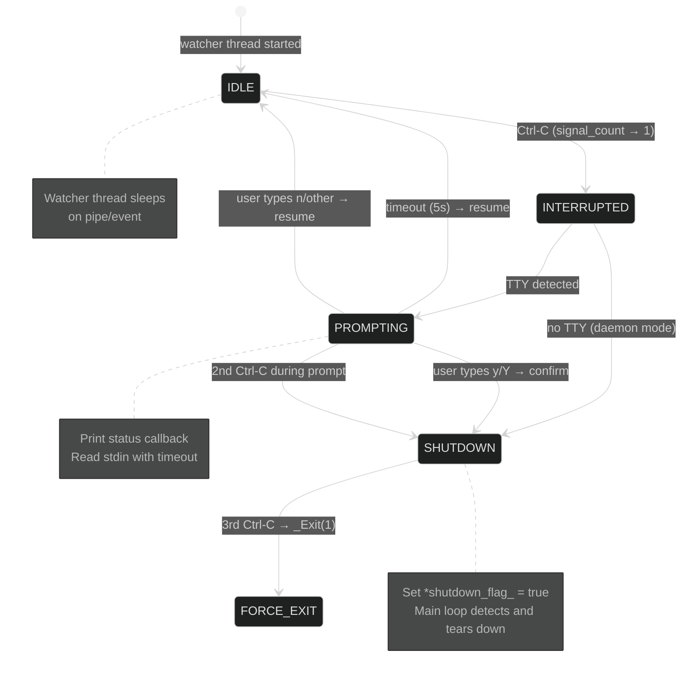

# HEP-CORE-0020: Interactive Signal Handler

| Property       | Value                                                                          |
|----------------|--------------------------------------------------------------------------------|
| **HEP**        | `HEP-CORE-0020`                                                                |
| **Title**      | Interactive Signal Handler — Jupyter-style Ctrl-C with Status, Confirmation, and Resume |
| **Status**     | Implemented (2026-03-02). Updated 2026-04-25: `pylabhub-hubshell` and the per-role binaries referenced throughout this HEP have been retired; the role-side handler now lives under the unified `plh_role` (HEP-CORE-0024); the hub-side handler will return with the new `plh_hub` binary (HEP-CORE-0033 §15 Phase 9). Protocol semantics (3-press confirmation, status callback) are unchanged. |
| **Created**    | 2026-03-02                                                                      |
| **Area**       | Framework Infrastructure (`pylabhub-utils`, all binaries)                       |
| **Depends on** | HEP-CORE-0001 (Lifecycle), HEP-CORE-0017 (Pipeline Architecture)               |

---

## 1. Motivation

All four pyLabHub binaries handle Ctrl-C today, but each does it differently and none
provides the operator with useful context before shutting down:

| Binary | 1st Ctrl-C | 2nd Ctrl-C | Status info | Confirmation |
|--------|-----------|-----------|-------------|-------------|
| hubshell | Warn message | Graceful shutdown | None | None |
| producer | Immediate shutdown | `_Exit(1)` | None | None |
| consumer | Immediate shutdown | `_Exit(1)` | None | None |
| processor | Immediate shutdown | `_Exit(1)` | None | None |

**Problems:**

1. An operator accidentally pressing Ctrl-C kills a producer/consumer/processor
   instantly — no chance to reconsider.
2. No status information is shown: which config directory is this binary running from?
   What version? How many slots processed? Is it healthy?
3. The hubshell's three-press logic is hand-rolled and not reusable.
4. The three standalone binaries use a different (simpler) pattern — code duplication.
5. No timeout-and-resume: once you press Ctrl-C, shutdown is committed.

**Inspiration:** Jupyter Lab's Ctrl-C handler:

```
^C[I 2026-03-02 20:21:11] interrupted
Serving notebooks from: /home/user/work
    4 active kernels
    Jupyter Server 2.16.0 is running at: http://localhost:8888/lab
Shut down this Jupyter server (y/[n])?
[I 2026-03-02 20:21:16] No answer for 5s:
[I 2026-03-02 20:21:16] resuming operation...
```

**Goal:** A reusable, cross-platform `InteractiveSignalHandler` that any binary can use
by registering a status callback. On Ctrl-C: print status, prompt for confirmation,
resume on timeout.

---

## 2. Design Principles

1. **Cross-platform**: Works on Linux, macOS, and Windows. No POSIX-only APIs in
   the core logic. Platform-specific code isolated behind `plh_platform.hpp` helpers.

2. **Async-signal-safe**: The signal handler itself only sets atomic flags. All I/O
   (printing status, reading stdin) happens on a **dedicated watcher thread**, not in
   the signal handler.

3. **Module-agnostic**: Each binary registers a callback that returns a status string.
   The handler doesn't know about producers, consumers, or processors — it just calls
   the callback and prints the result.

4. **Composable with LifecycleGuard**: The handler doesn't own the shutdown path.
   It sets a flag; the binary's main loop polls that flag (existing pattern).

5. **Terminal-aware**: If stdin is not a TTY (piped, systemd, Docker), skip the
   interactive prompt and shut down immediately on first signal (daemon mode).

6. **No new threads in signal context**: The watcher thread is started once at init
   and sleeps until signaled via a flag or pipe.

---

## 3. User Experience

### 3.1 Interactive mode (TTY attached)

```
^C
[2026-03-02 20:21:11] pylabhub-producer interrupted

  pyLabHub v1.2.0 (pylabhub-producer)
  Config:    /home/user/pipelines/sensor/producer/
  UID:       PROD-SENSOR-A1B2C3D4
  Channel:   sensor_data
  Status:    running (1,204 slots written, 0 drops, 0 errors)
  Uptime:    2h 14m 37s

Shut down? (y/[n], 5s timeout)
```

**Case A — No answer within 5s:**
```
No answer for 5s — resuming operation.
```
The binary continues running. A subsequent Ctrl-C restarts the prompt cycle.

**Case B — User types `y` or `Y`:**
```
Shutdown confirmed.
```
Graceful shutdown proceeds (same as today's `g_shutdown = true` path).

**Case C — User types `n`, `N`, or anything else:**
```
Resuming operation.
```

**Case D — Second Ctrl-C during the prompt:**
```
Shutdown confirmed (double interrupt).
```
Immediate graceful shutdown, no further prompt.

**Case E — Third Ctrl-C (during teardown):**
```
Forced exit.
```
Calls `std::_Exit(1)` — same as today's double-signal behavior.

### 3.2 Non-interactive mode (no TTY)

```
[2026-03-02 20:21:11] pylabhub-producer: SIGINT received, shutting down.
```

Immediate graceful shutdown. No prompt, no timeout. Second signal = `_Exit(1)`.

---

## 4. Architecture

```
┌──────────────┐
│  main()      │
│              │
│  installs    │
│  std::signal │──► signal_handler()        [async-signal-safe]
│              │      sets g_signal_pending  [atomic flag]
│              │      writes 'S' to pipe    [wakeup, POSIX]
│              │                      OR
│              │      SetEvent(hEvent)      [wakeup, Windows]
│              │
│  creates     │
│  handler     │──► InteractiveSignalHandler
│              │      ├── watcher_thread_
│              │      │     sleeps on pipe/event
│              │      │     on wake: prints status, reads stdin
│              │      │     sets g_shutdown on confirm
│              │      │
│              │      ├── status_callback_   (registered by binary)
│              │      ├── shutdown_flag_      (pointer to binary's g_shutdown)
│              │      └── config
│              │            ├── timeout_s (default 5)
│              │            ├── binary_name
│              │            └── interactive (auto-detect via isatty)
│              │
│  polls       │
│  g_shutdown  │──► main loop exits → LifecycleGuard destructor → teardown
└──────────────┘
```

### 4.1 Signal handler (async-signal-safe)

The actual `signal(SIGINT, ...)` / `signal(SIGTERM, ...)` handler does only two things:

1. Atomically increment a **signal counter** (`g_signal_count`).
2. Wake the watcher thread:
   - **POSIX**: write one byte `'S'` to a self-pipe (`pipe(2)` / `pipe2(O_NONBLOCK)`)
   - **Windows**: `SetEvent(g_wake_event)`

No I/O, no malloc, no mutex — fully async-signal-safe.

### 4.2 Watcher thread

A dedicated thread that blocks on the wake mechanism (POSIX `poll()` on pipe fd,
Windows `WaitForSingleObject` on event). On wake:

1. Read the signal counter. If counter == 1 and interactive → prompt cycle.
   If counter >= 2 → immediate shutdown. If counter >= 3 → `_Exit(1)`.
2. **Print status**: call the registered `status_callback_()` which returns a
   `std::string`. Print it to stderr.
3. **Prompt**: print `"Shut down? (y/[n], 5s timeout) "` to stderr.
4. **Read stdin with timeout**:
   - **POSIX**: `poll()` on `{STDIN_FILENO, pipe_fd}` with timeout.
     If pipe_fd fires first (another Ctrl-C during prompt), treat as confirm.
   - **Windows**: `WaitForMultipleObjects({hStdinEvent, hWakeEvent}, timeout)`.
     Use `GetStdHandle(STD_INPUT_HANDLE)` + `ReadConsoleInput` for stdin.
5. **Evaluate response**: `y`/`Y` → confirm; timeout → resume; anything else → resume.
6. On confirm: set `*shutdown_flag_ = true`. On resume: reset state, go back to sleep.

### 4.3 Status callback

Each binary registers a callback with signature:

```cpp
using StatusCallback = std::function<std::string()>;
```

The callback runs on the watcher thread (not in the signal handler). It can safely
access atomics and read-only config. Example for producer:

```cpp
handler.set_status_callback([&config, &api]() -> std::string
{
    return fmt::format(
        "  pyLabHub {} (pylabhub-producer)\n"
        "  Config:    {}\n"
        "  UID:       {}\n"
        "  Channel:   {}\n"
        "  Status:    running ({} slots written, {} drops, {} errors)\n"
        "  Uptime:    {}",
        pylabhub::version_string(),
        config.config_dir(),
        config.uid(),
        config.channel(),
        api.out_slots_written(),
        api.out_drop_count(),
        api.script_error_count(),
        format_uptime(start_time));
});
```

### 4.4 Info shown per binary

| Field | Hub | Producer | Consumer | Processor |
|-------|-----|----------|----------|-----------|
| Version | `pylabhub::version_string()` | same | same | same |
| Binary name | `pylabhub-hubshell` | `pylabhub-producer` | `pylabhub-consumer` | `pylabhub-processor` |
| Config dir | `hub_dir` | `config.config_dir()` | `config.config_dir()` | `config.config_dir()` |
| UID | hub UID | producer UID | consumer UID | processor UID |
| Channel(s) | N channels (ready/pending) | channel name | channel name | in_channel / out_channel |
| Counters | channels ready, consumers | out_written, drops, errors | in_received, errors | in_received, out_written, drops, errors |
| Uptime | yes | yes | yes | yes |

---

## 5. Cross-Platform Implementation

### 5.1 Wake mechanism

| Platform | Wake | Block |
|----------|------|-------|
| POSIX (Linux, macOS) | `write(pipe_fd[1], "S", 1)` from signal handler | `poll({pipe_fd[0], STDIN_FILENO}, timeout_ms)` on watcher thread |
| Windows | `SetEvent(g_wake_event)` from signal handler | `WaitForMultipleObjects({hStdin, hWakeEvent}, timeout_ms)` on watcher thread |

The self-pipe trick is the standard POSIX pattern for waking a thread from a signal
handler without using mutexes or condition variables (which are not async-signal-safe).

On Windows, `SetEvent` is safe to call from a signal handler (the Windows CRT signal
mechanism runs the handler on the interrupted thread, not asynchronously).

### 5.2 TTY detection

```cpp
#if defined(PYLABHUB_IS_POSIX)
    bool is_interactive = ::isatty(STDIN_FILENO) && ::isatty(STDERR_FILENO);
#elif defined(PYLABHUB_IS_WINDOWS)
    bool is_interactive =
        (GetFileType(GetStdHandle(STD_INPUT_HANDLE)) == FILE_TYPE_CHAR) &&
        (GetFileType(GetStdHandle(STD_ERROR_HANDLE)) == FILE_TYPE_CHAR);
#endif
```

Non-interactive → skip prompt, immediate shutdown on first signal.

### 5.3 Stdin reading with timeout

**POSIX:**
```cpp
struct pollfd fds[2] = {
    {STDIN_FILENO,    POLLIN, 0},
    {pipe_fd_[0],     POLLIN, 0},   // wake pipe (another Ctrl-C)
};
int ret = ::poll(fds, 2, timeout_ms);
if (ret > 0 && (fds[1].revents & POLLIN))
    return PromptResult::DoubleInterrupt;  // another Ctrl-C during prompt
if (ret > 0 && (fds[0].revents & POLLIN)) {
    char buf[16];
    ssize_t n = ::read(STDIN_FILENO, buf, sizeof(buf));
    // parse y/n...
}
if (ret == 0)
    return PromptResult::Timeout;
```

**Windows:**
```cpp
HANDLE handles[2] = {
    GetStdHandle(STD_INPUT_HANDLE),
    g_wake_event_
};
DWORD ret = WaitForMultipleObjects(2, handles, FALSE, timeout_ms);
switch (ret) {
    case WAIT_OBJECT_0:     // stdin ready
        // ReadConsoleInput + parse
        break;
    case WAIT_OBJECT_0 + 1: // wake event (another Ctrl-C)
        return PromptResult::DoubleInterrupt;
    case WAIT_TIMEOUT:
        return PromptResult::Timeout;
}
```

### 5.4 Console output from watcher thread

All output goes to stderr (not stdout — stdout may be piped/redirected for data).
Uses `fmt::print(stderr, ...)` which is safe from a regular thread (not a signal handler).

---

## 6. API Design

### 6.1 Public header: `src/include/utils/interactive_signal_handler.hpp`

```cpp
namespace pylabhub
{

/// Status callback — returns a multi-line string to display on Ctrl-C.
/// Called on the watcher thread; may read atomics and config but must not block.
using SignalStatusCallback = std::function<std::string()>;

/// Configuration for the interactive signal handler.
struct SignalHandlerConfig
{
    std::string      binary_name;          ///< e.g. "pylabhub-producer"
    int              timeout_s     = 5;    ///< Prompt timeout (seconds)
    bool             force_interactive = false;  ///< Override TTY auto-detect
    bool             force_daemon      = false;  ///< Force non-interactive
};

/// Interactive Ctrl-C handler with Jupyter-style prompt.
///
/// Usage:
///   InteractiveSignalHandler handler(config, &g_shutdown);
///   handler.set_status_callback([&]() { return "..."; });
///   handler.install();          // installs signal handlers + starts watcher
///   // ... main loop polling g_shutdown ...
///   handler.uninstall();        // joins watcher thread, restores signals
///
/// Lifecycle: one instance per process. Must outlive the main loop.
class PYLABHUB_UTILS_EXPORT InteractiveSignalHandler
{
public:
    InteractiveSignalHandler(SignalHandlerConfig config,
                             std::atomic<bool> *shutdown_flag);
    ~InteractiveSignalHandler();

    InteractiveSignalHandler(const InteractiveSignalHandler &) = delete;
    InteractiveSignalHandler &operator=(const InteractiveSignalHandler &) = delete;

    /// Register the status callback (before or after install).
    void set_status_callback(SignalStatusCallback cb);

    /// Install signal handlers and start the watcher thread.
    void install();

    /// Stop the watcher thread and restore default signal disposition.
    void uninstall();

    /// True if install() has been called and uninstall() has not.
    bool is_installed() const noexcept;

private:
    struct Impl;
    std::unique_ptr<Impl> impl_;
};

}  // namespace pylabhub
```

### 6.2 Binary integration (example: producer)

```cpp
int main(int argc, char *argv[])
{
    std::atomic<bool> g_shutdown{false};

    pylabhub::InteractiveSignalHandler signal_handler(
        {.binary_name = "pylabhub-producer", .timeout_s = 5},
        &g_shutdown);
    signal_handler.install();

    // ... parse args, load config, create script host ...

    signal_handler.set_status_callback([&]() {
        return fmt::format(
            "  pyLabHub {} (pylabhub-producer)\n"
            "  Config:    {}\n"
            "  UID:       {}\n"
            "  Channel:   {}\n"
            "  Status:    running ({} written, {} drops, {} errors)\n"
            "  Uptime:    {}",
            pylabhub::version_string(),
            config.config_dir(), config.uid(), config.channel(),
            api.out_slots_written(), api.out_drop_count(),
            api.script_error_count(), format_uptime(start_time));
    });

    // Main loop (unchanged)
    while (!g_shutdown.load(std::memory_order_relaxed))
        std::this_thread::sleep_for(std::chrono::milliseconds(100));

    signal_handler.uninstall();
    // ... teardown ...
}
```

### 6.3 Hubshell integration

Hubshell's status callback can show richer info:

```cpp
signal_handler.set_status_callback([&]() {
    auto snap = broker.query_channel_snapshot();
    return fmt::format(
        "  pyLabHub {} (pylabhub-hubshell)\n"
        "  Config:    {}\n"
        "  UID:       {}\n"
        "  Channels:  {} ready, {} pending\n"
        "  Broker:    {}\n"
        "  Uptime:    {}",
        pylabhub::version_string(),
        config.hub_dir(), config.hub_uid(),
        snap.ready_count(), snap.pending_count(),
        config.broker_endpoint(),
        format_uptime(start_time));
});
```

---

## 7. State Machine



ASCII reference (same state machine):

```
                ┌──────────┐
                │  IDLE    │ ◄── watcher thread sleeping
                └────┬─────┘
                     │ Ctrl-C (signal_count → 1)
                     ▼
            ┌────────────────┐
   TTY? ────┤  INTERRUPTED   │
   │        └────────────────┘
   │              │ TTY                    │ no TTY
   │              ▼                        ▼
   │     ┌────────────────┐       ┌──────────────┐
   │     │  PROMPTING     │       │  SHUTDOWN     │ → set flag
   │     │  (print status,│       └──────────────┘
   │     │   read stdin)  │
   │     └───┬────┬───┬───┘
   │         │    │   │
   │    timeout   y   n / other
   │         │    │   │
   │         ▼    ▼   ▼
   │    ┌────────┐ ┌──────────┐ ┌──────────┐
   │    │ RESUME │ │ SHUTDOWN │ │  RESUME  │
   │    │→ IDLE  │ │→set flag │ │ → IDLE   │
   │    └────────┘ └──────────┘ └──────────┘
   │
   │   Ctrl-C during PROMPTING (signal_count → 2):
   │         ▼
   │    ┌──────────────────┐
   │    │ SHUTDOWN (double)│ → set flag
   │    └──────────────────┘
   │
   │   Ctrl-C after SHUTDOWN (signal_count → 3):
   │         ▼
   │    ┌──────────────────┐
   │    │ FORCE EXIT       │ → std::_Exit(1)
   │    └──────────────────┘
```

---

## 8. Interaction with `signal_shutdown()`

The three script-host binaries currently expose `signal_shutdown()` to poke the
interpreter thread from the signal handler. With `InteractiveSignalHandler`, the
signal handler no longer directly calls `signal_shutdown()`. Instead:

1. The watcher thread sets `*shutdown_flag_ = true` on confirmed shutdown.
2. The binary's main loop detects `g_shutdown == true` and calls
   `script_host->signal_shutdown()` from the main thread.
3. This is cleaner: the signal handler only sets atomics and wakes the watcher;
   all complex shutdown logic runs on proper threads.

The `g_*_script_ptr` global pattern (raw pointer stored for signal handler access)
is eliminated — the signal handler no longer needs to know about script hosts.

---

## 9. Implementation Phases

### Phase 1: Platform helpers

1. Add `platform::is_terminal(int fd)` / `platform::is_terminal(HANDLE)` to
   `plh_platform.hpp` — cross-platform TTY detection.
2. Add `platform::SelfPipe` (POSIX) / `platform::WakeEvent` (Windows) —
   async-signal-safe wakeup primitive.
3. Add `platform::read_stdin_with_timeout(int timeout_ms)` — cross-platform
   blocking stdin read with timeout.

### Phase 2: `InteractiveSignalHandler` implementation

1. `interactive_signal_handler.hpp` — public header (as in §6.1).
2. `interactive_signal_handler.cpp` — Pimpl implementation:
   watcher thread, signal installation, state machine, prompt logic.
3. Unit tests: signal counter logic, TTY detection, timeout behavior.

### Phase 3: Binary integration

1. Replace signal handling in all four `*_main.cpp` / `hubshell.cpp` with
   `InteractiveSignalHandler`.
2. Register status callbacks with config dir, UID, version, counters.
3. Remove the `g_*_script_ptr` global pattern — shutdown now flows through
   the main loop's `g_shutdown` flag.
4. Remove the hubshell's hand-rolled three-press logic.

### Phase 4: Polish

1. Configurable timeout via environment variable (`PYLABHUB_SIGNAL_TIMEOUT`).
2. Logging: log the interrupt event and the operator's response.
3. Test on Linux, macOS, and Windows (manual verification for TTY behavior).

---

## 10. Library Placement

The handler uses `fmt` for formatting and `PYLABHUB_UTILS_EXPORT` for shared library
visibility, so it belongs in **`pylabhub-utils`**. The platform helpers (TTY detection,
self-pipe) have no external dependencies and live alongside other platform primitives
in `pylabhub-utils`.

Files:
- `src/include/utils/interactive_signal_handler.hpp` — public header
- `src/utils/core/interactive_signal_handler.cpp` — implementation
- Platform helpers added to existing `src/include/plh_platform.hpp` and
  `src/utils/core/platform.cpp`

---

## 11. Non-Goals

- **Custom key bindings**: Only `y`/`n` are recognized. No readline, no arrow keys.
- **Multi-signal types**: Only SIGINT and SIGTERM. No SIGHUP, SIGUSR1, etc.
- **Signal forwarding to children**: If the binary spawns child processes, they
  handle their own signals independently.
- **Structured shutdown orchestration**: The handler only sets a boolean flag.
  The shutdown sequence (stop threads, flush buffers, teardown modules) is the
  binary's responsibility, unchanged from today.
- **Remote shutdown**: No ZMQ or network-based shutdown trigger. That's already
  handled by the AdminShell (`pylabhub.shutdown()`).

---

## 12. Source File Reference

| File | Description |
|------|-------------|
| `src/include/utils/interactive_signal_handler.hpp` | Public header: `InteractiveSignalHandler`, `SignalHandlerConfig`, `SignalStatusCallback` |
| `src/utils/core/interactive_signal_handler.cpp` | Pimpl implementation: watcher thread, self-pipe (POSIX), prompt logic |
| `src/hubshell.cpp` | Integration: hub status callback |
| `src/producer/producer_main.cpp` | Integration: producer status callback |
| `src/consumer/consumer_main.cpp` | Integration: consumer status callback |
| `src/processor/processor_main.cpp` | Integration: processor status callback |
| `tests/test_layer2_service/test_interactive_signal_handler.cpp` | Signal counter, TTY detection, lifecycle tests (7 tests) |

---

## 13. Relationship to Existing Code

| Existing code | After this HEP |
|---|---|
| `hubshell.cpp` three-press handler | **Replaced** by `InteractiveSignalHandler` with status callback |
| Producer/consumer/processor `signal_handler()` + `g_*_script_ptr` | **Replaced** — no more global script host pointer |
| `write_stderr_signal()` in hubshell | **Absorbed** into handler (async-signal-safe write for wakeup) |
| `kAdminPollIntervalMs` main loop | **Unchanged** — main loop still polls `g_shutdown` at 100ms |
| `signal_shutdown()` on script hosts | **Still called**, but from main thread after `g_shutdown` detected, not from signal handler |
| `PyConfig.install_signal_handlers = 0` | **Unchanged** — Python must not override C++ signal handlers |
