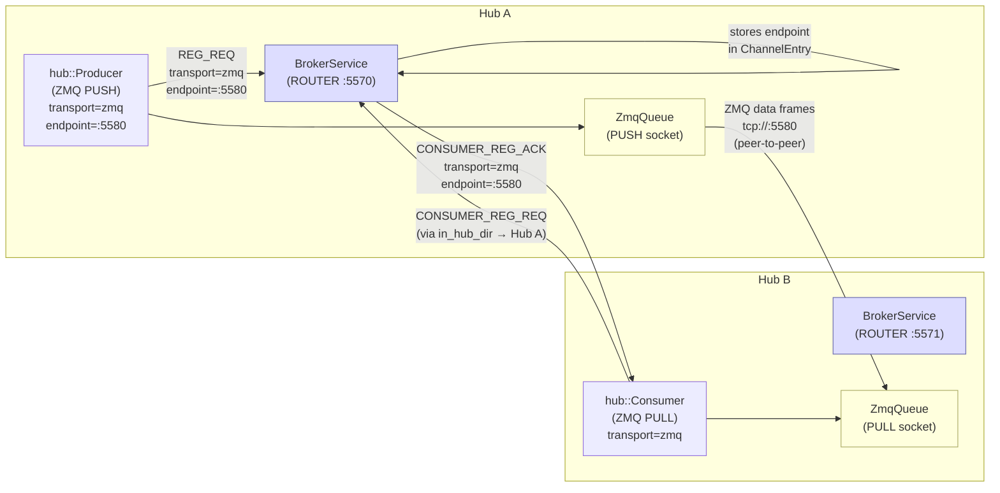
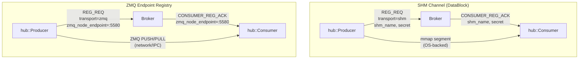
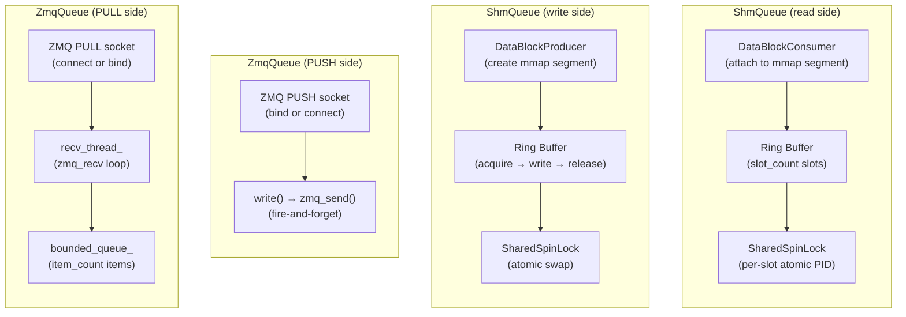
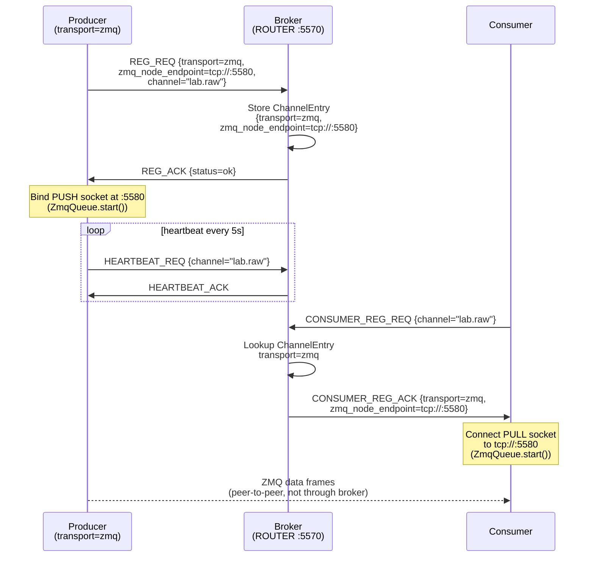
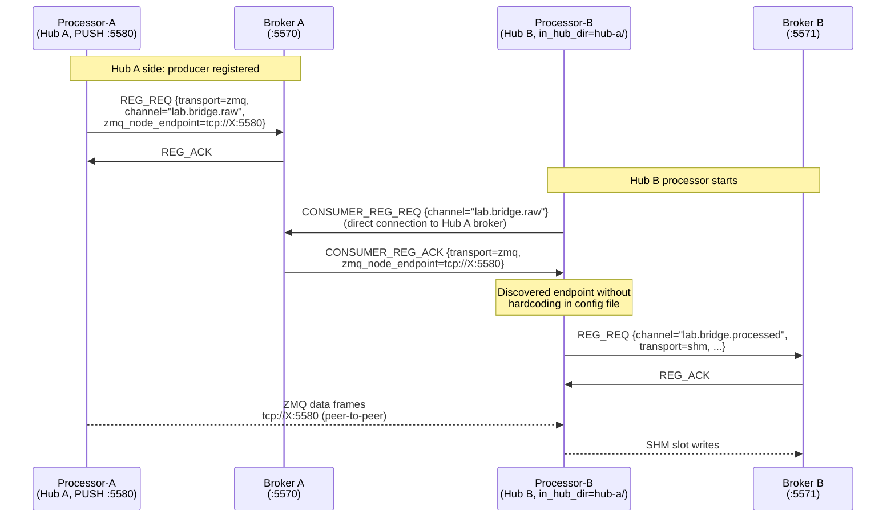
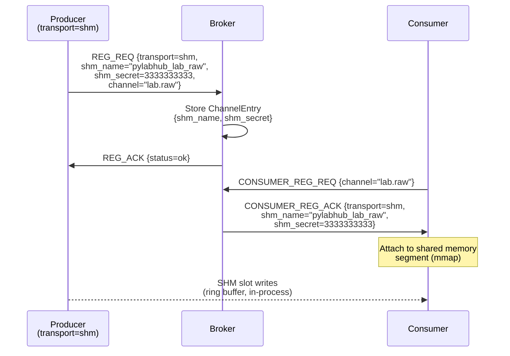

# HEP-CORE-0021: ZMQ Endpoint Registry

| Property       | Value                                                                      |
|----------------|----------------------------------------------------------------------------|
| **HEP**        | `HEP-CORE-0021`                                                            |
| **Title**      | ZMQ Endpoint Registry — Broker-Aware Peer-to-Peer ZMQ Endpoints           |
| **Status**     | Implemented — 2026-03-06                                                   |
| **Created**    | 2026-03-05                                                                 |
| **Area**       | Framework Architecture (`BrokerService`, `hub::Producer`, `hub::Consumer`) |
| **Depends on** | HEP-CORE-0002 (DataHub), HEP-CORE-0007 (Protocol), HEP-CORE-0017 (Pipeline) |

---

## 1. Motivation

The current framework has two tiers of data transport:

1. **SHM (DataBlock)**: Structured, schema-validated, ring-buffered shared memory.
   The broker is the service directory — producers register channels, consumers
   discover them via `CONSUMER_REG_REQ`. Fully broker-aware.

2. **ZMQ PUSH/PULL (direct)**: Peer-to-peer, bypasses the broker entirely.
   Endpoints are hardcoded in configuration files. The broker has no knowledge
   of these channels. Not discoverable.

The second tier creates problems:

- **No service directory**: A consumer cannot ask the broker "where is channel X?".
  It must know the endpoint in advance via out-of-band configuration.
- **Brittle configuration**: Both sides of the ZMQ pair must hardcode matching
  endpoints. A change in one requires manual updates to the other.
- **Asymmetric topology**: In a cross-hub bridge scenario, the processor on Hub B
  must have the ZMQ endpoint of the processor on Hub A hardcoded — even though
  the broker on Hub A already knows about that processor.
- **Silent failure**: If the ZMQ endpoint changes (port reuse, redeployment), no
  error is surfaced at the broker level. The consumer simply hangs.

**This HEP introduces the ZMQ Endpoint Registry** — a lightweight registration
type that makes ZMQ peer-to-peer endpoints broker-aware and discoverable, using
the same REG_REQ / CONSUMER_REG_ACK protocol as SHM channels.

---

## 2. Design Principles

1. **Virtual, not structural**: A ZMQ node is a connection point, not a data
   container. Unlike a DataBlock (which has slots, schema, ring buffer, mutex,
   and a shared memory segment), a ZMQ node has only an endpoint string. There
   is no data structure to define, no memory to allocate, no schema required.

2. **Broker as directory, not relay**: The broker stores the ZMQ endpoint in the
   channel entry and echoes it back on consumer registration. It does not relay
   or touch the data stream. The actual data still flows peer-to-peer.

3. **Symmetric with SHM registration**: The producer side registers first
   (`REG_REQ` with `transport=zmq`). The consumer side discovers via
   `CONSUMER_REG_REQ` and gets back the endpoint. Same handshake, different
   payload. Existing channel lifecycle (heartbeat, CHANNEL_CLOSING_NOTIFY,
   metrics) applies unchanged.

4. **Transport is producer's declaration**: The producer declares `transport=zmq`
   at registration time. Consumers do not need to know or configure the transport
   type — the broker tells them. This is the same as SHM: the producer creates
   the DataBlock, consumers discover its name and secret.

5. **Schema is optional**: Since a ZMQ node carries raw bytes, schema validation
   is not enforced at the framework level. Schema fields in REG_REQ are optional
   for ZMQ nodes. Applications may document their wire format separately.

6. **Cross-hub discovery via `in_hub_dir`**: A processor on Hub B can discover
   a ZMQ channel registered on Hub A by pointing `in_hub_dir` at Hub A's
   directory (which contains `hub.pubkey`). Hub B's broker is not involved —
   Hub B's processor connects directly to Hub A's broker for discovery, then
   establishes the ZMQ connection directly to the endpoint.

---

## 3. Architecture — ZMQ Endpoint Registry in the Framework

### 3.1 Overall System View



### 3.2 Channel Types Side-by-Side



---

## 4. ShmQueue vs ZmqQueue — Comparison

Both `hub::ShmQueue` and `hub::ZmqQueue` implement the abstract `hub::Queue`
interface. The processor and consumer script hosts call the same API regardless
of transport. This section explains when to choose each.

### 4.1 Interface

The framework uses two independent abstract interfaces (split 2026-03-09):

```cpp
// hub::QueueReader (hub_queue.hpp) — read-side abstract interface
class QueueReader {
public:
    virtual bool        start()   = 0;  // ShmQueue: no-op; ZmqQueue: bind/connect + recv thread
    virtual void        stop()    = 0;
    virtual const void* read_acquire(int timeout_ms) noexcept = 0;
    virtual void        read_release() noexcept = 0;
    virtual const void* read_flexzone() noexcept = 0;
    virtual uint64_t    last_seq()  const noexcept = 0;
    virtual size_t      capacity()  const = 0;
    virtual std::string policy_info() const = 0;
    virtual void        set_verify_checksum(bool slot, bool fz) noexcept = 0;
    virtual size_t      item_size() const noexcept = 0;
    virtual bool        is_running() const noexcept = 0;
    virtual QueueMetrics metrics() const noexcept = 0;
};

// hub::QueueWriter (hub_queue.hpp) — write-side abstract interface
class QueueWriter {
public:
    virtual bool  start()   = 0;
    virtual void  stop()    = 0;
    virtual void* write_acquire(int timeout_ms) noexcept = 0;
    virtual void  write_commit() noexcept  = 0;
    virtual void  write_discard() noexcept = 0;  // formerly write_abort()
    virtual void* write_flexzone() noexcept = 0;
    virtual void  set_checksum_options(bool slot, bool fz) noexcept = 0;
    virtual size_t      capacity()  const = 0;
    virtual std::string policy_info() const = 0;
    virtual size_t      item_size() const noexcept = 0;
    virtual bool        is_running() const noexcept = 0;
    virtual QueueMetrics metrics() const noexcept = 0;
};
```

`ShmQueue` and `ZmqQueue` both inherit from `QueueReader` and `QueueWriter`.
Factories return `unique_ptr<QueueReader>` (consumer side) or `unique_ptr<QueueWriter>` (producer side).

### 4.2 Feature Comparison

| Dimension | `ShmQueue` | `ZmqQueue` |
|-----------|-----------|-----------|
| **Transport layer** | OS shared memory (`mmap`) | ZMQ PUSH/PULL sockets |
| **Network reach** | Same machine only | Same machine, LAN, WAN |
| **Latency** | Sub-microsecond (cache-warm) | ~1–10 µs (loopback), variable on LAN |
| **Throughput** | Very high (memcpy rate) | High, limited by TCP/socket overhead |
| **Item size** | Fixed (slot size from schema) | Variable or fixed (raw bytes) |
| **Overflow policy** | `Block` or `Drop` (ring buffer) | `Block` (bounded recv queue) or `Drop` |
| **Schema validation** | Enforced at framework level | Not enforced (raw bytes) |
| **Broker awareness** | Full (name + secret in DISC_ACK) | Full (endpoint in DISC_ACK) — this HEP |
| **Flexzone support** | Yes (variable-length tail) | No (future: second ZMQ frame) |
| **Checksum support** | Yes (`BLAKE2b-256` of slot) | Deferred (HEP-CORE-0023) |
| **start() cost** | None (no-op) | Socket creation + thread spawn |
| **Reader model** | Single-consumer ring (latest or sequential) | Any-consumer (fire-and-forget) |
| **Multiple consumers** | Yes, each consumer has own read pointer | Yes (multiple PULL endpoints per PUSH) |
| **Process restart** | Consumer re-attaches after producer restart | PULL reconnects automatically |
| **Typical use case** | High-frequency sensor data, same machine, structured | Cross-machine bridge, raw byte streaming |
| **Cross-hub** | No (SHM segment is local) | Yes (ZMQ socket is network-capable) |

### 4.3 When to Use Each

**Use ShmQueue when:**
- Producer and consumer are on the same machine
- Data has a schema (`FieldDef` → `DataBlock` slots)
- You need flexzone (variable-length data appended to fixed schema)
- You need checksum verification of individual slots
- You need ring-buffer semantics (overwrite old data on overflow)
- Latency is critical and you want to avoid socket overhead

**Use ZmqQueue when:**
- Producer and consumer are on different machines (cross-network)
- You are bridging two hubs (processor-a on Hub A → processor-b on Hub B)
- Data format is opaque bytes (no schema enforcement needed)
- You need dynamic endpoint discovery (via ZMQ Endpoint Registry)
- Multiple consumers on different machines need the same stream

### 4.4 Internal Structure



---

## 5. Protocol Changes

### 5.1 REG_REQ Extension

A new optional `transport` field is added to `REG_REQ`. Existing registrations
without this field are treated as `transport=shm` (backward-compatible).

```
REG_REQ (producer → broker)
  channel_name          string   Channel identifier
  transport             string   "shm" (default) | "zmq"
  --- SHM fields (transport=shm) ---
  shm_name              string   Shared memory segment name
  wants_shm_secret      bool     (HEP-CORE-0036 §6.1; default true post-HEP-0036)
                                 If true, broker generates the DataBlock
                                 guard secret and returns it in REG_ACK.
                                 The legacy `shm_secret` field below is
                                 deprecated; broker ignores producer-supplied
                                 value when wants_shm_secret=true.
  shm_secret            uint64   DEPRECATED (HEP-CORE-0036 §6.1) — ignored
                                 when wants_shm_secret=true.  Kept for
                                 backward compatibility with pre-HEP-0036
                                 producers.
  slot_count            uint32   Ring buffer capacity
  schema_id             string   (optional) Named schema identifier
  schema_hash           string   (optional) BLAKE2b-256 of BLDS
  --- ZMQ fields (transport=zmq) ---
  zmq_node_endpoint     string   Bind address, e.g. "tcp://127.0.0.1:5580"
  zmq_pubkey            string   (REQUIRED if transport=zmq) Producer's IDENTITY
                                 pubkey (Z85, 40 chars).  Sourced from KeyStore
                                 (HEP-CORE-0040 §8.2).  Used by consumers as their
                                 PULL socket's curve_serverkey per HEP-CORE-0036 §I6.
  --- Common fields ---
  role_uid              string
  role_name             string
  // HEP-CORE-0007 §12.3 is the canonical wire-format authority for REG_REQ;
  // this section mirrors it.
```

**HEP-0036 note**: under T1 (locked 2026-05-28), the producer does NOT
send any CURVE keypair-request flags.  The producer's data-plane PUSH
binds with the role's identity keypair (per HEP-CORE-0036 I6 — broker
mints nothing on the data plane).  Per HEP-CORE-0036 §6.1 + §6.3, the
body claim `zmq_pubkey` is verified at the broker by comparing against
`known_roles[role_uid].pubkey_z85` (Layer-2 verification).  ZAP/CURVE
at Layer-1 establishes the cryptographic identity; the body claim binds
the wire to a specific role uid.

### 5.2 CONSUMER_REG_ACK Extension

The broker returns the transport descriptor plus per-producer data so the
consumer's framework can fan-in across all registered producers of the
channel.  Per **HEP-CORE-0036 §6.4** (T1 locked 2026-05-28): for ZMQ
transport the response carries a `producers[]` array (length 1 for
single-producer channels, length N for fan-in), each element being
`{role_uid, pubkey, endpoint}`.  The producer pubkey is the producer's
IDENTITY pubkey (HEP-CORE-0036 I6 — broker mints NO data-plane keys);
the endpoint is the producer's bound TCP endpoint (config-resolved
at startup per HEP-CORE-0036 §3.5.1; §16 RESERVED for ephemeral path
under task #94).

```
CONSUMER_REG_ACK (broker → consumer)
  channel_name          string
  transport             string   "shm" | "zmq"
  --- SHM fields (transport=shm) ---
  shm_name              string
  shm_secret            uint64   Broker-generated guard secret
                                 (HEP-CORE-0036 §6.4; was producer-supplied
                                 in legacy)
  --- ZMQ fields (transport=zmq) ---
  producers             array of objects, one per registered producer:
                            role_uid    string  Producer's role uid
                            pubkey      string  Producer identity pubkey
                                                (Z85, 40 chars; sourced from
                                                ChannelEntry::producers[i]
                                                .zmq_pubkey per HEP-0036 §4.1)
                            endpoint    string  Producer's bound TCP endpoint
                                                (per-producer scope; lives on
                                                ProducerEntry, not ChannelEntry)
  --- Common fields ---
  schema_id             string   (optional)
  schema_hash           string   (optional)
```

**Cardinality**: `producers[]` has length 1 for single-producer channels
and length N for fan-in.  Same wire shape both ways — consumer code
iterates the array unconditionally.  SHM transport rejects N > 1 at
admission (`MULTI_PRODUCER_NOT_SUPPORTED_FOR_SHM` per HEP-CORE-0007
§12.4a) and so always has the single-producer-attach shape.

**Coordinated migration**: this array shape is the sibling of the
DISC_REQ_ACK "per-producer arrays" lift (referenced in
`broker_service.cpp:1745-1794` comment).  Both responses should
land in one wire-format change.  Tracked under task #94 (which
also owns the future ephemeral-binding production path; see §16).

**Retired wire fields**: the legacy singular `zmq_endpoint` +
`producer_zmq_pubkey` are REPLACED by the `producers[]` array.  The
`producer_uid` / `producer_name` legacy fields are absorbed into
`producers[i].role_uid` (uid implies the registered name).

### 5.3 Broker Internal State

The broker's `ChannelEntry` struct gains a `data_transport` discriminator;
the per-producer `zmq_node_endpoint` lives on each `ProducerEntry` (Wave
M2.5; HEP-CORE-0023 §5 + HEP-CORE-0033 §8.  Channel-wide endpoint storage
is RETIRED — fan-in channels carry distinct endpoints per producer).
No other broker state changes. Channel lifecycle management (timeout,
heartbeat tracking, CHANNEL_CLOSING_NOTIFY, metrics) is identical for both
transport types.

---

## 6. Protocol Sequence Diagrams

### 6.1 ZMQ Channel Registration and Discovery (same hub)



### 6.2 Cross-Hub Discovery via in_hub_dir



### 6.3 SHM Channel Registration and Discovery (for comparison)



---

## 7. Hub Layer Changes

### 7.1 ProducerOptions

```cpp
enum class ChannelTransport { Shm, Zmq };

struct ProducerOptions
{
    // existing fields ...
    ChannelTransport transport{ChannelTransport::Shm};
    std::string      zmq_node_endpoint;   // bind address (transport=Zmq only)
    // Producer always binds at S3 inside apply_master_approval per
    // HEP-CORE-0036 §3.5.1.  Connect-mode retired 2026-06-12.
};
```

When `transport=Zmq`, `hub::Producer::create()` follows the
HEP-CORE-0036 §3.5 staged construction order — the PUSH socket
does NOT bind until master approval (REG_ACK) arrives:

1. **S1 — build tx queue in Standby.**  Construct `ZmqQueue` with
   `zmq_node_endpoint` from config; no `bind()` call, no worker thread
   spawn (HEP-CORE-0036 §6.7).
2. **S2 — send REG_REQ** carrying `zmq_node_endpoint` (resolved at
   config-load time per §16; ephemeral port-0 is not supported here).
   Failure is FATAL — producer aborts startup.
3. **S3 — on REG_ACK**, call `queue->apply_master_approval(REG_ACK)`.
   This single mutator seeds the broker-issued consumer allowlist,
   binds the PUSH socket, arms ZAP, and spawns the worker thread
   under ThreadManager scope (HEP-CORE-0036 §3.5.4 INV4 +
   §6.7 "Role-host integration pattern").
4. **S3+ — `install_heartbeat`.**  Heartbeat cadence starts at S3,
   not S1, per HEP-CORE-0036 §3.5.4 INV1 ("nothing happens behind
   the auth door before auth").

`producer.queue()` returns a `hub::ZmqQueue*` wrapping the PUSH
socket.  When `transport=Shm` (default), behavior is unchanged
(SHM has no socket-bind / auth-door distinction).

### 7.2 Consumer::connect()

`Consumer::connect()` reads `transport` from `CONSUMER_REG_ACK` and acts accordingly:

```cpp
// Inside Consumer::connect() after receiving CONSUMER_REG_ACK:
if (ack.transport == "shm")
{
    shm_consumer = find_datablock_consumer_impl(ack.shm_name, ack.shm_secret, ...);
    // queue_ = ShmQueue wrapping shm_consumer
}
else if (ack.transport == "zmq")
{
    // queue_ = build_rx_queue(opts);              // → Standby per HEP-CORE-0036 §6.7
    // ack    = register_consumer(...);             // fatal on failure (§3.5.1)
    // queue_->apply_master_approval(ack);          // single mutator: drives Standby → Active
    //                                              // (extracts ack.producers[i] for each producer,
    //                                              //  connects with curve_serverkey = pubkey,
    //                                              //  spawns PULL worker)
}
```

`consumer.queue()` returns the appropriate `hub::Queue*`. The caller (ProcessorScriptHost,
ConsumerScriptHost) uses the queue uniformly — no transport branching at the script host level.

### 7.3 ProcessorScriptHost Simplification (Implemented 2026-03-09)

`ProcessorScriptHost` uses transport-resolved queues via `hub::QueueReader` / `hub::QueueWriter`:

```cpp
in_queue_  = in_consumer_->queue_reader();   // QueueReader* — ShmQueue or ZmqQueue
out_queue_ = out_producer_->queue_writer();  // QueueWriter* — ShmQueue or ZmqQueue
```

`ProcessorConfig` fields `in_transport`, `zmq_in_endpoint`, `zmq_in_bind` are
**removed** — input transport auto-discovered from the broker (`CONSUMER_REG_ACK`).
Output-side fields retained:

```json
{
  "out_transport":    "zmq",
  "zmq_out_endpoint": "tcp://127.0.0.1:5580",
  "zmq_out_bind":     true
}
```

Only the **output side** needs explicit configuration; input side discovers dynamically.
`zmq_out_bind` defaults to `true` (PUSH binds; PULL connects).

---

## 8. Relation to DataBlock (SHM)

```
                  ┌─────────────────────────────────────────────────┐
                  │                 Channel Types                    │
                  ├─────────────────────┬───────────────────────────┤
                  │    SHM (DataBlock)  │    ZMQ Endpoint Registry  │
                  ├─────────────────────┼───────────────────────────┤
                  │ Data structure      │ Connection point only      │
                  │ Slots + ring buffer │ No slots, no buffer        │
                  │ Schema required     │ Schema optional            │
                  │ Shared memory seg   │ No memory allocation       │
                  │ OS IPC (mmap)       │ Network/IPC (ZMQ socket)   │
                  │ Same-machine only   │ Cross-machine capable      │
                  │ Broker-registered   │ Broker-registered ✓        │
                  │ Broker-discovered   │ Broker-discovered ✓        │
                  │ Heartbeat/metrics   │ Heartbeat/metrics ✓        │
                  │ Lifecycle events    │ Lifecycle events ✓         │
                  └─────────────────────┴───────────────────────────┘
```

Both types participate fully in the channel lifecycle. The difference is purely
in what the broker stores (SHM name + secret vs. ZMQ endpoint) and what the
framework creates on the consumer side (DataBlockConsumer vs. ZMQ PULL socket).

---

## 9. Cross-Hub Discovery

For the dual-hub bridge scenario:

```
Hub A:  Processor-A registers "lab.bridge.raw.bridge" {transport=zmq, endpoint=tcp://X:5580}
Hub B:  Processor-B has in_hub_dir → Hub A

Processor-B startup:
  1. Connects to Hub A broker (via in_hub_dir + hub.pubkey)
  2. Sends CONSUMER_REG_REQ for "lab.bridge.raw.bridge"
  3. Hub A broker returns CONSUMER_REG_ACK{transport=zmq, zmq_node_endpoint=tcp://X:5580}
  4. Processor-B creates ZmqQueue PULL at tcp://X:5580
  5. Connects to Hub B broker (via out_hub_dir + hub.pubkey) → registers out_channel
```

Processor-B config becomes:
```json
{
  "in_hub_dir":  "../hub-a",
  "in_channel":  "lab.bridge.raw.bridge",
  "out_hub_dir": "../hub-b",
  "out_channel": "lab.bridge.processed",
  "out_transport": "shm"
}
```

No `zmq_in_endpoint` in Processor-B — it is discovered from Hub A at runtime.

---

## 10. Robustness Analysis

| Scenario | Behavior |
|----------|----------|
| ZMQ endpoint not yet bound (producer not started) | `CONSUMER_REG_REQ` succeeds (broker has the entry); ZMQ PULL socket connects and queues internally until PUSH becomes available. Same as SHM race condition — producer must be running before consumer reads. |
| Producer restarts with new ephemeral port | RETIRED 2026-06-12 — port-0 ephemeral binding is rejected at config-load per HEP-CORE-0036 §3.5.1.  Resurrected only if HEP-CORE-0021 §16 ephemeral-binding design is reinstated under task #94. |
| Consumer discovers endpoint but PUSH never binds | ZMQ PULL socket's reconnect loop retries silently. After `channel_timeout`, broker drops the channel entry (no heartbeat from producer). |
| Cross-machine deployment | ZMQ endpoints are network addresses — works natively. SHM channels remain same-machine only (no change). |
| Schema validation | Schema fields in REG_REQ are optional for `transport=zmq`. If provided, broker stores them and echoes back — consumer may validate format independently. |

---

## 11. What This Is Not

- **Not a message broker relay**: The broker stores the endpoint, not the data.
  ZMQ data flows directly between producer and consumer.
- **Not a replacement for SHM**: SHM (DataBlock) provides structured, schema-validated,
  ring-buffered IPC with hardware-level synchronization. ZMQ nodes trade structure
  for flexibility and network reach.
- **Not cross-hub channel federation**: A ZMQ channel registered on Hub A is not
  automatically visible on Hub B. Hub B must explicitly point `in_hub_dir` at Hub A
  to discover it. Hub federation (broadcast relay) is a separate feature (HEP-CORE-0022).

---

## 12. Implementation Status

| Phase | Scope | Status | Key files |
|-------|-------|--------|-----------|
| 1 | Protocol: `transport` + `zmq_node_endpoint` in REG_REQ / CONSUMER_REG_ACK / ChannelEntry | Done | `broker_service.cpp`, `messenger.cpp` |
| 2 | `hub::Producer` ZMQ mode: `ProducerOptions::transport`, PUSH socket management, `producer.queue()` | Done | `hub_producer.hpp/cpp` |
| 3 | `hub::Consumer` ZMQ discovery: read transport from ACK, create ZmqQueue PULL, `consumer.queue()` | Done | `hub_consumer.hpp/cpp` |
| 4 | `ProcessorScriptHost` simplification: remove manual ZmqQueue creation; use `producer/consumer.queue()` | Done | `processor_script_host.hpp/cpp` |
| 5 | `ProcessorConfig` cleanup: remove `in_transport`/`zmq_in_endpoint`; keep `out_transport`/`zmq_out_endpoint` | Done | `processor_config.hpp/cpp` |
| 6 | Demo update: Processor-B uses `in_hub_dir` only, no hardcoded ZMQ endpoint | Done | `share/py-demo-dual-processor-bridge/` |
| Tests | 12 L3 protocol tests (ZmqEndpointRegistryTest) | Done | `test_datahub_zmq_endpoint_registry.cpp` |
| 7 | Ephemeral port binding (RESERVED — retired 2026-06-12 per HEP-CORE-0036 §3.5.1; tracked under task #94) | Reserved | §16 |

---

## 13. ZmqQueue Internal Design

`hub::ZmqQueue` is schema-mandatory. Every ZmqQueue must be created with a non-empty
`std::vector<ZmqSchemaField>` + packing string. Wire format is msgpack:

```
fixarray[4]
  [0] magic       : uint32  = 0x51484C50 ('PLHQ')
  [1] schema_tag  : bin8    = first 8 bytes of BLAKE2b-256(BLDS) (or zeros if absent)
  [2] seq         : uint64  = monotonic send counter (gaps detected as recv_gap_count)
  [3] payload     : array[N] — one element per schema field
```

Payload encoding: scalars as native msgpack types; arrays/string/bytes as `bin` (raw bytes).

**Packing**: `"aligned"` = C `ctypes.LittleEndianStructure` natural alignment; `"packed"` = no padding.
Both sides must use identical schema + packing. `"natural"` is not a valid value (renamed to `"aligned"` 2026-03-08).

**Factories** (post-#160 C4 — CURVE-only, HEP-CORE-0040 §8.4 endpoint shape; see HEP-CORE-0017 §"ZmqQueue — API contract" for the full signature):
- `ZmqQueue::pull_from(endpoint, server_pubkey, schema, packing, identity_key_name, bind, buffer_depth, ...)` → PULL (recv_thread_)
- `ZmqQueue::push_to(endpoint, schema, packing, identity_key_name, zap_domain, bind, ...)` → PUSH (send_thread_)

**Metrics**: `recv_overflow_count`, `recv_frame_error_count`, `recv_gap_count`, `send_drop_count`, `send_retry_count`, `overrun_count` — all `std::atomic<uint64_t>` on `ZmqQueue::metrics()`.

**InboxQueue (ROUTER/DEALER pair)**: implemented 2026-03-08.
- `hub::InboxQueue` (ROUTER): binds `inbox_endpoint`; `recv_one(timeout)` + `send_ack(code)` on inbox_thread_
- `hub::InboxClient` (DEALER): `connect_to(ep, sender_uid, schema, packing)` + `send(timeout)` + ACK wait
- Wire format identical to ZmqQueue data frames
- See `src/include/utils/hub_inbox_queue.hpp` + `src/utils/hub/hub_inbox_queue.cpp`

**Deferred extensions**: ACK mechanism for ZmqQueue PUSH write path (requires PUSH→DEALER socket change; deferred); flexzone over ZMQ (second frame; deferred to HEP-0023).

This HEP covers the **broker protocol** (virtual node registration, service directory).
ZmqQueue implementation detail was consolidated into this HEP at
archive-time 2026-03-10.

---

## 14. Source File Reference

| Component | File |
|-----------|------|
| Channel entry + transport field | `src/utils/ipc/broker_service.cpp` |
| REG_REQ / CONSUMER_REG_ACK protocol | `src/utils/ipc/messenger.cpp` |
| ChannelHandle data_transport() / zmq_node_endpoint() | `src/utils/ipc/channel_handle.cpp/.hpp` |
| Producer ZMQ transport | `src/utils/hub/hub_producer.hpp/cpp` |
| Consumer ZMQ discovery | `src/utils/hub/hub_consumer.hpp/cpp` |
| ProcessorScriptHost (simplified) | `src/processor/processor_script_host.cpp` |
| ProcessorConfig (transport fields) | `src/processor/processor_config.hpp/cpp` |
| L3 protocol tests | `tests/test_layer3_datahub/test_datahub_zmq_endpoint_registry.cpp` |
| Demo bridge config | `share/py-demo-dual-processor-bridge/processor-{a,b}/processor.json` |

---

## 15. ZMQ Socket Lifecycle Policy

### 15.1 LINGER=0 — Universal Policy

**Every ZMQ socket in pyLabHub sets `ZMQ_LINGER = 0` immediately after creation.**

```cpp
// Canonical pattern — applied at socket creation, not deferred:
zmq::socket_t sock(ctx, zmq::socket_type::push);
sock.set(zmq::sockopt::linger, 0);  // policy: always LINGER=0
```

This is enforced in all socket creation sites:

| Socket | Location | Type |
|--------|----------|------|
| Broker main | `src/utils/ipc/broker_service.cpp` | ROUTER |
| Federation peer | `src/utils/ipc/broker_service.cpp` | DEALER |
| Messenger broker connection | `src/utils/ipc/messenger.cpp` | DEALER |
| Messenger monitor | `src/utils/ipc/messenger.cpp` | PAIR |
| Messenger P2C ctrl (server) | `src/utils/ipc/messenger.cpp` | ROUTER |
| Messenger P2C ctrl (client) | `src/utils/ipc/messenger.cpp` | DEALER |
| Messenger P2C data | `src/utils/ipc/messenger.cpp` | XPUB / SUB / PUSH / PULL |
| AdminShell | (deleted in post-G2 cleanup; structured `AdminService` lands as HEP-CORE-0033 §11 / §15 Phase 6) | REP |
| ZmqQueue PUSH | `src/utils/hub/hub_zmq_queue.cpp` | PUSH |
| ZmqQueue PULL | `src/utils/hub/hub_zmq_queue.cpp` | PULL |
| InboxQueue | `src/utils/hub/hub_inbox_queue.cpp` | ROUTER |
| InboxClient | `src/utils/hub/hub_inbox_queue.cpp` | DEALER |

### 15.2 Rationale

**ZMQ's default LINGER is -1** (infinite): `zmq_close()` blocks until all queued
outgoing messages are delivered or the socket's linger timeout expires. This creates
two failure modes in pyLabHub:

1. **Hang on shutdown**: If the remote end has already closed, `zmq_close()` blocks
   indefinitely trying to flush the send queue — particularly dangerous for the
   monitor PAIR socket, which is closed before the main socket it monitors.

2. **Release vs. Debug timing divergence**: In Release builds (no -O2 overhead, no
   `PLH_DEBUG` I/O), the ZMQ I/O thread may not have processed a socket disconnect
   before `zmq_close()` is called, making hangs **deterministic** in Release but a
   **race** in Debug. This was the root cause of the `MessengerTest` hangs observed
   only in Release (2026-03-12).

**pyLabHub does not rely on socket linger for delivery guarantees.** Shutdown is
always coordinated through explicit protocol messages:
- Producers send `CHANNEL_CLOSING_NOTIFY` before closing.
- Processors/consumers handle `CHANNEL_CLOSING_NOTIFY` (queued FIFO event)
  and call `api.stop()` after draining.  No second-tier escalation is
  emitted — see HEP-CORE-0007 §12 (FORCE_SHUTDOWN removed 2026-05-07).
- All parties wait for protocol-level acknowledgment before destroying sockets.

Since message delivery is guaranteed by protocol, not by socket linger, LINGER=0
is correct and safe. `zmq_close()` discards pending sends immediately — the
counterpart has already received a shutdown notification through the control path.

### 15.3 Exceptions

There are **no exceptions** to this policy in pyLabHub. If a future socket requires
reliable delivery after `close()` (e.g., a one-shot persistent-send path with no
protocol-level ACK), document the exception explicitly with the socket creation
comment and provide the reason.

### 15.4 Setting Location

LINGER must be set **at creation**, not deferred to close time. Deferred setting:

```cpp
// WRONG — race condition: the I/O thread may have already queued sends
// before linger is set, so it has no effect.
sock.close();  // already sends with linger=-1
sock.set(zmq::sockopt::linger, 0);  // too late

// CORRECT — set before any use:
zmq::socket_t sock(ctx, zmq::socket_type::push);
sock.set(zmq::sockopt::linger, 0);
sock.bind(endpoint);
```

This also applies when sockets are moved or reassigned — the LINGER=0 is preserved
in the socket option, not the C++ object. Reassignment creates a new socket; always
set LINGER=0 immediately after.

---

## 16. Ephemeral port binding (RESERVED)

This section previously described a port-0 ephemeral binding
design in which producers would bind to port 0 before sending
REG_REQ (to learn the resolved port for the wire payload), then
issue ENDPOINT_UPDATE_REQ after the bind resolved.  That design
is incompatible with HEP-CORE-0036 §3.5.1 ("nothing happens
behind the auth door before auth") and was retired 2026-06-12.

A future ephemeral-binding design that respects HEP-CORE-0036
§3.5 is tracked under task #94.  Until #94 ships, producer
endpoints MUST be fully resolved at config-load time
(`tr.zmq_endpoint` carries a real `tcp://host:port`).
