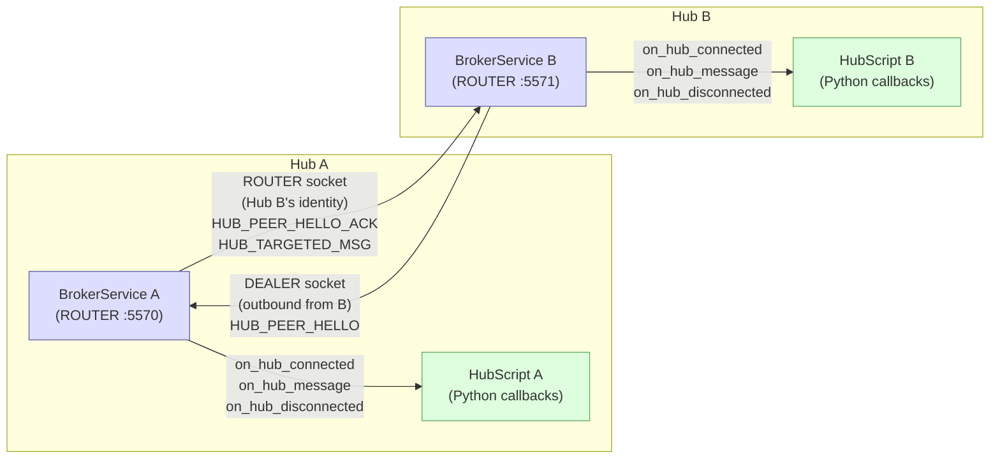
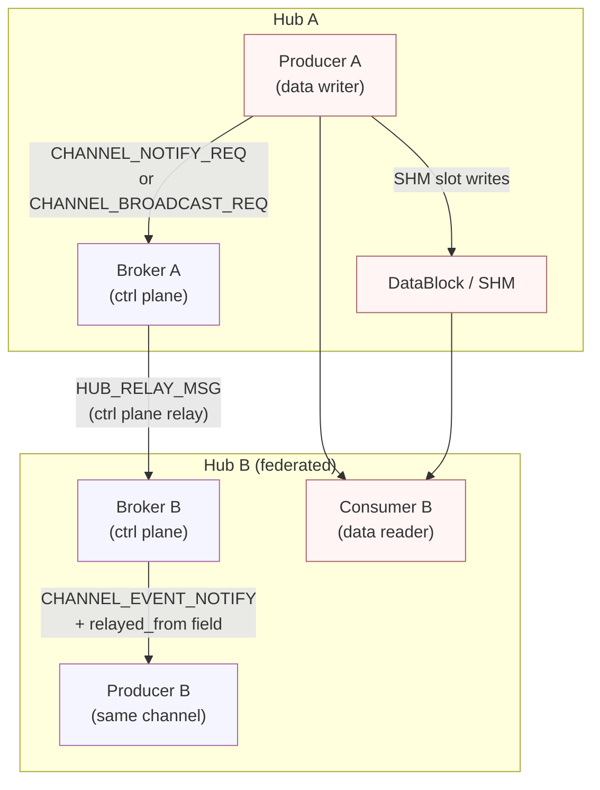
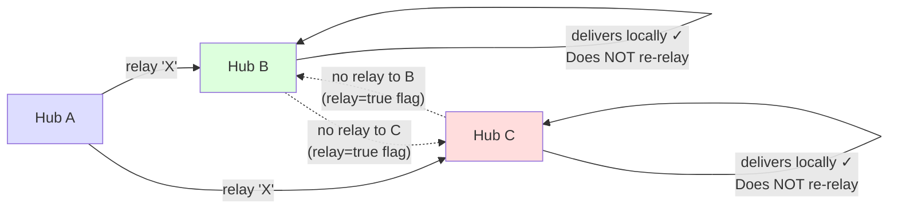
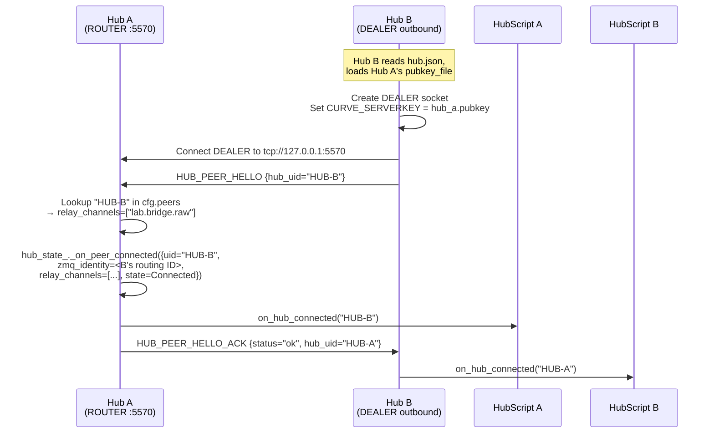
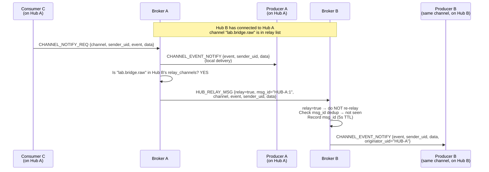
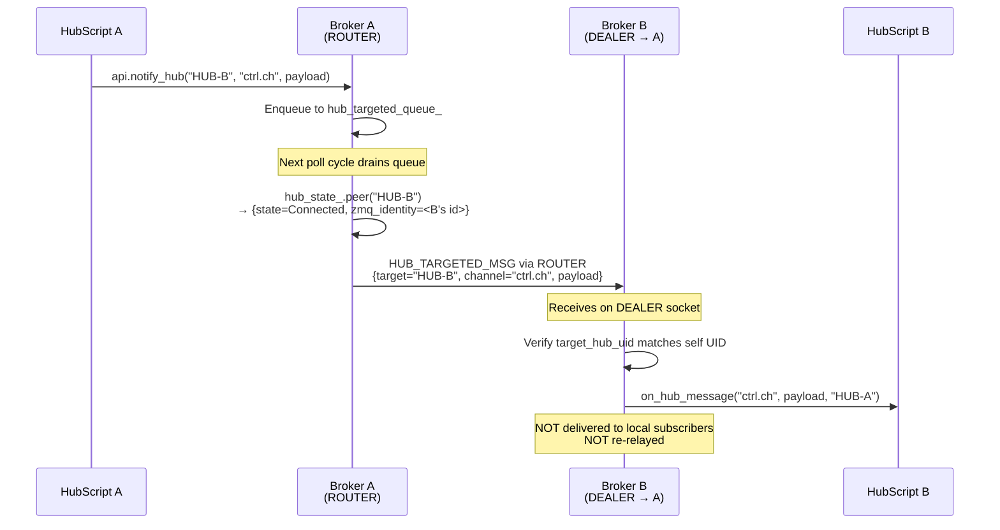
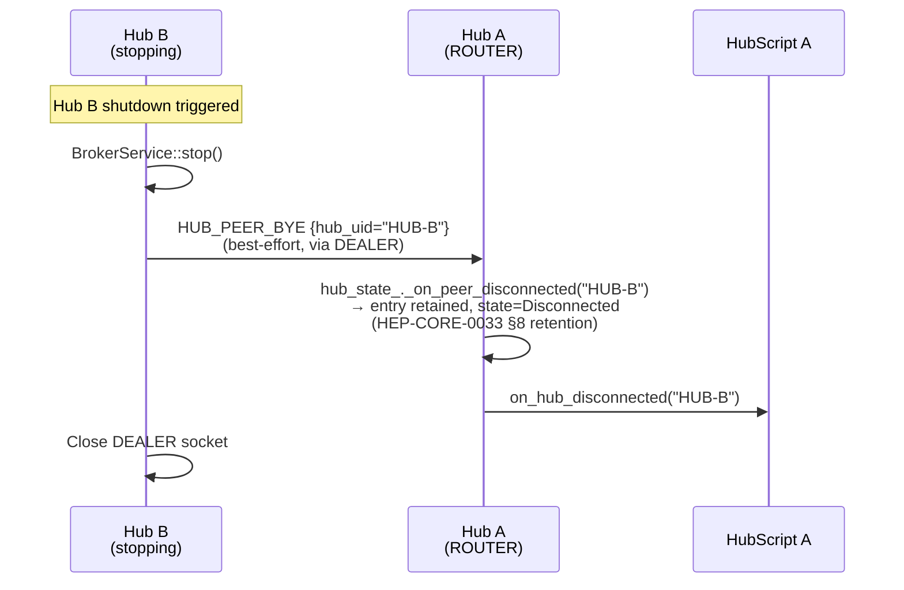
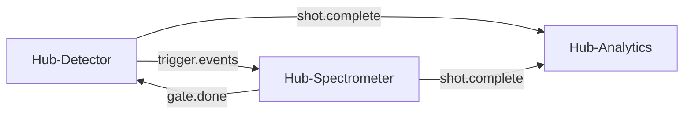

# HEP-CORE-0022: Hub Federation Broadcast

| Property       | Value                                                                          |
|----------------|--------------------------------------------------------------------------------|
| **HEP**        | `HEP-CORE-0022`                                                                |
| **Title**      | Hub Federation Broadcast — Stable Inter-Hub Ctrl Relay                         |
| **Status**     | Implemented — 2026-03-06                                                       |
| **Created**    | 2026-03-05                                                                     |
| **Area**       | Framework Architecture (`BrokerService`, `HubScript`, `hub.json`)             |
| **Depends on** | HEP-CORE-0007 (Protocol), HEP-CORE-0002 (DataHub), HEP-CORE-0021 (ZMQ Node) |

---

## 1. Motivation

The current framework's broadcast mechanism (`CHANNEL_NOTIFY_REQ`,
`CHANNEL_BROADCAST_REQ` — HEP-CORE-0007 §12) operates within a **single hub**:
a producer or consumer sends a notification; the broker relays it to all other
members of that channel on the same hub. Cross-hub coordination today requires
either:

- Hardcoded ZMQ sockets managed by user scripts, or
- Polling shared state in SHM, or
- Manual operator intervention

Neither is robust or idiomatic.

**This HEP extends the broadcast ctrl plane to span neighboring hubs** via a
stable, pre-configured peer relationship between broker instances. When Hub A and
Hub B are federated on a channel, broadcasts on that channel propagate between
them through the ctrl plane. Data transport remains peer-to-peer and is unchanged.

### What This Is

A **static, deliberately designed inter-hub ctrl relay**. The operator configures
which hubs know each other and which channels are shared. This topology is stable
infrastructure, not dynamic service discovery.

### What This Is Not

- Not a message bus or pub/sub mesh
- Not automatic channel discovery across hubs (see HEP-CORE-0021)
- Not multi-hop routing — relay propagates exactly one hop
- Not data transport — data still flows peer-to-peer (SHM or ZMQ virtual node)

---

## 2. Design Principles

1. **Ctrl-plane only**: Only broadcast notifications (`CHANNEL_NOTIFY_REQ`,
   `CHANNEL_BROADCAST_REQ`) are relayed between hubs. The data path (SHM DataBlock,
   ZMQ virtual node) is not affected. Hubs do not relay slot data.

2. **Static topology**: Hub peer relationships are declared in `hub.json` before
   deployment. Public keys are pre-exchanged. No runtime peer discovery.
   The network is designed by the operator for a specific application — it is
   understood and stable.

3. **One-hop relay, always**: A hub that receives a relayed broadcast delivers it
   to its local subscribers and stops. It never re-relays to its own hub peers.
   This is a protocol-level invariant, not a convention.

4. **Bidirectional by declaration**: Each peer entry in `hub.json` is
   unidirectional (Hub A exports channel X to Hub B). Bidirectional relay requires
   both hubs to declare the peer relationship in their own `hub.json`. This makes
   the topology explicit and auditable.

5. **Loop-safe by construction**: The one-hop rule eliminates loops regardless of
   topology, including ring configurations (A ↔ B ↔ C ↔ A). A received relay
   frame is tagged `relay=true` and is never forwarded further. Additionally,
   every relay frame carries a `msg_id` for deduplication within a short window,
   guarding against operator misconfiguration that could cause logical re-origination
   in HubScript.

6. **CURVE auth required**: Hub-to-hub connections use the same CURVE security as
   client connections. The peer's `hub.pubkey` (production: vault-stable; dev:
   manually distributed) must be present before startup. No anonymous hub peering.

---

## 3. Architecture

### 3.1 Federation Topology — Socket Structure



**Key insight**: Hub B creates the outbound DEALER; Hub A receives via ROUTER and records Hub B's ZMQ routing identity. Targeted messages from Hub A to Hub B (via ROUTER → Hub B's identity) flow in the **reverse** direction of the DEALER connection.

### 3.2 Relay Flow — Data Plane vs Control Plane



### 3.3 One-Hop Guarantee — Ring Safety



---

## 4. Configuration (`hub.json`)

```json
{
  "hub": {
    "uid":             "HUB-DEMOA-00000001",
    "name":            "DemoHub-A",
    "broker_endpoint": "tcp://127.0.0.1:5570",
    "admin_endpoint":  "tcp://127.0.0.1:5600"
  },
  "broker": {
    "channel_shutdown_grace_s": 2
  },
  "peers": [
    {
      "hub_uid":         "HUB-DEMOB-00000002",
      "broker_endpoint": "tcp://127.0.0.1:5571",
      "pubkey_file":     "peers/hub-b.pubkey",
      "channels":        ["lab.bridge.raw", "lab.bridge.status"]
    }
  ]
}
```

**Field semantics**:

| Field | Meaning |
|-------|---------|
| `hub_uid` | UID of the peer hub; used for relay targeting and dedup |
| `broker_endpoint` | Address of the peer's broker ROUTER socket (Hub A connects its DEALER here) |
| `pubkey_file` | Path to the peer's public key file (relative to hub.json dir) |
| `channels` | Channels whose broadcasts this hub relays TO the peer when connected |

Hub B's `hub.json` mirrors this entry (pointing back at Hub A) with its own
channel list. The two are independent: what Hub A exports to Hub B and what Hub B
exports to Hub A are separate declarations.

**Pubkey distribution**: In production, the peer's pubkey is copied from the
peer hub's vault (`hub.pubkey` written at startup). In dev mode, both hubs must
be started and their ephemeral pubkeys exchanged before peering. For stable
infrastructure, vault-backed stable keys are recommended.

---

## 5. Protocol — New Frame Types

All new frames are carried on the existing broker ROUTER socket. Hub peers connect
as a special client class using CURVE auth (same as producers/consumers).

### 5.1 HUB_PEER_HELLO (peer → broker, on connect)

```
Frame: HUB_PEER_HELLO
  hub_uid           string   Peer's hub UID
  protocol_version  uint32   Must be 1 for this HEP
```

Sent by Hub B when it connects to Hub A's broker. Hub A looks up Hub B's uid
in its own `peers` config to find `relay_channels` (channels Hub A will relay to Hub B).
Hub A responds with:

```
Frame: HUB_PEER_HELLO_ACK
  status            string   "ok" | "error"
  hub_uid           string   Hub A's UID (for Hub B to verify)
```

Hub A fires `on_hub_connected(hub_b_uid)`. Hub B fires `on_hub_connected(hub_a_uid)`
when the ACK arrives.

### 5.2 HUB_PEER_BYE (peer → broker, on graceful disconnect)

```
Frame: HUB_PEER_BYE
  hub_uid           string
```

Hub A removes Hub B from all channel subscriber lists. Fires
`on_hub_disconnected(hub_uid)` in Hub A's HubScript.

### 5.3 HUB_RELAY_MSG (broker → peer broker)

Sent by Hub A's broker to Hub B's broker when a broadcast occurs on a federated channel.

```
Frame: HUB_RELAY_MSG
  relay             bool     Always true; receiver uses this to suppress re-relay
  channel_name      string
  originator_uid    string   UID of the hub that originated the broadcast
  msg_id            string   "<originator_uid>:<sequence>" — dedup key
  event             string   Original event string (from CHANNEL_NOTIFY_REQ)
  sender_uid        string   Role UID that sent the original notification
  payload           bytes    Original payload (if any)
```

Hub B's broker:
1. Checks `relay=true` — suppresses any re-relay to Hub B's own peers
2. Checks `msg_id` against a rolling dedup window (5-second TTL) — drops duplicates
3. Delivers to Hub B's local subscribers as `CHANNEL_EVENT_NOTIFY` with an extra
   `relayed_from` field (set to Hub A's UID)

### 5.4 HUB_TARGETED_MSG (broker → peer broker)

Sent when a role on Hub A wants to reach Hub B's HubScript specifically.

```
Frame: HUB_TARGETED_MSG
  target_hub_uid    string   Must match Hub B's UID exactly
  channel_name      string   Context channel
  sender_uid        string   Role UID of sender
  payload           bytes
```

Hub B's broker delivers this to Hub B's HubScript via `on_hub_message()` callback.
It is **not** delivered to Hub B's local channel subscribers. It is **not** relayed
further (even if Hub B has peers).

---

## 6. Protocol Sequence Diagrams

### 6.1 Handshake — HELLO / ACK



### 6.2 Relay — CHANNEL_NOTIFY_REQ → HUB_RELAY_MSG



### 6.3 Hub-Targeted Message



### 6.4 Graceful Disconnect — HUB_PEER_BYE



---

## 7. Topology Model

### Terminology

- **Hub peer**: A neighboring hub that this hub connects to (outbound) or accepts
  connections from (inbound), declared in `hub.json`.
- **Federated channel**: A channel whose broadcasts are relayed to/from one or
  more hub peers.
- **Relay**: A broadcast frame forwarded by Hub A's broker to Hub B's broker.
  Tagged `relay=true`. Delivered to Hub B's local subscribers only.
- **Hub-targeted message**: A broadcast aimed at a specific hub's HubScript
  (not relayed to local subscribers). Limited to direct neighbors.
- **Inbound peer**: A hub whose DEALER connected to our ROUTER. We have its ZMQ
  routing identity and can send targeted messages to it via our ROUTER.
- **Outbound peer**: A hub whose ROUTER we connect to via our DEALER. We send
  HELLO and receive ACK/RELAY/TARGETED from it on our DEALER socket.

### One-Hop Guarantee

```
Hub A  ──[relay]──►  Hub B  ──[delivers locally]──► Hub B subscribers
                       │
                       └── DOES NOT relay to Hub C, even if Hub C
                           is subscribed to Hub B on the same channel
```

For a ring A ↔ B ↔ C ↔ A:

```
Hub A broadcasts "X":
  → Hub B receives relay → delivers locally → STOPS          ✓
  → Hub C receives relay → delivers locally → STOPS          ✓
  Hub A does NOT receive its own broadcast back               ✓

Hub B broadcasts "Y":
  → Hub A receives relay → delivers locally → STOPS          ✓
  → Hub C receives relay → delivers locally → STOPS          ✓
  No loop possible because one-hop rule prevents re-relay     ✓
```

The disaster scenario (relay going A → B → C → A) **cannot occur** because Hub B
receiving a relay tagged `relay=true` will never forward it to Hub C, regardless
of Hub B's peer configuration.

### Neighbor Awareness

Hub A knows only about the hubs that appear in its own `hub.json` peer list.
Hub-targeted messages (`api.notify_hub(uid, ...)`) can only reach direct neighbors.
There is no global routing table and no transitive targeting.

---

## 8. HubScript API

### 8.1 Callbacks

```python
# script/python/__init__.py (HubScript)

def on_init(api):
    # Peer connections are established by the broker at startup.
    # No runtime subscription calls needed.
    pass

def on_hub_connected(hub_uid: str, api):
    """Called when a configured peer establishes (or re-establishes) its connection."""
    api.log("info", f"Peer connected: {hub_uid}")

def on_hub_disconnected(hub_uid: str, api):
    """Called when a configured peer disconnects (graceful BYE or timeout)."""
    api.log("warn", f"Peer disconnected: {hub_uid}")

def on_hub_message(channel: str, payload: str, source_hub_uid: str, api):
    """
    Called when a hub-targeted message (HUB_TARGETED_MSG) arrives.
    payload is the raw payload string (JSON or otherwise).
    source_hub_uid is always a direct neighbor.
    This is NOT delivered to local channel subscribers.
    """
    api.log("info", f"Message from {source_hub_uid} on {channel}: {payload}")
```

### 8.2 Sending

```python
# Broadcast to local subscribers + all federated hub peers on this channel:
api.notify_channel("lab.bridge.status", "calibration", '{"value": 1.0}')
# (uses existing CHANNEL_NOTIFY_REQ — broker adds relay transparently)

# Hub-targeted message to a direct neighbor only:
api.notify_hub("HUB-DEMOB-00000002", "ctrl.channel", '{"cmd": "ack"}')
# → delivers to Hub B's on_hub_message() only; NOT to Hub B's local subscribers
```

`api.notify_channel()` behavior is **unchanged for the local case**. The broker
transparently adds hub relay on top. Scripts do not need to know whether a channel
is federated.

### 8.3 Relayed broadcasts received by local subscribers

When Hub B receives a relay of Hub A's broadcast, Hub B's local subscribers see it
as a standard `CHANNEL_EVENT_NOTIFY` with the following additional field:

```python
{
    "event":           "calibration",        # original event string
    "sender_uid":      "PROD-BRIDGE-...",    # original sender
    "originator_uid":  "HUB-DEMOA-00000001", # non-empty = relayed from peer hub
    "channel_name":    "lab.bridge.status"
}
```

The `originator_uid` field is always present in `CHANNEL_EVENT_NOTIFY`. It is empty
(`""`) for locally-originated events and non-empty (the source hub UID) for events
relayed from a federation peer. Scripts use this to distinguish relayed events.

---

## 9. Loop Safety Analysis

### Protocol Layer (hard guarantee)

Every relay frame carries `relay=true`. The broker enforces: **if a received frame
has `relay=true`, never forward it to hub peers**. This is checked before any
other processing. No exception.

Result: A relay travels exactly one hop from originator. Ring topologies (A → B → C → A)
cannot create protocol-level loops.

### Application Layer (HubScript convention)

A loop at the application layer is possible if HubScript on Hub B calls
`api.notify_channel(channel, ...)` in direct response to receiving a relay on
that same channel, with no base case. This is equivalent to infinite recursion —
a programming error, not a protocol failure.

**Defense in depth**: The `msg_id` dedup window (5-second rolling window, keyed on
`originator_uid:sequence`) prevents the *same originated message* from being
re-delivered locally if it somehow arrives twice (e.g., bidirectional subscription
where Hub B is subscribed to both Hub A and Hub C, and Hub A's message reaches
Hub B via both paths). It does NOT prevent a fresh `api.notify_channel()` call
from Hub B's script.

**Documentation responsibility**: Scripts responding to `on_channel_error` (relay
delivery) or `on_hub_message` must not unconditionally re-originate on the same
channel. A conditional check (e.g., `if "relayed_from" not in payload`) is sufficient.

---

## 10. Connection Lifecycle

```
Hub B starts:
  1. Reads hub.json → finds peer {Hub A, endpoint, pubkey_file, channels}
  2. Broker loads peer public key from pubkey_file
  3. Broker creates outbound DEALER socket, sets CURVE_SERVERKEY
  4. DEALER connects to Hub A's ROUTER
  5. Sends HUB_PEER_HELLO {hub_uid="HUB-B"}
  6. Receives HUB_PEER_HELLO_ACK {hub_uid="HUB-A", status="ok"}
  7. HubScript on_hub_connected("HUB-A") fires on Hub B
  8. HubScript on_hub_connected("HUB-B") fires on Hub A (on HELLO receipt)

Hub B stops (graceful):
  1. Sends HUB_PEER_BYE to Hub A (via DEALER, best-effort)
  2. Hub A: hub_state_._on_peer_disconnected("HUB-B")
        — entry retained at state=Disconnected (HEP-CORE-0033 §8 retention)
        — relay_notify_to_peers filters on state==Connected so further
          relays are suppressed automatically
  3. HubScript on_hub_disconnected fires on Hub A

Hub B crashes (no BYE):
  1. Hub A holds the peer at state=Connected; relay sends silently
     succeed at the ZMQ layer (DEALER buffers locally) but the message
     never arrives.  See §15 — known gaps.
  2. When Hub B's broker restarts and re-HELLOs, Hub A's handler
     observes the existing Connected entry, fires on_hub_disconnected
     for the stale session, then _on_peer_connected overwrites with
     the fresh entry and fires on_hub_connected.
  3. ZMQ DEALER on Hub B auto-reconnects; Hub A's ROUTER captures a new
     routing identity (the prior identity is replaced).
```

---

## 11. Robustness Analysis

| Scenario | Behavior |
|----------|----------|
| Ring topology A ↔ B ↔ C ↔ A | No loop — one-hop rule is a protocol invariant |
| Hub peer crashes mid-broadcast | Relay frame lost; Hub B's local subscribers miss it.  Hub A continues to consider the peer Connected until Hub B re-HELLOs (§15 gap).  Subsequent relays during the silent window are also lost.  After Hub B's restart-HELLO, Hub A fires on_hub_disconnected (for the stale session) then on_hub_connected (for the fresh one) and relays resume. |
| Both hubs subscribe to each other on same channel (bidirectional) | Each hub's own broadcasts reach the other. `msg_id` dedup prevents double-delivery if message arrives via two paths simultaneously |
| Hub peer key changes (ephemeral dev key) | Connection fails at CURVE handshake. Operator must redistribute new pubkey and restart. Dev mode issue — production uses vault-stable keys |
| `channels` list mismatch between peers | Hub A will only relay channels in its own allow-list for Hub B. Unlisted channels are silently not relayed |
| Hub targeted message to unknown hub UID | Broker drops with a warning log. No error propagated to sender (fire-and-forget semantics) |

---

## 12. What Federation Does Not Do

| Feature | Included? | Notes |
|---------|-----------|-------|
| Data relay (SHM slots, ZMQ frames) | No | Data is always peer-to-peer |
| Channel discovery across hubs | No | See HEP-CORE-0021 (ZMQ virtual node + `in_hub_dir`) |
| Multi-hop routing | No | One hop, always |
| Dynamic hub discovery | No | Static config; operator-managed |
| Anonymous hub peering | No | CURVE auth with pre-shared pubkey required |
| Hub as consumer (register for data) | No | Hub is ctrl relay only; data consumers are producer/consumer roles |

---

## 13. Deployment Patterns

Federation is intentionally minimal — one-hop ctrl-plane relay, static
config — but that minimum spans several useful deployment shapes.  This
section enumerates the patterns operators have used or that the design
clearly supports.

### 13.1 Synchronized event signaling

Two independent hubs federated on a single control channel.  An event
fired on Hub A reaches both Hub A's local subscribers and Hub B's
subscribers in one step.

```json
// Hub A's hub.json
"peers": [{
  "hub_uid":         "hub.lab2.uid00000001",
  "broker_endpoint": "tcp://lab2.local:5570",
  "pubkey_file":     "peers/lab2.pubkey",
  "channels":        ["calibration.events"]
}]
```

Hub A producers publish `notify_channel("calibration.events", "done")`
and Hub B's consumers see the same event without any application-level
coordination.

### 13.2 Distributed instrument coordination

N hubs, one per physical instrument, each near its hardware.  Instruments
exchange small ctrl signals (trigger, gating, done-flag) via federated
ctrl channels while their data planes stay local.



Each hub's `hub.json` declares only direct neighbors.  No global routing
table.

### 13.3 Trust boundaries

Different operators or different security domains run separate hubs.
Federation channels are the only path data crosses between them, and
each side's `peers[].channels` allow-list is the audit point.

```
[Public Hub]                       [Private Experiment Hub]
weather.feed   ──── relays only ───► weather.feed
                                     experiment.data  (NOT exported)
```

Public-hub operator can audit "what does my hub send to the private
hub": exactly the channels in `peers[hub.private...].channels`.
Private-hub operator can audit symmetrically.

### 13.4 Hub-as-bridge (hub-and-spoke)

A central hub federated with multiple peripheral hubs, exporting
different channel subsets to each.

```json
// Central hub.json
"peers": [
  { "hub_uid": "hub.site.a.uid01", "channels": ["alarms.global"] },
  { "hub_uid": "hub.site.b.uid02", "channels": ["alarms.global"] },
  { "hub_uid": "hub.site.c.uid03", "channels": ["alarms.global", "metrics.aggregate"] }
]
```

Spokes don't see each other directly (no transitive relay — §7 one-hop
guarantee).  This is a feature: the central hub is the only auditable
choke point.

### 13.5 HubScript-driven cross-hub coordination

Each hub runs a HubScript whose `on_hub_message` reacts to peer events.
`api.notify_hub(peer_uid, ...)` sends a targeted message that is
delivered only to the peer's HubScript — not to any local channel
subscriber.

Useful for command-style hub-to-hub interactions:
```python
# Hub A's script
api.notify_hub("hub.b.uid00000001", "ctrl", '{"cmd": "request_baseline"}')

# Hub B's script
def on_hub_message(channel, payload, source_hub_uid, api):
    if channel == "ctrl" and json.loads(payload)["cmd"] == "request_baseline":
        api.notify_channel("baseline.events", "starting", "")
```

Targeted messages bypass the relay machinery and are not deduped or
forwarded — they're a direct hub→hub control channel.

### 13.6 Independent failure domains

Each hub stays operational regardless of peer state.  When a peer
crashes (or a WAN link drops), the local hub continues; only relays to
that peer are silently dropped (see §15 known-gap on detection latency).
HubScripts can react to `on_hub_disconnected` to switch to local-only
behavior:

```python
peer_alive = {}
def on_hub_connected(uid, api):
    peer_alive[uid] = True
def on_hub_disconnected(uid, api):
    peer_alive[uid] = False
def on_init(api):
    # in role logic, gate cross-hub coordination on peer_alive
    pass
```

This is **not** a hot-standby pattern — federation does not replicate
data — but it does enable local-hub continuity when peers are unreachable.

### 13.7 What this design is *not* good for

- **Data replication / hot standby.**  Federation is ctrl-plane-only.
  For data replication, run separate producer/consumer roles per hub
  pulling data via SHM or ZMQ.
- **Many-hub mesh broadcasts.**  One-hop means each hub must declare
  every other hub it wants to reach — O(N²) config in a full mesh.
  Use the hub-and-spoke pattern (§13.4) instead.
- **Best-effort guarantees only.**  Relays are fire-and-forget — no
  acknowledgement, no retry, no flow control.  Don't use federation as
  a transport layer for important state.
- **High-frequency events.**  Each relay is a serialize + ROUTER send +
  dedup-set insert.  Hundreds-per-second is fine; tens-of-thousands is
  not the design target.

---

## 14. Known Gaps & Future Work

The current implementation (post-G2.2.3) covers the protocol described
in §5 and the deployment patterns in §13.  Several refinements are
explicitly out of scope for the present revision and tracked here.

### 14.1 No silent peer-death detection (gap)

**Symptom.**  When a peer's broker crashes without sending HUB_PEER_BYE,
the local hub holds the peer at state=Connected indefinitely.  Relays
to the dead peer succeed at the ZMQ layer (DEALER buffers locally) but
the messages never arrive.  Detection only happens when the peer
restarts and re-HELLOs.

**Impact.**  During the silent window, all relays to the dead peer are
lost.  Subscribers on the surviving hub do not observe a state change.
HubScripts cannot react until the peer re-HELLOs.

**Fix.**  Register `zmq_socket_monitor` on each outbound DEALER
(analogous to the existing `Messenger` hub-dead detection in
`messenger.cpp`); on `ZMQ_EVENT_DISCONNECTED` invoke
`hub_state_._on_peer_disconnected(uid)` and fire the
`on_hub_disconnected` callback.  Roughly 30 LOC.

**Status.**  Tracked in `docs/todo/MESSAGEHUB_TODO.md`.

### 14.2 No relay backpressure / flow control (limitation by design)

Relays are best-effort.  If a peer's DEALER receive queue fills (HWM
hit), ZMQ drops or blocks per its socket settings.  No application-layer
acknowledgement, no retry, no priority.  This is consistent with
HEP-0007 ctrl-plane semantics but worth restating: **federation is not a
reliable messaging substrate**.

For reliable cross-hub state, use a dedicated channel with a
producer/consumer pair (data plane semantics, SHM or ZMQ) instead of
relying on relays.

### 14.3 No multi-hop routing (intentional)

A relay propagates exactly one hop.  Use the hub-and-spoke pattern
(§13.4) for transitive coordination.  Multi-hop routing would
require:
- A persistent routing table (vs. today's per-hub `peers[]` allow-list).
- TTL fields and full loop-detection (vs. today's `relay=true` bit).
- Backpressure / queue-overflow semantics across multiple hops.

These are non-trivial and would change federation from a simple ctrl
relay into a message-bus.  Not on the roadmap.

### 14.4 No automatic peer pubkey rotation (limitation)

CURVE keys are pre-distributed at deploy time.  Key rotation requires
operator action: redistribute the new pubkey, restart the affected
hubs.  Vault-backed stable keys (HEP-CORE-0024 RoleVault analogue) are
the recommended dev practice.

### 14.5 `disconnected_grace_ms` peer-eviction not implemented

HEP-CORE-0033 §8 retention model:
> disconnected roles linger... before eviction; LRU cap...

Currently disconnected peers stay in `HubState.peers` indefinitely.  No
LRU cap, no grace timer.  Acceptable for the small N of operator-
configured peers but should be implemented before scaling beyond a few
dozen federated hubs.

**Status.**  Part of HEP-CORE-0033 §8 retention work, deferred to a
later HubHost phase.

### 14.6 No federation-level ACK or causal ordering

Two relays from the same originator arrive at a peer in send order
(ZMQ DEALER↔ROUTER preserves frame order on a single socket pair) but
relays from different originators race at the receiver.  HubScripts
that depend on cross-originator ordering must establish their own
ordering via `msg_id` or sender_uid + sender-local sequence number in
the payload.

---

## 15. Implementation Status

| Phase | Scope | Status | Key files |
|-------|-------|--------|-----------|
| 1 | `hub.json` schema: `peers` array parsing in `HubConfig` | Done | `src/utils/config/hub_config.hpp/cpp` |
| 2 | Broker outbound DEALER per peer; `HUB_PEER_HELLO` / ACK handshake | Done | `src/utils/ipc/broker_service.cpp` |
| 3 | Broker relay: on `CHANNEL_NOTIFY_REQ/BROADCAST_REQ` → `HUB_RELAY_MSG` | Done | `src/utils/ipc/broker_service.cpp` |
| 4 | Broker receive: accept `HUB_RELAY_MSG`, deliver locally, dedup by `msg_id` | Done | `src/utils/ipc/broker_service.cpp` |
| 5 | `HUB_TARGETED_MSG` send/receive; `on_hub_message()` dispatch | Done (broker side); script-side awaits HEP-CORE-0033 §15 Phase 7-8 (ScriptEngine + HubAPI on `plh_hub`) | (legacy `src/hub_python/hub_script_api.*` deleted) |
| 6 | HubScript Python hooks: `on_hub_connected/disconnected/message`, `api.notify_hub()` | Conceptual; script-side awaits HEP-CORE-0033 §15 Phase 7-8 | (legacy `src/hub_python/hub_script.*` deleted) |
| 7 | `BrokerService::FederationPeer` struct in broker namespace | Done | `src/include/utils/broker_service.hpp` |
| 8 | Peer state migrated into `HubState.peers` (HEP-CORE-0033 G2.2.3): `_on_peer_connected` / `_on_peer_disconnected` capability ops; `relay_notify_to_peers` computes targets from snapshot; `inbound_peers_` and `channel_to_peer_identities_` removed | Done | `src/utils/ipc/broker_service.cpp`, `src/utils/ipc/hub_state.cpp` |
| Tests | 6 L3 broker federation protocol tests (BrokerFederationTest) | Done | `tests/test_layer3_datahub/test_datahub_hub_federation.cpp` |

**Hubshell binary status.**  The legacy `pylabhub-hubshell` executable
and its `src/hub_python/` PythonScriptHost stack were **deleted** in the
post-G2 cleanup pass; the replacement `plh_hub` binary is HEP-CORE-0033
§15 Phase 9.  Federation protocol handling in `BrokerService` is fully
active and exercised by the L3 tests above; the script-side callbacks
described in this HEP (`on_hub_connected/disconnected/message`,
`api.notify_hub`) are conceptual — they will be implemented again on
the new `plh_hub` via `ScriptEngine` integration (HEP-CORE-0033 §15
Phase 7) and `HubAPI` bindings (Phase 8).

---

## 16. Source File Reference

| Component | File |
|-----------|------|
| Hub peer config parsing | `src/utils/config/hub_config.hpp/cpp` |
| `FederationPeer` struct + `BrokerService::Config` federation fields | `src/include/utils/broker_service.hpp` |
| Broker peer connection, relay, dedup, targeted msg | `src/utils/ipc/broker_service.cpp` |
| HubScript event dispatch (connected/disconnected/message) | (deleted; future: HEP-CORE-0033 §15 Phase 7 ScriptEngine on plh_hub) |
| `HubScriptAPI::notify_hub()` + hub event queue | (deleted; future: HEP-CORE-0033 §11.3 / §15 Phase 8 HubAPI bindings) |
| Wiring in hubshell (broker_cfg ← hub_cfg.peers) | (deleted; future: HEP-CORE-0033 §15 Phase 9 plh_hub binary) |
| L3 federation protocol tests | `tests/test_layer3_datahub/test_datahub_hub_federation.cpp` |
| Demo: dual-hub with broadcast relay | `share/py-demo-dual-processor-bridge/` |
