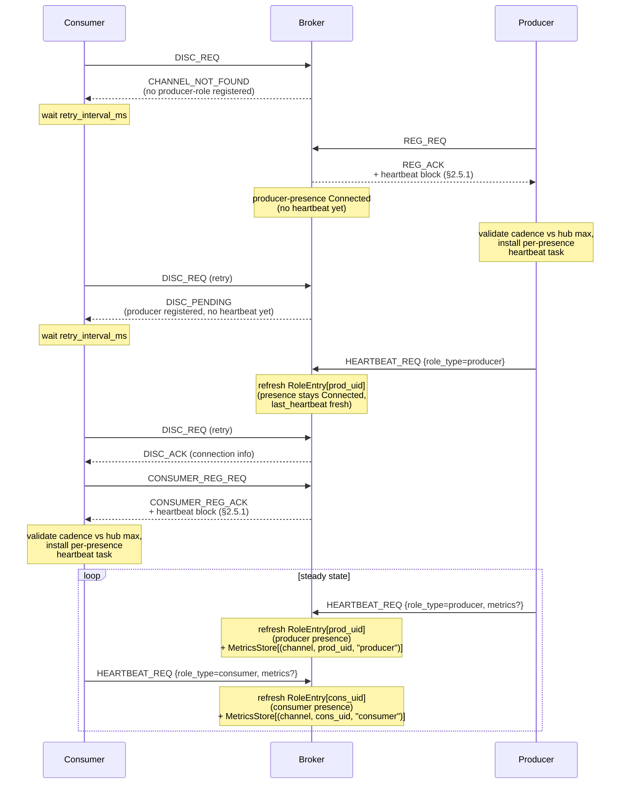

# HEP-CORE-0023: Startup Coordination

| Property      | Value                                                              |
|---------------|--------------------------------------------------------------------|
| **HEP**       | `HEP-CORE-0023`                                                    |
| **Title**     | Startup Coordination — Role State Machine and Presence Waiting     |
| **Status**    | Phase 1 implemented (2026-03-11); Phase 2 redesigned (2026-04-14); §2 fully rewritten 2026-05-07 — FSM is per-presence on `RoleEntry` (Connected/Pending/Disconnected); channel observability is derived; `Closing`/`grace_heartbeats`/`FORCE_SHUTDOWN` removed. |
| **Created**   | 2026-03-10                                                         |
| **Revised**   | 2026-04-14: Phase 2 replaced "Deferred DISC_ACK" (broker-queued replies) with a role state-machine + three-response DISC_REQ model.  2026-05-06: §2.5.2 per-presence heartbeat contract added; §5.5 updated for presence-list dual-hub model.  2026-05-07: §2 re-architected — FSM moved from `ChannelEntry` to per-presence rows on `RoleEntry`; `ChannelEntry.status`/`last_heartbeat` removed (channel observability is now derived); `Closing` state and `grace_heartbeats` deleted (channel teardown is atomic on producer-presence Disconnected). |
| **Area**      | Broker Protocol / Script Hosts / Config                            |
| **Depends on**| HEP-CORE-0007 (Protocol), HEP-CORE-0019 §2.3 (Per-presence heartbeats — Phase 6), HEP-CORE-0033 §8 (HubState entry types), HEP-CORE-0033 §18 (broker routing classes), HEP-CORE-0033 §19 (multi-presence roles) |

---

## 1. Problem Statement

When a pipeline starts, roles connect to the broker in arbitrary order. Without
coordination, a consumer may discover a channel before the producer has registered it
(CHANNEL_NOT_FOUND), or a processor may begin processing before its upstream producer
is ready.

Two complementary coordination mechanisms:

1. **Role state machine with three-response DISC_REQ** (broker-managed, §2):
   The broker maintains a **per-presence** state row (one per
   `(uid, channel, role_type)` registration) with three states —
   Connected / Pending / Disconnected — driven by that presence's
   own `HEARTBEAT_REQ`.  A consumer's `DISC_REQ` returns one of
   three responses derived from the **producer-presence's** state
   for the queried channel; clients retry on `DISC_PENDING` /
   `CHANNEL_NOT_FOUND`.  No broker-side queuing of pending requests.

2. **`wait_for_roles`** (config-managed, §3+): A role explicitly declares which other
   roles it must see registered before it begins its processing loop. Uses
   `ROLE_REGISTERED_NOTIFY`.

---

## 2. Role State Machine + Three-Response DISC_REQ

> **Architectural model (read first).**  Heartbeats are about
> **role liveness**, never about channels directly.  A heartbeat is
> a role process saying "I am alive."  The broker's only job on
> receipt is to refresh that role's `last_heartbeat` and update its
> state.  Channel-level decisions — "can a consumer attach?",
> "should this channel close?" — are **derived** from the producer-
> role's state, not driven by a separate channel-side FSM.
>
> Concretely:
>
> - The state machine in §2.1 is the **role's** FSM
>   (`Connected` ↔ `Pending` → `Disconnected`).  There is no
>   parallel channel FSM.
> - The DISC_REQ three-response pattern in §2.2 derives its three
>   outcomes from the producer-role's state.
> - Channel close is **atomic**: when the **last live**
>   producer-presence on a channel transitions to `Disconnected`
>   (heartbeat timeout, explicit `DEREG_REQ`, admin force, or whole-
>   role disconnect), the broker fires `CHANNEL_CLOSING_NOTIFY` to
>   all remaining channel members and removes the channel entry.  No
>   separate grace window.  No `FORCE_SHUTDOWN` escalation.  The
>   role's `pending_miss_heartbeats` window IS the grace.  See
>   §2.1.1 for the multi-producer predicate.
> - `ChannelEntry` does not store its own FSM state.  Both channel
>   observability and channel existence are derived queries over the
>   producer-presences on `RoleEntry` (§2.6).
> - `ChannelEntry.producers` and `ChannelEntry.consumers` are
>   symmetric per-party bookkeeping lists.  Producer identity (pid,
>   hostname, role_uid, zmq_identity) is stored per-`ProducerEntry`
>   so multi-producer ZMQ channels keep accurate broker-side
>   bookkeeping for fan-out and notify routing (§2.1.1).

### 2.1 Role Lifecycle States

The state machine is **per role-presence**, owned by the broker's
per-`(channel, role_type)` presence row on `RoleEntry.presences` and
driven by that presence's `HEARTBEAT_REQ` (matched by `(uid,
role_type)` per HEP-CORE-0019 §2.3 / Phase 6).  There is no separate
channel-side FSM: both **channel observability** ("is this channel
still serving data?") and **channel existence** ("is this channel
still registered with the hub?") are **derived** queries over the
producer-role-presences (§2.1.1, §2.6).

A role-presence has three states: **Connected** (heartbeats fresh),
**Pending** (heartbeats stalled but recoverable), **Disconnected**
(terminal; presence reaped).  Two timeouts gate the transitions
(§2.5).

```mermaid
stateDiagram-v2
    [*] --> Connected : REG_REQ / CONSUMER_REG_REQ accepted<br/>(presence row created, first heartbeat already in flight)
    Connected --> Connected : HEARTBEAT_REQ<br/>(refresh last_heartbeat, update metrics)
    Connected --> Pending : ready_timeout<br/>(missed heartbeats)
    Pending --> Connected : HEARTBEAT_REQ (recovery)<br/>bump pending_to_ready_total
    Pending --> [*] : pending_timeout<br/>presence Disconnected;<br/>fan-out CHANNEL_CLOSING_NOTIFY<br/>iff role_type=producer AND<br/>last live producer (§2.1.1)
    Connected --> [*] : DEREG_REQ accepted<br/>presence Disconnected;<br/>fan-out CHANNEL_CLOSING_NOTIFY<br/>iff role_type=producer AND<br/>last live producer (§2.1.1)
    Pending --> [*] : DEREG_REQ accepted (same path)
```

Precise transitions (all keyed on `(uid, role_type)`, i.e. one FSM
per **presence** — a processor with `(uid, "producer")` and
`(uid, "consumer")` runs two FSMs):

| Trigger | From | To | Side effect |
|---|---|---|---|
| `REG_REQ` / `CONSUMER_REG_REQ` accepted | — | Connected | create `RoleEntry` (or add presence to existing uid); bump `connected_total` |
| Matching `HEARTBEAT_REQ` received | Connected | Connected | refresh `RoleEntry.last_heartbeat`, write metrics |
| Matching `HEARTBEAT_REQ` received | Pending | Connected | refresh `RoleEntry.last_heartbeat`, reset `state_since`, bump `pending_to_connected_total` |
| Missed heartbeats for `effective_ready_timeout` | Connected | Pending | set `state_since`, bump `connected_to_pending_total` |
| Missed heartbeats for `effective_pending_timeout` | Pending | Disconnected | bump `pending_to_disconnected_total`; **if `role_type == producer`**: fan-out `CHANNEL_CLOSING_NOTIFY`(reason=`pending_timeout`) **to all remaining channel members** and remove `ChannelEntry` **if no other producer-presence remains alive on this channel** (§2.1.1); remove presence from `RoleEntry` (or whole `RoleEntry` if last presence) |
| `DEREG_REQ` accepted | Connected/Pending | Disconnected | bump `voluntary_disconnect_total`; **if `role_type == producer`**: fan-out `CHANNEL_CLOSING_NOTIFY`(reason=`voluntary_close`) and remove `ChannelEntry` **if no other producer-presence remains alive on this channel** (§2.1.1); remove presence |

**No channel-side grace or FORCE_SHUTDOWN.**  The role's
`pending_miss_heartbeats` window IS the grace.  Once the **last**
producer-role-presence on a channel reaches `Disconnected`, the
channel is removed atomically; consumers learn via
`CHANNEL_CLOSING_NOTIFY` (best-effort) and any future `DISC_REQ`
returns `CHANNEL_NOT_FOUND` (consumers treat either signal as
"channel gone, stop"; see §2.2).

#### 2.1.1 Multi-producer channels (transport-agnostic)

A data channel may have **one or more producers**.  HEP-CORE-0008's
abstract queue (QueueReader/QueueWriter) is the contract role/hub
code operates against; multi-producer is a queue-pattern question,
not a control-plane assumption.

- **ZMQ-backed channels** support multiple producers natively
  (PUSH–PULL with multiple PUSHers, PUB–SUB with multiple PUBs,
  etc.).  Each producer issues its own REG_REQ on the same
  `channel_name` and is admitted as an independent
  `ProducerEntry` on `ChannelEntry.producers`.  Per-producer
  identity (pid, hostname, role_uid, zmq_identity) is preserved.
- **SHM-backed channels** are physically single-producer (one
  writer to the shared-memory ring).  The broker rejects a second
  REG_REQ on an SHM channel with
  `MULTI_PRODUCER_NOT_SUPPORTED_FOR_SHM` (HEP-CORE-0007 §12.4a).

**Channel-existence predicate (the source of truth):**

> A `ChannelEntry` exists iff at least one producer-presence is
> currently alive (state ≠ Disconnected).  When the last live
> producer-presence transitions to Disconnected, HubState removes
> the entry and broadcasts `CHANNEL_CLOSING_NOTIFY` to every
> remaining member (consumers and any peer hubs that relay this
> channel).

Mechanically: every path that transitions a producer-presence to
Disconnected (pending-timeout sweep, voluntary DEREG_REQ, admin
force-close, whole-role disconnect) invokes a single HubState
invariant-maintenance step.  That step scans the producer-presences
attached to the channel; if none remain alive, the channel is
removed.  Consumers leaving (`CONSUMER_DEREG_REQ`) does **not**
trigger channel removal regardless of how many consumers were
attached.

**Cross-tag admission.**  Per HEP-CORE-0017 (Pipeline Architecture),
processors are producers on their `out_channel`.  A channel may have
mixed-tag producers — e.g., `prod.X` and `proc.Y` may both be
producers of channel `C`.  All producers on the same channel MUST
agree on the channel-wide schema invariant (same
`schema_hash`/`schema_blds`/`packing`); REG_REQ that fails the
schema-mismatch check is rejected.

**Same-uid restart.**  REG_REQ on an existing channel from the same
`role_uid` as an already-admitted producer is treated as a
**restart-replace** of that producer's `ProducerEntry` (the prior
producer-presence is reset to a fresh Connected sub-state).  No
duplicate ProducerEntry is appended.  Same-uid restart is distinct
from new-uid admission both on the wire (same uid) and in HubState
(same key in `presences`).

**Schema-record ownership in multi-producer.**  Per HEP-CORE-0034
namespace-by-owner, each producer owns its own
`(role_uid, schema_id)` schema record under the owner-keyed
registry.  Multi-producer same-channel does **not** create a shared
schema record; cross-citation across producers on the same channel
is rejected by the existing fingerprint-equality gate.  When a
producer's role is fully disconnected, its private schema records
are evicted per HEP-CORE-0034 §7.2; hub-globals (owner=`"hub"`)
remain.

**Rationale:**

- **Heartbeat is about role liveness, not channel liveness.** A
  channel exists because some producer-role registered it; therefore
  the channel's "is alive?" question is answered by querying the
  producer-role's FSM state.  Maintaining a separate
  channel-FSM driven by the same heartbeats is duplicate
  bookkeeping that historically caused the consumer-corrupts-channel-
  status bug (HEP-CORE-0019 §2.3 pre-Phase-6).
- **`Connected → Pending → Disconnected` keeps a presence row alive
  through transient stalls** (GC, load spike, brief network blip).
  A `Pending → Connected` recovery via the next heartbeat costs no
  data loss and no consumer-side reconnect.
- **No `Closing` state.**  Earlier designs introduced a separate
  `Closing` state with a grace window and `FORCE_SHUTDOWN` escalation
  for live-producer voluntary close.  That mechanism was removed:
  - The role's `pending_miss_heartbeats` already provides a
    bounded window before terminal disconnect — there is no second
    grace to give.
  - Voluntary close (`DEREG_REQ`) is initiated by the producer-role
    itself; there is no "we asked it to leave but it hasn't" race
    that grace would cover.
  - Consumers that fail to drain in time observe `CHANNEL_NOT_FOUND`
    on their next interaction and react identically to a closing
    notification.  No broker-side coercion is needed.
- **Per-presence FSM, not per-process.**  A processor's
  consumer-presence and producer-presence each run their own FSM.
  If the processor's consumer-side falls silent but its
  producer-side keeps heartbeating, the broker reaps the consumer-
  presence row only — the upstream channel sees an absent consumer;
  the downstream channel keeps serving.

### 2.2 Three-Response DISC_REQ

When a consumer sends `DISC_REQ`, the broker **always replies immediately** with
one of three well-defined responses derived from the **producer-role's
state** for that channel (per §2.1):

| Producer-presence state | Channel observable | DISC_REQ response | Consumer action |
|---|---|---|---|
| absent (channel not registered) | absent | `CHANNEL_NOT_FOUND` | retry until producer registers, or surface to caller after `timeout_ms` |
| Connected, but no heartbeat seen yet (just registered) | "registering" | `DISC_PENDING` | wait `retry_interval_ms`, retry |
| Pending (heartbeats stalled) | "stalled" | `DISC_PENDING` | wait `retry_interval_ms`, retry |
| Connected, heartbeats fresh | "live" | `DISC_ACK` (connection info) | proceed to `CONSUMER_REG_REQ` |



See HEP-CORE-0007 §DISC_REQ for the precise payload of each response variant.

**Notes on the steady-state loop:**

- Both producer-presence and consumer-presence emit per-cycle
  heartbeats with `(channel, uid, role_type)` in the wire payload.
  See HEP-CORE-0019 §4.1 for the full HEARTBEAT_REQ shape (Phase 6).
- Each heartbeat refreshes its **own** `RoleEntry[uid]` presence
  row and writes its own `MetricsStore[(channel, uid, role_type)]`
  row.  No heartbeat ever touches another presence's bookkeeping.
- A processor with two presences (consumer-of-in_channel +
  producer-of-out_channel) sends two heartbeats per cycle — one
  with `role_type="consumer"` for `in_channel` (refreshes its
  consumer-presence row) and one with `role_type="producer"` for
  `out_channel` (refreshes its producer-presence row).
- "Channel still alive?" is never answered by querying a
  channel.last_heartbeat field — it is answered by looking up the
  producer-role's presence state for that channel (§2.6).

### 2.3 Chain Resolution (Multi-hop)

Each hub independently runs the state machine. For a chain
`Producer → Hub A → Processor-A → Hub B → Processor-B → Hub C → Consumer`:

1. Processor-A sends DISC_REQ to Hub A → `CHANNEL_NOT_FOUND` until Producer registers; once Producer's REG_REQ lands, the response shifts to `DISC_PENDING` until Producer's first heartbeat arrives.
2. Producer registers on Hub A, sends first heartbeat → producer-presence on Hub A is Connected with fresh heartbeat → Processor-A's next retry receives `DISC_ACK`.
3. Processor-A registers its output-presence on Hub B (`DISC_REQ` from Hub B's view returns `DISC_PENDING` until Processor-A's first heartbeat there).
4. Processor-B sends DISC_REQ to Hub B → `DISC_PENDING` until Processor-A's producer-presence on Hub B is Connected with fresh heartbeat.
5. And so on down the chain.

No special coordination is needed. Each hop converges independently via retry.

### 2.4 Client Retry Policy

`BrokerRequestComm::discover_channel(channel, timeout_ms)` implements the retry loop:
- On `DISC_PENDING`: wait `retry_interval_ms` (default 100ms), resend DISC_REQ, up to
  `timeout_ms` total.
- On `DISC_ACK`: return success immediately.
- On `CHANNEL_NOT_FOUND`: retry (producer may register later) up to `timeout_ms`.
- On overall `timeout_ms` expiry: return failure to caller.

The retry logic is entirely client-side. The broker holds no state for pending DISC requests.

### 2.5 Broker Configuration — Heartbeat-Multiplier Timeouts

The broker's role-liveness timeouts are **derived from the heartbeat cadence**,
not specified as absolute wall-clock durations. This makes the defaults
self-scaling across deployments: a fast pipeline with 20 ms heartbeats
reaps a dead role in ~400 ms; a low-power role with 5 s heartbeats gets
~50 s tolerance, using the same multipliers.

There are **two** timeouts (no separate "channel close" grace — see §2.1):

```cpp
struct BrokerService::Config {
    /// Expected client heartbeat cadence (broker-wide). Default: 500 ms (2 Hz).
    std::chrono::milliseconds heartbeat_interval{kDefaultHeartbeatIntervalMs};

    /// Connected -> Pending demotion after this many consecutive missed heartbeats.
    uint32_t ready_miss_heartbeats  {10};

    /// Pending -> Disconnected after this many additional missed heartbeats,
    /// counted from entry into Pending.  On producer-role transition to
    /// Disconnected, fan-out CHANNEL_CLOSING_NOTIFY and remove the channel.
    uint32_t pending_miss_heartbeats{10};

    /// Optional explicit overrides. nullopt = derive from
    /// `heartbeat_interval * <miss_heartbeats>`. Has_value = use verbatim.
    std::optional<std::chrono::milliseconds> ready_timeout_override;
    std::optional<std::chrono::milliseconds> pending_timeout_override;

    std::chrono::milliseconds effective_ready_timeout()   const noexcept;
    std::chrono::milliseconds effective_pending_timeout() const noexcept;
};
```

JSON (all keys optional; defaults resolve via the multipliers above):

```json
"broker": {
  "heartbeat_interval_ms":    500,
  "ready_miss_heartbeats":     10,
  "pending_miss_heartbeats":   10,

  "ready_timeout_ms":   null,
  "pending_timeout_ms": null
}
```

**Named constants** live in `src/include/utils/timeout_constants.hpp`
(`kDefaultHeartbeatIntervalMs`, `kDefaultReadyMissHeartbeats`,
`kDefaultPendingMissHeartbeats`) with CMake-time override macros following
the `PYLABHUB_DEFAULT_*` convention.

With the 2 Hz / 10×10 defaults, the effective wall-clock windows are:

| Transition                          | Window               |
|-------------------------------------|----------------------|
| Connected -> Pending                | 5 s (10 × 500 ms)    |
| Pending -> Disconnected             | +5 s                 |
| **Total reclaim**                   | **~10 s** from last heartbeat to presence reaped (and producer-role's channel torn down, if applicable) |

**Floor: timeouts are always enforced.** `effective_ready_timeout()` and
`effective_pending_timeout()` are floored at `heartbeat_interval` so a
misconfiguration (`override = 0 ms`, or `miss_heartbeats = 0`) cannot
create a permanently-dangling presence row.  A stuck presence is always
reaped within at most `2 * heartbeat_interval`.

**Removed: `grace_heartbeats` / `effective_grace()` / `FORCE_SHUTDOWN`
escalation.**  Earlier designs included a separate "channel closing"
grace window between `CHANNEL_CLOSING_NOTIFY` and `FORCE_SHUTDOWN`.  That
was redundant with the role's `pending_miss_heartbeats` window (which
already gives a producer-role presence time to recover before its
channel is torn down) and is removed in the corrected model.  Channel
removal is **atomic** on producer-role transition to Disconnected.

**Role-close cleanup API.** Every dereg site (heartbeat-timeout reap,
voluntary `DEREG_REQ`, script-requested close, dead-consumer detection)
calls a central `on_role_disconnected()` hook that fans out to
per-module cleanup helpers (federation, band, future modules).  When
the disconnected presence is `role_type == "producer"`, the hook also
removes the corresponding `ChannelEntry` and emits
`CHANNEL_CLOSING_NOTIFY`.  This guarantees that when a role exits —
for any reason — its band memberships are removed and any federation
relay state referencing it is dropped, before the next broadcast or
relay is processed.  See `BrokerServiceImpl::on_role_disconnected`
in `src/utils/ipc/broker_service.cpp`.

### 2.5.1 Role-side preferred cadence vs. hub authority

**The hub is authoritative for the timeout contract.**  `heartbeat_interval_ms`
in the hub's broker config is the **maximum tolerated silence** the hub will
accept before progressing the Connected→Pending→Disconnected countdown.  Roles
may run their heartbeat sender at a faster cadence (smaller interval) for
their own operational reasons, but they must never run slower.

**Role config field.**  `role.json::timing.heartbeat_interval_ms` (already
parsed by `TimingConfig`) is the role's *preferred* cadence — its own
decision, ≤ hub's max.

**Negotiation at registration time.**  REG_ACK and CONSUMER_REG_ACK carry
a `heartbeat` JSON block populated from the broker's running config:

```jsonc
{
  "status": "success",
  "channel_id": "...",
  "heartbeat": {
    "heartbeat_interval_ms":    500,   // hub's max tolerated silence
    "ready_miss_heartbeats":     10,
    "pending_miss_heartbeats":   10
  }
}
```

The role compares its configured `heartbeat_interval_ms` against the hub's
returned value:

| Comparison              | Action                                                       |
|-------------------------|--------------------------------------------------------------|
| `role ≤ hub`            | INFO log "aligned with hub". Role keeps its faster cadence.  |
| `role > hub`            | WARN log + **reset role's interval to hub's value** (the role would otherwise be reaped by hub-side liveness). |

**Why reset, not reject.**  A misconfigured role that exceeds the hub's
tolerance would otherwise be cycled through Connected→Pending→Disconnected on
every connection.  Resetting to the hub's max keeps the role functional
and surfaces the misconfiguration via the WARN, leaving the operator to
fix the role-side config at their convenience.

**Implementation note (HEP-CORE-0033 §15 Phase 9 wiring).**  The role's
periodic-heartbeat task is installed *after* REG_ACK arrives — not at
ctrl-thread spawn — so the negotiated effective interval is always honored
without runtime mutation of an already-scheduled task.
`BrokerRequestComm::set_periodic_task` routes through the cmd queue and
appends into the active poll-loop's task vector, so post-startup install
is supported without restructuring the loop.

**Out of scope.**  Per-role / per-channel overrides are deliberately
absent: the hub's value is broker-wide and applies uniformly.  The
optional `ready_timeout_ms` / `pending_timeout_ms` overrides are
broker-internal (see §2.5 above) and are NOT part of the heartbeat ACK
block — only the three multiplier fields are.

### 2.5.2 Per-presence heartbeat contract (Phase 6)

A role declares a list of **presences** at startup — one per
`(hub, channel, role_kind)` tuple it registers as.  Each presence
emits its own `HEARTBEAT_REQ` per cycle, carrying `(channel_name, uid,
role_type)` in the wire payload (per HEP-CORE-0019 §4.1).  Cardinality:

| Role | Presences | Heartbeats / cycle |
|---|---|---|
| Producer | 1 (`{out_hub, out_channel, producer}`) | 1 |
| Consumer | 1 (`{in_hub, in_channel, consumer}`) | 1 |
| Single-hub processor (`in_hub == out_hub`) | 2 (`{hub, in_channel, consumer}` + `{hub, out_channel, producer}`) | 2 over a single DEALER (the underlying connection deduplicates by `(broker_endpoint, broker_pubkey)`) |
| Dual-hub processor | 2 (one per hub) | 2 (one over each DEALER) |

The broker's `handle_heartbeat_req` routes the heartbeat by
`(uid, role_type)` — looking up the matching presence row in
`RoleEntry(uid)` (a single uid may have multiple presences; see
§2.6) and refreshing **only that presence's** `last_heartbeat`
plus its metrics row.

- `role_type == "producer"`: refresh
  `RoleEntry(uid).presences[(channel, "producer")].last_heartbeat`;
  advance that presence's FSM (Connected ↔ Pending per §2.1);
  write metrics under `MetricsStore[(channel, uid, "producer")]`.
- `role_type == "consumer"`: refresh
  `RoleEntry(uid).presences[(channel, "consumer")].last_heartbeat`;
  advance that presence's FSM (same state machine);
  write metrics under `MetricsStore[(channel, uid, "consumer")]`.

The two cases are symmetric: each refreshes its own presence row
and never touches another presence's bookkeeping.  The asymmetry
appears only on `Pending → Disconnected` (§2.1) — when the
disconnected presence is `role_type == "producer"`, the hook
additionally tears down the `ChannelEntry`.

**Watchdog scope.**  The §2.5 timeout-multiplier math
(`ready_miss_heartbeats`, `pending_miss_heartbeats`) applies to
**every presence row** — producer and consumer alike.  A consumer-
presence that misses heartbeats is reaped on the same schedule as
a producer-presence that misses heartbeats; the difference is only
in side-effects (a reaped producer-presence tears down its
channel; a reaped consumer-presence just removes the consumer from
the channel's consumer list).

**Failure modes resolved.**  Pre-Phase-6 brokers (HEP-CORE-0019
§9 Phase 1-5 era) ignored `uid` and `role_type` and treated every
heartbeat for a channel as if it came from that channel's producer.
Two consequences, both fixed by the Phase 6 split:
- Consumer's heartbeat refreshed the producer's bookkeeping,
  masking producer-death so the channel was never declared
  unreachable.
- Consumer's metrics piggyback was attributed to the producer's
  `RoleEntry.latest_metrics`.

**Implementation note.**  The role-side heartbeat tick is installed
per-presence; a role with N presences runs N tick callbacks per
cycle.  Each callback emits a heartbeat for **its own**
`(uid, role_type)` presence — the broker looks up the per-presence
row.  See `docs/tech_draft/role_host_template_design.md` §6 for
the role-side implementation; HEP-CORE-0033 §19 for the multi-
presence connection model.

---

**State-machine metrics** (HEP-CORE-0019 integration). The broker
exposes monotonic counters via
`BrokerService::query_role_state_metrics()` returning a
`RoleStateMetrics` snapshot. Counters are aggregated **per
presence** — incremented once per FSM transition regardless of
which uid or channel the presence belongs to:

| Field                                | Meaning                                                        |
|--------------------------------------|----------------------------------------------------------------|
| `connected_total`                    | New presences entering Connected (REG_REQ / CONSUMER_REG_REQ)  |
| `connected_to_pending_total`         | Connected -> Pending demotions                                 |
| `pending_to_connected_total`         | Pending -> Connected recoveries (first or returning heartbeat) |
| `pending_to_disconnected_total`      | Pending -> Disconnected (heartbeat-timeout reap)               |
| `voluntary_disconnect_total`         | Connected/Pending -> Disconnected via DEREG_REQ                |

These counters give tests a race-free way to assert state
transitions occurred, without relying on wall-clock sleeps.

### 2.6 Data Structures

Broker-side state lives in `HubState` (see
`src/include/utils/hub_state.hpp` for the authoritative
definitions; HEP-CORE-0033 §8 for the wider HubState contract).
Two struct types carry the role-FSM state; a third
(`ChannelEntry`) records channel topology only — it does **not**
own an independent FSM.

| Struct | Map | Keyed by | Owns the FSM? | Last-heartbeat semantics |
|---|---|---|---|---|
| `RoleEntry` | `HubState.roles` | role uid | **yes** — one FSM per **presence** under this uid (§2.1) | each presence row carries its own `last_heartbeat` (refreshed only by heartbeats matching its `(uid, role_type)`) |
| `ChannelEntry` | `HubState.channels` | channel name | no — topology + endpoints + per-party bookkeeping (producers + consumers lists) only | does not store FSM state; channel observability + existence are derived from scanning producer-presences across roles (§2.1, §2.1.1) |
| `ProducerEntry` (nested in `ChannelEntry.producers`) | per-channel vector | (channel, role_uid) | no — index back into the producer-presence in `RoleEntry` | no own field; defers to `RoleEntry[role_uid].find_presence(channel,"producer")` |
| `ConsumerEntry` (nested in `ChannelEntry.consumers`) | per-channel vector | (channel, role_uid) | no — index back into the consumer-presence in `RoleEntry` | no own field; defers to `RoleEntry[role_uid].find_presence(channel,"consumer")` |

```cpp
// Schematic — see hub_state.hpp for exact fields.

enum class RoleState : uint8_t { Connected, Pending, Disconnected };

struct RolePresence {
    std::string                            channel;            // channel this presence is on
    std::string                            role_type;          // "producer" | "consumer"
    RoleState                              state;              // §2.1 FSM
    std::chrono::steady_clock::time_point  last_heartbeat;     // refreshed by matching HEARTBEAT_REQ only
    std::chrono::steady_clock::time_point  state_since;        // last FSM transition
    nlohmann::json                         latest_metrics;     // Phase 6 — per HEP-0019 §4.1
    std::chrono::system_clock::time_point  metrics_collected_at;
};

struct RoleEntry {
    std::string                            uid;
    std::string                            name;
    std::string                            role_tag;           // "prod"|"cons"|"proc"
    std::vector<RolePresence>              presences;          // one per (channel, role_type)
    std::chrono::system_clock::time_point  first_seen;
    // Per-uid liveness is the OR of any-presence Connected/Pending.
    // Lookup helpers:
    //   const RolePresence* find_presence(channel, role_type) const noexcept;
    //   bool any_presence_alive() const noexcept;
};

struct ProducerEntry {                    // mirrors ConsumerEntry shape
    std::string  role_uid;                // index back into RoleEntry[role_uid]
    std::string  role_name;
    uint64_t     producer_pid;
    std::string  producer_hostname;
    std::string  zmq_identity;            // ROUTER routing for direct notify
    std::chrono::system_clock::time_point connected_at;
    // Per-producer inbox metadata (HEP-CORE-0027 §3 — inbox is per-presence,
    // NOT channel-wide; a second producer joining a Fan-In channel brings
    // its own inbox endpoint).
    std::string  inbox_endpoint;          // empty if no inbox
    std::string  inbox_schema_json;       // JSON; empty if no inbox
    std::string  inbox_packing;
    std::string  inbox_checksum;
    // Per-producer data-plane endpoint (HEP-CORE-0021 §16.3 — Wave M2.5).
    // Each Fan-In producer publishes from its own bound ZMQ socket.
    std::string  zmq_node_endpoint;
    // Per-producer CURVE pubkey for ZMQ ctrl socket auth (HEP-CORE-0021 §5.2).
    std::string  zmq_pubkey;
    // Producer-supplied free-form JSON blob (HEP-CORE-0007 §12.4).
    // Channel-level DISC_REQ_ACK aggregates blobs into a tree keyed
    // by role_uid (see `aggregate_metadata_tree()`).
    nlohmann::json metadata;              // null if no metadata
};

struct ChannelEntry {
    std::string                            name;          // channel-wide identifier
    std::string                            shm_name;      // SHM channels only

    // Channel-wide schema invariants (HEP-CORE-0023 §2.1.1: all
    // producers MUST agree).  Anonymous channels leave id+owner empty.
    std::string                            schema_hash;
    uint32_t                               schema_version{0};
    std::string                            schema_id;     // HEP-CORE-0034
    std::string                            schema_blds;
    std::string                            schema_owner;  // "hub" | <role_uid>

    // Channel-wide transport invariants.
    bool                                   has_shared_memory{false};
    ChannelPattern                         pattern{ChannelPattern::PubSub};
    std::string                            data_transport{"shm"};

    // Per-party rows (1..N producers per HEP-CORE-0023 §2.1.1).  All
    // per-producer attributes — inbox_*, zmq_node_endpoint (HEP-0021
    // §16.3), zmq_pubkey (HEP-0021 §5.2), metadata (HEP-0007 §12.4) —
    // live on the rows below, NOT at channel scope (Wave M2.5).
    std::vector<ProducerEntry>             producers;
    std::vector<ConsumerEntry>             consumers;

    std::chrono::system_clock::time_point  created_at;

    // No FSM state, no status, no last_heartbeat — per-presence FSM
    // on RoleEntry is the source of truth (HEP-CORE-0023 §2.6).
    // Channel existence is derived:
    //   bool exists = !producers.empty() &&
    //                 std::any_of(producers, [&](const auto &p){
    //                     auto *pp = roles[p.role_uid].find_presence(name,"producer");
    //                     return pp && pp->state != RoleState::Disconnected;
    //                 });
    // Channel observability (kAbsent|kRegistering|kStalled|kLive) is
    // derived per HEP-0023 §2.2 from the producer-presence FSM(s)
    // via `compute_channel_observable(ch, roles)`.
};

struct ConsumerEntry {
    std::string  role_uid;                // index back into RoleEntry[role_uid]
    std::string  role_name;
    uint64_t     consumer_pid;
    std::string  zmq_identity;            // ROUTER routing for direct notify
    std::chrono::system_clock::time_point connected_at;
    // Per-consumer inbox metadata (HEP-CORE-0027 §3).
    std::string  inbox_endpoint;          // empty if no inbox
    std::string  inbox_schema_json;
    std::string  inbox_packing;
    std::string  inbox_checksum;
};

class HubState {
    std::unordered_map<std::string, ChannelEntry> channels_;
    std::unordered_map<std::string, RoleEntry>    roles_;
    // (also: bands_, peers_, schemas_ — see HEP-0033 §8 / HEP-0034)
};
```

**Rationale for storing the FSM on `RoleEntry`, not `ChannelEntry`:**

- **A heartbeat is a role's "I am alive."**  Bookkeeping should
  follow that: each presence tracks its own heartbeat, its own
  state, and its own metrics row.  No other presence's
  bookkeeping is touched by an incoming heartbeat.
- **Channel observability is derived, not stored.**  Whether a
  channel is "live" is exactly the question "is its producer-role
  presence Connected?" — which is already on `RoleEntry`.  Storing
  a parallel `ChannelEntry.status`/`last_heartbeat` is duplicate
  state that drifts from the truth, and it caused the historical
  consumer-corrupts-channel-status bug (HEP-CORE-0019 §2.3).
- **Per-presence keying handles processors cleanly.**  A processor
  with `(uid, "consumer")` on `in_channel` and `(uid, "producer")`
  on `out_channel` runs two independent FSMs under the same uid.
  If its consumer-side falls silent but its producer-side keeps
  heartbeating, only the consumer-presence row goes Pending →
  Disconnected; the producer-presence (and the downstream channel)
  is unaffected.
- **Voluntary disconnect uses the same path.**  `DEREG_REQ` from
  a producer-role transitions its producer-presence directly to
  Disconnected (same hook as the heartbeat-timeout reap),
  triggering atomic channel teardown.  No `Closing` state, no
  separate grace.

**FSM watchdog scope.**  The §2.5 timeout-multiplier math
(`ready_miss_heartbeats`, `pending_miss_heartbeats`) iterates over
**every presence row** in `HubState.roles`.  When a presence
transitions to `Disconnected`, the broker's `on_role_disconnected`
hook is called; for `role_type == "producer"` the hook also
removes the matching `ChannelEntry` and emits
`CHANNEL_CLOSING_NOTIFY`.  Same-host consumer-presence death is
ALSO detectable via `is_process_alive(pid)` and ZMTP socket
disconnect — those provide a faster reap signal than the
heartbeat timeout, and short-circuit the presence to Disconnected
when they fire.

**Future optimization — lazy state-indexed views** (deferred):

At higher scale, the watchdog loop (O(N) every poll cycle, where
N = total presence rows) can become hot. A lazy secondary index
avoids full iteration for common queries:

```cpp
// Secondary indices — maintained alongside roles_ via a single helper.
// Keyed by (uid, channel, role_type) — i.e., a presence handle.
std::unordered_set<PresenceKey> connected_presences_;
std::unordered_set<PresenceKey> pending_presences_;

/// Single transition point — updates both the role entry and the indices atomically.
/// All state changes MUST go through this helper.
void transition_state(const PresenceKey &k, RoleState new_state);
```

**Invariants** (enforce via code review + unit tests):
- Every Connected/Pending presence in `roles_` must be in exactly one of `connected_presences_` / `pending_presences_`.
- Disconnected presences must NOT appear in either index (they are reaped from `roles_` itself).
- All FSM mutations must go through `transition_state()` — never assign `presence.state` directly.

**When to add:** when profiling shows the watchdog loop or
state-filter queries dominate broker CPU time.  Indicators:
`heartbeat_check_us_avg > poll_interval / 4`, or N > 500 presences
per hub.  Until then, the simpler single-map design is preferred
for robustness over speed.

### 2.7 Migration from Prior Design (superseded 2026-04-14)

The original Phase 2 design (Deferred DISC_ACK) had the broker queue unanswered DISC_REQs
and reply later on role transition. Reasons for replacement:
- **Unbounded broker memory** under request bursts (O(outstanding requests)).
- **Hidden state**: "reply is queued" was not observable via any query.
- **Broker-owned retry timeout** forced a single retry policy on all clients.
- **Testing complexity**: race between queue drain and client timeout was flaky.

The state-machine + three-response model addresses all four concerns. See Git history
and archived design draft for the original rationale.

---

## 3. ROLE_REGISTERED_NOTIFY / ROLE_DEREGISTERED_NOTIFY

### 3.1 Purpose

Broadcast events that allow roles to react when other roles join or leave the hub.
Used by `wait_for_roles` to detect when upstream roles are ready.

### 3.2 ROLE_REGISTERED_NOTIFY

```
Direction:  Broker → ALL connected roles on this hub
Trigger:    Successful REG_REQ or CONSUMER_REG_REQ (role fully registered)
Delivery:   Unsolicited push (same as CHANNEL_CLOSING_NOTIFY)

Payload:
  role_uid          string   UID of the newly registered role
  role_type         string   "producer" | "consumer" | "processor"
  channel           string   Channel the role registered on
  hub_uid           string   UID of this hub (source_hub_uid in IncomingMessage)
```

Script host delivery (`source_hub_uid` identifies which hub):
```python
{"event": "role_registered", "role_uid": "PROD-SENSOR-A1B2C3D4",
 "role_type": "producer", "channel": "lab.raw", "source_hub_uid": "HUB-A-..."}
```

### 3.3 ROLE_DEREGISTERED_NOTIFY

```
Direction:  Broker → ALL connected roles on this hub
Trigger:    Successful DEREG_REQ or CONSUMER_DEREG_REQ; or broker-detected death

Payload:
  role_uid          string
  role_type         string   "producer" | "consumer" | "processor"
  channel           string
  reason            string   "graceful" | "heartbeat_timeout" | "process_dead"
  hub_uid           string
```

Script host delivery:
```python
{"event": "role_deregistered", "role_uid": "...", "role_type": "...",
 "channel": "...", "reason": "graceful", "source_hub_uid": "..."}
```

### 3.4 Delivery Policy

All `ROLE_REGISTERED_NOTIFY` / `ROLE_DEREGISTERED_NOTIFY` notifications are broadcast to
every connected role on the hub — no filtering, no subscription. This keeps the broker
simple. If volume becomes a concern, per-channel subscriptions can be added later.

---

## 4. ROLE_PRESENCE_REQ / ROLE_INFO_REQ (Polling)

For one-shot presence checks (used by `wait_for_roles` implementation):

```
ROLE_PRESENCE_REQ:
  role_uid          string   (or UID pattern with prefix e.g. "PROD-SENSOR-*")

ROLE_PRESENCE_ACK:
  status            string   "success"
  present           bool     true if role is currently registered

ROLE_INFO_REQ:
  role_uid          string   (exact match)

ROLE_INFO_ACK:
  status            string   "success"
  role_uid          string
  role_type         string
  channel           string
  inbox_endpoint    string   (empty if no inbox)
  inbox_schema_json string   (JSON string; empty if no inbox)
  inbox_packing     string
```

---

## 5. wait_for_roles Config

> **Implementation status**: Phase 1 implemented (2026-03-11). Pattern matching and UID prefix
> restrictions are deferred to Phase 2.

### 5.1 Field Definition

All three script host configs support `startup.wait_for_roles`. Each entry specifies an
**exact role UID** and an optional per-role timeout:

| Field | Type | Default | Description |
|-------|------|---------|-------------|
| `uid` | string | required | Exact UID to wait for (e.g. `"PROD-SENSOR-A1B2C3D4"`) |
| `timeout_ms` | int | 10000 | Per-role timeout in milliseconds; must be > 0 |

All three role binaries (producer, consumer, processor) accept this field.
Deadlock prevention is the operator's responsibility (e.g. do not create mutual waits).

**Note on adjacent processor chains**: Two adjacent processors in a chain
(`Proc-A → Proc-B`) do not need `wait_for_roles`. The DISC_REQ retry loop
handles their sequencing automatically: Proc-B's `DISC_REQ` to Hub B
returns `DISC_PENDING` until Proc-A's producer-presence on Hub B is
Connected with a fresh heartbeat, then `DISC_ACK` (see §2.3).

### 5.2 Config Example

```json
"startup": {
  "wait_for_roles": [
    {"uid": "PROD-SENSOR-A1B2C3D4", "timeout_ms": 15000},
    {"uid": "PROC-FILTER-B5C6D7E8"}
  ]
}
```

Roles are waited for sequentially in list order. Each has an independent deadline.
Absent `timeout_ms` defaults to 10000 ms.

### 5.3 Implementation: Startup Wait Loop (C++)

Executed in each script host's `start_role()`, after the messenger connects but before
`on_init` is called and before any background threads start:

```cpp
static constexpr int kPollMs = 200;
for (const auto& wr : config_.wait_for_roles) {
    LOGGER_INFO("[role] Startup: waiting for role '{}' (timeout {}ms)...",
                wr.uid, wr.timeout_ms);
    const auto deadline = std::chrono::steady_clock::now() +
                          std::chrono::milliseconds{wr.timeout_ms};
    bool found = false;
    while (std::chrono::steady_clock::now() < deadline) {
        py::gil_scoped_release rel;
        if (messenger_.query_role_presence(wr.uid, kPollMs)) {
            found = true;
            break;
        }
    }
    if (!found) {
        LOGGER_ERROR("[role] Startup wait failed: role '{}' not present after {}ms",
                     wr.uid, wr.timeout_ms);
        return false;  // triggers cleanup_on_start_failure()
    }
    LOGGER_INFO("[role] Startup: role '{}' found", wr.uid);
}
```

Uses `BrokerRequestComm::query_role_presence()` (ROLE_PRESENCE_REQ
polling, 200 ms poll interval).  GIL is released during each
200 ms poll so other Python threads remain unblocked.  After the
Phase 6 / presence-list migration (HEP-CORE-0033 §19), this call
becomes a Class B fall-through across all of the role's hub
connections — see §5.5 — letting dual-hub roles wait for
prerequisites on either hub without operator-side broker
selection.

### 5.4 Deferred: UID Prefix Restrictions (Phase 2)

The original design proposed prefix restrictions to prevent deadlocks:
- Producer: not allowed to wait for any role
- Consumer: may wait for `PROD-*` or `PROC-*` only
- Processor: may wait for `PROD-*` only

These restrictions are deferred to Phase 2. Current implementation accepts any UID
in any role type.

### 5.5 Dual-Hub Processor: Broker Selection for wait_for_roles

**Pre-Phase-6 limitation (current behaviour, being replaced).**  In
the current code, a processor with `in_hub_dir` ≠ `out_hub_dir`
maintains only one `BrokerRequestComm` (against `out_hub`); the
startup wait queries that single connection.  Roles registered only
on the input hub are not found and the wait times out.  Documented
mitigation: configure `startup.wait_for_roles` only with UIDs of
roles on the same hub as `out_hub_dir`.

**Phase 6 / presence-list resolution (post-migration).**  The
multi-presence connection model (HEP-CORE-0033 §19) gives the role
one `BrokerRequestComm` per hub it participates in.  `wait_for_roles`
becomes a **Class B fall-through query** (HEP-CORE-0033 §18): the
role asks each connection in
turn (`ROLE_PRESENCE_REQ` / `ROLE_INFO_REQ`); the first hub that
answers "found" wins; if no hub answers, the wait continues to
retry up to `timeout_ms`.

Concrete consequences after the migration:

- A dual-hub processor can wait for prerequisites registered on
  **either** hub; configure `startup.wait_for_roles` with UIDs from
  whichever hub they live on, no `broker: "in"|"out"` discriminator
  needed.
- Single-hub processors (`in_hub_dir == out_hub_dir`, or just
  `hub_dir`) collapse to one connection at runtime; the fall-through
  reduces to a single query — same wall-clock behaviour as today.

The implementation lands in
`docs/tech_draft/role_host_template_design.md` Wave B M8 along
with the L4 dual-hub processor test.  Until then, the pre-Phase-6
limitation above applies.

---

## 6. Complete Startup Sequence

### Phase 1: Process launch

Hub brokers are assumed to be running before any role starts.

### Phase 2: Hub A registrations (producer + processor input-side)

```
Producer:
  bind P2C ROUTER + XPUB sockets
  → REG_REQ (Hub A)  [role_type="producer"]
  ← REG_ACK
  → start heartbeat

Processor:
  loop: DISC_REQ (Hub A)
        ← CHANNEL_NOT_FOUND / DISC_PENDING / DISC_ACK   [§2.2]
        retry until DISC_ACK or timeout_ms expires
  wait_for_roles: ["PROD-SENSOR-*"]      [optional explicit wait]
```

### Phase 3: Processor data plane (after DISC_ACK resolves)

```
Processor:
  attach to in_shm (if in_transport="shm") OR connect ZMQ PULL socket
  start in_queue_
```

### Phase 4: Hub B registration (processor output-side)

```
Processor:
  bind out P2C ROUTER + XPUB sockets (if out_transport="shm")
  OR bind ZMQ PUSH socket (if out_transport="zmq")
  → REG_REQ (Hub B)  [role_type="processor"]
  ← REG_ACK
  → start heartbeat on Hub B
```

When `startup.hub_b_after_input_ready = true`, Phase 4 executes after Phase 3 completes.
When `false` (default), Phases 3 and 4 execute in parallel.

### Phase 5: Consumer (Hub B)

```
Consumer:
  loop: DISC_REQ (Hub B)
        ← CHANNEL_NOT_FOUND / DISC_PENDING / DISC_ACK   [§2.2]
        retry until DISC_ACK (issued once Processor's producer-presence
        on Hub B is Connected and its first heartbeat has been received)
  → CONSUMER_REG_REQ
  ← CONSUMER_REG_ACK
  attach to out_shm
  → HELLO (P2P to processor)
  on_consumer_joined fires in processor's ctrl_thread_
```

### Phase 6: Steady state

All roles are registered.  Outstanding `DISC_REQ` retry loops have
all received `DISC_ACK`.  `wait_for_roles` conditions met.
Processing loops started.  Per-presence heartbeats flowing — each
presence's `RoleEntry` row stays Connected as long as its own
heartbeats arrive within `effective_ready_timeout`.

---

## 7. source_hub_uid in IncomingMessage

When a processor connects to two hubs, control messages from both arrive on the same
`messages` list in `on_process`. The `source_hub_uid` field identifies the origin:

```cpp
struct IncomingMessage {
    std::string       event;        // event type or empty for P2P data
    std::string       sender_uid;   // sender role UID (for relay events)
    std::string       source_hub_uid; // hub that generated this message
    nlohmann::json    details;      // event payload
    std::vector<char> data;         // P2P binary payload
};
```

This is populated in `ctrl_thread_` from the messenger that received the event:
- Messages from `in_messenger_` → `source_hub_uid = in_hub_uid_`
- Messages from `out_messenger_` → `source_hub_uid = out_hub_uid_`

For single-hub roles (producer, consumer), `source_hub_uid` is always the one connected hub.

---

## 8. Protocol Index

| Message | Direction | §12.x in HEP-0007 |
|---------|-----------|-------------------|
| ROLE_REGISTERED_NOTIFY | Broker → All roles | Added §12.5 |
| ROLE_DEREGISTERED_NOTIFY | Broker → All roles | Added §12.5 |
| ROLE_PRESENCE_REQ/ACK | Role → Broker → Role | Added §12.3 |
| ROLE_INFO_REQ/ACK | Role → Broker → Role | Added §12.3 |
| DISC_REQ deferral | Consumer → Broker | Modified §12.3 |
| REG_ACK / CONSUMER_REG_ACK `heartbeat` block | Broker → Role | Added §2.5.1 |
