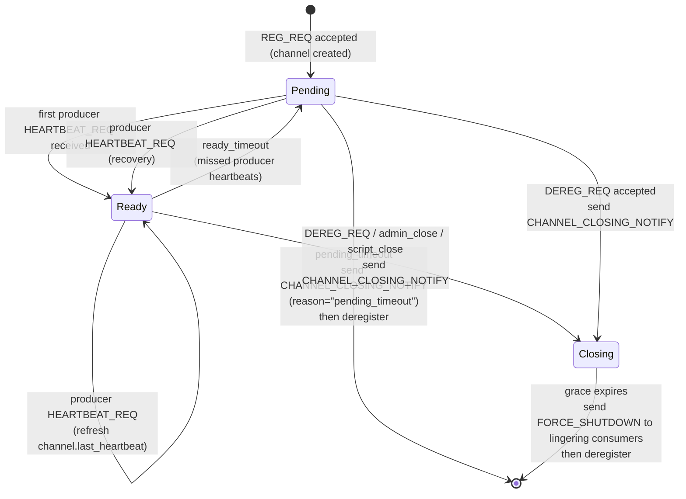
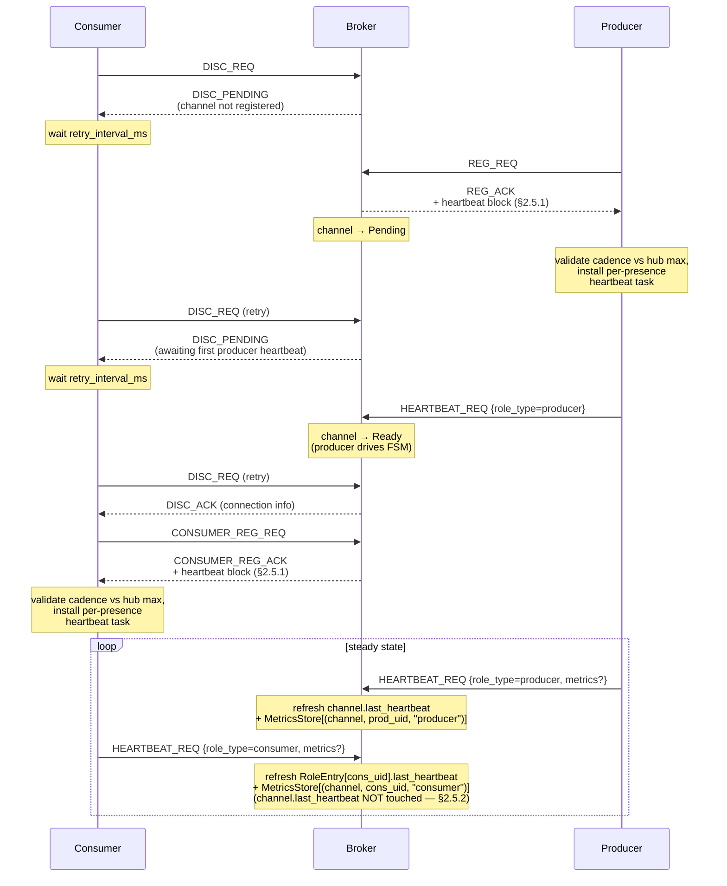

# HEP-CORE-0023: Startup Coordination

| Property      | Value                                                              |
|---------------|--------------------------------------------------------------------|
| **HEP**       | `HEP-CORE-0023`                                                    |
| **Title**     | Startup Coordination — Role State Machine and Presence Waiting     |
| **Status**    | Phase 1 implemented (2026-03-11); Phase 2 redesigned (2026-04-14); §2.1/§2.2/§2.5.2/§2.6/§5.5 updated 2026-05-06 to align with HEP-CORE-0019 §2.3 (Phase 6 per-presence heartbeats) and HEP-CORE-0033 §8 (HubState channel/role/consumer entry types). |
| **Created**   | 2026-03-10                                                         |
| **Revised**   | 2026-04-14: Phase 2 replaced "Deferred DISC_ACK" (broker-queued replies) with a role state-machine + three-response DISC_REQ model.  2026-05-06: clarified channel-FSM is producer-driven; added §2.5.2 per-presence heartbeat contract; §2.6 data structures match current `HubState` (channels_, consumers nested, roles_); §5.5 updated for presence-list dual-hub model. |
| **Area**      | Broker Protocol / Script Hosts / Config                            |
| **Depends on**| HEP-CORE-0007 (Protocol), HEP-CORE-0019 §2.3 (Per-presence heartbeats — Phase 6), HEP-CORE-0033 §8 (HubState entry types), HEP-CORE-0033 §18 (broker routing classes), HEP-CORE-0033 §19 (multi-presence roles) |

---

## 1. Problem Statement

When a pipeline starts, roles connect to the broker in arbitrary order. Without
coordination, a consumer may discover a channel before the producer has registered it
(CHANNEL_NOT_FOUND), or a processor may begin processing before its upstream producer
is ready.

Two complementary coordination mechanisms:

1. **Role state machine with three-response DISC_REQ** (broker-managed, §2):
   The broker maintains per-role status (Pending / Ready). DISC_REQ always returns
   the current state; clients retry on `DISC_PENDING`. No broker-side queuing of
   pending requests.

2. **`wait_for_roles`** (config-managed, §3+): A role explicitly declares which other
   roles it must see registered before it begins its processing loop. Uses
   `ROLE_REGISTERED_NOTIFY`.

---

## 2. Role State Machine + Three-Response DISC_REQ

> **Tense note (read first).**  §2.1 + §2.2 below describe the
> **post-Phase-6 corrected behaviour** — the channel FSM driven by
> the channel's producer presence only, with consumer-presence
> heartbeats refreshing per-uid liveness rows but not the channel
> FSM.  This is the **target** behaviour the Wave B migration in
> `docs/tech_draft/role_host_template_design.md` delivers.
>
> **Pre-Phase-6 actual behaviour** (current code, before the
> migration completes): the broker's `handle_heartbeat_req` does
> not read `role_type` from the wire payload — it derives the
> producer uid from `channel.producer_role_uid` and treats every
> heartbeat for the channel as if it came from that producer.
> Consequence: a consumer-presence heartbeat for channel X
> currently DOES refresh `channel(X).last_heartbeat` and DOES
> attribute the consumer's metrics piggyback to the producer's
> `RoleEntry` row.  This is the latent bug HEP-CORE-0019 §2.3
> (Phase 6) fixes.
>
> §2.5.2 explicitly carries the "Phase 6" label to call out this
> distinction within the timeout discussion; §2.1 + §2.2 are
> presented in their corrected form for forward readability.
> Implementation status of the migration is tracked in
> `role_host_template_design.md` Wave B (M0-M9).

### 2.1 Channel Lifecycle States

The state machine here is the **channel's** Pending/Ready/Closing
state, owned by `ChannelEntry.status` in the broker's registry and
driven by the producer's `HEARTBEAT_REQ` for that channel.  Consumer
presences do not transition this FSM — see §2.5.2 for the
per-presence heartbeat contract that supersedes the earlier
"every registered role" framing (HEP-CORE-0019 §2.3 / Phase 6).

There are two terminal paths: a **heartbeat-death** path (presumed-
dead producer, no grace) and a **voluntary-close** path (live
producer, grace given to consumers to drain).



Precise transitions (all driven by the channel's **producer** presence
unless otherwise noted):

| Trigger | From | To | Side effect |
|---|---|---|---|
| `REG_REQ` accepted (producer registers channel) | — | Pending | — |
| Producer `HEARTBEAT_REQ` received | Pending | Ready | refresh `channel.last_heartbeat`, set `state_since`, bump `pending_to_ready_total` |
| Producer `HEARTBEAT_REQ` received | Ready | Ready | refresh `channel.last_heartbeat` |
| Missed producer heartbeats for `effective_ready_timeout` | Ready | Pending | reset `state_since` |
| Missed producer heartbeats for `effective_pending_timeout` | Pending | deregistered | send `CHANNEL_CLOSING_NOTIFY`; **no grace** |
| `DEREG_REQ` (producer) / admin / script close | Ready/Pending | Closing | send `CHANNEL_CLOSING_NOTIFY`, start grace |
| Grace expires | Closing | deregistered | send `FORCE_SHUTDOWN` to stragglers |

(Consumer-presence `HEARTBEAT_REQ` for the same channel does NOT
appear in this table — it does not drive the FSM.  See §2.5.2.)

**Rationale:**

- `Ready → Pending` on timeout keeps the channel registered while
  advertising it as "not currently responsive". A transient producer
  pause (GC, load spike) can recover via the next producer
  heartbeat — `Pending → Ready` increments
  `pending_to_ready_total` and zero data is lost.
- **Heartbeat-death path skips the Closing/grace state**: the producer
  is presumed dead, so the broker has no one to wait for.
  CHANNEL_CLOSING_NOTIFY is best-effort to consumers (they may be
  transiently disconnected; if so, they observe `CHANNEL_NOT_FOUND`
  on their next DISC_REQ and treat that equivalently to a closing
  notification).
- **Voluntary-close path keeps the Closing/grace state**: the producer
  is alive and asked to leave cleanly. Grace gives **consumers** time
  to drain in-flight work and deregister. After grace, FORCE_SHUTDOWN
  tells stragglers to release.

**Producer-only refresh — why.**  Consumer-presence heartbeats also
arrive at the broker (per HEP-CORE-0019 §2.3), but they refresh the
**consumer's** row in `MetricsStore[(channel, uid, "consumer")]`
and `RoleEntry(uid).last_heartbeat` only — they do NOT touch
`channel.last_heartbeat` and do NOT drive the FSM above.  Otherwise
a consumer's heartbeat would mask a dead producer's silence and
keep the channel artificially Ready while data has stopped flowing
(the bug Phase 6 of HEP-CORE-0019 fixes).

### 2.2 Three-Response DISC_REQ

When a consumer sends `DISC_REQ`, the broker **always replies immediately** with
one of three well-defined responses based on the current channel state:



See HEP-CORE-0007 §DISC_REQ for the precise payload of each response variant.

**Notes on the steady-state loop:**

- Both producer-presence and consumer-presence emit per-cycle
  heartbeats with `(channel, uid, role_type)` in the wire payload.
  See HEP-CORE-0019 §4.1 for the full HEARTBEAT_REQ shape (Phase 6).
- Only the **producer's** heartbeat for the channel drives the
  `channel.last_heartbeat` watchdog and the Pending/Ready FSM.
  Consumer heartbeats refresh per-presence rows in `MetricsStore`
  and `RoleEntry.last_heartbeat`, but do NOT touch the channel FSM.
- A processor with two presences (consumer-of-in_channel +
  producer-of-out_channel) sends two heartbeats per cycle — one with
  `role_type="consumer"` for `in_channel` (does not drive in_channel's
  FSM; the in_channel's actual producer does that) and one with
  `role_type="producer"` for `out_channel` (drives out_channel's FSM).

### 2.3 Chain Resolution (Multi-hop)

Each hub independently runs the state machine. For a chain
`Producer → Hub A → Processor-A → Hub B → Processor-B → Hub C → Consumer`:

1. Processor-A sends DISC_REQ to Hub A → `DISC_PENDING` until Producer registers and heartbeats.
2. Producer registers on Hub A, sends first heartbeat → Processor-A's next retry succeeds.
3. Processor-A registers output on Hub B (PENDING until its first heartbeat there).
4. Processor-B sends DISC_REQ to Hub B → `DISC_PENDING` until Processor-A is Ready on Hub B.
5. And so on down the chain.

No special coordination is needed. Each hop converges independently via retry.

### 2.4 Client Retry Policy

`BrokerRequestComm::discover_channel(channel, timeout_ms)` implements the retry loop:
- On `DISC_PENDING`: wait `retry_interval_ms` (default 100ms), resend DISC_REQ, up to
  `timeout_ms` total.
- On `DISC_ACK`: return success immediately.
- On `CHANNEL_NOT_FOUND`: retry (producer may register later) up to `timeout_ms`.
- On overall `timeout_ms` expiry: return failure to caller.

The retry logic is entirely client-side. The broker holds no state for pending DISC requests.

### 2.5 Broker Configuration — Heartbeat-Multiplier Timeouts

The broker's role-liveness timeouts are **derived from the heartbeat cadence**,
not specified as absolute wall-clock durations. This makes the defaults
self-scaling across deployments: a fast pipeline with 20 ms heartbeats reclaims
dead roles in ~400 ms; a low-power role with 5 s heartbeats gets ~50 s grace,
using the same multipliers.

```cpp
struct BrokerService::Config {
    /// Expected client heartbeat cadence (broker-wide). Default: 500 ms (2 Hz).
    std::chrono::milliseconds heartbeat_interval{kDefaultHeartbeatIntervalMs};

    /// Ready -> Pending demotion after this many consecutive missed heartbeats.
    uint32_t ready_miss_heartbeats  {10};

    /// Pending -> deregistered (+ CHANNEL_CLOSING_NOTIFY) after this many
    /// additional missed heartbeats, counted from entry into Pending.
    uint32_t pending_miss_heartbeats{10};

    /// CHANNEL_CLOSING_NOTIFY -> FORCE_SHUTDOWN grace window, in heartbeats.
    uint32_t grace_heartbeats{4};

    /// Optional explicit overrides. nullopt = derive from
    /// `heartbeat_interval * <miss_heartbeats>`. Has_value = use verbatim.
    /// `grace_override = 0 ms` is meaningful ("FORCE_SHUTDOWN immediately").
    std::optional<std::chrono::milliseconds> ready_timeout_override;
    std::optional<std::chrono::milliseconds> pending_timeout_override;
    std::optional<std::chrono::milliseconds> grace_override;

    std::chrono::milliseconds effective_ready_timeout()   const noexcept;
    std::chrono::milliseconds effective_pending_timeout() const noexcept;
    std::chrono::milliseconds effective_grace()           const noexcept;
};
```

JSON (all keys optional; defaults resolve via the multipliers above):

```json
"broker": {
  "heartbeat_interval_ms":    500,
  "ready_miss_heartbeats":     10,
  "pending_miss_heartbeats":   10,
  "grace_heartbeats":           4,

  "ready_timeout_ms":   null,
  "pending_timeout_ms": null,
  "grace_ms":           null
}
```

**Named constants** live in `src/include/utils/timeout_constants.hpp`
(`kDefaultHeartbeatIntervalMs`, `kDefaultReadyMissHeartbeats`,
`kDefaultPendingMissHeartbeats`, `kDefaultGraceHeartbeats`) with
CMake-time override macros following the `PYLABHUB_DEFAULT_*` convention.

With the 2 Hz / 10×10×4 defaults, the effective wall-clock windows are:

| Transition                      | Window               |
|---------------------------------|----------------------|
| Ready -> Pending                | 5 s (10 × 500 ms)    |
| Pending -> deregistered         | +5 s                 |
| CLOSING_NOTIFY -> FORCE_SHUTDOWN| 2 s (4 × 500 ms)     |
| **Total reclaim**               | **~10 s** from last heartbeat to FORCE_SHUTDOWN |

**Floor: timeouts are always enforced.** `effective_ready_timeout()` and
`effective_pending_timeout()` are floored at `heartbeat_interval` so a
misconfiguration (`override = 0 ms`, or `miss_heartbeats = 0`) cannot create
a permanently-dangling Pending entry. A stuck role is always reclaimable
within at most `2 * heartbeat_interval`. `effective_grace()` has no floor —
zero is meaningful here ("FORCE_SHUTDOWN immediately on voluntary close").

**Role-close cleanup API.** Every dereg site (heartbeat-death, voluntary
close, script-requested close, dead-consumer detection) calls a central
`on_channel_closed()` / `on_consumer_closed()` hook that fans out to per-module
cleanup helpers (federation, band, future modules). This guarantees that
when a role exits — for any reason — its band memberships are removed and
any federation relay state referencing it is dropped, before the next
broadcast or relay is processed. See `BrokerServiceImpl::on_channel_closed`
in `src/utils/ipc/broker_service.cpp`.

### 2.5.1 Role-side preferred cadence vs. hub authority

**The hub is authoritative for the timeout contract.**  `heartbeat_interval_ms`
in the hub's broker config is the **maximum tolerated silence** the hub will
accept before progressing the Ready→Pending→deregistered countdown.  Roles
may run their heartbeat sender at a faster cadence (smaller interval) for
their own operational reasons, but they must never run slower.

**Role config field.**  `role.json::timing.heartbeat_interval_ms` (already
parsed by `TimingConfig`) is the role's *preferred* cadence — its own
decision, ≤ hub's max.

**Negotiation at registration time.**  REG_ACK and CONSUMER_REG_ACK carry
a `heartbeat` JSON block populated from the broker's running config:

```jsonc
{
  "status": "success",
  "channel_id": "...",
  "heartbeat": {
    "heartbeat_interval_ms":    500,   // hub's max tolerated silence
    "ready_miss_heartbeats":     10,
    "pending_miss_heartbeats":   10,
    "grace_heartbeats":           4
  }
}
```

The role compares its configured `heartbeat_interval_ms` against the hub's
returned value:

| Comparison              | Action                                                       |
|-------------------------|--------------------------------------------------------------|
| `role ≤ hub`            | INFO log "aligned with hub". Role keeps its faster cadence.  |
| `role > hub`            | WARN log + **reset role's interval to hub's value** (the role would otherwise be reaped by hub-side liveness). |

**Why reset, not reject.**  A misconfigured role that exceeds the hub's
tolerance would otherwise be cycled through Ready→Pending→deregistered on
every connection.  Resetting to the hub's max keeps the role functional
and surfaces the misconfiguration via the WARN, leaving the operator to
fix the role-side config at their convenience.

**Implementation note (HEP-CORE-0033 §15 Phase 9 wiring).**  The role's
periodic-heartbeat task is installed *after* REG_ACK arrives — not at
ctrl-thread spawn — so the negotiated effective interval is always honored
without runtime mutation of an already-scheduled task.
`BrokerRequestComm::set_periodic_task` routes through the cmd queue and
appends into the active poll-loop's task vector, so post-startup install
is supported without restructuring the loop.

**Out of scope.**  Per-role / per-channel overrides are deliberately
absent: the hub's value is broker-wide and applies uniformly.  The
optional `ready_timeout_ms` / `pending_timeout_ms` / `grace_ms` overrides
are broker-internal (see §2.5 above) and are NOT part of the heartbeat ACK
block — only the four multiplier fields are.

### 2.5.2 Per-presence heartbeat contract (Phase 6)

A role declares a list of **presences** at startup — one per
`(hub, channel, role_kind)` tuple it registers as.  Each presence
emits its own `HEARTBEAT_REQ` per cycle, carrying `(channel_name, uid,
role_type)` in the wire payload (per HEP-CORE-0019 §4.1).  Cardinality:

| Role | Presences | Heartbeats / cycle |
|---|---|---|
| Producer | 1 (`{out_hub, out_channel, producer}`) | 1 |
| Consumer | 1 (`{in_hub, in_channel, consumer}`) | 1 |
| Single-hub processor (`in_hub == out_hub`) | 2 (`{hub, in_channel, consumer}` + `{hub, out_channel, producer}`) | 2 over a single DEALER (the underlying connection deduplicates by `(broker_endpoint, broker_pubkey)`) |
| Dual-hub processor | 2 (one per hub) | 2 (one over each DEALER) |

The broker's `handle_heartbeat_req` routes by `role_type`:

- `role_type == "producer"`: refresh **`channel(channel_name).last_heartbeat`**
  (drives the §2.1 FSM); write metrics under
  `MetricsStore[(channel, uid, "producer")]`; refresh
  `RoleEntry(uid).last_heartbeat`.
- `role_type == "consumer"`: write metrics under
  `MetricsStore[(channel, uid, "consumer")]`; refresh
  `RoleEntry(uid).last_heartbeat`; **do NOT** touch
  `channel.last_heartbeat`.

**Watchdog scope.**  The §2.5 timeout-multiplier math
(`ready_miss_heartbeats`, `pending_miss_heartbeats`, `grace_heartbeats`)
applies to `channel.last_heartbeat` — i.e., to the channel FSM
driven by the channel's producer presence.  `RoleEntry.last_heartbeat`
is informational; no automatic eviction is driven by it today
(consumer-presence death is detected via OS PID check on the same
host or via ZMTP socket disconnect — both orthogonal to the
heartbeat-multiplier math).

**Failure modes resolved.**  Pre-Phase-6 brokers (HEP-CORE-0019
§9 Phase 1-5 era) ignored `uid` and `role_type` and treated every
heartbeat for a channel as if it came from that channel's producer.
Two consequences:
- Consumer's heartbeat refreshed `channel.last_heartbeat`, masking
  producer-death so the FSM never demoted Ready→Pending.
- Consumer's metrics piggyback was attributed to the producer's
  `RoleEntry.latest_metrics`.
The Phase 6 split (above) fixes both.

**Implementation note.**  The role-side heartbeat tick is installed
per-presence; a role with N presences runs N tick callbacks per
cycle.  Producer presences drive the channel FSM; consumer-presence
ticks emit a heartbeat for liveness + metrics reporting only.  See
`docs/tech_draft/role_host_template_design.md` §6 for the role-side
implementation; HEP-CORE-0033 §19 for the multi-presence connection model.

---

**State-machine metrics** (HEP-CORE-0019 integration). The broker exposes
monotonic counters via `BrokerService::query_role_state_metrics()` returning
a `RoleStateMetrics` snapshot:

| Field                             | Meaning                                        |
|-----------------------------------|------------------------------------------------|
| `ready_to_pending_total`          | Ready -> Pending demotions                     |
| `pending_to_deregistered_total`   | Pending -> deregistered (+ CLOSING_NOTIFY)     |
| `pending_to_ready_total`          | Pending -> Ready (first heartbeat OR recovery) |

These counters give tests a race-free way to assert state transitions occurred,
without relying on wall-clock sleeps.

### 2.6 Data Structures

The current implementation (HEP-CORE-0033 §8 + HEP-CORE-0034)
splits broker-side state across **three** struct types in
`HubState`, each with its own keying — not a single role map.
Brief summary; see `src/include/utils/hub_state.hpp` for the
authoritative definitions.

| Struct | Map | Keyed by | Owns the FSM? | last_heartbeat semantics |
|---|---|---|---|---|
| `ChannelEntry` | `HubState.channels` | channel name | **yes** — `status` field drives the §2.1 FSM | refreshed by **producer**'s `HEARTBEAT_REQ` for this channel |
| `ConsumerEntry` (nested in `ChannelEntry.consumers`) | per-channel vector | (channel, consumer_uid) | no | none — consumer liveness is OS-PID based + ZMTP socket monitor |
| `RoleEntry` | `HubState.roles` | role uid | no — informational only | refreshed by **any** `HEARTBEAT_REQ` from this uid (any presence) |

```cpp
// Schematic — see hub_state.hpp for exact fields.

struct ChannelEntry {
    std::string                            name;
    std::string                            producer_role_uid;
    std::string                            producer_zmq_identity;
    std::vector<ConsumerEntry>             consumers;
    ChannelStatus                          status;            // Pending|Ready|Closing
    std::chrono::steady_clock::time_point  last_heartbeat;    // producer-driven
    std::chrono::steady_clock::time_point  state_since;
    std::chrono::steady_clock::time_point  closing_deadline;
    // ... data-plane endpoint / schema metadata
};

struct ConsumerEntry {
    std::string  consumer_uid;
    std::string  consumer_name;
    uint64_t     consumer_pid;
    std::string  zmq_identity;             // ROUTER routing for direct notify
    // ... inbox metadata, connected_at
};

struct RoleEntry {
    std::string                                  uid;
    std::string                                  name;
    std::string                                  role_tag;     // "prod"|"cons"|"proc"
    std::vector<std::string>                     channels;     // channels this uid is on
    RoleState                                    state;        // Connected | Disconnected
    std::chrono::system_clock::time_point        first_seen;
    std::chrono::steady_clock::time_point        last_heartbeat;   // any presence
    nlohmann::json                               latest_metrics;   // Phase 6 detail in HEP-0019
    std::chrono::system_clock::time_point        metrics_collected_at;
    // ...
};

class HubState {
    std::unordered_map<std::string, ChannelEntry> channels_;
    std::unordered_map<std::string, RoleEntry>    roles_;
    // (also: bands_, peers_, schemas_ — see HEP-0033 §8 / HEP-0034)
};
```

**Rationale for the three-struct split:**

- **`ChannelEntry` owns the FSM.**  Producer drives `last_heartbeat`
  refresh + Pending/Ready transitions; downstream consumers attach
  but don't drive the FSM (they're watched, not watchdogs).
- **`ConsumerEntry` is per-membership.**  A consumer registered on
  multiple channels has multiple entries (one per channel).  The
  same uid may also appear in `roles_` for cross-channel queries.
- **`RoleEntry` is per-uid.**  One row per role process,
  `channels[]` records all channels this uid is registered on.
  `last_heartbeat` is informational — useful for diagnostics and
  per-uid presence queries (Class B in the HEP-0033 routing
  taxonomy) — but not used for active eviction by the broker today.

**FSM watchdog scope.**  The §2.5 timeout-multiplier math
(`ready_miss_heartbeats`, `pending_miss_heartbeats`,
`grace_heartbeats`) applies to `ChannelEntry.last_heartbeat`.
Consumer-presence death is detected via `is_process_alive(pid)`
(same-host) or via ZMTP socket disconnect (any host) — orthogonal
to the channel-FSM watchdog.

**Future optimization — lazy status-indexed views** (deferred):

At higher scale, the channel-FSM watchdog loop (O(N) every poll
cycle, where N = channel count) can become hot. A lazy secondary
index avoids full iteration for common queries:

```cpp
// Secondary indices — maintained alongside channels_ via a single helper.
std::unordered_set<std::string> ready_channels_;    ///< Channels currently Ready
std::unordered_set<std::string> pending_channels_;  ///< Channels currently Pending

/// Single transition point — updates both the map entry and the indices atomically.
/// All state changes MUST go through this helper.
void transition_status(const std::string &name, ChannelStatus new_status) {
    auto it = channels_.find(name);
    if (it == channels_.end()) return;
    if (it->second.status == new_status) return;
    // Remove from old index
    if (it->second.status == ChannelStatus::Ready)
        ready_channels_.erase(name);
    else
        pending_channels_.erase(name);
    // Update status + state_since
    it->second.status      = new_status;
    it->second.state_since = std::chrono::steady_clock::now();
    // Insert into new index
    if (new_status == ChannelStatus::Ready)
        ready_channels_.insert(name);
    else
        pending_channels_.insert(name);
}
```

**Invariants** (enforce via code review + unit tests):
- Every entry in `channels_` must be in exactly one of `ready_channels_` / `pending_channels_`.
- No entry may exist in an index without a matching entry in `channels_`.
- All mutations must go through `transition_status()` — never assign `it->second.status`
  directly.

**When to add:** when profiling shows channel-FSM watchdog iteration
or status-filter queries dominate broker CPU time.  Indicators:
`heartbeat_check_us_avg > poll_interval / 4`, or N > 500 channels
per hub.  Until then, the simpler single-map design is preferred
for robustness over speed.

### 2.7 Migration from Prior Design (superseded 2026-04-14)

The original Phase 2 design (Deferred DISC_ACK) had the broker queue unanswered DISC_REQs
and reply later on role transition. Reasons for replacement:
- **Unbounded broker memory** under request bursts (O(outstanding requests)).
- **Hidden state**: "reply is queued" was not observable via any query.
- **Broker-owned retry timeout** forced a single retry policy on all clients.
- **Testing complexity**: race between queue drain and client timeout was flaky.

The state-machine + three-response model addresses all four concerns. See Git history
and archived design draft for the original rationale.

---

## 3. ROLE_REGISTERED_NOTIFY / ROLE_DEREGISTERED_NOTIFY

### 3.1 Purpose

Broadcast events that allow roles to react when other roles join or leave the hub.
Used by `wait_for_roles` to detect when upstream roles are ready.

### 3.2 ROLE_REGISTERED_NOTIFY

```
Direction:  Broker → ALL connected roles on this hub
Trigger:    Successful REG_REQ or CONSUMER_REG_REQ (role fully registered)
Delivery:   Unsolicited push (same as CHANNEL_CLOSING_NOTIFY)

Payload:
  role_uid          string   UID of the newly registered role
  role_type         string   "producer" | "consumer" | "processor"
  channel           string   Channel the role registered on
  hub_uid           string   UID of this hub (source_hub_uid in IncomingMessage)
```

Script host delivery (`source_hub_uid` identifies which hub):
```python
{"event": "role_registered", "role_uid": "PROD-SENSOR-A1B2C3D4",
 "role_type": "producer", "channel": "lab.raw", "source_hub_uid": "HUB-A-..."}
```

### 3.3 ROLE_DEREGISTERED_NOTIFY

```
Direction:  Broker → ALL connected roles on this hub
Trigger:    Successful DEREG_REQ or CONSUMER_DEREG_REQ; or broker-detected death

Payload:
  role_uid          string
  role_type         string   "producer" | "consumer" | "processor"
  channel           string
  reason            string   "graceful" | "heartbeat_timeout" | "process_dead"
  hub_uid           string
```

Script host delivery:
```python
{"event": "role_deregistered", "role_uid": "...", "role_type": "...",
 "channel": "...", "reason": "graceful", "source_hub_uid": "..."}
```

### 3.4 Delivery Policy

All `ROLE_REGISTERED_NOTIFY` / `ROLE_DEREGISTERED_NOTIFY` notifications are broadcast to
every connected role on the hub — no filtering, no subscription. This keeps the broker
simple. If volume becomes a concern, per-channel subscriptions can be added later.

---

## 4. ROLE_PRESENCE_REQ / ROLE_INFO_REQ (Polling)

For one-shot presence checks (used by `wait_for_roles` implementation):

```
ROLE_PRESENCE_REQ:
  role_uid          string   (or UID pattern with prefix e.g. "PROD-SENSOR-*")

ROLE_PRESENCE_ACK:
  status            string   "success"
  present           bool     true if role is currently registered

ROLE_INFO_REQ:
  role_uid          string   (exact match)

ROLE_INFO_ACK:
  status            string   "success"
  role_uid          string
  role_type         string
  channel           string
  inbox_endpoint    string   (empty if no inbox)
  inbox_schema_json string   (JSON string; empty if no inbox)
  inbox_packing     string
```

---

## 5. wait_for_roles Config

> **Implementation status**: Phase 1 implemented (2026-03-11). Pattern matching and UID prefix
> restrictions are deferred to Phase 2.

### 5.1 Field Definition

All three script host configs support `startup.wait_for_roles`. Each entry specifies an
**exact role UID** and an optional per-role timeout:

| Field | Type | Default | Description |
|-------|------|---------|-------------|
| `uid` | string | required | Exact UID to wait for (e.g. `"PROD-SENSOR-A1B2C3D4"`) |
| `timeout_ms` | int | 10000 | Per-role timeout in milliseconds; must be > 0 |

All three role binaries (producer, consumer, processor) accept this field.
Deadlock prevention is the operator's responsibility (e.g. do not create mutual waits).

**Note on adjacent processor chains**: Two adjacent processors in a chain
(`Proc-A → Proc-B`) do not need `wait_for_roles`. Deferred DISC_ACK handles
their sequencing automatically (see §2.3).

### 5.2 Config Example

```json
"startup": {
  "wait_for_roles": [
    {"uid": "PROD-SENSOR-A1B2C3D4", "timeout_ms": 15000},
    {"uid": "PROC-FILTER-B5C6D7E8"}
  ]
}
```

Roles are waited for sequentially in list order. Each has an independent deadline.
Absent `timeout_ms` defaults to 10000 ms.

### 5.3 Implementation: Startup Wait Loop (C++)

Executed in each script host's `start_role()`, after the messenger connects but before
`on_init` is called and before any background threads start:

```cpp
static constexpr int kPollMs = 200;
for (const auto& wr : config_.wait_for_roles) {
    LOGGER_INFO("[role] Startup: waiting for role '{}' (timeout {}ms)...",
                wr.uid, wr.timeout_ms);
    const auto deadline = std::chrono::steady_clock::now() +
                          std::chrono::milliseconds{wr.timeout_ms};
    bool found = false;
    while (std::chrono::steady_clock::now() < deadline) {
        py::gil_scoped_release rel;
        if (messenger_.query_role_presence(wr.uid, kPollMs)) {
            found = true;
            break;
        }
    }
    if (!found) {
        LOGGER_ERROR("[role] Startup wait failed: role '{}' not present after {}ms",
                     wr.uid, wr.timeout_ms);
        return false;  // triggers cleanup_on_start_failure()
    }
    LOGGER_INFO("[role] Startup: role '{}' found", wr.uid);
}
```

Uses `BrokerRequestComm::query_role_presence()` (ROLE_PRESENCE_REQ
polling, 200 ms poll interval).  GIL is released during each
200 ms poll so other Python threads remain unblocked.  After the
Phase 6 / presence-list migration (HEP-CORE-0033 §19), this call
becomes a Class B fall-through across all of the role's hub
connections — see §5.5 — letting dual-hub roles wait for
prerequisites on either hub without operator-side broker
selection.

### 5.4 Deferred: UID Prefix Restrictions (Phase 2)

The original design proposed prefix restrictions to prevent deadlocks:
- Producer: not allowed to wait for any role
- Consumer: may wait for `PROD-*` or `PROC-*` only
- Processor: may wait for `PROD-*` only

These restrictions are deferred to Phase 2. Current implementation accepts any UID
in any role type.

### 5.5 Dual-Hub Processor: Broker Selection for wait_for_roles

**Pre-Phase-6 limitation (current behaviour, being replaced).**  In
the current code, a processor with `in_hub_dir` ≠ `out_hub_dir`
maintains only one `BrokerRequestComm` (against `out_hub`); the
startup wait queries that single connection.  Roles registered only
on the input hub are not found and the wait times out.  Documented
mitigation: configure `startup.wait_for_roles` only with UIDs of
roles on the same hub as `out_hub_dir`.

**Phase 6 / presence-list resolution (post-migration).**  The
multi-presence connection model (HEP-CORE-0033 §19) gives the role
one `BrokerRequestComm` per hub it participates in.  `wait_for_roles`
becomes a **Class B fall-through query** (HEP-CORE-0033 §18): the
role asks each connection in
turn (`ROLE_PRESENCE_REQ` / `ROLE_INFO_REQ`); the first hub that
answers "found" wins; if no hub answers, the wait continues to
retry up to `timeout_ms`.

Concrete consequences after the migration:

- A dual-hub processor can wait for prerequisites registered on
  **either** hub; configure `startup.wait_for_roles` with UIDs from
  whichever hub they live on, no `broker: "in"|"out"` discriminator
  needed.
- Single-hub processors (`in_hub_dir == out_hub_dir`, or just
  `hub_dir`) collapse to one connection at runtime; the fall-through
  reduces to a single query — same wall-clock behaviour as today.

The implementation lands in
`docs/tech_draft/role_host_template_design.md` Wave B M8 along
with the L4 dual-hub processor test.  Until then, the pre-Phase-6
limitation above applies.

---

## 6. Complete Startup Sequence

### Phase 1: Process launch

Hub brokers are assumed to be running before any role starts.

### Phase 2: Hub A registrations (producer + processor input-side)

```
Producer:
  bind P2C ROUTER + XPUB sockets
  → REG_REQ (Hub A)  [role_type="producer"]
  ← REG_ACK
  → start heartbeat

Processor:
  send CONSUMER_REG_REQ → wait DISC_ACK  [broker defers until producer registers]
  wait_for_roles: ["PROD-SENSOR-*"]      [optional explicit wait]
```

### Phase 3: Processor data plane (after DISC_ACK resolves)

```
Processor:
  attach to in_shm (if in_transport="shm") OR connect ZMQ PULL socket
  start in_queue_
```

### Phase 4: Hub B registration (processor output-side)

```
Processor:
  bind out P2C ROUTER + XPUB sockets (if out_transport="shm")
  OR bind ZMQ PUSH socket (if out_transport="zmq")
  → REG_REQ (Hub B)  [role_type="processor"]
  ← REG_ACK
  → start heartbeat on Hub B
```

When `startup.hub_b_after_input_ready = true`, Phase 4 executes after Phase 3 completes.
When `false` (default), Phases 3 and 4 execute in parallel.

### Phase 5: Consumer (Hub B)

```
Consumer:
  → DISC_REQ (Hub B)  [broker defers until processor registers its output]
  ← DISC_ACK          [released when Processor's REG_REQ on Hub B succeeds]
  → CONSUMER_REG_REQ
  ← CONSUMER_REG_ACK
  attach to out_shm
  → HELLO (P2P to processor)
  on_consumer_joined fires in processor's ctrl_thread_
```

### Phase 6: Steady state

All roles are registered. Deferred DISC_ACKs resolved. `wait_for_roles` conditions met.
Processing loops started. Heartbeats flowing.

---

## 7. source_hub_uid in IncomingMessage

When a processor connects to two hubs, control messages from both arrive on the same
`messages` list in `on_process`. The `source_hub_uid` field identifies the origin:

```cpp
struct IncomingMessage {
    std::string       event;        // event type or empty for P2P data
    std::string       sender_uid;   // sender role UID (for relay events)
    std::string       source_hub_uid; // hub that generated this message
    nlohmann::json    details;      // event payload
    std::vector<char> data;         // P2P binary payload
};
```

This is populated in `ctrl_thread_` from the messenger that received the event:
- Messages from `in_messenger_` → `source_hub_uid = in_hub_uid_`
- Messages from `out_messenger_` → `source_hub_uid = out_hub_uid_`

For single-hub roles (producer, consumer), `source_hub_uid` is always the one connected hub.

---

## 8. Protocol Index

| Message | Direction | §12.x in HEP-0007 |
|---------|-----------|-------------------|
| ROLE_REGISTERED_NOTIFY | Broker → All roles | Added §12.5 |
| ROLE_DEREGISTERED_NOTIFY | Broker → All roles | Added §12.5 |
| ROLE_PRESENCE_REQ/ACK | Role → Broker → Role | Added §12.3 |
| ROLE_INFO_REQ/ACK | Role → Broker → Role | Added §12.3 |
| DISC_REQ deferral | Consumer → Broker | Modified §12.3 |
| REG_ACK / CONSUMER_REG_ACK `heartbeat` block | Broker → Role | Added §2.5.1 |
