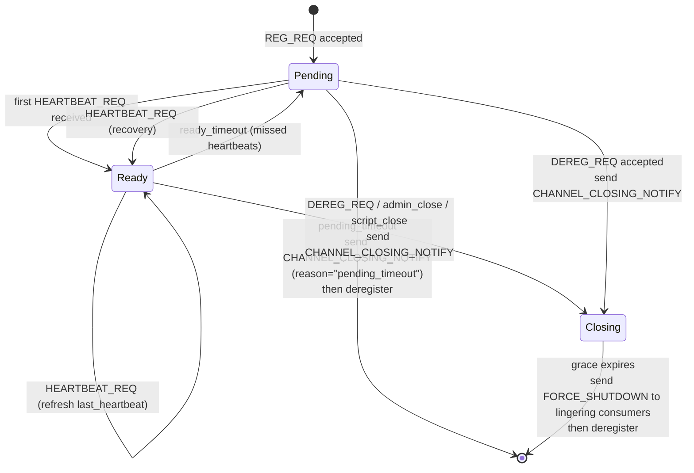
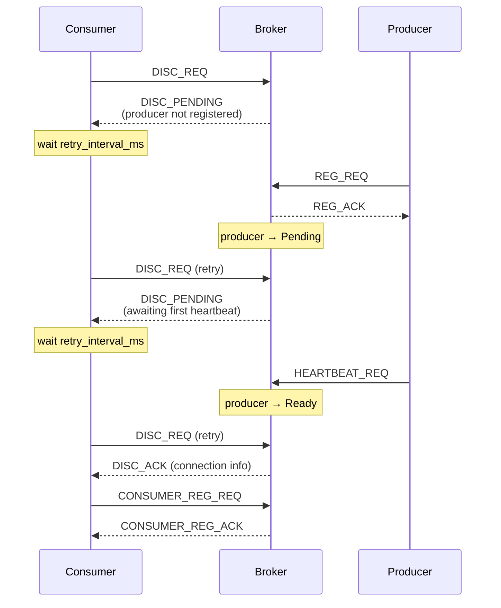

# HEP-CORE-0023: Startup Coordination

| Property      | Value                                                              |
|---------------|--------------------------------------------------------------------|
| **HEP**       | `HEP-CORE-0023`                                                    |
| **Title**     | Startup Coordination — Role State Machine and Presence Waiting     |
| **Status**    | Phase 1 implemented (2026-03-11); Phase 2 redesigned (2026-04-14)  |
| **Created**   | 2026-03-10                                                         |
| **Revised**   | 2026-04-14: Phase 2 replaced "Deferred DISC_ACK" (broker-queued    |
|               | replies) with a role state-machine + three-response DISC_REQ model |
| **Area**      | Broker Protocol / Script Hosts / Config                            |
| **Depends on**| HEP-CORE-0007 (Protocol), HEP-CORE-0015 (Processor)                |

---

## 1. Problem Statement

When a pipeline starts, roles connect to the broker in arbitrary order. Without
coordination, a consumer may discover a channel before the producer has registered it
(CHANNEL_NOT_FOUND), or a processor may begin processing before its upstream producer
is ready.

Two complementary coordination mechanisms:

1. **Role state machine with three-response DISC_REQ** (broker-managed, §2):
   The broker maintains per-role status (Pending / Ready). DISC_REQ always returns
   the current state; clients retry on `DISC_PENDING`. No broker-side queuing of
   pending requests.

2. **`wait_for_roles`** (config-managed, §3+): A role explicitly declares which other
   roles it must see registered before it begins its processing loop. Uses
   `ROLE_REGISTERED_NOTIFY`.

---

## 2. Role State Machine + Three-Response DISC_REQ

### 2.1 Role Lifecycle States

Every registered role (producer/consumer/processor) has a well-defined status
in the broker's registry. There are two terminal paths: a **heartbeat-death**
path (presumed-dead role, no grace) and a **voluntary-close** path (live role,
grace given to consumers to drain).



Precise transitions:
| Trigger                                       | From          | To            | Side effect                                   |
|-----------------------------------------------|---------------|---------------|-----------------------------------------------|
| `REG_REQ` accepted                            | —             | Pending       | —                                             |
| `HEARTBEAT_REQ` received                      | Pending       | Ready         | refresh `last_heartbeat`, set `state_since`   |
| `HEARTBEAT_REQ` received                      | Ready         | Ready         | refresh `last_heartbeat`                      |
| Missed heartbeats for `effective_ready_timeout`   | Ready     | Pending       | reset `state_since`                           |
| Missed heartbeats for `effective_pending_timeout` | Pending   | deregistered  | send `CHANNEL_CLOSING_NOTIFY`; **no grace**   |
| `DEREG_REQ` / admin / script close            | Ready/Pending | Closing       | send `CHANNEL_CLOSING_NOTIFY`, start grace    |
| Grace expires                                 | Closing       | deregistered  | send `FORCE_SHUTDOWN` to stragglers           |

**Rationale:**

- `Ready → Pending` on timeout keeps the role registered while advertising it
  as "not currently responsive". A transient pause (GC, load spike) can recover
  via the next heartbeat — `Pending → Ready` increments
  `pending_to_ready_total` and zero data is lost.
- **Heartbeat-death path skips the Closing/grace state**: the producer is
  presumed dead, so the broker has no one to wait for. CHANNEL_CLOSING_NOTIFY
  is best-effort to consumers (they may be transiently disconnected; if so,
  they observe `CHANNEL_NOT_FOUND` on their next DISC_REQ and treat that
  equivalently to a closing notification).
- **Voluntary-close path keeps the Closing/grace state**: the producer is
  alive and asked to leave cleanly. Grace gives **consumers** time to drain
  in-flight work and deregister. After grace, FORCE_SHUTDOWN tells stragglers
  to release.

### 2.2 Three-Response DISC_REQ

When a consumer sends `DISC_REQ`, the broker **always replies immediately** with
one of three well-defined responses based on the current role state:



See HEP-CORE-0007 §DISC_REQ for the precise payload of each response variant.

### 2.3 Chain Resolution (Multi-hop)

Each hub independently runs the state machine. For a chain
`Producer → Hub A → Processor-A → Hub B → Processor-B → Hub C → Consumer`:

1. Processor-A sends DISC_REQ to Hub A → `DISC_PENDING` until Producer registers and heartbeats.
2. Producer registers on Hub A, sends first heartbeat → Processor-A's next retry succeeds.
3. Processor-A registers output on Hub B (PENDING until its first heartbeat there).
4. Processor-B sends DISC_REQ to Hub B → `DISC_PENDING` until Processor-A is Ready on Hub B.
5. And so on down the chain.

No special coordination is needed. Each hop converges independently via retry.

### 2.4 Client Retry Policy

`BrokerRequestComm::discover_channel(channel, timeout_ms)` implements the retry loop:
- On `DISC_PENDING`: wait `retry_interval_ms` (default 100ms), resend DISC_REQ, up to
  `timeout_ms` total.
- On `DISC_ACK`: return success immediately.
- On `CHANNEL_NOT_FOUND`: retry (producer may register later) up to `timeout_ms`.
- On overall `timeout_ms` expiry: return failure to caller.

The retry logic is entirely client-side. The broker holds no state for pending DISC requests.

### 2.5 Broker Configuration — Heartbeat-Multiplier Timeouts

The broker's role-liveness timeouts are **derived from the heartbeat cadence**,
not specified as absolute wall-clock durations. This makes the defaults
self-scaling across deployments: a fast pipeline with 20 ms heartbeats reclaims
dead roles in ~400 ms; a low-power role with 5 s heartbeats gets ~50 s grace,
using the same multipliers.

```cpp
struct BrokerService::Config {
    /// Expected client heartbeat cadence (broker-wide). Default: 500 ms (2 Hz).
    std::chrono::milliseconds heartbeat_interval{kDefaultHeartbeatIntervalMs};

    /// Ready -> Pending demotion after this many consecutive missed heartbeats.
    uint32_t ready_miss_heartbeats  {10};

    /// Pending -> deregistered (+ CHANNEL_CLOSING_NOTIFY) after this many
    /// additional missed heartbeats, counted from entry into Pending.
    uint32_t pending_miss_heartbeats{10};

    /// CHANNEL_CLOSING_NOTIFY -> FORCE_SHUTDOWN grace window, in heartbeats.
    uint32_t grace_heartbeats{4};

    /// Optional explicit overrides. nullopt = derive from
    /// `heartbeat_interval * <miss_heartbeats>`. Has_value = use verbatim.
    /// `grace_override = 0 ms` is meaningful ("FORCE_SHUTDOWN immediately").
    std::optional<std::chrono::milliseconds> ready_timeout_override;
    std::optional<std::chrono::milliseconds> pending_timeout_override;
    std::optional<std::chrono::milliseconds> grace_override;

    std::chrono::milliseconds effective_ready_timeout()   const noexcept;
    std::chrono::milliseconds effective_pending_timeout() const noexcept;
    std::chrono::milliseconds effective_grace()           const noexcept;
};
```

JSON (all keys optional; defaults resolve via the multipliers above):

```json
"broker": {
  "heartbeat_interval_ms":    500,
  "ready_miss_heartbeats":     10,
  "pending_miss_heartbeats":   10,
  "grace_heartbeats":           4,

  "ready_timeout_ms":   null,
  "pending_timeout_ms": null,
  "grace_ms":           null
}
```

**Named constants** live in `src/include/utils/timeout_constants.hpp`
(`kDefaultHeartbeatIntervalMs`, `kDefaultReadyMissHeartbeats`,
`kDefaultPendingMissHeartbeats`, `kDefaultGraceHeartbeats`) with
CMake-time override macros following the `PYLABHUB_DEFAULT_*` convention.

With the 2 Hz / 10×10×4 defaults, the effective wall-clock windows are:

| Transition                      | Window               |
|---------------------------------|----------------------|
| Ready -> Pending                | 5 s (10 × 500 ms)    |
| Pending -> deregistered         | +5 s                 |
| CLOSING_NOTIFY -> FORCE_SHUTDOWN| 2 s (4 × 500 ms)     |
| **Total reclaim**               | **~10 s** from last heartbeat to FORCE_SHUTDOWN |

**Floor: timeouts are always enforced.** `effective_ready_timeout()` and
`effective_pending_timeout()` are floored at `heartbeat_interval` so a
misconfiguration (`override = 0 ms`, or `miss_heartbeats = 0`) cannot create
a permanently-dangling Pending entry. A stuck role is always reclaimable
within at most `2 * heartbeat_interval`. `effective_grace()` has no floor —
zero is meaningful here ("FORCE_SHUTDOWN immediately on voluntary close").

**Role-close cleanup API.** Every dereg site (heartbeat-death, voluntary
close, script-requested close, dead-consumer detection) calls a central
`on_channel_closed()` / `on_consumer_closed()` hook that fans out to per-module
cleanup helpers (federation, band, future modules). This guarantees that
when a role exits — for any reason — its band memberships are removed and
any federation relay state referencing it is dropped, before the next
broadcast or relay is processed. See `BrokerServiceImpl::on_channel_closed`
in `src/utils/ipc/broker_service.cpp`.

**State-machine metrics** (HEP-CORE-0019 integration). The broker exposes
monotonic counters via `BrokerService::query_role_state_metrics()` returning
a `RoleStateMetrics` snapshot:

| Field                             | Meaning                                        |
|-----------------------------------|------------------------------------------------|
| `ready_to_pending_total`          | Ready -> Pending demotions                     |
| `pending_to_deregistered_total`   | Pending -> deregistered (+ CLOSING_NOTIFY)     |
| `pending_to_ready_total`          | Pending -> Ready (first heartbeat OR recovery) |

These counters give tests a race-free way to assert state transitions occurred,
without relying on wall-clock sleeps.

### 2.6 Data Structure

Single authoritative role map keyed by channel name, with a status field:

```cpp
struct RoleEntry {
    // Identity
    std::string channel_name;
    std::string role_uid;
    std::string role_name;
    std::string role_type;           // "producer" | "consumer" | "processor"
    uint64_t    pid;
    std::string zmq_identity;        // ROUTER routing identity (for unsolicited sends)

    // State
    enum class Status { Pending, Ready };
    Status                                status{Status::Pending};
    std::chrono::steady_clock::time_point last_heartbeat;
    std::chrono::steady_clock::time_point state_since;  // when current status began

    // Connection metadata (data plane, filled at REG_REQ)
    std::string data_transport;      // "shm" | "zmq"
    std::string shm_name;
    std::string zmq_node_endpoint;
    std::string schema_hash;
    // ... etc
};

/// Source of truth: one entry per registered role, keyed by channel (producer)
/// or consumer_uid (consumer). Accessed only from the broker run() thread.
std::unordered_map<std::string, RoleEntry> roles_;
```

**Rationale for a single map (vs. dual status-indexed maps):**
- Single field update = atomic state transition. No risk of two maps diverging.
- Heartbeat check iterates all roles once, evaluates status + last_heartbeat in place.
- DISC_REQ handler does one lookup by channel name, reads status field, responds.
- O(N) iteration on heartbeat check is bounded by role count, acceptable at typical scale
  (tens to hundreds of roles per hub).

**Future optimization — lazy status-indexed views** (deferred):

At higher scale, the heartbeat check loop (O(N) every poll cycle) and repeated DISC_REQ
traffic during startup can become hot. A lazy secondary index avoids full iteration
for common queries:

```cpp
// Secondary indices — maintained alongside roles_ via a single helper.
std::unordered_set<std::string> ready_uids_;    ///< Roles currently in Ready
std::unordered_set<std::string> pending_uids_;  ///< Roles currently in Pending

/// Single transition point — updates both the map entry and the indices atomically.
/// All state changes MUST go through this helper.
void transition_status(const std::string &uid, RoleEntry::Status new_status) {
    auto it = roles_.find(uid);
    if (it == roles_.end()) return;
    if (it->second.status == new_status) return;
    // Remove from old index
    if (it->second.status == RoleEntry::Status::Ready)
        ready_uids_.erase(uid);
    else
        pending_uids_.erase(uid);
    // Update status + state_since
    it->second.status      = new_status;
    it->second.state_since = std::chrono::steady_clock::now();
    // Insert into new index
    if (new_status == RoleEntry::Status::Ready)
        ready_uids_.insert(uid);
    else
        pending_uids_.insert(uid);
}
```

**Invariants** (enforce via code review + unit tests):
- Every entry in `roles_` must be in exactly one of `ready_uids_` / `pending_uids_`.
- No entry may exist in an index without a matching entry in `roles_`.
- All mutations must go through `transition_status()` — never assign `it->second.status`
  directly.

**When to add:** when profiling shows heartbeat-check iteration or status-filter queries
dominate broker CPU time. Indicators: `heartbeat_check_us_avg > poll_interval / 4`, or
N > 500 roles per hub. Until then, the simpler single-map design is preferred for
robustness over speed.

### 2.7 Migration from Prior Design (superseded 2026-04-14)

The original Phase 2 design (Deferred DISC_ACK) had the broker queue unanswered DISC_REQs
and reply later on role transition. Reasons for replacement:
- **Unbounded broker memory** under request bursts (O(outstanding requests)).
- **Hidden state**: "reply is queued" was not observable via any query.
- **Broker-owned retry timeout** forced a single retry policy on all clients.
- **Testing complexity**: race between queue drain and client timeout was flaky.

The state-machine + three-response model addresses all four concerns. See Git history
and archived design draft for the original rationale.

---

## 3. ROLE_REGISTERED_NOTIFY / ROLE_DEREGISTERED_NOTIFY

### 3.1 Purpose

Broadcast events that allow roles to react when other roles join or leave the hub.
Used by `wait_for_roles` to detect when upstream roles are ready.

### 3.2 ROLE_REGISTERED_NOTIFY

```
Direction:  Broker → ALL connected roles on this hub
Trigger:    Successful REG_REQ or CONSUMER_REG_REQ (role fully registered)
Delivery:   Unsolicited push (same as CHANNEL_CLOSING_NOTIFY)

Payload:
  role_uid          string   UID of the newly registered role
  role_type         string   "producer" | "consumer" | "processor"
  channel           string   Channel the role registered on
  hub_uid           string   UID of this hub (source_hub_uid in IncomingMessage)
```

Script host delivery (`source_hub_uid` identifies which hub):
```python
{"event": "role_registered", "role_uid": "PROD-SENSOR-A1B2C3D4",
 "role_type": "producer", "channel": "lab.raw", "source_hub_uid": "HUB-A-..."}
```

### 3.3 ROLE_DEREGISTERED_NOTIFY

```
Direction:  Broker → ALL connected roles on this hub
Trigger:    Successful DEREG_REQ or CONSUMER_DEREG_REQ; or broker-detected death

Payload:
  role_uid          string
  role_type         string   "producer" | "consumer" | "processor"
  channel           string
  reason            string   "graceful" | "heartbeat_timeout" | "process_dead"
  hub_uid           string
```

Script host delivery:
```python
{"event": "role_deregistered", "role_uid": "...", "role_type": "...",
 "channel": "...", "reason": "graceful", "source_hub_uid": "..."}
```

### 3.4 Delivery Policy

All `ROLE_REGISTERED_NOTIFY` / `ROLE_DEREGISTERED_NOTIFY` notifications are broadcast to
every connected role on the hub — no filtering, no subscription. This keeps the broker
simple. If volume becomes a concern, per-channel subscriptions can be added later.

---

## 4. ROLE_PRESENCE_REQ / ROLE_INFO_REQ (Polling)

For one-shot presence checks (used by `wait_for_roles` implementation):

```
ROLE_PRESENCE_REQ:
  role_uid          string   (or UID pattern with prefix e.g. "PROD-SENSOR-*")

ROLE_PRESENCE_ACK:
  status            string   "success"
  present           bool     true if role is currently registered

ROLE_INFO_REQ:
  role_uid          string   (exact match)

ROLE_INFO_ACK:
  status            string   "success"
  role_uid          string
  role_type         string
  channel           string
  inbox_endpoint    string   (empty if no inbox)
  inbox_schema_json string   (JSON string; empty if no inbox)
  inbox_packing     string
```

---

## 5. wait_for_roles Config

> **Implementation status**: Phase 1 implemented (2026-03-11). Pattern matching and UID prefix
> restrictions are deferred to Phase 2.

### 5.1 Field Definition

All three script host configs support `startup.wait_for_roles`. Each entry specifies an
**exact role UID** and an optional per-role timeout:

| Field | Type | Default | Description |
|-------|------|---------|-------------|
| `uid` | string | required | Exact UID to wait for (e.g. `"PROD-SENSOR-A1B2C3D4"`) |
| `timeout_ms` | int | 10000 | Per-role timeout in milliseconds; must be > 0 |

All three role binaries (producer, consumer, processor) accept this field.
Deadlock prevention is the operator's responsibility (e.g. do not create mutual waits).

**Note on adjacent processor chains**: Two adjacent processors in a chain
(`Proc-A → Proc-B`) do not need `wait_for_roles`. Deferred DISC_ACK handles
their sequencing automatically (see §2.3).

### 5.2 Config Example

```json
"startup": {
  "wait_for_roles": [
    {"uid": "PROD-SENSOR-A1B2C3D4", "timeout_ms": 15000},
    {"uid": "PROC-FILTER-B5C6D7E8"}
  ]
}
```

Roles are waited for sequentially in list order. Each has an independent deadline.
Absent `timeout_ms` defaults to 10000 ms.

### 5.3 Implementation: Startup Wait Loop (C++)

Executed in each script host's `start_role()`, after the messenger connects but before
`on_init` is called and before any background threads start:

```cpp
static constexpr int kPollMs = 200;
for (const auto& wr : config_.wait_for_roles) {
    LOGGER_INFO("[role] Startup: waiting for role '{}' (timeout {}ms)...",
                wr.uid, wr.timeout_ms);
    const auto deadline = std::chrono::steady_clock::now() +
                          std::chrono::milliseconds{wr.timeout_ms};
    bool found = false;
    while (std::chrono::steady_clock::now() < deadline) {
        py::gil_scoped_release rel;
        if (messenger_.query_role_presence(wr.uid, kPollMs)) {
            found = true;
            break;
        }
    }
    if (!found) {
        LOGGER_ERROR("[role] Startup wait failed: role '{}' not present after {}ms",
                     wr.uid, wr.timeout_ms);
        return false;  // triggers cleanup_on_start_failure()
    }
    LOGGER_INFO("[role] Startup: role '{}' found", wr.uid);
}
```

Uses `Messenger::query_role_presence()` (ROLE_PRESENCE_REQ polling, 200ms poll interval).
GIL is released during each 200ms poll so other Python threads remain unblocked.

### 5.4 Deferred: UID Prefix Restrictions (Phase 2)

The original design proposed prefix restrictions to prevent deadlocks:
- Producer: not allowed to wait for any role
- Consumer: may wait for `PROD-*` or `PROC-*` only
- Processor: may wait for `PROD-*` only

These restrictions are deferred to Phase 2. Current implementation accepts any UID
in any role type.

### 5.5 Dual-Hub Processor: Broker Selection for wait_for_roles

For a processor with `in_hub_dir` ≠ `out_hub_dir` (dual-broker configuration), the
startup wait queries **`out_messenger_` only** (the output broker). This means:

- Roles registered on the **output hub** are correctly detected.
- Roles registered only on the **input hub** (e.g. an upstream SHM producer) will
  **not** be found and the wait will time out.

**Consequence**: In dual-hub setups, configure `startup.wait_for_roles` only with UIDs
of roles on the same hub as `out_hub_dir`. For single-hub processors (`in_hub_dir ==
out_hub_dir`, or `hub_dir` only), both producer and consumer are on the same broker and
this distinction does not apply.

**Phase 2 note**: A `broker: "in"|"out"` per-role field is deferred to Phase 2 to
allow explicit broker selection when waiting for roles on the input hub.

---

## 6. Complete Startup Sequence

### Phase 1: Process launch

Hub brokers are assumed to be running before any role starts.

### Phase 2: Hub A registrations (producer + processor input-side)

```
Producer:
  bind P2C ROUTER + XPUB sockets
  → REG_REQ (Hub A)  [role_type="producer"]
  ← REG_ACK
  → start heartbeat

Processor:
  send CONSUMER_REG_REQ → wait DISC_ACK  [broker defers until producer registers]
  wait_for_roles: ["PROD-SENSOR-*"]      [optional explicit wait]
```

### Phase 3: Processor data plane (after DISC_ACK resolves)

```
Processor:
  attach to in_shm (if in_transport="shm") OR connect ZMQ PULL socket
  start in_queue_
```

### Phase 4: Hub B registration (processor output-side)

```
Processor:
  bind out P2C ROUTER + XPUB sockets (if out_transport="shm")
  OR bind ZMQ PUSH socket (if out_transport="zmq")
  → REG_REQ (Hub B)  [role_type="processor"]
  ← REG_ACK
  → start heartbeat on Hub B
```

When `startup.hub_b_after_input_ready = true`, Phase 4 executes after Phase 3 completes.
When `false` (default), Phases 3 and 4 execute in parallel.

### Phase 5: Consumer (Hub B)

```
Consumer:
  → DISC_REQ (Hub B)  [broker defers until processor registers its output]
  ← DISC_ACK          [released when Processor's REG_REQ on Hub B succeeds]
  → CONSUMER_REG_REQ
  ← CONSUMER_REG_ACK
  attach to out_shm
  → HELLO (P2P to processor)
  on_consumer_joined fires in processor's ctrl_thread_
```

### Phase 6: Steady state

All roles are registered. Deferred DISC_ACKs resolved. `wait_for_roles` conditions met.
Processing loops started. Heartbeats flowing.

---

## 7. source_hub_uid in IncomingMessage

When a processor connects to two hubs, control messages from both arrive on the same
`messages` list in `on_process`. The `source_hub_uid` field identifies the origin:

```cpp
struct IncomingMessage {
    std::string       event;        // event type or empty for P2P data
    std::string       sender_uid;   // sender role UID (for relay events)
    std::string       source_hub_uid; // hub that generated this message
    nlohmann::json    details;      // event payload
    std::vector<char> data;         // P2P binary payload
};
```

This is populated in `ctrl_thread_` from the messenger that received the event:
- Messages from `in_messenger_` → `source_hub_uid = in_hub_uid_`
- Messages from `out_messenger_` → `source_hub_uid = out_hub_uid_`

For single-hub roles (producer, consumer), `source_hub_uid` is always the one connected hub.

---

## 8. Protocol Index

| Message | Direction | §12.x in HEP-0007 |
|---------|-----------|-------------------|
| ROLE_REGISTERED_NOTIFY | Broker → All roles | Added §12.5 |
| ROLE_DEREGISTERED_NOTIFY | Broker → All roles | Added §12.5 |
| ROLE_PRESENCE_REQ/ACK | Role → Broker → Role | Added §12.3 |
| ROLE_INFO_REQ/ACK | Role → Broker → Role | Added §12.3 |
| DISC_REQ deferral | Consumer → Broker | Modified §12.3 |
