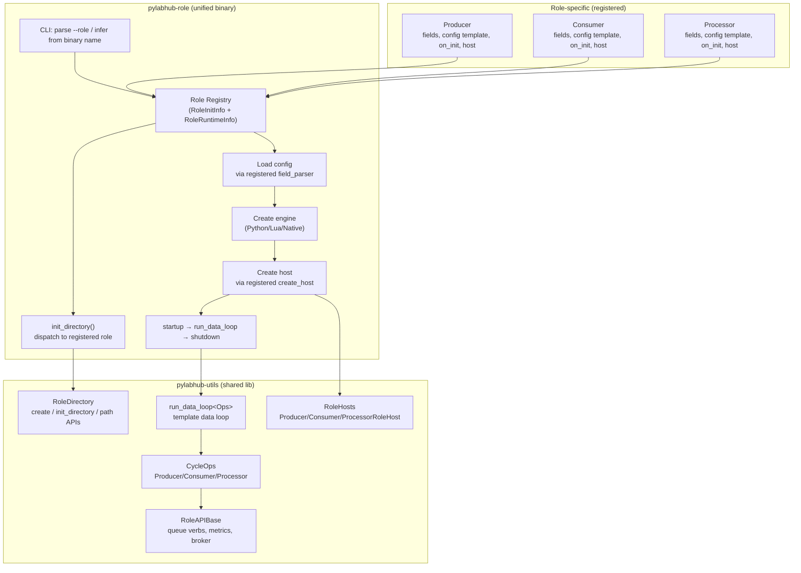

# HEP-CORE-0024: Role Directory Service

| Property       | Value                                                                          |
|----------------|--------------------------------------------------------------------------------|
| **HEP**        | `HEP-CORE-0024`                                                                |
| **Title**      | Role Directory Service — Canonical Layout, Path Resolution, and CLI Helpers    |
| **Status**     | Phases 1-12 done (2026-03-12..2026-04-17); Phases 13-14 done (2026-04-17); Phases 15-22 in progress (binary unification) |
| **Created**    | 2026-03-12                                                                     |
| **Area**       | Public API (`pylabhub::utils`), All Role Binaries, Custom Role Development     |
| **Depends on** | HEP-CORE-0018 (Producer/Consumer Binaries), HEP-CORE-0015 (Processor Binary)  |

---

## 1. Motivation

Every pyLabHub role (producer, consumer, processor) uses the same on-disk directory
layout convention. This convention is currently **implicit and scattered**:

| Responsibility | Current location |
|----------------|-----------------|
| Create `logs/`, `run/`, `vault/`, `script/python/` | `do_init()` — duplicated in each binary's `main.cpp` |
| Find config file from a directory | `Config::from_directory()` — duplicated in each role's config class |
| Resolve `hub_dir` relative → absolute | Each config class independently |
| Find `hub.pubkey` from hub directory | Each config class independently |
| Resolve script entry point path | Each script host independently |
| Default vault file path | Ad-hoc in each `--keygen` block |
| CLI argument parsing (`--init`, `--config`, `--keygen`, etc.) | Per-binary `parse_args()` — triplicated |
| Password prompt (no-echo, env-var, confirm) | Per-binary keygen block — triplicated |

This creates three problems:

1. **No public contract**: A developer building a custom C++ role binary has no standard
   way to set up the expected directory layout or parse the standard CLI flags. They must
   invent their own conventions, producing inconsistent tooling.

2. **Missed security enforcement**: `vault/` directory permissions (0700), default keyfile
   location, and vault password handling (echo suppression, confirmation, env-var priority)
   are security-critical details that every role reimplements — and custom roles will get
   wrong.

3. **Maintenance burden**: Adding a 4th standard binary, changing the directory layout,
   or fixing a path-resolution bug requires editing three places. Any inconsistency is
   a latent defect.

**This HEP introduces two public headers** that formalise the directory layout as a named
service (`RoleDirectory`) and provide a standard CLI toolkit (`role_cli.hpp`), enabling
consistent custom role binary development with correct security properties by default.

---

## 2. Design Principles

1. **Explicit contract over convention**: The directory layout is codified in `RoleDirectory`,
   not inferred by ad-hoc string concatenation throughout the codebase.

2. **Security by default**: `vault/` is always created at 0700. Default keyfile paths always
   land inside `vault/`. Password handling always suppresses echo and checks the env var
   before prompting. Custom roles get this for free by using the public API.

3. **Separation of concerns**: `RoleDirectory` knows about filesystem layout and path
   resolution only — it does not parse config JSON, manage lifecycles, or start threads.
   Config classes (`ProducerConfig` etc.) remain the authority on role-specific config content
   and delegate to `RoleDirectory` for path work.

4. **Extensibility**: Custom role types can add their own subdirectories via `subdir(name)`
   without subclassing. The standard layout is a floor, not a ceiling.

5. **Public API stability**: Both headers are installed in `build/stage-*/include/utils/`
   and versioned with `pylabhub-utils`. Breaking changes require a HEP revision.

---

## 3. Directory Layout Contract

### 3.1 Standard Role Directory

```
<role_dir>/                         ← RoleDirectory::base()
  <role>.json                       ← config file  (e.g. producer.json)
  logs/                             ← RoleDirectory::logs()    — Logger sink
  run/                              ← RoleDirectory::run()     — PID, FileLock artefacts
  vault/                            ← RoleDirectory::vault()   — RoleVault files (0700)
  script/
    python/
      __init__.py                   ← default script entry point
    lua/                            ← (future scripting engine)
      __init__.lua
  hub.pubkey                        ← optional: local copy of hub public key
```

### 3.2 Script Entry Point Convention

The script entry point is always resolved as:

```
<resolved_script_path>/script/<type>/__init__.<ext>
```

Where:
- `resolved_script_path` = `script.path` from config, resolved relative to `<role_dir>`
  if not absolute. Default: `"."` → `<role_dir>`.
- `type` = `script.type` from config (`"python"`, `"lua"`, etc.).
- `ext` = type-specific (`py`, `lua`, etc.).

This means `script.path = "."` always means "the script lives inside this role directory
at `./script/python/__init__.py`", regardless of the current working directory at runtime.

### 3.3 Hub Directory Reference

A role config may reference a hub directory via `hub_dir` (or `in_hub_dir` / `out_hub_dir`
for processors). These paths may be relative (to `<role_dir>`) or absolute:

```
<role_dir>/producer.json: { "hub_dir": "../hub" }
```

`RoleDirectory::resolve_hub_dir("../hub")` → `/absolute/path/to/hub`

Hub resources are then found at canonical locations within the resolved hub directory:

```
<hub_dir>/
  hub.json      ← contains broker_endpoint (read by hub_broker_endpoint())
  hub.pubkey    ← CurveZMQ public key     (read by hub_pubkey_path())
```

### 3.4 Vault File Convention

The default vault file path for a role is:

```
<role_dir>/vault/<role_uid>.vault
```

When `auth.keyfile` is empty in the config, `RoleDirectory::default_keyfile(uid)` returns
this path. Vault files are always placed inside `vault/` (0700) to prevent world-readable
access to encrypted secret keys.

---

## 4. `RoleDirectory` API

**Header**: `src/include/utils/role_directory.hpp`
**Namespace**: `pylabhub`
**Link target**: `pylabhub::utils` (no new target required)

```cpp
namespace pylabhub {

class RoleDirectory
{
public:
    // ── Construction ──────────────────────────────────────────────────────────

    /// Open an existing role directory.
    /// Weakly canonicalizes the path; does not validate subdirectories.
    static RoleDirectory open(const std::filesystem::path &base);

    /// Open from an explicit config file path (--config <path> mode).
    /// base is derived as config_path.parent_path().
    static RoleDirectory from_config_file(const std::filesystem::path &config_path);

    /// Create the standard layout: logs/, run/, vault/ (0700), script/python/.
    /// Idempotent: creates directories if they don't exist.
    /// Throws std::runtime_error if directory creation fails.
    static RoleDirectory create(const std::filesystem::path &base);

    // ── Standard paths ────────────────────────────────────────────────────────

    const std::filesystem::path &base() const noexcept;  ///< Role directory root (absolute)
    std::filesystem::path logs()   const;  ///< <base>/logs/
    std::filesystem::path run()    const;  ///< <base>/run/
    std::filesystem::path vault()  const;  ///< <base>/vault/   (always 0700 on POSIX)

    /// <base>/<filename> — canonical config file location.
    std::filesystem::path config_file(std::string_view filename) const;

    /// Custom subdirectory: <base>/<name>/
    /// For extension by custom role types (e.g. subdir("data"), subdir("cache")).
    std::filesystem::path subdir(std::string_view name) const;

    // ── Script path resolution ────────────────────────────────────────────────

    /// Resolve the script entry point from config fields.
    ///
    /// script_path: value of config "script.path" field. If relative, resolved
    ///              relative to base(). If empty, defaults to base().
    /// type:        value of config "script.type" field ("python", "lua", etc.).
    ///
    /// Returns: <resolved_script_path>/script/<type>/__init__.<ext>
    /// where <ext> is derived from type ("py" for "python", "lua" for "lua", etc.).
    ///
    /// Example: script_path=".", type="python" → <base>/script/python/__init__.py
    std::filesystem::path script_entry(std::string_view script_path,
                                       std::string_view type) const;

    // ── Vault helpers ─────────────────────────────────────────────────────────

    /// Default vault file: <vault()>/<uid>.vault
    /// Used when auth.keyfile is empty in config — ensures vault always lives
    /// inside the protected vault/ subdirectory.
    std::filesystem::path default_keyfile(std::string_view uid) const;

    // ── Hub reference resolution ──────────────────────────────────────────────

    /// Resolve a hub_dir reference from config JSON to an absolute path.
    /// hub_dir_value: the string from config (relative or absolute). If relative,
    ///               resolved relative to base(). Returns std::nullopt if empty.
    std::optional<std::filesystem::path>
    resolve_hub_dir(std::string_view hub_dir_value) const;

    /// Given a resolved hub directory, return the path to hub.pubkey.
    static std::filesystem::path
    hub_pubkey_path(const std::filesystem::path &hub_dir);

    /// Given a resolved hub directory, read the broker endpoint from hub.json.
    /// Throws std::runtime_error if hub.json is absent or malformed.
    static std::string
    hub_broker_endpoint(const std::filesystem::path &hub_dir);

    /// Given a resolved hub directory, read the first line of hub.pubkey.
    /// Returns empty string if the file does not exist.
    static std::string
    hub_broker_pubkey(const std::filesystem::path &hub_dir);

    // ── Security diagnostics ─────────────────────────────────────────────────

    /// Emit a hardcoded security warning to stderr when `keyfile` resolves to
    /// a path inside `role_base`.  Relative `keyfile` paths are resolved relative
    /// to `role_base`.  No-op when `keyfile` is empty or outside the role dir.
    ///
    /// Call from Config::from_directory() immediately after loading auth.keyfile.
    static void warn_if_keyfile_in_role_dir(const std::filesystem::path &role_base,
                                             const std::string           &keyfile);

    // ── Validation ───────────────────────────────────────────────────────────

    /// Returns true if logs/, run/, vault/, script/ all exist under base().
    bool has_standard_layout() const;

private:
    std::filesystem::path base_;
};

} // namespace pylabhub
```

### 4.1 Error handling

`open()`, `create()`, and `from_config_file()` throw `std::runtime_error` (or
`std::invalid_argument`) on invalid input. Path accessor methods (`logs()`, `vault()`,
etc.) are pure computation and never throw. `resolve_hub_dir()` and `hub_broker_endpoint()`
throw `std::runtime_error` if the hub directory is present but malformed.

### 4.2 Platform notes

On POSIX, `create()` sets `vault/` to mode `0700` immediately after `create_directories`.
On Windows, the directory ACL is set to owner-only using `SetFileSecurity`. If the
permission call fails, `create()` logs a warning but does not throw — the vault file
itself is still protected by `RoleVault` encryption.

---

## 5. `role_cli.hpp` API

**Header**: `src/include/utils/role_cli.hpp`
**Namespace**: `pylabhub::role_cli`
**Implementation**: header-only (`inline` functions) — no additional link dependency

```cpp
namespace pylabhub::role_cli {

// ── Argument parsing ──────────────────────────────────────────────────────────

/// Parsed result of parse_role_args().
struct RoleArgs
{
    std::string config_path;    ///< --config <path>
    std::string role_dir;       ///< positional <dir> or --init target
    std::string init_name;      ///< --name <name>  (for --init)
    std::string log_file;       ///< --log-file <path>
    bool        validate_only{false}; ///< --validate
    bool        keygen_only{false};   ///< --keygen
    bool        init_only{false};     ///< --init
};

/// Parse standard pyLabHub role CLI arguments.
///
/// role_name: "producer", "consumer", "processor", or any custom role name.
/// Abbreviates to first 4 chars in usage strings (prod/cons/proc).
///
/// Handled flags: --init [dir], --config <path>, --name <n>, --validate,
///                --keygen, --log-file <path>, --run (no-op), --help/-h,
///                <positional role_dir>.
///
/// Prints usage and calls std::exit(0) on --help.
/// Prints error and calls std::exit(1) on unknown flags or missing required args.
RoleArgs parse_role_args(int argc, char *argv[], const char *role_name);

// ── Name resolution (for --init) ─────────────────────────────────────────────

/// Resolve role name for --init.
/// Priority: cli_name (from --name) → interactive TTY prompt → error.
/// Returns std::nullopt if non-interactive and cli_name is empty
/// (error already printed to stderr).
///
/// prompt: e.g. "Producer name (human-readable, e.g. 'TempSensor'): "
std::optional<std::string>
resolve_init_name(const std::string &cli_name, const char *prompt);

// ── Password helpers ──────────────────────────────────────────────────────────

/// Returns true when stdin is an interactive terminal.
bool is_stdin_tty();

/// Read a password from the terminal without echoing.
/// POSIX: getpass(). Windows: temporarily disables ENABLE_ECHO_INPUT.
/// Only call when is_stdin_tty() is true.
std::string read_password_interactive(const char *role_name, const char *prompt);

/// Resolve vault password for unlock (single prompt).
/// Priority: PYLABHUB_ACTOR_PASSWORD env var → interactive terminal prompt.
/// Returns std::nullopt when non-interactive and env var is unset
/// (error already printed to stderr).
std::optional<std::string>
get_role_password(const char *role_name, const char *prompt);

/// Resolve vault password for new vault creation (requires confirmation).
/// Priority: PYLABHUB_ACTOR_PASSWORD env var → interactive prompt + confirm.
/// Returns std::nullopt on mismatch or when non-interactive without env var
/// (error already printed to stderr).
std::optional<std::string>
get_new_role_password(const char *role_name,
                      const char *prompt,
                      const char *confirm_prompt);

} // namespace pylabhub::role_cli
```

---

## 6. Integration with Existing Code

### 6.1 `Config::from_directory()` — all three role configs

**Before** (per-role, ~15 lines duplicated in each):
```cpp
ProducerConfig ProducerConfig::from_directory(const std::string &dir)
{
    namespace fs = std::filesystem;
    const fs::path config_path = fs::path(dir) / "producer.json";
    if (!fs::exists(config_path))
        throw std::runtime_error("producer.json not found in: " + dir);
    return from_json_file(config_path.string());
}
```

**After**:
```cpp
ProducerConfig ProducerConfig::from_directory(const std::string &dir)
{
    const auto role_dir = pylabhub::RoleDirectory::open(dir);
    return from_json_file(role_dir.config_file("producer.json").string());
}
```

### 6.2 Hub reference resolution in config parsing

**Before** (each config parses hub_dir independently, ~20 lines):
```cpp
if (!j.value("hub_dir", "").empty()) {
    const fs::path hub = fs::path(dir).parent_path() / j["hub_dir"].get<std::string>();
    // ... read hub.json broker_endpoint, read hub.pubkey ...
}
```

**After**:
```cpp
if (auto hub = role_dir.resolve_hub_dir(j.value("hub_dir", "")))
{
    config.broker_endpoint  = pylabhub::RoleDirectory::hub_broker_endpoint(*hub);
    config.broker_pubkey    = pylabhub::RoleDirectory::hub_pubkey_path(*hub).string();
}
```

### 6.3 Script host path resolution

**Before** (each script host independently resolves script path, ~8 lines):
```cpp
fs::path script_dir = config_.script_path.empty()
    ? fs::path(config_.role_dir) / "script" / config_.script_type
    : fs::path(config_.script_path) / "script" / config_.script_type;
fs::path entry = script_dir / "__init__.py";
```

**After**:
```cpp
const fs::path entry = role_dir_.script_entry(config_.script_path, config_.script_type);
```

### 6.4 `do_init()` in each binary

**Before** (per-binary, ~35 lines):
```cpp
static int do_init(const std::string &dir_str, const std::string &cli_name)
{
    namespace fs = std::filesystem;
    const fs::path prod_dir = dir_str.empty() ? fs::current_path() : fs::path(dir_str);
    std::error_code ec;
    fs::create_directories(prod_dir / "logs", ec);
    fs::create_directories(prod_dir / "run",  ec);
    fs::create_directories(prod_dir / "vault", ec);
    fs::create_directories(prod_dir / "script" / "python", ec);
    if (ec) { std::cerr << "Error: ..."; return 1; }
    const fs::path json_path = prod_dir / "producer.json";
    if (fs::exists(json_path)) { std::cerr << "Error: already exists"; return 1; }
    std::string prod_name;
    if (!cli_name.empty())      { prod_name = cli_name; }
    else if (is_stdin_tty())    { std::cout << "Producer name: "; std::getline(...); }
    else                        { std::cerr << "Error: --name required"; return 1; }
    // ... JSON template, Python template ...
}
```

**After** (~8 lines for the common part):
```cpp
static int do_init(const std::string &dir_str, const std::string &cli_name)
{
    pylabhub::RoleDirectory role_dir;
    try { role_dir = pylabhub::RoleDirectory::create(
              dir_str.empty() ? fs::current_path() : dir_str, "producer.json"); }
    catch (const std::exception &e) { std::cerr << "Error: " << e.what() << "\n"; return 1; }

    auto prod_name = pylabhub::role_cli::resolve_init_name(cli_name,
                         "Producer name (human-readable, e.g. 'TempSensor'): ");
    if (!prod_name) return 1;
    // ... JSON template, Python template (role-specific, unchanged) ...
}
```

### 6.5 `main()` argument parsing

**Before** (per-binary struct + function, ~70 lines):
```cpp
struct ProdArgs { std::string config_path; std::string prod_dir; ... };
ProdArgs parse_args(int argc, char *argv[]) { ... }
// in main():
const ProdArgs args = parse_args(argc, argv);
if (!args.prod_dir.empty()) config = ProducerConfig::from_directory(args.prod_dir);
```

**After**:
```cpp
// in main():
const auto args = pylabhub::role_cli::parse_role_args(argc, argv, "producer");
if (!args.role_dir.empty()) config = ProducerConfig::from_directory(args.role_dir);
```

### 6.6 Keygen password block

**Before** (per-binary, ~25 lines):
```cpp
std::string password;
if (const char *env = std::getenv("PYLABHUB_ACTOR_PASSWORD")) { password = env; }
else if (!scripting::is_stdin_tty()) { std::cerr << "Error: ..."; return 1; }
else {
    password = scripting::read_password_interactive(...);
    const std::string confirm = scripting::read_password_interactive(...);
    if (password != confirm) { std::cerr << "Error: ..."; return 1; }
}
```

**After**:
```cpp
const auto password = pylabhub::role_cli::get_new_role_password(
    "producer",
    "Producer vault password (empty = no encryption): ",
    "Confirm password: ");
if (!password) return 1;
```

---

## 7. Custom Role Binary — Full Example

With both headers, a custom C++ role binary follows this canonical pattern:

```cpp
// my_sensor_main.cpp
#include "utils/role_directory.hpp"
#include "utils/role_cli.hpp"
#include "utils/actor_vault.hpp"
#include "utils/uid_utils.hpp"
#include "plh_datahub.hpp"

namespace rc  = pylabhub::role_cli;
namespace uid = pylabhub::uid;
using pylabhub::RoleDirectory;

static int do_init(const std::string &dir_str, const std::string &cli_name)
{
    RoleDirectory role_dir;
    try { role_dir = RoleDirectory::create(dir_str.empty() ? "." : dir_str, "sensor.json"); }
    catch (const std::exception &e) { std::cerr << "Error: " << e.what() << "\n"; return 1; }

    auto name = rc::resolve_init_name(cli_name, "Sensor name: ");
    if (!name) return 1;

    // Write sensor.json and script template using role_dir.config_file("sensor.json")
    // and role_dir.script_entry(".", "python") for default paths.
    // ...
    return 0;
}

int main(int argc, char *argv[])
{
    const auto args = rc::parse_role_args(argc, argv, "sensor");
    if (args.init_only) return do_init(args.role_dir, args.init_name);

    // Load config ...
    RoleDirectory role_dir = args.role_dir.empty()
        ? RoleDirectory::from_config_file(args.config_path)
        : RoleDirectory::open(args.role_dir);

    if (args.keygen_only) {
        const auto pw = rc::get_new_role_password("sensor",
            "Sensor vault password: ", "Confirm: ");
        if (!pw) return 1;
        const auto vault = pylabhub::utils::RoleVault::create(
            role_dir.default_keyfile(sensor_uid).string(), sensor_uid, *pw);
        std::cout << "Vault written to: " << vault.path() << "\n"
                  << "  public_key: " << vault.public_key() << "\n";
        return 0;
    }

    // Unlock vault, start lifecycle, run sensor loop ...
    const auto pw = rc::get_role_password("sensor", "Sensor vault password: ");
    if (!pw) return 1;
    // ...
}
```

This example: sets up the standard directory layout, generates a standard UID, handles
`--init`/`--keygen`/`--validate`/`--config` uniformly with the official binaries, and
places the vault file in `vault/<uid>.key` — the security-correct location — automatically.

---

## 8. Security Properties

| Property | Mechanism |
|----------|-----------|
| Vault directory always 0700 | `RoleDirectory::create()` sets permissions before returning |
| Vault files always inside `vault/` | `default_keyfile(uid)` returns `<vault()>/<uid>.key`; API makes the secure path the easy path |
| Password never echoed | `read_password_interactive()` uses `getpass()` / `SetConsoleMode` |
| Password never in command-line args | API has no password parameter — only env var or TTY |
| New vault requires confirmation | `get_new_role_password()` always prompts twice (unless env var) |
| Hub pubkey path has one resolver | `RoleDirectory::hub_pubkey_path()` — one audit point |
| Vault outside role dir warning | `warn_if_keyfile_in_role_dir()` emits a hardcoded `stderr` warning when vault path resolves inside role dir (enables offline brute-force if role scripts exfiltrate it) |
| Relative path traversal | `resolve_hub_dir()` resolves relative to `base()` — can be validated for escaping if needed (future) |

---

## 9. What Does NOT Change

- `ProducerConfig`, `ConsumerConfig`, `ProcessorConfig` remain the authority on
  role-specific config content (field names, defaults, validation). `RoleDirectory`
  is used only for path work inside `from_directory()` and script-path resolution.
- `HubConfig` is not affected — the hub directory has its own established loading
  pattern (`HubConfig::set_config_path()`). `RoleDirectory::hub_broker_endpoint()`
  and `hub_pubkey_path()` read the minimal hub info needed by role configs without
  going through `HubConfig`.
- Python scripting callbacks (`on_init`, `on_produce`, etc.) are unaffected.
- `role_main_helpers.hpp` remains as a private `scripting`-layer header for the
  lifecycle and monitoring boilerplate that requires `plh_datahub.hpp`. After this
  HEP, its password helpers and `is_stdin_tty()` move to the public `role_cli.hpp`;
  `role_main_helpers.hpp` retains only `role_lifecycle_modules()`,
  `register_signal_handler_lifecycle()`, and `run_role_main_loop()`.

---

## 10. Registration-Based Directory Initialization

> Added 2026-04-16. Extends §4 with `init_directory()` and role registration.

### 10.1 Problem

The `do_init()` function is duplicated in each binary's `main.cpp` (~120 lines each).
The common scaffolding (directory creation, name prompting, UID generation, file writing,
summary printing) is identical; only the config JSON template and optional post-init
actions differ per role. Adding a new role requires copying and editing an entire
`do_init()` function.

### 10.2 Design: Registration + Generic Init

`RoleDirectory` provides a generic `init_directory()` method. Role-specific content
is injected via a registration API — each role registers a `RoleInitInfo` struct once.
`RoleDirectory` stays generic and role-agnostic.

```cpp
/// Role-specific content for init_directory(). Registered once per role tag.
struct RoleInitInfo
{
    std::string config_filename;   ///< "producer.json", "consumer.json", etc.
    std::string uid_prefix;        ///< "PROD", "CONS", "PROC" — passed to generate_uid()
    std::string role_label;        ///< "Producer" — used in prompts and summary output

    /// Build the default JSON config template for this role.
    /// uid and name are already resolved by init_directory().
    std::function<nlohmann::json(const std::string &uid,
                                  const std::string &name)> config_template;

    /// Optional post-init callback for role-specific customization.
    /// Called after directory structure and config file are written.
    /// Use role_dir path APIs (script_entry, subdir, etc.) to locate paths.
    /// nullptr = no post-init action.
    std::function<void(const RoleDirectory &role_dir,
                        const std::string &name)> on_init;
};
```

### 10.3 Registration API

```cpp
class RoleDirectory
{
public:
    // ... existing API (§4) ...

    /// Register role-specific init content. Called once per role at startup.
    /// role_tag: "producer", "consumer", "processor", or any custom role tag.
    /// Overwrites any previous registration for the same tag.
    static void register_role(const std::string &role_tag, RoleInitInfo info);

    /// Scaffolding init for a registered role.
    ///
    /// 1. Calls create(dir) for directory structure
    /// 2. Resolves name (interactive prompt if empty, using role_label from registration)
    /// 3. Generates UID via uid_prefix from registration
    /// 4. Writes config_template() to config_filename in dir
    /// 5. Calls on_init(role_dir, name) if registered (role-specific customization)
    /// 6. Prints summary (directory, UID, name, config path, next steps)
    ///
    /// Returns 0 on success, non-zero on error (matches main() convention).
    static int init_directory(const std::filesystem::path &dir,
                              const std::string &role_tag,
                              const std::string &name = {});
};
```

### 10.4 Role Registration Example

Each role registers in its own source file. The registration happens at static
init time or early in `main()` — before `init_directory()` is called.

```cpp
// In producer_fields.cpp (compiled into pylabhub-utils)

void pylabhub::producer::register_producer_init()
{
    RoleDirectory::register_role("producer", {
        .config_filename = "producer.json",
        .uid_prefix      = "PROD",
        .role_label      = "Producer",
        .config_template = [](const std::string &uid, const std::string &name)
            -> nlohmann::json
        {
            nlohmann::json j;
            j["producer"]["uid"]       = uid;
            j["producer"]["name"]      = name;
            j["producer"]["log_level"] = "info";
            // ... role-specific default fields ...
            return j;
        },
        .on_init = [](const RoleDirectory &rd, const std::string &name)
        {
            // Write starter Python script at the standard script entry point
            const auto script_path = rd.script_entry(".", "python");
            std::ofstream out(script_path);
            out << "# Producer: " << name << "\n"
                << "def on_produce(tx, msgs, api):\n"
                << "    return True\n";
        },
    });
}
```

### 10.5 Binary Migration

The binary's `do_init()` reduces to a single dispatch:

```cpp
// Before: ~120 lines of duplicated scaffolding per binary
static int do_init(const std::string &dir, const std::string &name)
{
    // ... 120 lines of directory creation, JSON template, Python template ...
}

// After: one line
static int do_init(const std::string &dir, const std::string &name)
{
    return pylabhub::RoleDirectory::init_directory(dir, "producer", name);
}
```

### 10.6 `on_init` Callback and RoleDirectory Path APIs

The `on_init` callback receives a `const RoleDirectory &` which provides path
APIs for locating standard directories without hardcoding paths:

| Method | Returns | Example |
|--------|---------|---------|
| `base()` | Role directory root | `/home/user/my_producer/` |
| `logs()` | `<base>/logs/` | Log file directory |
| `run()` | `<base>/run/` | PID file, lock file directory |
| `vault()` | `<base>/vault/` | Vault files (0700) |
| `config_file(name)` | `<base>/<name>` | `<base>/producer.json` |
| `script_entry(path, type)` | Resolved script entry point | `<base>/script/python/__init__.py` |
| `subdir(name)` | `<base>/<name>/` | Custom subdirectory |

The callback uses these APIs to write role-specific files in the correct
locations. `RoleDirectory` does not know about scripts, templates, or any
role-specific content — it only provides the path framework.

### 10.7 Custom Role Registration

A custom role binary registers its own init content using the same API:

```cpp
int main(int argc, char *argv[])
{
    // Register before parsing args
    RoleDirectory::register_role("sensor", {
        .config_filename = "sensor.json",
        .uid_prefix      = "SENS",
        .role_label      = "Sensor",
        .config_template = &my_sensor_config_template,
        .on_init         = &my_sensor_post_init,
    });

    const auto args = role_cli::parse_role_args(argc, argv, "sensor");
    if (args.init_only)
        return RoleDirectory::init_directory(args.role_dir, "sensor", args.init_name);
    // ...
}
```

No subclassing. No changes to `RoleDirectory`. The registration API is the
extension point.

---

## 11. Unified Role Binary

> Added 2026-04-16. Replaces three separate binaries with one.

### 11.1 Motivation

The three role binaries (`pylabhub-producer`, `pylabhub-consumer`,
`pylabhub-processor`) share ~80% of their `main()` code. The differences are:

1. Role tag string and field parser function (config loading)
2. Role host class constructor
3. Binary name in signal handler / status display
4. `do_init()` content (migrating to `init_directory()` registration, §10)

With role hosts now compiled into `pylabhub-utils` (shared lib), the binaries
are thin wrappers. A single binary eliminates the duplication entirely.

### 11.2 CLI Design

```
pylabhub-role --role <tag> <dir>                    # Run role from directory
pylabhub-role --role <tag> --config <path>           # Run role from config file
pylabhub-role --role <tag> --init [<dir>]             # Init directory for role
pylabhub-role --role <tag> --config <path> --validate # Validate config
pylabhub-role --role <tag> --config <path> --keygen   # Generate keypair
```

The `--role` flag is required. Valid values: `producer`, `consumer`, `processor`,
or any registered custom role tag.

### 11.3 Role Tag Inference (optional convenience)

When `--role` is omitted, the binary attempts to infer the role:

1. **From binary name**: if invoked as `pylabhub-producer` (symlink or renamed),
   infer `--role producer`.
2. **From config file name**: if `--config producer.json`, infer `--role producer`.
3. **From directory contents**: if `<dir>/producer.json` exists, infer `--role producer`.

If inference fails, print error and exit.

### 11.4 Runtime Registration

Each role registers its runtime components alongside its init content:

```cpp
struct RoleRuntimeInfo
{
    /// Config field parser (role-specific JSON fields).
    std::function<void(const nlohmann::json &, pylabhub::config::RoleConfig &)> field_parser;

    /// Construct and return the role host. Takes ownership of config and engine.
    std::function<std::unique_ptr<RoleHostBase>(
        pylabhub::config::RoleConfig config,
        std::unique_ptr<pylabhub::scripting::ScriptEngine> engine,
        std::atomic<bool> *shutdown_flag)> create_host;

    /// Status line for signal handler display.
    std::function<std::string(const pylabhub::config::RoleConfig &,
                               std::chrono::seconds uptime)> status_line;
};

// Registration:
static void register_role_runtime(const std::string &role_tag, RoleRuntimeInfo info);
```

### 11.5 Unified `main()` Flow

```
main(argc, argv):
    1. Install signal handler
    2. Parse args (role_tag from --role or inference)
    3. if --init: return init_directory(dir, role_tag, name)
    4. Lifecycle init
    5. Load config via registered field_parser for role_tag
    6. if --keygen: keygen flow (generic, parameterized by role_tag)
    7. Auth (generic)
    8. Create engine (generic — same for all roles)
    9. Create host via registered create_host for role_tag
    10. startup, validate, run loop, shutdown (generic)
```

Steps 3, 5, 9 dispatch to registered role-specific functions.
Everything else is role-agnostic.

### 11.6 Legacy Binary Compatibility

The three original binary names are preserved as symlinks to the unified binary:

```
pylabhub-producer  →  pylabhub-role    (infers --role producer from binary name)
pylabhub-consumer  →  pylabhub-role    (infers --role consumer)
pylabhub-processor →  pylabhub-role    (infers --role processor)
```

Existing scripts and deployment configurations continue to work unchanged.
The symlinks can be created by CMake at install/staging time.

### 11.7 Architecture Diagram



---

## 12. CLI ↔ Config Boundary

> Added 2026-04-17. Establishes the separation of concerns between the CLI and
> the config file, ensuring runtime behavior is driven entirely by the config.

### 12.1 Principle

The role config file is the **single source of truth for runtime behavior**.
CLI flags serve two purposes only:

1. **Init mode (`--init`)**: flags populate values into the new config file.
2. **Keygen mode (`--keygen`)**: flags identify the config and provide password
   input (no runtime behavior).

**Runtime mode (run)**: no config-altering flags are accepted. The only CLI
inputs are `--role <tag>`, the role directory (or `--config <path>`), and
operational flags that affect the execution environment (e.g., `--validate`).

This separation guarantees:
- **Reproducibility**: two operators starting the same role from the same
  config file get identical behavior.
- **Auditability**: what a role does is visible by reading one file.
- **No silent overrides**: there is no way to pass a CLI flag that changes
  what the role does at runtime, bypassing the config.

### 12.2 Flag classification

| Flag | Init | Keygen | Run |
|------|------|--------|-----|
| `--role <tag>` | ✅ required | ✅ required | ✅ required |
| positional `<dir>` | ✅ | — | ✅ (or `--config`) |
| `--config <path>` | — | ✅ | ✅ |
| `--name <name>` | ✅ | — | — |
| `--log-maxsize <N[KMG]>` | ✅ (writes `logging.max_size_mb`) | — | — |
| `--log-backups <N>` | ✅ (writes `logging.backups`) | — | — |
| `--log-file <path>` | ✅ (writes `logging.file_path`) | — | — |
| `--validate` | — | — | ✅ |
| `--keygen` | — | ✅ | — |
| `--init` | ✅ | — | — |

### 12.3 Mutual exclusion enforcement

`parse_role_args()` enforces the table:
- `--log-maxsize` / `--log-backups` / `--log-file` / `--name` outside of
  `--init` mode → error with usage message.
- `--validate` inside `--init` or `--keygen` mode → error.
- Unknown combinations → error.

### 12.4 LoggingConfig schema

New role config category (applies to all three roles):

```json
{
    "logging": {
        "file_path": "logs/<uid>.log",       // optional: overrides default path
        "max_size_mb": 10,                    // default 10 MiB
        "backups": 5,                         // default 5 backup files
        "timestamped": true                   // default true (new behavior)
    }
}
```

Defaults apply when fields are absent — new role configs generated by `--init`
omit `logging` entirely (all defaults). CLI flags at `--init` time populate
non-default values only.

**Default log file path** (when `logging.file_path` is absent):
- `<role_dir>/logs/<uid>-<YYYY-MM-DD-HH-MM-SS>.log` (timestamped mode)
- `<role_dir>/logs/<uid>.log` (non-timestamped mode, explicit `"timestamped": false`)

### 12.5 RotatingFileSink extension

`RotatingFileSink` is extended with a `Mode` enum (not a new class):

```cpp
class RotatingFileSink : public Sink, private BaseFileSink
{
public:
    enum class Mode { Numeric, Timestamped };

    // Existing ctor — Numeric mode (backwards compatible):
    RotatingFileSink(const fs::path &base_path, size_t max_size,
                     size_t max_backups, bool use_flock);

    // New ctor with explicit mode:
    RotatingFileSink(const fs::path &base_path, size_t max_size,
                     size_t max_backups, bool use_flock, Mode mode);

private:
    Mode mode_{Mode::Numeric};
    // rotate() checks mode_ and dispatches internally.
};
```

Numeric mode (existing): rotates `base → base.1`, `base.1 → base.2`, ...
Timestamped mode (new): opens `base-<creation-time>.log`, on rotation closes
current file and opens new one with fresh timestamp; cleans oldest files in
the directory matching `<basename>-*.log` to enforce `max_backups`.

`RotatingLogConfig` gains `timestamped_names` boolean flag (default false for
backwards compat; `plh_role` sets it true).

---

## 13. Updated Implementation Plan

### Original phases (2026-03-12)

| Phase | Scope | Status |
|-------|-------|--------|
| 1 | `RoleDirectory` class — layout, path resolution, hub resolution | ✅ 2026-03-12 |
| 2 | `role_cli.hpp` — `RoleArgs`, `parse_role_args`, password helpers | ✅ 2026-03-12 |
| 3 | Migrate `Config::from_directory()` in all 3 role configs | ✅ 2026-03-12 |
| 4 | Migrate script-path resolution in all 3 script hosts | ⚪ deferred |
| 5 | Migrate `do_init()` and `main()` to use `RoleDirectory` + `role_cli` | ✅ 2026-03-12 |
| 6 | Move password helpers to `role_cli.hpp` | ✅ 2026-03-12 |
| 7 | Update README docs with new public API | ⚪ deferred |
| 8 | Tests: `RoleDirectoryTest` + `RoleCliTest` | ✅ 2026-03-12 |

### New phases (2026-04-16..17)

| # | Scope | Status |
|---|-------|--------|
| 9  | `RoleInitInfo` struct + `register_role()` + `init_directory()` on `RoleDirectory` | ✅ 2026-04-16 |
| 10 | Register producer/consumer/processor init content; migrate `do_init()` to one-line dispatch | ✅ 2026-04-16 |
| 11 | Role hosts moved into `pylabhub-utils` shared lib | ✅ 2026-04-16 |
| 12 | Rename `pylabhub-pyenv` → `plh_pyenv` | ✅ 2026-04-17 |
| 13 | `RotatingFileSink::Mode::Timestamped` extension; `RotatingLogConfig::timestamped_names` | ✅ 2026-04-17 |
| 14 | `LoggingConfig` category in `RoleConfig` with parser + whitelist | ✅ 2026-04-17 |
| 15 | `RoleHostBase` abstract class (lib-internal) + three role hosts inherit | ⚪ |
| 16 | `RoleRuntimeInfo` struct + `register_runtime()` builder + `get_runtime()` accessor | ⚪ |
| 17 | Register producer/consumer/processor runtime info + `bootstrap_<role>()` per role | ⚪ |
| 18 | Extend `role_cli`: `--role`, `--log-maxsize`, `--log-backups`, `--log-file`; flag mode-exclusion enforcement | ⚪ |
| 19 | `plh_role` unified binary + CMake target | ⚪ |
| 20 | Delete `pylabhub-producer/consumer/processor` binaries | ⚪ |
| 21 | Migrate/unify L4 tests to parameterize on role tag via `plh_role` | ⚪ |
| 22 | Update README / Deployment docs for `plh_role` + new CLI surface | ⚪ |

### Commit order

1. **Logger changes** (phase 13 → low risk, backwards-compatible extension)
2. **Config schema** (phase 14 → `LoggingConfig` category)
3. **Lib infrastructure** (phases 15, 16)
4. **Per-role runtime registration** (phase 17)
5. **CLI extension** (phase 18)
6. **Binary creation** (phase 19)
7. **Test migration** (phase 21) + **binary deletion** (phase 20) — same commit
8. **Docs** (phase 22)

---

## 14. Source File Reference

| Component | File |
|-----------|------|
| `RoleDirectory` class | `src/include/utils/role_directory.hpp` (public), `src/utils/config/role_directory.cpp` |
| `role_cli.hpp` | `src/include/utils/role_cli.hpp` (public, header-only) |
| Consumer config from_directory | `src/consumer/consumer_config.cpp` |
| Producer config from_directory | `src/producer/producer_config.cpp` |
| Processor config from_directory | `src/processor/processor_config.cpp` |
| Producer binary main | `src/producer/producer_main.cpp` |
| Consumer binary main | `src/consumer/consumer_main.cpp` |
| Processor binary main | `src/processor/processor_main.cpp` |
| Embedded API guide | `docs/README/README_EmbeddedAPI.md` |
