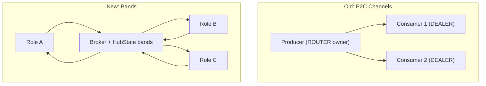

# HEP-CORE-0030: Band Messaging Protocol

| Property      | Value                                                |
|---------------|------------------------------------------------------|
| **HEP**       | `HEP-CORE-0030`                                      |
| **Title**     | Band Messaging Protocol                              |
| **Status**    | Draft                                                |
| **Created**   | 2026-04-10                                           |
| **Area**      | Control Plane Protocol                               |
| **Depends on**| HEP-CORE-0007 (Protocol Reference)                   |
| **Supersedes**| HEP-CORE-0007 §12 Peer-to-Peer category (HELLO/BYE, ChannelHandle/Pattern P2C sockets).  Note: the `CHANNEL_BROADCAST_REQ` / `CHANNEL_EVENT_NOTIFY` / `CHANNEL_BROADCAST_NOTIFY` channel-bound family is NOT superseded — see §9.1 for the channel-bound vs band-bound coexistence model (corrected 2026-05-17, audit T3). |

---

## 1. Abstract

This HEP defines **bands** as broker-hosted pub/sub messaging groups.
A band is a named facility where roles subscribe, exchange JSON messages,
and receive join/leave notifications. The broker maintains the member list
and performs fan-out delivery.

This protocol replaces:
- The old `CHANNEL_NOTIFY_REQ` / `CHANNEL_BROADCAST_REQ` asymmetric relay
- The old Peer-to-Peer category (HELLO/BYE, P2C direct sockets)
- The old `ChannelHandle` / `ChannelPattern` P2C socket infrastructure

---

## 2. Design Principles

1. **No ownership.** Any role can create a band by joining it. No
   producer/consumer asymmetry.
2. **Broker-mediated.** All messages flow through the broker's ROUTER
   socket. No direct P2C sockets between roles.
3. **JSON format.** All band message bodies are JSON.
4. **Symmetric membership.** All members are equal. Any member can send.
   All members receive.
5. **Auto-lifecycle.** Band is created on first join, deleted when
   last member leaves or times out.

---

## 3. Band Naming

Format: `!band_name` (HEP-CORE-0033 §G2.2.0b grammar).

- `!` prefix distinguishes band names from role uids, channel names, and
  schema ids.  Single enforcement point: `is_valid_identifier(s,
  IdentifierKind::Band)` in `utils/naming.hpp`.
- The body is one or more dotted `NameComponent`s — each component matches
  `[A-Za-z][A-Za-z0-9_-]{0,63}`.
- Federation routing does **not** use a name-encoded `@hub_uid` suffix;
  cross-hub relay is decided by per-peer `relay_channels` lists in
  `PeerEntry` (HEP-CORE-0022 §3 / HEP-CORE-0033 §8).
- Examples: `!sensor_sync`, `!pipeline.ctrl`, `!ops.alpha-1`.

---

## 4. Hub State

Bands live in `pylabhub::hub::HubState` (HEP-CORE-0033 §8) alongside
channels, roles, and federation peers.  All mutations go through
`BrokerService` capability ops (`_on_band_joined` / `_on_band_left`)
which validate identifiers at the boundary.

```cpp
struct BandMember
{
    std::string role_uid;       // e.g. "prod.sensor.uid12345678"
    std::string role_name;      // e.g. "sensor_producer"
    std::string zmq_identity;   // ROUTER identity for push notifications
    std::chrono::steady_clock::time_point joined_at;
};

struct BandEntry
{
    std::string name;           // e.g. "!sensor_sync"
    std::vector<BandMember> members;
    std::chrono::steady_clock::time_point created_at;
    std::chrono::steady_clock::time_point last_activity;
};
```

Thread safety: HubState owns a single internal mutex; mutators (`_on_band_*`)
take the writer lock per primitive, snapshot readers take the reader lock.
Broker handler code is single-threaded under the run() loop's `m_query_mu`,
so the broker side never observes concurrent state mutations.

---

## 5. Wire Protocol

All messages use the standard 4-frame ROUTER format:
```
[zmq_identity] ['C'] [msg_type_string] [json_body]
```

### 5.1 Request-Reply Messages

#### BAND_JOIN_REQ / BAND_JOIN_ACK

```
Direction:  Role → Broker → Role
Purpose:    Join a band (auto-creates if it doesn't exist)

Request payload:
  band                  string   "!band_name"
  role_uid              string   Joining role's UID
  role_name             string   Joining role's display name

Reply payload (BAND_JOIN_ACK):
  status                string   "success"
  band                  string   "!band_name"
  members               array    Current member list [{role_uid, role_name}, ...]

Broker behavior:
  1. If band doesn't exist → create it
  2. Add member to list (idempotent: if already member, no-op)
  3. Send BAND_JOIN_NOTIFY to all existing members (before adding)
  4. Reply with current member list (including new member)
```

#### BAND_LEAVE_REQ / BAND_LEAVE_ACK

```
Direction:  Role → Broker → Role
Purpose:    Leave a band

Request payload:
  band                  string   "!band_name"
  role_uid              string   Leaving role's UID

Reply payload (BAND_LEAVE_ACK):
  status                string   "success" | "error"
  error_code            string   only present on error:
                                 "NOT_A_MEMBER" — sender wasn't actually
                                                  in the band
                                 "INVALID_BAND_NAME" — grammar (R3.5)
                                 "INVALID_REQUEST" / "INVALID_ROLE_TAG" —
                                                  identifier grammar /
                                                  tag (R3.5b)

Broker behavior (S4 amendment 2026-05-19):
  1. Validate band + role_uid grammar.
  2. Sender-must-be-member check.  If sender isn't in
     `band->members`: return {status: error,
                              error_code: "NOT_A_MEMBER"}.
     Pre-S4 the broker silently returned success here; the
     role-side bookkeeping then carried a stale `band_index_`
     entry it couldn't reconcile.
  3. Remove member from list.
  4. Send BAND_LEAVE_NOTIFY to remaining members
     (handler-driven via `subscribe_band_left`, Wave-M3 step 5f).
  5. If band is empty → delete it.
  6. Reply BAND_LEAVE_ACK with status=success.
```

#### BAND_MEMBERS_REQ / BAND_MEMBERS_ACK

```
Direction:  Role → Broker → Role
Purpose:    Query current band member list

Request payload:
  band                  string   "!band_name"

Reply payload (BAND_MEMBERS_ACK):
  band                  string   "!band_name"
  members               array    [{role_uid, role_name}, ...]
                                  Empty array if band doesn't exist
```

### 5.2 Fire-and-Forget Messages

#### BAND_BROADCAST_REQ

```
Direction:  Role → Broker (no reply)
Purpose:    Send JSON message to all band members

Payload:
  band                  string   "!band_name"
  role_uid              string   Sender's role UID (must be a valid
                                 RoleUid per HEP-CORE-0033 §G2.2.0b;
                                 broker_proto 4→5 (audit R3.5b,
                                 2026-05-19) renamed `sender_uid` →
                                 `role_uid` for cross-message
                                 uniformity)
  body                  object   Application-defined JSON body

Broker behavior:
  1. Validate `band` (HEP-0030 §3 grammar) + `role_uid` (HEP-0033
     §G2.2.0b RoleUid grammar) at gate entry.  Either failing →
     drop + LOGGER_WARN (fire-and-forget — no reply path).
  2. **Sender-must-be-member gate (S4 amendment 2026-05-19).**
     Look up band via `hub_state_.band(name)` snapshot.  If band
     doesn't exist → drop + LOGGER_WARN.  If sender's `role_uid`
     is not in `band->members` → drop + LOGGER_WARN.  Both rules
     are part of the broker-authority principle (§5.2.1 below).
  3. For each member (excluding sender):
       send_to_identity(socket, member.zmq_identity,
           "BAND_BROADCAST_NOTIFY", {band, role_uid, body})
```

#### §5.2.1 Broker-authority principle for band operations (S4 amendment 2026-05-19)

Bands are coordination groups; broker is authoritative on
membership.  Every band wire op enforces two rules:

1. **Broker validates the request before honouring it.**
   - Grammar (HEP-CORE-0033 §G2.2.0b) on every identifier.
   - Sender membership where the op is member-only:
     - `BAND_LEAVE_REQ` from a non-member → typed `NOT_A_MEMBER` error.
     - `BAND_BROADCAST_REQ` from a non-member → drop + LOGGER_WARN
       (fire-and-forget, no reply path).
   - `BAND_JOIN_REQ` is idempotent: re-joining a band you're
     already in returns `status:success` (matches restart-recovery
     patterns).

2. **Role mirrors broker truth on every response.**
   - `status:success` → role-side updates `band_index_` accordingly
     (add on join, remove on leave).
   - `status:error` → role-side mirrors the broker's verdict —
     erase the stale `band_index_` entry.  Specifically: a
     `NOT_A_MEMBER` on leave is authoritative; the role's cached
     entry is removed.  This reverses the prior R3.2 (2026-05-17)
     "keep on error" heuristic, which was safe under ambiguous
     broker errors but wrong now that the canonical error has
     concrete membership semantics.
   - `nullopt` (transport timeout) → role-side bookkeeping is left
     unchanged.  Automatic recovery on timeout is outside the
     framework's contract; the script must decide.  If timeout-
     induced state divergence becomes observable in logs, that's
     addressed at the network-stability / policy layer, not by
     adding retry machinery here.

The reasoning is: state machinery is reactive, not proactive.  Logs
+ events drive future design; we don't engineer for failure modes
we haven't observed.

### 5.3 Broker-Initiated Notifications

#### BAND_JOIN_NOTIFY

```
Direction:  Broker → All existing band members
Trigger:    Another role joined the band

Payload:
  band                  string   "!band_name"
  role_uid              string   Joining role's UID
  role_name             string   Joining role's display name
```

#### BAND_LEAVE_NOTIFY

```
Direction:  Broker → All remaining band members
Trigger:    A role left the band (voluntarily or heartbeat timeout)

Payload:
  band                  string   "!band_name"
  role_uid              string   Leaving role's UID
  reason                string   "voluntary" | "heartbeat_timeout"
```

#### BAND_BROADCAST_NOTIFY

```
Direction:  Broker → All band members (except sender)
Trigger:    BAND_BROADCAST_REQ received from a member

Payload:
  band                  string   "!band_name"
  role_uid              string   Sending role's UID (was `sender_uid`;
                                 renamed in broker_proto 4→5 audit
                                 R3.5b 2026-05-19)
  body                  object   Application-defined JSON body (passthrough)
```

---

## 6. Heartbeat-Based Auto-Leave

When the broker detects a role's heartbeat has expired (existing liveness
mechanism in `check_heartbeat_timeouts()`):

1. Remove the role from ALL bands it belongs to
2. For each affected band, send `BAND_LEAVE_NOTIFY` with
   `reason: "heartbeat_timeout"` to remaining members
3. If any band becomes empty, delete it

This reuses the existing heartbeat infrastructure — no new liveness
mechanism needed.

---

## 7. Role-Side API

### 7.1 BrokerRequestComm Methods

```cpp
std::optional<nlohmann::json> band_join(const std::string &band,
                                         int timeout_ms = 5000);
bool band_leave(const std::string &band, int timeout_ms = 5000);
void band_broadcast(const std::string &band, const nlohmann::json &body);
std::optional<nlohmann::json> band_members(const std::string &band,
                                            int timeout_ms = 5000);
```

### 7.2 Script API

```python
# Join/leave
result = api.band_join("!sensor_sync")
# result is the broker's response dict, or None on transport timeout.
# Examine result["status"] to disambiguate success / error.
api.band_leave("!sensor_sync")

# Messaging
api.band_broadcast("!sensor_sync", {"event": "calibration_done", "ts": 123.4})

# Query
members = api.band_members("!sensor_sync")
# Returns: {"band": ..., "members": [{"role_uid": ..., "role_name": ...}, ...]}

# Local introspection (S4 amendment 2026-05-19) — role's CACHED view
# of its own membership.  Reads `band_index_` directly; no broker
# round-trip.  For authoritative state use `band_members(name)`.
if api.is_in_band("!sensor_sync"):
    api.band_broadcast("!sensor_sync", {...})
```

### 7.3 Typed Callback Delivery to Scripts (S4 amendment 2026-05-19)

The framework delivers band events via **typed callbacks** dispatched
through `kNotificationTable` (HEP-CORE-0011 §"Notification dispatch").
Scripts subscribe by defining the named callback function; if the
script doesn't override, the framework's no-op default fires.  Band
events are not auto-stripped from `msgs` for the generic scan — they
ARE the typed callback's input.

```python
# Peer joined a band I'm in
def on_band_member_joined(band, role_uid, role_name, api):
    print(f"[{band}] {role_name} ({role_uid}) joined")

# Peer left (voluntary, heartbeat_timeout, or process_dead)
def on_band_member_left(band, role_uid, reason, api):
    print(f"[{band}] {role_uid} left ({reason})")

# Broadcast received
def on_band_message(band, sender_role_uid, body, api):
    print(f"[{band}] msg from {sender_role_uid}: {body}")

# Synthetic — my own band routing was invalidated (currently:
# the hub hosting my band membership died).  NOT a wire frame.
def on_band_lost(band, reason, api):
    print(f"[{band}] routing lost: {reason}")
    # Scripts decide policy: rejoin via api.band_join, log + continue,
    # api.stop(), or something else.  Framework default is no-op.
```

Lua signatures are identical; Native plugins export functions named
`on_band_member_joined` etc. taking `const plh_band_*_args_t *`
(see `src/include/utils/native_invoke_types.h`).

---

## 8. Message Body Conventions

### 8.1 Intended Usage

Band traffic is **informational / coordination** — group-wide signals to
coordinate actions and timing. It is expected to be **infrequent** relative
to data-plane traffic. Examples: "calibration_done", "start_run",
"pipeline_stage_ready".

Schema-controlled, high-frequency, or point-to-point data exchange between
roles **MUST NOT** use bands. Use the **inbox** (HEP-CORE-0027) for that:
it provides schema enforcement, per-sender sequence numbers, and direct P2P
delivery without broker fan-out.

### 8.2 Target-Field Convention (client-side filtering)

All band messages are fan-out broadcasts — every member receives every
message. There is no P2P band send. When a sender wants to direct a
message at a specific role, it includes a `target` (or `receiver`) field in
the JSON body and **all members agree on a filter rule**:

```json
{
  "target": "broadcast",         // or absent → all members act
  "event": "start_run",
  "params": {"duration_s": 60}
}
```

```json
{
  "target": "PROD-Sensor-A1B2",  // specific role uid → only that role acts
  "event": "recalibrate"
}
```

**Filter rule (applied by each receiving script):**

- `target` absent OR `target == "broadcast"` → every receiving member acts
- `target == <my role_uid>` OR `target == <my role_name>` → only that role acts
- Otherwise → ignore

The broker **does not enforce or inspect** the target field. This is a
purely client-side convention. The benefit: no separate P2P band API
is needed; coordination and targeted-coordination use the same primitive.

`target` / `receiver` are both acceptable names — pick one per project and
be consistent. The protocol reserves no other field names in the body;
applications define their own schema.

#### Best practice for targeted broadcasts (race semantics)

A targeted broadcast is **fire-and-forget** — the broker fans the JSON out
to every current member as of the moment the broadcast is processed, then
moves on. The intended recipient may have left the band between when the
sender last queried `BAND_MEMBERS_REQ` and when its broadcast arrives at
the broker. In that case, no member with the matching `target` will act,
and the sender receives no error or notification.

Implications:

- **Don't rely on band broadcast for delivery-guaranteed messages.** Use
  the inbox (HEP-CORE-0027) when you need acked, sequenced, schema-typed
  delivery to a known peer.
- **Don't poll `BAND_MEMBERS_REQ` to "verify" a target before sending.**
  The result is stale by the time it arrives. Just send and accept that
  some targeted broadcasts are missed.
- **The broker's role is to keep band membership correct, not to enforce
  delivery.** Membership is updated atomically when a role exits — for any
  reason (voluntary leave, heartbeat-death, deregister) — via the
  `on_channel_closed` / `on_consumer_closed` cleanup hook described in
  HEP-CORE-0023 §2.5. So if a targeted broadcast arrives at the broker
  *after* the target's exit was processed, the target won't be in the
  member set and the broker won't even attempt delivery to it.

Use band broadcasts for: status updates, control signals where loss is
tolerable, presence announcements, "anyone interested" notifications.

---

## 9. Superseded Protocol Elements

The following elements from HEP-CORE-0007 are superseded by this HEP:

| Old | Status | Replacement |
|-----|--------|-------------|
| §12.2 "Peer-to-Peer" message category | **SUPERSEDED** | Eliminated — no direct P2C sockets |
| HELLO / BYE peer protocol (§12.2) | **SUPERSEDED** | BAND_JOIN/LEAVE_NOTIFY |
| ChannelHandle (P2C socket RAII) | **SUPERSEDED** | Eliminated |
| ChannelPattern (PubSub/Pipeline/Bidir) | **SUPERSEDED** | Eliminated — broker does fan-out |

### 9.1 Coexisting (NOT superseded) — channel-bound vs band-bound broadcast

An earlier draft of this section marked the entire `CHANNEL_*` broadcast
family as superseded.  **Audit T3 (2026-05-17) corrected that:** bands
ADD a new pub/sub primitive but do NOT replace the channel-bound
broadcast plane.  They are complementary along different axes:

| Message | Audience | Use case | Caller |
|---|---|---|---|
| `CHANNEL_BROADCAST_REQ` / `CHANNEL_BROADCAST_NOTIFY` (HEP-CORE-0007 §12.4-12.5) | Producer + ALL consumers of a registered data channel | "Tell everyone working with this data channel that X happened" | `HubAPI::broadcast_channel`, `AdminService::broadcast`, federation relay (`request_broadcast_channel`) — implemented at `broker_service.cpp:3083-handle_channel_broadcast_req` |
| `BAND_BROADCAST_REQ` / `BAND_BROADCAST_NOTIFY` (this HEP §5) | Members of an explicit pub/sub band | "Tell everyone in the coordination group X that Y happened" | Role scripts via `api.band_broadcast(name, body)` |
| `CHANNEL_EVENT_NOTIFY` (HEP-CORE-0007 §12.5) | Same as CHANNEL_BROADCAST_NOTIFY but for typed events (checksum reports, peer-relayed CHANNEL_NOTIFY_REQ) | Broker-initiated channel-bound event delivery | Emitted by broker from `handle_channel_notify_req` + `handle_checksum_error_report` (NotifyOnly policy) |

Channel membership is **registry-derived** (broker tracks who REG'd /
CONSUMER_REG'd on a channel).  Band membership is **opt-in** (a role
must explicitly `band_join` to receive).  They serve different
coordination needs; both stay in the protocol.

`CHANNEL_NOTIFY_REQ` is a half-deprecated case:

- **Role-side wire surface is dead** as of audit O1 (2026-05-17).
  `BrokerRequestComm::send_notify` has zero src/tests/ callers and is a
  cleanup candidate.
- **Broker-side handler remains** at `handle_channel_notify_req` because
  HEP-CORE-0022 federation peers may still relay channel events via
  this wire message (`relay_notify_to_peers` forward path).  The handler
  forwards as `CHANNEL_EVENT_NOTIFY` to local channel producers.

When the federation relay is itself reworked, `CHANNEL_NOTIFY_REQ` can
be folded into a federation-internal wire format.  Until then it
remains a load-bearing intermediate.

---

## 10. Relationship to Other Systems

| System | Relationship |
|--------|-------------|
| **Data plane** (QueueReader/QueueWriter, SHM, ZMQ PUSH/PULL) | Independent. Band messaging is for coordination, not data streaming. |
| **Broker registration** (REG_REQ, DISC_REQ) | Independent. Channel state and band state both live in `HubState` (HEP-CORE-0033 §8) — but they are independent maps; a band name need not correspond to any registered data channel. |
| **Inbox** (InboxQueue/InboxClient) | Complementary. Inbox is point-to-point. Band is pub/sub. `api.send_to(uid, data)` uses inbox. |
| **Heartbeat** (HEARTBEAT_REQ) | Reused. Broker heartbeat liveness drives auto-leave from bands. |
| **BrokerRequestComm** | Transport. Band API methods are added to BrokerRequestComm. Messages flow through its DEALER socket. |

---

## Appendix: Design Rationale (merged from tech drafts 2026-04-16)

> Merged from `broker_and_comm_channel_design.md`, `channel_redesign.md`,
> `channel_implementation_plan.md`. All entities verified deleted/implemented.

### Why Messenger Was Split

The old `hub::Messenger` entangled two concerns:
1. **Role ↔ Broker protocol** (registration, heartbeat, discovery) — single DEALER socket
2. **Producer ↔ Consumer direct communication** (P2C) — separate ROUTER/DEALER + XPUB/SUB per channel

Splitting into `BrokerRequestComm` (concern 1) and eliminating P2C sockets
(concern 2, replaced by bands + inbox) removed ~2000 LOC of socket lifecycle
code, HELLO/BYE handshake protocol, and peer-dead detection via socket monitors.

### Why Bands Replace Asymmetric Channels

The old model had producer-owned channels with asymmetric join semantics:
- Producer creates channel → owns ROUTER socket
- Consumer connects → DEALER client of producer's ROUTER
- Producer death kills the channel (single point of failure)

Bands are symmetric:
- Any role can join/leave at any time
- Broker holds the member list + does fan-out
- No single point of failure (broker handles liveness)
- JSON body — flexible, no schema needed for coordination messages


