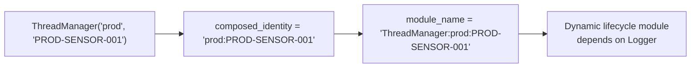

# HEP-CORE-0031: ThreadManager — Per-Owner Bounded-Join Thread Lifecycle

**Status**: Implemented (2026-04-15)
**Layer**: 2 (Service)
**Depends on**: Logger (lifecycle module dependency)

---

## 1. Purpose

`ThreadManager` is a value-composed utility owned by any component that spawns
background threads. It provides:

- Named thread tracking with per-thread join timeouts
- Bounded-join drain in reverse-spawn order (LIFO)
- Dynamic lifecycle module integration (topological teardown ordering)
- Process-wide detach-leak counter for test/exit-code policy

ThreadManager does NOT own the stop signal. The owner component keeps its own
stop atomic/cv and captures it into the thread body lambda. ThreadManager
handles only the join half of the shutdown.

---

## 2. API

> Verified against `src/include/utils/thread_manager.hpp` (2026-04-16).

```cpp
class ThreadManager {
public:
    struct SpawnOptions {
        std::chrono::milliseconds join_timeout{kMidTimeoutMs};  // 5s default
    };

    struct ThreadInfo {
        std::string name;
        bool alive;
        std::chrono::steady_clock::duration elapsed;
        std::chrono::milliseconds join_timeout;
    };

    // Identity required at construction — compile-time enforced (no default ctor).
    ThreadManager(std::string owner_tag,      // class/role: "prod", "ZmqQueue"
                  std::string owner_id,       // instance: uid, queue endpoint
                  std::chrono::milliseconds aggregate_shutdown_timeout
                      = std::chrono::milliseconds{2 * kMidTimeoutMs});
    ~ThreadManager();  // calls drain()

    // Non-copyable, non-movable (fixed identity + lifecycle module).

    bool spawn(const std::string &name, std::function<void()> body, SpawnOptions opts);
    bool spawn(const std::string &name, std::function<void()> body);

    // Per-slot bounded join in reverse-spawn order. Returns detach count.
    std::size_t drain();

    std::size_t detached_count_last_drain() const;
    std::size_t active_count() const;
    std::vector<ThreadInfo> snapshot() const;

    const std::string &owner_tag() const noexcept;
    const std::string &owner_id() const noexcept;
    const std::string &composed_identity() const noexcept;
    std::string module_name() const;

    static std::size_t process_detached_count() noexcept;
    static void reset_process_detached_count_for_testing() noexcept;
};
```

---

## 3. Identity and Lifecycle Module



At construction, ThreadManager registers a dynamic lifecycle module with:
- Name: `"ThreadManager:" + composed_identity`
- Dependency: `"pylabhub::utils::Logger"`
- Startup thunk: no-op (threads spawn lazily via `spawn()`)
- Shutdown thunk: **intentional no-op** (see §5)

---

## 4. drain() — Per-Slot Bounded Join

```
set closing = true  (under lock; rejects new spawn())
move all slots out of Impl (under lock)

for each slot in REVERSE spawn order (LIFO):
    if not joinable → skip (idempotent — already joined/detached)
    poll slot.done flag every 10ms up to slot.join_timeout
    if done → thread.join()    (instant — body already returned)
    else    → thread.detach()  (ERROR log + inc process_detached_count)
```

**`closing` flag**: set under the same lock as the slot-move, so a concurrent
`spawn()` either completes before drain sees its slot (safe — drain joins it),
or observes `closing=true` and rejects (safe — no orphaned joinable thread).

**No cross-cycle gate**: the old `join_all_done` atomic was removed. drain() is
naturally idempotent — `joinable()` returns false after join/detach, so repeat
calls walk an empty slot list and return 0.

---

## 4.1 Teardown Ordering Contract — when callers call `drain()`

ThreadManager's `drain()` is just one of three phases a correct
teardown sequence must run in order.  Callers (role hosts, hub host,
test harnesses) MUST classify each teardown action against this
contract:

```
┌─────────────────────────────────────────────────────────────────┐
│ PHASE A — SIGNAL (pre-drain)                                    │
│ • Set stop flags / `running` = false                            │
│ • Send wake-up signals (signal sockets, condition variables)    │
│ • Do NOT destroy anything that a live thread holds a reference  │
│   to or polls on.                                                │
│ Goal: every spawned thread is now guaranteed to OBSERVE stop    │
│ on its next iteration AND have a path to return.                │
└─────────────────────────────────────────────────────────────────┘
                              ↓
┌─────────────────────────────────────────────────────────────────┐
│ PHASE B — DRAIN (the synchronization point)                     │
│ • `thread_manager().drain()`  ← ThreadManager's contribution    │
│ Goal: when this returns, NO spawned thread is running, AND      │
│ every spawned thread has completed its post-loop store/cleanup. │
└─────────────────────────────────────────────────────────────────┘
                              ↓
┌─────────────────────────────────────────────────────────────────┐
│ PHASE C — DESTROY (post-drain)                                  │
│ • Close sockets the threads were polling.                        │
│ • Reset unique_ptrs holding pImpl that threads were accessing.  │
│ • Run all `*::disconnect()` / `*::reset()` / `*::~Dtor()`        │
│   for resources that ANY drained thread used or depended on.    │
│ Goal: free everything; no thread can possibly touch any         │
│ destroyed resource (proven by Phase B).                          │
└─────────────────────────────────────────────────────────────────┘
```

**Why this matters for `drain()` users.**  ThreadManager's `drain()`
synchronously joins every slot — but only the slots it owns.  If a
thread of interest is owned by a DIFFERENT ThreadManager (or by some
external runtime), this ThreadManager's `drain()` does not know about
it.  Callers who orchestrate cross-object teardown must therefore
classify each lifecycle-managed class and call THE RIGHT
ThreadManager's `drain()` between Phase A and Phase C.

**API classification of the lifecycle-managed classes in this
codebase** (this is the rule that determines where each class's
`stop()` / `disconnect()` / dtor lands in the A/B/C ordering):

| Pattern | Owns its threads? | How its API maps to A/B/C |
|---|---|---|
| **Externally-threaded** | No — caller's ThreadManager owns the thread(s).  Class's `stop()` is fire-and-forget (signal only). | `stop()` = Phase A; `disconnect()`/`reset()` = Phase C.  Drain happens between, in caller's ThreadManager. |
| **Self-threaded** | Yes — class owns a private ThreadManager.  `stop()` self-contains both signal and drain. | `stop()` = leaf call (does A + B internally); callers treat the whole `stop()` as one atomic action.  No external drain needed for this object's threads. |
| **Inline / no thread** | No threads of its own — driven inline by the caller's thread. | `stop()` = Phase C only.  No ordering vs threads needed. |

Examples in the pylabhub codebase:
- `BrokerRequestComm` is **externally-threaded** — its ctrl thread is
  spawned into `RoleAPIBase::thread_manager()`, NOT BRC's own
  ThreadManager.  BRC's `stop()` is therefore a PHASE A signal only.
  BRC's `disconnect()` (sockets) and unique_ptr dtor (pImpl) are
  PHASE C.  See HEP-CORE-0011 §"Role Host worker_main_() Steps" for
  the role-side application.
- `ZmqQueue` is **self-threaded** — owns its own ThreadManager
  internally; `stop()` signals + drains its private threads + closes
  its socket.  Callers treat `stop()` as one atomic step.
- `InboxQueue` is **inline / no thread** — `recv_one()` is called from
  the worker thread that runs `data_loop.hpp`.  No background thread
  exists; `stop()` is just resource cleanup.

**Reviewer rule**.  When adding a new lifecycle-managed class:
1. Determine the class's pattern (externally / self / inline).
2. Document the pattern in the class's docstring.
3. Verify every call site that destroys this class is in PHASE C
   (after the relevant `drain()`).
4. Verify the class's `stop()` semantics match its pattern — never
   give an externally-threaded class a "synchronous stop()" that
   blocks until its (externally-owned) thread joins; that would
   require it to know about the caller's ThreadManager, inverting
   ownership.

The contract was articulated 2026-05-12 in response to a captured
use-after-free race in role-side teardown.  `do_role_teardown`
(role_host_lifecycle.cpp) ran Phase C *before* Phase B: it called
`broker_comm->stop()` (signal), then destroyed `broker_comm_` via
`teardown_infrastructure_`, then finally called
`thread_manager().drain()`.  Between destruction and drain, the
externally-owned ctrl thread could still dereference freed
`BrokerRequestComm.pImpl` at `broker_request_comm.cpp:594`
(`pImpl->poll_loop_running.store(false)`), exposing the race under
concurrent CPU pressure (1/13 reproductions under `ctest -j2`).
Moving drain to between signal and destruction eliminated the race
and made the A→B→C ordering explicit at the role-side call site
(HEP-CORE-0011 §"Role Host worker_main_() Steps").  See
`docs/IMPLEMENTATION_GUIDANCE.md` "Teardown Ordering Contract" for
the cross-cutting reference cited by every HEP that touches role
or hub lifecycle.

---

## 5. Lifecycle Thunk Design

`tm_shutdown()` is a **safe no-op**. Rationale:

1. Teardown ownership is in `~ThreadManager`, not the lifecycle dispatch.
2. The lifecycle's `timedShutdown` wraps the thunk in a spawned thread with
   a timeout + detach fallback. Running `drain()` inside that wrapper would
   double-wrap the already-detaching flow.
3. A prior design set a `join_all_done` flag in the thunk, which caused the
   destructor's drain() to early-return and leave joinable `std::thread`
   objects in the slot vector → `std::terminate` on `~Impl`. This bug is
   the reason the thunk was made a no-op.

Normal teardown sequence:
```
~ThreadManager → drain() → join/detach all slots
              → impl_alive = false
              → UnloadModule (async — lifecycle thread picks it up)
              → tm_shutdown fires → validator sees impl_alive=false → skip
```

---

## 6. Logger NOT Migrated

Logger uses its own `std::thread` + `.join()` in `Impl::shutdown_()`.
Adding a ThreadManager dependency on Logger would create a circular
dependency: ThreadManager's lifecycle module depends on Logger, and
Logger can't depend on ThreadManager (it IS Logger). Accepted as-is.

---

## 7. Adoption

| Component | owner_tag | owner_id | Thread names |
|-----------|-----------|----------|--------------|
| ProducerRoleHost | `"prod"` | role uid | `"worker"`, `"ctrl"` |
| ConsumerRoleHost | `"cons"` | role uid | `"worker"`, `"ctrl"` |
| ProcessorRoleHost | `"proc"` | role uid | `"worker"`, `"ctrl"` |
| ZmqQueue | `"ZmqQueue"` | `instance_id` or `endpoint@ptr` | `"send"` or `"recv"` |

---

## 8. Test Infrastructure

- `ThreadLeakListener` (gtest event listener in `test_entrypoint.cpp`):
  fails any test where `process_detached_count()` grew during the test.
- `run_gtest_worker` / `run_worker_bare` (subprocess test helpers):
  check `process_detached_count()` post-body; return exit code 4 on leak.
- Tests that deliberately exercise timeout-detach call
  `reset_process_detached_count_for_testing()` in TearDown.

---

## 9. Source File Reference

| File | Description |
|------|-------------|
| `src/include/utils/thread_manager.hpp` | Public API |
| `src/utils/service/thread_manager.cpp` | Impl: lifecycle thunks, spawn, drain, counters |
| `tests/test_layer2_service/test_role_data_loop.cpp` | ThreadManagerTest suite (SpawnAndJoin, MultipleThreads, JoinInReverseOrder) |

---

## Document Status

| Version | Date | Change |
|---------|------|--------|
| 1.0 | 2026-04-16 | Initial HEP from tech draft merge. Verified against code. |
