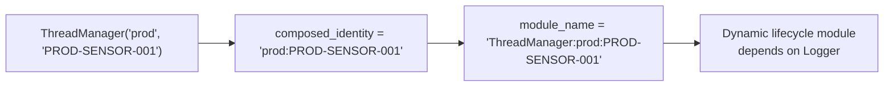
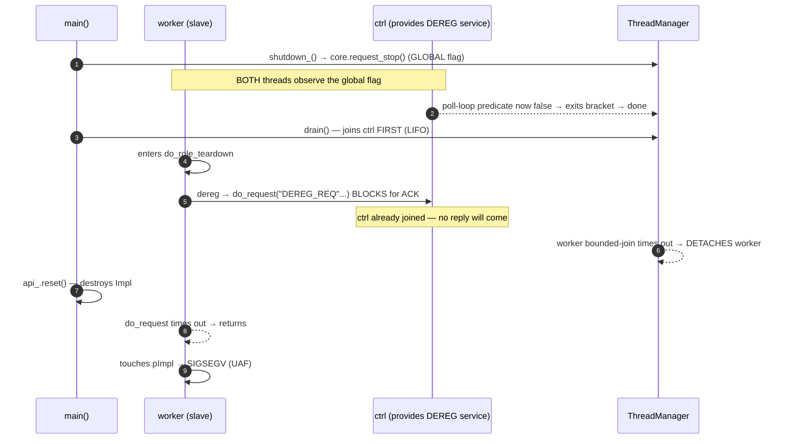

# HEP-CORE-0031: ThreadManager — Per-Owner Bounded-Join Thread Lifecycle

**Status**: Implemented (2026-04-15)
**Layer**: 2 (Service)
**Depends on**: Logger (lifecycle module dependency)

---

## 1. Purpose

`ThreadManager` is a value-composed utility owned by any component that spawns
background threads. It provides:

- Named thread tracking with per-thread join timeouts
- Bounded-join drain in reverse-spawn order (LIFO)
- Dynamic lifecycle module integration (topological teardown ordering)
- Process-wide detach-leak counter for test/exit-code policy

ThreadManager does NOT own the stop signal. The owner component keeps its own
stop atomic/cv and captures it into the thread body lambda. ThreadManager
handles only the join half of the shutdown.

---

## 2. API

> Verified against `src/include/utils/thread_manager.hpp`
> (2026-05-14 — post-MD1 / MD1.5).  See §4.1.2 for the full
> `SlotContext` surface (two co-equal APIs the thread body uses
> to declare quiescence to the manager).

> **Per-role worker threads belong here.**  Role-scope long-running
> threads — the script DataLoop, the BRC poll, and (HEP-CORE-0041
> 1i-mig) the SHM `ShmAttachOrchestrator` accept loop — are owned by
> the role host's own `ThreadManager` instance.  The Shutdown
> Contract in §4.1 orders their teardown so each thread stops before
> its dependencies are destroyed.
>
> **Three thread categories — don't conflate.**
>
> 1. **Role-host ThreadManager** (this callout): per-role control-plane
>    + worker threads listed above.  One `ThreadManager` per role host.
> 2. **Queue-owned ThreadManager** (§4.3.2): data-plane transport queues
>    (`ZmqQueue` pull-side poll, push-side worker) own a SEPARATE
>    `ThreadManager` instance per queue.  They're not on the role host's
>    TM because the queue's lifetime + drain semantics differ from the
>    role's.  Don't move data-plane queue threads up to the role TM.
> 3. **Process-singleton lifecycle modules**: infrastructure shared
>    across all roles in the process — `Logger`, `KeyStore`,
>    `ZapPumpThread`.  Go in lifecycle modules (HEP-CORE-0001), NOT
>    a `ThreadManager`.  Different shape, different layer.

```cpp
class ThreadManager {
public:
    // Per-slot context handle passed into the thread body — see §4.1.2.
    // Exposes two co-equal synchronization APIs (pick one per thread,
    // do not mix): the transactional bracket (`with_active_loop`) and
    // the monotonic mark (`mark_active_loop_exited`).
    struct SlotContext;  // full surface in §4.1.2

    struct SpawnOptions {
        std::chrono::milliseconds join_timeout{kMidTimeoutMs};  // 5s default

        /// Master/peer shutdown ordering (HEP-CORE-0031 §4.2 — added
        /// post-MD1.5).  At most one master per ThreadManager.  When
        /// set, the slot is NOT signaled by `request_shutdown_all()`;
        /// drain() waits for every peer's `done` first, then signals
        /// the master, then waits for its `done`, then joins everyone.
        bool is_master{false};
    };

    struct ThreadInfo {
        std::string name;
        bool alive;
        std::chrono::steady_clock::duration elapsed;
        std::chrono::milliseconds join_timeout;
    };

    // Identity required at construction — compile-time enforced (no default ctor).
    ThreadManager(std::string owner_tag,      // class/role: "prod", "ZmqQueue"
                  std::string owner_id,       // instance: uid, queue endpoint
                  std::chrono::milliseconds aggregate_shutdown_timeout
                      = std::chrono::milliseconds{2 * kMidTimeoutMs});
    ~ThreadManager();  // calls drain()

    // Non-copyable, non-movable (fixed identity + lifecycle module).

    // Spawn overloads.  The SlotContext-taking overload is the
    // post-MD1 form — body receives a per-slot context for the
    // shutdown-contract APIs (§4.1.2).  The legacy std::function<void()>
    // overload is preserved for callers that don't need the contract.
    bool spawn(const std::string &name,
               std::function<void(SlotContext &)> body,
               SpawnOptions opts = {});
    bool spawn(const std::string &name,
               std::function<void()> body,
               SpawnOptions opts = {});

    // Per-slot bounded join in reverse-spawn order.  Two-stage wait
    // per §4.1.4 (Stage 1: `active_loop_depth == 0`; Stage 2: `done`).
    // Returns detach count.
    std::size_t drain();

    // Targeted single-slot join — same two-stage wait as drain(),
    // useful for dependency-ordered teardown.
    [[nodiscard]] bool join_named(std::string_view name) noexcept;

    // ── Shutdown-contract API (§4.1) ──────────────────────────────

    // Per-slot shutdown signal.  Flips the named slot's
    // `shutdown_requested` flag — observable thread-side via
    // `ctx.shutdown_requested()` and used by `with_active_loop` as
    // the skip-on-entry condition.  Does NOT wake blocked threads
    // (caller must pair with a class-level wake-up signal when the
    // thread might be in a blocking poll/wait).
    [[nodiscard]] bool request_shutdown(std::string_view name) noexcept;

    // Manager-wide shutdown signal.  Signals every PEER slot's
    // `shutdown_requested` (skips the master, if any — see §4.2).
    // Sets the manager's `closing` flag (rejects new spawns).
    // Returns count of peers newly signaled.  Does NOT wait —
    // pair with `wait_for_quiescence` and/or `drain()`.
    std::size_t request_shutdown_all() noexcept;

    // Bracket-API caller-side wait (§4.1.2).  Waits for every spawned
    // slot's `active_loop_depth` to drop to 0 (i.e., every thread is
    // outside its `with_active_loop` body).  Auto-excludes the
    // calling thread.  Returns the count of slots that did NOT reach
    // quiescence within the timeout (0 = success).
    [[nodiscard]] std::size_t wait_for_quiescence(
        std::chrono::milliseconds timeout) noexcept;

    // Flag-API caller-side wait (§4.1.2).  Waits for the named slot's
    // `active_loop_exited` flag (set either explicitly by the thread
    // via `mark_active_loop_exited()` or by the spawn wrapper as a
    // safety net at body return).  Returns true on success, false on
    // timeout or unknown name.
    [[nodiscard]] bool is_active_loop_exited(
        std::string_view name) const noexcept;
    [[nodiscard]] bool wait_for_active_loop_exit(
        std::string_view name,
        std::chrono::milliseconds timeout) noexcept;

    // ── Diagnostics ───────────────────────────────────────────────

    std::size_t detached_count_last_drain() const;
    [[nodiscard]] bool all_detached_done() const;  // §"Drain diagnostics"
    std::size_t active_count() const;
    std::vector<ThreadInfo> snapshot() const;

    const std::string &owner_tag() const noexcept;
    const std::string &owner_id() const noexcept;
    const std::string &composed_identity() const noexcept;
    std::string module_name() const;

    static std::size_t process_detached_count() noexcept;
    static void reset_process_detached_count_for_testing() noexcept;
};
```

---

## 3. Identity and Lifecycle Module



At construction, ThreadManager registers a dynamic lifecycle module with:
- Name: `"ThreadManager:" + composed_identity`
- Dependency: `"pylabhub::utils::Logger"`
- Startup thunk: no-op (threads spawn lazily via `spawn()`)
- Shutdown thunk: **intentional no-op** (see §5)

---

## 4. drain() — Per-Slot Bounded Join

```
set closing = true  (under lock; rejects new spawn())
move all slots out of Impl (under lock)

for each slot in REVERSE spawn order (LIFO):
    if not joinable → skip (idempotent — already joined/detached)
    poll slot.done flag every 10ms up to slot.join_timeout
    if done → thread.join()    (instant — body already returned)
    else    → thread.detach()  (ERROR log + inc process_detached_count)
```

**`closing` flag**: set under the same lock as the slot-move, so a concurrent
`spawn()` either completes before drain sees its slot (safe — drain joins it),
or observes `closing=true` and rejects (safe — no orphaned joinable thread).

**No cross-cycle gate**: the old `join_all_done` atomic was removed. drain() is
naturally idempotent — `joinable()` returns false after join/detach, so repeat
calls walk an empty slot list and return 0.

**Single coordinated drain per owner.** Each ThreadManager has ONE owner
that drives the coordinated drain on shutdown.  Managed threads (peers
AND the master) coordinate by *signal/flag* — never by calling drain()
themselves.  Concrete sites:

| Owner | Coordinated drain | Thread |
|---|---|---|
| `RoleAPIBase` (role hosts) | `EngineHost<RoleAPIBase>::shutdown_()` | MAIN |
| `HubAPI` (hub host) | `HubHost::shutdown()` + `HubHost::startup()` rollback | MAIN |
| `ZmqQueue` | `ZmqQueue::stop()` | caller of stop() |
| direct (tests, etc.) | `~ThreadManager()` safety net | owner |

A managed thread that calls `drain()` on its own manager would walk its
own slot, find `done` still false (the wrapper sets it AFTER the body
returns), time out, **detach itself**, and bump
`process_detached_count`.  This was bug L1 — `do_role_teardown` Step 14
called `api.thread_manager().drain()` from inside the worker thread,
producing a deterministic self-detach.  Fixed by deleting the call;
worker just returns and the MAIN thread's `EngineHost::shutdown_()`
performs the single drain.

---

## 4.1 Thread Shutdown Contract

> **The contract (added 2026-05-12; bracket+flag co-equal APIs
> documented 2026-05-14).**
>
> **For every managed thread:**
> 1. The thread SHOULD minimize its touch on `pImpl` / shared
>    resources while running.
> 2. On shutdown, the thread SHOULD exit its critical region quickly.
> 3. The thread MUST declare quiescence to ThreadManager when it
>    leaves its critical region.  Two equivalent declarations exist
>    (see §4.1.2): the **transactional bracket** (RAII —
>    quiescence is implicit when the `with_active_loop` body
>    returns) or the **monotonic mark** (explicit —
>    `mark_active_loop_exited()` is called at the chosen exit
>    point).  A thread picks ONE API; the two MUST NOT be mixed on
>    the same thread (they track independent per-slot atomics).
> 4. After quiescence is declared, the thread MUST NOT touch any
>    `pImpl` or other shared resource the teardown caller might
>    destroy.  Only its own stack frame and its
>    `ThreadManager::SlotContext` are accessible from that point on.
>
> **For the teardown caller:**
> A. Honor each thread's quiescence declaration with a bounded
>    timeout: `wait_for_quiescence(timeout)` for threads using the
>    bracket API, `wait_for_active_loop_exit(name, timeout)` for
>    threads using the flag API.  Destroy resources the thread had
>    been using ONLY after that wait returns.
> B. Once all quiescence declarations are observed (or their
>    timeouts elapsed), join the threads (via `drain()` or
>    `join_named()`) and proceed with destruction of the rest of
>    the lifecycle objects.

The rest of §4.1 elaborates this contract — but the four
thread-side rules and two caller-side steps above are the
load-bearing specification.  Without rule 4 (no pImpl access after
quiescence is declared), no caller ordering can fix the race;
every caller becomes a hostage to the thread's implicit "extra"
pImpl access.  With rule 4 plus the synchronization primitives in
§4.1.2, the caller can deterministically honor the contract.

### 4.1.0 Fallback callback-safety beacon (V1 audit, 2026-05-18)

The bracket + bounded `wait_for_quiescence` contract above is the
**primary** protection against use-after-free during teardown.  In
practice it covers every well-behaved thread: the thread enters its
bracket, the teardown caller signals shutdown, the thread leaves
its bracket promptly, the wait returns, destruction proceeds.  No
race.

The contract has **one operational failure mode**: the bounded
timeout on `wait_for_quiescence`.  If a managed thread is stuck
(network jam, kernel scheduling stall, debugger paused, etc.) and
fails to exit its bracket within the timeout, the teardown caller
proceeds to destruction anyway — a deliberate choice because we
never want teardown to block indefinitely on a truly-dead thread.
If that stuck thread later wakes up and fires a callback that
touches the destroyed `pImpl` resources, we get a use-after-free.

For the **role-side specifically**, V1 (2026-05-18) adds an
explicit fallback beacon — a one-way atomic latch named
`context_valid_` on `RoleHostCore` that callbacks check before
touching role-side state.  The full discipline lives in the class
header docstring of `src/include/utils/role_host_core.hpp` ("Flag
contract" block); the role-side teardown sequence (in
`role_api_base.cpp::stop_handler_threads`) flips the beacon to
`false` at Phase 3a — AFTER `wait_for_quiescence` returned and
BEFORE Phase 4's destructive work.  Every ctrl-thread callback
(`on_notification`, `on_hub_dead`, the heartbeat periodic-tick)
opens with `if (!core->context_valid()) bail` and exits with a
`LOGGER_WARN` instead of dereferencing.

This is a **fallback**, not a replacement.  In the normal case
(wait returns successfully), the bracket already guaranteed no
callback is in flight — the beacon check is irrelevant.  In the
slow-waker case (wait timed out), the beacon converts the failure
mode from a use-after-free crash to a logged warning.

The beacon does **not** close every race: a callback that has
already passed the gate and is mid-body when the beacon is flipped
will still proceed into the destroyed memory.  The window is
microseconds; the slow-waker scenario is seconds.  Closing the
window entirely would require reference-counted ownership of the
context — a structural change deferred unless the residual risk
ever bites.

The two mechanisms are **layered, not redundant**:

| Mechanism | Protects against | Scope | Failure mode |
|---|---|---|---|
| **Bracket + `wait_for_quiescence`** (primary) | A callback in-flight during teardown destruction | Generic — every ThreadManager-managed thread | Timeout can fire if a thread is truly stuck → no protection past the timeout |
| **`context_valid_` beacon** (fallback) | A late-fired callback after the wait timed out | Role-side only (callbacks gating on the beacon) | Microsecond gap between check and first dereference; rare-window crash possible |

A thread that respects the contract (rule 4 — no pImpl access
after quiescence is declared) is protected by the bracket alone.
The beacon exists for the rare ctrl-thread path that fires a
callback **outside** its bracket — specifically, the ZMTP socket
monitor's hub-dead callback, which fires asynchronously from
inside the BRC's poll loop.  The callback IS inside the bracket
during normal operation; the beacon's job is to handle the
abnormal case where the bracket was forcibly torn down past the
timeout.

### 4.1.1 Per-thread contracts

Every long-running thread declares (in code or by structural
property) which shared state it depends on during its own
shutdown:

- **Stop-observation point**: the first instant the thread
  notices shutdown is requested.  This is typically a loop
  predicate checking an atomic `stop_requested` flag plus a
  wake-up via a signal socket or condition variable.  The
  bracket API exposes this directly — the per-slot
  `shutdown_requested` flag is observable via
  `ctx.shutdown_requested()`, and `with_active_loop` itself
  skips the body if the flag is already set at entry.  Flag-API
  users source their own signal.
- **Critical-region exit point**: the moment the thread leaves
  the scope where it may touch destroyable shared state — the
  bracket body's closing brace, or the explicit
  `mark_active_loop_exited()` call site.  After this, the thread
  MUST be quiescent w.r.t. shared state — no further pImpl
  reads/writes, no further socket operations on a poll target
  the caller might close.
- **Body-return point**: the moment the thread's spawn-body
  lambda itself returns.  Always ≥ critical-region exit (often
  identical; can be later if the body does
  thread-local-only post-quiescence work).  The spawn wrapper
  sets the slot's `done` flag here; `drain()` and `join_named()`
  join on this signal in their second stage.

### 4.1.2 `SlotContext` — two co-equal synchronization APIs

`ThreadManager::spawn` passes a `SlotContext &` reference into
the spawned body as its first parameter.  The slot exposes TWO
synchronization primitives — both first-class, both backed by
per-slot atomics owned by `shared_ptr` so they survive even if the
slot is later detached and the manager destroyed:

| | Bracket API (default-safe) | Flag API (flexible) |
|---|---|---|
| Thread-side declaration | `ctx.with_active_loop(body)` RAII scope | `ctx.mark_active_loop_exited()` (one-shot) |
| Backing per-slot atomic | `active_loop_depth` (counter, default 0) | `active_loop_exited` (bool, default false) |
| Caller-side wait | `tm.wait_for_quiescence(timeout)` (all slots) | `tm.wait_for_active_loop_exit(name, timeout)` (one slot) |
| Skip-on-shutdown | Body skipped automatically if `shutdown_requested` is true at entry | Caller-controlled — thread must check separately |
| Nested critical regions | Supported (counter increments per frame) | Not supported (flag is monotonic) |
| Exception-path safety | RAII decrement on throw — quiescence reached automatically | Thread must place mark in a `scope_guard`/finally to guarantee on-error |
| Compile-time enforcement of rule 4 | YES — pImpl accesses live INSIDE the lambda; after lambda returns they are physically out of reach | NO — author must obey rule 4 manually |

```cpp
// API surface (verbatim from src/include/utils/thread_manager.hpp)

struct ThreadManager::SlotContext {
    /// Transactional bracket — RAII; counter-based (nestable); body
    /// skipped if per-slot shutdown_requested already set.
    template <typename F>
    void with_active_loop(F &&body);

    /// Thread-side poll for the per-slot shutdown_requested flag.
    /// Useful inside long-running loops that want to bail out
    /// promptly without sourcing a separate class-level stop signal.
    [[nodiscard]] bool shutdown_requested() const noexcept;

    /// Monotonic mark — one-shot; flag-based; explicit at the
    /// thread's chosen exit point.  Do not mix with `with_active_loop`
    /// on the same thread.
    void mark_active_loop_exited() noexcept;
};

class ThreadManager {
public:
    bool spawn(const std::string &name,
               std::function<void(SlotContext &)> body,
               SpawnOptions opts = {});

    // Caller-side queries.  Both auto-exclude the calling thread
    // (prevents self-deadlock when the calling thread is itself a
    // spawned worker).
    [[nodiscard]] std::size_t wait_for_quiescence(
        std::chrono::milliseconds timeout) noexcept;
    [[nodiscard]] bool        wait_for_active_loop_exit(
        std::string_view name,
        std::chrono::milliseconds timeout) noexcept;

    // Independent of the per-slot primitives — manager-wide.
    std::size_t request_shutdown_all() noexcept;
};
```

**Auto-flip safety net (flag API only).**  The spawn wrapper
auto-flips `active_loop_exited` true when the body returns, even if
the thread never called `mark_active_loop_exited()` explicitly.
This is purely a safety net for old-style spawns and unit-test
harnesses — production code using the flag API SHOULD still call
`mark_active_loop_exited()` explicitly at the critical-region exit
point, otherwise the caller's `wait_for_active_loop_exit` will wait
all the way until body return (which may be later than the actual
critical-region exit).

**Skip-on-shutdown asymmetry.**  `with_active_loop` checks
`shutdown_requested` at entry and skips the body if already set —
the thread never enters the critical region, never touches pImpl,
and `active_loop_depth` stays at 0.  This makes the bracket
default-safe: a teardown that happens BEFORE the thread reaches
its first bracket is handled automatically.  The flag API has no
equivalent automatic guard.

**Distinction from the existing `done` flag:**

| Signal | Who sets it | When | What it means |
|---|---|---|---|
| `done` | Spawn wrapper | After body returns | Thread is gone; `std::thread::join()` returns immediately |
| `active_loop_depth = 0` (bracket API) | RAII guard inside `with_active_loop` | After body of `with_active_loop` returns (including throw) | Slot is outside every critical-region bracket frame; depth-0 is the quiescent state.  Reachable multiple times during a thread's lifetime. |
| `active_loop_exited` (flag API) | Thread, via `mark_active_loop_exited()`; or spawn wrapper as safety net | At the thread's chosen exit point (or body return) | One-shot declaration of quiescence.  Reachable exactly once — afterwards the thread MUST NOT re-enter the critical region. |

### 4.1.3 Choosing between bracket and flag — flexibility with risk

The two APIs are NOT a recommendation/fallback pair.  Both serve
real cases.  Pick by structure:

**Use the bracket API when:**
- The whole critical region fits inside a lambda scope (the
  common case for long-running loops: poll loop, message-pump
  loop, work-stealing loop).
- You want RAII to handle exit on the exception path
  automatically.
- You may have nested critical regions on the same thread —
  bracket's counter handles this; flag does not.
- You want the body skipped automatically if shutdown was
  requested before entry.

**Use the flag API when:**
- The critical region's exit point is decided BY THE THREAD AT
  RUNTIME and cannot be expressed as a lexical scope (e.g., the
  thread does work A that touches pImpl, then work B that does
  not, then exits — A and B span branches/loops/calls that don't
  fold into one bracket).
- You need to declare quiescence WITHOUT waiting for the body
  itself to return (the thread does post-quiescence work that may
  take measurable time — flushing thread-local diagnostics,
  finalising a worker-local cache, signing off observability
  hooks — and you want the teardown caller to proceed in
  parallel).
- An external lifecycle constraint forces the synchronization
  signal to be a one-shot atomic flag rather than a transactional
  counter (e.g., a non-pylabhub adapter you're wrapping).

**Risks the flag-API user accepts** (not enforced by the type
system or the compiler):

1. **Exception paths.**  If the thread takes an exception between
   "stop-observation" and `mark_active_loop_exited()`, the
   explicit flag flip never happens.  The spawn-wrapper safety
   net catches this AT BODY-RETURN time, but a caller's
   `wait_for_active_loop_exit` may have already moved on (it
   was waiting on the explicit mark that never came).
   Mitigation: put the call inside a `pylabhub::basics::scope_guard`
   or equivalent so it fires on both success and throw paths.
2. **No compile-time enforcement of "don't touch pImpl after the
   mark."**  The bracket API enforces this via lexical scope (the
   pImpl accesses physically live INSIDE the lambda; after the
   lambda returns they are out of reach).  The flag API doesn't —
   nothing prevents writing
   `ctx.mark_active_loop_exited(); pImpl->foo = bar;`.  The
   contract relies on the thread author obeying rule 4 manually.
   Code review and lint are the only enforcement.
3. **Race-window expansion at startup.**  Bracket: body is
   skipped if shutdown was requested BEFORE entry (the per-slot
   `shutdown_requested` check at `with_active_loop` entry handles
   this automatically).  Flag: there's no automatic skip — if
   shutdown fires after spawn but before the thread's first
   stop-check, the thread runs full body, touches pImpl, and the
   caller's `wait_for_active_loop_exit` waits until the thread
   voluntarily marks.  The thread must build its own
   shutdown-check at the top of its body.
4. **Re-entry is forbidden by construction.**  Once
   `mark_active_loop_exited` is called, the slot is permanently
   marked quiescent for that thread — any subsequent pImpl
   access is a contract violation even if the thread "could
   have" re-entered the critical region.  Bracket's counter
   handles re-entry naturally (depth increments per frame); flag
   does not.

If you can't articulate which of these risks you're accepting,
default to the bracket API.

### 4.1.4 `drain()` / `join_named()` two-stage wait

`drain()` and `join_named()` synchronize on `done` (body-return)
but use `active_loop_depth` (the bracket counter) as an
intermediate landmark:

- **Two-stage wait.**  The per-slot `join_timeout` is split into
  two halves.  Stage 1: wait for `active_loop_depth == 0`.
  Stage 2: wait for `done == true`.
- **Detach-timeout diagnostics.**  If the join times out, the
  ERROR log distinguishes **"still in active loop"** (Stage 1
  timed out — thread is still inside a `with_active_loop` body)
  from **"stuck in post-loop cleanup"** (Stage 1 succeeded but
  Stage 2 timed out — body left every bracket frame but hasn't
  returned).
- **Threads that don't use the bracket API.**  `active_loop_depth`
  defaults to 0 and stays there — Stage 1 passes immediately,
  Stage 2 owns the full timeout budget.  Flag-API users and
  bracket-less threads pay no Stage 1 penalty.
- **Fast path.**  If `active_loop_depth` is already 0 when drain
  starts polling a slot, drain skips the 10 ms polling cadence.

Note: `drain()` does NOT consult `active_loop_exited`.  The flag
API's caller-side wait is `wait_for_active_loop_exit(name,
timeout)`, invoked separately BEFORE drain by the teardown caller
that wants to honor the contract.  After that wait returns, drain
runs as usual to join the thread.

### 4.1.5 Per-class pattern classification

This codebase has three patterns for lifecycle-managed classes that
own or are owned by threads:

| Pattern | Owns its threads? | How its API maps to the contract |
|---|---|---|
| **Externally-threaded** | No — caller's ThreadManager owns the thread(s).  Class's `stop()` is a fire-and-forget signal. | The CALLER chooses bracket vs flag at the spawn site.  Class's `stop()` flips a class-level stop flag and wakes the thread.  Class's `disconnect()` / `reset()` are destructive operations that the teardown caller delays until quiescence is observed via the chosen API. |
| **Self-threaded** | Yes — class owns a private ThreadManager.  `stop()` is self-contained (signal + wait + drain of own threads). | The class chooses bracket vs flag internally.  External callers treat the whole `stop()` as one atomic step; the contract is internal. |
| **Inline / no thread** | No threads of its own — driven inline by the caller's thread. | No shutdown contract because there is no separate thread.  Resource cleanup happens whenever the caller chooses. |

Examples in the pylabhub codebase:

- `BrokerRequestComm` is **externally-threaded using the bracket
  API**.  Its ctrl thread is spawned into
  `RoleAPIBase::thread_manager()`, NOT BRC's own ThreadManager.
  `BRC::stop()` is therefore a fire-and-forget signal that flips
  `stop_requested`.  `BRC::run_poll_loop` takes a plain
  `std::function<bool()>` (NOT `SlotContext &`); the spawn site
  in `src/utils/service/role_api_base.cpp:692-733` wraps the
  whole `bc->run_poll_loop(...)` call inside
  `ctx.with_active_loop(...)`.  Local captures of `bc / eng /
  core` are taken BEFORE the bracket so post-bracket code can
  log/etc. without touching pImpl.  The teardown caller
  (`do_role_teardown` Step 12.5,
  `src/utils/service/role_host_lifecycle.cpp:55-73`) calls
  `wait_for_quiescence(kMidTimeoutMs)` before allowing Step 13's
  `teardown_infrastructure_` to destroy `broker_comm_`.
- `ZmqQueue` is **self-threaded**.  Owns its own ThreadManager;
  its recv/send threads run inside the queue's `Impl` and are
  joined by the queue's own `stop()`.  Callers treat `stop()`
  as one atomic step; the contract is internal.
- `InboxQueue` is **inline / no thread**.  `recv_one()` is called
  from the worker thread that runs `data_loop.hpp`.  No background
  thread exists; `stop()` is just resource cleanup, ordered by the
  caller's natural code flow.

### 4.1.6 Historical context

The contract was articulated 2026-05-12 in response to a captured
use-after-free race in role-side teardown.  `do_role_teardown`
(`role_host_lifecycle.cpp`) signaled `BrokerRequestComm::stop()`,
then immediately ran `teardown_infrastructure_` which destroyed
`broker_comm_`, before the BRC ctrl thread had finished its
post-loop work.  The post-loop store at
`broker_request_comm.cpp:594` dereferenced freed `pImpl` →
SIGSEGV (1/13 reproductions under `ctest -j2`).

The fix landed across commits `42092cb` through `4a5347c` and uses
the **bracket API**:

1. The thread's body acknowledged rule 4 explicitly — the
   post-loop dead pImpl writes (`pImpl->poll_loop_running.store`
   and `pImpl->active_loop_periodic_tasks = nullptr`) were
   removed from `BRC::run_poll_loop`.  See the comment at
   `src/utils/network_comm/broker_request_comm.cpp:592-608`.
2. ThreadManager gained the `active_loop_depth` counter + the
   `with_active_loop` template (and the parallel
   `active_loop_exited` flag API for cases the bracket can't
   fit).
3. The teardown caller wrapped the ctrl-thread spawn in
   `ctx.with_active_loop(...)` (the bracket entry point) and
   added Step 12.5 — `request_shutdown_all()` +
   `wait_for_quiescence(kMidTimeoutMs)` — between Step 12
   (signal stop) and Step 13 (destroy infrastructure).
   `PlhHubCliTest.RoundTrip_PlhHubKeygenAndRunPlhRoleRegisters`
   passes 5/5 solo after the fix; the parallel race is gone.

The historical placement of `teardown_infrastructure_` (BEFORE
the final `drain()` — see HEP-CORE-0011 §"Role Host
worker_main_() Steps") is deliberate and unchanged: it lets the
role host release its resources before potentially-hanging joins,
leaving partial cleanup possible if a thread eventually wedges
and is detached.

### 4.1.7 Reviewer rules

When adding a new managed thread:

1. Choose whether the class is externally-threaded,
   self-threaded, or inline (per §4.1.5).  Document the choice in
   the class's docstring.
2. Choose bracket vs flag (per §4.1.3).  If unsure, default to
   bracket.  Document the choice in the class's docstring.
3. **Bracket users**: wrap the critical region in
   `ctx.with_active_loop(...)` at the spawn site or inside the
   thread body — wherever the lexical scope cleanly bounds pImpl
   access.  Take local captures of any pImpl-borrowed pointers
   BEFORE the bracket if you need to log or run safe-after-
   quiescence code post-bracket.  Use `ctx.shutdown_requested()`
   as the loop predicate (not a class-level flag) so the
   automatic skip-on-shutdown at bracket entry works.
4. **Flag users**: call `ctx.mark_active_loop_exited()` at the
   chosen critical-region exit point.  Wrap the call in a
   `pylabhub::basics::scope_guard` (or equivalent) so it fires on
   both success and exception paths.  Audit every pImpl-touching
   site after the call site — must be none.  Add an explicit
   shutdown-check at the top of the body (the flag API has no
   automatic skip-on-shutdown).
5. At every site that destroys this class while a thread is
   potentially still running, verify the contract is honored:
   either via `wait_for_quiescence` (bracket users) or
   `wait_for_active_loop_exit` (flag users) before the destroy
   call.  Document the synchronization point at the destroy site
   so future maintainers don't accidentally remove it.

When adding a new step to an existing teardown sequence:

1. Identify which thread's contract the step interacts with and
   which API that thread uses.
2. If the step destroys state any thread was touching, the step
   MUST run AFTER that thread's quiescence is observed (via the
   thread's chosen wait API).
3. Reviewers reject steps that destroy state without an upstream
   `wait_for_quiescence` / `wait_for_active_loop_exit`
   synchronization.

---

## 4.2 Master / Peer Shutdown Ordering (post-MD1.5)

### 4.2.1 What the bug looked like

`PlhHubCliTest.RoundTrip_PlhHubKeygenAndRunPlhRoleRegisters` failed
**5/5 deterministic** on `feature/lua-role-support` after the MD1
contract landed.  Exit code 139 (SIGSEGV) on `SIGTERM` shutdown.

The gdb backtrace (libc `backtrace_symbols_fd`, 2026-05-13) pinned
the fault to **`pthread_mutex_lock+0x4` inside
`RoleAPIBase::deregister_from_broker`**.  In-source breadcrumbs that
printed `this`, `pImpl.get()`, and `&shared.mu` at every step then
showed the `pImpl` value flipping mid-call — `~RoleAPIBase` fired
**while the worker thread was inside `deregister_from_broker`**.
That's not a field race; it's the **entire `RoleAPIBase` being
destroyed under a thread still calling methods on it**.

### 4.2.2 The sequence that produced the UAF



The three actors had incompatible assumptions:

| Actor | Assumption | Reality |
|---|---|---|
| `EngineHost::shutdown_()` | After `drain()` returns, no thread holds `api_` | drain detached one on timeout — that thread still holds `api_` |
| `do_role_teardown` Step 9a | Ctrl is alive (we haven't called `bc->stop()` yet) | Outer drain already joined ctrl |
| `ThreadManager::drain()` | LIFO is the right order | Doesn't know worker→ctrl is a producer/consumer pair at dereg time |

### 4.2.3 The fix — master/peer ordering

`SpawnOptions::is_master = true` marks ONE slot per ThreadManager as
the **master**: the thread whose lifetime must envelope every peer's
runtime.

`request_shutdown_all()` signals **peers only** — master untouched.

`drain()` runs four phases when a master is present:

1. **Signal peers** (per-slot `shutdown_requested`).
2. **Wait for every peer's `done`**, bounded by per-slot `join_timeout`.
3. **Signal master** (per-slot `shutdown_requested`).
4. **Per-slot bounded join** in LIFO (same algorithm as the
   no-master path).

The master's body **must consult `ctx.shutdown_requested()`** as its
exit condition, NOT a globally-shared stop flag.  A global flag fires
too early (before peers are done with the master) and re-introduces
this bug class.

`EngineHost::shutdown_()` also gained a **detach safety gate**: if
`drain()` reports any detached threads, `api_` is **leaked**
(`api_.release()`) rather than reset — the detached thread still
owns pointers into `*api_`, and resetting would re-trigger the same
UAF.  OS reaps the detached thread + its allocations at process exit.

### 4.2.4 Role host wiring (the canonical example)

In `RoleAPIBase::start_handler_threads` the FIRST handler-ctrl
thread is marked master; every subsequent one is a peer.  All N
spawns happen from the single call site so the §4.2.1 single-master
rule is preserved automatically:

```cpp
// Real implementation (role_api_base.cpp ~1565-1605): a master_spawned
// flag flips after the first spawn so the same "first is master" rule
// is preserved; otherwise structurally identical.
for (size_t i = 0; i < handler.connections().size(); ++i) {
    const std::string slot_name = "handler_ctrl_" + std::to_string(i);
    ThreadManager::SpawnOptions opts;
    opts.is_master = (i == 0);          // first only
    auto *bc   = pImpl->handler->connections()[i].brc.get();
    auto *core = pImpl->core;            // `core` is already a pointer
    thread_manager().spawn(slot_name,
        [bc, core](ThreadManager::SlotContext &ctx) {
            ...
            ctx.with_active_loop([&] {
                bc->run_poll_loop([core, &ctx] {
                    return core->is_running() && !ctx.shutdown_requested();
                });
            });
            ...
        },
        opts);
}
```

The poll-loop predicate consults `ctx.shutdown_requested()` —
ThreadManager raises it only after peers (worker, peer handler-ctrl
threads) are done.  `core->is_running()` is kept because the worker
still flips it in `do_role_teardown` Step 9.4 as a fast-path wake-up
(alongside `bc->stop()`); the per-slot signal alone wouldn't unblock
a thread parked in `zmq_poll`.

Single-hub roles spawn one thread (`handler_ctrl_0` = master).
Dual-hub processor spawns two (`handler_ctrl_0` master,
`handler_ctrl_1` peer); both have peer ordering vs the worker, so
shutdown drains worker first → peer `handler_ctrl_1` → master
`handler_ctrl_0` last.

### 4.2.5 Constraints and trade-offs

- **`with_active_loop` uses a counter, not a flag** — the per-slot
  state that `wait_for_quiescence` polls is `active_loop_depth`, an
  `atomic<int>` that the bracket increments on entry and decrements
  on exit (RAII).  The slot is considered "in active loop" iff
  `depth > 0`.  This lets nested `with_active_loop` calls on the
  same `SlotContext` compose safely: an inner exit only decrements
  the depth; the outer frame's exit drives it back to 0.  A bool
  flag would have allowed an inner RAII reset to clear the value
  while an outer body was still running, and a concurrent
  `wait_for_quiescence` would have mis-reported quiescence.
- **At most one master per manager** — enforced at spawn time;
  second master spawn is rejected with ERROR.  Two masters have no
  defined drain order.
- **Per-slot `join_timeout` still bounds the wait** — Phase 2 waits
  per-peer up to that timeout, then proceeds.  If a peer doesn't
  reach `done`, Phase 4 still detaches it; the safety gate in
  `EngineHost::shutdown_()` then leaks `api_` rather than UAF.
- **No master = unchanged behavior** — drain takes the same LIFO path
  it always did.  Existing ThreadManager users (ZmqQueue, future
  helpers) require no migration unless they exhibit the
  producer/consumer-at-teardown dependency.
- **The mutex inside `RoleAPIBase::Impl::Shared`** (the M2.5-style
  controlled-access struct introduced in the same wave for the
  `registered_*_channel` fields) is necessary even with master/peer
  ordering — the two fixes address different bug classes:
  - Master/peer = lifetime ordering between threads
  - `Shared` mutex = data-race protection for fields that are
    legitimately accessed across threads (heartbeat tick reads
    `pImpl->{out_channel, channel, uid}` from ctrl)

---

## 4.3 Process Thread Inventory

Authoritative inventory of every thread that exists in a running
pylabhub process, who spawns it, who owns it, and which §4.1 / §4.2
contract clause governs its shutdown.  Maintained against actual
source — grep-verified at every edit.  When a phase change creates
or retires a thread, this section MUST be updated in the same
commit.

This section exists because the thread set has grown organically
(MD1 + MD1.5 closures added master/peer ordering; Wave-B M4
scales the single ctrl thread to N).  Without an explicit
inventory, future changes drift away from the master/peer
contract and re-expose UAF classes the team has already closed.

### 4.3.1 Role host process — mandatory threads

Every role host process (plh_role binary) carries these three
threads regardless of transport or role kind.  All three live
in the role's own `pylabhub::utils::ThreadManager` instance,
owned by `RoleAPIBase::Impl::thread_mgr_` (see
`role_api_base.cpp::Impl` ctor — created eagerly from
`(role_tag, uid)`).

| Slot name           | Spawned by                                                | Master/peer            | Purpose                                                                                                                       | Bracket vs flag |
|---------------------|-----------------------------------------------------------|------------------------|-------------------------------------------------------------------------------------------------------------------------------|-----------------|
| `worker`            | `engine_host.cpp::EngineHost::startup_`                   | peer                   | Runs `worker_main_()`: schema resolve, REG, run_data_loop, do_role_teardown.  The "action thread."                            | bracket — wraps the data loop |
| `handler_ctrl_<N>`  | `role_api_base.cpp::start_handler_threads`                | `_0` master; rest peer | One thread per `RoleHandler::connections()` entry.  Drives `connections()[N].brc->run_poll_loop()`.  Single-hub: just `_0`.   | bracket — wraps `run_poll_loop` |
| (process)           | OS process entry (not via ThreadManager)                  | n/a                    | Main thread.  Runs `plh_role_main.cpp`, constructs RoleHost, waits for worker, exits.                                          | n/a — not in TM |

The master handler-ctrl thread (`handler_ctrl_0`) is master per
§4.2.4 — its lifetime envelopes every peer's (the worker, plus
`handler_ctrl_1` on dual-hub).  The worker's `do_role_teardown`
calls `deregister_from_broker()`, which sends DEREG_REQ via the
master's BRC and blocks waiting for DEREG_ACK.  If the master
exited first, the worker would block forever; the master/peer
ordering ensures ctrl outlives worker.

### 4.3.2 Role host process — transport-conditional threads

Data-plane queues (`hub::ZmqQueue`) own their OWN `ThreadManager`
instances, separate from the role's primary one.  This is a
deliberate isolation: the queue's I/O thread should join when the
queue is torn down (during worker_main_'s setup/teardown), not
coupled to the role-wide drain.

| Slot name          | Spawned by                          | Role TM? | When present                                                          |
|--------------------|-------------------------------------|----------|-----------------------------------------------------------------------|
| `recv`             | `hub_zmq_queue.cpp:650`             | NO — queue's own TM | rx-side ZMQ transport (`data_transport == "zmq"` on input).  One per ZMQ rx queue. |
| `send`             | `hub_zmq_queue.cpp:660`             | NO — queue's own TM | tx-side ZMQ transport on output.  One per ZMQ tx queue.               |
| `shm_accept_loop`  | `role_host_frame.cpp::spawn_shm_auth_listener_` | **YES — role TM (peer slot)** | tx-side SHM transport (`data_transport == "shm"` on output).  One per SHM tx channel.  Runs the `ShmAttachOrchestrator::accept_and_serve_one` loop per HEP-CORE-0041 §9 D4.  Peer slot (joined by TM drain before role-tx queues + before `cleanup_tx_capability_` releases the L1 socket).  Added 2026-06-22 in 1i-mig-2b-2 (#256). |

Single-hub processor with ZMQ in + SHM out → 1 `recv` thread +
1 `shm_accept_loop` thread.  Dual-direction ZMQ processor → 1
`recv` + 1 `send`.  SHM transport adds 1 `shm_accept_loop` per
tx-side SHM channel (no thread on the rx side — consumer dial
runs inline in `apply_consumer_reg_ack`, no accept loop).
ZmqQueue's `recv`/`send` are NOT master — each ZmqQueue's drain
handles its own thread without master/peer sequencing because
the worker thread (the only thing that touches the queue from
outside) drives the start/stop sequence deterministically.  The
`shm_accept_loop` IS on the role's TM (peer slot) so the TM
shutdown contract drains it before role-host teardown releases
the L1 socket the loop is polling.

### 4.3.3 plh_hub process threads

A plh_hub process is separate from plh_role — different binary,
different ThreadManager instance.

| Slot name           | Spawned by                                   | Master/peer | Purpose                                                                              |
|---------------------|----------------------------------------------|-------------|--------------------------------------------------------------------------------------|
| `broker_io`         | `broker_service.cpp::BrokerService::run`     | n/a — single thread | Owns the ROUTER socket; processes every inbound message; emits all notifications.    |
| (process)           | OS process entry                             | n/a         | Main thread.  Runs `plh_hub_main.cpp`; signal handler; cleans up.                    |

If the hub script runner is enabled (HEP-CORE-0033 Phase 7 —
script-driven hub-side logic), additional threads come from the
script engine's worker pool.  Those are out of scope here; see
HEP-CORE-0011 § "Threading Model".

### 4.3.4 Process-global threads

Threads that exist once per process regardless of role/hub kind,
owned by static lifecycle modules.  Not under any role/hub TM.

| Slot name              | Spawned by                                   | Owner                  | Purpose                                                                              |
|------------------------|----------------------------------------------|------------------------|--------------------------------------------------------------------------------------|
| `logger_worker`        | `logger.cpp:134` (`Logger::run`)             | Logger lifecycle module| Drains the async log queue.  Joined during `LifecycleGuard::~`.                      |
| `dyn_shutdown_thread`  | `lifecycle_dynamic.cpp:492`                  | LifecycleManager       | Asynchronously finalizes dynamic modules at process exit.                            |

These threads are joined by the `LifecycleGuard` destructor —
NOT by any `ThreadManager` drain.  Per `docs/HEP/HEP-CORE-0001`,
they're owned by their static modules and outlive every
TM-managed thread in the process.

### 4.3.5 Concrete thread counts per role topology (today)

| Role topology                       | Role-scope threads (in role TM) | Queue threads (own TM)  | Process-global | Total |
|-------------------------------------|---------------------------------|-------------------------|----------------|-------|
| Producer (SHM out)                  | 3 (worker + handler_ctrl_0 + shm_accept_loop) | 0           | 2              | 5 + main |
| Producer (ZMQ out)                  | 2                               | 1 (send)                | 2              | 5 + main |
| Consumer (SHM in)                   | 2 (worker + handler_ctrl_0)     | 0                       | 2              | 4 + main |
| Consumer (ZMQ in)                   | 2                               | 1 (recv)                | 2              | 5 + main |
| Processor single-hub (SHM/SHM)      | 3 (worker + handler_ctrl_0 + shm_accept_loop) | 0           | 2              | 5 + main |
| Processor single-hub (ZMQ in, SHM out) | 3 (worker + handler_ctrl_0 + shm_accept_loop) | 1 (recv) | 2              | 6 + main |
| Processor single-hub (ZMQ in, ZMQ out) | 2                            | 2 (recv + send)         | 2              | 6 + main |
| Processor dual-hub (SHM/SHM)        | 4 (worker + ctrl_0 + ctrl_1 + shm_accept_loop) | 0          | 2              | 6 + main |
| Processor dual-hub (ZMQ in, ZMQ out)| 3                               | 2 (recv + send)         | 2              | 7 + main |

Post-2026-06-22 update: SHM tx side adds one `shm_accept_loop`
thread per channel (HEP-CORE-0041 §9 D4; 1i-mig-2b-2 #256).
Consumer side has no equivalent — consumer dial runs inline in
`apply_consumer_reg_ack` (no accept loop on the rx path).

"Main" is the OS process entry thread; "+1" added implicitly to
every row above.

### 4.3.6 Wave-B M4 transition plan (historical — all shipped)

Wave-B M4 split the single `ctrl` thread into N — one per
`RoleHandler::connections()` slot.  Scaled the role-side control-plane
I/O to dual-hub processor (Wave-B M8 payoff).  All phases shipped;
the table below is the historical record.

| Phase  | Status                | Result in the thread set                                                                                                                                                                                                                                       |
|--------|-----------------------|----------------------------------------------------------------------------------------------------------------------------------------------------------------------------------------------------------------------------------------------------------------|
| M4a    | ✅ shipped 2026-05-15 | RoleHandler allocates BRCs in `start_connections()` but spawns NO threads.  The BRCs were inert connected DEALER sockets; the legacy single `ctrl` thread continued to poll `pImpl->broker_channel` only.                                                       |
| M4b    | ✅ shipped            | Dispatch methods (`send_class_A/B/C/D`) routed through `handler.connections()` BRCs.                                                                                                                                                                          |
| M4c    | ✅ shipped            | `RoleAPIBase::start_handler_threads(handler)` spawns one ctrl-class thread per `handler.connections()` entry.  First spawn is master, rest are peers (§4.2.1 preserved because all N spawns happen from a single call site).                                   |
| M4d-e  | ✅ shipped            | Call sites migrated to dispatch via handler.                                                                                                                                                                                                                  |
| M4f    | ✅ shipped (task #45) | Legacy single `ctrl` retired; `pImpl->broker_channel` retired; `start_ctrl_thread` / `set_broker_comm` deleted.  After M4f the only path to spawn a ctrl-class thread is `start_handler_threads`.                                                              |
| M8     | ✅ shipped (Wave-B)   | N=2 for dual-hub processor (one `handler_ctrl_<N>` per hub).  Single-hub processor stays N=1 (dedup → 1 connection).                                                                                                                                          |

**Thread name convention** (post-M4c): `handler_ctrl_<N>` where N is
the connection index in `handler.connections()`.  Single-hub:
`handler_ctrl_0`.  Dual-hub: `handler_ctrl_0` + `handler_ctrl_1`.

**Historical aside — why legacy + new couldn't coexist transiently**: ThreadManager
enforces at most one master per instance (§4.2.5).  M4c MUST
retire the legacy `ctrl` thread atomically with introducing the
first `handler_ctrl_0` master.  Coexistence (legacy master +
handler_ctrl_0 master) is rejected by `tm.spawn()`.

### 4.3.7 Drift-prevention checklist

When adding or retiring a thread in any pylabhub binary, the
commit MUST:

1. **Update §4.3 of this HEP** — add or remove the row in the
   relevant table.  Specify slot name, spawn site (file:line),
   owning ThreadManager (role TM, queue TM, or process-global),
   master/peer designation, and bracket-vs-flag choice per
   §4.1.5.
2. **Audit master/peer consistency** — if the new thread is
   master, verify no other slot in the same ThreadManager is
   already master.  If peer, document which master it should
   outlast.
3. **Specify the shutdown trigger** — what flips the predicate
   the thread's poll loop / blocking call observes?  Where is
   that flip located in the source?  Per §4.1.6, predicates
   should be local (`ctx.shutdown_requested()`) plus, if
   applicable, the role host's class-level wake-up
   (`core->is_running()`).
4. **Run the L3 lifecycle smoke tests** — `test_layer4_plh_role`
   binary teardown should exit within the bounded join
   (typically <500 ms) without detached-thread warnings.

---

## 5. Lifecycle Thunk Design

`tm_shutdown()` is a **safe no-op**. Rationale:

1. Teardown ownership is in `~ThreadManager`, not the lifecycle dispatch.
2. The lifecycle's `timedShutdown` wraps the thunk in a spawned thread with
   a timeout + detach fallback. Running `drain()` inside that wrapper would
   double-wrap the already-detaching flow.
3. A prior design set a `join_all_done` flag in the thunk, which caused the
   destructor's drain() to early-return and leave joinable `std::thread`
   objects in the slot vector → `std::terminate` on `~Impl`. This bug is
   the reason the thunk was made a no-op.

Normal teardown sequence:
```
~ThreadManager → drain() → join/detach all slots
              → impl_alive = false
              → UnloadModule (async — lifecycle thread picks it up)
              → tm_shutdown fires → validator sees impl_alive=false → skip
```

---

## 6. Logger NOT Migrated

Logger uses its own `std::thread` + `.join()` in `Impl::shutdown_()`.
Adding a ThreadManager dependency on Logger would create a circular
dependency: ThreadManager's lifecycle module depends on Logger, and
Logger can't depend on ThreadManager (it IS Logger). Accepted as-is.

---

## 7. Adoption

| Component | owner_tag | owner_id | Thread names |
|-----------|-----------|----------|--------------|
| ProducerRoleHost | `"prod"` | role uid | `"worker"`, `"ctrl"` |
| ConsumerRoleHost | `"cons"` | role uid | `"worker"`, `"ctrl"` |
| ProcessorRoleHost | `"proc"` | role uid | `"worker"`, `"ctrl"` |
| ZmqQueue | `"ZmqQueue"` | `instance_id` or `endpoint@ptr` | `"send"` or `"recv"` |

### 7.1 Contract adoption — call to module owners (post-Wave-MD1)

Wave MD1 added the transactional `with_active_loop` bracket plus
manager-wide `request_shutdown_all` / `wait_for_quiescence` primitives
to the contract surface (see §4.1).  Existing modules using
ThreadManager continue to work — the old `mark_active_loop_exited` /
`wait_for_active_loop_exit` family is retained — but every owner
should audit its spawn sites and teardown path and consider migrating:

1. **Bracket pImpl-touching critical regions** with
   `ctx.with_active_loop([&]{ ... })` instead of ad-hoc "I'm done"
   flags.  The bracket gives default-safe quiescence (a thread that
   never brackets stays quiescent forever) plus RAII reset on
   exception.
2. **Replace bespoke pre-destruction waits** with
   `request_shutdown_all()` + `wait_for_quiescence(timeout)` before
   destroying state that any thread might touch.  Pattern is
   `do_role_teardown` Step 12.5.
3. **Drop redundant per-slot stop flags** the owner used to manage by
   hand if `ctx.shutdown_requested()` covers the same signal.
4. **Audit dependency-ordered single-thread joins** (`join_named`) —
   it now signals the slot's `shutdown_requested` internally.  The
   class-level wake-up call (sockets, CVs) is still required for
   threads that block in `zmq_poll` etc.

Sweep tracking lives in `docs/todo/API_TODO.md` §"Wave MD1
follow-up".  Do not mix the transactional bracket and the monotonic-
mark families on the same slot — they track distinct flags and
mixing produces two queues of observers waiting on different signals.

---

## 8. Test Infrastructure

- `ThreadLeakListener` (gtest event listener in `test_entrypoint.cpp`):
  fails any test where `process_detached_count()` grew during the test.
- `run_gtest_worker` / `run_worker_bare` (subprocess test helpers):
  check `process_detached_count()` post-body; return exit code 4 on leak.
- Tests that deliberately exercise timeout-detach call
  `reset_process_detached_count_for_testing()` in TearDown.

---

## 9. Source File Reference

| File | Description |
|------|-------------|
| `src/include/utils/thread_manager.hpp` | Public API |
| `src/utils/service/thread_manager.cpp` | Impl: lifecycle thunks, spawn, drain, counters |
| `tests/test_layer2_service/test_role_data_loop.cpp` | ThreadManagerTest suite (SpawnAndJoin, MultipleThreads, JoinInReverseOrder) |

---

## Document Status

| Version | Date | Change |
|---------|------|--------|
| 1.0 | 2026-04-16 | Initial HEP from tech draft merge. Verified against code. |
| 1.1 | 2026-05-12 | §4.1 Thread Shutdown Contract added in response to captured MD1 use-after-free race. |
| 1.2 | 2026-05-12 | §4.2 Master/Peer Shutdown Ordering added (post-MD1.5). |
| 1.3 | 2026-05-14 | §2 API surface refreshed to current `thread_manager.hpp` (was 2026-04-16 snapshot, missing the SlotContext + shutdown-contract methods entirely).  §4.1.1-4.1.7 restructured to document both synchronization APIs (transactional bracket `with_active_loop`/`wait_for_quiescence` AND monotonic mark `mark_active_loop_exited`/`wait_for_active_loop_exit`) as co-equal first-class options.  New §4.1.3 covers the flexibility-with-risk trade-off when choosing between them (exception paths, no compile-time pImpl-touch enforcement, race-window at startup, no re-entry).  §4.1.4 corrected to reflect that `drain()` uses `active_loop_depth` (bracket counter), not `active_loop_exited` (flag).  §4.1.5 BRC example corrected: `run_poll_loop` takes `std::function<bool()>` not `SlotContext &`; bracket is at spawn site, not inside BRC.  §4.1.6 historical context corrected: the MD1 fix landed using the bracket API, not the flag API. |
